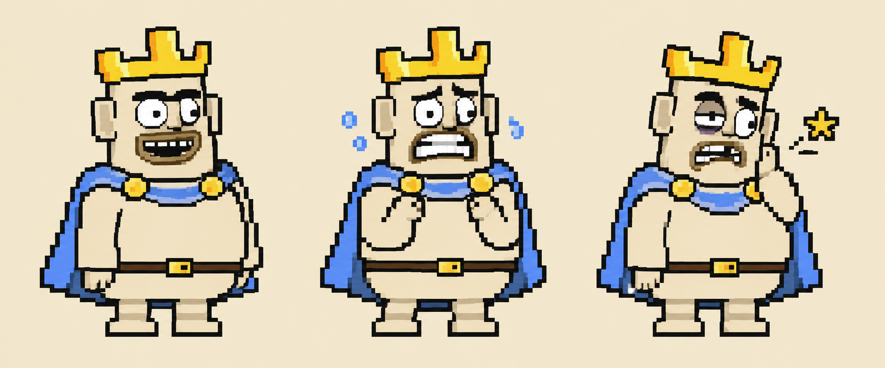

# Direção confirmada pelo autor — 19/09/2026

Esta revisão corrige a escolha de referências da primeira implementação do PR #24. O autor esclareceu que o arqueiro usado era um conceito rejeitado, o rei precisava de redesign e os personagens enviados estavam quase completos. Essa orientação prevalece sobre inferências de aprovação feitas a partir dos arquivos antigos.

**O elenco quase concluído é a base visual para o que vier a seguir.** Estar exportado, passar testes ou aparecer no jogo não torna um desenho aprovado.

## 1. Quais desenhos orientam o trabalho

| Referência | Situação | Uso correto |
| --- | --- | --- |
| [Soldado isolado](references/2026-09-19/soldier.png) | Quase concluído; referência principal | Preservar corpo, sorriso, olhos pequenos, elmo, escudo azul e proporção das mãos/pés. Usar para avaliar novas tropas |
| [Cozinheiro e personagem do balcão](references/2026-09-19/cook-and-counter.png) | Quase concluídos; referências de ofícios e atuação | Conservar a língua e o barrete do cozinheiro; a massa corporal, o bigode e a pose do personagem no balcão. Sua função não será rebatizada por inferência |
| [Guerreiro de espada grande](references/2026-09-19/castle-and-cast.png) | Referência enviada junto ao elenco | Preservar o contraste entre a arma exagerada, a postura e a expressão. Não transformá-lo automaticamente em ferreiro ou tropa pequena |
| Rei no mesmo recorte | **Redesign necessário** | Preservar identidade cômica, barriga, coroa e capa; rever proporção, rosto, roupa e silhueta em conjunto com a tropa |
| `Archer Troop.aseprite` usado na primeira integração | **Conceito rejeitado** | Arquivo histórico, sem export/runtime e sem autoridade sobre os novos rostos ou corpos |
| Arquitetura nos dois recortes originais | Base do autor, ainda a melhorar | Refinar volumes, materiais e integração ao terreno preservando seus arcos, alvenaria, madeira e telhados |
| [Panorama enviado](references/2026-09-19/kingdom-composition.jpeg) | Referência de composição e acabamento | Usar para distribuição horizontal, profundidade, vegetação e conexões. A imagem não aprova automaticamente todos os personagens nela nem fornece sprites/tiles prontos |

Os arquivos de referência são cópias intactas dos anexos. [sources.json](references/2026-09-19/sources.json) registra nomes recebidos, papéis e hashes. As fontes Aseprite continuam separadas em `art/source/originals/`.

## 2. O que preservar no elenco

- **Rosto:** boca larga com forma própria e dentes agrupados; olhos pequenos ou parcialmente cobertos; assimetria intencional. O rosto comanda o humor.
- **Corpo:** massas simples e membros curtos, com variações próprias de cada personagem. O cozinheiro não ganha um corpo maior apenas por ter um chapéu alto.
- **Contorno e cor:** borda escura limpa, tons creme, agrupamentos de pixels e poucos tons por material. Acrescentar detalhe só quando ajudar a reconhecer o personagem ou sua ação.
- **Identidade de ofício:** pose, acessório e atuação. Manter a língua do cozinheiro e a pose do balcão; não uniformizar todos com um sorriso fechado ou uma armadura genérica.
- **Roupa:** mudanças medievais específicas onde faltarem; os personagens quase completos não recebem uma reformulação geral sem necessidade.
- **Escala:** avaliar corpos lado a lado e pela mesma linha dos pés. As referências 32/64 orientam autoria; fontes existentes não são reduzidas por filtro para caber nesses números. O corpo da tropa Aseprite mede 24×47; o arquivo atual do rei mede 46×90 e permanece provisório.

Antes de variar classe, equipamento ou bioma, confrontar a nova peça com o soldado e o cozinheiro. Evitar olhos fofos genéricos, bocas indistintas, textura em excesso e resolução aparente diferente.

## 3. Primeiro estudo do rei

O estudo gerado nesta revisão explora silhueta compacta, capa azul, cintura simples e expressões de repouso, medo e dor. É **uma proposta de design**, não arte aprovada, não uma folha de animação e não um sprite nativo de 64×64. O traço e a densidade de pixels ainda precisam ser reconciliados com os originais na autoria final. Não foi inserido no runtime.

O [brief utilizado](references/2026-09-19/king-study-brief.md) descreve as referências e os limites. A versão antiga do rei continua apenas como representação temporária até existir um desenho revisado adequado à integração.

## 4. Correção imediata no jogo

- O export `archer.png` e sua região no atlas foram retirados. A fonte rejeitada permanece identificada como histórica.
- Arqueiros usam provisoriamente **Body + Face da tropa original**, com a marca de arco já existente. Isso mantém rosto e escala da família e permite reconhecer a função enquanto o redesign está em aberto.
- O arco acompanha a direção e os limites do corpo, sem recortar o rosto nem trocar a identidade do personagem. É um recurso transitório de apresentação.
- O manifesto distingue `near_complete_reference`, `redesign_required`, `derived_temporary` e `author_base_needs_refinement`. Nenhum desses estados equivale a aprovação final.
- A checagem de exportação recusa PNGs obsoletos; o teste de integração impede a volta silenciosa do arqueiro rejeitado.

## 5. Como melhorar o cenário do autor

| Prioridade | Intervenção | Critério de leitura |
| --- | --- | --- |
| 1 — Circulação | Conectar patamares por escadas, rampas, pontes e acessos que correspondam às passagens reais | O jogador consegue antecipar como chegar a cada nível |
| 2 — Volumes | Rever sobreposição árvore/castelo, espessura dos arcos, apoio de passarelas e encontro das fachadas com o chão | Construções apoiadas e entradas desobstruídas; árvore central como marco |
| 3 — Vegetação | Completar copa em massas e raízes ligadas à arquitetura; distribuir grupos com intervalos | A árvore tem grandeza; troncos e folhagem não cobrem rostos nem portas |
| 4 — Materiais | Unificar telhados, pedra e madeira; reduzir manchas pequenas sem função | Personagens simples continuam legíveis sobre a arquitetura detalhada |
| 5 — Profundidade | Separar planos por contraste e saturação; distribuir serviços horizontalmente | A vista conserva amplitude e respiração sem empilhar todo o reino verticalmente |
| 6 — Luz | Usar acentos quentes nos locais ativos e testar noite com as mesmas silhuetas | Luz guia navegação e função sem esconder personagens |

O cenário integrado no PR continua parcial: os grandes planos lisos e os troncos sem copa ainda não atendem a esse acabamento. Esta revisão fixa o trabalho necessário; não declara que essas melhorias já foram desenhadas.

## 6. Ordem de produção

1. Fechar um corpo do rei ao lado do soldado e do cozinheiro, preservando a atuação facial.
2. Derivar o arqueiro dessa família, validando rosto, postura e leitura do arco antes dos ciclos.
3. Completar apenas os estados/ações que faltam nos personagens quase prontos.
4. Refinar um trecho do castelo, oficina e passagem com esses personagens em escala real.
5. Expandir o sistema ao restante do elenco e do reino após essa comparação.

A aprovação artística pertence ao autor. Testes automatizados verificam integridade, tamanhos, tempos e seleção de arquivos; não determinam qualidade ou conclusão do desenho.
