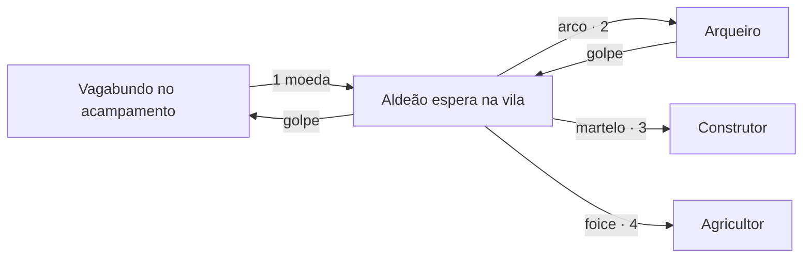
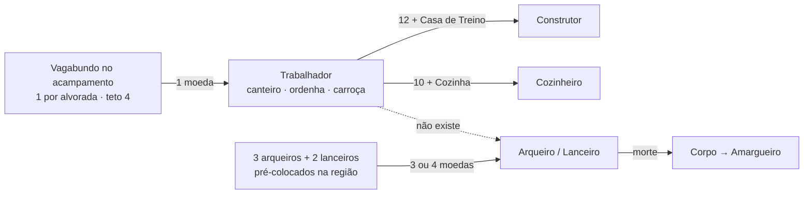
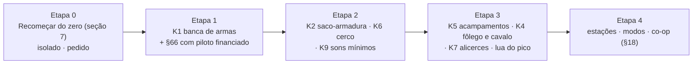
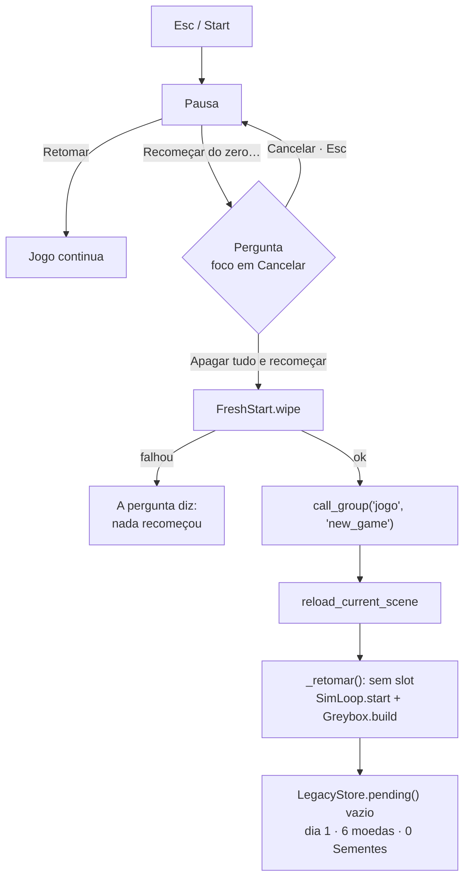

# Empire × Kingdom: análise de gameplay na `main` e o "Recomeçar do zero"

**Data:** 29 de setembro de 2026.
**Base analisada:** `main` no commit [`33c3559`](https://github.com/henriquecoding/empire/commit/33c3559d62b8c03629811f9b87bb7a4f7e7e2c40) (merge do PR #50, "Painel de 29/09: as 66 respostas do dono, implementadas").
**Escopo:** diagnóstico e propostas. Nenhuma linha de jogo, dado de balanceamento, arte ou decisão do dossiê foi alterada. Este arquivo é o único entregável.

> **Como ler.** A seção 0 resume tudo em três minutos. A seção 3 compara o Empire com o Kingdom peça a peça. A seção 4 traz os achados novos, com evidência. A seção 5 dá o roteiro de gameplay. A seção 7 é o desenho técnico completo do **Recomeçar do zero**, pronto para virar ticket. As perguntas das seções 4, 5 e 7 estão prontas para colar no `docs/QUESTIONS.md` (seção 9). Os números valem para esta data: a fonte viva continua sendo o `docs/recovery/validation.json` e os CSV.

---

## 0. Leitura de três minutos

**Estado.** A `main` está saudável. O CI está verde (corrida [#258](https://github.com/henriquecoding/empire/actions/runs/36573738544)) e o deploy de produção na Vercel está `READY` no mesmo commit, construído em 31 s. Dos 99 tickets, 75 estão feitos, 11 parciais e 13 por fazer. O ciclo curto do Kingdom (recrutar, caçar, pagar, ver construir, colher, sobreviver à noite) existe inteiro. Por cima dele, o Empire acrescenta o que o Kingdom não tem: a Podridão com massa e Lume, as três faixas, a sucessão, o legado, as ofertas, os títulos, o ânimo e os vassalos.

**O que a comparação com o Kingdom revela.** O Empire herdou bem a *superfície* do Kingdom (moeda física, um verbo de pagar, recrutados que esperam na vila, decay em vez de reset). Faltam três *engrenagens* que fazem o Kingdom escalar e criar tensão:

| # | Achado | Por que importa | Prioridade |
|---|---|---|---|
| **K1** | **O teto militar.** A região tem **3 arqueiros e 2 lanceiros para sempre**. Um vagabundo nunca vira soldado: só trabalha (canteiro, ordenha, carroça) ou vira ofício. **Medido:** em 10 dias só nasceram vagabundos. O instrumento do §66 afina a noite contra **12 arqueiros**, um exército que a partida não consegue ter. | No Kingdom, o exército cresce comprando ferramentas: qualquer aldeão vira arqueiro com um arco de 2 moedas. Sem isso, moeda sobrando não vira defesa, e a curva da noite está calibrada contra algo inalcançável. | **P0** |
| **K2** | **O saco não protege o rei.** O rei tem 60 de vida e as moedas só caem quando ele morre. | No Kingdom, cada golpe arranca moedas e a coroa só cai com o saco vazio. Carregar moedas à noite é armadura *e* risco. É a tensão mais barata do gênero. | P1 |
| **K6** | **A marcha ganha sempre** que leva 3 ou mais (ADR 0035, Q-159 aberta). | No Kingdom, atacar um portal tem atrito: o portal não regenera vida e as tropas podem não voltar. Conquista sem risco não é decisão. | P1 |
| **K5** | **Acampamentos sem custo de oportunidade.** Ficam fixos a ±1650 px e nada os destrói. | No Kingdom, expandir derruba árvores e com elas os acampamentos. "Crescer ou continuar recrutando" é a decisão espacial do gênero. | P1/P2 |
| K3, K4, K7, K8, K9 | Despromoção em vez de morte; fôlego e montaria; alicerces no decay; calendário e estações; som. | Ver a seção 4. | P2 |

**O Recomeçar do zero.** Hoje não existe. O botão "Novo jogo" só aparece depois da derrota (ou na escolha do herdeiro) e **herda o legado**: a sonda mostrou 4 Sementes, 2 segredos e 11 obras de pé no jogo seguinte. Até o `-- --novo` da linha de comando herda o legado, embora o `docs/POR_FAZER.md` ainda o chame de "partida do zero". A proposta (seção 7) é pequena e isolada:

- `src/core/fresh_start.gd`: apaga os 3 slots e o legado, com os temporários.
- `src/ui/fresh_start_panel.gd`: o botão "Recomeçar do zero…" e a confirmação, com o foco em "Cancelar".
- Mais 4 linhas no `PauseMenu`, 5 chaves no `strings.csv` e um arquivo de testes.
- O `game.gd`, que já está nas 250 linhas, **não muda**: o `new_game()` de hoje, com o disco limpo, já é um jogo do zero.

A sonda com o motor 4.7.2 confirmou o caminho: dia 1, 6 moedas, 0 Sementes, 0 segredos, 0 obras, e as opções preservadas.

**GitHub e Vercel.**

- O GitHub ainda anuncia `claude/gracious-ptolemy-efyrb5` como ramo por omissão, ao contrário do que diz o `AGENTS.md`.
- O PR #24 (rascunho de arte) está parado desde 19/09, sobre essa base antiga.
- O `validation.json` diz motor 4.6 e `gdunit_passed: 877`, contra 1007 casos descobertos. É estado derivado desatualizado.
- A Vercel está bem: build de 31 s, 43 MB de site, jogo web com `.wasm` de 37,7 MB (cerca de 10 MB transferidos). Os previews ficam atrás do login da Vercel. O jogo web não tem controles de toque.

---

## 1. Escopo, base e método

| O quê | Como | Resultado |
|---|---|---|
| Código e dados da `main` | Checkout de `33c3559`, leitura de `AGENTS.md`, `docs/design/`, `docs/QUESTIONS.md`, ADR 0033–0036, sistemas em `src/` e CSV em `data/source/` | Base desta análise |
| Continuidade | Leitura das auditorias de [26/09](AUDITORIA-GAMEPLAY-2026-09-26.md) e [27/09](AUDITORIA-GAMEPLAY-2026-09-27.md) e do `RETOMADA.md` | Este relatório não repete o que elas já propuseram e foi feito (AUD-01 a 05, CONT-01 a 04) |
| CI | GitHub Actions, workflow `ci` | Corrida #258 na `main`: **success** (5 jobs, cerca de 6,5 min) |
| Vercel | Projeto `empire` (time "Hamriki's projects", plano Hobby): deploys, log de build e página `/jogar/` de produção | Deploy `dpl_6cogiJT7iHzx8jTM44RYBkZbbipt` **READY**, alvo produção, commit `33c3559` |
| Motor | Godot **4.7.2-stable** (`ed1daf0bf`) em *headless*, o mesmo que a Vercel usa | Projeto importa sem erros |
| Sonda de gameplay | Cena temporária (não versionada; código e saída no Anexo A) | K1 e o caminho do Recomeçar do zero **reproduzidos** |
| Suíte | `./run_tests.sh` com o 4.7.2 | Ver 1.1 |
| Kingdom | Wiki oficial da comunidade, Raw Fury, Steam, análises; o §02 do dossiê | Fontes na seção 10 |

**Rótulos de evidência** (os mesmos das auditorias anteriores): **Reproduzido** (a sonda ou a suíte executou), **Confirmado no código** (caminho rastreado, sem execução), **Proposta** (mudança sugerida, que precisa de decisão do dono).

**Limites.** Não houve sessão humana com teclado e olhos, nem GPU, nem Steam Deck. Sensação, legibilidade e diversão continuam sendo hipóteses. Os números do Kingdom são referência de escala e de estrutura, nunca alvo: o §02 já diz "herda a escala, não a estrutura".

### 1.1 A suíte, hoje

`./run_tests.sh` com o Godot 4.7.2 nesta máquina: **1007 casos, 1004 executados, 3 saltados (com a razão escrita), 0 erros, 0 órfãos, 1 falha**, em 13 min 46 s.

A falha é o orçamento de tempo do §63: `minuto_0_20_test.gd › test_um_tick_inteiro_com_300_unidades_e_moedas_no_chao` mediu **4934,7 µs contra os 4000 µs** da simulação inteira. É uma medição dependente da máquina. No *runner* do GitHub a mesma suíte passa (corrida #258 verde), e esta máquina é cerca de três vezes mais lenta (a auditoria de 27/09 correu a suíte em 4 min 42 s). O commit `79bc3a4` já registava o mesmo teste a falhar "nesta máquina antes das alterações". **Não é uma regressão da `main`.** Deixa, porém, uma pergunta útil para a Vercel: o jogo web corre em WebAssembly sem threads, e **ninguém mediu o tick de 300 unidades no browser**, onde o orçamento do §63 é mais apertado do que no nativo (2.2).

---

## 2. A `main` hoje: GitHub, Vercel e o jogo

### 2.1 GitHub

| Item | Estado | Observação |
|---|---|---|
| Ramo por omissão | **`claude/gracious-ptolemy-efyrb5`** (API: `default_branch`) | O `AGENTS.md` diz "A `main` é o ramo por omissão". A auditoria de 27/09 já tinha caído nesta armadilha. Afeta a base padrão dos PRs, o clone e a vista do GitHub. Correção: *Settings → General → Default branch → `main`*. |
| PRs abertos | **#24** (rascunho, "Integrar arte original e refinar apresentação dos Enramados"), aberto desde 19/09 | A base é o ramo antigo (`b018fb1`). Precisa de decisão: fechar, ou refazer sobre a `main`. |
| CI | Verde na `main` (#258) e no PR #50 (#257) | Das últimas 30 corridas, as falhas e cancelamentos foram todos em ramos de trabalho, corrigidos antes do merge |
| Backlog | 99 tickets: **75 feitos, 11 parciais, 13 por fazer** | Por fazer: ART-01 a 04, CONT-06, 07, 09, 10 e 11, F0-09, F0-15, NB-01, XIII-09 |
| Código | Cerca de 22,4 mil linhas de GDScript em `src/` e 18,2 mil em `tests/` | Nenhum script passa das 250 linhas (portão `gdlint`) |

### 2.2 Vercel

| Item | Estado |
|---|---|
| Produção | `empire-phi-eight.vercel.app`: página em PT e EN, o jogo em `/jogar/` e o dossiê em `/dossie/` |
| Último deploy de produção | `33c3559`, READY. Build de **31 s** numa máquina de 2 núcleos, com cache de 158 MB restaurado |
| Tamanhos | Site com 43 MB. `index.wasm` com **37,7 MB** (o motor), `index.pck` com **0,9 MB** (o jogo inteiro), `index.js` com 0,3 MB. A página declara "jogo 10 MB", o transferido com brotli |
| Proteção | *Standard Protection* (SSO nas URLs de deploy, exceto nos domínios de produção). Os previews de PR exigem login na Vercel |
| Erros recentes | Dois deploys em `ERROR` entre a noite de 28/09 e a madrugada de 29/09 (UTC), no ramo `claude/gallant-meitner-8pwt13` (`79bc3a4`, `b87f396`). O log do segundo diz porquê: `dados: docs/design/04-…md: 6 povos, o peoples.csv tem 8`. O site confere o dossiê contra os dados e recusou o build até o `4781cc2` corrigir. Funciona como portão, como pretendido |
| Painel público | O build conta "perguntas 163 (154 abertas)". O parser (`tools/web/perguntas.mjs`) só reconhece "Fechada" como encerrada, por isso as "Decididas pelo dono" aparecem como "confirmar". Não é defeito, mas pode confundir quem lê o painel |
| Jogo no telemóvel | A casca avisa que não há controles de toque. O jogo só se joga com teclado ou comando |
| Desempenho no browser | O *preset* Web tem `thread_support` desligado (serve-se de qualquer servidor estático). O orçamento do §63 (4 ms por tick) só é medido no nativo. Nesta máquina, o tick de 300 unidades já passa dos 4 ms (1.1). Vale medir no `/jogar/` com o perfilador do browser antes de a população crescer (K1 aumenta o número de tropas) |

### 2.3 O jogo, pelo que roda

O `RETOMADA.md` descreve bem a arquitetura e o histórico. Aqui interessa o que um jogador *faz* numa partida da `main`:

1. Acorda com **6 moedas** junto ao castelo-árvore (`start_coins`), com o escudeiro atrás (apanha moedas) e 2 vagabundos já seus.
2. Recruta com uma moeda: o recrutado vai para o núcleo e espera trabalho, como no New Lands (ADR 0033). Há 2 vagabundos livres, 3 arqueiros a 3 moedas e 2 lanceiros a 4.
3. Paga obras em sítios fixos (§55): muralhas em 5 degraus (6, 11, 20, 36, 65 moedas), com caminho A/B, torres, canteiros, galinheiros, pesqueiro, celeiro, casas de ofício, casa do herdeiro, escoras e poços no subsolo.
4. Os arqueiros caçam de dia nas tocas e entregam a moeda ao rei. Os canteiros rendem por fase com o trabalhador no posto.
5. À tarde, o jogo anuncia de que lado vem a noite. Ao crepúsculo, a mancha nasce na base do Lume e gasta massa a invocar. Há um pico a cada 6 noites (×1,3) seguido de uma calma (×0,6). A massa cresce ×1,06 por noite a partir da noite 11 (Q-157).
6. A cada alvorada chega **um vagabundo**, alternando entre os dois acampamentos, até haver 4 livres (mais um se o reino estiver animado, nenhum se estiver abatido).
7. Pode morrer: o núcleo ou o rei sem herdeiro acabam a partida (`Defeat`). O legado fica com 40% das obras, as Sementes e os segredos.
8. A partir do dia 11, a bifurcação manda uma marcha conquistar o povo seguinte (ADR 0035). Apagar o Lume (de dia, com farol e Dívida ≤ 3) acaba o ciclo em União.

---

## 3. O Kingdom, peça a peça, e o que o Empire faz com cada uma

A leitura do §02 continua certa: o Kingdom funciona por decisões que parecem acidentais. A tabela abaixo pega cada peça do Kingdom (Classic, New Lands, Two Crowns e Eighties), descreve como ela funciona lá e diz o que existe na `main`.

**Legenda:** ✅ herdado · 🔶 parcial ou transformado · ❌ ausente · 🚫 recusado de propósito

| # | Peça do Kingdom | Como o Kingdom faz | Empire na `main` | Estado |
|---|---|---|---|---|
| 1 | **Um só botão: pagar** | Recrutar, construir, melhorar, alimentar: tudo é largar moeda | Verbo 1 (`Verbs`, `CoinTarget`), mais o Verbo 2 contextual (§05) | ✅ |
| 2 | **Moeda física, saco com teto** | Cada moeda é um objeto: cai, rola e é roubada | `CoinSystem` com arco, sombra e salto. Saco do rei com **33** (`units.csv`). A moeda caída é de quem passa (`Gleaning`) | ✅ |
| 3 | **O saco é a vida; a coroa cai** | Um golpe arranca moedas. Sem moedas, a coroa cai e um Greedling que a apanhe acaba o jogo | O rei tem **60 de vida** (`tank`). As moedas só caem na morte (`combat_system.gd:245`) | ❌ (K2) |
| 4 | **Recrutar no acampamento** | O vagabundo corre para a moeda, apanha e vai esperar na vila | `RecruitSystem` e `Retinue` (ADR 0033). `Camps`: 1 por alvorada, teto de 4, ânimo ±1 | ✅ |
| 5 | **A ferramenta dá o ofício** | Arco 2, martelo 3, foice 4: o aldeão mais próximo pega e vira arqueiro, construtor ou agricultor | Ofícios de casa (construtor 12, ferreiro 15, cozinheiro 10…). **Arqueiros e lanceiros já nascem prontos** e só existem 3+2 na região | ❌ para soldados (K1) |
| 6 | **Despromoção em vez de morte** | Um golpe tira a ferramenta (vira aldeão), outro tira a moeda (vira vagabundo) | Morte permanente (§16). O corpo alimenta os Amargueiros (§74) | 🚫 hoje; proposta híbrida (K3) |
| 7 | **Expandir derrubando floresta** | Pagar para cortar árvores abre terreno e **destrói acampamentos** vizinhos. A Casa de Cidadãos substitui o acampamento a preço maior | Sítios de obra pré-definidos (§55). Acampamentos fixos (`greybox.gd:70`). A decisão da árvore existe noutra forma: cada Amargueiro de pé dá +22 de massa | 🔶 (K5) |
| 8 | **Muralhas por níveis, torre que acerta** | Arqueiro com cerca de 1/3 de precisão no campo e perto de 100% na torre | 5 degraus com caminho A/B, postos com presença física. D3 e D4 corrigidos em 26/09 | ✅ |
| 9 | **Produção e inverno** | Quintas junto à água, pesca, caça. No inverno a erva e as tocas somem, o veado para e as colheitas morrem | Canteiros, galinheiros, pesqueiro, tocas (`Burrows`), celeiro que converte. **Sem estações** | 🔶 (K8) |
| 10 | **Ritmo: Lua de Sangue e estações** | Estação de 16 dias. Lua de Sangue cerca de 2 dias antes de cada mudança de estação, duas por estação a partir do 3.º ano | Pico de 6 em 6 noites seguido de calma, aviso à tarde do lado, crescimento a partir da noite 11. **Sem calendário visível** | 🔶 (K8) |
| 11 | **Ofensiva: destruir portais** | 4 moedas no estandarte enviam um escudeiro ou cavaleiro com o grupo. O portal **não regenera vida**. A bomba implode a caverna do portal do penhasco | `March` (Verbo 2 na bifurcação, dia 11+, teto do barco do New Lands) **ganha sempre com 3 ou mais**. `Lume` apaga-se de dia, com farol e Dívida baixa | 🔶 (K6) |
| 12 | **Ilhas e barco** (New Lands, Two Crowns) | Cada ilha é um lugar novo, mais duro, com eremitas e montarias próprios | ADR 0035: **o rei fica**; os povos conquistam-se de longe e viram vassalos. Uma única região jogável (greybox); CONT-10 por fazer | 🔶 transformado |
| 13 | **Desbloqueios permanentes** | Gemas destravam estátuas, eremitas e montarias, que ficam para os herdeiros | Sementes Reais, estátuas (`Discoveries`, coluna `teaches` do `secrets.csv`), impulsos, classes. O legado leva `found` e as Sementes | ✅ análogo |
| 14 | **Montarias com fôlego e poder** | Galope limitado pelo fôlego, recuperado a pastar no alimento próprio. Poderes: o veado atrai veados, o cavalo de guerra protege | 6 perfis só em dados (§12). O estábulo não tem sistema. Correr (Shift) é ×1,8 **sem limite** (Q-149) | ❌ (K4) |
| 15 | **Perder a coroa** (Two Crowns) | O herdeiro recomeça na 1.ª ilha. Mais 100 dias de decay nas ilhas. Gemas e portais destruídos ficam. **Muros e torres deixam alicerces** que se reerguem no nível que tinham | Casa do herdeiro (5 moedas por alvorada, 10 dias). Decay: 40% das obras intactas, **60% somem sem rastro** | ✅ com uma lacuna (K7) |
| 16 | **Duas coroas (co-op)** | Ecrã dividido e online | §18, Fase 8. O determinismo e a fila de intenções já preparam o terreno | ❌ planejado |
| 17 | **Modos: desafio e sobrevivência** | Ilhas de desafio, as *Survival Mixtapes* do Eighties | `chaos_modifiers.csv`, a flag de modo `vassals_can_fall`, semente reproduzível. **Sem escolha de modo** | 🔶 |
| 18 | **Recomeçar** | Nova campanha a partir do menu | **Sem menu principal**. "Novo jogo" só depois da derrota e com legado | ❌ (seção 7) |

### 3.1 Os dois circuitos de gente, lado a lado

No Kingdom, a população é **uma só**. Qualquer vagabundo passa por aldeão e vira o que a ferramenta disser:



No Empire há **duas populações que não se tocam**: gente que trabalha, que se renova, e gente que luta, que não se renova.



O preço do arqueiro no Empire (3) já é, por coincidência feliz, **vagabundo (1) + arco (2)**, o preço total do Kingdom. Os dados já estão prontos para o circuito do Kingdom. Falta só o caminho.

---

## 4. Achados novos, com evidência

### K1 · O teto militar: 3 arqueiros e 2 lanceiros por região, para sempre (P0)

**Reproduzido.**

- A região põe gente para recrutar em posições fixas: 4 vagabundos (2 deles já teus), **3 arqueiros**, **2 lanceiros** (`src/world/greybox.gd:66-69`, `:224-228`).
- A única fonte de gente nova é o `Camps.dawn()`, que só cria o perfil `vagrant` (`src/core/camps.gd:12-30`).
- O vagabundo só serve para `farm`, `milking` e `cart` (`job_affinity` no `data/source/units.csv`). As casas de ofício formam construtor, ferreiro, cozinheiro, diplomata e bardo, nunca soldados (`src/core/sim_factory.gd:197-205`: `trained_at`).
- Os outros `spawn()` do código são o rei (sucessão), a comitiva do legado (quem já existia) e as criaturas.
- **Sonda:** no dia 1 há `archer/livre: 3`, `spearman/livre: 2`, `vagrant/livre: 2`. Do dia 1 ao 10 nasceram **`vagrant: 2`** e mais nada (Anexo A).
- O critério de saída da Fase 1 (§66) mede-se com "a muralha de ferro no outro flanco, as duas torres e **doze arqueiros** — os postos dos dois flancos são treze" (`tests/dez_dias_test.gd:24-26`). A receita do §07 pede **seis**. Nenhuma das duas cabe numa partida real.

**Consequências para quem joga.**

- Dos 13 postos de defesa da defesa de referência, no máximo 5 terão gente (o rei e o escudeiro não ocupam postos). As torres e os degraus altos de muralha, que "multiplicam" arqueiros (§07), multiplicam 3.
- *Inferência de design, a medir:* depois dos primeiros dias, a moeda que sobra não tem onde virar defesa móvel. Só vira pedra. É o "rico demais" que o van den Berg admite no Kingdom, mas por outra razão: não há *em que* gastar gente.
- A noite (Q-157) e os testes de design afinam-se contra um exército hipotético. O CONT-05 ("medição fiel da partida") fica impossível de fechar enquanto o piloto não conseguir *comprar* soldados.
- A morte de um arqueiro é irreparável. No tom do §74 isso é bonito, mas economicamente é um beco: um arqueiro morto na noite 3 é 1/3 do arco da região para sempre.

**Proposta K1-a (a do Kingdom, recomendada): a banca de armas.** É uma obra perto do núcleo, com a moeda largada nela (Verbo 1). Cada moeda compra uma arma que fica **visível num suporte** (o *rack* do Kingdom, com teto de 4). Um recrutado que espera no núcleo sem posto vai lá, pega e **vira arqueiro** (arco, 2 moedas: a diferença de 3 − 1 que o `units.csv` já tem) ou **lanceiro** (lança, 3 moedas: 4 − 1). Nada de novo no gesto:

- É o mesmo destino resolvido no gesto do AUD-01 (`CoinTarget`).
- O suporte é informação diegética: quantas armas esperam dono.
- O `weapon_dropped` do §46 já existe para a arma que cai de quem morre (e, com o Ferreiro nível 2 do §09, "o campo de batalha vira inventário").

O que falta:

- Uma linha em `buildings.csv` (em `_proposed`).
- Um posto em `jobs.csv`.
- Um sítio na greybox.
- Um sistema puro pequeno (`Arsenal`, abaixo de 150 linhas) ou a generalização do `TrainingSystem` com a variante A/B que já existe (`SlotVariant`, Q-136).
- Testes, e depois refazer o §66 com um piloto que **financia** a defesa (CONT-05).

**Proposta K1-b (mínima, só dados):** o acampamento sorteia o perfil do recém-chegado (por exemplo 70% vagabundo, 20% arqueiro, 10% lanceiro, no fluxo `world`). É uma linha no `economy.csv` e uma no `Camps`. Resolve o teto, mas não é Kingdom: a pessoa chega pronta e o jogador não decide.

**Decisão do dono:** Q-A (seção 9). Muda uma mecânica e não está no dossiê.

### K2 · O saco não protege o rei (P1)

**Confirmado no código.** O combate tira vida ao rei como a qualquer tropa, e o `carried_coins` só vai ao chão no `unit_died` (`src/sim/systems/combat_system.gd:245`). No Kingdom, cada golpe no monarca arranca moedas. Sem moedas, a coroa cai na direção oposta ao golpe, e só a perde quem deixa uma criatura apanhá-la (Kingdom Wiki: *Crown*, *Greedling*).

**Por que vale a pena no Empire, e mais do que no Kingdom:**

- **É a decisão da noite que falta.** Levar 30 moedas para a muralha é armadura (a uma moeda por golpe, aguenta 30) e é risco (as moedas ficam no chão, para quem passar primeiro).
- **Liga-se ao que o Empire já tem de único.** Moedas arrancadas dentro da mancha **alimentam o Lume** (ADR 0034: o Lume "alimenta-se do que ela consome (moedas…)"). É o título do §74 ao pé da letra: "o combustível és tu". Fora da mancha, o `Gleaning` decide: um vagabundo ou uma tropa apanha.
- **Não conflita com a sucessão.** A vida continua a existir; o saco é uma camada por cima. Uma fase "coroa no chão" até à alvorada encaixa no §16 ("ressurreição até ao amanhecer").

**Proposta.** Um golpe no rei com o saco não vazio arranca `king_hit_coins` moedas (em dados, `_proposed`) e não tira vida. Com o saco vazio, tira vida como hoje. **Decisão:** Q-B.

### K3 · Morte em vez de despromoção (P2, decisão de tom)

**Confirmado no código e no dossiê.** A morte de tropa é permanente (§16) e os corpos que ficam no campo são a matéria dos Amargueiros (§74). No Kingdom, o primeiro golpe tira a ferramenta e o segundo tira a moeda. O jogador perde *investimento*, não *gente*, e recupera com moeda. Isto mantém o Kingdom recuperável, que é a "recuperação antes de novas punições" pedida na auditoria de 27/09 (§7.4).

**Proposta híbrida (só faz sentido depois de K1):** uma tropa armada que chega a 0 de vida **larga a arma** (`weapon_dropped`, já no catálogo) e foge como trabalhador. Só morre quem cai sem arma. Com a banca de K1, rearmar custa 2 ou 3 moedas. O impacto no §74 é real: menos corpos significa menos Amargueiros e menos massa. Precisa de afinação e da palavra do dono sobre o tom. **Decisão:** Q-C.

### K4 · Deslocar-se não pede decisão: nem fôlego nem montaria (P2)

**Confirmado no código.**

- Correr é ×1,8 enquanto o Shift estiver premido, sem custo (Q-149, `king_run_mult`).
- As 6 montarias do §12 existem só como dados. O `mount_stable` não tem sistema.
- O §12 diz que andar a pé "é deliberadamente frustrante depois do dia 6 — é o que dá valor à primeira montaria".
- O §02 justifica os preços acima de 33 com o **cavalo de tração**, que "carrega o dobro de moedas". Hoje o saco do rei (33) é menor que o degrau do Bastião (65): pagar um Bastião exige pelo menos duas viagens.

**No Kingdom:** o galope gasta fôlego, e o fôlego volta parando em cima do alimento da montaria. As montarias têm poderes: o veado atrai veados, o cavalo de guerra dá um escudo temporário a quem está perto, o grifo come em qualquer lado (Kingdom Wiki: *Mounts*, *Stag*, *Warhorse*).

**Proposta, em dois passos.** (1) Fôlego para o correr, com recuperação parado. Muda uma decisão do dono (Q-149), por isso vai para Q-D. (2) O cavalo de tração do §12 como primeira montaria (1,7×, saco a dobrar), porque é o único que o próprio dossiê liga à economia.

### K5 · Acampamentos sem custo de oportunidade (P1/P2)

**Confirmado no código.** Os dois acampamentos ficam a ±1650 px (`greybox.gd:70`), fora das muralhas, e nada os destrói. No Kingdom, cortar qualquer das árvores vizinhas de um acampamento apaga-o para sempre. Desde o *Conquest Update*, as ruínas podem virar uma **Casa de Cidadãos** (até 3 cidadãos, a preço maior) (Kingdom Wiki: *Vagrant camp*, *Citizen house*).

**Proposta.** O acampamento pertence ao terreno. Levantar uma muralha além dele, ou abater o Amargueiro ao lado, acaba com ele, e as ruínas aceitam uma casa de cidadãos (obra cara, teto de 3, recrutas mais caros). Dá ao espaço a decisão "crescer ou continuar a recrutar" sem verbo novo. Compõe com K1: quem fecha os acampamentos cedo fica com a população que tem. **Decisão:** Q-E.

### K6 · A marcha ganha sempre (P1), liga à Q-159

**Confirmado no código e na ADR 0035**, que o diz: "Hoje a marcha ganha sempre que leva três ou mais; o preço é a noite sem eles". O §13 descreve três tempos: **Reconhecimento** (ver muralha, defensores e idade do rei inimigo), **Marcha** e **Cerco**. Só existe o do meio.

**No Kingdom:** o ataque a um portal custa 4 moedas por grupo no estandarte, o portal **não regenera vida** (o dano de um ataque fica para o seguinte) e os grupos perdem moedas e gente (Kingdom Wiki: *Portal*, *Knight*, *Bomb*).

**Proposta (dentro do que o §13 já diz):**

- Cada povo do plano tem uma **firmeza de fortaleza** (degrau de muralha e defensores, pelo perfil de ganância do §15).
- O reconhecimento revela-a ao meio-dia (o §05 já dá ao meio-dia "fortalezas inimigas detetam presença").
- A marcha tira firmeza, que **persiste** entre marchas, como o portal do Kingdom, e volta com baixas deterministas (fluxo `combat`).
- Conquistar passa a ser planeável ("mais uma marcha e cai"), com preço em gente, não só uma noite sem guarda. **Decisão:** Q-F (resolve a Q-159).

### K7 · O decay apaga 60% sem deixar marca (P2)

**Confirmado no código.** `Legacy.kept()` guarda as `round(40%)` obras mais caras. As outras não deixam nada (`src/sim/systems/legacy.gd:104-115`). No Two Crowns, muros e torres destruídos deixam **alicerces** que se reerguem no nível que tinham (Kingdom Wiki: *Islands in Two Crowns*, *Decay*).

**Proposta.** O que o decay leva deixa uma ruína com o degrau, o caminho e a variante (os campos que o legado já grava). Reerguê-la custa uma fração do investido (`decay_rebuild_frac`, em dados). O herdeiro vê o reino do antecessor no chão, que é a história que o §16 quer contar ("perder tem de doer sem apagar meses de jogo"). **Decisão:** Q-G.

### K8 · O ritmo longo não tem calendário (P2)

**Confirmado no código e nos dados.** O pico de massa vem de 6 em 6 noites (`rot.csv`: `peak_every`, ×1,3; calma ×0,6). O aviso é à tarde, só do lado. No Kingdom, a Lua de Sangue está presa ao calendário, cerca de dois dias antes de cada mudança de estação. O inverno muda a economia: a erva e as tocas somem, o veado para, as colheitas morrem quando o ribeiro gela e os agricultores passam a colher arbustos de inverno (Kingdom Wiki: *Seasons*, *Blood Moon*).

**Proposta, em dois tamanhos.**

- **Pequeno:** a lua do `SkyView`, que já diz a hora, diz também a noite funda **na véspera** (lua cheia a crescer, e vermelha na noite de pico). Informação que permite resposta, como pede a auditoria de 27/09 (§7.1).
- **Grande:** estações, com um inverno que para os canteiros e baixa a caça. É uma pressão de planejamento de longo prazo que o Empire não tem. É mecânica nova (o dossiê só cita estações no §02), por isso só com decisão do dono: Q-H.

### K9 · O Kingdom é também som (P1 para a sensação)

**Confirmado nos dados:** as 73 pistas do `AUDIO_CUE_SHEET` estão todas em `TODO`. A legibilidade do Kingdom apoia-se em meia dúzia de sons: a moeda que tilinta ao cair e ao ser apanhada, o sino da manhã, o aviso do crepúsculo, o grito do Greed e o baque no muro. A auditoria de 26/09 já pediu "som mínimo com função" (P-O). Do ponto de vista Kingdom, a lista mínima é:

1. Moeda largada, apanhada e gasta (`sfx_coin_drop`, `sfx_coin_collect`, `sfx_coin_spend`).
2. Obra acabada (`sfx_build_complete`).
3. Recrutado (`sfx_recruit`).
4. Sino da alvorada (`stg_dawn_bell`).
5. Aviso do crepúsculo (`stg_dusk_warning`), idealmente com o lado.
6. Golpe e brecha no muro (`sfx_building_damaged`, `sfx_wall_breached`).
7. A mancha a chegar (`sfx_rot_near`).

Todos já têm linha no `docs/audio/AUDIO_CUE_SHEET.csv`, ligados a sinais do catálogo da §46. Falta gravá-los.

---

## 5. Propostas de gameplay, por prioridade, e um roteiro

| Prioridade | Proposta | Resolve | Custo | Decisão |
|---|---|---|---|---|
| **P0** | K1-a: banca de armas (arco 2, lança 3) mais o §66 refeito com um piloto que financia a defesa | K1; fecha o CONT-05 | Médio: 1 obra, 1 sistema pequeno, a greybox, cerca de 10 testes | Q-A |
| P1 | K2: saco como armadura; as moedas arrancadas na mancha alimentam o Lume | K2 | Pequeno a médio: combate, dados, testes | Q-B |
| P1 | K6: o cerco do §13, com firmeza persistente e baixas | K6, Q-159 | Médio | Q-F |
| P1 | K9: os 7 sons mínimos | Sensação e legibilidade | Produção de áudio; código já previsto | — |
| P1/P2 | K5: acampamentos ligados ao terreno e casa de cidadãos | K5 | Médio | Q-E |
| P2 | K4: fôlego e cavalo de tração | K4 | Médio | Q-D |
| P2 | K7: alicerces | K7 | Pequeno a médio (o legado já grava degrau, caminho e variante) | Q-G |
| P2 | K8 pequeno: a lua avisa o pico na véspera | K8 | Pequeno (só apresentação) | — |
| P2 | K3: despromoção híbrida | K3 | Médio, com afinação do §74 | Q-C |
| P3 | K8 grande: estações e inverno | Ritmo longo | Grande | Q-H |
| P3 | Modos: sobrevivência infinita e sementes partilhadas (usa `chaos_modifiers` e o RNG determinista) | Rejogabilidade | Médio | — |
| P3 | Controles de toque no `/jogar/` | Alcance do site | Médio | — |

**Roteiro sugerido.**



A ordem segue uma regra: **primeiro o que faz a moeda virar exército (K1), depois o que dá risco ao que se carrega (K2, K6), depois o espaço (K5, K4), por fim o calendário.** Cada etapa termina com um instrumento que mede a partida real, desde as 6 moedas, e não uma defesa posta à mão.

---

## 6. O que **não** copiar do Kingdom

| Tentação | Por que não | O que o Empire já faz melhor |
|---|---|---|
| **O banqueiro** (7% ao dia, teto de 8, §02) | Juros aceleram o "rico demais" que o próprio van den Berg admite. O Eighties tirou o banco | Sorvedouros: manutenção, ganância, Dívida da Candeia, reparação paga |
| **Zero UI total** | Funciona com 5 mecânicas; o Empire tem 48 (§02, §17) | Preço por cima da obra (`PriceTag`), guia nos sítios (`GuideSites`), painel de contexto, estátuas que ensinam |
| **Apagar tudo ao perder** (Classic) | O próprio Two Crowns recuou | Decay com 40% das obras, Sementes e segredos (§16) |
| **Um só eixo** | Combate de acumulação | Três faixas com passagens, escoras e Alados (§11, §53) |
| **Segredos que só a wiki explica** | O jogador de Kingdom vive na wiki para achar estátuas e eremitas | Estátuas que ensinam uma coisa só, com o guia a dizer onde a coisa pega (Q-138) |
| **Tudo o que o Eighties cortou** | O Eighties tirou melhorias de arqueiro e construtor e o banco para simplificar | Lição útil: cada sistema do Empire tem de produzir uma decisão; se não produz, corta-se ou adia-se |

---

## 7. Recomeçar do zero, a qualquer momento, pelo menu

### 7.1 O que existe hoje

| Caminho | O que faz | Onde |
|---|---|---|
| **Pausa** (Esc / Start) | "Pausa", opções, "Retomar". O botão "Novo jogo" existe mas **fica escondido** | `src/ui/pause_menu.gd:84-88`; o teste `test_a_pausa_oferece_retomar` confirma |
| **Derrota / fim da campanha** | "A coroa caiu" mais "Novo jogo". O novo jogo **herda o legado** | `pause_menu.gd:194`; `game.gd:234-236` (`new_game()` recarrega a cena); `game.gd:52-60` aplica `LegacyStore.pending()` |
| **Escolha do herdeiro** (Q-146) | "Continuar com o herdeiro" / "Deixar a coroa cair" | `pause_menu.gd` (`_herdeiro`) |
| `godot --path . -- --novo` | Ignora o autosave, mas **aplica o legado** se houver | `game.gd:20`, `:131` |
| Arranque normal | Retoma o autosave mais recente; sem autosave, jogo novo (com legado, se houver) | `game.gd:131` |

**Reproduzido (Anexo A, sonda 3):** depois de uma derrota com 4 Sementes e 2 segredos, o jogo seguinte nasce com `sementes=4 achados=2 obras de pé=11`. Hoje, o único "zero" possível é apagar à mão a pasta `user://` (no Linux `~/.local/share/godot/app_userdata/Empire/`, no browser o IndexedDB do site).

**O que está no disco** (todas as ocorrências de `user://` em `src/`):

| Ficheiro | Conteúdo | Dono |
|---|---|---|
| `user://saves/slot_0.save`…`slot_2.save` (+ `.tmp`) | Autosaves em rotação (alvorada, pausa, fecho) | `SaveService` |
| `user://saves/legacy.save` (+ `.tmp`) | O legado: Sementes, segredos, conquistas, plano, região, fase da classe, obras que ficam, comitiva, memória da campanha (dívida, povos, treino do herdeiro) | `LegacyStore` |
| `user://settings.cfg` | Opções: tremor, clarões, legendas, roda, duração do dia, contraste, daltonismo, idioma | `Preferences` |

**O que sobrevive ao `reload_current_scene()`** (variáveis `static`):

| Static | Precisa de repor? |
|---|---|
| `Game._recomecar` | Não; o `new_game()` já a usa |
| `LegacyStore.failed` | **Sim**: senão o ecrã pode dizer "o legado não se gravou" num jogo limpo |
| `InputRouter.pointed` | **Sim**: com um comando, um segmento da roda apontado na pausa dispara um impulso no primeiro frame do jogo novo (`input_router.gd:131`). Também afeta o "Novo jogo" de hoje |
| `Pace.scale` / `Pace._acumulado` | Convém (`Pace.reset()` existe). O primeiro passo de física pode correr a 0,5 se a roda estava premida |
| `SiteMarks._visto` | Não (cosmético: meio segundo de "a trabalhar") |
| `Discoveries.gates` | Não; é reatribuído pelo `FieldWork` |
| `HuntWatch._periodo`, `OriginalArt._*` | Não (caches puras) |
| `Preferences._partilhadas` | Não, e **não deve**: as opções ficam |

### 7.2 O que "do zero" quer dizer

| Apaga | Mantém |
|---|---|
| Os 3 autosaves e os temporários | `user://settings.cfg` (todas as opções, incluindo a duração do dia e o idioma) |
| O legado inteiro (Sementes Reais, segredos, conquistas, plano da campanha, fase da classe, obras que ficam, comitiva, memória da campanha) | O idioma da casca do site (`localStorage`, `empire:lingua`) |
| A marca `LegacyStore.failed` | O resto do sistema (nada fora de `user://saves/`) |
| A semente é nova (relógio), como em qualquer jogo novo | |

**Por que não fere o §16 ("decay em vez de reset").** O recomeço do zero é **estritamente pior** do que aceitar a derrota, que guarda o legado. Não serve para desfazer uma derrota nem para rolar outra semente sem perder tudo. Não há *save-scum* possível: só se perde mais. É uma opção de meta-jogo (recomeçar uma campanha, dar o jogo a outra pessoa, testar), como o "nova campanha" do menu do Kingdom.

### 7.3 A experiência no menu

- Uma linha nova, **"Recomeçar do zero…"**, a última do menu, nos três estados: pausa, derrota ou fim, e escolha do herdeiro. É isto que "a qualquer momento" pede.
- Ao escolher, **o mesmo painel vira a pergunta**, sem janela nova:
  - *"Recomeçar do zero apaga esta partida (dia 7) e o legado — 4 Sementes Reais e 2 segredos. As opções ficam como estão."*
  - Dois botões: **Cancelar** (com o foco) e **Apagar tudo e recomeçar**.
- **O foco começa em Cancelar.** O Espaço é o Verbo 1 e o A do comando é o `ui_accept` (§26). Um toque a mais não pode apagar uma campanha.
- Esc ou Start durante a pergunta fecha a pausa, o que equivale a cancelar. Na abertura seguinte, a pergunta está fechada.
- **Sem "manter premido" nem temporizador** (acessibilidade motora, §26). A proteção é a segunda confirmação com o foco no lado seguro.
- Ao confirmar: os botões desativam-se, apaga-se o disco e recarrega-se a cena. Se não se conseguir apagar tudo, a pergunta diz *"Não foi possível apagar tudo: nada recomeçou."* e não recarrega. É a mesma honestidade do CONT-01 (`UI_LEGACY_FAILED`).
- Os números da pergunta: durante uma partida viva são o dia e as Sementes e segredos do `GameState`. Depois de uma derrota são os do legado à espera (`LegacyStore.pending()`), os mesmos da linha que a derrota já mostra (`PauseMenu.legacy_line`).



### 7.4 Arquitetura e ficheiros

| Ficheiro | Camada (§70) | O quê | Tamanho |
|---|---|---|---|
| `src/core/fresh_start.gd` (**novo**, `FreshStart`) | núcleo; importa só `core/` e `sim/` | `wipe() -> bool` apaga slots, temporários e legado, repõe `LegacyStore.failed` e `Pace`. `clean() -> bool` verifica | Cerca de 40 linhas |
| `src/ui/fresh_start_panel.gd` (**novo**, `FreshStartPanel`) | apresentação | O botão, a pergunta e as duas respostas. Chama `FreshStart.wipe()`, repõe `InputRouter.pointed` e pede o jogo novo pelo grupo `jogo`, como o botão da derrota (a UI não importa `src/world/`) | Cerca de 100 linhas |
| `src/ui/pause_menu.gd` | apresentação | +4 linhas: cria o painel e fecha a pergunta em cada `open()` | 231 → cerca de 235 |
| `src/world/game.gd` | — | **Sem mudança.** O `new_game()` com o disco limpo já é um jogo do zero. Continua nas 250 linhas | 250 |
| `data/i18n/strings.csv` | dados | 5 chaves (7.5.4) | — |
| `tests/recomecar_do_zero_test.gd` (**novo**) | testes | 7.6 | Cerca de 120 linhas |

**Regras do `AGENTS.md` respeitadas.**

- Nenhum script passa de 250 linhas.
- Tipos anotados.
- Nenhum sinal novo (regra 7): usa `Button.pressed` do motor e o grupo `jogo`.
- Nenhuma dependência nova (regra 8).
- Nenhum autoload novo: a regra 8b nem chega a ser tocada (`FreshStart` é uma classe estática, lida a pedido).
- Nenhum número fora de `const` (G4).
- Nenhum `load()` (G6).
- Texto só por chave.
- O esquema do save não muda, por isso não há migração.

**Ordem do apagamento, e porquê.** Primeiro os slots (o que se quer largar), depois o legado. Um fecho entre os dois deixa, no pior caso, um legado sem saves. Esse é exatamente o estado depois de uma derrota, que o arranque já sabe tratar (`LegacyStore.settle()`, CONT-01). Nunca fica um estado que o jogo não conheça.

### 7.5 Código proposto (esboço, para o ticket)

#### 7.5.1 `src/core/fresh_start.gd`

```gdscript
# src/core/fresh_start.gd — recomecar do zero, a qualquer momento, pela pausa.
#
# O "Novo jogo" da derrota herda o legado (§16, Q-134): e decay, e nao reset. Isto
# e o outro botao, pedido pelo dono a 29/09: apaga os tres saves e o legado, e o
# jogo seguinte nasce como o primeiro. As opcoes (§45) ficam — sao de quem joga, e
# nao da partida.
#
# Apaga pela ordem que deixa sempre uma maneira de continuar: primeiro os slots, que
# e o que se quer largar; depois o legado. Um fecho entre os dois deixa um legado
# sem saves — o estado de uma derrota, que o arranque ja sabe tratar (CONT-01).
class_name FreshStart
extends RefCounted

const TEMPORARIO := ".tmp"


## Apaga os saves e o legado. Devolve falso se alguma coisa ficou no disco.
static func wipe() -> bool:
	for slot in SaveService.SLOTS:
		SaveService.delete_slot(slot)
		_apagar(SaveService.caminho(slot) + TEMPORARIO)
	LegacyStore.discard()
	_apagar(LegacyStore.PATH + TEMPORARIO)
	LegacyStore.failed = false
	Pace.reset()
	return clean()


## Verdadeiro se nao ha nada para retomar nem para herdar.
static func clean() -> bool:
	for slot in SaveService.SLOTS:
		if SaveService.has_slot(slot):
			return false
	return not FileAccess.file_exists(LegacyStore.PATH)


static func _apagar(caminho: String) -> void:
	if FileAccess.file_exists(caminho):
		DirAccess.remove_absolute(ProjectSettings.globalize_path(caminho))
```

#### 7.5.2 `src/ui/fresh_start_panel.gd` (esqueleto)

```gdscript
# src/ui/fresh_start_panel.gd — o "Recomecar do zero" da pausa, e a pergunta.
#
# Um botao que abre uma pergunta com duas respostas. O foco comeca no "Cancelar":
# o Espaco e o Verbo 1 e o A do comando e o ui_accept (§26) — um toque a mais nao
# pode apagar uma campanha. A pergunta diz o que se perde e o que fica.
class_name FreshStartPanel
extends VBoxContainer

const GRUPO_JOGO := &"jogo"
const RECOMECAR := &"new_game"
const LETRA := 20
const TINTA := Color(0.96, 0.92, 0.81)

var _abrir: Button
var _pergunta: Label
var _cancelar: Button
var _apagar: Button
var _ao_sair: Callable


## `ao_sair` fecha a pausa antes de a cena recarregar (PauseMenu._fechar).
func _init(ao_sair: Callable) -> void:
	_ao_sair = ao_sair


func _ready() -> void:
	_abrir = _botao(_perguntar)
	_pergunta = _rotulo()
	_cancelar = _botao(close)
	_apagar = _botao(_confirmar)
	close()


## Volta ao botao, sem pergunta. A pausa chama-o de cada vez que abre.
func close() -> void:
	_mostrar(false)


func _perguntar() -> void:
	_mostrar(true)
	_cancelar.grab_focus()


func _confirmar() -> void:
	_cancelar.disabled = true
	_apagar.disabled = true
	_depois(FreshStart.wipe())


## Separado do wipe para se poder medir a falha sem estragar o disco de quem testa.
func _depois(apagou: bool) -> void:
	if not apagou:
		_pergunta.text = tr(&"UI_FRESH_START_FAILED")
		_cancelar.disabled = false
		_cancelar.grab_focus()
		return
	InputRouter.pointed = -1  # um segmento apontado na pausa nao dispara no jogo novo
	_ao_sair.call()
	get_tree().call_group(GRUPO_JOGO, RECOMECAR)


## O que se perde: a partida viva (dia, Sementes, segredos) ou, depois do fim, o
## legado a espera — os mesmos numeros que a linha da derrota ja mostra.
func _escrever() -> void:
	var perde := lost()
	_abrir.text = tr(&"UI_FRESH_START")
	_pergunta.text = tr(&"UI_FRESH_START_ASK").format(perde)
	_cancelar.text = tr(&"UI_CANCEL")
	_apagar.text = tr(&"UI_FRESH_START_CONFIRM")


static func lost() -> Dictionary:
	var estado := SimLoop.state
	var perde := {
		"day": ClockService.clock.day,
		"seeds": estado.royal_seeds,
		"found": estado.found.size(),
	}
	if Defeat.happened() or estado.crossed:  # depois do fim, perde-se o legado a espera
		var legado := LegacyStore.pending()
		perde["seeds"] = int(legado.get(Legacy.SEMENTES, 0))
		perde["found"] = PackedStringArray(legado.get(Legacy.ACHADOS, [])).size()
	return perde

# ... _mostrar(), _rotulo(), _botao() e _notification(TRANSLATION_CHANGED) seguem o
# padrao do OptionsPanel (LETRA, TINTA, reescrever ao trocar de idioma).
```

#### 7.5.3 `src/ui/pause_menu.gd` (diff)

```diff
 var _retomar: Button
 var _novo: Button
+var _zero: FreshStartPanel
@@ func _ready() -> void:
 	_retomar = _botao(caixa, _ao_retomar)
 	_novo = _botao(caixa, _ao_recomecar)
+	_zero = FreshStartPanel.new(_fechar)
+	caixa.add_child(_zero)
@@ func open(perdido: bool) -> void:
 	_opcoes.refresh()
+	_zero.close()
 	_escrever()
```

#### 7.5.4 `data/i18n/strings.csv` (PT-PT, como o resto do jogo)

```csv
UI_FRESH_START,Recomeçar do zero…,Start Over…,pausa: apaga os saves e o legado (pedido do dono 29/09),24,
UI_FRESH_START_ASK,"Recomeçar do zero apaga esta partida (dia {day}) e o legado — {seeds} Sementes Reais e {found} segredos. As opções ficam como estão.","Starting over erases this run (day {day}) and the legacy — {seeds} Royal Seeds and {found} secrets. Your options stay as they are.",pausa: a pergunta antes de apagar,160,
UI_FRESH_START_CONFIRM,Apagar tudo e recomeçar,Erase Everything and Start Over,pausa: confirmar o recomeço do zero,32,
UI_CANCEL,Cancelar,Cancel,pausa: voltar sem apagar,16,
UI_FRESH_START_FAILED,Não foi possível apagar tudo: nada recomeçou.,Could not erase everything: nothing was restarted.,pausa: o recomeço do zero falhou,64,
```

### 7.6 Testes, primeiro (regra 4 e ciclo do `AGENTS.md`)

`tests/recomecar_do_zero_test.gd`, no molde de `legado_duravel_test.gd` e `pause_menu_test.gd`:

| Teste | Confere |
|---|---|
| `test_apaga_os_tres_slots_e_o_legado` | Três autosaves e um legado escrito; `wipe()` devolve verdadeiro; `latest_slot() == -1`; `pending().is_empty()` |
| `test_apaga_os_temporarios` | `slot_N.save.tmp` e `legacy.save.tmp` deixados por um fecho a meio desaparecem |
| `test_o_que_nao_e_do_jogo_fica` | Um ficheiro irmão em `user://` (e o `settings.cfg` de um `Preferences` de teste) continua lá |
| `test_apagar_duas_vezes_nao_falha` | Idempotente: um segundo `wipe()` devolve verdadeiro |
| `test_um_legado_falhado_deixa_de_contar` | `LegacyStore.failed = true` antes; `false` depois |
| `test_o_jogo_seguinte_nasce_do_zero` | Depois de `wipe()`: `SimLoop.start` + `Greybox.build` + `Legacy.apply(pending())` dá dia 1, `royal_seeds == 0`, `found` vazio, saco do rei == `start_coins`, nenhuma obra além do núcleo (o que a sonda 4 mediu) |
| `test_a_pausa_oferece_recomecar_nos_tres_estados` | `open(false)`, `open(true)` e o estado do herdeiro mostram o botão |
| `test_a_pergunta_abre_com_o_foco_em_cancelar` | Depois de `_perguntar()`, o dono do foco é `_cancelar` |
| `test_cancelar_nao_apaga` | Com um slot gravado, cancelar mantém o slot e volta ao botão |
| `test_confirmar_pede_um_jogo_novo` | Um nó falso no grupo `jogo` com `new_game()` que conta os pedidos; confirmar dá 1 pedido e disco limpo |
| `test_a_falha_diz_e_nao_recomeca` | `_depois(false)`: a pergunta mostra `UI_FRESH_START_FAILED`, 0 pedidos ao grupo, Cancelar de novo ativo |
| `test_o_texto_sai_de_chaves_que_existem` | As 5 chaves novas traduzem-se nas duas línguas |

```gdscript
class JogoFalso:
	extends Node
	var pedidos := 0

	func new_game() -> void:
		pedidos += 1


func test_confirmar_pede_um_jogo_novo() -> void:
	SaveService.autosave(SimLoop.state)
	var jogo: JogoFalso = auto_free(JogoFalso.new())
	add_child(jogo)
	jogo.add_to_group(FreshStartPanel.GRUPO_JOGO)
	var menu := _menu()
	menu.open(false)
	menu._zero._perguntar()
	menu._zero._apagar.pressed.emit()
	assert_int(jogo.pedidos).is_equal(1)
	assert_bool(FreshStart.clean()).is_true()
```

Depois: `./run_tests.sh` e `make portoes` (formato, estilo e as 250 linhas). A `make vistoria` não é precisa, porque o tick e o mundo não mudam.

### 7.7 Web (Vercel) e casos de borda

**No browser.** O `user://` do jogo web vive no IndexedDB do site. Houve um defeito do Godot em que `DirAccess.remove_absolute` devolvia sucesso mas o ficheiro voltava depois de recarregar a página ([godotengine/godot#100217](https://github.com/godotengine/godot/issues/100217)). Foi corrigido para a 4.4 (PR #100221), e o Empire está na 4.7.2. Mesmo assim, vale um teste de fumo em produção:

1. Abrir `/jogar/`, jogar até ao dia 2 e fechar a pausa (grava).
2. Esc → Recomeçar do zero → confirmar.
3. Recarregar a página (F5).
4. A consola deve mostrar o recibo de arranque (`Empire · semente …`) de um jogo novo, no dia 1, sem legado.

O `tools/web/fumo.mjs` pode automatizar o passo 4 a ler a consola. Onde o browser não persiste o IndexedDB (algumas janelas privadas, cookies bloqueados), o `user://` não persiste (`OS.is_userfs_persistent()` é falso); o recomeço funciona na sessão e não há nada a apagar depois.

| Caso | O que acontece com a proposta |
|---|---|
| Recomeçar **de noite** | O `SavePoint` não grava de noite; o `wipe` apaga o save da alvorada; jogo novo |
| Recomeçar com a **escolha do herdeiro** pendente | A pausa está aberta nesse estado; o botão está lá; jogo novo |
| Recomeçar depois de um **legado falhado** (`UI_LEGACY_FAILED`) | Os slots que ficaram e a marca `failed` apagam-se; jogo novo |
| Recomeçar na **janela `_chegada`** (legado aplicado, primeiro save por gravar) | O `wipe` apaga o legado; o jogo novo nasce sem ele |
| **Duplo clique** em confirmar | Os botões desativam-se no primeiro; o `wipe` é idempotente |
| **Comando** com a roda apontada ao pausar | `InputRouter.pointed = -1` antes de recarregar: nenhum impulso fantasma |
| **Windows** com o ficheiro preso | `clean()` falso: a pergunta diz, nada recomeça, nada fica meio apagado de forma que o arranque não conheça |
| **Esc** durante a pergunta | Fecha a pausa (cancela); a pergunta reabre fechada |

### 7.8 Checklist do PR

- [ ] Registar a decisão: uma pergunta "Decidida pelo dono (pedido de 29/09)" no `QUESTIONS.md`, ou uma ADR 0037, porque toca o ciclo de vida do save (§62) e o §16.
- [ ] Testes escritos e a falhar antes do código.
- [ ] `FreshStart` e `FreshStartPanel` com tipos anotados e comentários que dizem porquê, no estilo do repositório.
- [ ] `pause_menu.gd` ≤ 250 linhas; `game.gd` intocado.
- [ ] 5 chaves no `strings.csv`, PT-PT e EN, dentro do `_max_chars`.
- [ ] `./run_tests.sh` verde; `make portoes` verde.
- [ ] Teste de fumo no preview da Vercel (7.7).
- [ ] Corrigir a linha do `docs/POR_FAZER.md` que chama o `--novo` de "partida do zero".

### 7.9 Extensões opcionais (fora do pedido)

1. **`-- --zero` na linha de comando e `/jogar/?zero` no site.** É a saída de emergência se um save partir o arranque. Exige mexer no `game.gd` (250 linhas): primeiro extrair o parsing de argumentos (`seed_from`, `--novo`, `--semente`) para um `src/world/start_args.gd`, depois chamar `FreshStart.wipe()` antes do `_retomar()`. A casca do site passaria `["--", "--zero"]` no `GODOT_CONFIG.args`.
2. **Recomeçar com a mesma semente.** O §42 manda mostrar e deixar copiar a semente, e seria útil para repetir uma partida. Exige passar a semente pela recarga (outra static no `game.gd`).
3. **Menu principal** (Continuar · Novo jogo · Recomeçar do zero · Opções), como o do Kingdom. É o §18 (escolha de slot, Fase 8). O painel desta proposta encaixa lá sem mudanças.
4. **"Repor as opções"**, separado do recomeço: devolve o `settings.cfg` ao `POR_OMISSAO`.

---

## 8. Plano de validação

**Automático.** Os testes da seção 7.6. Para K1 a K8, cada proposta traz o seu instrumento, e o primeiro é o piloto financiado desde as 6 moedas (CONT-05). Nenhum teste de design passa por se mexer num número de `data/`.

**Métricas de partida** (eventos que o §32 já prevê, mais os que estas propostas pedem):

| Métrica | Pergunta | Proposta ligada |
|---|---|---|
| Postos de defesa com gente ao crepúsculo, em % | O jogador consegue guarnecer o que constrói? | K1 |
| Moedas no saco e no chão ao crepúsculo, por dia | A riqueza acumula-se sem destino (o "rico demais" do Kingdom)? | K1, K2 |
| Tempo entre recrutar e armar | O circuito da ferramenta é legível? | K1 |
| Golpes aguentados pelo saco por noite; moedas que foram para o Lume | O saco-armadura cria decisão ou só castiga? | K2 |
| Taxa de sucesso e baixas por marcha | Conquistar é planeável? | K6 |
| Acampamentos perdidos até ao dia 10 | A expansão cobra alguma coisa? | K5 |
| Recomeços do zero por sessão; tempo até ao primeiro | O botão é achado; ninguém o carrega sem querer | Seção 7 |

**Sessões humanas (RITE, como na auditoria de 26/09).**

- "Sem ajuda, descobre como fazer mais arqueiros?" (K1)
- "Percebe por que perdeu as moedas?" (K2)
- "Encontra como recomeçar do zero? Percebe o que perde? Alguma vez carregou sem querer?" (seção 7)

---

## 9. Perguntas prontas para `docs/QUESTIONS.md`

No formato do repositório, em PT-PT, para numerar ao colar (a próxima livre é a Q-164).

### Q-A · Um vagabundo nunca passa a soldado: a região tem 3 arqueiros e 2 lanceiros para sempre
- **Onde:** §07, §09, §25 (o minuto 1:10 já mostra "um segundo vagabundo com arco"), §66; `greybox.gd` (`ARQUEIROS_X`, `LANCEIROS_X`), `camps.gd`, `units.csv` (`job_affinity`), `tests/dez_dias_test.gd`.
- **O que está:** só os vagabundos se renovam, e só trabalham ou viram ofício. Medido: do dia 1 ao 10 nascem 2 vagabundos e mais nada. O §66 mede com 12 arqueiros e o §07 com 6.
- **Proposta:** a banca de armas do Kingdom — arco a 2 e lança a 3, num suporte com teto, e o recrutado que espera no núcleo pega e passa a arqueiro ou lanceiro. A alternativa mínima é o acampamento sortear o perfil de quem chega.
- **Decide:** tu.

### Q-B · O saco do rei como armadura
- **Onde:** §02 ("as moedas caem no chão... os inimigos roubam-nas"), §16, §74, ADR 0034; `combat_system.gd`.
- **Proposta:** um golpe no rei com moedas no saco arranca `king_hit_coins` moedas e não tira vida; as que caem na mancha alimentam o Lume. Com o saco vazio, tira vida como hoje.
- **Decide:** tu.

### Q-C · A tropa armada que cai larga a arma antes de morrer
- **Onde:** §16, §50 ("toda a morte larga"), §74; `weapon_dropped` (§46).
- **Proposta:** a 0 de vida, quem tem arma larga-a e foge como trabalhador; só morre quem cai sem arma. Depende da Q-A.
- **Decide:** tu (é uma decisão de tom).

### Q-D · Fôlego para correr, e o cavalo de tração como primeira montaria
- **Onde:** Q-149, §12, §02 (o cavalo de tração justifica os preços acima de 33).
- **Proposta:** correr gasta fôlego, que volta com o rei parado; o cavalo de tração (1,7×, saco a dobrar) é a primeira montaria.
- **Decide:** tu.

### Q-E · O acampamento perde-se quando o reino cresce por cima dele
- **Onde:** Q-110, Q-122; `greybox.gd` (`ACAMPAMENTOS_X`), `camps.gd`.
- **Proposta:** uma muralha levantada além do acampamento, ou o Amargueiro ao lado abatido, acaba com ele; as ruínas aceitam uma casa de cidadãos (teto 3, recrutas mais caros).
- **Decide:** tu.

### Q-F · A marcha pode falhar: o cerco do §13
- **Onde:** §13 (reconhecimento, marcha, cerco), §05 (meio-dia), Q-159, ADR 0035; `March`, `Realm`.
- **Proposta:** cada povo tem firmeza de fortaleza revelada ao meio-dia; a marcha tira firmeza que persiste entre marchas e volta com baixas deterministas.
- **Decide:** tu (fecha a Q-159).

### Q-G · Alicerces: o que o decay leva deixa marca
- **Onde:** §16, Q-134; `legacy.gd` (`kept`).
- **Proposta:** as obras que o decay não guarda ficam em ruína com degrau, caminho e variante, e reerguem-se a uma fração do investido (`decay_rebuild_frac`).
- **Decide:** tu.

### Q-H · Estações e um inverno
- **Onde:** §02 (a tabela do Two Crowns: estação de 16 dias), §05, `rot.csv` (`peak_every`).
- **Proposta:** primeiro, a lua avisa a noite funda na véspera (só apresentação); depois, se quiseres uma pressão de longo prazo, estações com um inverno que para os canteiros e baixa a caça.
- **Decide:** tu.

### Q-I · Recomeçar do zero pela pausa — **pedido pelo dono a 29/09/2026**
- **Onde:** §16, §24, §62; `pause_menu.gd`, `game.gd`, `legacy_store.gd`, `save_service.gd`.
- **O que foi pedido:** «uma forma de poder reiniciar o jogo do 0 a qualquer momento no menu».
- **Proposta:** a seção 7 deste relatório — `FreshStart` apaga os três saves e o legado e mantém as opções; `FreshStartPanel` pergunta com o foco em Cancelar; o `new_game()` de hoje faz o resto. Não fere o §16: é estritamente pior do que aceitar a derrota.
- **Decide:** tu — o pedido está feito; falta aprovares o desenho (o que se apaga, o que fica, e a confirmação).

---

## 10. Fontes

**Kingdom (factos das fontes; a aplicação ao Empire é proposta deste relatório):**

- [Greedling — Kingdom Wiki](https://kingdomthegame.fandom.com/wiki/Greedling) · [Villager](https://kingdomthegame.fandom.com/wiki/Villager) · [Vagrant](https://kingdomthegame.fandom.com/wiki/Vagrant): um golpe tira a ferramenta, outro tira a moeda.
- [Crown — Kingdom Wiki](https://kingdomthegame.fandom.com/wiki/Crown) · [Coin](https://kingdomthegame.fandom.com/wiki/Coin): sem moedas, a coroa cai; o Greedling que a apanha acaba o jogo.
- [Islands in Two Crowns](https://kingdomthegame.fandom.com/wiki/Islands_in_Two_Crowns) · [Decay](https://kingdomthegame.fandom.com/wiki/Decay): herdeiro, 100 dias de decay, alicerces, gemas e portais que ficam.
- [Vagrant camp](https://kingdomthegame.fandom.com/wiki/Vagrant_camp) · [Citizen house](https://kingdomthegame.fandom.com/wiki/Citizen_house) · [Forest](https://kingdomthegame.fandom.com/wiki/Forest): cortar a árvore vizinha apaga o acampamento; casa de cidadãos com teto de 3.
- [Tools and weapons](https://kingdomthegame.fandom.com/wiki/Tools_and_weapons): arco 2, martelo 3, foice 4 (também no §02 do dossiê).
- [Seasons](https://kingdomthegame.fandom.com/wiki/Seasons) · [Blood Moon](https://kingdomthegame.fandom.com/wiki/Blood_Moon) · [TheGamer — sobreviver ao inverno](https://www.thegamer.com/kingdom-two-crowns-tips-for-surviving-through-winter/): Lua de Sangue presa às estações; o inverno e a economia.
- [Statues](https://kingdomthegame.fandom.com/wiki/Statues) · [Hermits](https://kingdomthegame.fandom.com/wiki/Hermits) · [Gem](https://kingdomthegame.fandom.com/wiki/Gem): desbloqueios permanentes com gemas.
- [Mounts](https://kingdomthegame.fandom.com/wiki/Mounts) · [Stag](https://kingdomthegame.fandom.com/wiki/Stag) · [Warhorse](https://kingdomthegame.fandom.com/wiki/Warhorse): fôlego, pasto e poderes.
- [Portal](https://kingdomthegame.fandom.com/wiki/Portal) · [Knight](https://kingdomthegame.fandom.com/wiki/Knight) · [Bomb](https://kingdomthegame.fandom.com/wiki/Bomb) · [Game Rant — destruir portais](https://gamerant.com/kingdom-two-crowns-how-destroy-portals/): estandarte a 4 moedas, portal sem regeneração, bomba.
- [Kingdom Eighties — Raw Fury](https://rawfury.com/games/kingdom-eighties/) · [GameGrin](https://www.gamegrin.com/reviews/kingdom-eighties-review/) · [LadiesGamers](https://ladiesgamers.com/kingdom-eighties-review/): objetivos por nível, companheiros com habilidades, sistemas cortados (banco, melhorias), *Survival Mixtapes*.
- [Kingdom Two Crowns — Wikipedia](https://en.wikipedia.org/wiki/Kingdom_Two_Crowns).

**Godot:** [DirAccess na Web não persistia remoções — godotengine/godot#100217](https://github.com/godotengine/godot/issues/100217) (corrigido para a 4.4) · [Exporting for the Web](https://docs.godotengine.org/en/latest/tutorials/export/exporting_for_web.html).

**No repositório:** `AGENTS.md`; `docs/design/02`, `05`, `12`, `13`, `16`, `25`, `62`, `77`; ADR 0033, 0034, 0035; `docs/QUESTIONS.md` (Q-063, Q-088, Q-110, Q-122, Q-134, Q-146, Q-149, Q-157, Q-159); as auditorias de 26 e 27/09.

---

## Anexo A — A sonda (código e saída)

Cena temporária `tools/_sonda_k.tscn` (um `Node` com o script abaixo), corrida com `godot --headless --path . tools/_sonda_k.tscn` no Godot 4.7.2. **Não foi versionada.** Apagou-se depois da medição, como as sondas das auditorias anteriores.

```gdscript
# Sonda temporaria da analise Kingdom (29/09). Nao se versiona.
extends Node

const SEMENTE := 20260929
const PASSO := 1.0 / 30.0


func _ready() -> void:
	await get_tree().process_frame
	_militar()
	_legado()
	get_tree().quit()


func _contar_gente() -> Dictionary:
	var tipos := {}
	for i in SimLoop.units.count():
		if not SimLoop.units.alive(i):
			continue
		var dono := "livre" if SimLoop.units.owners[i] == RecruitSystem.SEM_DONO else "teu"
		var k := "%s/%s" % [SimLoop.units.data_ids[i], dono]
		tipos[k] = tipos.get(k, 0) + 1
	return tipos


func _militar() -> void:
	SimLoop.autosave_enabled = false
	EventBus.reset()
	Registry.load_all()
	SimLoop.start(SEMENTE)
	Greybox.build()
	print("SONDA 1 | gente no dia 1: ", _contar_gente())
	var nascidos := {}
	var conta := func(_id: int, data_id: StringName, _x: float, _b: int) -> void:
		nascidos[String(data_id)] = int(nascidos.get(String(data_id), 0)) + 1
	EventBus.unit_spawned.connect(conta)
	while ClockService.clock.day <= 10:
		SimLoop.step(PASSO)
	EventBus.unit_spawned.disconnect(conta)
	print("SONDA 2 | nascidos do dia 1 ao 10: ", nascidos)
	print("SONDA 2 | vivos no dia 11: ", _contar_gente())


func _obras_de_pe() -> int:
	var n := 0
	for obra in SimLoop.builds.standing():
		if obra.kind != BuildSlot.NUCLEO and obra.level > 0:
			n += 1
	return n


func _legado() -> void:
	for slot in SaveService.SLOTS:
		SaveService.delete_slot(slot)
	LegacyStore.discard()
	SimLoop.stop()
	SimLoop.start(SEMENTE)
	Greybox.build()
	# Uma partida que acabou com obras de pe e quatro Sementes (o que o §16 guarda).
	for obra in SimLoop.builds.slots:
		if obra.kind != BuildSlot.NUCLEO and obra.costs.size() > 0:
			obra.level = 1
			obra.state = BuildSlot.State.DONE
	SimLoop.state.royal_seeds = 4
	SimLoop.state.found = PackedStringArray(["statue_a", "statue_b"])
	SaveService.autosave(SimLoop.state, RngService.snapshot(), SimLoop.world())
	var legado := Legacy.of(SimLoop.state, SimLoop.builds, SimFactory.curve().decay_structures_kept)
	var escrito := LegacyStore.leave(legado)
	print("SONDA 3 | legado escrito=", escrito, " slots depois=", SaveService.latest_slot())
	# O caminho de hoje: o botao "Novo jogo" e o --novo aplicam o legado.
	SimLoop.stop()
	SimLoop.start(SEMENTE + 1)
	Greybox.build()
	var herda := LegacyStore.pending()
	Legacy.apply(herda, SimLoop.state, SimLoop.builds, SimLoop.field.classes)
	print(
		"SONDA 3 | jogo novo com legado: sementes=", SimLoop.state.royal_seeds,
		" achados=", SimLoop.state.found.size(), " obras de pe=", _obras_de_pe()
	)
	# O recomeco do zero: apagar os slots e o legado antes de montar.
	Preferences.shared().set_enabled(Preferences.CAPTIONS, true)
	for slot in SaveService.SLOTS:
		SaveService.delete_slot(slot)
	LegacyStore.discard()
	LegacyStore.failed = false
	SimLoop.stop()
	SimLoop.start(SEMENTE + 2)
	Greybox.build()
	Legacy.apply(LegacyStore.pending(), SimLoop.state, SimLoop.builds, SimLoop.field.classes)
	var rei := SimLoop.units.index_of(SimLoop.king_id)
	print(
		"SONDA 4 | do zero: sementes=", SimLoop.state.royal_seeds,
		" achados=", SimLoop.state.found.size(), " obras de pe=", _obras_de_pe(),
		" dia=", ClockService.clock.day, " saco do rei=", SimLoop.units.carried_coins[rei],
		" legado=", LegacyStore.pending().size(), " slot=", SaveService.latest_slot(),
		" settings=", FileAccess.file_exists(Preferences.FICHEIRO)
	)
```

**Saída:**

```text
SONDA 1 | gente no dia 1: { "monarch/teu": 1, "vagrant/teu": 2, "vagrant/livre": 2, "archer/livre": 3, "spearman/livre": 2, "squire/teu": 1 }
SONDA 2 | nascidos do dia 1 ao 10: { "vagrant": 2 }
SONDA 2 | vivos no dia 11: { "vagrant/livre": 4, "spearman/livre": 2, "archer/livre": 3 }
SONDA 3 | legado escrito=true slots depois=-1
SONDA 3 | jogo novo com legado: sementes=4 achados=2 obras de pe=11
SONDA 4 | do zero: sementes=0 achados=0 obras de pe=0 dia=1 saco do rei=6 legado=0 slot=-1 settings=true
```

**Leitura.**

- **Sonda 1:** é a população inteira de soldados da região.
- **Sonda 2:** a partida corre sem piloto, por isso o reino cai (não sobra nada "teu" no dia 11). O que interessa é a coluna de nascimentos: só vagabundos, até ao teto de 4 livres.
- **Sonda 3:** o caminho de hoje herda o legado.
- **Sonda 4:** apagar os slots e o legado antes de montar dá o jogo do zero, com as opções intactas. É o `FreshStart.wipe()` da seção 7.

## Anexo B — Comandos

```bash
git fetch origin main && git checkout -B claude/gracious-ptolemy-efyrb5 origin/main
# motor igual ao da Vercel
curl -sSL -o godot.zip https://github.com/godotengine/godot-builds/releases/download/4.7.2-stable/Godot_v4.7.2-stable_linux.x86_64.zip
godot --headless --path . --import
godot --headless --path . tools/_sonda_k.tscn        # a sonda do Anexo A (temporária)
GODOT=… ./run_tests.sh                              # a suíte
```

### B.1 A suíte com o Godot 4.7.2

```text
Overall Summary: 1007 test cases | 0 errors | 1 failures | 0 flaky | 3 skipped | 0 orphans |
Executed test suites: (134/134)
Executed test cases : (1004/1007), 3 skipped
Total execution time: 13min 45s 608ms

res://tests/minuto_0_20_test.gd > test_um_tick_inteiro_com_300_unidades_e_moedas_no_chao FAILED 686ms
  4934.7 us contra os 4000 us da simulacao inteira (§63)
```

As linhas `ERROR:` do registo (legado que não abre, `allow_objects` recusado, slot fora de `[0, 3)`, save sem `save_version`) são os testes dos caminhos de falha a fazer o que devem: são as recusas da ADR 0007 e do CONT-01, provocadas de propósito.
