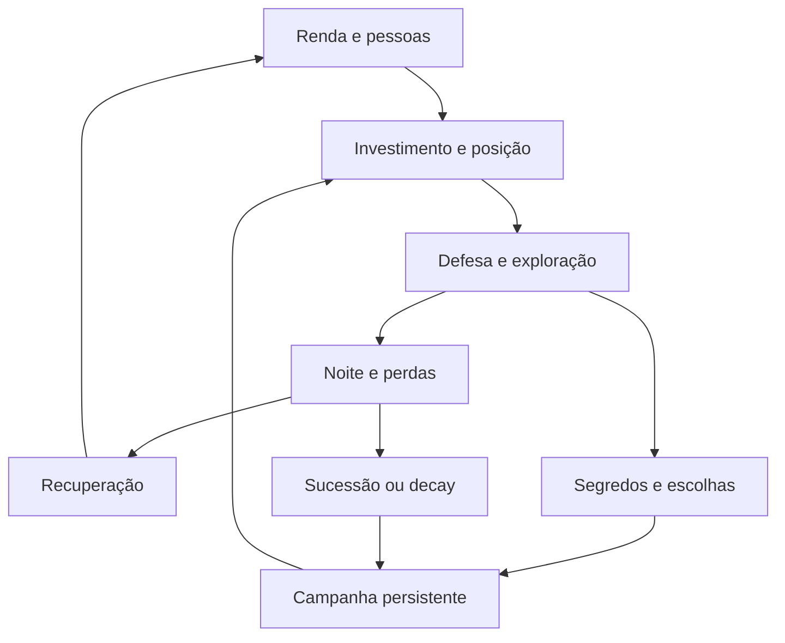
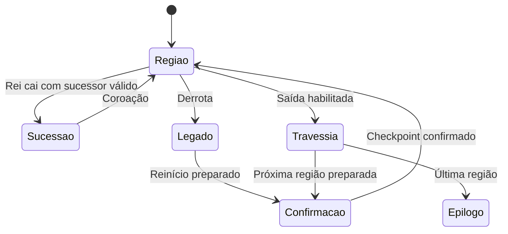

# Empire — auditoria atual de gameplay e plano de continuidade

**Data da revisão:** 27 de setembro de 2026.  
**Repositório:** [henriquecoding/empire](https://github.com/henriquecoding/empire).  
**Base efetivamente auditada:** `main`, commit [`568c568e0ad7dde09ab4487c9852816de23e68d9`](https://github.com/henriquecoding/empire/commit/568c568e0ad7dde09ab4487c9852816de23e68d9), integração do PR #42.  
**Comparação histórica:** [`7b1f7c2e3ee69aa9efd4bd7afc05ac10566627f8`](https://github.com/henriquecoding/empire/commit/7b1f7c2e3ee69aa9efd4bd7afc05ac10566627f8), anterior à sequência AUD-01–05.  
**Escopo:** diagnóstico, pesquisa e propostas de evolução. Não foram alterados gameplay, balanceamento, arte ou histórico do repositório remoto.

> Este relatório foi refeito depois da informação de que o desenvolvimento havia avançado com Claude. Ele substitui o diagnóstico de continuidade baseado no commit antigo. Os problemas já corrigidos aparecem como avanços, não como trabalho pendente. Os identificadores N1–N9 e CONT-01–12 são desta revisão; não são tickets já aprovados no repositório.

**Guia de leitura:** direção e prioridades nas seções 1 e 12; defeitos reproduzidos na 5; economia na 6; campanha na 9; pesquisa na 10; testes na 13; primeiro ticket pronto na 15. Os apêndices contêm as sondas completas.

## 1. De onde prosseguir agora

**Empire avançou de uma região de teste com ligações importantes faltando para uma região bastante mais funcional, com sucessão, decay e transição mínima de campanha.** O próximo salto deve consolidar a continuidade dessas decisões e demonstrar uma progressão alcançável com os recursos reais do jogador.

A sequência recente trouxe manutenção, ganância aplicada à produção, trabalhadores relevantes, reposição de recrutas, aviso do flanco noturno, noites de pico e recuperação, formação defensiva, roubo de galinhas, minas, escoras, herdeiro, legado, travessia e variantes. Recomendar “implementar tudo isso” novamente seria uma análise desatualizada.

As maiores lacunas atuais estão em quatro frentes:

1. **Persistência entre etapas.** O save normal e o legado preservam conjuntos diferentes de estado. A perda de variantes foi reproduzida; a travessia repõe a evolução do Monarca, a dívida, o histórico de povos e o treino do herdeiro. O arquivo de legado também pode ser perdido antes de existir um checkpoint substituto.
2. **Validação da partida completa.** A suíte está verde, mas alguns instrumentos medem o núcleo sobreviver mesmo depois da morte do rei, ou começam com uma defesa pronta. Isso não demonstra que alguém consegue financiar, comandar e atravessar a região desde as seis moedas iniciais.
3. **Economia de escolhas.** Existem mais custos reais, porém a punição por não pagar soldos pode sair muito mais barata que pagá-los. A Colheita Forçada continua dependendo de condições omitidas pelo teste analítico. O celeiro ainda precisa provar quando vale sacrificar renda por capacidade.
4. **Conteúdo que muda a estratégia.** A travessia existe, mas a região seguinte usa o mesmo `Greybox`. Conquista, diplomacia, comércio e o percurso até a Colheita de povos continuam incompletos. Acrescentar apenas mais contadores ou definições não resolve essa diferença.

### Ordem recomendada

| Ordem | Trabalho | Resultado que deve ficar demonstrável |
|---|---|---|
| 1 | Tornar legado e transições duráveis; preservar escolhas explícitas | Morrer, atravessar e reabrir o jogo não apagam progresso por acidente |
| 2 | Usar a mesma regra de derrota nos instrumentos e no jogo | As métricas passam a representar uma partida controlável |
| 3 | Fechar ambiguidades de sucessão, escoras, soldos e conversão | O jogador compreende e consegue antecipar os custos |
| 4 | Medir uma política de jogo que começa com seis moedas | A defesa vencedora pode ser construída e sustentada no mundo real |
| 5 | Entregar uma segunda região autorada e um encontro externo completo | A campanha passa a mudar decisões, além do número da região |
| 6 | Expandir classes, comércio e outros biomas a partir dessa base | Novos sistemas aproveitam uma campanha já coerente |

**Primeira tarefa concreta recomendada:** CONT-01, a transação do legado, seguida de CONT-02, seu contrato de persistência. Em seguida, corrigir a medição da derrota e construir o piloto financiado. Isso oferece retorno mais imediato que introduzir outra classe ou mais uma família de edifícios.

## 2. Método, versão e limites da análise

### 2.1 O que foi verificado

A análise combinou leitura do GitHub, comparação de commits, checkout local do SHA fixado, inspeção dos fluxos de execução, execução de Godot 4.6 e pesquisa em fontes externas. A `main` foi conferida novamente durante a consolidação e continuava em `568c568`.

Há uma armadilha de descoberta: a branch padrão anunciada pelo GitHub ainda apontava para uma branch antiga de Claude. A branch de trabalho recente `claude/bold-wozniak-xa0qon` já estava integrada na `main` no mesmo SHA. A referência confiável deste documento é o commit explícito, não a seleção automática da branch padrão.

A comparação com a base anterior mostrou **149 arquivos alterados, 6.168 inserções e 246 remoções**. Foram rastreados entrada → intenção → simulação → eventos → apresentação, assim como save → retomada, morte → legado → reinício e travessia → nova região.

Foram lidos os contratos de `AGENTS.md`, perguntas Q-114–136, tickets AUD-01–05, F2-01, sistemas de economia/combate/campanha e os testes pertinentes. Também foi considerada a auditoria já incorporada em `docs/recovery/AUDITORIA-GAMEPLAY-2026-09-26.md`. A revisão atual complementa esse trabalho e testa as interações introduzidas pelas correções.

### 2.2 Inventário atual medido

| Elemento | Quantidade | O que o número significa |
|---|---:|---|
| Scripts em `src/**/*.gd` | 164 | Código de produção, incluindo dados e apresentação |
| Arquivos `tests/*_test.gd` | 111 | Suítes executadas nesta revisão |
| Casos descobertos / executados | 832 / 826 | Seis casos ignorados explicitamente |
| Falhas / erros / órfãos | 0 / 0 / 0 | Resultado da suíte existente no commit auditado |
| CSV em `data/source` | 29 | 28 tabelas de conteúdo mais o índice |
| Recursos `.tres` em `data` | 204 | Definições; não equivale a mecânicas alcançáveis |
| Perfis de unidade / criatura | 22 / 7 | Parte do catálogo não aparece no percurso atual |
| Definições de edifício | 26 | O mundo inicial não instancia todas |
| Perfis de classe / montaria | 7 / 6 | A existência do recurso não comprova obtenção e uso |
| Locais iniciais de construção | 25 | Incluem dois poços, duas escoras e a casa do herdeiro |
| Pessoas iniciais | 11 | Rei, escudeiro e nove pessoas por recrutar |
| Largura do mundo inicial | 3.840 px | Seis segmentos de 640 px em disposição fixa |
| Entradas do catálogo de áudio | 73 | Todas com `status=TODO` |

A suíte levou **4 min 42,5 s** nesta execução. Esse tempo é uma medida do ambiente de auditoria, não um benchmark do jogo em equipamento de jogador.

### 2.3 Evidência e grau de certeza

| Rótulo | Significado |
|---|---|
| **Reproduzido** | Uma sonda ou ferramenta executou o comportamento nesta versão |
| **Confirmado no código** | O caminho ou a ausência foi rastreado, sem afirmar observação humana |
| **Inferência de design** | Consequência provável que precisa de medição ou playtest |
| **Proposta** | Alteração sugerida; não é regra aprovada nem comportamento atual |

As sondas prepararam estados controlados para isolar contratos. Por exemplo, a casa do herdeiro em ruína foi uma condição preparada: sua reprodução não demonstra que um inimigo atual consegue destruí-la numa partida normal. Esse limite aparece no achado correspondente.

**Não houve sessão humana com janela, avaliação auditiva ou medição em GPU/Steam Deck.** Portanto, legibilidade, sensação de combate, conforto do controle e diversão permanecem hipóteses a validar. A análise de arte se limita aos contratos e aos recursos; nenhum visual publicado anteriormente foi tratado como prova da versão atual.

## 3. O que já foi resolvido e deve ser preservado

| Entrega recente | Mudança observada | Consequência para a continuidade |
|---|---|---|
| F2-01 / PR #35 | Aura do Monarca, evolução e escudeiro coletor | A classe já tem função e progressão; o escudeiro combatente ainda está aberto |
| Auditoria / PR #36 | Diagnóstico anterior e tarefas AUD incorporados | Existe uma trilha de decisões; atualizar evidências é melhor que duplicar o backlog |
| AUD-01 / PR #37 | Destino da moeda escolhido no gesto; origem real da moeda preservada | A produção deixa de se passar por pagamento do rei |
| AUD-01 | Retomada restaura a fase corrente | Foi corrigida a repetição direta da transição econômica ao carregar |
| AUD-01 | Bônus de posto exige presença física | A torre deixa de conceder seu bônus à distância |
| AUD-01 | Upgrade preserva barreira e postos anteriores | Melhorar um muro deixa de apagá-lo funcionalmente durante a obra |
| AUD-01 | Morte do rei participa da regra de derrota; save diurno em pausa/saída | A partida tem término explícito e melhor continuidade de sessão |
| AUD-02 / PR #38 | Crescimento, ganância, `Staffing`, manutenção e recrutas | Há uma economia mais integrada; ainda falta demonstrar seu equilíbrio completo |
| AUD-03 / PR #39 | Anúncio à tarde, pico/calma, sacrifício de moedas, `Muster` | A noite fica mais antecipável e as tropas sem posto ganham um comportamento defensivo |
| AUD-04 / PR #40 | Alados roubam; poços dão renda; minas antecipam Cavadores; escoras fecham passagens | As faixas passam a conter decisões econômicas e defensivas concretas |
| AUD-05 / PR #41 | Casa do herdeiro, sucessão e retenção de estruturas | A derrota já não é simplesmente reiniciar todos os dados |
| AUD-05 / PR #42 | Travessia no dia 11, epílogo e variantes A/B | Existe conclusão de região e uma primeira estrutura de campanha |

Essas mudanças têm testes próprios e a suíte atual passa. Isso confirma os contratos já cobertos, mas não elimina lacunas entre contratos. O novo problema de produção ao retomar, descrito em N5, vem da memória de ocupação do posto; não é o antigo processamento duplicado da fase.

Também convém preservar a arquitetura: simulação pura separada de `Node`, RNG por fluxos nomeados, intenção enfileirada, CSV como origem dos números, eventos já catalogados e apresentação subordinada à simulação. Não há justificativa, nesta auditoria, para reescrever o projeto ou trocar de engine.

## 4. O que existe como experiência e o que ainda é infraestrutura

### 4.1 Matriz de maturidade

| Sistema | Situação atual | Lacuna relevante |
|---|---|---|
| Movimento, moeda, recrutamento | Integrados | Clareza do destinatário e do motivo de uma ação falhar |
| Construção, reparo, caminhos de muralha | Integrados | Regras de trabalho noturno e ocupação precisam permanecer explícitas |
| Variantes de torre/canteiro | Jogáveis e salvas no save normal | Variante não acompanha estrutura retida pelo legado |
| Postos e presença | Integrados | Histórico de trabalho não sobrevive ao save; distribuição ainda precisa de teste de leitura |
| Caça e entrega de moedas | Integradas | Competição com postos e deslocamento afeta a renda disponível |
| Produção | Crescimento, ganância e trabalho aplicados | Renda produzida, recolhida e disponível são métricas diferentes |
| Celeiro e cozinheiro | Conversão e capacidade integradas | Presença do profissional é global; modo capacidade ainda sem nicho demonstrado |
| Manutenção | Cobrança e deserção integradas | Uma deserção barata pode substituir um soldo alto |
| Podridão e combate | Ciclo, composição e pressão implementados | Sobrevivência financiada e recuperação após perdas não demonstradas |
| Aviso da noite | Flanco e intensidade antecipados | Família de ameaça e resposta necessária ainda podem ser descobertas tarde |
| Subsolo | Rei desce, recolhe, constrói poços e encontra segredos | Fechamento simultâneo pode deixar o rei sem saída; regiões subterrâneas não são isoladas por lado |
| Aéreo | Alados e resposta antiaérea | Roubo precisa ser legível; sem galinheiro, seu papel continua diferente da ameaça anunciada |
| Monarca | Aura, evolução e escudeiro | Continuidade da evolução ao atravessar; crescimento do escudeiro pendente |
| Outros arquétipos e montarias | Predominantemente dados/especificação | Percurso de obtenção, controle e uso não constitui sistema completo |
| Sucessão | Treino e coroação ao amanhecer | Condições de elegibilidade, horizonte de retorno e continuidade entre regiões |
| Decay | Retenção parcial de obras e estados selecionados | Durabilidade e completude do legado |
| Campanha | Índice de região, plano, travessia e fim | Mesma montagem espacial em regiões diferentes; sem retorno a regiões deixadas |
| Ofertas e dívida | Parte importante integrada | Alguns preços e consequências dependem de sistemas ainda ausentes |
| Colheita de povos e epílogo | Modelo de decisões e classificador de final | Conquista não inicia o percurso jogável completo; histórico se perde na travessia |
| Comércio e diplomacia | Dados e modelos parciais | Rotas, proteção, negociação e consequências no mundo |
| Apresentação | Camadas, contexto, legendas e contrato de ações | Assets de ação, sinais de causalidade e áudio precisam fechar o ciclo perceptivo |

### 4.2 Ciclo que o jogo precisa sustentar

A moeda tem três papéis simultâneos: recurso, comando e objeto físico. O jogador desloca o rei para escolher quem recebe investimento, recolhe renda, protege pessoas e decide onde estará quando a noite chegar. Essa presença limitada é um recurso estratégico central.



Hoje, a maior fragilidade está nas conexões com **campanha persistente** e na capacidade de demonstrar o ciclo desde a economia inicial. A região seguinte precisa receber consequências inteligíveis da anterior, e não apenas pessoas recriadas e um índice incrementado.

## 5. Achados novos, priorizados

**P0:** risco de perder progresso ou de invalidar uma conclusão central. **P1:** impacto relevante em decisões, continuidade ou controle. **P2:** maturidade, comunicação ou cobertura. Prioridade não é frequência: uma falha de gravação pode ser rara e continuar sendo P0.

| ID | Prioridade | Achado | Evidência |
|---|---|---|---|
| N7/N8 | P0 | Transição pode apagar a única recuperação durável | Reproduzido com falha de escrita e consumo antecipado |
| N9 | P0 para validação | Vistoria contabiliza tempo depois da derrota real | Piloto perde no dia 4; vistoria continua até a queda do núcleo no dia 7 |
| N1 | P1 | Variante B vira A no decay | Duas torres retidas foram restauradas com variante 0 |
| N2 | P1 | Travessia perde progressão e memória da campanha | Evolução, dívida, histórico de povos e treino foram zerados |
| N5 | P1 | Save perde crédito de trabalho da fase | Produção contínua 0,466667; retomada 0,291667 no cenário preparado |
| N6 | P1 | Soldo elevado pode ser trocado por uma deserção de custo baixo | 25 tropas: devido 13,5; uma moeda recontrata o desertor escolhido |
| N3 | P1 condicional | Herdeiro pronto sem casa bloqueia derrota e coroação | Rei morto; derrota falsa; nenhum novo rei ao amanhecer |
| N4 | P1 | Ambas as escoras podem eliminar a saída do rei | Passagens abertas 0; destino de subida inexistente |

### N7/N8 — legado precisa ser uma transação durável

**Arquivos:** `src/core/save_service.gd`, `src/world/game.gd`, `src/core/sim_loop.gd` [C01], [C02], [C03].

O save convencional escreve um temporário e renomeia. O novo caminho `leave()` escreve diretamente em `legacy.save` e apaga os três slots mesmo quando não conseguiu abrir o arquivo. A função não devolve um resultado que permita à cena tratar o erro.

A sonda criou um save válido e, em um diretório de dados exclusivo do teste, tornou o destino do legado não gravável como arquivo ao criar um diretório com aquele nome. Depois de `leave()`, `latest_slot()` devolveu `-1` e o legado estava vazio. A falha de gravação produziu perda da recuperação anterior.

Existe uma segunda janela: `take_legacy()` lê e apaga o arquivo imediatamente. A cena aplica o conteúdo em memória, mas o autosave inicial exclui o dia 1. Até um save por pausa/saída ou o amanhecer seguinte, um encerramento abrupto pode deixar a campanha sem o legado e sem um save substituto. A sonda confirmou o estado sem arquivos; não simulou queda de energia física.

**Correção proposta:** introduzir uma transição versionada com identificador, escrita validada e confirmação de aplicação. Gravar o legado de forma segura, carregar a nova etapa, gravar seu primeiro checkpoint e só então consumir o legado anterior. Se o processo cair entre etapas, reaplicar deve ser idempotente: não duplicar sementes, moedas ou comitiva. A derrota continuar irreversível é uma regra de design compatível com esse protocolo.

A documentação de `FileAccess` distingue abertura, escrita, erros e fechamento; `WRITE` trunca um arquivo existente. Isso fundamenta o tratamento de falhas, mas não fornece sozinho um protocolo de transação da campanha [W17]. Não basta acrescentar `flush()` e manter a ordem destrutiva atual.

**Aceite:** falhas injetadas em abrir, escrever, validar, renomear e confirmar deixam exatamente um estado recuperável; reiniciar em cada fronteira não duplica nem perde recompensas; o teste opera em dados isolados.

### N9 — a medição de sobrevivência ainda usa uma derrota antiga

**Arquivos:** `tools/vistoria.gd`, `tools/autopilot.gd`, `src/core/defeat.gd`, `tests/support/campaign.gd` [C04], [C05], [C06].

A vistoria para quando o núcleo cai. O jogo agora também termina com a morte do rei sem sucessor. São contratos diferentes.

Com a seed padrão `20260916`, a vistoria atual de dez dias terminou assim: **núcleo caiu no dia 7; nenhuma invariante quebrada**. Uma sonda com o mesmo piloto, a mesma seed e `Defeat.happened()` como parada detectou **derrota no dia 4, a 273,267 s desse dia**, com o núcleo ainda em **892 de vida**. As linhas posteriores ao dia 4 não são dias jogáveis daquela partida. O valor de “8 dias” registrado em Q-128 também não deve ser promovido a critério de saída sem indicar versão e condição de derrota.

O teste de dez dias continua útil como teste de uma defesa previamente montada. Seu próprio suporte documenta que não há jogador e que a defesa nasce pronta. Além disso, o cenário principal de sucesso desliga a voz da Podridão; o cenário de recusa de todas as ofertas permanece ignorado. Nenhuma dessas condições demonstra uma rota financiável desde o início.

**Correção proposta:** compartilhar a regra terminal do produto; registrar causa da derrota, rei vivo/controlável, situação do núcleo e estágio da campanha. Separar três resultados: estabilidade da simulação, resistência de uma configuração pronta e sucesso de uma política de jogo desde o início.

**Aceite:** instrumento e cena encerram no mesmo tick lógico; uma campanha aprovada começa com recursos normais, usa intenções, paga custos reais, não injeta moedas e chega à travessia com voz ligada. Não interpretar a derrota de um piloto específico como prova de que todo jogador perde.

### N1 — estruturas retidas perdem a variante escolhida

**Arquivos:** `src/sim/systems/legacy.gd`, `src/sim/state/build_slot.gd`, `src/sim/state/slot_variant.gd` [C07], [C08], [C09].

`BuildSlot` guarda a variante no save normal. `Legacy.of()` grava apenas id, nível e caminho da estrutura. A variante não entra na retenção nem é reposta por `Legacy.apply()`.

A sonda levantou quatro canteiros e duas torres, todos com variante B. A retenção real de 40% selecionou as duas torres mais caras. Ambas passaram de `variant=1` para `variant=0` depois do reinício. Uma torre de cadência virou torre de alcance sem nova escolha do jogador.

**Correção proposta:** o esquema de estrutura retida deve incluir toda escolha durável, incluindo variante, e explicitar quais atributos são restaurados, degradados ou descartados. Manter compatibilidade com legados antigos que não tenham o campo.

**Aceite:** uma estrutura B retida mantém B após derrota e reabertura; uma estrutura não retida volta ao estado que o contrato determinar; empates na seleção continuam deterministas; não confundir `path` da muralha com `variant`.

### N2 — travessia transporta uma parte insuficientemente definida da campanha

**Arquivos:** `legacy.gd`, `class_system.gd`, `harvest_system.gd`, `night_watch.gd`, `game.gd` [C02], [C07], [C10], [C11], [C12].

A travessia preserva sementes, segredos, conquistas, plano, bolsa e tipos de tropas próximas. A nova região é montada com sistemas novos. A sonda evoluiu o Monarca gastando sua única Semente Real, marcou a câmara como encontrada, estabeleceu dívida 9, um povo liberado e sete dias de treino do herdeiro. Depois da travessia:

| Campo | Antes | Depois |
|---|---:|---:|
| Fase do Monarca | 2 | 1 |
| Sementes disponíveis | 0 | 0 |
| Câmara já encontrada | Sim | Sim |
| Dívida | 9 | 0 |
| Povos liberados | 1 | 0 |
| Treino do herdeiro | 7 dias | 0 dias |
| Região | 0 | 1 |

O povo liberado foi inserido para testar o contrato de dados; não é evidência de uma conquista normalmente alcançável hoje. A perda da fase é diretamente relevante para uma mecânica jogável. O segredo permanece encontrado enquanto o benefício comprado com sua semente desaparece.

A Q-133 chama a evolução de propriedade do império no contexto da sucessão. Já Q-135 enumera um transporte mais estreito. É necessário decidir formalmente o que é da pessoa, da região e da campanha. A ausência dessa decisão não deve ser disfarçada de simples rebalanceamento.

O epílogo lê dívida e listas de povos da região corrente. Se as regiões anteriores apagam esses valores, o final não sintetiza a jornada inteira. Fazer a campanha avançar não pode “lavar” consequências morais sem que essa seja uma regra deliberada e comunicada.

**Correção proposta:** uma matriz de persistência e um estado de campanha próprio, descritos na seção 9. Preservar a evolução comprada ou definir uma compensação explícita; manter histórico moral e separar dívida local de dívida acumulada. A comitiva também precisa de política para título, ferimentos, experiência, moedas carregadas e faixa: hoje transporta tipos, não identidades, e a seleção por proximidade não compara a faixa vertical.

**Aceite:** atravessar duas regiões e morrer depois mantém os estados contratados; o epílogo usa a história definida para a campanha; repetir a operação não duplica recompensas; campos deliberadamente reiniciados aparecem no resumo da travessia.

### N5 — o histórico de trabalho desaparece ao carregar

**Arquivos:** `staffing.gd`, `job_board.gd`, `economy_system.gd`, `sim_save.gd` [C13], [C14], [C15], [C16].

`Staffing` registra se alguém esteve no posto durante a fase. Esse histórico não entra no save. Ao carregar no meio da fase, a presença ocorrida antes da gravação deixa de existir para a produção seguinte.

A sonda colocou um trabalhador num canteiro, deixou a ocupação ser observada, retirou o trabalhador e salvou ainda na mesma fase. O percurso contínuo considerou a fase trabalhada; o retomado, não. O valor acumulado de matéria mais produção foi **0,466667** no contínuo e **0,291667** no retomado. A diferença de **0,175** corresponde à perda de crédito do trabalho na configuração usada.

A Q-121 afirma que a primeira fase após retomar não seria penalizada. A implementação atual não satisfaz essa intenção nesse caso. Não é preciso transformar produção em cálculo por segundo para corrigir o defeito.

**Correção proposta:** persistir fase, ocupação acumulada e dados necessários para fechar a fase de modo equivalente. Uma alternativa de conceder crédito integral ao retomar altera o balanceamento e abre espaço para exploração; deve ser escolhida conscientemente, não como remendo invisível.

**Aceite:** contínuo e retomado produzem o mesmo resultado com trabalhador presente, ausente, morto ou transferido antes do snapshot, incluindo gravação imediatamente antes da mudança de fase.

### N6 — o soldo pode virar uma taxa de uma moeda

**Arquivos:** `upkeep_system.gd`, `recruit_system.gd` [C17], [C18].

A Q-124 deliberadamente perdoa a parte inteira não paga e remove uma tropa, preferindo a mais barata sem posto. O desertor mantém classe e bolsa e pode ser recrutado novamente. A implementação corresponde à regra; o problema é seu incentivo.

Na sonda, 24 lanceiros e um vagabundo pertenciam ao rei. O soldo era **13,5 moedas**; o rei estava sem dinheiro. Uma única pessoa desertou, a dívida restante ficou em **0,5** e uma moeda bastou para recrutar de volta o vagabundo. Essa pessoa é de custo 1 e não tinha posto. O ensaio demonstra a alternativa barata; não afirma que toda composição oferece o mesmo resultado.

Um jogador que mantém liquidez fora da bolsa do rei na hora da cobrança pode preservar um exército caro pagando uma perda previsível de baixo custo. Isso enfraquece precisamente a escolha de quantas tropas sustentar que a manutenção deveria criar.

**Proposta:** escolher entre dívida de soldo, desertores proporcionais ao déficit, indisponibilidade temporária para recontratar ou outra consequência que conserve o custo marginal. Comparar alternativas antes de impor punições cumulativas. Evitar tornar uma falha pequena uma espiral irreversível de deserção → menor renda → mais deserção.

**Aceite:** para composições representativas, inadimplir de propósito não domina pagar continuamente; perder uma noite ainda permite uma recuperação inteligível; a interface antecipa o valor a cobrar e a consequência da falta.

### N3 — sucessão considera formação, mas não possibilidade de coroar

**Arquivos:** `defeat.gd`, `succession.gd`, `field_work.gd` [C06], [C19], [C20].

`Defeat.happened()` deixa de declarar derrota se o herdeiro está pronto. `Succession.crown()` exige, além disso, uma casa de pé. Com herdeiro pronto, rei morto e casa em ruína, o jogo não declara derrota e tampouco cria um rei ao amanhecer.

**Reproduzido em estado preparado.** Não foi demonstrada a destruição natural dessa casa na versão atual. A prioridade decorre da inconsistência do contrato e de sua expansão futura, não de uma alegação de ocorrência frequente.

**Proposta:** uma condição única de sucessão possível, usada pelo guia, pela derrota, pela retomada e pela coroação. Decidir se a formação sobrevive à perda da casa e, nesse caso, onde o sucessor aparece.

**Aceite:** todo estado com rei morto conduz a coroação alcançável ou término explícito. Testar casa íntegra, danificada, em obra, destruída e ausente no conteúdo carregado.

### N4 — fechar as duas passagens pode deixar o rei sem saída

**Arquivos:** `passages.gd`, `verbs.gd`, `build_system.gd`, `cavities.gd` [C21], [C22], [C23], [C24].

As escoras fecham em ambos os sentidos e são permanentes nesta região. A verificação não considera se o rei já está embaixo. Com o rei no subsolo e ambas de pé, a lista de passagens abertas fica vazia e `Verbs.destination()` passa a `-1`. A travessia de região exige superfície.

A sonda preparou o fechamento, demonstrando ausência de rota. O percurso de pagamento e conclusão simultânea por trabalhadores deve entrar no teste de integração da correção; não foi reproduzido nesta revisão como uma sequência humana completa.

Há ainda uma divergência espacial: Q-132 diz que fechar um lado perde o poço e a câmara desse lado. O subsolo atual é uma faixa contínua. Enquanto a outra boca permanece aberta, fechar uma entrada não isola automaticamente toda a metade subterrânea. A consequência prometida depende de topologia que o `Greybox` ainda não representa.

**Proposta:** impedir conclusão que elimine a última saída de um personagem controlável, ou garantir saída apenas de dentro para fora, ou oferecer uma abertura de emergência com custo claro. Separadamente, escolher entre cavidades realmente isoladas e uma descrição coerente com o corredor conectado.

**Aceite:** nenhuma ordem comum de pagamento/descida/conclusão produz prisão involuntária; a contraparte defensiva da escora continua válida; o texto descreve a conectividade real.

## 6. Economia: o que os números atuais realmente demonstram

### 6.1 O modelo está mais próximo da partida, mas ainda não é a partida

O avanço de AUD-02 é concreto: o crescimento diário de 1,12, a ganância inicial entre 20% e 35% e a manutenção agora participam do jogo. Entretanto, `test_o_dia_da_asfixia_da_economia_do_jogo_cai_no_alvo()` ainda faz uma conta sobre todas as fontes prontas, caça média e um custo noturno abstrato [C15], [C25].

O teste soma a caça ao bruto e aplica ganância sobre o total. A regra real e Q-123 dizem que a caça não paga nobres. O teste também usa uma quantidade fixa de tropas do perfil e `night_cost()`, enquanto na partida o custo vem de recrutamento, reparo, investimento, baixas e deslocamento. Nem toda moeda produzida chega à bolsa em tempo de ser usada.

Isso não torna o modelo inútil. Ele é um orçamento de referência. A conclusão “asfixia no dia 10” precisa ser apresentada como **resultado desse orçamento**, não como demonstração de que a experiência inteira foi equilibrada.

### 6.2 Rendimentos e investimentos existentes

| Fonte | Investimento inicial | Rendimento base/dia | Custo estratégico efetivo |
|---|---:|---:|---|
| Canteiro A | 4 | 2 | Pessoa no posto nas fases urgentes; vulnerabilidade ao rastro |
| Canteiro B | 4 | 1,5 | Renuncia a 25% da produção para resistir ao rastro |
| Pesqueiro | 6 | 3 | Posição fixa; no `Greybox` rende sem posto de trabalhador |
| Galinheiro | 8 | 3 | Alados podem retirar matéria; defesa tem custo e posição |
| Poço de minério | 12 | 4 | Coleta subterrânea pelo rei; Cavadores podem chegar no dia 7 |
| Celeiro | 10 | Conversão do grão ×1,5 em moeda | Centraliza a coleta fora da muralha externa; modo capacidade renuncia à venda |

Valores de base não incluem crescimento, ganância, variantes adicionais, intervalos sem operação ou perdas. Os custos de treinamento do profissional e de suas casas são investimentos adicionais quando aplicáveis [C26].

A superfície completa tem base **17/dia**: quatro canteiros A, dois galinheiros e um pesqueiro. Com 28% de ganância ilustrativa, antes de manutenção e perdas:

| Dia | Produção bruta com crescimento | Após 28% de ganância |
|---:|---:|---:|
| 1 | 17,00 | 12,24 |
| 4 | 23,88 | 17,20 |
| 7 | 33,55 | 24,16 |
| 10 | 47,14 | 33,94 |
| 11 | 52,80 | 38,02 |

**Hipóteses da tabela:** todas as sete fontes já construídas, canteiros plenamente atendidos, nenhuma perda e nenhuma conversão no celeiro. Não é uma curva observada de abertura. Construir as fontes custa moedas, consome tempo e concorre com a primeira defesa.

### 6.3 Colheita Forçada: a data do retorno depende do cenário

O impulso custa 12 moedas, multiplica a produção de hoje por 1,8 e zera canteiros amanhã. O teste procura algum dia rentável até o dia 20, usando o rendimento bruto de hoje inteiro e a perda de amanhã. Essa conta omite ganância e o momento da ativação.

Uma aproximação mais informativa para comparar com não ativar é:

\[
\Delta \approx (1-g)\,1{,}12^{d-1}\left(0{,}8\,B\,f - 1{,}12\,F\right)-12
\]

`g` é a ganância; `B`, a produção base beneficiada hoje; `F`, a base dos canteiros que parará amanhã; `f`, a fração das seis passagens produtivas ainda aproveitável. A simulação distribui matéria por fases, que têm durações diferentes. Assim, `f` aqui não é simplesmente a porcentagem de segundos restantes.

| Dia | Superfície; dia inteiro disponível | Superfície; 5/6 das fases | Superfície + dois poços; 5/6 das fases |
|---:|---:|---:|---:|
| 4 | −7,31 | −9,60 | −4,20 |
| 7 | −5,41 | −8,63 | −1,05 |
| 10 | −2,74 | −7,26 | +3,39 |
| 11 | −1,62 | −6,69 | +5,23 |
| 14 | +2,58 | −4,54 | +12,21 |

**Hipóteses:** ganância 28%; canteiros A atendidos, base superficial 17, base dos canteiros 8, poços acrescentando 8; sem celeiro, perda, teto de bolsa ou custo de recolha. Os valores são cálculos desta auditoria, não execuções de uma política completa. O caso de dia inteiro é um limite favorável.

A conclusão útil é mais precisa que “o impulso está sempre ruim” ou “já compensa no dia 10”: **o impulso ganha um nicho com renda fora dos canteiros, mas a afirmação de retorno nas sete fontes precisa ser refeita com as condições reais**. Liquidez imediata também pode salvar uma noite mesmo com retorno total negativo. O jogo precisa comunicar essa função se ela for intencional.

**Próximo teste:** ativar em diferentes fases, com e sem minas, variantes e conversão; comparar moeda disponível antes da noite, custo da defesa que isso permite e patrimônio dois dias depois. A ativação deve usar o mesmo gesto que o jogador usa.

### 6.4 O celeiro precisa de dois usos justificáveis

Hoje, a venda multiplica o grão; a capacidade concede +10% de vida máxima às tropas. O código considera o ofício disponível pela existência de um cozinheiro vivo, não por sua presença na casa. Também considera a conversão ativa quando há produtor correspondente de pé, mesmo que nenhuma unidade de matéria tenha sido consumida naquela passagem [C27].

São regras verificáveis, mas o significado de “enquanto a conversão corre” continua ambíguo. Um prédio e uma pessoa longe dele podem sustentar um efeito global. Já alternar por uma moeda compete com a função de manter o botão para pagar continuamente; Q-115 ainda registra essa dificuldade.

A prioridade é definir uma decisão observável:

- **Moeda agora:** mais investimento, contratação e reparo antes de uma ameaça.
- **Capacidade agora:** evita uma quantidade demonstrável de baixas ou torna viável uma expedição que a alternativa monetária não sustenta.
- **Compromisso:** o gesto escolhe um modo de forma estável; não fica alternando várias vezes durante o mesmo pagamento mantido.
- **Operação:** o mundo mostra profissional, estoque, destino e motivo de interrupção de acordo com a regra escolhida.

Não recomendar simplesmente aumentar +10% para outro valor. Primeiro medir se o bônus muda a quantidade de golpes necessária para matar tropas relevantes, se preserva ferimentos de forma coerente e se seu benefício excede a renda sacrificada em algum cenário. AUD-02 está marcado como feito, mas seu critério de nenhum modo dominado ainda não está demonstrado; Q-124 reconhece essa pendência.

### 6.5 Tempo de deslocamento também é preço

O rei anda a 80 px/s no perfil atual. O celeiro e a casa do herdeiro estão a 1.450 px do núcleo, em lados opostos: aproximadamente **18,1 s para ir**, sem pausas. A bifurcação fica a 1.800 px: **22,5 s**. O mapa inteiro leva aproximadamente **48 s** para atravessar em velocidade constante. Esses cálculos não incluem pagamento, coleta, combate ou retorno.

Por isso, o valor de uma mina não é apenas produção/custo. É a combinação de renda, rota, tempo longe da defesa, risco de ser fechado e janela antes do crepúsculo. Esse é um bom diferencial de Empire. Deve ser medido e apresentado através do mundo, em vez de removido por coleta global automática.

### 6.6 Instrumentação econômica recomendada

Registrar por dia e por origem: produção bruta; parte dos nobres; matéria retida; conversão; moedas no chão; recolha pelo rei; recolha por aliados; moedas perdidas; caça; construção; reparo; treino; soldo; herdeiro; oferta; sacrifício; saldo final.

Separar transferências de sumidouros. Pagar recrutamento deixa moedas com a pessoa no modelo atual; não é necessariamente destruição monetária. A fome econômica percebida pode decorrer de dinheiro inacessível ou mal distribuído, mesmo quando existe riqueza total suficiente.

O teste de conservação deve reconciliar bolsas, chão e entradas/saídas contabilizadas. O teste de balanceamento deve avaliar se uma pessoa consegue usar essa riqueza em tempo útil. São perguntas diferentes.

## 7. Combate, noite e autonomia: tornar as decisões legíveis

### 7.1 O aviso precisa permitir uma resposta

O anúncio do flanco à tarde é um avanço importante. O próximo passo recomendado é ensinar a família da ameaça com antecedência suficiente para reagir: solo, roubo aéreo ou invasão subterrânea. Isso não exige revelar quantidades exatas de toda onda.

Uma ameaça útil possui sinal, preparação, execução e consequência identificável. Para o Alado, por exemplo: avistamento → galinheiro exposto → escolha de defesa → roubo visível → possibilidade de interceptação → perda registrada. Se o jogador só percebe uma moeda a menos no dia seguinte, a mecânica existe mas ensina pouco.

O roubo atual reduz matéria quando o ladrão chega vivo à alvorada. Sua ameaça depende de haver galinheiro. Portanto, a frase de design “dia 4 obriga torre alta” é forte demais como regra universal: sem esse investimento, o prejuízo econômico específico muda. Testar tanto a estratégia com galinhas quanto a que evita essa fonte é necessário para avaliar se a torre é uma escolha ou um imposto fixo.

### 7.2 `Muster` melhorou a formação, mas não substitui comando compreensível

Tropas sem posto agora recolhem à defesa; não combatentes voltam ao núcleo; o escudeiro acompanha o rei. Os soldados com posto continuam sob o sistema de empregos, e quem treina continua treinando. A combinação precisa de feedback suficiente para que “meu arqueiro não veio” tenha uma resposta visível.

Priorizar três explicações curtas junto à unidade ou ao contexto: **a caminho**, **em posto**, **em treino**. Mostrar destino quando selecionado ou inspecionado. A presença real agora determina bônus, o que torna ainda mais importante distinguir atribuição de chegada.

Na próxima iteração, medir distância percorrida após o aviso, proporção de tropas em posição no início do combate, tempo fora do alcance útil e baixas de pessoas que o jogador acreditava protegidas. Evitar acrescentar muitas ordens de RTS antes de resolver a legibilidade da autonomia existente.

### 7.3 Pico e descanso precisam alterar a atividade do jogador

Noites de pico a cada seis dias, seguidas de uma mais calma, oferecem estrutura. O descanso vale quando permite recompor, visitar o subsolo, treinar ou buscar um segredo. Se a noite calma ainda exige a mesma rotina longa e o dia seguinte não apresenta uma oportunidade, o multiplicador muda a planilha, mas pouco a experiência.

O trabalho da Valve sobre o AI Director distingue modulação de intensidade de simples alteração de dificuldade [W09]. A aplicação proposta aqui é observar acúmulo de pressão e abrir janelas de recuperação. Não é introduzir um diretor adaptativo complexo nem modificar secretamente regras durante a partida.

### 7.4 Recuperação precisa existir antes de novas punições

A identidade de Empire já contém consequências duras: perdas, árvores ligadas à morte, dívida, ofertas e retenção parcial do império. Isso favorece histórias. Também pode criar uma espiral em que o jogador continua vivo, mas não tem recursos ou pessoas para voltar a decidir.

Medir o estado após a primeira muralha cair: renda acessível, recrutas disponíveis, custo para formar uma defesa mínima, tempo até nova pressão e caminho seguro para o rei. Uma recuperação válida deve exigir escolha e algum sacrifício, preservando uma possibilidade real de reação.

As escoras já oferecem uma resposta aos Cavadores; isso não dispensa medir o redirecionamento de massa para a superfície. A escolha pode reduzir uma ameaça e aumentar outra. O relatório noturno deve deixar essa troca perceptível.

## 8. Interface, apresentação e controles

### 8.1 Fechar o percurso perceptivo da ação

A prioridade visual é responder: **o que escolhi, quem recebeu, o que mudou e por quê?** O projeto já tem guia contextual, legendas, preços e contrato de ações; aproveitar esses componentes é melhor que criar outro painel completo.

| Momento | Informação necessária | Recurso sugerido |
|---|---|---|
| Antes de largar moeda | Destinatário e função | Destaque discreto do alvo e preço/ação contextual |
| Depois de pagar | Moeda contabilizada e progresso | Resposta local breve no edifício ou pessoa |
| Sem efeito | Motivo específico | “Falta cozinheiro”, “sem moedas”, “já usado hoje”, conforme o caso |
| Antes do crepúsculo | Flanco, tempo e ameaça principal | Candeia, símbolo e mensagem curta |
| Ao concluir uma variante | Qual especialização foi escolhida | Silhueta/detalhe e nome estáveis |
| Ao perder renda | Origem da perda | Roubo, rastro, ausência de trabalhador ou nobres identificáveis |
| Ao atravessar | O que acompanha e o que fica | Resumo da comitiva, bolsa e progressão |
| Ao morrer | Por que terminou e o que persiste | Causa da derrota e legado durável |

A correção de `CoinTarget` torna possível mostrar a mesma decisão que a simulação tomará. O preview deve consultar essa lógica comum; uma segunda heurística visual acabaria mentindo sobre pagamentos.

### 8.2 Dois verbos exigem estabilidade contextual

Verbo 1 já serve a recrutamento, obra, reparo, oferta, sacrifício, conversão e evolução. Verbo 2 muda faixa, escolhe variante e atravessa região. Quanto maior essa densidade, mais importantes ficam precedência, alcance e indicação do contexto.

Testar fronteiras sobrepostas, unidades passando diante de uma obra e uma moeda ainda no ar quando o rei muda de posição. A intenção fixada no gesto é um bom fundamento. O jogador deve conseguir cancelar ou evitar ações caras antes de pagar; não precisa de uma confirmação modal para cada moeda.

### 8.3 Controle e acessibilidade

Há suporte de ações e glifos, mas `wheel_choice()` ainda escolhe impulsos por teclas físicas numéricas enquanto a roda está mantida. Isso não completa o fluxo equivalente no controle. Impulsos indisponíveis também precisam de razão e custo visíveis, conforme Q-113 [C28].

Usar ações do `InputMap`, foco navegável e preview coerente entre teclado e controle. A documentação de Godot sustenta a abstração de eventos por ações [W13]; o mapeamento concreto deve respeitar os dois verbos e os gestos já previstos no projeto.

As diretrizes de acessibilidade recomendam controles configuráveis, texto legível, contraste e redundância de canais [W10], [W11]. Aplicação prioritária: não depender apenas da cor da candeia para intensidade, do som para o crepúsculo ou de texto pequeno para uma perda urgente. O filtro cromático já existente não substitui símbolos e formas distinguíveis.

O ajuste de duração do dia já foi integrado. Avaliar seu impacto em deslocamento, frequência de decisão e aprendizado; o mesmo conteúdo pode ficar muito mais punitivo em 240 s e bastante mais demorado em 540 s. Isso é uma consequência a medir, não razão para remover a opção.

### 8.4 Animação e áudio têm função mecânica

`ActorAction` já traduz estados em `idle`, `walk`, `work`, `attack`, `hit`, `flee` e `die`, com fallback [C29]. O código não comprova que cada perfil possui todos os assets finais. Verificar o manifesto por perfil e ação, mantendo a arte original e as proporções estabelecidas; evitar esticar sprites para preencher caixas.

A maior prioridade de animação é distinguir ataque, trabalho, dano e fuga nos personagens usados pela abertura. Uma nova criatura pouco usada oferece menos retorno que fazer o arqueiro existente comunicar corretamente disparo e impacto.

O catálogo de áudio contém 73 cues `TODO` [C30]. Isso impede tratar a camada auditiva como finalizada. A primeira entrega sonora deveria cobrir pagamento, recrutamento, conclusão de obra, tiro/impacto, dano ao rei, ruptura de muralha, alerta do crepúsculo, amanhecer, roubo e descoberta. Esses sons precisam de equivalentes visuais/legendas para informação essencial.

Um protótipo com esses sinais permite avaliar causalidade. A direção musical completa pode seguir depois, sem atrasar a correção das regras centrais.

## 9. Campanha: definir o que pertence ao rei, à região e ao império

### 9.1 Contrato de persistência proposto

A tabela abaixo é uma proposta a discutir e registrar. Seu objetivo é impedir que a escolha do formato do dicionário decida silenciosamente a regra do jogo.

| Estado | Save/retomada | Sucessão na região | Travessia | Derrota/decay |
|---|---|---|---|---|
| Fase, RNG, filas e crédito de trabalho | Preservar para equivalência | Continuar | Reiniciar estado local por regra | Reiniciar estado local |
| Sementes e desbloqueios comprados | Preservar | Preservar | Preservar | Preservar conforme §16 |
| Fase evoluída da classe | Preservar | Já preservada | Preservar ou compensar explicitamente | Definir; evitar perder custo e manter segredo consumido |
| Bolsa do rei | Preservar | Regra de morte explícita | Transportar com teto/regra de chegada | Definir perda sem duplicação |
| Estruturas, nível, caminho e variante | Preservar | Continuar | Guardar estado da região deixada quando houver retorno | Reter parcela com escolhas completas |
| Comitiva | Identidade e estado completos | Continuar | Definir identidade, títulos, saúde, moedas e capacidade | Definir sobreviventes/retidos |
| Treino do herdeiro | Preservar | Consumir ao coroar | Transportar ou informar perda antes de sair | Definir relação com casa retida |
| Dívida e ofertas | Preservar | Separar dívida do indivíduo/império | Preservar história; reiniciar apenas parte local definida | Consequência explícita |
| Povos soltos, retidos e perdidos | Preservar | Preservar | Histórico acumulado da campanha | Persistência coerente com o epílogo |
| Segredos e diários | Preservar | Preservar | Distinguir descoberta global e instância regional | Evitar recompensa duplicada ou irrecuperável |
| Plano e região corrente | Preservar | Continuar | Avançar uma vez | Retomar a região correta |

O tipo de save normal pode continuar existindo. Não é necessário fundir tudo num objeto gigante: separar estado de campanha, snapshot de região e estado de reinício torna os contratos mais claros. Versionar o legado é especialmente importante porque agora ele participa de toda derrota e travessia.



O estado “confirmação” representa durabilidade técnica; não precisa ser uma tela nova para o jogador.

### 9.2 O herdeiro disputa o mesmo horizonte que a saída

A casa custa 20; o treino exige dez amanheceres a cinco moedas: **70 moedas no total mínimo**, além de deslocamento e defesa. Se construída a tempo de treinar na alvorada do dia 2, termina no dia 11, exatamente quando a travessia pode abrir. Se vier mais tarde, o retorno também vem depois.

O jogador pode ficar além do dia 11; a região não termina automaticamente. Ainda assim, há uma tensão de incentivo: preparar a sucessão demora aproximadamente o mesmo que habilitar a partida para outro lugar, e o treino não acompanha a travessia atual. Isso pode tornar o herdeiro investimento de quem deliberadamente prolonga a região, ou uma escolha pouco atraente para quem pretende avançar.

Decidir qual função é desejada: seguro de uma região longa, preparação do próximo monarca da campanha ou objetivo opcional de permanência. Testar a função escolhida antes de simplesmente reduzir dez para outro número.

### 9.3 Dia 11 significa pelo menos uma hora de uma região

O dia padrão dura 360 s. Dez ciclos completos até a primeira alvorada do dia 11 representam aproximadamente **60 minutos**; na faixa configurável, **40–90 minutos**, sem pausas. Essa é uma conta de duração nominal, não tempo observado de conclusão.

Não há contradição técnica em uma região longa. A questão de produto é se o trecho contém variedade suficiente e se a promessa de “campanha” exige repetir a mesma montagem por várias horas. O plano sorteado de capítulos não substitui regiões com decisões próprias.

Proposta: manter o portão de dez noites como configuração de teste, mas experimentar um objetivo de região que combine preparação e realização concreta. A saída deve expressar conquista de uma meta, e não apenas tempo decorrido. Essa alteração precisa de decisão de design porque Q-135 atualmente fixa o dia.

### 9.4 Próxima região: uma diferença mecânica forte

Antes de produzir todas as cenas de bioma, criar **duas regiões de verdade** usando os recursos existentes. Elas devem diferir em pelo menos uma restrição econômica, uma topologia e uma decisão final. Exemplos de proposta:

- Uma região inicial com renda e defesa próximas, um risco aéreo legível e uma expedição curta.
- Uma segunda com produção distante ou concentrada no subsolo, percurso de coleta que compete com defesa e uma escolha externa persistente.

As diferenças exatas devem sair das definições já aprovadas de biomas e segmentos. Não criar regras novas só para tornar os cenários diferentes. Ao montar por região, aplicar primeiro a identidade da região/campanha e só depois selecionar a cena; hoje `Greybox.build()` antecede `Legacy.apply()`.

### 9.5 Um encontro externo completo antes da diplomacia inteira

A Colheita de povos já sabe representar duração, fila e decisão de soltar ou ficar. Seu início ainda depende de uma conquista não integrada; a escolha carece de aldeia onde acontecer, conforme Q-103 [C11]. A melhor próxima expansão de conteúdo é uma única cadeia completa:

**descobrir povo → entender oferta/ameaça → escolher abordagem → resolver encontro → receber consequência → ver o efeito numa noite ou na região seguinte**.

Essa entrega valida identificação, recompensa, dívida, registro de campanha e epílogo. Pode começar com um encontro autorado, sem precisar de uma IA completa de reis rivais. A origem da Colheita deve ser uma ação jogável, não uma chamada de teste ou texto sem consequência.

O teste de final precisa completar os três percursos por meios alcançáveis. Chamar `Epilogue.of()` com valores inseridos prova o classificador, mas não prova que União, Domínio e O Turno são conclusões possíveis de campanhas reais.

## 10. Pesquisa externa aplicada a Empire

A pesquisa priorizou páginas oficiais dos jogos, relatos dos próprios desenvolvedores, documentação de Godot e literatura de design. As descrições externas abaixo são fatos das fontes; **a aplicação a Empire é uma inferência/proposta desta auditoria**. Não foram usadas notas de usuários como demonstração causal de qualidade.

### 10.1 Referências de experiência

| Referência | Evidência da fonte | Aplicação proposta | Verificação em Empire |
|---|---|---|---|
| **Kingdom: New Lands** [W01] | Exploração, sobrevivência e descoberta dentro de controles econômicos | Manter conhecimento e deslocamento como recursos; ensinar por consequências reconhecíveis | Jogador consegue dizer quem recebeu a moeda e por que vale visitar um lugar |
| **Kingdom Two Crowns** [W02] | Construção, recrutamento, defesa e desenvolvimento de uma campanha | Preservar história entre regiões e tornar a chegada ao próximo território uma mudança relevante | Travessia carrega escolhas contratadas e abre problemas novos |
| **Entrevista com Thomas van den Berg** [W03] | O desenvolvedor discute interações orgânicas entre habitantes e dificuldades de comunicar transferências de moedas | Testar legibilidade do sistema físico antes de acrescentar explicações longas | Sem intervenção do observador, pessoa entende circulação e destino do dinheiro |
| **Thronefall** [W04] | Alternância entre construção diurna e combate noturno; economia e defesa disputam recursos | Fazer cada janela diurna terminar com uma escolha de preparação reconhecível | Comparar investimento em renda e em defesa com recursos iniciais idênticos |
| **Bad North** [W05] | Comando tático amplo com autonomia dos soldados e importância de posição | Conservar autonomia, mostrar destino e permitir intenção de alto nível compreensível | Tropas chegam a posições úteis após o anúncio; jogador entende ausências |
| **Into the Breach** [W06] | Ataques adversários são antecipados para permitir uma resposta informada | Sinalizar família de ameaça e contramedida antes de cobrar conhecimento | Primeira perda relevante é explicável pelo jogador, sem exigir previsão impossível |
| **Dome Keeper** [W07] | Exploração/mineração alterna com retorno para enfrentar ondas | Dar à expedição subterrânea um orçamento de tempo e uma oportunidade de recuo | Renda adicional justifica a viagem; retorno é possível e a ameaça foi anunciada |
| **Against the Storm — página do jogo** [W16] | Assentamentos sucessivos, objetivos próprios e progressão que atravessa expedições | Definir exatamente o que termina com uma região e o que permanece na campanha | A segunda região muda a estratégia e conserva o progresso combinado |
| **Against the Storm — devlog do mapa** [W18] | O projeto separa camada mundial e camada de assentamento; biomas alteram condições iniciais | Separar identidade da campanha de montagem local; usar diferenças de recursos/topologia | O plano de regiões determina conteúdo efetivo, não apenas rótulos |

Esses jogos não oferecem uma receita única. Empire tem uma identidade própria em dívida, sucessão, Amargueiros e decisões sobre povos. A utilidade do benchmark é encontrar princípios que fortaleçam esses diferenciais, preservando moeda física e presença do rei.

### 10.2 Referências de método e sistemas

**MDA, de Hunicke, LeBlanc e Zubek** [W08], distingue regras implementadas, comportamentos que emergem delas e experiência percebida. Para Empire, “manutenção implementada” é uma regra; “esvaziar a bolsa antes da cobrança” é uma dinâmica; “pagar soldo parece inútil” é uma hipótese de experiência. A aprovação do primeiro nível não comprova os outros. A proposta prática é adicionar a cada ticket uma previsão de comportamento e um teste que possa refutá-la.

**AI Director de Left 4 Dead, apresentado por Mike Booth/Valve** [W09], trata da alternância de intensidade e de janelas de alívio. Empire já iniciou essa direção com pico/calma. A inferência aqui é avaliar o que o jogador faz durante o alívio e se consegue recuperar capacidade de escolha. Um multiplicador menor só é suficiente se muda o ritmo percebido.

**Old World, notas de Soren Johnson sobre Orders** [W14], discute o efeito de limitar ações para criar oportunidades concorrentes. Empire já dispõe de limitações fortes: tempo, posição do rei e dinheiro. A aplicação recomendada é tornar essas oportunidades visíveis e comparáveis. Não há necessidade de copiar uma nova moeda de ações.

**Against the Storm, Favoring Update** [W15], relata como alternâncias sem consequência reduziram o valor de outras mecânicas e como a equipe trabalhou compromisso e preview. Em Empire, o paralelo é o modo do celeiro e impulsos. A escolha precisa durar o suficiente para ter significado e mostrar seu efeito antes de consumir recursos. Copiar um cooldown específico sem medir o ritmo de Empire seria prematuro.

**Godot: Saving games e FileAccess** [W12], [W17] fornecem mecanismos de serialização e acesso ao arquivo. A proposta de snapshot equivalente e confirmação do legado é uma aplicação arquitetural às falhas observadas, não uma transcrição do exemplo de tutorial. Manter dados básicos, `allow_objects=false` e migrações explícitas continua compatível com a separação de camadas atual.

**Godot: InputEvent** [W13] sustenta o mapeamento de eventos a ações. **Game Accessibility Guidelines** [W10], [W11] sustentam redundância de informação, controles acessíveis e legibilidade. A adaptação proposta é completar o mesmo percurso de decisões no teclado e no controle, sem depender exclusivamente de cor ou áudio.

### 10.3 Código aberto: referências examinadas e seus limites

| Repositório | O que foi efetivamente verificado | Uso adequado | Limite |
|---|---|---|---|
| [crystal-bit/defending-todot](https://github.com/crystal-bit/defending-todot) [W19] | README, licença e gerenciador de ondas | Referência de separação entre início de onda, progresso de invocação e término; organização de conteúdo | É tower defense inspirado em Kingdom Rush, em Godot 3.2.3; não é clone de Kingdom Two Crowns nem base pronta para Godot 4.6 |
| [AbFarid/daegmael](https://github.com/AbFarid/daegmael) [W20] | README e licença MIT | Referência estreita de apresentação de relógio/dias/estações | É ferramenta acompanhante/PWA, não simulação de Kingdom |
| [JerryAZR/k2c-clone](https://github.com/JerryAZR/k2c-clone) | README do projeto | Observar escopo e planejamento declarado | O material consultado descreve projeto/tutorial inicial em Bevy; não comprova implementação completa reutilizável |
| [Bandzuka/Kingdom-Clone](https://github.com/Bandzuka/Kingdom-Clone) | README | Evitar confusão em pesquisas pelo nome “Kingdom” | Refere-se a Kingdom Rush e possui itens centrais ainda planejados |

No primeiro caso, o código é GPLv3 e os assets têm licenças próprias, incluindo atribuição/CC0 conforme o recurso. O valor imediato é estudar a divisão de responsabilidades, não transplantar código indiscriminadamente. Nenhum desses projetos justifica substituir a arquitetura existente de Empire.

### 10.4 O que a pesquisa muda na decisão de produto

A combinação de referências aponta para quatro compromissos:

1. **Poucos gestos com resultado previsível.** O custo de contexto dos dois verbos cresce junto com o conteúdo; preview e causalidade precisam acompanhar esse crescimento.
2. **Risco antecipável.** A perda deve ensinar algo sobre uma decisão que realmente poderia ter sido diferente.
3. **Recuperação com atividade.** Um intervalo menos intenso deve permitir reconstrução, exploração ou preparação, em vez de ser apenas espera.
4. **Progresso com memória.** Uma campanha vale pela transformação de possibilidades e consequências, não pelo número de vezes que o mesmo mapa foi reiniciado.

Esses compromissos sustentam as prioridades propostas. Nenhuma referência externa foi usada para declarar que os números de Empire precisam ser iguais aos de outro jogo.

## 11. Recorte de gameplay recomendado para a próxima entrega

### 11.1 Objetivo de produto

**Uma pessoa nova deve conseguir aprender a circulação da moeda, estabelecer renda, defender uma noite, entender uma perda, fazer uma expedição e reconhecer o que está preparando para a próxima região.** O trecho de validação pode durar 20–30 minutos; isso é uma proposta de sessão de estudo, não uma afirmação de que a travessia atual ocorre nesse prazo.

Em paralelo, uma execução longa precisa demonstrar a região inteira até a travessia real. As duas durações respondem a perguntas diferentes: qualidade da abertura e viabilidade do ciclo completo.

### 11.2 Sequência de aprendizagem proposta

| Etapa | Decisão central | O que reutilizar | Evidência de sucesso |
|---|---|---|---|
| Primeira pessoa | Contratar ou conservar dinheiro | Moeda, recruta e escudeiro existentes | Entende quem foi contratado e quanto custou |
| Primeira renda | Produção próxima ou defesa imediata | Canteiro/pesqueiro e trabalho | Consegue localizar e recolher o retorno |
| Primeira preparação | Qual flanco e quais postos | Anúncio, muro, arqueiro, presença | Escolhe uma posição antes de ser surpreendido |
| Primeira perda | Reparar, substituir ou recuar | Reparo, acampamentos, soldo | Identifica causa e uma ação de recuperação |
| Primeira expedição | Sair do centro por renda/progresso | Passagem, poço, segredo | Volta a tempo e explica o preço da opção |
| Primeira especialização | Alcance/cadência ou renda/resguardo | Variantes existentes | Faz uma escolha e reconhece seu efeito |
| Primeiro compromisso maior | Evolução, herdeiro ou preparação da saída | Classe, sementes, sucessão, travessia | Sabe o que persistirá e por que escolheu investir |

As etapas não exigem transformar o jogo num tutorial linear obrigatório. Podem ser suportadas por composição do nível, pistas e objetivos contextuais que cedem espaço à exploração.

### 11.3 O que adiar conscientemente

Adiar a expansão simultânea de todas as montarias, sete perfis de classe, diplomacia completa, todas as cadeias industriais e todos os biomas. O custo de testar suas interações seria alto enquanto o contrato de campanha ainda está incompleto.

O escudeiro já existe, mas sua transformação em combatente continua dependente de Q-114. Fechar essa pergunta é preferível a inventar uma evolução silenciosa. Da mesma forma, os preços de ofertas ainda sem sistema não devem aparecer como promessas plenamente executáveis.

### 11.4 Um critério de saída útil

A próxima entrega deve permitir mostrar, em uma gravação e em um registro de execução, uma cadeia sem atalhos de depuração:

**início normal → renda recolhida → defesa paga → perda recuperada → decisão de expedição → progressão persistente → save/retomada → travessia → próxima região reconhecivelmente diferente**.

Não precisa conter todo o dossiê. Precisa demonstrar que cada seta preserva a decisão do jogador.

## 12. Backlog proposto a partir da main atual

Complexidade é uma estimativa relativa, não promessa de horas. Os tickets abaixo devem ser pequenos contratos revisáveis. Aprovar uma proposta de balanceamento continua separado de implementar uma correção de persistência.

| Ticket proposto | Prioridade / porte | Escopo e resultado | Dependência | Aceite principal |
|---|---|---|---|---|
| **CONT-01 — transição durável** | P0 / médio | Legado versionado, escrita validada, checkpoint de chegada e confirmação idempotente | Nenhuma | Falha em cada fronteira mantém uma recuperação válida |
| **CONT-02 — memória da campanha** | P1 / médio | Matriz de persistência; variante, evolução e história transportadas conforme contrato | CONT-01; decisões da seção 14 | Duas travessias e um decay preservam os campos acordados |
| **CONT-03 — snapshot de trabalho** | P1 / pequeno | Guardar estado de `Staffing` necessário ao fechamento da fase | Nenhuma | Contínuo e retomado equivalentes nas quatro situações de trabalhador |
| **CONT-04 — transições sem prisão** | P1 / médio | Condição única de sucessão possível e saída segura do subsolo | Decisão sobre casa e escoras | Rei morto tem desfecho; rei vivo não perde toda rota involuntariamente |
| **CONT-05 — medição fiel da partida** | P0 para QA / médio | `Defeat` comum, piloto com recursos reais, contabilidade e causa de término | Nenhuma; repetir após CONT-01–04 | Métrica de sobrevivência corresponde ao jogo; zero criação de recursos pelo piloto |
| **CONT-06 — manutenção com custo marginal** | P1 / médio | Comparar e escolher consequência da inadimplência | CONT-05 | Inadimplência planejada não domina pagar; recuperação continua possível |
| **CONT-07 — duas economias de conversão válidas** | P1 / médio | Nicho de capacidade, gesto estável, ocupação/consumo definidos, impulso medido | CONT-05–06 | Há cenário relevante para cada alternativa; preview corresponde ao resultado |
| **CONT-08 — abertura e controle completos** | P1 / médio | Destinatário da moeda, razões de indisponibilidade, roda no controle, retorno da expedição | CONT-04 e regras estáveis | Pessoa nova conclui tarefas com teclado ou controle sem ajuda constante |
| **CONT-09 — sinais de ação e ameaça** | P1 / médio | Ações prioritárias, roubo legível e pacote sonoro funcional | Contratos de ação/eventos existentes | Jogador identifica ataque, dano, trabalho, roubo e mudança de fase |
| **CONT-10 — duas regiões autoradas** | P1 / grande | Seleção pelo plano, topologia e restrições diferentes, checkpoint na chegada | CONT-01–02, CONT-05 | Estratégia muda entre regiões e não há reinício acidental da campanha |
| **CONT-11 — um povo, uma escolha completa** | P1 / grande | Encontro jogável, início e fim da Colheita, consequência e histórico | CONT-02, CONT-10 | Ação do jogador produz decisão persistente e altera leitura do epílogo |
| **CONT-12 — evidências e status derivados** | P2 / pequeno | Atualizar validação, critérios e pendências a partir dos resultados | Contínuo | “Feito” corresponde ao contrato realmente demonstrado |

### 12.1 Dependências que evitam retrabalho

CONT-01–04 fecham a continuidade. CONT-05 estabelece a medida usada por CONT-06–07. CONT-08–09 tornam a decisão observável. CONT-10–11 expandem o conteúdo sobre uma memória estável.

A segunda região pode começar como composição de conteúdo enquanto a persistência é corrigida, mas seu aceite depende da travessia durável. A arte de feedback pode evoluir sobre contratos existentes sem definir novos números de combate. Essa separação organiza o trabalho; não requer uma reestruturação ampla do código.

### 12.2 O que corrigir no status atual

`docs/recovery/validation.json` declara 832 descobertos, 729 aprovados e seis ignorados: os números não fecham entre si e não refletem a execução atual de 826 aprovados. Também contém lacunas históricas como “game systems and scene” e “remote CI and export”, além de 56 pistas de áudio, enquanto o catálogo atual tem 73 cues TODO [C31].

O ticket AUD-02 está marcado como feito, mas o critério inclui um piloto que joga bem com voz ligada e nenhum modo de celeiro dominado. Esses pontos não estão demonstrados pelos testes analisados. Recomenda-se manter o histórico do que foi entregue e abrir o complemento preciso, em vez de apagar o avanço ou simplesmente marcar tudo novamente como incompleto.

A auditoria deve ser datada e ligada a um SHA. Mudanças futuras não invalidam o método, mas tornam seus resultados específicos históricos. Um registro de validação gerado da execução, com cenário e limitações, reduz essa ambiguidade.

## 13. Plano de validação que informa decisões

### 13.1 Camadas de teste

| Camada | Pergunta | Exemplos |
|---|---|---|
| Unidade | A regra isolada está correta? | Custo de soldo, seleção de estruturas, condição de sucessão |
| Integração | Dois sistemas preservam o contrato? | Ocupação → produção → save; escora → passagem; classe → travessia |
| Transação | Uma interrupção perde ou duplica progresso? | Falha ao escrever legado; crash entre chegada e confirmação |
| Política de jogo | É possível financiar e executar a estratégia? | Piloto desde seis moedas, voz ligada, recolha física |
| Experiência humana | A pessoa entende e quer continuar? | Onboarding, motivo da derrota, leitura da ameaça, controle |
| Apresentação/desempenho | O resultado é legível e fluido no alvo? | Cenas de combate, resolução real, controle e equipamento alvo |

### 13.2 Matriz automatizada mínima

1. **Save:** começo/meio/fim de fase; trabalhador presente e ausente; variante A/B; aliado treinando; chegada ao amanhecer. Comparar estado relevante e próximos eventos, com o mesmo RNG.
2. **Legado:** derrota, travessia intermediária e última região; arquivo antigo e incompleto; falha de cada etapa; aplicação repetida; migração de campos.
3. **Economia:** sete fontes, fontes reduzidas, poços, celeiro em cada modo, ganância mínima/máxima e exércitos abaixo/acima dos escalões. Incluir perdas e atraso de coleta.
4. **Noite:** aviso dos dois lados; pico/calma; com e sem galinheiro; com e sem poço; uma e duas escoras; rei fora do centro; muro em melhoria.
5. **Controle:** mesmas intenções por teclado e controle; manter/soltar botão de moeda; contextos sobrepostos; ação indisponível sem gasto indevido.
6. **Campanha:** evolução comprada, comitiva com estados distintos, herdeiro incompleto, dívida e descobertas ao cruzar; epílogo vinculado ao percurso definido.

Usar um conjunto inicial fixo de seeds e intenções reproduzíveis; ampliar a amostragem quando houver uma hipótese concreta de variação. Não transformar o número de testes num objetivo independente.

### 13.3 Pilotos comparáveis

Criar políticas simples que usem apenas ações legais:

| Política | Tendência | O que comparar |
|---|---|---|
| Conservadora | Defesa antes de expansão | Segurança inicial, atraso econômico e possibilidade de travessia |
| Econômica | Produção cedo e defesa mínima | Retorno do investimento, sobrevivência e custo de uma perda |
| Expedicionária | Poço/segredo com retorno antes da noite | Renda útil, tempo fora e resposta ao Cavador antecipado |
| Especialista | Uso deliberado de variante e conversão | Vantagem situacional real sobre a configuração padrão |

Registrar saldo e patrimônio, mas também morte do rei, pessoas perdidas, tempo esperando, deslocamentos, ofertas pagas/recusadas e objetivo alcançado. Uma política derrotada é um dado comparativo; não é automaticamente um bug.

O suporte atual que paga ofertas pode criar moedas diretamente no prato, sem demonstrar financiamento pela bolsa. É adequado para isolar a reação do sistema de ofertas; o novo piloto econômico precisa descontar e transportar o pagamento pelo fluxo normal [C05].

### 13.4 Sessões humanas propostas

**Rodada exploratória:** 5–8 pessoas, incluindo quem conhece Kingdom e quem não conhece. É uma amostra para encontrar problemas, não estimativa estatística de retenção. Usar o mesmo commit, registrar opções e seed e observar sem explicar durante a primeira tentativa.

Tarefas: contratar alguém; estabelecer renda; preparar a defesa do lado anunciado; descobrir a passagem; voltar à superfície; identificar uma perda; salvar e retomar; explicar uma escolha A/B. Um grupo adicional deve percorrer uma sessão longa até derrota ou travessia.

Perguntas curtas após cada marco:

- “O que você tentou fazer?”
- “O que aconteceu com a moeda?”
- “Por que essa pessoa está ali?”
- “Qual era o risco de ficar mais tempo no subsolo?”
- “O que você faria diferente na próxima noite?”
- “O que espera manter na próxima região?”

Registrar tempo até a primeira ação bem-sucedida, tentativas sem efeito, confusões de destinatário, intervenções necessárias, causa percebida da derrota e disposição de começar outra região. Não pedir uma nota geral de diversão como única medida.

**Metas iniciais propostas:** pelo menos quatro de cinco participantes completam contratação e primeira renda sem instrução verbal; todos recebem um motivo reconhecível para uma ação recusada; a maioria consegue explicar a primeira derrota com alguma relação correta de causa e efeito. Esses limiares são critérios de trabalho, não resultados já obtidos.

### 13.5 Quando parar de testar e avançar

Depois de reproduzir a falha, corrigir seu contrato e passar o conjunto afetado, rodar os gates exigidos pelo repositório. Ampliar testes apenas para risco concreto restante. Para decisões de balanceamento, parar quando houver evidência suficiente para escolher a próxima hipótese, preservando a capacidade de comparar versões.

## 14. Decisões de design que precisam de resposta explícita

Estas perguntas devem entrar na trilha de decisões do projeto, sem sobrescrever perguntas já existentes ou inventar aprovação.

| Decisão | Por que precisa ser tomada agora | Recomendação inicial |
|---|---|---|
| Evolução do Monarca atravessa regiões e decay? | A semente é gasta e a descoberta permanece | Preservar o benefício comprado; documentar exceções |
| Dívida pertence ao rei, à região ou à campanha? | Travessia hoje a zera; epílogo depende dela | Separar dívida operacional e memória da campanha |
| O que a comitiva transporta além do tipo? | Identidade, ferimento e título podem desaparecer | Definir um snapshot mínimo e limites claros |
| Treino do herdeiro acompanha a corte? | Dez dias competem com a saída no dia 11 | Preservar treino ou explicitar função exclusivamente regional |
| Herdeiro formado precisa da casa intacta? | Derrota e coroação discordam | Uma única condição e um local de coroação válido |
| Escora pode prender alguém? | Fechamento bidirecional remove a última saída | Garantir evacuação ou saída de emergência |
| Inadimplência perdoa todo o soldo? | Uma perda barata pode substituir um custo alto | Testar consequência proporcional, com recuperação |
| Capacidade exige consumo ou apenas infraestrutura? | Código ativa sem matéria consumida na fase | Escolher e representar a condição operacional |
| O que encerra uma região? | Dia 11 implica 40–90 minutos conforme opção | Testar meta de região além do tempo decorrido |
| Quais ofertas podem realmente ser pagas agora? | Há preços sem sistema integrado | Mostrar apenas possibilidades honestas ou indicar indisponibilidade |

A função destas perguntas é concentrar as decisões que mudam implementação. Elas não impedem corrigir perdas de arquivo, variantes omitidas ou métricas que continuam após a derrota.

## 15. Handoff para a próxima sessão de implementação

### 15.1 Primeiro ticket sugerido, pronto para transformar em tarefa

**Problema:** `SaveService.leave()` apaga slots sem confirmar gravação do legado; `take_legacy()` consome a única cópia antes de um checkpoint da nova etapa.

**Base:** verificar a `main` contra `568c568` antes de começar, pois o usuário continua desenvolvendo.

**Escopo:** protocolo de transição durável e versionado, tratamento de erro na cena e consumo após confirmação. Preservar dados básicos e `allow_objects=false`. Não mudar quantidade retida, custo, recompensa ou regra de derrota neste ticket.

**Arquivos prováveis:** `save_service.gd`, um componente pequeno adicional se necessário para respeitar o limite de linhas, `game.gd` e testes de legado/transição.

**Aceite:** reinício em todas as fronteiras produz exatamente uma campanha válida; falha de escrita mantém recuperação; reexecução não duplica bolsa, sementes ou comitiva; erro não é apresentado como travessia concluída.

**Verificação:** testes de falha em diretório isolado, regressões de legado e travessia, suíte e gates exigidos por `AGENTS.md`. Guardar logs ligados ao SHA. Não usar dados reais de jogador para ensaios destrutivos.

### 15.2 Segundo ticket sugerido

**Problema:** o estado transportado não tem um contrato completo para escolhas duráveis.

**Escopo inicial de baixo risco:** incluir variante de estruturas retidas e testes de compatibilidade. Registrar a matriz de persistência. Implementar campos de campanha apenas após as decisões sobre evolução, dívida, comitiva e herdeiro.

**Aceite:** as duas torres B da reprodução N1 permanecem B; campos antigos recebem defaults previsíveis; a interface não anuncia preservação que o formato não cumpre.

### 15.3 Terceiro ticket sugerido

**Problema:** métricas de sobrevivência não encerram com a mesma condição do jogo.

**Escopo:** alinhar vistoria à regra terminal, distinguir cenários de defesa pronta de progressão financiada e registrar causa de término.

**Aceite:** a seed `20260916` com o piloto atual é reportada como derrota do rei no dia 4 nesta base, e não como sete dias sobrevividos. Depois de mudar o piloto ou o jogo, novo resultado deve citar o novo SHA; não ajustar o cenário apenas para obter um número aprovado.

### 15.4 Guardas de implementação

Seguir as restrições já presentes: scripts pequenos, tipos explícitos, simulação pura, RNG nomeado, números no CSV, `.tres` gerado, textos por chave e catálogo de sinais existente. Não editar manualmente seções de design geradas do dossiê. Toda mudança de semântica proposta deve ser registrada com motivo e alternativa considerada.

A prioridade de arquitetura é explicitar contratos entre módulos existentes. A prioridade de conteúdo é uma cadeia jogável completa. A prioridade de apresentação é tornar o resultado dessas regras visível.

## 16. Registro de evidências e reprodução

### 16.1 Execuções concluídas

| Execução | Ambiente/cenário | Resultado |
|---|---|---|
| `run_tests.sh` | Godot `4.6.stable.official.89cea1439`, gdUnit4 6.2.1, SHA auditado | 111/111 suítes; 826/832 casos executados e aprovados; seis ignorados; zero erros/falhas; saída 0 |
| `vistoria --dias 10` | Seed `20260916`; piloto do repositório | Núcleo caiu no dia 7; zero invariantes apontadas; não para na morte do rei |
| Piloto com regra terminal atual | Mesma seed, piloto, mundo e passo `1/30 s` | Rei morreu no dia 4 a 273,267 s; núcleo com 892 de vida |
| Sondas N1–N8 | Seed `20260927`; estados preparados; dados de teste isolados | Resultados reproduzidos abaixo |
| Pesquisa | Fontes W01–W20 e inspeções adicionais identificadas | Consulta realizada em 26–27/09/2026; conceitos históricos identificados pelas próprias datas das fontes |

Os seis casos ignorados pertencem a pendências já documentadas, incluindo expectativas numéricas do cenário original de combate, uma condição da candeia e sobreviver recusando todas as ofertas. “Zero falhas” não significa que esses seis contratos foram satisfeitos.

### 16.2 Saída das sondas

```text
N1_VARIANT_DECAY
  antes: torres 14 e 15, variant=1
  depois: torres 14 e 15, variant=0

N2_CROSSING
  antes: phase=2, seeds=0, debt=9, released=1, heir_days=7,
         found=[royal_seed_chamber]
  depois: phase=1, seeds=0, debt=0, released=0, heir_days=0,
          found=[royal_seed_chamber], region=1

N3_HEIR_WITHOUT_HOUSE
  defeated=false, king_dead=true, ready=true,
  same_king_after_dawn=true

N4_SEALS
  band=2, destination_before=1, openings_after=0,
  destination_after=-1

N5_STAFFING_SAVE
  continuous_served=true, continuous_value=0.466666666666667
  resumed_served=false, resumed_value=0.291666666666667

N6_UPKEEP
  due=13.5, paid=0, deserters=1, remaining_debt=0.5
  pickup: amount=1, hired=true, price=1
  worker_rehired_after_one_coin=true

N7_LEGACY_WRITE_FAILURE
  last_slot=-1, legacy_empty=true

N8_LEGACY_CONSUMPTION
  taken_seeds=4, legacy_exists=false, last_slot=-1

ALIVE_PILOT
  day=4, elapsed=273.266666666881,
  king_fell=true, core_health=892
```

### 16.3 Como interpretar e repetir

Executar em checkout isolado do SHA auditado. O script das sondas está no apêndice A; criar uma cena `Node` com esse script anexado, conforme o apêndice C. A sonda de legado apaga **seus próprios saves de teste**, portanto é essencial usar diretório de dados separado. Os estados preparados são parte explícita do experimento.

```bash
GODOT=/caminho/para/godot-4.6 ./run_tests.sh

XDG_DATA_HOME=/tmp/empire-auditoria-isolada \
  /caminho/para/godot-4.6 --headless --path . \
  tools/current_audit_probe.tscn

XDG_DATA_HOME=/tmp/empire-vistoria-isolada \
  /caminho/para/godot-4.6 --headless --path . \
  scenes/tests/vistoria.tscn -- --dias 10

XDG_DATA_HOME=/tmp/empire-piloto-isolado \
  /caminho/para/godot-4.6 --headless --path . \
  tools/current_alive_probe.tscn
```

O diretório escolhido deve ser exclusivo da reprodução. Os scripts são instrumentos descartáveis de diagnóstico, não mudanças propostas para o produto. A análise não depende de adicioná-los à `main`.

## 17. Fontes e mapa para o código

### 17.1 Código de Empire no commit auditado

Os links abaixo fixam `568c568e0ad7dde09ab4487c9852816de23e68d9`, para que o relatório continue rastreável depois de novas alterações.

| Código | Arquivo | Uso na análise |
|---|---|---|
| [C01] | `src/core/save_service.gd` | Save normal, gravação e consumo do legado |
| [C02] | `src/world/game.gd` | Montagem, retomada, derrota e travessia |
| [C03] | `src/core/sim_loop.gd` | Ordem do tick, fase retomada e autosave |
| [C04] | `tools/vistoria.gd` | Condição de parada e relatório de estabilidade |
| [C05] | `tests/support/campaign.gd` | Configuração pronta, voz e pagamento de ofertas no instrumento |
| [C06] | `src/core/defeat.gd` | Condição terminal do produto |
| [C07] | `src/sim/systems/legacy.gd` | Retenção e transporte entre regiões |
| [C08] | `src/sim/state/build_slot.gd` | Estado de obra e variante |
| [C09] | `src/sim/state/slot_variant.gd` | Efeitos da especialização |
| [C10] | `src/sim/systems/class_system.gd` | Evolução, aura e escudeiro |
| [C11] | `src/sim/systems/harvest_system.gd` | Colheita, povos e estados persistentes |
| [C12] | `src/core/night_watch.gd` | Integração da noite e cálculo do epílogo |
| [C13] | `src/sim/systems/staffing.gd` | Histórico de trabalho por fase |
| [C14] | `src/sim/systems/job_board.gd` | Atribuição e observação dos postos |
| [C15] | `src/sim/systems/economy_system.gd` | Modelo e produção real |
| [C16] | `src/core/sim_save.gd` | Lista de estados guardados |
| [C17] | `src/sim/systems/upkeep_system.gd` | Cobrança, perdão e deserção |
| [C18] | `src/sim/systems/recruit_system.gd` | Recrutamento e bolsa do recrutado |
| [C19] | `src/sim/systems/succession.gd` | Formação e condição de coroação |
| [C20] | `src/core/field_work.gd` | Ordem da alvorada, classe, soldo e herdeiro |
| [C21] | `src/sim/systems/passages.gd` | Fechamento e alcance das passagens |
| [C22] | `src/core/verbs.gd` | Contextos, faixa, impulso e travessia |
| [C23] | `src/sim/systems/build_system.gd` | Absorção de pagamento e trabalho |
| [C24] | `src/world/cavities.gd` | Poços e escoras no mundo |
| [C25] | `tests/economia_jogada_test.gd` | Escopo das provas econômicas atuais |
| [C26] | `data/source/buildings.csv` | Custos, produção, variantes e casas |
| [C27] | `src/sim/systems/conversion_system.gd` | Condições de conversão e capacidade |
| [C28] | `src/ui/input_router.gd` | Input, repetição e escolha de impulsos |
| [C29] | `src/actors/actor_action.gd` | Contrato de ação para a arte |
| [C30] | `docs/audio/AUDIO_CUE_SHEET.csv` | Estado dos cues de áudio |
| [C31] | `docs/recovery/validation.json` | Evidências e contadores declarados |
| [C32] | `data/source/economy.csv` | Parâmetros de economia e travessia |
| [C33] | `docs/QUESTIONS.md` | Regras provisórias e decisões Q-114–136 |
| [C34] | `src/world/greybox.gd` | Composição e posições da região atual |
| [C35] | `tests/dez_dias_test.gd` | Critério de defesa pronta e casos ignorados |
| [C36] | `docs/backlog/AUD-02.md` | Contrato econômico ainda parcialmente demonstrado |
| [C37] | `docs/backlog/AUD-05.md` | Campanha mínima entregue |
| [C38] | `docs/backlog/F2-01.md` | Escopo atual da classe do Monarca |
| [C39] | `src/sim/systems/offer_price.gd` | Preços de ofertas que têm execução |
| [C40] | `tools/autopilot.gd` | Política usada na vistoria |

### 17.2 Bibliografia externa comentada

| ID | Fonte primária / documento | Uso e limite |
|---|---|---|
| [W01] | Kingdom: New Lands — página oficial | Descrição de experiência; não usada como especificação de números |
| [W02] | Kingdom Two Crowns — página oficial | Construção, defesa e campanha; aplicação a Empire é proposta |
| [W03] | Entrevista com Thomas van den Berg, 25/11/2015 | Depoimento do desenvolvedor publicado por terceiro; comunicação das interações |
| [W04] | Thronefall — página do desenvolvedor na Steam | Estrutura dia/noite e disputa economia/defesa |
| [W05] | Bad North — press kit oficial | Comando e autonomia; referência de legibilidade tática |
| [W06] | Into the Breach — página oficial na Steam | Antecipação de ataques e contrajogo |
| [W07] | Dome Keeper — página oficial na Steam | Relação entre exploração, tempo e defesa |
| [W08] | Hunicke, LeBlanc e Zubek — MDA, 2004 | Método de análise; não é validação empírica de Empire |
| [W09] | Mike Booth/Valve — The AI Systems of Left 4 Dead, 2009 | Ritmo e intensidade; não recomendação de portar o diretor |
| [W10] | Game Accessibility Guidelines — Basic | Critérios práticos de acesso e leitura |
| [W11] | Game Accessibility Guidelines — informação por cor | Redundância de canais e limites de filtros cromáticos |
| [W12] | Godot 4.6 — Saving games | Princípios de guardar e reconstruir estado |
| [W13] | Godot 4.6 — Using InputEvent | Ações, eventos e encaminhamento de input |
| [W14] | Soren Johnson — Old World Designer Notes #1: Orders, 2021 | Oportunidade e escolha entre ações |
| [W15] | Eremite Games — Favoring Update, 2023 | Alternância, compromisso e preview de efeitos |
| [W16] | Against the Storm — página oficial na Steam | Separação de expedição e progressão persistente |
| [W17] | Godot 4.6 — FileAccess | Abertura, truncamento, erro, escrita e fechamento |
| [W18] | Eremite Games — Devlog #3, 01/02/2021, IndieDB | Raciocínio histórico sobre mapa, bioma e assentamento |
| [W19] | crystal-bit/defending-todot — repositório | Código e licenças verificados; diferenças de engine e gênero |
| [W20] | AbFarid/daegmael — repositório | README/licença; referência de ferramenta, não de simulação |

[C01]: https://github.com/henriquecoding/empire/blob/568c568e0ad7dde09ab4487c9852816de23e68d9/src/core/save_service.gd
[C02]: https://github.com/henriquecoding/empire/blob/568c568e0ad7dde09ab4487c9852816de23e68d9/src/world/game.gd
[C03]: https://github.com/henriquecoding/empire/blob/568c568e0ad7dde09ab4487c9852816de23e68d9/src/core/sim_loop.gd
[C04]: https://github.com/henriquecoding/empire/blob/568c568e0ad7dde09ab4487c9852816de23e68d9/tools/vistoria.gd
[C05]: https://github.com/henriquecoding/empire/blob/568c568e0ad7dde09ab4487c9852816de23e68d9/tests/support/campaign.gd
[C06]: https://github.com/henriquecoding/empire/blob/568c568e0ad7dde09ab4487c9852816de23e68d9/src/core/defeat.gd
[C07]: https://github.com/henriquecoding/empire/blob/568c568e0ad7dde09ab4487c9852816de23e68d9/src/sim/systems/legacy.gd
[C08]: https://github.com/henriquecoding/empire/blob/568c568e0ad7dde09ab4487c9852816de23e68d9/src/sim/state/build_slot.gd
[C09]: https://github.com/henriquecoding/empire/blob/568c568e0ad7dde09ab4487c9852816de23e68d9/src/sim/state/slot_variant.gd
[C10]: https://github.com/henriquecoding/empire/blob/568c568e0ad7dde09ab4487c9852816de23e68d9/src/sim/systems/class_system.gd
[C11]: https://github.com/henriquecoding/empire/blob/568c568e0ad7dde09ab4487c9852816de23e68d9/src/sim/systems/harvest_system.gd
[C12]: https://github.com/henriquecoding/empire/blob/568c568e0ad7dde09ab4487c9852816de23e68d9/src/core/night_watch.gd
[C13]: https://github.com/henriquecoding/empire/blob/568c568e0ad7dde09ab4487c9852816de23e68d9/src/sim/systems/staffing.gd
[C14]: https://github.com/henriquecoding/empire/blob/568c568e0ad7dde09ab4487c9852816de23e68d9/src/sim/systems/job_board.gd
[C15]: https://github.com/henriquecoding/empire/blob/568c568e0ad7dde09ab4487c9852816de23e68d9/src/sim/systems/economy_system.gd
[C16]: https://github.com/henriquecoding/empire/blob/568c568e0ad7dde09ab4487c9852816de23e68d9/src/core/sim_save.gd
[C17]: https://github.com/henriquecoding/empire/blob/568c568e0ad7dde09ab4487c9852816de23e68d9/src/sim/systems/upkeep_system.gd
[C18]: https://github.com/henriquecoding/empire/blob/568c568e0ad7dde09ab4487c9852816de23e68d9/src/sim/systems/recruit_system.gd
[C19]: https://github.com/henriquecoding/empire/blob/568c568e0ad7dde09ab4487c9852816de23e68d9/src/sim/systems/succession.gd
[C20]: https://github.com/henriquecoding/empire/blob/568c568e0ad7dde09ab4487c9852816de23e68d9/src/core/field_work.gd
[C21]: https://github.com/henriquecoding/empire/blob/568c568e0ad7dde09ab4487c9852816de23e68d9/src/sim/systems/passages.gd
[C22]: https://github.com/henriquecoding/empire/blob/568c568e0ad7dde09ab4487c9852816de23e68d9/src/core/verbs.gd
[C23]: https://github.com/henriquecoding/empire/blob/568c568e0ad7dde09ab4487c9852816de23e68d9/src/sim/systems/build_system.gd
[C24]: https://github.com/henriquecoding/empire/blob/568c568e0ad7dde09ab4487c9852816de23e68d9/src/world/cavities.gd
[C25]: https://github.com/henriquecoding/empire/blob/568c568e0ad7dde09ab4487c9852816de23e68d9/tests/economia_jogada_test.gd
[C26]: https://github.com/henriquecoding/empire/blob/568c568e0ad7dde09ab4487c9852816de23e68d9/data/source/buildings.csv
[C27]: https://github.com/henriquecoding/empire/blob/568c568e0ad7dde09ab4487c9852816de23e68d9/src/sim/systems/conversion_system.gd
[C28]: https://github.com/henriquecoding/empire/blob/568c568e0ad7dde09ab4487c9852816de23e68d9/src/ui/input_router.gd
[C29]: https://github.com/henriquecoding/empire/blob/568c568e0ad7dde09ab4487c9852816de23e68d9/src/actors/actor_action.gd
[C30]: https://github.com/henriquecoding/empire/blob/568c568e0ad7dde09ab4487c9852816de23e68d9/docs/audio/AUDIO_CUE_SHEET.csv
[C31]: https://github.com/henriquecoding/empire/blob/568c568e0ad7dde09ab4487c9852816de23e68d9/docs/recovery/validation.json
[C32]: https://github.com/henriquecoding/empire/blob/568c568e0ad7dde09ab4487c9852816de23e68d9/data/source/economy.csv
[C33]: https://github.com/henriquecoding/empire/blob/568c568e0ad7dde09ab4487c9852816de23e68d9/docs/QUESTIONS.md
[C34]: https://github.com/henriquecoding/empire/blob/568c568e0ad7dde09ab4487c9852816de23e68d9/src/world/greybox.gd
[C35]: https://github.com/henriquecoding/empire/blob/568c568e0ad7dde09ab4487c9852816de23e68d9/tests/dez_dias_test.gd
[C36]: https://github.com/henriquecoding/empire/blob/568c568e0ad7dde09ab4487c9852816de23e68d9/docs/backlog/AUD-02.md
[C37]: https://github.com/henriquecoding/empire/blob/568c568e0ad7dde09ab4487c9852816de23e68d9/docs/backlog/AUD-05.md
[C38]: https://github.com/henriquecoding/empire/blob/568c568e0ad7dde09ab4487c9852816de23e68d9/docs/backlog/F2-01.md
[C39]: https://github.com/henriquecoding/empire/blob/568c568e0ad7dde09ab4487c9852816de23e68d9/src/sim/systems/offer_price.gd
[C40]: https://github.com/henriquecoding/empire/blob/568c568e0ad7dde09ab4487c9852816de23e68d9/tools/autopilot.gd

[W01]: https://kingdomthegame.com/kingdom-new-lands-2/
[W02]: https://kingdomthegame.com/kingdom-two-crowns/
[W03]: https://wolfsgamingblog.com/2015/11/25/qa-with-thomas-van-den-berg-co-developer-of-kingdom/
[W04]: https://store.steampowered.com/app/2239150/Thronefall/
[W05]: https://www.badnorth.com/press-kit
[W06]: https://store.steampowered.com/app/590380/Into_the_Breach/
[W07]: https://store.steampowered.com/app/1637320/Dome_Keeper/
[W08]: https://users.cs.northwestern.edu/~hunicke/MDA.pdf
[W09]: https://steamcdn-a.akamaihd.net/apps/valve/2009/ai_systems_of_l4d_mike_booth.pdf
[W10]: https://gameaccessibilityguidelines.com/basic/
[W11]: https://gameaccessibilityguidelines.com/ensure-no-essential-information-is-conveyed-by-a-fixed-colour-alone/
[W12]: https://docs.godotengine.org/en/4.6/tutorials/io/saving_games.html
[W13]: https://docs.godotengine.org/en/4.6/tutorials/inputs/inputevent.html
[W14]: https://www.designer-notes.com/old-world-designer-notes-1-orders/
[W15]: https://eremitegames.com/favoring-update/
[W16]: https://store.steampowered.com/app/1336490/Against_the_Storm/
[W17]: https://docs.godotengine.org/en/4.6/classes/class_fileaccess.html
[W18]: https://www.indiedb.com/games/against-the-storm/news/devlog-3-smouldering-city-world-map-and-more
[W19]: https://github.com/crystal-bit/defending-todot
[W20]: https://github.com/AbFarid/daegmael

## Apêndice A — sonda reproduzível das integrações

Salvar como `tools/current_audit_probe.gd` apenas no checkout de diagnóstico.

```gdscript
extends Node

const STEP := 1.0 / 30.0
const SEED := 20260927
var produced := 0

func _ready() -> void:
	SimLoop.autosave_enabled = false
	EventBus.coin_dropped.connect(_coin)
	_variants()
	_campaign()
	_succession()
	_seals()
	_staffing()
	_upkeep()
	_legacy_io()
	SimLoop.stop()
	get_tree().quit()

func _fresh() -> void:
	SimLoop.stop()
	EventBus.reset()
	SimLoop.start(SEED)
	Greybox.build()

func _standing(slot: BuildSlot) -> void:
	slot.level = 1
	slot.state = BuildSlot.State.DONE
	slot.health = slot.max_health()

func _kind(kind: StringName) -> BuildSlot:
	for slot in SimLoop.builds.slots:
		if slot.kind == kind:
			return slot
	return null

func _coin(_x: float, _band: int, amount: int, source: StringName) -> void:
	if source == EventRelay.FONTE_PRODUCAO:
		produced += amount

func _out(id: String, data: Dictionary) -> void:
	print("AUDIT ", id, " ", JSON.stringify(data))

func _variants() -> void:
	_fresh()
	for slot in SimLoop.builds.slots:
		if slot.kind == &"farm" or slot.kind == &"archer_tower":
			_standing(slot)
			slot.variant = 1
	var kept := Legacy.kept(SimLoop.builds, 0.4)
	var before: Array = []
	for slot in kept:
		before.append({"id": slot.id, "kind": slot.kind, "variant": slot.variant})
	var legacy := Legacy.of(SimLoop.state, SimLoop.builds, 0.4)
	_fresh()
	Legacy.apply(legacy, SimLoop.state, SimLoop.builds)
	var after: Array = []
	for data in before:
		var slot := SimLoop.builds.slots[SimLoop.builds.index_of(data.id)]
		after.append({"id": slot.id, "kind": slot.kind, "variant": slot.variant})
	_out("N1_VARIANT_DECAY", {"before": before, "after": after})

func _campaign() -> void:
	_fresh()
	SimLoop.state.royal_seeds = 1
	SimLoop.state.found = PackedStringArray(["royal_seed_chamber"])
	SimLoop.field.classes.nights_defended = 5
	SimLoop.field.classes.evolve(SimLoop.state)
	SimLoop.night.voice.debt.debt = 9
	SimLoop.night.harvest.released = PackedStringArray(["povo_teste"])
	SimLoop.field.succession.days = 7
	var before := {"phase": SimLoop.field.classes.phase, "seeds": SimLoop.state.royal_seeds,
		"debt": SimLoop.night.voice.debt.debt, "released": SimLoop.night.harvest.released.size(),
		"heir_days": SimLoop.field.succession.days, "found": Array(SimLoop.state.found)}
	var legacy := Legacy.crossing(SimLoop.state, SimLoop.units, SimFactory.by_id(&"units"), SimLoop.king_id, 120.0)
	_fresh()
	Legacy.apply(legacy, SimLoop.state, SimLoop.builds)
	Legacy.arrive(legacy, SimLoop.state, SimLoop.units, SimFactory.by_id(&"units"), SimLoop.king_id, SimLoop.core_x)
	_out("N2_CROSSING", {"before": before, "after": {"phase": SimLoop.field.classes.phase,
		"seeds": SimLoop.state.royal_seeds, "debt": SimLoop.night.voice.debt.debt,
		"released": SimLoop.night.harvest.released.size(), "heir_days": SimLoop.field.succession.days,
		"found": Array(SimLoop.state.found), "region": SimLoop.state.region}})

func _succession() -> void:
	_fresh()
	SimLoop.step(STEP)
	var house := _kind(Succession.CASA)
	_standing(house)
	SimLoop.field.succession.days = SimFactory.curve().heir_training_days
	SimLoop.field.succession.owner = 1
	house.state = BuildSlot.State.RUIN
	house.health = 0
	SimLoop.units.healths[SimLoop.units.index_of(SimLoop.king_id)] = 0
	var old_id := SimLoop.king_id
	SimLoop.field.prepare(2, SimLoop.core_x, SimLoop.world_width, SimLoop.units, 0, SimLoop.state)
	_out("N3_HEIR_WITHOUT_HOUSE", {"king_dead": Defeat.king_fell(), "defeated": Defeat.happened(),
		"ready": SimLoop.field.succession.ready(), "same_king_after_dawn": old_id == SimLoop.king_id})

func _seals() -> void:
	_fresh()
	var r := SimLoop.units.index_of(SimLoop.king_id)
	SimLoop.units.bands[r] = int(Band.Kind.UNDERGROUND)
	SimLoop.units.xs[r] = SimLoop.passages[1]
	var before := Verbs.destination(SimLoop.units, SimLoop.king_id, Passages.open(SimLoop.passages, SimLoop.builds))
	for slot in SimLoop.builds.slots:
		if slot.kind == Passages.ESCORA:
			_standing(slot)
	var openings := Passages.open(SimLoop.passages, SimLoop.builds)
	_out("N4_SEALS", {"destination_before": before, "openings_after": openings.size(),
		"destination_after": Verbs.destination(SimLoop.units, SimLoop.king_id, openings), "band": SimLoop.units.bands[r]})

func _staffing() -> void:
	_fresh()
	var farm := _kind(&"farm")
	_standing(farm)
	var worker := SimLoop.units.spawn(SimLoop.state, Registry.entry(&"units", &"vagrant"), 1, farm.x)
	for k in 10:
		SimLoop.step(STEP)
	SimLoop.units.remove(worker)
	for k in 10:
		SimLoop.step(STEP)
	var farm_id := farm.id
	var state_copy: Dictionary = bytes_to_var(var_to_bytes(SimLoop.state.to_dict()))
	var world_copy: Dictionary = bytes_to_var(var_to_bytes(SimLoop.world()))
	var rng_copy := RngService.snapshot()
	produced = 0
	var phase := ClockService.clock.current_phase()
	while ClockService.clock.current_phase() == phase:
		SimLoop.step(STEP)
	var continuous := farm.stock + produced
	var continuous_served := SimLoop.jobs.staffing.worked(farm)
	SimLoop.stop()
	SimLoop.resume(GameState.from_dict(state_copy), rng_copy)
	Greybox.region()
	SimLoop.load_world(world_copy)
	produced = 0
	while ClockService.clock.current_phase() == phase:
		SimLoop.step(STEP)
	farm = SimLoop.builds.slots[SimLoop.builds.index_of(farm_id)]
	_out("N5_STAFFING_SAVE", {"continuous_value": continuous, "resumed_value": farm.stock + produced,
		"continuous_served": continuous_served, "resumed_served": SimLoop.jobs.staffing.worked(farm)})

func _upkeep() -> void:
	_fresh()
	SimLoop.units = UnitSystem.new()
	var units := SimLoop.units
	var king := units.spawn(SimLoop.state, Registry.entry(&"units", &"monarch"), 1, 0.0)
	SimLoop.king_id = king
	for k in 24:
		units.spawn(SimLoop.state, Registry.entry(&"units", &"spearman"), 1, 0.0)
	var worker := units.spawn(SimLoop.state, Registry.entry(&"units", &"vagrant"), 1, 0.0)
	var w := units.index_of(worker)
	units.carried_coins[w] = units.recruit_costs[w]
	var due := SimLoop.economy.upkeep(25)
	var events := SimLoop.field.upkeep.dawn(units, king, SimLoop.economy)
	var deserters := 0
	for i in units.count():
		deserters += 1 if units.owners[i] == 0 else 0
	var coin := SimLoop.coins.drop(SimLoop.state, 0.0, Band.Kind.SURFACE, 1, 0.0, true)
	var c := SimLoop.coins.index_of(coin)
	SimLoop.coins.settled[c] = 1
	units.target_ids[w] = coin
	var picked := SimLoop.recruits.pickup(units, SimLoop.coins, king)
	_out("N6_UPKEEP", {"due": due, "paid": 0, "deserters": deserters, "remaining_debt": SimLoop.field.upkeep.owed,
		"worker_rehired_after_one_coin": units.owners[w] == 1, "events": events, "pickup": picked})

func _legacy_io() -> void:
	_fresh()
	SaveService.take_legacy()
	SaveService.save(0, SimLoop.state, RngService.snapshot(), SimLoop.world())
	DirAccess.make_dir_recursive_absolute(SaveService.LEGADO)
	SaveService.leave({"royal_seeds": 4})
	_out("N7_LEGACY_WRITE_FAILURE", {"last_slot": SaveService.latest_slot(), "legacy_empty": SaveService.legacy().is_empty()})
	DirAccess.remove_absolute(SaveService.LEGADO)
	SaveService.leave({"royal_seeds": 4})
	var taken := SaveService.take_legacy()
	_out("N8_LEGACY_CONSUMPTION", {"taken_seeds": taken.get("royal_seeds", -1), "legacy_exists": FileAccess.file_exists(SaveService.LEGADO), "last_slot": SaveService.latest_slot()})
```

## Apêndice B — piloto com a regra de derrota do jogo

Salvar como `tools/current_alive_probe.gd` apenas no checkout de diagnóstico.

```gdscript
extends Node

func _ready() -> void:
	SimLoop.autosave_enabled = false
	SimLoop.start(20260916)
	Greybox.build()
	var first_death := {}
	for k in 108001:
		if Defeat.happened():
			var hp := 0
			for slot in SimLoop.builds.slots:
				if slot.kind == BuildSlot.NUCLEO:
					hp = slot.health
			first_death = {"day": SimLoop.state.day, "elapsed": SimLoop.state.clock_elapsed,
				"king_fell": Defeat.king_fell(), "core_health": hp}
			break
		Autopilot.step(SimLoop)
		SimLoop.step(1.0 / 30.0)
	print("AUDIT ALIVE_PILOT ", JSON.stringify(first_death))
	SimLoop.stop()
	get_tree().quit()
```

## Apêndice C — cenas das sondas

`tools/current_audit_probe.tscn`:

```ini
[gd_scene load_steps=2 format=3]

[ext_resource type="Script" path="res://tools/current_audit_probe.gd" id="1"]

[node name="CurrentAuditProbe" type="Node"]
script = ExtResource("1")
```

`tools/current_alive_probe.tscn`:

```ini
[gd_scene load_steps=2 format=3]

[ext_resource type="Script" path="res://tools/current_alive_probe.gd" id="1"]

[node name="AliveProbe" type="Node"]
script = ExtResource("1")
```
