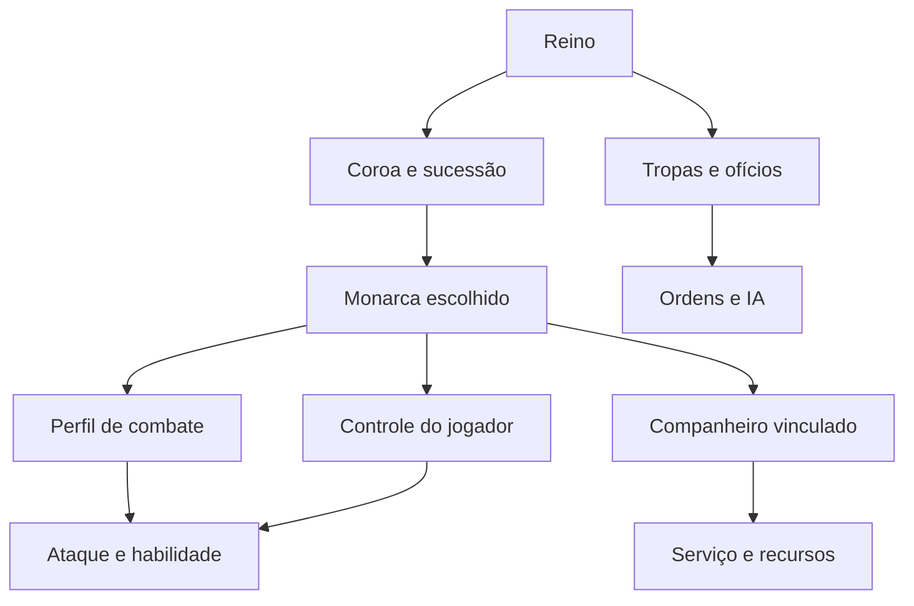
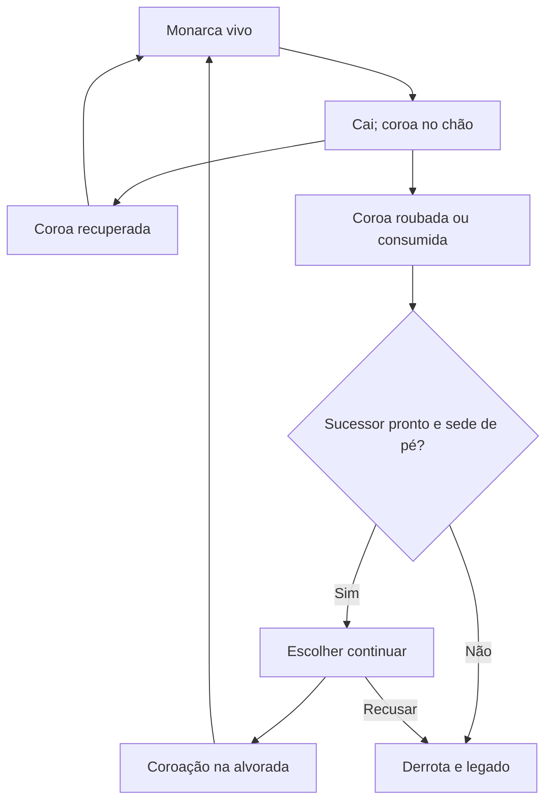

# Empire — unificação de monarcas, classes e companheiros

**Plano mestre de design, revisão de regras e execução**  
**Pedido:** Henrique Passos, 2 de outubro de 2026, horário de Lisboa.  
**Base técnica:** main de henriquecoding/empire, commit [c25580743b5a1abd1de13007ebaa35d8716b2f97](https://github.com/henriquecoding/empire/commit/c25580743b5a1abd1de13007ebaa35d8716b2f97), merge do PR #69.  
**Motor declarado no projeto:** Godot 4.7.2-stable; GDScript e simulação própria.  
**Direção mais recente incorporada:** somente imperadores são controláveis. Troca exige imperador desbloqueado e encontrado na campanha; tropas, ofícios, diplomatas e companheiros permanecem sob IA. O escudeiro do Arqueiro fornece flechas enquanto recebe moedas do próprio imperador; sem moedas, não há novo fornecimento.

**Natureza da entrega:** planejamento. As regras substitutas estão escritas neste documento; código, CSV, respostas do painel e dossiê do repositório continuam na versão auditada. Não se deve confundir uma proposta pronta para execução com uma mecânica já publicada.

## Como ler e aplicar este documento

As marcações distinguem três coisas:

- **D — direção do pedido:** requisito que você trouxe nesta conversa, inclusive quando substitui uma regra antiga.
- **E — existente:** comportamento rastreado no código da main indicada. Não significa que houve playtest nesta sessão.
- **P — proposta:** solução recomendada para preencher detalhes, custos, balanceamento, narrativa ou arquitetura que você ainda não definiu.

Quando D conflitar com uma aprovação anterior, este plano adota a direção mais recente e identifica precisamente a regra substituída. Uma proposta P não deve aparecer no painel como resposta sua, nem entrar num CSV sem identificação em _proposed. Os identificadores MU e UN deste relatório são novos identificadores locais de planejamento; não são tickets ou perguntas já cadastrados.

A auditoria anterior de 27/09 foi consultada como contexto. O diagnóstico abaixo usa a main atual, que já avançou bastante desde aquele relatório. Foram lidos o contrato AGENTS.md, as seções pertinentes do dossiê, ADRs, decisões do painel, dados e caminhos de execução. **Não executei a suíte Godot, nem joguei os três novos monarcas:** eles ainda não existem como sistema unificado.

**Vercel:** o status GitHub/Vercel do commit auditado informa “Deployment has completed”, com [registro de deployment](https://vercel.com/hamriki-s-projects/empire/68FmkHLbQTEtpQXXSsaKJFK2anUA). A conexão disponível não acessa esse projeto/equipe; a consulta à versão pública também não retornou conteúdo. Portanto, há evidência de deployment concluído, mas não de equivalência entre o jogo ao vivo e o código auditado. O projeto indicado pelo README é [empire-phi-eight.vercel.app](https://empire-phi-eight.vercel.app).

### Navegação

1. [A decisão central](#1-a-decisão-central)
2. [O que já existe](#2-o-que-já-existe-e-o-que-a-unificação-realmente-exige)
3. [Regras substitutas](#3-regras-substitutas-e-conflitos-identificados)
4. [Os três monarcas](#4-os-três-monarcas)
5. [Companheiros](#5-o-sistema-comum-de-companheiros)
6. [Controles e interface](#6-controles-interface-e-a-primeira-escolha)
7. [Tropas e ofícios](#7-tropas-ofícios-e-imperadores-encontrados)
8. [Evolução](#8-evolução-em-duas-fases)
9. [Morte e sucessão](#9-queda-morte-sucessão-e-ressurreição)
10. [Exploração e expedições](#10-exploração-expedições-e-defesa-do-reino-ausente)
11. [Diplomacia](#11-diplomata-universal-diplomacia-e-mercenários)
12. [Conquista](#12-conquista-fortalezas-e-impérios-inimigos)
13. [Economia](#13-economia-moedas-ganância-e-impulsos)
14. [Combate](#14-contrato-de-combate-e-sangramento)
15. [Mundo e montarias](#15-mundo-biomas-subsolo-pontes-e-montarias)
16. [Lore e arte](#16-nia-lore-humor-e-direção-de-arte)
17. [Multiplayer](#17-os-dois-modos-multiplayer)
18. [Arquitetura](#18-arquitetura-proposta-e-reaproveitamento-do-código)
19. [Saves](#19-migração-de-saves-e-continuidade)
20. [Atualização do dossiê](#20-como-atualizar-as-fontes-de-verdade)
21. [Fases e tickets](#21-plano-de-execução-por-fases-e-tickets)
22. [Aceite e testes](#22-critérios-de-aceite-testes-e-playtests)
23. [Cobertura da sua lista](#23-cobertura-de-todas-as-ideias-do-pedido)
24. [Decisões ainda abertas](#24-decisões-ainda-abertas-com-recomendação)
25. [Riscos](#25-riscos-e-sinais-de-que-o-design-precisa-mudar)
26. [Fontes](#26-fontes-e-rastreabilidade)

## 1. A decisão central

**Recomendo unificar a escolha inicial e a identidade do governante, preservando classes de tropas e personagens recrutáveis.** A primeira pergunta deixa de ser “qual classe controlarei enquanto um outro rei fica no castelo?” e passa a ser “qual monarca conduzirá este reino?”.

Isso resolve uma divisão artificial do começo atual: escolher Arqueiro ou Bardo hoje cria um personagem adicional, mas deixa outro rei com a coroa, as moedas, o escudeiro e a gestão. Sua nova direção torna o próprio personagem escolhido responsável por lutar, governar, pagar seu companheiro, escolher uma sucessão e decidir quando se expor.

A unificação precisa separar cinco conceitos:

| Conceito | O que determina | O que não deve determinar |
|---|---|---|
| Identidade do personagem | Nome, aparência, história, voz, registro de feitos e morte | Permissão de construção por tamanho do sprite |
| Autoridade da coroa | Gestão, decretos, reino, sucessão e condição de derrota | Uso obrigatório da espada do rei gordo |
| Arquétipo de combate | Arma, alcance, cadência, habilidade e evolução | Propriedade automática de um império |
| Papel de serviço | Construção, cozinha, ferraria, diplomacia, canto e provisões | Tornar qualquer profissional um novo monarca |
| Vínculo de companheiro | Quem acompanha quem, serviço pago, estoque e comportamento | Compartilhar carga com todos os bardos ou escudeiros do mapa |

O rei gordo continua sendo o seu primeiro monarca definitivo. “Monarca” passa a ser a categoria política; seu estilo é o **guerreiro defensivo**. Nia é uma monarca de **combate rápido e apoio por conversão**. O terceiro é um monarca de **combate à distância e desgaste**. Todos governam e exploram. Arqueiros, bardos, diplomatas e outros ofícios são tropas sob IA. O jogador não assume seus corpos. Novas opções de controle surgem ao desbloquear e encontrar outros imperadores na campanha.

### Três escolhas agora; a quarta continua aberta

Sua lista histórica fala em quatro classes iniciais, mas o pedido atual descreve três monarcas e a implementação recente também oferece três opções. Este plano trabalha com **Rei, Nia e Imperador Arqueiro**. Não inventa um quarto monarca para preencher uma vaga nem transforma automaticamente Trepador ou Diplomata nessa quarta escolha.

A estrutura de dados deve aceitar uma quarta opção no futuro. O produto inicial deve mostrar apenas as três completas. O Diplomata é infraestrutura comum aos três, não uma escolha que priva os outros de diplomacia.

### O dilema principal passa a ser presença, recursos e continuidade

- O monarca pode explorar, mas sua presença deixa de fortalecer a guarnição local quando ele está longe.
- O companheiro torna sua especialidade eficaz, mas custa moedas, pode ficar sem recursos e pode ser perdido.
- Uma expedição pode conquistar poder, gente e cultura, mas retira recursos da defesa doméstica.
- Um sucessor pronto preserva a campanha; um sucessor inexistente transforma a morte definitiva do monarca numa derrota.
- Encontrar outro imperador já desbloqueado abre uma troca presencial; desbloquear o arquétipo sozinho não cria um corpo jogável em qualquer ponto do mapa.

Esses custos devem ser visíveis e antecipáveis. O jogador precisa perder por uma decisão ou erro compreensível, não por uma exceção escondida sobre qual personagem o motor chama de monarch.

## 2. O que já existe e o que a unificação realmente exige

| Sistema | Estado rastreado na main | Tratamento no plano |
|---|---|---|
| Escolha inicial | Roster.STARTERS contém monarch, archer e bard; os dois últimos surgem junto de outro rei | Substituir o contrato de começo por escolha de monarca e seu companheiro |
| Troca antiga de corpo | Roster e Assume têm caminhos de assumir classes no código auditado | Retirar essa possibilidade do produto novo; reaproveitar conservação de estado só para troca entre imperadores elegíveis |
| Gestão | Assume.king e verbos baseados em SimLoop.king_id | Tornar a coroa independente do data_id da unidade |
| Rei defensivo | ClassSystem, aura, progressão e Squire com escudo/espada comprados ou carregados por loot | Preservar a mecânica definida; parametrizar vínculo e perfil |
| Ataque manual | PlayerStrike e CombatInput; tropas continuam automáticas | Reaproveitar entrada, cadência e resolução comum |
| Habilidade de quem é rei | CombatInput.queue_skill chama sempre a Vigília | Despachar pelo perfil: Nia precisa usar o bardo; arqueiro precisa marcar |
| Bardo | BardSong converte temporária/permanentemente; BardPromotion promove aliados; HeroWatch liga ao jogo | Reaproveitar regras, acrescentando patrono, orçamento e limites do companheiro |
| Arqueiro | ArcherFocus marca e permite perfuração na fase avançada | Preservar marca; adicionar perfil imperial e ferida persistente |
| Flechas das tropas | Supply registra gastos; banca do arco repõe na alvorada | Preservar; acrescentar aljava imperial e compra em campo |
| Exploração | Assume.limits restringe o rei a king_leash_px; outros corpos percorrem o mundo | Remover a restrição política de distância para novos monarcas |
| Viagem | TravelWatch.at_gate rejeita quem é rei; go desloca apenas o corpo controlado | Permitir monarcas e transportar membros declarados da comitiva |
| Sucessão | Treino, castelo de pé e opção de continuar; DawnWork cria sempre units/monarch | Preservar condições; criar o perfil do sucessor, sua identidade e seu vínculo |
| Coroa no chão | CrownDrop/CrownWatch adiam morte e permitem recuperação até a alvorada | Aplicar aos três; corrigir filtro de criaturas aliadas |
| Marcha | March remove tropas das colunas e resolve um cerco abstrato ao voltar | Evoluir para missões comandadas por Diplomata; preservar marchas antigas em curso |
| Impérios externos | Settlements e SettlementWatch criam tesouro, obras, profissionais e guarnição, com economia local | Acrescentar governantes, sucessores, relações e conquista física consistente |
| Conquista | Realm desconta firmeza da fortaleza e recompensa vassalagem | Não tratar como combate físico já completo entre impérios |
| Subsolo | Sítios delimitados, gerados e persistidos; ADR 0046 | Preservar; ligar companhia, resgate e corpos ao contexto do sítio |
| Diplomata | Perfil, caminho antigo de corpo jogável e treino na embaixada; ClassData exige sementes | Disponibilizar como tropa de IA em qualquer império; retirar controle direto e implementar missões |
| Ressurreição de personagens | Custos no CSV e especificação, mas não foi encontrado fluxo completo de carregar corpo ao santuário | Trabalho pendente; não confundir com a recuperação gratuita da coroa |
| Multiplayer | Especificado como fase futura; estado ainda usa um piloto principal | Preparar IDs e autoria agora; implementar os modos depois |

### Pontos técnicos que mudam a prioridade

**1. Converter o menu sem mudar a coroa não unifica nada.** Se Nia for apenas bard_hero com aparência nova, o rei gordo continuará sendo o responsável oculto por gestão, derrota e sucessão.

**2. O ataque atual escolhe criaturas, não um alvo universal de batalha.** PlayerStrike.target percorre CreatureSystem. TargetPicker também concentra tropas contra criaturas. Guardas de outro owner e edifícios de outro reino precisam entrar num contrato de alvo válido para que a conquista presencial exista. Trocar a animação por “cerco” não resolve isso.

**3. Os assentamentos não têm monarcas físicos completos.** SettlementWatch.author cria cidadãos, construtor, guardas e unidade única; não instancia um governante com companheiro e herdeiro. A janela de sucessão inimiga ainda precisa de implementação própria.

**4. Há uma interação perigosa com a nova Nia.** CrownDrop.tick percorre criaturas próximas sem consultar BardSong.allies nem verificar explicitamente sua vida. Uma criatura convertida pode satisfazer o caminho de roubar a coroa. O contrato novo exige hostilidade real ao reino da coroa, vida e capacidade de roubo. Isso foi confirmado por leitura, não por reprodução nesta sessão.

**5. O progresso está dividido.** O guerreiro usa ClassSystem; Arqueiro e Bardo usam HeroProgress por classe. A unificação precisa especificar a autoria dos feitos e a herança, em vez de acrescentar mais um contador global.

**6. Saída do monarca muda a logística doméstica.** Soldo, flechas e treino do herdeiro hoje retiram dinheiro do saco do rei. Se ele estiver longe, morto ou transportando as moedas numa expedição, o reino não pode contar com um tesouro remoto invisível. O plano propõe reserva local explícita.

**7. A branch padrão do GitHub ainda não é a main.** Toda continuação deve escolher main explicitamente e registrar o SHA analisado. Pesquisa de código na branch padrão pode devolver uma versão diferente da fonte que você usa como principal.

## 3. Regras substitutas e conflitos identificados

### Matriz de substituição

| ID | Regra anterior e fonte | Regra no novo planejamento | Natureza |
|---|---|---|---|
| MU-01 | Começar como Monarca, Arqueiro ou Bardo ao lado de um rei fixo; ADR 0044, §08 | Começar como um dos três monarcas; ele possui a coroa e recebe seu companheiro | D |
| MU-02 | Rei limitado a 1440 px além da região; Q-150, Assume.limits | Todos os monarcas podem explorar até os limites geográficos reais | D |
| MU-03 | Rei nunca sai longe; Q-146 e ADR 0035 | Permanecer em casa é uma estratégia possível; sair é uma escolha de risco | D |
| MU-04 | Só classes viajam; rei fica; Q-178 e ADR 0043 | Monarcas também usam viagens válidas; a comitiva precisa de transporte coerente | D + P para detalhes |
| MU-05 | “Só o rei gere” lido como o corpo do rei gordo | Só titulares de autoridade do reino gerem; os três monarcas iniciais possuem essa autoridade | D |
| MU-06 | Todos os jogáveis têm recursos de batalha ilimitados; Q-163 | Arqueiro imperial gasta flechas; reposição pelo escudeiro exige moedas pessoais do imperador. Sem moedas, não recebe novas flechas | D; capacidade e preço são P |
| MU-07 | Escudeiro específico do ClassSystem guerreiro | Cada monarca começa com um companheiro funcional vinculado ao seu ID | D |
| MU-08 | Bardo inicial é alternativa ao rei | Bardo deixa a seleção inicial e permanece como classe/ofício e companheiro da Nia | D |
| MU-09 | Habilidade de todo corpo considerado rei ativa Vigília | Habilidade depende do perfil; decretos continuam disponíveis pela coroa | D como consequência necessária |
| MU-10 | Sucessor sempre usa units/monarch | Sucessor usa o perfil que foi treinado; começa na sede com identidade própria | D + P para perfil herdado |
| MU-11 | §16 ainda descreve interregno automático sem herdeiro | Morte definitiva do monarca sem sucessor válido encerra a campanha ativa; não há três dias de interregno automático | D; compatível com Q-118/Q-137 |
| MU-12 | “Todos os personagens mortos” é a única derrota textual em §16 | Para o reino, perda da sede ou morte definitiva da última coroa sem continuidade válida é derrota | D + P para multiplayer |
| MU-13 | Evolução do rei persiste no império; §15 fala em 60% de boosts | Desbloqueios e conhecimentos persistem; bônus herdáveis sofrem maturidade reduzida, sem zerar dívidas nem criar campanha nova | P de conciliação; mantém Q-133/Q-143 |
| MU-14 | Diplomata exige desbloqueio por sementes, além de treino | Diplomata básico pode ser comprado/formado em qualquer império; evolução e especializações continuam exigindo progresso | D |
| MU-15 | Marchas saem sem líder diplomata | Incursão delegada nova exige um Diplomata; monarca pode liderar expedição presencial | D |
| MU-16 | Jogáveis sempre maiores que tropas e imperadores maiores que todos; Q-162 | Escala comunica função sem obrigar todo monarca a ser alto: Nia é pequena e continua reconhecível como imperatriz | D |
| MU-17 | Companheiro do trono é um animal por partida; §08 | Companheiro de função real e mascote são papéis diferentes; mascote não substitui escudeiro/bardo/intendente | P |
| MU-18 | Encantados usam uma lista global de aliados | Relação de facção/reino determina amizade e hostilidade, inclusive coroa, tiro, conversão e PvP | P necessária para expansão |
| MU-19 | ClassSystem identifica escudeiro por tag collects_coins | Companhia é vínculo explícito entre personagens; coletar moeda não concede papel de escudeiro | P técnica |
| MU-20 | Escolha de classe pode alterar o corpo e seus números | Somente imperadores podem receber controle; cada troca preserva o estado real das duas pessoas, seus companheiros e inventários | D + P para transação |
| MU-21 | Marcha pode conquistar usando só firmeza abstrata | Missão abstrata continua como percurso delegado inicial; conquista física e seus mesmos resultados tornam-se percurso presencial | P |
| MU-22 | Toda fase avançada do Monarca aplica defesa global | Só o guerreiro recebe esse perfil; Nia e arqueiro têm vantagens próprias e não acumulam automaticamente a aura dele | D |
| MU-23 | Roster permite assumir classe/tropa próxima | Troca acontece com outro imperador desbloqueado, encontrado, vivo e disponível na campanha; não há troca com tropa | D |
| MU-24 | Soldo e treino dependem exclusivamente do saco do rei | Reserva local autorizada sustenta a base; pagamento de flechas em campo continua saindo do imperador que as recebe | P, com limite D |
| MU-25 | §08/§16 e lista histórica admitem controlar tropas de classes | Só imperadores são jogáveis; Builder, Smith, Cook, Bard, Diplomat e combatentes funcionam por ordens e IA | D, correção posterior do pedido |
| MU-26 | Desbloquear uma classe permite criar/tomar seu corpo ao lado do rei | Desbloqueio de imperador é elegibilidade; encontro na campanha é condição adicional da troca | D |
| MU-27 | Alternativa de flecha normal infinita e compra só de especial | Retirada: flechas normais também dependem do abastecimento pago; as já carregadas não somem quando faltam moedas | D |
| MU-28 | Coop descrito como cada jogador controlando uma classe comum | Adaptar coop a imperadores controláveis; a regra antiga de classes sob controle não pode ser mantida em paralelo | D como consequência; formato de coroas é P |

Não revogar o restante de Q-150: caça por arbustos, árvores, lagos, rochas e buracos continua válida. Não revogar toda Q-178: destinos seguros e viagem de dia continuam úteis. Não revogar toda Q-163: a aljava das tropas e a banca do arco continuam funcionando. A mudança é por cláusula, com registro de precedência.

### Texto normativo proposto para o dossiê

> Numa campanha nova, o jogador escolhe o monarca que governará seu reino: o Rei guerreiro defensivo, a Imperatriz Nia ou o Imperador Arqueiro. Cada escolha reúne identidade, combate, autoridade da coroa e um companheiro próprio. Todos podem contratar, construir, melhorar, decretar e explorar. A autoridade pertence ao titular da coroa, não ao nome da classe de combate nem ao porte do personagem.
>
> Tropas, ofícios, diplomatas e companheiros não recebem controle direto. O jogador pode trocar para outro imperador quando ele estiver desbloqueado e for encontrado vivo e disponível na campanha. O desbloqueio não teletransporta esse imperador. A troca preserva vida, ferimentos, progressão, moedas, flechas e companhia de cada pessoa. As condições políticas da troca devem ser explícitas; por proposta deste plano, uma transferência voluntária de governo é atômica e não cria uma segunda coroa.
>
> A morte definitiva de um monarca sem sucessor válido encerra sua campanha ativa. A queda com coroa recuperável não é morte definitiva. Com sucessor pronto e sede de pé, o jogador pode continuar a mesma campanha ao amanhecer, preservando dívidas, consequências, descobertas e território conforme as regras de herança. O legado após derrota e o reinício do zero são fluxos diferentes.
>
> O escudeiro do Imperador Arqueiro fornece flechas mediante moedas pessoais desse imperador. Se não há moedas suficientes, o fornecimento para; flechas já carregadas continuam utilizáveis. Trocar de imperador, viajar ou carregar o save não repõe munição gratuitamente.
>
> O Diplomata básico está disponível em todos os impérios. Pode liderar incursões enquanto o monarca permanece no reino, negociar, correr risco de captura e, depois de evoluir, assimilar impérios e acelerar o treino de sucessores. A ausência de um Diplomata evoluído não impede contratar outro básico.

Este texto consolida também sua correção posterior. As cláusulas de exclusividade de controle imperial, encontro para troca e fornecimento pago de flechas são D. Transferência do governo na troca, números da aljava, reserva doméstica e perfil do herdeiro são P.

## 4. Os três monarcas

### 4.1 Rei guerreiro defensivo — conservar o primeiro definitivo

**D:** gordo, lento em comparação com os outros monarcas, ataque muito curto, dano baixo e pequeno escudeiro que recebe moedas para protegê-lo. A presença dele na batalha ajuda a defesa, mas ele pode morrer.

**E:** 60 de vida, velocidade 80 px/s, dano 3, intervalo 1,2 s, alcance 30 px; defesa de tropas em raio de 260 px na fase base e 25% no império na fase avançada. Os parâmetros existentes não devem ser alterados só para justificar a nova seleção.

**P — identidade de jogo:** a escolha mais tolerante a erros de posicionamento, mas dependente de preparação financeira. É bom para permanecer perto de uma linha defensiva, organizar tropas e conduzir uma expedição prudente. Não deve virar o melhor causador de dano por causa da espada do escudeiro.

| Elemento | Base | Avançado |
|---|---|---|
| Ataque | Espada curta, manual, preservando o perfil atual | Mantém identidade de dano moderado; sua evolução fortalece a formação |
| Defesa institucional | Aura atual de 10% às tropas próximas | Perfil atual de 25% no império de origem; separar isso da presença moral local |
| Companhia | Escudeiro com escudo pago e espada por loot | Investidura em cavaleiro; preservar cargas e condição da companhia |
| Habilidade direta inicial | Vigília atual como atalho explícito de decreto | Continua com preço, limite diário e consequência; não virar recarga gratuita |
| Fraqueza | Alcance curto, dificuldade contra voadores, vulnerável quando a carga acaba | Continua dependente de arqueiros, postos e logística |

O serviço atual do escudeiro é mantido: até cinco moedas no escudo base, cinco golpes fracos ou dois fortes na leitura existente; espada nasce após três moedas de loot e dura três golpes. A versão investida aumenta capacidade e golpes. Esses números já aparecem na implementação e em Q-114, vários como valores ajustáveis; este plano não os transforma em nova aprovação sua.

**Regra do alcance global:** a defesa institucional avançada alcança as tropas elegíveis do seu império, mas não todos os exércitos de cada território anexado por acidente. A presença que impede fuga continua local. Ter o rei numa caverna distante não mantém moral heroica em dois flancos separados do mundo.

### 4.2 Imperatriz Nia — velocidade, convicção e companhia musical

**D:** mulher negra, pequena, rápida, pouco dano por golpe e alta cadência; inspiração de ritmo na Berserker e de trajetória em Joana d’Arc. Seu companheiro é um bardo com bandeira nas costas, remunerado para encantar inimigos e incentivar aliados.

Sua identidade tem duas fontes de poder: o corpo ágil, que precisa se posicionar bem, e a companhia que altera a composição do combate. Ela **não precisa adquirir uma segunda magia própria** para justificar sua escolha. A função que você já criou para o Bardo tem valor suficiente.

| Elemento | Base | Avançado proposto |
|---|---|---|
| Arma | Golpes rápidos de arma curta; machadinhas são a proposta visual mais próxima da referência | Mesma família de arma e cadência legível; evitar uma arma pesada que apague sua silhueta |
| Combate | Dano baixo por golpe; deslocamento rápido; alta exposição em alcance curto | Melhora tática, não invulnerabilidade: aproveitar inimigos convertidos e aliados promovidos |
| Bardo | Encanta criaturas fracas temporariamente e dá incentivo leve | Maestro converte criaturas poderosas elegíveis permanentemente e promove aliados |
| Moedas | Financiam ordens musicais e preparo antes da luta | Custos maiores nas ações que geram aliados persistentes ou promoção |
| Presença | Bandeira e animação deixam claro onde está a imperatriz | Incentivo mais forte, com limite de acumulação e custo declarado |
| Fraqueza | Menor margem para receber golpes; pode ficar sem apoio pago | Perder o bardo ou esgotar orçamento continua mudando a partida |

**Regra importante:** Nia não canta no lugar do bardo. O comando do jogador solicita uma ação do companheiro, validando se ele está vivo, próximo, na faixa apropriada, pronto e financiado. Ele é uma entidade do mundo, não um ícone que gera conversão de qualquer lugar.

**Duas funções musicais visíveis:** “Encantar” e “Incentivar”. Para não sobrecarregar controles, a primeira versão pode usar modo escolhido na interação com o bardo e uma habilidade por botão. O modo ativo fica visível. O modo avançado “Promover” é apresentado em alvo aliado elegível. Não trocar silenciosamente uma promoção por um encanto porque duas entidades se sobrepuseram na mira.

### 4.3 Imperador Arqueiro — distância, ferida e abastecimento

**D:** imperador que dispara flechas, com chance de sangramento ao acertar e perda gradual de vida do inimigo. Seu escudeiro acompanha e fornece flechas enquanto o imperador consegue dar moedas a ele. Sem essas moedas, cessa o fornecimento.

**P:** mantém a marca existente do Arqueiro como habilidade de foco, porque isso reaproveita o combate já construído e ajuda as tropas. A ferida é uma propriedade do tiro, separada da marca. O vendedor é um **intendente de flechas**, nome de função provisório, e não um escudeiro de escudo recolorido.

| Elemento | Base | Avançado proposto |
|---|---|---|
| Ataque | Flecha manual de longo alcance | Reaproveita perfuração existente, com limite coerente de alvos |
| Ferida | Chance de aplicar dano gradual após impacto elegível | Especialização de duração/chance ou perfuração; não aumentar tudo simultaneamente |
| Habilidade | Marca alvo para tropas que conseguem atingi-lo | Marca em área do perfil existente |
| Companhia | Fornece flechas mediante moedas do imperador | Melhora capacidade/preço se aprovado; o pagamento continua obrigatório |
| Fraqueza | Distância mínima segura, aljava, linha de tiro e inimigo que fecha alcance | Armaduras e imunidades limitam desgaste; tropas continuam necessárias |

A correção posterior fecha o contrato: munição finita e novo fornecimento condicionado a moedas do próprio imperador. É uma exceção expressa à Q-163; flecha normal infinita deixa de ser alternativa compatível com este pedido. Preço, lote e capacidade continuam propostas de balanceamento. Não é necessário introduzir outro bloqueio por estoque do escudeiro para cumprir essa mecânica.

**Sem moedas, sem novo fornecimento:** o imperador ainda pode governar, retornar, contratar tropas sob IA e trocar com outro imperador elegível encontrado; também pode usar um golpe de emergência fraco proposto, que não aplica sangramento. Não é permitido fabricar flechas de graça trocando de corpo ou comprando uma unidade nova que devolve o gasto automaticamente.

### 4.4 Primeiro conjunto de números para protótipo

Todos os números novos abaixo são **P**, não balanceamento final. O rei é a referência atual. A tabela serve para tornar o plano testável, mantendo uma única mudança experimental por vez.

| Parâmetro | Rei atual | Nia proposta | Arqueiro imperial proposto |
|---|---:|---:|---:|
| Vida | 60 | 32 | 40 |
| Velocidade a pé | 80 px/s | 108 px/s | 88 px/s |
| Dano direto | 3 | 2 | 4 |
| Intervalo | 1,2 s | 0,45 s | 1,4 s |
| Alcance | 30 px | 26 px | 200 px |
| Dano direto / segundo, em contato contínuo | 2,50 | 4,44 | 2,86 |
| Recurso especial | Escudo/espada da companhia | Orçamento musical | Aljava e moedas pessoais para reposição |

Contra um Rastejante atual de 10 de vida, sem defesa, companhia, caminhada, atraso do primeiro golpe ou sangramento: o rei exige quatro golpes; Nia cinco; o arqueiro três. Com primeiro impacto imediato, o intervalo entre primeiro e último golpe seria 3,6 s, 1,8 s e 2,8 s respectivamente. **Isso é cálculo analítico, não um TTK medido no jogo.**

Nia causa mais dano sustentado quando consegue permanecer perto. Sua vida e exposição precisam compensar isso. Se dominar também segurança, economia e conversão, baixar custo de recurso não resolverá o excesso de poder: reduzir sobreposição de vantagens antes de mexer em números isolados.

## 5. O sistema comum de companheiros

### 5.1 Um vínculo, três serviços

Todo monarca começa com **um companheiro real**, mas os serviços são diferentes. O vínculo contém o ID do monarca, o ID do companheiro, o reino e o perfil do serviço. O jogo não identifica a companhia pela proximidade de qualquer tropa com a tag de coletar moedas.

| Companhia | O que acompanha | O que compra | O que faz sem recurso | O que não faz |
|---|---|---|---|---|
| Escudeiro do Rei | Corpo do rei, ameaças e faixa alcançável | Carga de escudo; espada segue a regra de loot atual | Recolhe/posiciona-se conforme regra atual; sem escudo recua | Bloquear infinitamente ou transferir todas as moedas ao rei |
| Bardo da Nia | Corpo da imperatriz e alvos elegíveis de canto | Ordens de encanto/incentivo; promoção avançada | Segue e sinaliza indisponibilidade | Cantar de outra região ou consumir o tesouro sem autorização |
| Escudeiro do Arqueiro | Corpo do imperador e percurso da companhia | Lotes de flechas pagos pelo próprio imperador | Segue e informa falta de moedas ou aljava cheia | Fornecer novas flechas sem pagamento, usar dinheiro de outro imperador à distância |

**O companheiro pertence à personagem, não à câmera.** Se o jogador troca de Nia para outro imperador encontrado, o bardo continua vinculado a Nia; a nova companhia não toma seu orçamento nem suas qualificações. Se a coroa muda para um sucessor, o vínculo é transferido numa transação de sucessão. Se o companheiro morreu, essa transação não cria um segundo personagem grátis.

### 5.2 Estados necessários

| Estado | Entrada típica | Comportamento e saída |
|---|---|---|
| Acompanhando | Monarca vivo e caminho viável | Segue por rota válida, mantém distância conforme seu serviço |
| Em serviço | Ordem financiada e alvo válido | Executa uma ação; consome exatamente um recurso autorizado |
| Sem recurso | Escudo, crédito ou flechas insuficientes | Recua ou acompanha; anuncia o motivo; não substitui a ação por outra paga |
| Separado | Monarca mudou de faixa ou montou algo inalcançável | Vai à última posição segura ou ao ponto de encontro; informa ausência |
| Ferido | Vida baixa | Pode recuar por postura; precisa de cura como outros personagens |
| Caído | Vida zero | Pode ser recuperado pelas regras de corpo; perde a capacidade de serviço |
| Morto | Janela de recuperação encerrada | Vínculo permanece marcado como perdido até contratação/reposição |
| Vinculado ao sucessor | Coroação confirmada | Reaproveita sobrevivente e seu estado; sem reset de cargas ou orçamento |

A máquina de estados não precisa ser um novo autoload. A simulação pura devolve decisões; a camada core liga ações, eventos e apresentação.

### 5.3 Pagamento do bardo

**P — modelo recomendado:** a imperatriz transfere moedas para um orçamento limitado do companheiro na interação local. O jogador define o modo e, se quiser, autoriza uso automático dentro daquele orçamento. Uma ordem manual também pode comprar uma ação diretamente, mas nunca pagar duas vezes a mesma ação.

1. Escolher modo e alvo.
2. Validar companhia, distância, faixa, recarga, limite de aliados e custo.
3. Reservar o valor de uma ação.
4. Revalidar no tick de execução.
5. Converter/incentivar/promover e consumir o recurso uma vez.
6. Se a ação deixar de poder ocorrer antes do compromisso, devolver a reserva e mostrar a razão.

Não mostrar “paguei e nada aconteceu” quando o alvo morreu entre clique e tick. Depois de uma ação válida, a morte posterior do aliado não gera reembolso.

**P — preços iniciais:** encanto fraco 1 moeda; incentivo de grupo pequeno 1 moeda; conversão permanente 3 moedas; promoção 3 moedas, além de condições de fase e elegibilidade. Orçamento transportável inicial de até 5 moedas. São números para bancada e entram em _proposed. O custo de evolução é separado desses pagamentos.

**Limites propostos:** até dois encantados temporários na fase base e um pequeno limite de permanentes por companhia na fase avançada. O número avançado deve ser validado pela massa e pelo custo dos monstros, não pela vontade de encher o mapa. Um Devorador de 260 de vida não é equivalente a um Rastejante de 10 só porque ambos satisfazem “criatura matável”.

### 5.4 Incentivar não é curar nem produzir experiência infinita

- O incentivo básico concede o boost leve de velocidade previsto para o bardo a aliados elegíveis em raio, por prazo definido nos dados.
- Não restaura vida por si só; isso preserva a utilidade do Cozinheiro e do sistema de cura.
- O mesmo efeito de múltiplos bardos usa o maior bônus válido, em vez de multiplicar indefinidamente.
- O avançado pode promover uma tropa segundo destinos explícitos; não promove coroa, herdeiro, bardo da própria companhia ou unidades que já estão no destino.
- A proporção de vida permanece. Promover alguém com 20% de vida não produz uma tropa com vida cheia.
- Dar ordens sem consequência real não conta como feito. Incentivo precisa ajudar uma atividade/batalha, com limite de crédito por encontro.

O Bardo genérico contratado continua existindo como tropa sob IA. Na primeira implantação, pode conservar seu contrato automático atual de canto, sujeito ao limite de aliados e ao custo de contratação. Nenhum Bardo, genérico ou real, é assumível. Ordens ao Bardo real continuam exigindo pagamento; a IA não pode reutilizar o caminho gratuito de um Bardo genérico para executar o mesmo serviço real.

### 5.5 Flechas como serviço real

**D — regra fechada pelo seu esclarecimento:** o escudeiro dá flechas quando o próprio imperador paga. Acabaram as moedas disponíveis dele, não recebe novas flechas. Não apagar as flechas já carregadas; ele pode gastá-las até a aljava ficar vazia.

**P — início de teste:** aljava imperial de 30, com 12 flechas iniciais; lotes de 12 por moeda, reaproveitando o parâmetro de abastecimento existente. Os três números são propostas, não decisões suas. Para aljava parcialmente cheia, escolher uma regra visível: comprar só um lote que caiba ou manter o restante pago registrado para a próxima reposição. Não cobrar um lote completo e descartar o excedente silenciosamente.

A primeira versão exige companhia viva, próxima, na faixa/sítio acessível e ordem de pagamento válida. Validar moeda e espaço antes de debitar; concluir débito e crédito na mesma transação. Sem moeda, sem flecha; sem espaço, sem cobrança. Estoque físico de produção do escudeiro é extensão futura opcional, pois acrescentaria outra restrição que você não pediu.

Não antecipar dinheiro do tesouro doméstico, de outro imperador ou de crédito invisível. O imperador pode recolher/retirar moedas por uma interação legítima e então pagar. A moeda usada vira custo do abastecimento, não renda reciclada de volta ao mesmo jogador.

O escudeiro não recolhe moedas destinadas a um muro. Compras precisam de alvo e motivo, aproveitando CoinTarget/KingClaims. Se depósito e escudeiro estiverem no mesmo ponto, o HUD anuncia destinatário, lote, preço e saldo. Automatização pode ser acrescentada com autorização local; jamais produz flechas com o saldo pessoal em zero.

### 5.6 Perda e reposição

**P:** companheiros podem cair e morrer. Repor o posto exige uma pessoa e pagamento no reino; não exige ter aquele companheiro vivo para abrir o serviço. Cargas, moedas e flechas não reaparecem por renomear o vínculo. Uma reposição tem novo ID e registro próprio.

A companhia avançada é qualificação conquistada, não “skin grátis” concedida em qualquer nova contratação. Um sobrevivente conserva sua evolução; um substituto pode assumir a função básica e precisa ser investido/treinado para a função superior. Os custos desse treinamento ficam para medição.

A mascote verde prevista no dossiê continua sendo um sistema opcional separado, alimentado por comida. Ela não ocupa o posto real de escudeiro/bardo/intendente nem fornece uma segunda proteção ilimitada por acidente.

## 6. Controles, interface e a primeira escolha

### 6.1 Escolha de início

A interface inicial precisa mostrar a **dupla**, não apenas três retratos de classes.

| Informação obrigatória | Rei | Nia | Arqueiro |
|---|---|---|---|
| Papel em uma frase | Protege a formação e governa perto da linha | Luta rápido e financia apoio musical | Ataca à distância e desgasta alvos |
| Companheiro | Escudeiro | Bardo porta-bandeira | Intendente de flechas |
| Vantagem | Segurança com preparo | Mobilidade e mudança de aliados | Distância e foco |
| Custo da vantagem | Escudo/espada e lentidão | Exposição, orçamento e companhia viva | Munição, estoque e proteção à curta distância |
| Evolução | Defesa e investidura | Maestro, conversão forte e promoção | Marca/perfuração e logística |

O jogo fica pausado até confirmar. O botão final permanece visível em tela pequena. A seleção descreve que todos governam, todos podem explorar e todos podem morrer. Não precisa explicar toda a árvore de progressão antes de começar.

**P:** não oferecer seleção de Ganância na primeira tela. Mostrar um perfil equilibrado inicial, como já acontece nos dados, e apresentar decretos/nobres durante a campanha. Escolher monarca, dificuldade econômica, companheiro, herdeiro e bioma no mesmo momento diluiria a decisão que você quer tornar clara.

### 6.2 Mapa de ações

| Ação | Teclado/rato atual a preservar | Comando atual a preservar | Toque |
|---|---|---|---|
| Ataque manual | F / botão esquerdo | RB/R1 | Botão de ataque |
| Habilidade do perfil | R / botão direito | RT/R2 | Botão de habilidade com ícone e custo |
| Pagar/construir | Verbo 1 atual | Verbo 1 atual | Ação contextual atual |
| Interagir/trocar/mudar modo | Verbo 2 atual | Verbo 2 atual | Ação contextual atual |
| Roda de gestão | Ação atual de roda | Ação atual de roda | Botão de gestão para a coroa |

A intenção de ataque continua presa ao ID de quem a iniciou. Pausa, troca e morte limpam ordens pendentes. Segurar ataque repete à cadência; segurar habilidade não repete gasto de moedas ou decretos. Menus têm prioridade sobre ataque, inclusive cliques/toques em cartões.

**Mudança necessária em CombatInput:** queue_skill não pode tratar todo Assume.king como Vigília. Primeiro identifica o perfil da personagem e a ação escolhida; uma ação de decreto consulta a coroa, uma ação de companhia consulta o vínculo. Autoridade não deve substituir o despachante de habilidades.

### 6.3 Gestos sobrepostos

O Verbo 2 já serve para passagens, viagem, troca antiga de corpo, A/B de muralha, conversão e pagamento do escudeiro. No novo produto, o contexto de troca só reconhece imperadores elegíveis; tropas nunca oferecem “Assumir”. Acrescentar dois serviços invisíveis nesse mesmo gesto criaria gastos acidentais.

**P — regra de contexto:** o foco seleciona uma entidade/obra explícita, o HUD anuncia verbo e preço antes de executar, e um gesto resolve uma ação. A ordem de prioridade não deve mudar sem a indicação mudar. Se duas opções se sobrepõem, o usuário pode escolher o contexto; não deve descobrir a prioridade perdendo moedas.

Pagamento automático ao companheiro só ocorre dentro de um orçamento previamente autorizado. Cair uma moeda entre bardo, muro e recrutável não pode alimentar três sistemas.

### 6.4 HUD suficiente

Mostrar continuamente apenas o necessário para a decisão atual:

- Imperador controlado, vida, reino e indicação explícita de titularidade da coroa.
- Ataque/habilidade, prontidão, modo e recurso que falta.
- Companheiro: próximo, separado, sem recurso, ferido ou caído.
- Aviso doméstico contextual: flanco ameaçado, sede danificada, sucessor pronto/ausente.
- Prazo de captura/dívida quando existir.

Ao explorar, “Sem sucessor” deve ser uma informação consultável e clara; não uma caixa repetida a cada metro. A confirmação obrigatória cabe em enviar uma incursão ou escolher a sucessão, não em cada saída do castelo.

A barra de combate permanece acima do chão do subsolo, conforme ADR 0046. No toque, respeitar área segura, modo canhoto e joystick; os novos preços/modos não podem cobrir a boca de passagem. Navegação de escolha, compra, missão e sucessão usa os mesmos dispositivos do jogo [W05].

### 6.5 Primeiro ciclo de aprendizagem

| Momento | Experiência comum | Variação por monarca |
|---|---|---|
| Início | Coroa, companhia e seis moedas; um cidadão próximo | A dupla demonstra sua identidade sem gastar o jogador por ele |
| Primeiro pagamento | Recrutamento/construção pelo gesto já aprendido | Serviço da companhia aparece como outra escolha de investimento |
| Primeiro combate | Ataque e habilidade têm funções separadas | Rei aprende proteção; Nia aprende apoio; arqueiro aprende foco e aljava |
| Primeira noite | Guarnição e luzes protegem a sede | Monarca faz diferença, mas tropas continuam necessárias |
| Primeiro segredo | Passagem delimitada, prêmio único e história | Companhia comenta/reage sem revelar tudo automaticamente |
| Primeira incursão | O jogador escolhe quem fica e quem parte | Coroa presente ou comando delegado por Diplomata |

Com seis moedas iniciais, gastar cinco no escudeiro já consome quase todo o caixa. Não exigir escudo cheio, canto pago e compra de munição como tutorial obrigatório. Os três começam com capacidade suficiente para ensinar sua ação, sem alterar silenciosamente a economia inicial. Flechas iniciais são equipamento, não moedas extras vendáveis ao próprio sistema.

## 7. Tropas, ofícios e imperadores encontrados

### 7.1 Controle exclusivo de imperadores

**D:** a correção posterior substitui a parte da lista histórica que permitia controlar tropas. Conquista ainda libera tropas, ofícios, habilidades e segredos, mas isso não torna um Construtor, Diplomata, Bardo ou arqueiro comum jogável.

Os caminhos existentes de Roster.take, corpos _hero e Roster.back são evidência de código antigo, não autorização para mantê-los no produto novo. É preciso retirar os contextos de “assumir tropa”, suas dicas e sua entrada nos controles. Sistemas que conservam HP, identidade e inventário podem ser reutilizados na troca imperial.

Tropas resgatadas precisam de destino: acompanhar uma expedição, guardar o posto conquistado ou regressar à sede. Tudo por ordens e IA. Acompanhamento não significa posse de corpo.

### 7.2 Matriz de ofícios sob IA

| Ofício/tropa | Fase base | Fase avançada prevista | Integração com monarcas |
|---|---|---|---|
| Construtor | Constrói e melhora obras atribuídas | Bases das tropas, postos guarnecidos e defesas especiais | Decide-se se permanece dando apoio doméstico ou participa de obras perigosas fora |
| Ferreiro | Armas/escudos que melhoram ataque e defesa | Recolhe e usa equipamento derrubado elegível | Ordens e coleta sob IA; não controlar pessoalmente para experimentar arma |
| Cozinheiro | Vida/vitalidade e velocidade; comida de combate temporária | Melhoria permanente nos alvos elegíveis | Não substitui cura universal; receita, consumo e teto precisam de dados |
| Diplomata | Negocia paz local, progresso e lidera incursões | Assimila e ajuda sucessão | Universalmente contratável em qualquer império; nunca corpo jogável |
| Bardo genérico | Encanta fracos/incentiva por contrato de IA | Conversão permanente e promoção segundo perfil | Distinguir de companhia real paga da Nia |
| Arqueiro comum | Defesa e caça com munição | Especialização cultural e postos | Não recebe sangramento imperial automaticamente |
| Trepador | Monta criatura enorme quase morta por prazo | Melhor duração/controle conforme evolução | Monarca ordena alvo; IA executa, sem controle do Trepador ou da criatura |
| Cavaleiro Enterrado | Recupera-se sentado e cria vegetação | Cura/efeito aprofundado | Exceção explícita à ausência geral de regeneração |
| Cavaleiro Selado | Combate junto da montaria que enxerga por ele | Vínculo e ação avançada | Unidade sob IA; montaria pessoal não vira escudeiro real |
| Mercenário | Combate forte com soldo/risco | Variante especial resgatada | Custos e lealdade próprios; nenhum controle direto |
| Combatentes voadores | Ataque/defesa da faixa adequada | Variantes locais futuras | Ordens com alcance e caminho válidos, sem acesso universal a qualquer alvo |

**P:** manter o contraste entre evolução lenta em posto e rápida em combate: referência de 14 dias domésticos versus quatro dias de exposição relevante. O ganho não depende da câmera nem de o jogador controlar alguém. Cada profissão conta tarefas/contribuições reais, não simplesmente ficar perto de um inimigo.

### 7.3 Deixar uma defesa funcional

Exibir antes da partida: membros, líder, saúde, munição, custo, prazo, pessoas por flanco e profissional essencial ausente. O jogador pode aceitar uma guarnição fraca; não impor uma quantidade arbitrária de tropas domésticas.

Construtor em viagem libera seu posto sem “trabalhar remotamente” na base. Ferreiro fora não fabrica munição no depósito ao mesmo tempo. Cozinheiro pode preparar provisões que ficam na base, mas não servir comida a quem está em outro contexto sem entrega.

### 7.4 Desbloquear não é encontrar

Separar três estados:

| Estado | Significado | O que permite |
|---|---|---|
| Arquétipo imperial desbloqueado | Conhecimento/progresso obtido conforme recompensa | Elegibilidade para início futuro e encontro/troca, conforme política de campanha |
| Imperador encontrado | Pessoa real gerada na campanha, viva e acessível | Diálogo, aliança, condições de recrutamento ou troca |
| Imperador disponível | Desbloqueado, encontrado e politicamente elegível | Troca presencial de controle |

**D:** desbloqueado + encontrado. **P:** exigir disponibilidade aliada, proximidade/contexto válido e ação voluntária, para não controlar automaticamente o soberano inimigo no meio de uma invasão. Um prisioneiro precisa primeiro ser libertado. Um cadáver não vira opção no seletor.

Conquista pode revelar o local de um imperador, libertá-lo, abrir seu arquétipo ou obter audiência; isso é diferente de convertê-lo instantaneamente numa tropa. Distribuir encontros em pontos legíveis, com pista no mapa e história própria. Encontros encontrados não devem reaparecer com vida cheia após derrota/retorno ao mesmo sítio.

### 7.5 Transação de troca imperial

**P — padrão recomendado:** em solo, a troca presencial inclui transferência voluntária da função de monarca ativo do seu reino. Assim o novo imperador governa e luta como sua escolha principal, sem manter um outro rei oculto responsável pela derrota. É uma proposta política de implementação; seu esclarecimento definiu quem pode ser controlado, mas não detalhou transferência de governo.

- Só acontece entre duas pessoas elegíveis presentes no mesmo contexto.
- Não teletransporta ninguém, não recria corpos e não altera seus inventários.
- Não enche vida, não limpa sangramento, não reinicia recarga ou aljava.
- A companhia permanece com sua pessoa; a companhia antiga não muda de profissão.
- Moedas de cada imperador permanecem com ele. Transferência de moeda é interação separada e explícita.
- Território, tesouro local, dívidas, noites, Podridão e decisões permanecem no reino.
- Aura institucional muda para o perfil de quem assume, após uma transação única.
- A coroa antiga deixa de conceder autoridade plena; não surgem duas coroas soberanas no mesmo reino solo.
- Rejeitar a troca durante queda, roubo da coroa, morte em resolução ou sucessão pendente.

O antigo titular entra numa postura de IA: protegido na sede, guardar posto ou acompanhar. Recomendo proteger na sede por padrão. Ele continua pessoa existente, com história e risco; não se transforma em uma tropa comum.

**Alternativa ainda aberta:** mudar somente o controle e conservar o titular político. Nesse formato, o HUD precisa mostrar qual imperador governa e qual está sob controle, e sua morte não pode ser confundida. Para o primeiro protótipo, usar o padrão acima evita reconstruir a divisão de “herói selecionado + rei verdadeiro escondido”.

### 7.6 Imperador disponível não substitui sucessor automaticamente

Disponibilidade para trocar em vida não equivale a sucessão pronta. **P:** outro imperador pode ser designado/preparado como sucessor antes da morte, usando o contrato de continuidade. Sem preparação, não permitir escolhê-lo depois da derrota apenas porque aparece no desbloqueio global.

Se você preferir que qualquer imperador aliado encontrado seja continuidade automática, será necessário substituir expressamente a regra de morte sem sucessor. O padrão deste plano mantém seu risco original: preparar continuidade ainda importa.

## 8. Evolução em duas fases

### 8.1 Duas fases são um teto de identidade, não vinte níveis

Base e avançada precisam produzir diferenças reconhecíveis. Vida/dano podem ajustar-se nos dados, mas não devem ser a única evolução. A fase avançada acrescenta uma função, um custo e um sinal visual.

| Linha | Feito | Custo | Resultado |
|---|---|---|---|
| Guerreiro defensivo | Noites defendidas com presença real; condição atual | Uma Semente Real, como no perfil atual | Defesa institucional avançada e investidura do escudeiro |
| Nia/Bardo real | Conversões de criaturas distintas e participação ativa da imperatriz | Uma Semente Real como ponto inicial de teste | Serviço Maestro, conversão permanente elegível e promoção |
| Arqueiro imperial | Abates que aproveitaram sua marca; aproveitar condição existente | Uma Semente Real como ponto inicial de teste | Marca em área e função avançada do tiro/logística |
| Diplomata | Missões válidas retornadas; condição existente | Evolução com feito e Semente | Assimilação e atalho de treino do herdeiro |
| Ofícios | Atividade doméstica ou exposição em combate | Treino/estrutura e condições próprias | Função avançada definida no dossiê |

Para Nia, reaproveitar as 15 conversões distintas do Bardo é a proposta inicial mais econômica. **Não contar quinze reencantos da mesma criatura**. Definir participação: estar em comando/presente no encontro, em vez de deixar um bardo gastar ouro sozinho durante horas para evoluir a monarca ausente.

O Arqueiro atual usa 30 abates marcados, número proposto nos dados. Preservá-lo como bancada evita mexer na progressão e na nova ferida ao mesmo tempo. A evolução também não deve contar dano contra aliados convertidos ou reabates de uma criatura ressuscitada duplicada.

### 8.2 Domínio dos contadores

| Progresso | Onde pertence | O que acontece na sucessão/derrota |
|---|---|---|
| Aprendizado tecnológico de uma classe no império | Reino/campanha | Mantido na sucessão; evolução volta a ser conquistada após derrota, conforme Q-140 |
| Feitos e título de uma pessoa | Character ID | Não transferidos como se o sucessor tivesse realizado os mesmos feitos |
| Qualificação de uma companhia sobrevivente | Companion ID/vínculo | Mantida enquanto a pessoa sobreviver; reposição não nasce avançada por duplicação |
| Tropas/classes e arquétipos imperiais desbloqueados | Campanha/legado, em registros separados | Desbloqueio não recria pessoa nem dispensa encontrá-la |
| Maturidade de governo | Titular da coroa | Sucessor começa mais fraco e recupera autoridade por experiência |

No protótipo, não reescrever toda HeroProgress de uma vez. Acrescentar uma camada de autoria e uma tabela de progressão real, migrando a leitura atual. A meta é eliminar ambiguidade, não substituir todos os sistemas num único commit.

### 8.3 Maturidade de sucessor

**P:** preservar a fase tecnológica que o império já conquistou e aplicar um fator de maturidade aos bônus passivos herdáveis. A referência do dossiê é 60%. Uma aura adulta de 25% começaria em 15%; um incentivo de 10% começaria em 6%. Capacidade de usar a função avançada, desbloqueios e dívidas não são apagados.

Esse fator não reduz automaticamente vida, dano, alcance e toda a economia. Cada atributo herdável precisa estar listado. Caso contrário, o herdeiro sofre quatro punições simultâneas e deixa de ser uma segunda chance utilizável.

A recuperação de maturidade usa feitos de governo/batalha e prazo indicado. O sistema precisa valer também para o governante inimigo, tornando a janela de sucessão perceptível: formação menor, companhia menos segura e bônus reduzido, com sinais no mundo.

## 9. Queda, morte, sucessão e ressurreição

### 9.1 Quatro eventos diferentes

| Evento | Significado | Continuidade |
|---|---|---|
| Queda do monarca | Vida zero, coroa ainda recuperável | Campanha segue durante a janela de resgate |
| Morte definitiva | Coroa roubada/consumida ou condição definitiva equivalente | Verificar sucessor e sede imediatamente |
| Coroação | Herdeiro válido assume ao amanhecer | Mesma campanha, com consequências e identidade nova |
| Derrota | Sede caiu ou coroa sem continuidade válida | Encerrar campanha ativa e gravar legado segundo contrato próprio |

A recuperação espontânea na alvorada com coroa intacta já é uma decisão aprovada em Q-167. Ela permanece. Removê-la só para tornar exploração “mais perigosa” seria outra alteração que você não pediu. O risco novo vem da distância, dos inimigos, do tempo para resgate, da companhia e de deixar a sede exposta.

### 9.2 Quem pode resgatar

**D:** nenhuma tropa passa a ser controlada para resgatar a coroa. Esse fluxo antigo de CrownWatch/Roster precisa ser substituído.

**P:** outro imperador desbloqueado, encontrado e elegível, realmente próximo, pode receber controle num modo de resgate; recuperar a coroa não equivale a tomar o governo. Companhia e tropas podem resgatar por uma ordem de IA previamente autorizada e alcançar fisicamente a coroa. O comportamento precisa ser definido, não um resgate remoto garantido.

Se não houver outro imperador disponível, acompanhar a janela de coroa e a ação dos aliados por IA. O monarca caído não anda, gere ou compra escudo/flechas. A recuperação espontânea ao amanhecer permanece quando a coroa não foi tomada.

**Filtro obrigatório de roubo:** criatura viva, hostil ao reino da coroa, no contexto permitido e com capacidade de apropriação. Criatura encantada por Nia não rouba sua coroa. No PvP, usar relação real entre reinos, não só uma lista local de aliados.

### 9.3 Morte definitiva sem sucessor

O pedido mais recente prevalece sobre “todos os jogáveis mortos”. Tropas, Diplomata e companhia vivos não mantêm um reino cujo titular morreu definitivamente sem sucessor. Outro imperador disponível para troca em vida não é automaticamente herdeiro; isso exige preparação, conforme proposta de §7.6. Troca é bloqueada quando a queda já está em resolução.

A perda encerra **a campanha ativa**, não necessariamente todo metaprogresso. O legado atual preserva os elementos previstos; “Recomeçar do zero” continua sendo o fluxo que apaga campanha e legado. Esta diferença precisa aparecer na mensagem de derrota para que “perder tudo” não contradiga a decisão anterior sobre continuidade.

O interregno de três dias sem herdeiro fica fora do contrato inicial novo. Seus campos antigos podem ser preservados para compatibilidade, mas não ativos sem uma decisão futura de design.

### 9.4 Sucessor válido

Preservar os critérios atuais: treinado, não recusado e castelo/sede de pé. A Casa do Herdeiro é local de treino; não precisa continuar existindo depois de o treino acabar para que o herdeiro nasça na sede. Isso evita reabrir a contradição resolvida por Q-137.

**P — primeira implementação:** o herdeiro segue o arquétipo do titular no momento em que seu treino foi definido, com identidade própria. A seleção de outro arquétipo para o sucessor pode ser acrescentada depois, antes do início do treino, com requisitos de desbloqueio. Não abrir uma tela com qualquer monarca no momento da morte para produzir um contra-ataque perfeito sem investimento.

| Estado | Preservar | Ajustar |
|---|---|---|
| Império | Obras, território, guarnição, estoques e relações | Presença/maturidade do governante |
| Campanha | Dívidas, soldo em atraso, Podridão, histórias e consequências | Registro da morte e geração dinástica |
| Conhecimento | Desbloqueios, segredo, mapa e fase tecnológica elegível | Feitos pessoais e maturidade |
| Companhia sobrevivente | Identidade, carga, vida, estoque e qualificações | Vínculo com o sucessor |
| Companhia morta | Registro da perda | Reposição contratada; sem equipamento grátis |
| Dinheiro | Caixa local e moedas físicas/pessoais onde ficaram | O herdeiro não recebe automaticamente o saco do morto |

Nia é uma personagem com história. Sua sucessora não deve chamar-se “Nia” de novo por omissão como se a morte nunca tivesse ocorrido. O novo nome, título e registro de linhagem evitam transformar sucessão em respawn silencioso da protagonista.

### 9.5 Ressurreição

A recuperação da coroa não é a ressurreição do santuário. Esta última pode servir a tropas, companhias e imperadores sem a coroa ativa, usando corpo transportável, prazo e pagamento explícitos. Ninguém recebe controle de tropa para transportar o corpo; o monarca ordena um portador de IA.

**Preservar como base de especificação:** 3 Sementes Reais ou 120 moedas, antes da alvorada, com perda de uma fase. Aplicar no mínimo fase 1; não produzir fase zero. O corpo e o pagamento são consumidos uma vez. O jogador escolhe moeda ou semente, sem prioridade invisível.

**P:** morte definitiva do monarca não pode ser revertida depois da derrota por um aliado ir ao santuário; para ele, a oportunidade é recuperar a coroa antes de a morte tornar-se definitiva. Isso mantém a sucessão importante.

Implementar transporte: portador, capacidade, velocidade penalizada, passagem compatível e entrega. Não declarar “ressurreição feita” só porque existe um campo de custo ou um evento unit_revived.

### 9.6 Tropas armadas e fuga

Q-168 já faz a tropa derrotada largar arma e fugir como trabalhador. Isso substitui a interpretação textual antiga de “qualquer tropa a zero morre definitivamente”. O registro do personagem deve diferenciar desarmado/fugindo, caído e morto.

A presença de uma coroa em combate sustenta tropas fracas **próximas**, preservando seu pedido. Um rei distante não impede fuga em todos os postos. Retirar a presença na expedição aumenta risco sem reduzir diretamente a vida dos defensores por uma regra surpresa.

## 10. Exploração, expedições e defesa do reino ausente

### 10.1 Remover a trela, manter o mundo coerente

**D:** os três monarcas podem explorar. O limite passa a ser território gerado, bordas reais, obstáculos, passagens, faixa e alcance de montaria/companhia. king_leash_px deixa de limitar novas campanhas com monarcas unificados.

A base continua no mesmo lugar. Sair não desmonta o reino, não muda automaticamente a região de casa e não limpa o mapa. A ausência afeta a presença e a logística, não a existência do império.

### 10.2 Duas lideranças e uma expedição delegada

| Forma | Quem o jogador controla | Quem lidera | Vantagem | Risco |
|---|---|---|---|---|
| Expedição imperial presencial | Monarca ativo | Esse monarca | Combate direto, presença e gestão em campo | Sua morte pode encerrar o reino; casa perde presença |
| Troca com imperador encontrado | Outro imperador elegível, após troca válida | Novo monarca ativo segundo §7.5 | Muda estilo e companhia sem assumir tropas | Preserva ferimentos, custos e risco político |
| Incursão delegada | Monarca que permanece em casa | Diplomata sob IA | Governo protegido; mundo continua avançando | Falha, perda de tropa, captura ou execução do Diplomata |

Uma incursão pode ser representada fisicamente ou pelo percurso abstrato já usado por March. Ambos precisam dos mesmos custos, integrantes e resultado persistente. **Não existe modo de controlar o Diplomata ou uma tropa durante a missão.** A opção de acompanhar sua câmera não concede controle nem presença real do monarca.

### 10.3 Uma expedição precisa de contrato

Registrar: líder, membros por ID, origem, objetivo, destino, orçamento, suprimentos, partida, prazo, estado e regras de retirada. Os estados mínimos são preparada, em deslocamento, em objetivo, recuando, retornada, capturada e encerrada.

**P — ordens mínimas:** seguir, manter posição, avançar ao alvo, recuar ao posto seguro. Construtor tem objetivo próprio de obra; cozinheiro tem alvo próprio de serviço. “Todos seguem o imperador controlado” não pode substituir as funções dos profissionais.

Ao sair, unidades designadas deixam os postos; o mundo redistribui apenas as vagas livres entre quem ficou. Ao voltar, não recuperar saúde/arma/munição automaticamente. O grupo retorna com os ferimentos e custos que teve.

### 10.4 O imperador substituído no controle

Quando uma troca válida transfere o papel ativo, o imperador anterior conserva sua pessoa e sua companhia. **P:** três posturas possíveis: protegido na sede, guardar a linha atribuída ou acompanhar a expedição. A primeira é o padrão.

Não trocar diretamente para uma pessoa distante pelo menu. O encontro exigido por você é presencial; depois da troca, mudar a câmera para o novo imperador não move o antigo. Cada companhia segue seu vínculo próprio.

Se vários imperadores participarem da mesma comitiva, só o titular ativo aplica a aura institucional principal. Os demais não concedem três governos e três decretos diários. Combatem por IA quando autorizados e continuam sujeitos a dano, cura e perda.

### 10.5 Defesa fora da câmera

Continuar simulando guarnição, produção, manutenção, reparos, flechas, fuga, luzes e Podridão em casa. Separar “fora da câmera” de “região não carregada visualmente”. Apresentação pode parar animações; a simulação não pode congelar a ameaça.

Muster e Retinue atuais ainda conhecem um núcleo principal e o rei. Novos grupos precisam de território/expedição para que a ordem noturna não mande uma expedição inteira de volta ao castelo a cada crepúsculo. Retinue já preserva cidadãos esperando na sede, e isso deve continuar para quem não foi designado.

**P — aviso doméstico:** dois ou três níveis, como ameaça, defesa rompida e sede em perigo. Mostrar direção, lugar e informação disponível. Não teletransportar o monarca para resolver o flanco: deslocamento, montaria, viagem segura ou troca com outro imperador elegível realmente encontrado são escolhas diferentes. Um defensor comum só recebe ordens de IA.

### 10.6 Viagem rápida

Preservar a regra de dia, portão válido e destino vassalo seguro. Estender a elegibilidade à coroa e mover de forma atômica os membros selecionados que realmente estão no ponto de partida, além da montaria e companhia alcançáveis.

Viagem recusa companhia separada, combate ativo ou objetivo comprometido conforme contrato definido. Pode permitir deixar alguém para trás com aviso explícito; não transporta uma pessoa capturada nem ressuscita alguém fora das colunas.

Não permitir atravessar uma dungeon inteira usando o destino do mundo de cima. Sítio subterrâneo e passagem são contexto próprio. A viagem não deve tornar a retirada noturna gratuita ou permitir duas simulações do mesmo grupo no destino e na origem.

## 11. Diplomata universal, diplomacia e mercenários

### 11.1 Disponível em todo império, sem transformar-se em personagem jogável

**D:** qualquer império pode comprar um Diplomata básico. O Diplomata conduz incursões quando o imperador não quer explorar. É uma tropa fundamental sob IA, não uma quarta escolha inicial nem um corpo que o jogador assume.

**P — acesso:** uma banca de emissários vinculada à sede oferece contratação básica; a Embaixada melhora treinamento, capacidade e evolução. A construção especializada não deve ser uma barreira circular em que se precisa de diplomacia para conseguir o prédio que libera diplomacia. Destruir a Embaixada pode interromper treino e serviços avançados, mas, com sede funcional, continua existindo uma forma de recompor o Diplomata básico.

O preço atual de 20 moedas é uma referência de dados, não uma justificativa para oferecer diplomata grátis. Começar com seis moedas significa que a contratação é uma meta de desenvolvimento. Se a primeira saída obrigatória exigir diplomata antes de haver produção suficiente, alterar a sequência da campanha, não esconder um subsídio.

Retirar o bloqueio de duas Sementes Reais para acesso básico. Preservar ou redirecionar o custo para especialização/evolução, com migração dos desbloqueios antigos. Quem já pagou não perde seu progresso; uma compensação, se desejada, deve ter regra única e ser registrada, sem reembolso repetido por load.

### 11.2 Missões distintas

| Missão | Resultado pretendido | Requisitos | Falhas possíveis |
|---|---|---|---|
| Incursão de reconhecimento | Revelar caminho, perigo ou encontro imperial | Grupo, destino e provisões | Retorno antecipado, ferimentos, informação incompleta |
| Expedição militar delegada | Atacar objetivo definido e retornar | Diplomata, tropas e orçamento | Baixas, recuo, captura, cerco inconcluso |
| Trégua com vizinho | Suspender agressão daquele reino por prazo | Relação, alcance diplomático, pacto | Recusa, custo, quebra por agressão posterior |
| Negociação com mercenários | Dissolver, contratar ou enfrentar captura | Acampamento válido e risco anunciado | Dívida, resgate, execução |
| Assimilação avançada | Integrar um império elegível | Diplomata fase 2, Favor e janela política | Recusa; não confundir com conquista automática de qualquer reino |
| Treino de sucessor | Acelerar preparação | Diplomata fase 2, sede e programa válidos | Interrupção por ausência, captura ou estrutura sem funcionamento |

Diplomata não concede paz universal. Trégua envolve reinos identificados; a Podridão continua hostil. Acampamentos de mercenários atacam enquanto não houver resultado que os dissolva ou altere legitimamente sua situação. Ter um emissário perto deles não desliga combate.

**P:** uma missão ativa por diplomata. A mesma pessoa não negocia longe, treina herdeiro em casa e lidera outra incursão simultaneamente. Evolução mais rápida por risco precisa contar missão concluída/contribuição real, não comandos repetidos.

### 11.3 Favor e probabilidades

O dossiê já prevê Dissolução 30%, Contrato 50% e Captura 20%; cada 20 de Favor move cinco pontos de Captura para Dissolução. Com Favor 60: 45/50/5. Esses números são **especificação existente**, não missão plenamente confirmada no código.

Antes de implementá-los, fixar:

- Favor pertence a pessoa, reino ou relação bilateral? **P:** reputação do diplomata por pessoa e relação por reino; evitar um único número que faça todos os impérios aceitarem a mesma negociação.
- Ajustes têm limite: chance de Captura não pode ficar negativa e a soma continua 100%.
- A decisão de resultado ocorre uma vez, com RNG de fluxo nomeado. Load não sorteia de novo.
- Mostrar risco em termos compreensíveis; porcentagem precisa só quando a informação é conhecida. Um resultado oculto pode ser acompanhado de pistas, sem fingir certeza.
- A supertropa nasce uma vez, com origem, unidade de bioma e custo futuro; não duplicá-la ao retornar e carregar save.

**P:** contar uma missão para evolução só depois de seu resultado persistente. Captura pode gerar experiência de risco, mas não o mesmo crédito de negociação bem-sucedida.

### 11.4 Captura, dívida e relógio

Preservar como ponto de partida da especificação:

| Elemento | Regra anterior a conciliar |
|---|---|
| Dívida contratual | 40 + 18 × mercenários contratados |
| Prazo inicial | Seis dias |
| Atraso | Multiplicação diária do saldo por 1,25 |
| Atraso de 1–3 dias | Deserção de mercenários |
| Quarto dia de atraso | Morte do Diplomata |
| Quinto dia em diante | Acampamento marcha contra o reino |
| Pagamento parcial | Reduz saldo e reinicia prazo em três dias |

**Pendência de clareza:** contrato de mercenários e resgate de prisioneiro são duas causas diferentes. A fórmula acima não explica, sozinha, quanto custa resgatar alguém quando nenhum mercenário foi contratado. **P:** definir preço próprio de resgate nos dados, mantendo relógio, captura e pessoa como registros explícitos.

O pagamento parcial atual também abre uma exploração: uma moeda a cada três dias pode impedir a execução para sempre. **P:** manter o pagamento parcial para reduzir saldo, mas não reiniciar indefinidamente o prazo de vida do prisioneiro; usar data limite de execução independente ou exigir parcela mínima relevante para uma única extensão. Escolher e escrever essa regra antes da implementação.

HUD: pessoa capturada, acampamento, saldo, prazo, consequência seguinte e local de pagamento. Uma sucessão não apaga o resgate. Destruir o acampamento por força pode libertar o diplomata, conforme combate e estado do prisioneiro; não cobrar resgate depois de libertação válida.

### 11.5 Não reutilizar a dívida da Candeia

DebtLedger atual registra dívida/memória associada à Podridão e à Candeia com valor monotônico: não é um saldo financeiro comum que pode baixar a cada pagamento. **P:** criar registro separado de obrigação mercenária, com credor, devedor, principal, saldo, datas, juros, prisioneiro e eventos já aplicados.

Perdão Real, quando implementado, atua em obrigações mercenárias elegíveis. Não zera automaticamente memória da Candeia, massa permanente ou consequências da Podridão. Também não revive um diplomata já executado.

### 11.6 Assimilação e sucessão

A referência existente é uma assimilação a cada oito dias, 60 de Favor e monarca alvo jovem/fraco. **P:** manter como bancada, com alvo descoberto, relação viável e ausência de combate ativo no momento da proposta. O prazo e o Favor são dados ajustáveis.

Assimilação transfere território/produção/guarnição pelo mesmo serviço de resultado da conquista, mas conserva registro da rota diplomática e suas consequências narrativas. Governante derrotado em combate, aliado assimilado e imperador disponível para troca são estados diferentes.

Atalho de sucessor: cinco dias em vez de dez, conforme especificação. Definir se o diplomata precisa permanecer e se o custo diário de cinco moedas continua. **P:** manter o custo diário atual e exigir presença/serviço, sem empilhar dois diplomatas para terminar instantaneamente.

## 12. Conquista, fortalezas e impérios inimigos

### 12.1 Dois percursos, um resultado persistente

**E:** Realm e March já resolvem cerco por firmeza abstrata e recompensam vassalagem. **E:** assentamentos externos têm obras e tropas com owners próprios. Isso não equivale a batalha presencial completa contra unidade e edifício de outro império.

**D:** avançar tropas, tomar bases e ganhar habilidades, tropas, mapas e segredos. **P:** construir uma resolução comum que aceite:

- Cerco delegado, com marcha e resultado persistente.
- Conquista presencial, com tropas reais, defesa, governante e retirada.
- Assimilação diplomática, com os mesmos registros territoriais e recompensas próprias.

Nunca dar recompensa duas vezes porque um diplomata resolveu a firmeza enquanto o imperador derrubava a última defesa. Cada objetivo tem ID de conquista e transição única. Resultado abstrato e estado físico precisam reconciliar-se antes de outro percurso agir sobre ele.

### 12.2 O que pode ser conquistado

| Alvo | Função | Condição de resolução proposta | Recompensa principal |
|---|---|---|---|
| Acampamento mercenário | Ameaça e oportunidade | Dissolução, libertação/derrota ou contrato válido | Mercenários, supertropa ou fim da ameaça |
| Base militar | Controle de trecho | Romper objetivo de comando e ocupar | Tropa, rota e posto |
| Fortaleza | Resistência regional | Defesa e comando neutralizados | Cultura/habilidade e vassalagem |
| Império externo | Produção e política | Rendição, sede dominada ou assimilação | Obras, gente, tributo e nova relação |
| Sítio de lore | História e tesouro | Exploração/guardião conforme sítio | Relíquia, pista e memória; não vira império automaticamente |

“Derrotar o rei” não exige automaticamente matar toda população. **P:** rendição com alternativas: integrar, vassalizar, libertar ou retirar-se. Custos de ocupação e reparos mantêm valor da decisão. Saquear, se houver, exige design separado; não inserir como consequência implícita.

### 12.3 Governantes físicos de outros impérios

Acrescentar por reino: titular, arquétipo, companhia, sucessor em treinamento, maturidade, Ganância, relações, tesouro e sede. Não gerar todos os vizinhos como cópias de Nia ou do jogador; usar personagens com identidade local e combate coerente.

A janela de sucessão é legível por bandeira, companhia, postura e bônus reduzido. O jovem sucessor não deve ser apenas “vida menor” invisível. Ataques contra ele podem aproveitar defesa institucional menor e crise de organização, preservando o risco equivalente do jogador.

**P:** um governante inimigo que se rende pode tornar-se aliado/interlocutor; só fica disponível para controle depois de desbloqueio e encontro com condição política satisfeita. Derrubá-lo não o transforma numa tropa assumível.

### 12.4 Recompensas separadas

| Tipo | Persistência | Cuidados |
|---|---|---|
| Unidade resgatada | Pessoa real no mundo | Destino e inventário; não duplicar no portão e na sede |
| Classe/ofício desbloqueado | Conhecimento da campanha/legado | Habilita recrutamento; não controle de tropas |
| Arquétipo imperial | Lista de desbloqueios | Troca ainda exige encontrar a pessoa na campanha |
| Feito/habilidade | Registro pessoal ou tecnologia definida | Não conceder habilidade de todos os monarcas a qualquer um |
| Região/mapa | Descoberta e conectividade | Passagem segura pode depender de defesa mantida |
| Semente/relíquia | Inventário/registro persistente | Uma coleta; tesouro não reabre por retorno |
| Tributo | Relação territorial | Produção efetiva, custo e calendário; não renda duplicada |
| Segredo | Memória e pista | Reage a decisões anteriores, não só contador de baús |

A campanha atual chega a um estado de travessia depois dos capítulos conquistados. A unificação não deve remover esse desfecho silenciosamente. **P:** encontros e desbloqueios imperiais entram no caminho já existente; campanha aberta infinita seria outro projeto.

### 12.5 Retenção, reparos e ocupação

Preservar a referência Q-171: parte das obras fica de pé, outras viram fundações reparáveis com forma/nível preservados. Os 40% são proposta existente, não nova decisão definitiva. Não trocar tudo por uma base perfeita e gratuita.

Ocupação precisa de guarnição, meios de reparo e combustível/luz quando aplicável. O Construtor avançado ganha função real ao consolidar conquistas. Voltar para casa sem deixar ninguém torna o posto vulnerável, mas não provoca reconquista automática num timer sem inimigo atuando.

## 13. Economia, moedas, ganância e impulsos

### 13.1 Cinco destinos da moeda

| Destino | Exemplo | Regra de contabilização |
|---|---|---|
| Renda produzida | Fazenda, pesca, produção e comércio | Ganância incide no ponto previsto de rendimento, uma vez |
| Bolsa pessoal | Dinheiro carregado pelo imperador | Finito; pagamento de flechas vem desta bolsa |
| Reserva doméstica | Soldo, reparos e treino autorizados | Depósito/retirada explícitos; nunca cópia da bolsa |
| Serviço comprometido | Carga do escudeiro ou orçamento do bardo | Valor transferido/consumido uma vez, com capacidade |
| Obrigação | Mercenários, resgate, soldo em atraso | Saldo e consequência persistem em sucessão |

**E:** a economia atual converte produção/coins conforme suas regras, e os serviços da alvorada usam em grande parte a bolsa do rei. **P:** acrescentar tesouro local de funcionamento e autorização por categoria. Dinheiro guardado não fica magicamente acessível ao imperador em outra região.

O início pode conservar a bolsa como fonte doméstica até o tesouro existir; o jogo precisa informar essa regra. Não introduzir um débito remoto silencioso na migração. Prioridade de pagamentos deve ser determinística e visível quando o caixa não cobre tudo.

### 13.2 Fontes e gastos precisam de função real

| Sistema | Fonte/benefício | Custo/risco | Integração |
|---|---|---|---|
| Plantação | Moedas sazonais | Trabalhador, terreno e inverno | Reserva alimentar preserva continuidade |
| Pesca | Renda alternativa | Pessoa, local e exposição | Útil em inverno/bioma apropriado |
| Produção/casas | Conversão de trabalho em moeda | Construção, vagas e Ganância | Profissões disputam pessoas com defesa |
| Comércio | Relação/renda entre pontos | Rota, segurança e prazo | Não declarar caravanas implementadas só por existir trade_income analítico |
| Caça | Recursos/receitas/renda definidos | Exposição e mortalidade | Monarca/tropas caçam por regras de alvo e profissão |
| Animais de fazenda | Galinha põe moeda; vaca fornece moeda ao ordenhar | Manejo, espaço e tempo | Produção temporizada, sem item genérico obrigatório |
| Cozinha | Vitalidade e velocidade | Consumir animal/comida elegível | Produção futura do animal cessa após consumo |
| Flechas imperiais | Reposição de combate | Moedas pessoais pagas ao escudeiro | Saldo zero bloqueia novo fornecimento |
| Companhia real | Escudo, canto e apoio | Orçamento, carga e pessoa exposta | Não transformar todas as companhias em fontes de renda |

**P:** fazenda registra animal por ID, produção seguinte e estado. Ordenhar dez vezes no mesmo instante não gera dez moedas. A galinha não põe moedas por frame. Enviar uma vaca à cozinha consome uma pessoa/entidade animal uma vez; não deixar duplicata produtiva na fazenda.

Isso mantém o humor econômico que você propôs. A UI pode usar uma moeda saindo do ovo/ordenha, sem explicar toda a contabilidade por texto técnico.

### 13.3 Ganância é escolha política, não aparência

A especificação contém Austero 5–15, Equilibrado 20–35, Fastuoso 40–60 e Tirano 65–90, com vantagens e desvantagens. A main usa o começo equilibrado e sorteia Ganância dentro da faixa. Não tratar todos os perfis como seleção plenamente implementada.

**P:** primeiro protótipo escolhe o monarca e conserva perfil equilibrado. Depois, uma escolha política opcional pode alterar Ganância com trade-offs claros. Três monarcas multiplicados por quatro políticas criam doze combinações antes mesmo dos companheiros; validar os três primeiro.

O rei gordo não é necessariamente egoísta por aparência. Nia não precisa ser sempre austera ou moralmente perfeita. O arqueiro não ganha preço barato de flechas por identidade sem uma regra explícita. Separar personalidade, relato e modificador econômico.

Sucessão pode sortear Ganância de novo conforme Q-143. Troca voluntária de imperador tem risco de permitir “rerrolar até sair barato”. **P:** a política econômica fica no reino até decisão explícita; a troca de controle/governo não sorteia Ganância gratuitamente. Coroação por sucessão mantém seu contrato específico.

### 13.4 Decretos, habilidades e serviços são ações diferentes

| Ação | Fonte | Limite |
|---|---|---|
| Ataque | Corpo imperial | Cadência, alcance e recurso |
| Habilidade | Perfil/companhia | Recarga, alvo e pagamento |
| Decreto | Autoridade do reino | Um por dia, custo e consequência |
| Obra/recrutamento | Local e ordem real | Moedas, vaga e trabalhador |
| Troca imperial | Encontro elegível | Estado político e corporal preservado |

CrownSystem atual ativa produção, conversão de vagabundos em lanceiros e Vigília; outros decretos previstos não têm benefício executável e são recusados. Conservar recusa sem cobrança. Não anunciar todos como prontos ao reorganizar a UI.

Preços continuam usando base, crescimento econômico, perfil de Ganância e repetição. Ter três imperadores disponíveis não autoriza três decretos diários no mesmo reino. A chave do limite diário é reino, não personagem ou botão.

**Falha de escopo a corrigir:** o efeito de vida posterior de Vigília percorre hoje unidades não neutras de múltiplos owners. Com impérios físicos e multiplayer, efeitos precisam do reino emissor. Uma Vigília não penaliza a vida dos soldados de todos os reinos.

### 13.5 Curar preserva ofícios e risco

Regra geral: tropas/classes não regeneram vida sozinhas. Companhia não cura por reaparecer no vínculo. Troca de imperador não cura. Avançar fase preserva proporção de vida. Regressar de marcha não preenche saúde automaticamente.

Fontes propostas/previstas: comida/serviço próprio, local de cura quando especificado, ritual de ressurreição e exceção do Cavaleiro Enterrado sentado. Separar aumentar vida máxima, restaurar vida atual e conceder vitalidade temporária. Não fazer uma promoção curar acidentalmente ao mudar máximo de HP.

## 14. Contrato de combate e sangramento

### 14.1 O contrato comum de alvo

**P:** validar todo ataque/efeito por ator, alvo tipado, reino, relação, vida, faixa/sítio, alcance e capacidade. Alvos possíveis são criaturas, unidades de outro reino e obras atacáveis. Não identificar inimigo apenas por estar em CreatureSystem.

A apresentação de uma flecha é outra camada. O combate manual atual confirma alvo/impacto por sua lógica; não presumir projétil físico com colisão completo porque há sprite de flecha. Preservar Q-185 de antecipação, impacto e recuperação legíveis, sem refazer o dano por acidente.

Ordens pertencem ao imperador que iniciou a ação. Trocar imperador invalida intenção pendente, não transfere um ataque ou compra a outro corpo. Ataque segurado respeita intervalo; habilidade e compra pagos não se repetem a cada frame.

### 14.2 Sangramento: uma proposta pequena e testável

**D:** chance de uma flecha acertada aplicar dano ao longo do tempo. **P — bancada inicial:**

| Parâmetro | Proposta |
|---|---|
| Chance | 20% por impacto elegível que causou dano |
| Duração | Quatro segundos |
| Dano | Um ponto a cada segundo; primeiro tick após um segundo |
| Acumulação | Uma instância por alvo; novo proc renova duração, sem multiplicar dano |
| Arquétipo | Apenas Arqueiro imperial; não todos os arqueiros comuns |
| Elegibilidade | Alvos orgânicos com capacidade de sangrar |
| Save | Fonte, alvo, dano, prazo, acumulador e autoria persistidos |

São valores novos em _proposed. A chance usa RNG de combate nomeado. Não sortear em tiro falhado, efeito visual, alvo aliado ou golpe bloqueado sem dano.

**Limite analítico:** 20% × quatro pontos dá até 0,8 de dano adicional por impacto isolado. Com dano direto quatro e intervalo 1,4 s, o teto simples seria 3,43 de dano/s se cada efeito pudesse completar seus ticks sem morte nem renovação. Não é o DPS real: o modelo de renovação, a duração da luta e a vida do alvo reduzem/interferem no resultado.

### 14.3 Sem imunidades implícitas pelo nome

| Alvo | Recomendação |
|---|---|
| Criatura orgânica comum | Sangra se viva, hostil e elegível |
| Guarda/mercenário inimigo | Sangra segundo material/proteção e regras de unidade |
| Criatura puramente mineral, substância ou espectro | Capacidade explícita define imunidade |
| Muro, torre ou porta | Sem sangramento; dano de cerco próprio |
| Candeia/entidade não matável | Sem dano e sem sangramento |
| Criatura convertida aliada | Sem novo proc hostil; efeitos existentes precisam revalidar relação |
| Monarca/companhia do mesmo reino | Sem fogo amigo no contrato inicial |

Não presumir que toda Podridão é imune ou que toda criatura matável tem sangue. Essa capacidade vem dos dados. Uma armadura que reduz dano inicial não precisa bloquear toda ferida; escolher regra explícita, sem duas reduções invisíveis.

**P:** ao converter alvo, suspender/remover sangramento hostil da mesma facção para evitar matar o novo aliado com flecha já resolvida. Registrar autoria para não dar abate/feito ao jogador por destruir seu próprio convertido. No PvP, efeitos de uma terceira facção seguem a relação correspondente.

### 14.4 Ordem de resolução

1. Receber intenção e validar ator/recurso.
2. Resolver posição, alcance e alvo.
3. Consumir flecha no disparo válido conforme contrato; tentativa sem flecha não consome recarga paga.
4. Aplicar defesa/escudo e dano inicial.
5. Sortear efeito só se houve impacto elegível.
6. Avançar ticks periódicos em ordem determinística.
7. Resolver queda/morte uma vez, com autoria e eventos.
8. Aplicar recompensa, feito, corpo/desarme e consequência política.
9. Limpar referências inválidas e persistir o estado.

Definir se uma flecha disparada que erra consome munição. **P:** sim; falha de validação antes do disparo não consome. O comportamento atual de cooldown em ataque manual vazio deve ser documentado separadamente, sem gastar recurso duas vezes.

Se ataque e sangramento matam no mesmo tick, apenas um evento de morte e uma recompensa. Se o alvo sumiu por marcha, troca de sítio ou migração, não atingir outro alvo reutilizando índice da coluna. IDs estáveis são obrigatórios.

### 14.5 Respostas e limites

Nia precisa aproximar-se e proteger o bardo; arqueiro precisa distância e moedas; rei precisa companhia carregada e tropas contra voadores. Combate deve ensinar essas respostas por postura/som/UI, não por mensagem de “classe errada”.

Não dar à fase avançada perfuração ilimitada, sangramento acumulável e abastecimento mais barato ao mesmo tempo. Testar uma especialização primeiro. Construtor e Ferreiro melhoram o exército; não invalidar esse progresso com uma flecha imperial que ignora toda defesa.

## 15. Mundo, biomas, subsolo, pontes e montarias

### 15.1 Preservar o mundo que já tem contrato

O reino principal continua geograficamente fixo. Explorar não move sua sede, não reinicia a noite e não troca toda a simulação pela região da câmera. Biomas, estações, povos, acampamentos e ruínas continuam coerentes com a seed e com o que já foi revelado.

As oito culturas previstas têm construções, unidades e produção próprias. A unificação deve usar esses ecossistemas para distribuir encontros imperiais e estilos de defesa, em vez de espalhar o mesmo trio em toda aldeia. Um encontro pode ser fixo num local de história e variar sua situação por campanha; gerar identidade aleatoriamente e depois atribuir toda a biografia de Nia seria incoerente.

A primeira implementação deve colocar os encontros num percurso finito conhecido. O gerador mais complexo vem depois de provar que desbloqueio, descoberta, companhia e troca persistem.

### 15.2 Pontes e segundo nível

**D:** criar pontes/plataformas para escapar de tropas terrestres. **P:** são posições elevadas com acesso, suporte e alvo próprios, não equivalem automaticamente à faixa aérea de criaturas voadoras.

| Relação | Regra proposta |
|---|---|
| Unidade no chão → plataforma | Só ataca se arma/alcance/capacidade permitir |
| Arqueiro → plataforma | Linha e alcance válidos; sem ignorar parede de suporte |
| Voador → plataforma | Pode ameaçar a rota elevada conforme sua própria capacidade |
| Corpo pesado/montaria → ponte | Compatibilidade e capacidade definidas |
| Companheiro → passagem elevada | Precisa de caminho; não salta ao jogador automaticamente |
| Ponte destruída | Queda/retirada conforme regra clara; não atravessar pelo vazio |
| Construtor → ponte | Obra atribuída com custo e exposição |

Não adicionar uma física vertical completa só para uma fuga pontual. A lógica de alcance precisa distinguir elevação, faixa e sítio. Evitar uma ponte que torne a coroa invulnerável a todos os inimigos terrestres sem rota alternativa, ataque à estrutura ou custo de manutenção.

### 15.3 Metade inferior da tela e sítios secretos

Preservar ADR 0046/Q-186: em superfície, a metade inferior pode ser paisagem; uma boca/passagem leva a um sítio subterrâneo delimitado. Há porões de armazém/adega/celeiro e dungeons contextualizadas. A revelação é local, não um subterrâneo infinito totalmente aberto.

A referência recente limita sítios a até doze salas. Isso é limite de projeto atual, não motivo para fabricar doze salas em todo porão. Um celeiro pode ter um cômodo; uma ruína importante pode ter sequência maior.

Cada sítio guarda: ID, seed de primeira entrada, salas, acessos, tesouros, guardiões, passagens reveladas e estado de saque. Entrar, sair, avançar o dia e carregar não ressorteiam tudo. A guarita subterrânea e o cadáver mantêm contexto, sem colisão de IDs com a superfície.

**Integração imperial:** validar se montaria entra; colocar companhia que não cabe num ponto seguro; permitir retorno sem aprisionamento por escoras; resgate da coroa tem caminho real. Não teleportar bardo para cantar através do piso.

### 15.4 Biomas caóticos e eventos

**P:** cada bioma caótico oferece sinais prévios, evento compatível e consequência recuperável. Exemplos de bancada:

| Evento | Sinal | Consequência/decisão |
|---|---|---|
| Rajada de cinza | Fauna recolhe-se; vento visível | Companheiro perde ritmo/visibilidade; esperar ou atravessar |
| Crecimento agressivo | Raízes e som subterrâneo | Caminho muda; Construtor abre passagem alternativa |
| Bando migratório | Pegadas/voos acima | Caça ou risco de interceptação |
| Eco da Candeia | Luz/voz já associada ao lore | Informação tentadora com consequência persistente |
| Fenda de Podridão | Mancha e reação dos moradores | Novo flanco ou rota interrompida |

São propostas de conteúdo, não eventos confirmados. Primeiro implementar um evento testável com aviso, duração e persistência. Não sortear morte inevitável fora da tela. Caos pode ser surpreendente sem ser incompreensível.

### 15.5 Montarias e comitivas

Manter início a pé. A referência Q-169 estabelece cavalo comprado, marcha 1,7×, galope 2,1× e corrida a pé 1,8×; preço e capacidade da sela são parâmetros já propostos. Medir velocidades relativas: “Nia é rápida” depende também de como sua velocidade base combina com montaria.

**P — regra:** multiplicadores vêm da montaria/perfil por contrato; não somar corrida, galope e incentivo indefinidamente. Diferenciar montar, alimentar, carregar item, retirar moeda e pagar serviço. Sela com moedas não paga flechas automaticamente: transferência para a bolsa do arqueiro ocorre primeiro, numa ação legítima.

A companhia precisa acompanhar de forma possível. Para o primeiro cavalo, permitir marcha de comitiva compatível; galope pode separar bardo/escudeiro e desativar serviço até reencontro. Alternativa futura é transporte específico para companhia. Não esconder uma duplicação de montaria.

Cavaleiro Selado continua um personagem sob IA com relação própria com seu cavalo. Não converter sua história numa habilidade gratuita de qualquer imperador.

### 15.6 Defesas por bioma

Preservar as duas escolhas de muralha: guarnição ou fortificação, com consequências mutuamente exclusivas no nível conforme regras atuais. Adicionar visual de cultura não dá os dois benefícios ao mesmo tempo.

Torres/defesas novas precisam de função: anti-aérea, alcance, contacto, reforço ou controle de passagem. Cada uma tem obra, custo, postos, abastecimento e alcance. O Construtor avançado habilita montagem/manutenção; tropas precisam ocupar postos. Uma torre vazia não dispara “porque é uma construção”.

Não retrabalhar o visual já corrigido em ADR 0051 para cada novo monarca. Arte de prédio, escolha A/B e autoridade imperial são camadas diferentes.

### 15.7 A noite continua pressionando ambos os lados

A sombra/substância avança de noite, invoca inimigos e ameaça defesas; some/recolhe ao dia conforme ciclo atual. Ao explorar, o monarca enfrenta esse relógio sem congelar o reino ausente.

Preservar decisões recentes sobre fendas/flancos e massa total: dois pontos de entrada não devem duplicar a massa da noite por acidente. Expedição, território novo e outro imperador encontrado não contam como “nova campanha” para reiniciar a ameaça.

Um diplomata negociando não interrompe Podridão. Um inimigo convertido pode lutar contra ela, mas deixa de roubar a coroa aliada. Uma montaria veloz reduz tempo de regresso, sem anular noite, fogo ou terreno.

## 16. Nia, lore, humor e direção de arte

### 16.1 Transformar referências numa personagem do universo

A referência visual enviada comunica corpo compacto, energia e armas curtas. O anúncio oficial da Berserker descreve uma unidade corpo a corpo pequena e rápida; isso sustenta o ritmo de referência, sem importar números ou habilidades de Clash Royale para Empire. A proposta de Nia conserva sua identidade própria: mulher negra, adulta, pequena, imperial e acompanhada por bardo/bandeira. [W03]

O Historial Jeanne d’Arc apresenta a trajetória de origem humilde, chamado, missão junto ao poder real, vitória em Orléans, coroação em Reims, captura, julgamento e reabilitação posterior. São pontos históricos de inspiração. Nia é uma imperatriz ficcional de outro universo; Joana não foi imperatriz nem governou um reino como personagem de estratégia. [W04]

### 16.2 Arco narrativo proposto

| Movimento | Adaptação para Nia | Como aparece no jogo |
|---|---|---|
| Origem | Jovem de comunidade pequena que viu a Podridão afetar pessoas próximas | Casa, objeto e relato local; não precisa de exposição longa |
| Chamado | Voz/visão ambígua que indica uma possibilidade de resistência | Sítio secreto e versões conflitantes de testemunhas |
| Audiência | Convencer uma corte que duvida de sua autoridade | Missão de confiança e serviço diplomático |
| Primeira libertação | Romper uma base decisiva e devolver esperança | Conquista com diferença visível no território |
| Bandeira | O bardo torna as vitórias memória coletiva | Bandeira, música e reações de tropas |
| Legitimação | O reino reconhece sua autoridade por ação e continuidade | Coroa, povo, sucessão e relação com nobres |
| Traição/captura | Interesses políticos contestam suas alianças e o poder do canto | Missão/evento condicionado, com resgate possível |
| Julgamento/memória | Versões de sua história competem; a verdade pode exigir exploração | Documentos, ruína, testemunho e legado de campanha |

Tudo nessa tabela é **P**. O chamado não fica automaticamente confirmado como voz benevolente. A Candeia pode oferecer uma interpretação tentadora; o jogo precisa manter coerência com o lore existente antes de decidir sua origem.

A inspiração pode incluir fogo, acusação, fé, abandono político e memória posterior. Não tornar a morte de Nia um evento obrigatório em toda campanha: isso contradiz a possibilidade de governar, encontrar outros imperadores e preparar sucessão. Captura/julgamento pode ser ramificação evitável; morte e legado podem produzir versões posteriores da história.

### 16.3 O bardo é parte da história e do sistema

O bardo carrega a bandeira nas costas como você definiu. Quando caminha, a bandeira identifica a dupla; quando canta, a animação comunica alvo, custo comprometido e efeito. A bandeira não flutua perto de Nia quando o bardo morreu.

**P:** o canto convence, fascina ou reorganiza vontade segundo a natureza do alvo. Conversão temporária e permanente têm leituras distintas. Algumas pessoas podem desconfiar desse poder; isso vira missão/reação local, sem bloquear toda jogabilidade da imperatriz.

Humor: o bardo pode ensaiar um hino heroico enquanto pede pagamento adiantado; Nia tenta manter solenidade com alguém carregando uma bandeira grande demais. A graça vem da relação, da economia e da personalidade, sem reduzir sua autoridade à cor da pele ou à altura.

### 16.4 Distribuir história pelas mecânicas existentes

- Conquista revela relato do lado derrotado, não só prêmio.
- Animal/montaria e companhia têm reações que mostram vínculo.
- Sítios secretos contradizem uma versão oficial.
- Mercenário resgatado pode conhecer um episódio omitido pelo bardo.
- Cavaleiro Enterrado deixa vegetação que vira pista de passagem.
- Cavaleiro Selado usa a confiança no cavalo como contraste com Nia, que aceita olhar e enfrentar.
- Sucessor jovem herda uma bandeira com memória, mas não os feitos pessoais da antecessora.
- Ganância muda resposta da corte; não muda retroativamente fatos já registrados.

Escolher poucos encontros que se conectam. Um baú com texto aleatório não cumpre “revelar mais da história e do universo” se o que foi lido não altera compreensão, relação ou pista.

### 16.5 Lista de produção visual por monarca

| Entrega | Rei definitivo | Nia | Arqueiro |
|---|---|---|---|
| Silhueta e paleta | Preservar e revisar legibilidade | Pequena, ágil, negra; realeza por coroa/bandeira/postura | Arco/aljava/coroa com mão de tiro clara |
| Locomoção | Reaproveitar | Caminhada, corrida, parada e mudança de direção | Caminhada, corrida e deslocamento com arco |
| Ataque | Validar alcance/animação atual | Antecipação curta, contato e recuperação rápida | Preparação, soltura e recuperação |
| Ferimento/queda | Verificar existente | Ferido, queda e coroa separada | Ferido, queda e coroa separada |
| Montaria | Compatibilizar | Assento e arma compatíveis | Tiro montado só depois de contrato próprio |
| Companhia | Escudo/espada/cargas | Bardo, bandeira, canto, incentivo e promoção | Escudeiro, pagamento, entrega e falta de moedas |
| Fase avançada | Investidura legível | Sinal de Maestro/autoridade sem aumentar corpo obrigatoriamente | Evolução de equipamento/companhia |
| HUD e glifos | Preservar gramática | Modo musical, custo, ausência e aliados | Flechas, moedas, sangramento e marca |

Não produzir todos os frames antes de validar velocidade/cadência num protótipo. Usar placeholders/reaproveitamento técnico primeiro e integrar arte pela rota do projeto. AGENTS protege edição automática de assets de arte/áudio.

Distinguir área útil do personagem, canvas de autoria e escala exibida. O projeto possui arte e tiers com dimensões diferentes; “64×64” não autoriza redimensionar à força os assets existentes. Para Nia, uma exceção deliberada ao “imperador sempre maior” é parte do pedido, com contraste por bandeira/coroa/silhueta.

### 16.6 Som e leitura sem excesso de texto

Três famílias de feedback: moeda comprometida/recusada; habilidade disponível/companhia ausente; impacto/proc de ferida. Sangramento precisa de sinal discreto que não pareça novo ataque. Canto básico e permanente têm fim reconhecível.

Informação de preço, prazo ou sucessão não deve depender exclusivamente de som ou cor. Ícone, número e glifo devem concordar. É possível conservar a linguagem quase sem texto e ainda deixar o jogador compreender uma compra e uma ameaça.

## 17. Os dois modos multiplayer

### 17.1 Atualizar o pedido histórico sem reabrir controle de tropas

**D:** existem dois objetivos multiplayer: coop com personagens distintos e dois impérios nas extremidades competindo por conquista. **D mais recente:** somente imperadores são controláveis. Assim, “cada jogador com uma classe” passa a significar **cada jogador com um imperador**, sem permitir posse de Bardo, Construtor, Diplomata ou soldado.

A regra de encontro é central no solo. **P:** no lobby coop, os imperadores iniciais dos dois participantes já se encontram por um começo escrito em conjunto. Novas trocas durante campanha continuam exigindo desbloqueio, encontro e disponibilidade; entrar em multiplayer não cria qualquer personagem desbloqueado num lugar arbitrário.

### 17.2 Coop: um reino, dois imperadores

**P — formato inicial:** um império, dois imperadores e suas companhias. Um é titular soberano; o outro tem autoridade delegada claramente definida. Os dois lutam/exploram. A gestão é compartilhada por permissões do reino, e decretos têm um limite diário comum.

É uma exceção multiplayer explícita à coroa única controlada do solo. Não aproveitar dois inputs no mesmo SimLoop.king_id e esperar que ambos recebam companhia, inventário e condições de derrota corretas.

| Questão | Regra recomendada para primeiro coop |
|---|---|
| Moedas | Bolsas pessoais e tesouro compartilhado; transferência local explícita |
| Flechas | Arqueiro paga seu escudeiro com sua bolsa; não debitar colega por engano |
| Decretos | Um por reino/dia; disputa resolvida por autoridade/ordem confirmada |
| Construção | Cada ordem tem autor; recursos reservados uma vez |
| Conversão | Aliados pertencem ao reino; autoria do feito pertence a quem contribuiu |
| Troca | Pessoa não pode ser controlada pelos dois; encontro e cessão válidos |
| Queda do colega | Outro imperador pode tentar resgate real |
| Titular morreu | Usar continuidade preparada; colega não vira herdeiro automaticamente |
| Comandante morreu | Perda da pessoa; não derrota automática se a coroa válida continua |
| Sede caiu | Derrota do reino conforme contrato de campanha |
| Saída de jogador | Imperador entra em postura segura de IA; não some com moedas |
| Retorno | Retoma a mesma pessoa/estado, sem criar nova aljava ou companhia |

Se o formato desejado for duas coroas equivalentes com “só termina quando ambas acabam”, isso precisa de regra própria de herança e limite de decretos. Não deixar o motor escolher a condição pela ordem dos IDs. Para o primeiro coop, recomendo titular + autoridade delegada.

### 17.3 Competitivo: dois reinos

Cada jogador começa com império em uma extremidade, imperador e companhia. Territórios centrais dão produção, unidades, encontro e passagem. A Podridão continua ameaça do mundo, evitando que a partida se torne só corrida de DPS.

**P — vitória:** derrubar a sede rival ou encerrar sua continuidade real conforme regras de coroa/sucessão. A simples queda recuperável não equivale a vitória. Uma condição por domínio territorial pode ser adicionada em variante separada, sem misturar dois finais não anunciados.

Para modo competitivo legível:

- Distribuição inicial comparável de recursos, distância e ameaça.
- Seed e eventos compartilhados; sorte não ressorteada por desconexão.
- Greed/política inicial declarada e equivalente em condição competitiva.
- Identificação de reino além da cor da roupa.
- Criaturas convertidas atacam conforme hostilidade, não “todos que não são meu bardo”.
- Trocas e encontros respeitam propriedade/relação; não roubar controle do imperador rival.
- Assimilação não toma instantaneamente o reino humano com os mesmos requisitos de um vizinho NPC.
- Sucessor, prazo e derrota têm regras visíveis desde o começo.
- Partida deixa de usar acesso global do singleton principal para ambos os lados.

O rei defensivo não pode buffar o rival com aura global. Vigília não reduz vida das tropas inimigas no dia seguinte. Inventário, Favor, música, marca, dívida e decretos têm autoria/reino.

### 17.4 Ordem de implementação

1. Modelo de dados sem pressupor um único dono político.
2. Dois inputs locais e dois imperadores, sem rede.
3. Coop completo de construção, pagamento, resgate e save.
4. Protótipo local de dois reinos com relações e vitória.
5. Rede em cenário pequeno, depois integração da campanha.

Godot oferece camadas de multiplayer, mas a documentação distingue suporte por plataforma: navegador oferece WebSocket/WebRTC e não acesso bruto a TCP/UDP como num cliente nativo. A API de rede baseada em Nodes também não deve entrar diretamente nas classes puras da simulação. [W10]

**P:** adaptador de rede recebe intenções e valida autor/ator no host; a simulação pura resolve ações e publica resultado. Não sincronizar só posição e moedas e deixar morte, RNG e conversão divergir.

### 17.5 Vercel e o jogo online

A configuração atual de Vercel publica o export web e o dossiê como conteúdo do build/site. Isso é distribuição do cliente atual; não demonstra que existe serviço de sessão multiplayer.

**P:** preservar esse papel enquanto se decide transporte e servidor/sinalização da rede. Fazer um teste de compatibilidade com o export fixado e navegadores alvo, incluindo áudio, foco, armazenamento e conexão. A documentação de export web traz limitações próprias que precisam ser conferidas no runtime do projeto. [W11]

Não provisionar backend, trocar hospedagem ou instalar serviço só por existir um plano multiplayer. Primeiro provar dois jogadores na mesma máquina e os contratos de autoria. O acesso Vercel desta sessão não permitiu inspecionar o projeto do deployment de Empire; o diagnóstico público continua limitado ao que foi registrado no início deste documento.

## 18. Arquitetura proposta e reaproveitamento do código

### 18.1 Uma extensão orientada a dados

**P:** preservar UnitSystem, IDs, colunas, combate e sistemas puros. Acrescentar identidade imperial/autoridade/vínculo sem transformar todos os ofícios em heróis e sem copiar ClassSystem três vezes.

Um monarca combina definição de combate, registro pessoal, estado de governo e companhia. Uma tropa combina definição de unidade, profissão, tarefa e progresso. O nome monarch não pode continuar sendo um teste suficiente para todas essas coisas.

A documentação oficial de Godot distingue Resources como dados; isso é compatível com definições geradas pelo pipeline do projeto. O estado variável da campanha continua serializado em tipos base, sem carregar Resources a partir de conteúdo de save. [W09]

### 18.2 Definições estáticas mínimas

| Definição | Campos necessários | Origem proposta |
|---|---|---|
| Perfil imperial | ID, unidade, combate, evolução, passivos, companhia, armazenamento, display_key | Nova tabela pequena de monarcas |
| Perfil de companhia | ID, unidade, serviço, capacidade, alcance, preço, recarga, reposição | Nova tabela de companhias ou perfil Resource equivalente |
| Unidade | HP, velocidade, alcance, dano, tags, faixa, animação | units.csv existente |
| Evolução | Condição/feito, custo, fase e resultado | classes.csv reutilizado com domínio explícito |
| Regra de efeito | Chance, duração, periodicidade, material elegível | ability_params/regra já existente; nova tabela só se houver necessidade real |
| Texto | Nome, ação, recusa, preço e tutorial | strings.csv, sem texto solto no .tres |

**P — nomes de arquivo:** data/source/monarchs.csv e data/source/companions.csv. Antes de criar, conferir SCHEMA, convenções de IDs e gerador. Não inserir CSV sem decoder/Registry/validação correspondente.

O ID de unidade monarch pode continuar representando o rei gordo, preservando saves/assets. Novos IDs de Nia e Arqueiro imperial precisam ser próprios. Não renomear archer_hero para archer_emperor e converter todos os arqueiros antigos por alias: eram pessoas de classe, sem companhia/coroa.

Nomes de perfil como shield_king, nia e archer_emperor são sugestões, não nomes canônicos já aprovados. Evitar criar nomes ingleses inconsistentes com NAMING_BIBLE.

### 18.3 Estado variável necessário

| Registro | Conteúdo mínimo |
|---|---|
| ImperialRoster | Imperadores encontrados, desbloqueio de arquétipo, pessoa, disponibilidade e condição política |
| Crown/RealmAuthority | Reino, titular, soberano/delegado, sucessor, maturidade, limite diário e transação pendente |
| CompanionBond | Patrono ID, companhia ID, perfil, qualificações, carga/crédito, estado e vínculo perdido |
| PersonalInventory | Moedas, aljava, itens, equipamento; por pessoa |
| RoyalProgress | Fase/feito e domínio pessoal versus conhecimento do reino |
| Expedition | Origem, destino, líder, integrantes, ordens, orçamento, duração e estado |
| MercenaryObligation | Saldo, datas, credor, prisioneiro, efeitos já aplicados |
| StatusEffect | Fonte, alvo, tipo, duração/acumulador, potência, autoria e elegibilidade |
| ConquestRecord | Objetivo, resultado, rota, recompensa já paga e estado territorial |
| LocalTreasury | Saldo local e autorização de despesas |

Esses nomes são conceitos. Não exigem dez autoloads ou dez subsistemas novos antes do primeiro protótipo. Agrupar em sistemas pequenos conforme responsabilidade e orçamento de 250 linhas. Autoridade e identidade não devem ficar escondidas em dicionários globais de UI.

### 18.4 Caminhos existentes a revisar

| Caminho | Papel atual | Mudança necessária |
|---|---|---|
| src/sim/systems/roster.gd | Escolha de classe, criar/tomar corpo e armazenamento | Retirar controle de tropa; introduzir ou separar roster imperial |
| src/core/assume.gd | Corpo conduzido, autoridade, limites e armazenamento | Autoridade por reino/pessoa; só imperadores elegíveis; remover trela |
| src/ui/combat_input.gd | Ataque e despacho único de Vigília para rei | Habilidade por perfil; mira tipada; recusa de tropa como piloto |
| src/core/sim_factory.gd | Monta ClassSystem único e demais sistemas | Receber perfil inicial, construir dupla e estado de coroa |
| src/core/field_work.gd | Coordenação de sistemas e tick | Integrar responsabilidades por módulos; não ultrapassar limite |
| src/world/greybox.gd | Autoria inicial da região e unidades | Não criar outro rei oculto quando Nia/Arqueiro foi escolhido |
| src/sim/systems/class_system.gd | Guerreiro/aura/escudeiro | Tornar passivos específicos; preservar perfil do rei existente |
| src/sim/systems/squire.gd | Escudo, espada e investidura | Preservar; desligar do “primeiro coletor de moedas” |
| src/core/king_verbs.gd | Contextos, muralha e pagamento de escudeiro | Serviços tipados e uma ação por gesto |
| src/sim/systems/bard_song.gd | Encanto e aliados | Patrono, orçamento, facção, limite, recarga por companhia |
| src/sim/systems/bard_promotion.gd | Promoção com proporção de vida | Reusar; custo/eligibilidade/autoria por serviço real |
| src/core/hero_watch.gd | Liga habilidades/feitos de classes | Retirar heróis de tropa do controle e ligar perfis imperiais |
| src/sim/systems/archer_focus.gd | Marca e perfuração | Autoria por imperador/reino, sem marca global compartilhada |
| src/sim/systems/player_strike.gd | Ataque manual contra criaturas | Alvo tipado, recurso, relação, status e dano em unidades/obras |
| src/sim/systems/target_picker.gd | Escolha de alvo de IA | Relação entre owners, tropas inimigas e obras |
| src/sim/systems/supply.gd | Gasto/reposição de flechas | Aljava imperial e serviço pago, separados da reposição doméstica |
| src/sim/systems/succession.gd | Treino e elegibilidade | Perfil definido, candidato pessoal e maturidade |
| src/core/dawn_work.gd | Coroação e economia da alvorada | Não criar units/monarch para toda linhagem; vínculo sem reset |
| src/sim/systems/crown_drop.gd | Roubo/recuperação da coroa | Hostilidade real; elegibilidade e IDs de resgate |
| src/core/crown_watch.gd | Adia morte e escolhe corpo de resgate | Nunca tomar tropa; modo imperial/IA de resgate |
| src/core/defeat.gd | Núcleo e monarca | Coroa por reino, sucessor e condições de coop/rival |
| src/sim/systems/retinue.gd, muster.gd | Casa/seguimento/formação | Grupos e expedições não são reabsorvidos silenciosamente |
| src/sim/systems/march.gd, src/core/realm.gd | Incursão/cerco abstrato | Líder Diplomata, orçamento, captura e resultado comum |
| src/sim/systems/settlements.gd, src/core/settlement_watch.gd | Impérios locais e produção | Governante/companhia/sucessor e relações |
| src/core/travel_watch.gd | Viagem só de classe e só um corpo | Elegibilidade imperial e transporte atômico da comitiva |
| src/sim/systems/crown_system.gd | Decretos e efeitos | Escopo por reino, limite único e consequência no emissor |
| src/core/sim_save.gd, save_migrations.gd | Serialização e migração | Registrar todos os estados novos, preservar IDs e versões |

Não implementar essa tabela num único PR. Ela é mapa de impacto para impedir que menu, morte, save e IA fiquem com regras incompatíveis.

### 18.5 Fluxo das ações

Preservar InputRouter/IntentQueue: entrada gera intenção e a simulação valida. O HUD não debita moedas, altera HP ou cria unidade diretamente. Uma intenção contém pelo menos ator, ação, alvo/contexto e autorização correspondente.

Eventos já têm catálogo fechado. Para eventos realmente novos, atualizar especificação e ADR antes de acrescentar sinais. Não emitir unit_died duas vezes para representar queda e morte definitiva; usar estados/eventos com semântica inequívoca.

**P — transação de troca:** validar ambos, reservar a ação, revalidar vida/relação, transferir papel, trocar piloto, invalidar intenções antigas, reconciliar passivos e publicar feedback. Se validação falha, estado anterior fica íntegro. Não mudar king_id antes de conferir que destino existe.

### 18.6 Integrar ao tick sem reescrever o mundo

O projeto já tem ordem canônica de onze passos. Definir onde intenções de companhia, efeitos periódicos, relações, morte e sucessão entram, sem inventar outra ordem global neste relatório.

Requisitos da integração:

- Pagamento e serviço comprometem-se numa etapa definida.
- Dano direto e periódico convergem para a mesma resolução de morte.
- Conversão muda relação antes de posteriores seleções de alvo do tick conforme ordem documentada.
- Formação noturna respeita atribuição de expedição.
- O reino fora da câmera continua simulado.
- Visual pode reduzir nós/animações fora da tela, sem interromper vida, prazo ou combate.
- Feitos identificam pessoa e contribuição, não o valor do piloto global no instante do evento.

RNG de jogo vem só do RngService, em fluxos nomeados. Adicionar um roll de sangramento não pode usar o stream visual nem depender de taxa de frames. Prova de determinismo precisa especificar seed + sequência de intenções + versão de simulação.

### 18.7 Orçamentos de desempenho

Preservar os alvos do §63: 60 fps com 300 unidades no cenário de referência, tick completo de até 4,0 ms, CombatSystem até 1,5 ms, MovementSystem até 1,0 ms e FSM até 0,8 ms. São **orçamentos**, não medições realizadas aqui.

Não procurar todos os companheiros percorrendo todas as tropas para cada monarca a cada frame. Guardar vínculos por ID, validar existência e usar a estrutura espacial disponível para alcance. Carregar definições pelo Registry fora do loop quente.

Status temporários só existem em alvos afetados; não adicionar um objeto de ferida para toda árvore e toda moeda. Comitiva e viagem precisam de índices estáveis, sem copiar o mundo inteiro para cada consulta de HUD.

### 18.8 O contrato AGENTS continua valendo

Na execução: testes de funções públicas de simulação antes da implementação; tipagem; scripts até 250 linhas; simulação sem Node; números em dados; RNG disciplinado; sinais catalogados; nenhum asset de arte/áudio editado automaticamente; nenhuma dependência nova sem ADR.

O cabeçalho AGENTS menciona Godot 4.6, enquanto o pin do projeto declara 4.7.2-stable. Na revisão documental, alinhar o cabeçalho ao pin efetivo e conferir a CI; não atualizar motor como efeito colateral desta mudança de design.

## 19. Migração de saves e continuidade

### 19.1 Migrar é obrigatório, não opcional

CURRENT é 6 na main auditada. **P:** a próxima mudança de formato cria migração 6→7, se ainda for a próxima versão no momento da execução. Conferir main antes de reservar o número. Toda alteração de save leva migração e fixtures no mesmo conjunto de mudanças.

Dados do save são dicionários/arrays e tipos base. Manter FileAccess.get_var(false)/store_var com objetos desabilitados, conforme ADR 0007 e documentação oficial. Não interpretar save como arquivo Resource nem habilitar desserialização de objetos. [W06]

### 19.2 Política de campanha antiga

**P — padrão recomendado:** atualizações novas retiram controle de tropa, mas preservam a campanha e suas pessoas. Não exigir começar do zero.

| Save anterior | Migração recomendada |
|---|---|
| Começou como Monarca | Preservar rei gordo, companhia, fase, carga, bolsa, mundo e controle |
| Começou como Arqueiro | Preservar rei oficial; arqueiro antigo torna-se unidade de IA com estado/inventário. Controle retorna ao rei vivo |
| Começou como Bardo | Mesmo princípio; não transformar aquele Bardo automaticamente em Nia |
| Estava controlando outro ofício | Preservar pessoa e tarefas; remover piloto de tropa; selecionar titular vivo |
| Rei em queda com coroa no chão | Preservar janela, posição, inimigos e prazo; entrar no novo fluxo de resgate, sem ressuscitar |
| Sucessão pendente | Preservar decisão e treino; inferir linhagem defensiva do titular antigo |
| Marcha antiga em andamento | Concluir por contrato antigo identificado; não cancelar nem exigir líder que não existia |
| Legado de campanha perdida | Separar desbloqueios de tropas e de imperadores; não recriar personagens encontrados |
| Campos sem starting_class | Inferir começo defensivo compatível, não reabrir seletor gratuito |
| Save de versão futura | Recusar alteração e permitir informação/recuperação segura |

Uma notificação de transição explica que agora só imperadores podem ser controlados e que os profissionais continuam no reino. Essa comunicação é parte da migração, não uma tela técnica com dumps.

A opção de converter uma campanha antiga em Nia/Arqueiro imperial pode existir num encontro/transição escrita. Não conceder essas duas personagens gratuitamente no load por equivalência dos nomes de classe.

### 19.3 Inventários e cargas não podem desaparecer

Ao retirar o piloto do arqueiro/bardo antigo, seu dinheiro, itens e armazenamento permanecem identificados. **P:** oferecer transferência local para a bolsa/depósito por ordem; não somar tudo à bolsa do rei e ainda deixar duplicata na unidade.

Archer antigo de ammo=0 tinha munição ilimitada. Ele pode manter contrato de IA legado até conversão explícita para tropa compatível; não virar imperador com aljava cheia “migrada do infinito”. A migração deve documentar uma capacidade finita para tropa, se escolher alterar esse dado, e não reutilizar automaticamente a regra de flechas imperiais.

Squire atual pode ser identificado uma vez pelo caminho antigo de tag/owner/faixa e depois gravado por vínculo. Se houver ambiguidade, escolher o registro já associado por ClassSystem; não renomear todo coletor de moedas. Ausência do escudeiro preserva perda, sem gerar um substituto grátis.

### 19.4 Integridade de referências

| Invariante | Verificação |
|---|---|
| Uma pessoa tem um ID | Sem recriação por troca, retorno de marcha ou load |
| Piloto só é imperador | Nenhuma tag _hero de ofício concede controle |
| Coroa aponta para titular válido ou queda pendente | Não cair no rei padrão silenciosamente |
| Vínculo aponta para patrono/companhia reais | Morto/ausente permanece estado explícito |
| Grupo contém cada unidade no máximo uma vez | Unidade não vive simultaneamente nas colunas e na marcha |
| Munição e moeda têm limites não negativos | Crédito pago e lote preservados |
| Dado de status aponta para alvo existente/contexto válido | Sem dano em índice reutilizado |
| Recompensa tem ID aplicado | Não repetir semente/tropa/conquista |
| Dívida e captura têm referência válida | Prazo não renasce no load |
| Estado de sítio é persistente | Não repetir loot/guardião por geração |

Migração pure function não muda o dicionário original. Aplicar novamente a entrada antiga produz o mesmo resultado. Versões intermediárias preservam o que já foi migrado; não duplicar companhia ou transferência.

### 19.5 Gravação e falha

A documentação de persistência de Godot fornece mecanismos de serialização, mas a atomicidade do save e do legado precisa ser garantida pelo contrato do projeto. [W07]

**P:** validar conteúdo completo, gravar temporário, confirmar sucesso e substituir conforme mecanismo existente, mantendo último estado recuperável. Não apagar save original antes de confirmar nova gravação. Conferir comportamento nativo e web, inclusive quota/fechamento/foco conforme testes da plataforma.

Uma migração que não consegue preservar controle/monarca deve produzir falha legível e recuperar cópia, não começar jogo novo por omissão. Esse princípio vale também para a transação de troca e para “Recomeçar do zero”.

### 19.6 Casos de legado

Sucessão: mesma campanha, com dívidas, Podridão, mapa e território. Troca imperial: mesma campanha e mesmos registros políticos. Derrota: legado previsto, sem fase pessoal gratuita. Novo jogo a partir de legado: mapa/ruínas/desbloqueios conforme Q-180, sem loot renovado nos lugares já definidos para persistir.

No novo começo, escolher um imperador desbloqueado não significa que todas as pessoas encontradas na campanha anterior aparecerão juntas ao lado da sede. A identidade de Nia e outras pessoas canônicas exige política narrativa: reaparecimento em outra campanha, linhagem ou continuidade temporal precisam ser definidos, em vez de o save resolver isso pelo mesmo string_id.

## 20. Como atualizar as fontes de verdade

### 20.1 Ordem de precedência

1. Sua direção mais recente nesta conversa: controle só de imperadores; troca após desbloqueio e encontro; flechas mediante moedas pessoais.
2. Regras anteriores compatíveis, inclusive ataque manual, recuperação de coroa intacta, consequências de sucessão e mundo persistente.
3. Propostas deste documento, identificadas como P.
4. Código atual como diagnóstico do que precisa mudar, sem tornar um comportamento antigo imutável.

Na execução, registrar as novas direções como respostas/decisões com data e contexto. Preservar o histórico das respostas antigas, marcando quais cláusulas foram substituídas. Não reescrever uma fala antiga sua para fazê-la parecer compatível com a direção nova.

### 20.2 Documentos afetados

| Fonte | Revisão necessária |
|---|---|
| docs/dossie.html — §08 | Seleção de monarca; companhias; remover posse de tropas; encontros imperiais |
| §09 e §20 | Ofícios sempre sob IA; ordens, atribuição e contribuição de experiência |
| §13 | Resultado comum de conquista, missão delegada e assimilação; desbloqueio versus encontro |
| §14 | Diplomata universal, liderança, captura e dívida separada |
| §15 e §57 | Perfis imperiais, Ganância separada, decretos por reino e sucessão com perfil |
| §16 | Derrota real, queda recuperável, exclusividade de controle imperial e continuidade |
| §11, §17 e §21 | Comitiva, sítio, resgate, encontros e persistência |
| §24 e §25 | Contexto de troca imperial e primeiro ciclo dos três monarcas |
| §43–§46 | Ordem do tick, recursos, estado, autoria e catálogo de eventos |
| §58 e §61 | Bolsas/aljava por pessoa, companhia paga e intenções |
| §62 | Migração e gravação de novos registros |
| §99 | Atualizar a cobertura das 48 ideias com a correção posterior |
| docs/QUESTIONS.md | Registrar D e abrir somente os detalhes P que realmente exigem decisão |
| docs/adr/ | ADR de unificação e notas de precedência nas ADRs afetadas |
| docs/backlog/ | Converter tickets UN em tarefas reais com dependências e aceite |
| docs/content/ | Esquema, IDs e definições de perfil/companhia |
| docs/art/, docs/ux/, docs/audio/ | Planejamento de assets, telas e cues; sem edição automática dos assets |
| AGENTS.md | Alinhar versão do motor e caminhos/conceitos canônicos quando aprovados |

**Regra operacional:** editar docs/dossie.html, depois executar tools/split_dossie.py. Não corrigir docs/design/*.md manualmente: serão sobrescritos. Se título/slug mudar, conferir INDEX e referências de backlog/ADRs, mantendo redirecionamento ou atualizando links.

ADRs 0035, 0041, 0043 e 0044 precisam de notas de substituição nas cláusulas indicadas. ADR 0045 conserva ataque manual; 0046 conserva subsolo delimitado; 0047 conserva toque. Não revogar uma ADR inteira porque uma linha mudou.

Na main auditada, a última ADR é 0051. **P:** usar a próxima livre para “Monarcas jogáveis, companhias e encontros imperiais”, após conferir main na execução. Não reservar perguntas/tickets numéricos sem consultar os registros atuais.

### 20.3 Texto mínimo de decisão

> A escolha inicial é de imperador, com combate, governo e companhia próprios. Somente imperadores são controláveis. Tropas, ofícios, diplomatas e companheiros operam por IA e ordens. O jogador pode trocar para outro imperador desbloqueado quando o encontrar disponível na campanha. A troca conserva estado e inventários; não gera pessoa, cura ou munição.
>
> O Rei guerreiro defensivo conserva seu escudeiro pago. A Imperatriz Nia é rápida, pequena e negra, com Bardo de bandeira que recebe moedas para encantar/incentivar. O Imperador Arqueiro pode causar sangramento; seu escudeiro fornece flechas mediante moedas pessoais dele. Sem moedas, cessa o novo fornecimento.
>
> Todos podem explorar. Morte definitiva do titular sem sucessor válido encerra a campanha ativa. Diplomata básico é contratável em todos os impérios e lidera incursões delegadas. Recuperação da coroa, sucessão, derrota e legado continuam eventos distintos.

Complementar esse texto com os detalhes P escolhidos. Não cadastrar como “aprovados pelo dono” vida 32 de Nia, chance 20% de sangramento, preço de canto ou transferência política na troca.

### 20.4 Evidência de conclusão

Cada PR futuro deve mostrar regra antes/depois, dados alterados, comportamento testado e limitações restantes. O painel só muda “planejado” para “feito” depois de implementação e validação. tools/check_claims.py e registros gerados fornecem contagens; não escrever números de testes/arquivos à mão.

Depois dos gates do repositório e da integração à main, verificar SHA do export e versão publicada. Status de deployment sozinho não comprova a mecânica no jogo ao vivo.

## 21. Plano de execução por fases e tickets

### 21.1 Sequência recomendada

| Fase | Resultado verificável | Condição para avançar |
|---|---|---|
| 0 — Contrato | Dossiê, decisões, esquemas e migração planejados | Nenhuma regra permite simultaneamente imperador e tropa controláveis |
| 1 — Fundamento | Rei existente funciona sobre autoridade/perfil/vínculo | Mesmo comportamento do rei; save antigo preservado; nenhum rei oculto |
| 2 — Nia | Imperatriz e Bardo pago completos na campanha | Ataque, modo, pagamento, conversão, morte e sucessão funcionam |
| 3 — Arqueiro | Aljava paga, marca e sangramento | Saldo zero bloqueia reposição; DOT/saves/autoria corretos |
| 4 — Encontros | Desbloqueio, pessoa encontrada e troca presencial | Nenhuma cura/teleporte/duplicação na troca |
| 5 — Delegação | Diplomata universal e incursões sem controle de tropas | Defesa doméstica e captura/dívida seguem com o mundo |
| 6 — Conquista | Batalha física e resultado territorial comuns | Relações, alvo, recompensa e sucessão inimiga coerentes |
| 7 — Conteúdo | Ofícios, biomas, sítios, pontes e narrativa integrados | Mecânicas centrais legíveis antes de ampliar variedade |
| 8 — Multiplayer | Coop local, rival local e depois rede | Autoria, recursos, morte e save sem singleton compartilhado indevidamente |

Primeiro validar um ciclo inteiro com os três monarcas, mesmo usando apresentação provisória. Não esperar todos os biomas/frames/multiplayer para descobrir que Nia morre sem continuidade ou que o arqueiro continua com flechas infinitas.

Não há estimativa de prazo inventada. Estimar cada ticket depois de conferir dependências, testes e trabalho de arte; os maiores riscos estão na política da troca, combate entre reinos e mundo fora da câmera.

### 21.2 Tickets propostos

Todos os IDs UN abaixo são **locais ao relatório**, ainda não criados no GitHub/backlog.

| Ticket | Entrega | Dependência | Aceite essencial |
|---|---|---|---|
| UN-00 | Consolidar regras e ADR | Nenhuma | MU-01–28 rastreadas; D separado de P |
| UN-01 | Esquema de monarcas/companhias | UN-00 | Pipeline CSV→Resource validado; IDs canônicos |
| UN-02 | Autoridade por reino/pessoa | UN-01 | Gestão não depende de nome/tamanho do rei gordo |
| UN-03 | Vínculo de companhia | UN-02 | Uma companhia por pessoa; perda e carga preservadas |
| UN-04 | Seleção imperial e autoria inicial | UN-01–03 | Três opções; uma dupla; sem outro rei escondido |
| UN-05 | Retirar controle de tropas | UN-02 | Sem contexto/atalho/resgate que assuma ofício ou soldado |
| UN-06 | Migração de campanhas antigas | UN-03–05 | Preserva mundo/pessoas/itens; piloto válido; sem reset |
| UN-07 | Generalizar morte/sucessão | UN-02–03 | Três perfis; janela de coroa; candidato e vínculo |
| UN-08 | Despacho de combate/habilidade | UN-04–05 | Ataque por ator; R correto; pausa/troca cancelam intenção |
| UN-09 | Nia e parâmetros de bancada | UN-08 | Ritmo rápido/baixo golpe; autoridade completa |
| UN-10 | Bardo real pago | UN-03,09 | Modo/escrow/alcance/recusa/efeito únicos |
| UN-11 | Conversão e hostilidade | UN-10 | Convertido não rouba coroa nem recebe fogo amigo |
| UN-12 | Promoção e fase de Nia | UN-10–11 | HP proporcional; feitos distintos; limite de aliados |
| UN-13 | Arqueiro imperial e aljava | UN-08 | Disparo gasta flecha; bolsa/munição por pessoa |
| UN-14 | Escudeiro fornecedor | UN-03,13 | Sem moedas pessoais, nenhuma nova flecha |
| UN-15 | Sangramento | UN-13 | Chance/ticks/fonte persistidos; morte única |
| UN-16 | Encontros e roster imperial | UN-05–07 | Desbloquear não instancia; encontro persistente |
| UN-17 | Troca imperial transacional | UN-16 | Estado preservado; política explícita; sem duas coroas solo |
| UN-18 | Diplomata universal sob IA | UN-05 | Acesso básico em todo império; reposição possível |
| UN-19 | Tesouro local e defesa ausente | UN-02,07 | Caixa finito; mundo não congela com câmera |
| UN-20 | Incursões com Diplomata | UN-18–19 | Líder, grupo, orçamento, retorno e perdas persistidos |
| UN-21 | Captura, resgate e dívida | UN-20 | Prazo/execução/pagamento únicos; sem confusão com Candeia |
| UN-22 | Alvo de unidade/obra e conquista | UN-11,20 | Combate entre reinos e recompensa única |
| UN-23 | Governo inimigo e assimilação | UN-07,18,22 | Sede, companhia, sucessor e janela política |
| UN-24 | Viagem de comitiva/montarias/sítios | UN-03,17,20 | Transporte atômico; companhia separada; contexto válido |
| UN-25 | Ofícios/evolução/produção animal | UN-19–22 | Ordens de IA; evolução e consumo sem duplicação |
| UN-26 | Pontes, torres e evento de bioma | UN-22,24–25 | Alcance vertical e resposta de inimigo testados |
| UN-27 | Lore e apresentação dos encontros | UN-09–17,23–24 | História, bandeira e identidade persistem |
| UN-28 | Primeiro ciclo e acessibilidade | UN-04,10,14,17–18 | Três monarcas ensinados com mesmo método de entrada |
| UN-29 | Coop local | Fundamentos e UN-17–23 | Dois imperadores; recursos/decretos/morte corretos |
| UN-30 | Dois reinos e vitória | UN-22–23,29 | Relações, conquista e continuidade por reino |
| UN-31 | Spike e integração de rede | UN-29–30 | Transporte compatível; host valida; reconexão preserva pessoa |

Migração/save e testes acompanham cada ticket que muda estado; UN-06 não autoriza os demais a adiar persistência. Combate físico pode ser dividido em alvo de unidade, alvo de obra e ocupação se exceder escopo de revisão.

### 21.3 Pacote de cada tarefa

Incluir objetivo, regra D/P aplicável, fonte substituída, arquivos, estados de entrada/saída, critérios, fixtures e validação. Num PR simples, descrição curta; num PR de migração ou morte, descrever exemplos antes/depois e falha recuperável.

Tarefa pronta não é apenas um botão ou sprite. Por exemplo, “Arqueiro feito” exige começo, moedas, fornecimento, tiro, falta de flecha, DOT, morte, sucessor e load. “Diplomata feito” exige contratação, missão, ausência, retorno/falha e consequências.

## 22. Critérios de aceite, testes e playtests

### 22.1 Matriz funcional

São **testes a criar/executar na implementação**, não resultados desta sessão.

| ID | Cenário | Resultado exigido |
|---|---|---|
| T01 | Começar com cada um dos três | Um monarca selecionado e sua companhia; governo correto |
| T02 | Cancelar/confirmar seleção por mouse, comando e toque | Sem combate no menu; foco e confirmação acessíveis |
| T03 | Interagir com soldado, Bardo ou Diplomata | Nenhuma opção de assumir corpo |
| T04 | Arquétipo desbloqueado, imperador não encontrado | Troca indisponível; nenhuma pessoa gerada por menu |
| T05 | Imperador encontrado, arquétipo bloqueado | Encontro existe; troca segue condição de desbloqueio |
| T06 | Troca válida entre imperadores feridos | HP/efeitos/moedas/aljava/companhia preservados |
| T07 | Troca durante queda/sucessão pendente | Recusada sem alterar coroa/piloto |
| T08 | Troca e ataque/compra pendentes | Intenção antiga cancelada; sem gasto por novo ator |
| T09 | Nia sem companhia ou fora de alcance | Canto recusado; sem débito |
| T10 | Alvo do canto morre antes do compromisso | Reserva devolvida; nenhum aliado/custo duplicado |
| T11 | Nia converte criatura perto da coroa caída | Aliado não rouba nem recebe ataque amigo |
| T12 | Encanto expira ou fonte morre | Relação/âncora/ordens seguem contrato definido |
| T13 | Promover tropa com 20% de HP | Mantém 20% no novo máximo; custo uma vez |
| T14 | Dois bardos incentivam mesma tropa | Bônus segue teto/regra de maior efeito |
| T15 | Arqueiro sem moeda e com flechas | Continua disparando as existentes; não recebe reposição |
| T16 | Arqueiro sem moeda e sem flechas | Não dispara; comando/retirada continuam possíveis |
| T17 | Moeda pessoal insuficiente; tesouro e colega ricos | Escudeiro recusa sem débito remoto |
| T18 | Compra válida, aljava parcialmente cheia | Regra de lote/excedente visível e conservada |
| T19 | Troca/load/viagem com pouca munição | Nenhuma flecha nova sem pagamento |
| T20 | Flecha erra, bloqueia ou acerta alvo imune | Gasto/proc conforme disparo; nenhuma ferida inválida |
| T21 | DOT e golpe letal no mesmo tick | Uma morte, um feito e uma recompensa |
| T22 | Save durante sangramento | Mesmos ticks restantes e autoria após load |
| T23 | Coroa intacta até alvorada | Recuperação prevista; não exige controle de tropa |
| T24 | Morte definitiva sem sucessor | Derrota da campanha ativa; mensagem distingue legado |
| T25 | Sucessor pronto, sede de pé, casa de treino destruída | Coroação válida na sede, conforme regra anterior |
| T26 | Sucessão de Nia/Arqueiro | Perfil correto, nova identidade, dívidas e vínculo preservados |
| T27 | Outro imperador aliado vivo, sem preparação | Não vira sucessor automático no padrão proposto |
| T28 | Monarca sai; guarnição em perigo fora da câmera | Combate/produção/aviso continuam |
| T29 | Diplomata em missão e Embaixada solicita treino | Mesma pessoa não executa duas tarefas incompatíveis |
| T30 | Captura, pagamento parcial e load | Saldo/prazos preservados; sem prorrogação infinita |
| T31 | Libertação por combate e pagamento concorrente | Prisioneiro/resultados aplicados uma vez |
| T32 | Cerco físico e delegado resolvem mesmo alvo | Uma conquista/recompensa; estado reconciliado |
| T33 | Viajar com companhia separada/montaria incompatível | Recusa/aviso conforme contrato; sem teleportar pessoa |
| T34 | Entrar/sair de dungeon e avançar dia | Loot e guardião não ressorteiam |
| T35 | Animal produz e depois vai à cozinha | Moeda por calendário; consumo único; produção encerrada |
| T36 | Torre vazia, aérea e plataforma | Alvo/alcance/postos coerentes |
| T37 | Migração de saves antigos 1–6 | Mundo e inventários preservados; só imperador recebe controle |
| T38 | Migração repetida ou save futuro | Sem duplicação; versão futura não alterada |
| T39 | Coop: duas compras no mesmo saldo | Reserva válida; sem saldo negativo |
| T40 | Coop/rival: Vigília e conversão | Efeito só nos reinos elegíveis |
| T41 | Desconexão/reentrada | Mesma pessoa/companhia/moedas, sem equipamento novo |
| T42 | Mesmo seed + mesmas intenções | Resultado determinístico por versão |

Além da simulação, testes de integração devem percorrer InputRouter→intenção→simulação→evento→HUD e gravação→migração→load. Não escrever testes que só repetem constantes; cobrir consequências e estados de falha.

### 22.2 Cenários de balanceamento

| Cenário | O que mede | Comparação |
|---|---|---|
| Primeiro dia/noite | Entendimento, sobrevivência e dinheiro | Mesma seed, seis moedas, três monarcas |
| Combate curto | Exposição, acerto, tempo de aproximação | Rastejante e Bruto; com/sem companhia |
| Pressão prolongada | Esgotamento e necessidade de tropas | Dez noites, mesma defesa e política |
| Expedição | Retorno, perdas e custo de ausência | Monarca presente versus Diplomata delegado |
| Sucessão | Segunda chance utilizável | Titular experiente versus bônus reduzido |
| Troca imperial | Valor tático sem exploração | Dois feridos, bolsos distintos e companhias distintas |
| Conquista | Custo militar versus diplomático | Mesmo objetivo e estado político |
| Inverno | Reserva, pesca, animais e despesas | Sem renda infinita por galinha/ordenha |
| Dois reinos | Vantagem de estilo e mapa | Inverter lados; repetir seeds representativas |

Registrar moedas gastas por serviço, tempo sem munição, vida perdida, conversões úteis, número de aliados, fuga, baixas, dias de treino e resultados de missão. DPS analítico sozinho não mede segurança de arqueiro nem poder econômico de Nia.

No primeiro playtest, evitar ensinar por explicação verbal externa. Se a pessoa não entende por que não recebe flechas ou por que não pode assumir o Diplomata, corrigir feedback/contexto antes de rebalancear.

### 22.3 Gates de implementação

Conforme AGENTS e CI atuais, conferir comandos efetivos antes de executar:

- ./run_tests.sh e testes relevantes de migração/combate/autoridade.
- make vistoria quando mudar tick ou mundo.
- Gerador CSV→.tres e verificadores de consistência.
- tools/split_dossie.py e validação documental.
- Lint/arquitetura: tipagem, 250 linhas, imports, RNG e sinais.
- Export web/nativo e verificação visual dos três percursos.
- Orçamentos de desempenho no cenário representativo.
- Integração atualizada à main e checagem da versão publicada quando houver deployment.

Nesta sessão houve auditoria estática e revisão do planejamento. Não houve execução da suíte Godot nem validação de gameplay/publicação dessas mudanças.

## 23. Cobertura de todas as ideias do pedido

A tabela mantém as 48 ideias históricas e indica como a direção nova as reorganiza. “Base existente” significa sistema/dado identificado; não certifica todos os detalhes como prontos.

| Nº | Ideia | Tratamento | Seção |
|---:|---|---|---|
| 1 | Inspirado em Kingdom | Coroa, economia e defesa como referência; regras próprias | 1, 26 |
| 2 | Defender algo | Sede/coroa e continuidade do reino | 9, 15 |
| 3 | Contratar tropas | Recrutamento sob IA, com destino e custo | 7, 13 |
| 4 | Melhorar defesas | Obras, postos, recursos e Construtor | 7, 15 |
| 5 | Avançar tropas contra bases | Expedição imperial ou Diplomata delegado | 10, 12 |
| 6 | Comércio, produção, cultivo e pesca | Economia local, rota e Ganância | 13 |
| 7 | Inimigo vira aliado e vice-versa | Conversão/expiração com relações de facção | 5, 14 |
| 8 | Contratar no caminho | Mercenário com soldo e risco | 11 |
| 9 | Coisas escondidas revelam lore | Sítios/pistas persistentes e encontros | 15, 16 |
| 10 | Tropas diversas e voadoras | Ordens/alcance/faixa sob IA | 7, 15 |
| 11 | Pontes/segundo nível | Elevação com rota, suporte e contra-jogo | 15 |
| 12 | Começa andando; montarias | Preservado, com logística de companhia | 15 |
| 13 | Conquista libera habilidades/tropas/mapas | Recompensas separadas, únicas e persistidas | 12 |
| 14 | Classes com humor e duas fases | Ofícios de IA e perfis imperiais com evolução | 7, 8, 16 |
| 15 | Bardo base/avançado | Reaproveitado; companhia da Nia paga e limitada | 4, 5 |
| 16 | Classe monta criatura enorme quase morta | Trepador executa por IA/ordem | 7 |
| 17 | Caça de animais | Mantida em habitats e contratos coerentes | 13, 15 |
| 18 | Impulsos com vantagens/desvantagens | Decretos por reino, distintos de habilidades | 13 |
| 19 | Solo troca entre classes do reino | Substituída: só imperadores desbloqueados/encontrados | 3, 7 |
| 20 | Quatro classes iniciais e posse de tropa liberada | Substituída por três monarcas; quarta aberta; tropas não jogáveis | 1, 3, 7 |
| 21 | Reis egoístas e recursos aos nobres | Ganância separada de aparência/combate | 13 |
| 22 | Biomas caóticos | Eventos sinalizados e persistentes | 15 |
| 23 | Metade inferior paisagem/passagens | Sítios subterrâneos delimitados, conforme ADR recente | 15 |
| 24 | Imperador guerreiro com escudeiro | Preservar primeiro definitivo | 4, 5 |
| 25 | Morte total/ressurreição | Atualizar derrota por coroa/sucessor; ritual separado | 9 |
| 26 | Muros por bioma | Cultura visual e função de defesa | 15 |
| 27 | Dois multiplayer | Coop imperial e dois reinos rivais | 17 |
| 28 | Muro: tropa ou defesa | A/B exclusivo por nível, sem acumulação indevida | 15 |
| 29 | Torres/defesas diferentes | Funções, postos e custos distintos | 15 |
| 30 | Casa de treino de essenciais | Oficiais sob IA; Diplomata básico universal | 7, 11 |
| 31 | Construtor avançado melhora tropas/defesas | Ordens, desbloqueio e obras fora da base | 7, 15 |
| 32 | Ferreiro faz equipamento/usa drops | Evolução de ofício sob IA | 7, 13 |
| 33 | Construtor na base ou no campo | Atribuição exclusiva; sem trabalho remoto duplicado | 7, 10 |
| 34 | Cozinheiro temporário/permanente | Receita, consumo, teto e cura separados | 7, 13 |
| 35 | Ofícios evoluem devagar em casa/rápido no risco | Contribuição real, sem controle direto | 7, 8 |
| 36 | Rei em combate aumenta defesa/arrisca morte | Presença local e perfil do guerreiro | 4, 9 |
| 37 | Treinar sucessores; jovens mais fracos | Perfil, maturidade e janela também inimiga | 8, 9, 12 |
| 38 | Muro caiu: fracos fogem; rei sustenta | Presença próxima, não aura moral mundial | 9 |
| 39 | Diplomata base/avançado | Paz local, incursão, assimilação e sucessão | 11 |
| 40 | Acampamentos mercenários sempre atacam | Hostilidade até resolução válida | 11 |
| 41 | Diplomata dissolve/captura/resgate | Resultado único, dívida e prazo próprios | 11 |
| 42 | Fazenda; galinha/vaca moedas; cozinhar animais | Calendário e consumo único | 13 |
| 43 | Cavaleiro obscuro cura sentado/vegetação | Exceção de regeneração e pista narrativa | 7, 16 |
| 44 | Cavaleiro com olhos cobertos e cavalo guia | Unidade sob IA, vínculo pessoal preservado | 7, 15, 16 |
| 45 | Sem regeneração geral | Cura explícita; troca/promoção não curam | 9, 13 |
| 46 | Jogar classe normal, voltar ao rei para gerir | Substituída: somente imperadores jogáveis | 3, 7 |
| 47 | Guarnição em casa e resposta ao outro flanco | Defesa fora da câmera, avisos e retorno real | 10 |
| 48 | Podridão noturna que avança e some de dia | Relógio preservado e massa sem duplicação | 15 |

**Adições e correções posteriores cobertas:** Rei gordo definitivo (§4); Nia negra/pequena/rápida com Bardo de bandeira e inspiração Joana (§4–5, §16); Arqueiro com sangramento (§4, §14); flechas só mediante moedas pessoais (§5); todos exploram (§10); morte sem sucessor (§9); Diplomata em qualquer império e incursão delegada (§11); troca só entre imperadores desbloqueados e encontrados (§7).

## 24. Decisões ainda abertas, com recomendação

Os pontos abaixo não impedem usar este planejamento. São detalhes P que precisam de decisão de design ou teste antes de virar regra aprovada.

| Questão | Recomendação | Motivo |
|---|---|---|
| Quarto monarca | Manter aberto | Três definidos; não criar escolha incompleta |
| Troca transfere governo ou só controle? | Transferência voluntária e atômica do governo solo | Mantém personagem selecionado responsável e evita rei oculto |
| Outro imperador serve como sucessor? | Só quando preparado/designado antes da morte | Preserva risco de morrer sem continuidade |
| Encontro disponível com soberano inimigo? | Exigir aliança/libertação/condição política | Desbloqueio não permite posse do rival |
| Preço/lote de flechas | Testar 12 por moeda e aljava 30 | Reaproveita referência; pagamento pessoal já é D |
| Estoque do escudeiro arqueiro | Não limitar na primeira versão | Moedas e aljava já cumprem a mecânica pedida |
| Golpe de emergência do arqueiro | Fraco e sem sangramento | Permite reação mínima sem eliminar dependência de flechas |
| Pagamento do Bardo | Orçamento curto e ação manual validada | Apoio previsível sem IA gastar o reino inteiro |
| Limite de aliados permanentes | Pequeno, ponderado por poder/massa | Evita equivalência entre Rastejante e Devorador |
| Companhia pode morrer? | Sim, com reposição onerosa e estado preservado | Serviço é pessoa do mundo, não botão invulnerável |
| Resgate solo sem outro imperador | Ordem de IA/companhia e janela de coroa | Não reintroduz controle de tropa |
| Herdeiro muda arquétipo? | Escolher antes do treino; primeira versão segue perfil definido | Evita selecionar contra-ataque grátis após morte |
| Maturidade de herdeiro | Aplicar 60% só a passivos listados | Concilia continuidade e vulnerabilidade sem múltipla punição |
| Missões abstratas versus físicas | Manter abstrata primeiro, com resultado comum | Reaproveita March e reduz escopo inicial |
| Pagamento parcial de resgate | Saldo reduz; execução tem limite independente | Evita adiar morte eternamente por uma moeda |
| Ganância na troca | Conservar política do reino | Impede rerroll gratuito de dificuldade |
| Coop com duas coroas? | Titular + delegado primeiro | Continuidade/decretos são definidos antes de multiplicar coroas |
| Morte canônica de Nia | Ramificação, não destino obrigatório de toda campanha | Lore forte sem negar agência e continuidade |
| Flecha física com colisão | Separar da unificação; preservar resolução atual primeiro | Apresentação existente não exige reescrever dano |

Seu esclarecimento já resolveu duas antigas ambiguidades: **controle de tropas está excluído** e **reposição de flechas normais exige moedas pessoais**. Elas não constam como decisões abertas.

## 25. Riscos e sinais de que o design precisa mudar

| Risco | Sinal verificável | Resposta |
|---|---|---|
| Unificação só visual | Nia selecionada, outro rei determina gestão/derrota | Corrigir autoridade/autoria inicial antes de novos assets |
| Controle de tropa reaparece | Resgate, viagem ou tutorial oferece “assumir Diplomata” | Fechar elegibilidade imperial em todos os caminhos |
| Troca apaga risco | Cura, remove DOT ou repõe dinheiro/flecha | Preservar estado por pessoa e transação única |
| Encontro não importa | Menu cria imperador desbloqueado em qualquer lugar | Separar elegibilidade e pessoa encontrada |
| Arqueiro tem flechas gratuitas | Abastece com bolsa zero, troca ou load | Uma fonte paga e inventário persistente |
| Nia domina tudo | Mais segurança, dano, aliados e economia simultaneamente | Reduzir sobreposição de vantagens, não só HP |
| Rei definitivo perde função | Outros recebem sua aura global e melhor mobilidade | Passivos específicos por perfil |
| Diplomata é obrigatório mas inviável | Primeira missão exigida antes de renda/contratação | Ajustar sequência e acesso básico |
| Reino congelado | Não há perdas nem consumo fora da câmera | Simulação independente da apresentação |
| Conquista dá prêmio duplo | March e combate físico resolvem mesmo alvo | ID/estado comum de conquista |
| Sucessor elimina consequências | Dívida, prazo e Podridão zeram | Continuidade mesma campanha, não fresh_start |
| História contradiz estado | Bardo morto continua cantando em cena; Nia revive com mesmo nome | Narrativa consulta identidade/estado persistente |
| Multiplayer herda singleton | Habilidade/decreto/buff afeta ambos os owners | Autoria/reino em cada intenção e efeito |
| Migração perde campanha | Load de classe antiga começa mapa novo | Fixtures e recuperação, sem fallback destrutivo |
| Escopo impede testar | Todas as culturas/frames/rede antes do primeiro ciclo | Gates por fase e cenário completo pequeno |

A melhor primeira prova é simples e completa: escolher um monarca, construir, pagar sua companhia, defender uma noite, explorar, regressar, encontrar outro imperador e realizar uma troca sem criar recursos. Depois provar queda/sucessão e uma missão delegada. Só então multiplicar conteúdo.

## 26. Fontes e rastreabilidade

### 26.1 Repositório e versão

Fonte principal: [henriquecoding/empire](https://github.com/henriquecoding/empire), main no [commit c25580743b5a1abd1de13007ebaa35d8716b2f97](https://github.com/henriquecoding/empire/commit/c25580743b5a1abd1de13007ebaa35d8716b2f97). A branch padrão do GitHub observada nesta sessão era outra; o relatório escolheu main explicitamente.

A base é uma fotografia desse commit. E refere-se a leitura de código/dados/documentos. P identifica recomendação; D identifica sua direção nesta conversa e sua correção posterior. Não houve execução de suíte/playtest/deployment da unificação.

Os caminhos citados no corpo resolvem dentro desse repositório. A tabela abaixo oferece links estáveis para os principais grupos auditados.

| ID | Fonte | Link |
|---|---|---|
| C01 | Contrato do projeto | [AGENTS.md](https://github.com/henriquecoding/empire/blob/c25580743b5a1abd1de13007ebaa35d8716b2f97/AGENTS.md) |
| C02 | Dossiê fonte | [docs/dossie.html](https://github.com/henriquecoding/empire/blob/c25580743b5a1abd1de13007ebaa35d8716b2f97/docs/dossie.html) |
| C03 | Respostas e histórico | [docs/QUESTIONS.md](https://github.com/henriquecoding/empire/blob/c25580743b5a1abd1de13007ebaa35d8716b2f97/docs/QUESTIONS.md) |
| C04 | Escolha inicial antiga | [docs/adr/0044-tres-classes-na-primeira-escolha.md](https://github.com/henriquecoding/empire/blob/c25580743b5a1abd1de13007ebaa35d8716b2f97/docs/adr/0044-tres-classes-na-primeira-escolha.md) |
| C05 | Ataque manual | [docs/adr/0045-combate-manual.md](https://github.com/henriquecoding/empire/blob/c25580743b5a1abd1de13007ebaa35d8716b2f97/docs/adr/0045-combate-manual.md) |
| C06 | Subsolo delimitado | [docs/adr/0046-o-subsolo-e-um-sitio-e-acaba.md](https://github.com/henriquecoding/empire/blob/c25580743b5a1abd1de13007ebaa35d8716b2f97/docs/adr/0046-o-subsolo-e-um-sitio-e-acaba.md) |
| C07 | Roster de classes existente | [src/sim/systems/roster.gd](https://github.com/henriquecoding/empire/blob/c25580743b5a1abd1de13007ebaa35d8716b2f97/src/sim/systems/roster.gd) |
| C08 | Controle, autoridade e limites | [src/core/assume.gd](https://github.com/henriquecoding/empire/blob/c25580743b5a1abd1de13007ebaa35d8716b2f97/src/core/assume.gd) |
| C09 | Entrada de combate | [src/ui/combat_input.gd](https://github.com/henriquecoding/empire/blob/c25580743b5a1abd1de13007ebaa35d8716b2f97/src/ui/combat_input.gd) |
| C10 | Guerreiro e aura | [src/sim/systems/class_system.gd](https://github.com/henriquecoding/empire/blob/c25580743b5a1abd1de13007ebaa35d8716b2f97/src/sim/systems/class_system.gd) |
| C11 | Escudeiro atual | [src/sim/systems/squire.gd](https://github.com/henriquecoding/empire/blob/c25580743b5a1abd1de13007ebaa35d8716b2f97/src/sim/systems/squire.gd) |
| C12 | Canto e conversão | [src/sim/systems/bard_song.gd](https://github.com/henriquecoding/empire/blob/c25580743b5a1abd1de13007ebaa35d8716b2f97/src/sim/systems/bard_song.gd) |
| C13 | Promoção | [src/sim/systems/bard_promotion.gd](https://github.com/henriquecoding/empire/blob/c25580743b5a1abd1de13007ebaa35d8716b2f97/src/sim/systems/bard_promotion.gd) |
| C14 | Marca do arqueiro | [src/sim/systems/archer_focus.gd](https://github.com/henriquecoding/empire/blob/c25580743b5a1abd1de13007ebaa35d8716b2f97/src/sim/systems/archer_focus.gd) |
| C15 | Ataque manual e alvo | [src/sim/systems/player_strike.gd](https://github.com/henriquecoding/empire/blob/c25580743b5a1abd1de13007ebaa35d8716b2f97/src/sim/systems/player_strike.gd) |
| C16 | IA e seleção de alvos | [src/sim/systems/target_picker.gd](https://github.com/henriquecoding/empire/blob/c25580743b5a1abd1de13007ebaa35d8716b2f97/src/sim/systems/target_picker.gd) |
| C17 | Flechas das tropas | [src/sim/systems/supply.gd](https://github.com/henriquecoding/empire/blob/c25580743b5a1abd1de13007ebaa35d8716b2f97/src/sim/systems/supply.gd) |
| C18 | Sucessão | [src/sim/systems/succession.gd](https://github.com/henriquecoding/empire/blob/c25580743b5a1abd1de13007ebaa35d8716b2f97/src/sim/systems/succession.gd) |
| C19 | Coroação e serviços domésticos | [src/core/dawn_work.gd](https://github.com/henriquecoding/empire/blob/c25580743b5a1abd1de13007ebaa35d8716b2f97/src/core/dawn_work.gd) |
| C20 | Coroa recuperável | [src/sim/systems/crown_drop.gd](https://github.com/henriquecoding/empire/blob/c25580743b5a1abd1de13007ebaa35d8716b2f97/src/sim/systems/crown_drop.gd) |
| C21 | Orquestração da queda | [src/core/crown_watch.gd](https://github.com/henriquecoding/empire/blob/c25580743b5a1abd1de13007ebaa35d8716b2f97/src/core/crown_watch.gd) |
| C22 | Condição de derrota | [src/core/defeat.gd](https://github.com/henriquecoding/empire/blob/c25580743b5a1abd1de13007ebaa35d8716b2f97/src/core/defeat.gd) |
| C23 | Marcha | [src/sim/systems/march.gd](https://github.com/henriquecoding/empire/blob/c25580743b5a1abd1de13007ebaa35d8716b2f97/src/sim/systems/march.gd) |
| C24 | Reino e conquista abstrata | [src/core/realm.gd](https://github.com/henriquecoding/empire/blob/c25580743b5a1abd1de13007ebaa35d8716b2f97/src/core/realm.gd) |
| C25 | Assentamentos | [src/sim/systems/settlements.gd](https://github.com/henriquecoding/empire/blob/c25580743b5a1abd1de13007ebaa35d8716b2f97/src/sim/systems/settlements.gd) |
| C26 | Autoria e vida dos impérios externos | [src/core/settlement_watch.gd](https://github.com/henriquecoding/empire/blob/c25580743b5a1abd1de13007ebaa35d8716b2f97/src/core/settlement_watch.gd) |
| C27 | Viagem | [src/core/travel_watch.gd](https://github.com/henriquecoding/empire/blob/c25580743b5a1abd1de13007ebaa35d8716b2f97/src/core/travel_watch.gd) |
| C28 | Decretos | [src/sim/systems/crown_system.gd](https://github.com/henriquecoding/empire/blob/c25580743b5a1abd1de13007ebaa35d8716b2f97/src/sim/systems/crown_system.gd) |
| C29 | Dívida da Candeia | [src/sim/systems/debt_ledger.gd](https://github.com/henriquecoding/empire/blob/c25580743b5a1abd1de13007ebaa35d8716b2f97/src/sim/systems/debt_ledger.gd) |
| C30 | Formato de save | [src/core/sim_save.gd](https://github.com/henriquecoding/empire/blob/c25580743b5a1abd1de13007ebaa35d8716b2f97/src/core/sim_save.gd) |
| C31 | Migrações atuais | [src/core/save_migrations.gd](https://github.com/henriquecoding/empire/blob/c25580743b5a1abd1de13007ebaa35d8716b2f97/src/core/save_migrations.gd) |
| C32 | Dados de unidades | [data/source/units.csv](https://github.com/henriquecoding/empire/blob/c25580743b5a1abd1de13007ebaa35d8716b2f97/data/source/units.csv) |
| C33 | Dados de classes/evolução | [data/source/classes.csv](https://github.com/henriquecoding/empire/blob/c25580743b5a1abd1de13007ebaa35d8716b2f97/data/source/classes.csv) |
| C34 | Regras econômicas | [data/source/economy.csv](https://github.com/henriquecoding/empire/blob/c25580743b5a1abd1de13007ebaa35d8716b2f97/data/source/economy.csv) |
| C35 | Pipeline de recursos | [tools/csv_to_tres.gd](https://github.com/henriquecoding/empire/blob/c25580743b5a1abd1de13007ebaa35d8716b2f97/tools/csv_to_tres.gd) |
| C36 | Geração dos documentos de design | [tools/split_dossie.py](https://github.com/henriquecoding/empire/blob/c25580743b5a1abd1de13007ebaa35d8716b2f97/tools/split_dossie.py) |
| C37 | Configuração de publicação | [vercel.json](https://github.com/henriquecoding/empire/blob/c25580743b5a1abd1de13007ebaa35d8716b2f97/vercel.json) |
| C38 | Build do export/site | [tools/web/construir.sh](https://github.com/henriquecoding/empire/blob/c25580743b5a1abd1de13007ebaa35d8716b2f97/tools/web/construir.sh) |
| C39 | Pin do motor | [.godot-version](https://github.com/henriquecoding/empire/blob/c25580743b5a1abd1de13007ebaa35d8716b2f97/.godot-version) |
| C40 | CI | [.github/workflows/ci.yml](https://github.com/henriquecoding/empire/blob/c25580743b5a1abd1de13007ebaa35d8716b2f97/.github/workflows/ci.yml) |
| C41 | Orçamentos de desempenho | [docs/design/63-orcamentos-e-como-se-medem.md](https://github.com/henriquecoding/empire/blob/c25580743b5a1abd1de13007ebaa35d8716b2f97/docs/design/63-orcamentos-e-como-se-medem.md) |
| C42 | Diplomacia/dívida na especificação | [docs/design/14-o-diplomata-os-mercenarios-e-a-divida.md](https://github.com/henriquecoding/empire/blob/c25580743b5a1abd1de13007ebaa35d8716b2f97/docs/design/14-o-diplomata-os-mercenarios-e-a-divida.md) |
| C43 | Ganância/sucessão na especificação | [docs/design/15-reis-ganancia-impulsos-e-sucessao.md](https://github.com/henriquecoding/empire/blob/c25580743b5a1abd1de13007ebaa35d8716b2f97/docs/design/15-reis-ganancia-impulsos-e-sucessao.md) |

### 26.2 Referências externas primárias

| ID | Fonte | Uso no planejamento |
|---|---|---|
| W01 | [Kingdom Two Crowns — site oficial](https://kingdomthegame.com/kingdom-two-crowns/) | Referência de coroa, construção, recrutamento, exploração e coop |
| W02 | [Raw Fury — Love Letter to Kingdom Two Crowns](https://rawfury.com/love-letter-to-kingdom-two-crowns/) | Contexto de campanha/continuidade e transformação do coop |
| W03 | [Supercell — February Events & Challenges, 2025](https://supercell.com/en/games/clashroyale/blog/release-notes/february-events-challenges-2/) | Ritmo da Berserker como referência de Nia |
| W04 | [Historial Jeanne d’Arc — percurso histórico](https://www.historial-jeannedarc.fr/ressource/dans-les-coulisses-du-parcours-numerique/) | Trajetória histórica para adaptação ficcional |
| W05 | [Game Accessibility Guidelines — mesmo método de entrada](https://gameaccessibilityguidelines.com/ensure-that-all-areas-of-the-user-interface-can-be-accessed-using-the-same-input-method-as-the-gameplay/) | Menus/seleção acessíveis por método usado no jogo |
| W06 | [Godot — FileAccess](https://docs.godotengine.org/en/stable/classes/class_fileaccess.html) | Serialização sem objetos e leitura/gravação |
| W07 | [Godot — Saving games](https://docs.godotengine.org/en/stable/tutorials/io/saving_games.html) | Persistência; adaptar ao contrato próprio do projeto |
| W08 | [Godot — Using InputEvent](https://docs.godotengine.org/en/stable/tutorials/inputs/inputevent.html) | Entrada/UI e propagação de ações |
| W09 | [Godot — Resources](https://docs.godotengine.org/en/stable/tutorials/scripting/resources.html) | Definições estáticas orientadas a dados |
| W10 | [Godot — High-level multiplayer](https://docs.godotengine.org/en/stable/tutorials/networking/high_level_multiplayer.html) | Camada de rede e diferenças de plataforma |
| W11 | [Godot — Exporting for the Web](https://docs.godotengine.org/en/stable/tutorials/export/exporting_for_web.html) | Limites do export e validação no navegador |

As referências de Kingdom ajudam a entender a inspiração, sem determinar preços, chance de sangramento ou regras próprias de Empire. A discussão oficial da Raw Fury reforça que adicionar coop muda a campanha; este plano trata multiplayer como fluxo de governo, continuidade e recursos. [W01, W02]

Documentação stable de Godot foi consultada como referência de API. Na execução, validar comportamento no motor fixado pelo projeto; este planejamento não propõe atualização do motor.

### 26.3 Limites da verificação

A conexão Vercel disponível mostrou uma equipe diferente da equipe do deployment de Empire. A evidência de publicação vem do status associado ao commit GitHub; não foi possível confirmar a versão do jogo ao vivo por inspeção do projeto/versão pública.

A imagem IMG_2173.jpeg foi usada como referência visual apresentada na conversa. Os arquivos de arte do projeto não foram alterados. A auditoria anterior de 27/09 foi contexto; não substituiu a leitura da main auditada.

**Resultado desta entrega:** plano revisado com 28 conflitos/regras substitutas, três monarcas, companhias, controle exclusivamente imperial, encontro/troca, Diplomata universal, sucessão, economia, mundo, conquista, dois multiplayer, arquitetura, migração, 32 tickets propostos e 42 cenários funcionais de aceite. Números de balanceamento e decisões políticas ainda abertas continuam identificados como propostas.
