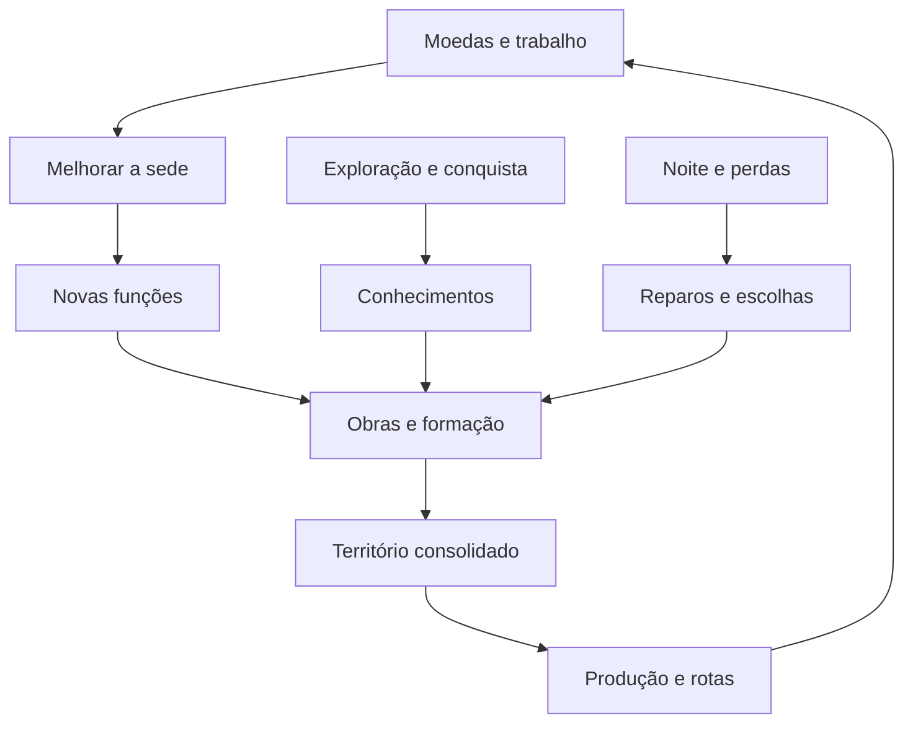

# Empire — evolução do acampamento ao reino

**Planejamento de design, economia, território e implementação**  
**Henrique Passos · 3 de outubro de 2026 · Europe/Lisbon**

**Base auditada:** [henriquecoding/empire, main, a27e45b4a57a01f968b5f6c83e6a18c286496a3a](https://github.com/henriquecoding/empire/commit/a27e45b4a57a01f968b5f6c83e6a18c286496a3a), merge do PR #76, às 15:13 de Lisboa. Inclui ADR 0052, ADR 0053 e ADR 0057. O motor declarado é Godot 4.7.2-stable, com GDScript e simulação própria.

**Pedido que orienta este documento:** o jogador estabelece um acampamento, começa com poucos recursos e os trabalhos essenciais, ganha dinheiro, expande o território e fortalece progressivamente o reino, inspirado em Kingdom.

**Entrega:** planejamento para revisão e execução posterior. Nenhuma das mudanças propostas neste documento foi aplicada ao jogo nesta sessão.

## Leitura e precedência

- **D — direção do pedido:** começar por um acampamento estabelecido pelo jogador e evoluir progressivamente.
- **E — existente:** comportamento ou valor encontrado no código e nos dados do commit auditado. Um número pode existir e ainda estar marcado como proposta no CSV.
- **S — especificado:** regra do dossiê ou ADR. Não prova, por si só, que o comportamento esteja completo no jogo.
- **P — proposta deste plano:** custo, estágio, requisito ou solução de implementação para prototipar. Não é uma aprovação tua registrada no painel.

A direção mais recente do usuário prevalece sobre regras antigas. As ADRs recentes prevalecem sobre o relatório de monarcas de 02/10 quando registram decisões posteriores. O arquivo anterior foi consultado, mas não usado como retrato atual do código.

**Vercel:** o commit auditado possui status Vercel “success”, ligado ao [deployment registrado](https://vercel.com/hamriki-s-projects/empire/FMQ9Ey5dJ27wDcyim6zSqhjP2EiJ). A conexão Vercel disponível nesta sessão não inclui o projeto Empire; a consulta ao jogo público também foi recusada por essa conexão. Portanto, este plano está ligado à main auditada, sem afirmar equivalência comprovada com a partida ao vivo. Não houve playtest Godot nesta sessão.

---

## Navegação

1. [A recomendação central](#1-a-recomendação-central)
2. [O que aprender com Kingdom](#2-o-que-aprender-com-kingdom)
3. [Diagnóstico do Empire atual](#3-diagnóstico-do-empire-atual)
4. [As regras que sustentam a evolução](#4-as-regras-que-sustentam-a-evolução)
5. [Escada da sede](#5-escada-da-sede)
6. [Estabelecer o primeiro acampamento](#6-estabelecer-o-primeiro-acampamento)
7. [Primeiros doze minutos](#7-primeiros-doze-minutos)
8. [Detalhamento das etapas](#8-detalhamento-das-etapas)
9. [Construções e desbloqueios](#9-construções-e-desbloqueios)
10. [Trabalhos e formação](#10-trabalhos-e-formação)
11. [Economia inicial](#11-economia-inicial)
12. [Curva econômica](#12-curva-econômica)
13. [População e acampamentos de recrutamento](#13-população-e-acampamentos-de-recrutamento)
14. [Defesas](#14-defesas)
15. [Expansão territorial](#15-expansão-territorial)
16. [Construção e reconstrução](#16-construção-e-reconstrução)
17. [Tecnologia e exploração](#17-tecnologia-e-exploração)
18. [Produção e ofícios](#18-produção-e-ofícios)
19. [Comércio e postos avançados](#19-comércio-e-postos-avançados)
20. [Noite, lareira e Podridão](#20-noite-lareira-e-podridão)
21. [Monarcas, companheiros e herdeiros](#21-monarcas-companheiros-e-herdeiros)
22. [Povos e direção de arte](#22-povos-e-direção-de-arte)
23. [Interface](#23-interface)
24. [IA e logística](#24-ia-e-logística)
25. [Arquitetura técnica](#25-arquitetura-técnica)
26. [Dados propostos](#26-dados-propostos)
27. [Saves e migração](#27-saves-e-migração)
28. [Atualização das fontes de verdade](#28-atualização-das-fontes-de-verdade)
29. [Plano de implementação](#29-plano-de-implementação)
30. [Aceite e validação](#30-aceite-e-validação)
31. [Playtests](#31-playtests)
32. [Riscos e decisões abertas](#32-riscos-e-decisões-abertas)
33. [Primeira versão recomendada](#33-primeira-versão-recomendada)
34. [Fontes e rastreabilidade](#34-fontes-e-rastreabilidade)

---

## 1. A recomendação central

**O reino deve crescer em três dimensões independentes: a sede evolui, a tecnologia é descoberta e o território é consolidado.**

Pagar uma melhoria da sede abre novas possibilidades. Não ergue automaticamente uma cidade completa, não aumenta a área segura por decreto e não concede toda a tecnologia. O jogador precisa financiar e executar as obras, formar pessoas e proteger os novos trechos.

A fantasia deve ser reconhecível:

> “Acendi uma fogueira e organizei algumas pessoas. Hoje há uma vila onde elas trabalham. As muralhas chegaram ao rio. Amanhã quero protegê-lo para abrir o pesqueiro e financiar a forja.”

O progresso que importa é espacial e funcional. A cada retorno ao centro, o jogador encontra algo que antes não existia: uma tenda, uma banca funcionando, uma oficina com alguém dentro, um sino, uma formação militar, uma carroça saindo. A sede maior anuncia a capacidade adquirida; a atividade das pessoas demonstra essa capacidade.

### Três eixos, um reino

| Eixo | Pergunta do jogador | Como avança | Exemplo |
|---|---|---|---|
| Sede | O que este povoado consegue organizar? | Melhorias pagas e construídas | Abrir a Casa de Treino ou a gestão de um posto |
| Tecnologia | O que este povo sabe fazer? | Descobertas, contatos, conquistas e recursos especiais já previstos | Ferro da Fornalha; receitas; Lenho Amargo |
| Território | Onde conseguimos trabalhar e sobreviver? | Obras, guarnição, acessos e logística reais | Proteger o rio e manter a rota até ele |

**P:** usar a sequência **Clareira → Acampamento → Povoado → Vila → Vila Fortificada → Fortaleza → Capital**. “Capital” significa sede capaz de organizar um império, não vitória automática nem fim do perigo.

A evolução não precisa ser linear nas decisões. Dois reinos no mesmo estágio podem ser muito diferentes: um investiu em pesca e reserva; outro em caça e arqueiros; outro em animais e cozinha. A sequência organiza o acesso, enquanto as escolhas de produção e defesa determinam a partida.

---

## 2. O que aprender com Kingdom

### 2.1 Fundação: uma ação simples muda o mundo

A documentação comunitária de Kingdom descreve o começo em torno de uma fogueira apagada, pessoas disponíveis e esboços de construções. Acender a fogueira funda o reino e ativa os primeiros fornecedores de ferramentas; a sede pode continuar evoluindo depois. Classic e New Lands têm seis níveis de centro, enquanto Two Crowns tem sete. [F4]

**Aplicação ao Empire — P:** a primeira moeda precisa ter um resultado compreensível: estabelecer o lugar e organizar os serviços básicos. Não deve ser apenas uma compra numa árvore de habilidades.

### 2.2 Uma pessoa, uma ferramenta, uma função

Kingdom distingue contratar a pessoa e disponibilizar a ferramenta que a transforma em profissional. Arcos, martelos e foices sustentam um modelo de formação visível no cenário. [F5]

**Aplicação — P:** preservar o recrutamento separado da especialização, mas respeitar as funções que o Empire já tem. Um construtor treinado não deve ser confundido com um trabalhador que ajuda uma obra nova. Uma banca de arco deve mostrar que falta pessoa, moeda ou ferramenta.

### 2.3 A economia inicial e a tardia têm necessidades diferentes

As fontes comunitárias descrevem caça, agricultura e o comerciante como formas de financiar o reino; as fazendas exigem investimento e deixam de funcionar normalmente no inverno. [F6][F7]

**Aplicação — P:** começar com renda acessível, transitar para renda estável e depois criar especialização. Uma plantação não substitui instantaneamente a caça. O inverno exige planejamento antes de chegar.

### 2.4 Expandir produz ganhos e perdas

A relação entre clareiras, caça, árvores e acampamentos torna a expansão de Kingdom uma decisão econômica. Na referência medieval documentada, preservar a vegetação de um acampamento permite mantê-lo mesmo quando as muralhas passam além dele; derrubar a vegetação necessária pode eliminá-lo. [F8][F9]

**Aplicação — P:** cada trecho conquistado precisa oferecer algo concreto e mostrar o que será comprometido. No Empire, esse comportamento não deve ser copiado silenciosamente: o código atual fecha acampamentos também por enclosure, e isso tem regra própria.

### 2.5 A tecnologia depende do mundo

New Lands utiliza o santuário de arquitetura para acesso à pedra; na campanha medieval de Two Crowns, a pedreira e a mina de ferro são descobertas em ilhas específicas. [F10][F11][F12]

**Aplicação — P:** a sede organiza, a exploração ensina. Melhorar a sede não pode dispensar descobertas que já têm papel no dossiê do Empire.

### 2.6 A reserva é uma decisão real

O banqueiro de New Lands e Two Crowns guarda moedas e gera juros. Isso permite preparar necessidades futuras em vez de carregar todo o dinheiro continuamente. [F13]

**Aplicação — P:** uma reserva local faz sentido, mas juros passivos não são necessários para o primeiro protótipo. O Empire já tem aprovação posterior para um baú vulnerável na sala secreta; esse contrato deve orientar a reserva, sem duplicá-la em um banco invulnerável.

### 2.7 Erros de expansão precisam permitir recuperação

A Conquest Update introduziu casas de cidadãos nos restos de acampamentos, oferecendo uma forma mais cara de continuar recrutando. A mudança oficial responde a uma perda que poderia bloquear o crescimento. [F14]

**Aplicação — P:** perder uma fonte de recrutamento deve custar e mudar a estratégia. Não deve produzir uma partida viva, com dinheiro, mas sem possibilidade de reconstruir o pessoal necessário.

### 2.8 O mundo precisa continuar legível quando cresce

A atualização oficial 2.0 de Two Crowns melhorou a colocação de estruturas e lojas, distribuiu melhor trabalhadores ociosos, redirecionou defesa para o lado ameaçado e evitou que arqueiros ocupassem permanentemente torres distantes das frentes. [F3]

**Aplicação — P:** construir mais não pode piorar automaticamente a IA. Definir posições de reserva, torres relevantes, deslocamento da guarnição e o papel das defesas internas antes de multiplicar edifícios.

### 2.9 O tamanho do mapa é uma questão de tempo

Thomas van den Berg explicou que a exploração foi ampliada para equilibrar a gestão, mas que o tamanho do mundo precisa considerar os deslocamentos do jogador e dos inimigos. [F2]

**Aplicação — P:** uma expansão deve ser medida também pelo tempo necessário para construir, voltar, defender e recolher. Acrescentar quilômetros vazios não é desenvolver o reino.

### 2.10 A profundidade pode vir das relações entre regras

Na entrevista sobre o desenvolvimento de Kingdom, o criador relata limitações deliberadas de controles e recursos, assim como simplificação do escopo procedural. [F1]

**Aplicação — P:** dar profundidade ao conjunto existente — moeda, pessoa, posto, obra, noite, exploração — antes de acrescentar dezenas de inventários, profissões e moedas.

### 2.11 Diferenças entre referências

| Referência | Usar como inspiração | Cuidado |
|---|---|---|
| Kingdom Classic | Clareza do gesto de pagar e comportamento autônomo dos súditos | Sua estrutura de sobrevivência não representa toda a campanha posterior |
| Kingdom: New Lands | Exploração compacta, estabelecimento de base e descobertas | Não importar ferro ou outros sistemas de Two Crowns como se fossem daqui |
| Two Crowns medieval | Campanha, tecnologia, expansão e recuperação | Biomas e DLCs podem mudar regras e custos |
| Two Crowns 2.0, atualização de 2024 | Ajustes oficiais de distribuição de tropas, torres e geração | Guias antigos podem descrever comportamentos anteriores |
| Norse Lands / Call of Olympus | Exemplos de identidade cultural e variação | Mecânicas dessas campanhas não são regras universais da referência medieval |

**Conclusão de design, inferida da pesquisa:** o efeito “comecei com quase nada e isto tornou-se um reino” nasce da relação entre investimento, pessoas, espaço e risco. O número de níveis da sede, isoladamente, não produz esse efeito.

---

## 3. Diagnóstico do Empire atual

### 3.1 O que já existe e deve ser aproveitado

| Sistema | Evidência no snapshot | Consequência para este plano |
|---|---|---|
| Núcleo | Greybox cria o core diretamente como DONE, nível 1, com vida cheia | A fundação será uma mudança de contrato, não uma nova decoração |
| Bolsa inicial | EconomyCurve.start_coins = 6 | O orçamento inicial precisa continuar verificável |
| Pessoas iniciais | Dois trabalhadores próximos são do jogador; arqueiros e lanceiros próximos são neutros | Não contar os combatentes neutros como guarnição inicial |
| Obras | Quatro sítios de muro; canteiros, galinheiros, pesqueiro e oficinas são publicados como locais de obra | Local disponível não significa edifício funcionando |
| Construção | BuildSystem absorve moedas, cria andaime e exige presença para progredir | Reaproveitar o ciclo de pagamento e trabalho |
| Formação | TrainingSystem forma profissionais; banca do arco usa preço específico | Reaproveitar; acrescentar condições de estágio e contexto |
| Postos | JobBoard publica vagas; Staffing observa presença nas fases | As novas etapas devem liberar empregos reais |
| Produção | EconomySystem considera obras de pé, trabalho, Ganância, estação e conversão | O planejamento deve usar rendimento efetivo |
| Recrutamento | Camps, CampLife e CampWatch controlam chegada e fechamento de acampamentos | A expansão precisa respeitar a continuidade populacional |
| Descobertas | Discoveries já impede acesso ao que não foi encontrado | Compor esse bloqueio com o nível da sede |
| Defesas | Escada de muros, caminhos A/B e requisitos especiais | Preservar essas escolhas |
| Monarquia | ADR 0052 e MonarchWatch unificam autoridade, monarca e companhia | Fundação é do reino, não exclusiva do Rei guerreiro |
| Caça | ADR 0057 descreve caça manual dos imperadores e automática das tropas | Pode financiar o começo de forma ativa |
| Lareira | Hearth paga o custo integral ao crepúsculo ou fica apagada | O custo não pode desaparecer ao trocar o castelo por uma tenda |

### 3.2 O problema principal do início

O código já permite construir progressivamente, mas **não existe no caminho auditado uma escada completa de desenvolvimento da sede**. O castelo nasce pronto e os locais de muitas funções estão disponíveis na região inicial.

Portanto, não basta esconder algumas casas. É preciso definir:

1. O momento em que o jogador funda o reino.
2. As funções básicas organizadas pela fundação.
3. O que cada melhoria posterior autoriza.
4. O trabalho e o investimento adicionais exigidos pelas funções liberadas.
5. A ligação entre obras, recrutamento, proteção e produção.
6. Como retomar saves anteriores sem perder os edifícios existentes.

### 3.3 O castelo pronto é uma regra antiga explícita

A seção 10 do dossiê diz que o núcleo não é construído pelo jogador. O CSV o marca como core/not_buildable, e Greybox._nucleo o cria pronto.

**D:** o novo pedido muda esse começo.

**P:** conservar a identidade e a posição do núcleo, mas substituir a materialização imediata do castelo por uma sequência de estados da sede. O ponto defendido permanece identificável durante toda a campanha.

Essa substituição precisa entrar no dossiê e numa ADR. Caso contrário, testes, dados, apresentação e derrota continuarão defendendo duas versões incompatíveis do começo.

### 3.4 O modelo econômico não é um orçamento inicial

O perfil balanced tem sete fontes e 14 tropas. Isso descreve uma configuração de análise econômica, não o que está funcionando no primeiro minuto. Na região, os locais existem; a produção depende de construir e operar as obras.

Reduzir ainda mais o acesso inicial sem recalibrar a trajetória econômica pode aumentar a dificuldade de maneira desproporcional.

### 3.5 Existe um bloqueio potencial de reparação

Obras novas aceitam ajuda de personagens elegíveis presentes; reparos ordinários exigem o profissional builder. A Casa de Treino custa 10 e o construtor 12, além da pessoa necessária.

**P:** um começo que dependa de reparar cedo precisa garantir acesso a esse profissional. O plano recomenda um único construtor pioneiro no grupo inicial. Ele não substitui todos os construtores futuros, nem dispensa formação posterior.

### 3.6 Há um conflito no gesto de pagar o núcleo

KingClaims usa uma moeda largada no núcleo para tentar evoluir o monarca quando os requisitos pessoais estão satisfeitos, devolvendo a moeda depois.

**P:** acrescentar melhoria da sede exige um contexto explícito. Uma moeda destinada ao povoado não pode evoluir o monarca por prioridade de código.

### 3.7 A expansão altera o custo humano

Mais postos defensivos podem retirar arqueiros da caça. Mais profissionais podem consumir os poucos trabalhadores que sustentam a produção. Mais distância pode impedir retorno ao crepúsculo.

Esse custo precisa existir e ser mostrado. É parte da estratégia, desde que a IA e a interface expliquem o resultado.

### 3.8 Os IDs de obra precisam de cuidado

BuildSystem.post atribui IDs pela ordem de publicação; o save restaura estado sobre locais já publicados.

**P:** ocultar estágios removendo locais de construção da montagem pode mudar IDs e restaurar uma fazenda sobre uma torre. O primeiro protótipo deve conservar os locais e acrescentar estado de acesso separado.

### 3.9 Há particularidades que não devem desaparecer

- Podridão com presença espacial, rasto e economia própria.
- Muros com caminhos de guarnição e fortificação.
- Três monarcas iniciais e companheiros pagos.
- Sementes Reais, Lenho Amargo e descobertas.
- Conversão de matéria em dinheiro ou capacidade militar.
- Ofícios que evoluem por atividade e exposição.
- Identidade material e cultural de cada povo.
- Sucessão, perdas e continuidade de campanha.

O plano desenvolve esse conjunto. A base de Kingdom é uma referência de organização e ritmo.

---

## 4. As regras que sustentam a evolução

### 4.1 Cada etapa precisa responder a um problema novo

Uma melhoria deve liberar uma função útil naquele momento. Exemplos:

- Povoado: capacidade de treinar e substituir ofícios.
- Vila: processamento, reserva e serviços estáveis.
- Vila Fortificada: operação militar e avanço fora da primeira zona.
- Fortaleza: indústria, manutenção de frentes e preparação de cerco.
- Capital: administração de relações e territórios.

Uma etapa cujo único benefício é vida da sede precisa de uma revisão.

### 4.2 Nada funciona só porque o desenho apareceu

Uma cozinha sem cozinheiro pode existir fisicamente, mas seu serviço deve mostrar ausência de profissional. Uma torre sem arqueiro deve estar vazia. Uma rota sem carroça operacional deve estar interrompida.

### 4.3 Defesa, economia e sede competem pela mesma bolsa

Investir na sede deve ter custo de oportunidade. Os preços propostos não incluem automaticamente o preço das oficinas, dos profissionais, das armas e das defesas liberadas.

### 4.4 Expandir precisa de um motivo localizado

O jogador deve pensar “quero proteger aquele rio”, “quero chegar àquele acampamento”, “quero um trecho seguro para a carroça”. O tamanho do mapa não é uma recompensa suficiente.

### 4.5 Perder algo importante não pode criar um impasse oculto

Se ainda existe uma sede, pessoas e meios de sobreviver, deve haver um caminho de recuperação. Ele pode ser caro e demorado. Dependências circulares devem ser evitadas.

### 4.6 As etapas não substituem habilidade

O monarca continua lutando manualmente, pagando a companhia, explorando e decidindo. Construir uma fortaleza não deve automatizar todas essas decisões.

### 4.7 O dinheiro continua sendo a linguagem principal

Não introduzir madeira, pedra e ferro carregados pelo jogador como três novas moedas obrigatórias para cada muro. Os materiais produtivos do Empire já têm papel no circuito de conversão, e os recursos especiais já têm regras próprias.

---

## 5. Escada da sede

Todos os nomes e custos novos desta tabela são **P**.

| Estágio | Nome | Custo desta melhoria | Total investido só na sede | Função principal | Sinal visual |
|---|---|---:|---:|---|---|
| F0 | Clareira | 0 | 0 | Local disponível para fundação | Marco do terreno e grupo de chegada |
| F1 | Acampamento | 2 | 2 | Recrutamento básico, arco, trabalho e primeira defesa | Fogueira, tendas e bancada simples |
| F2 | Povoado | 8 | 10 | Formação de ofícios e primeira produção estável | Abrigos de madeira, depósito simples e sino |
| F3 | Vila | 18 | 28 | Processamento, reserva e serviços | Edifícios permanentes, cozinha e oficina ativa |
| F4 | Vila Fortificada | 32 | 60 | Expansão militar e um primeiro posto mantido | Guarita, arsenal e pátio organizado |
| F5 | Fortaleza | 56 | 116 | Indústria e preparação de frentes avançadas | Sede robusta, comando e trabalho especializado |
| F6 | Capital | 88 | 204 | Administração territorial e rede comercial | Grande sede cultural e conexões visíveis |

### Como interpretar esses custos

- São incrementais: passar de F3 a F4 custa 32, não 60.
- Total de 204 não inclui nenhuma obra lateral, tropa, profissional, reparação ou serviço.
- Não foi medido tempo real para atingir F6. A tabela é uma bancada inicial.
- A tecnologia e as condições operacionais continuam limitando obras individuais.
- O jogador pode fortalecer muros e produção sem comprar imediatamente o estágio seguinte.
- Não exigir número fixo de dias para todas as melhorias. Os intervalos de ritmo mais adiante são metas de playtest.

### Requisitos da sede

**P:** cada melhoria exige a etapa anterior concluída, pagamento integral e trabalho no local. A sede não deve subir de estágio instantaneamente.

No primeiro protótipo, evitar requisitos duros de população para melhorar a sede. Uma perda de pessoas não deve impedir o jogador de comprar precisamente a infraestrutura necessária para recuperá-las.

Condição militar ou tecnologia específica pode limitar funções liberadas por uma etapa. Não esconder essa limitação dentro do preço da sede.

---

## 6. Estabelecer o primeiro acampamento

### 6.1 Chegada

**P:** o monarca chega à clareira com sua companhia, dois trabalhadores sem ofício e um construtor pioneiro. O cenário mostra o local da fundação antes de apresentar todos os futuros edifícios.

O ponto da sede fica fixo no primeiro protótipo. Oferecer três locais fundadores exige testar recursos, caminhos e ameaças para cada escolha; isso pode vir depois de a progressão principal funcionar.

O jogador paga duas moedas no marco. O grupo monta o acampamento. A autoridade do reino já pertence ao monarca escolhido; a fundação cria a sede e seus serviços, sem gerar outra coroa.

### 6.2 Recursos iniciais recomendados

| Recurso | Situação atual | Proposta de começo |
|---|---|---|
| Moedas carregadas | 6 | Preservar 6 |
| Moedas acessíveis no arranque | Sem pacote fundador definido neste plano atual | Uma bolsa de 8 numa carroça de provisões, única por campanha |
| Trabalhadores sem ofício | 2 aliados perto do núcleo | Preservar 2 |
| Construtor | Sem pioneiro no caminho inicial auditado | 1 profissional inicial, com ID e estado próprios |
| Arqueiros aliados | Os três próximos são inicialmente neutros | Formar o primeiro pagando 2 por um arco |
| Monarca | Seleção unificada | Preservar a escolha inicial |
| Companhia | Vinculada ao monarca | Preservar identidade, estoque e regras de pagamento |
| Sementes Reais | Não conceder por esta proposta | 0 no pacote fundador |
| Lenho Amargo | Não conceder por esta proposta | 0 no pacote fundador |
| Baú da sala secreta | ADR 0053 determina que o do jogador começa vazio | Continua vazio |

**A bolsa da carroça não é o baú da sala secreta.** É provisão de chegada, colocada perto da clareira e consumida uma única vez. É uma nova proposta de financiamento, não uma alteração disfarçada de Q-186.

O valor de 8 deve ser testado. O motivo de existir é assegurar decisões reais de fundação sem depender de sorte na caça ou de chegar a um tesouro distante.

### 6.3 O que a fundação organiza

**P:** incluir no pacote fundador:

- A sede em estado Acampamento.
- Abrigos básicos de retorno.
- Uma pequena bancada de arcos integrada ao acampamento.
- Um ponto reconhecível de trabalho e reunião.
- O acesso a locais próximos de primeira estacaria e primeira produção.

Isso não ergue muralhas, torres, fazendas, cozinha ou Casa de Treino gratuitamente.

A bancada inicial incluída é uma alteração proposta ao custo atual de construção da banca do arco, que é 4. Deve ser registrada: o acampamento recebe uma versão fundadora; bancas adicionais ou substitutas mantêm custo próprio.

### 6.4 A fogueira de fundação e a lareira defensiva

A fogueira de fundação comunica ocupação e vida. **P:** sua chama ambiente não concede gratuitamente a zona defensiva da lareira real.

A lareira defensiva continua sujeita ao pagamento noturno. A mecânica aprovada de custo permanece. A apresentação deve mostrar quando a chama de proteção está alimentada e quando resta apenas iluminação ambiente.

Se reutilizar o mesmo sprite, a diferença precisa ser visual: brasa baixa no acampamento comum; chama forte e halo quando paga. Não colocar uma chama que parece proteção ativa enquanto a simulação não protege.

### 6.5 Por que oferecer um construtor pioneiro

O projeto já permite ajudar em obras novas sem exigir o profissional builder, mas reparação normal exige esse ofício. Sem um construtor inicial, a primeira muralha danificada pode exigir 22 moedas e formação antes de ser recuperada.

O pioneiro resolve o início sem baixar o preço de todos os construtores futuros. Ele é uma pessoa vulnerável, precisa de abrigo e não pode trabalhar em todos os locais ao mesmo tempo.

**P:** se o pioneiro morrer, a Casa de Treino em F2 permite reposição normal. Trabalhadores remanescentes continuam podendo executar obras novas necessárias à recuperação. A reconstrução a partir de fundação reparável deve seguir o contrato existente, com clareza na interface.

### 6.6 O que evitar na chegada

- Um castelo funcional invisível dentro da fogueira.
- Dez placas de construções futuras ao redor do jogador.
- Comprar três profissões para conseguir construir a primeira casa.
- Gastar as seis moedas antes de descobrir uma fonte inicial de renda.
- Iniciar ataques durante a tela de escolha de monarca.
- Ganhar outra bolsa de provisões ao carregar um save ou trocar de imperador.
- Vender equipamentos gratuitos do pacote fundador de modo que sua reposição gere dinheiro.

---

## 7. Primeiros doze minutos

O relógio atual dura 360 segundos por dia. A alvorada, manhã, meio-dia e tarde somam 225 segundos antes do crepúsculo; a noite começa aos 255 segundos num dia completo.

**P:** as metas abaixo usam esse relógio como referência. São uma sequência de aprendizado, não instruções obrigatórias nem medição de uma partida executada.

| Momento aproximado | Acontecimento | O que o jogador aprende | Decisão |
|---|---|---|---|
| 0:00–0:30 | Chegada e leitura da clareira | Aqui posso estabelecer o reino | Fundar agora |
| 0:30–1:15 | Montagem do acampamento | A moeda produz trabalho e mudança física | Comprar arco ou explorar |
| 1:15–2:30 | Primeira caça e recrutamento | Pessoas e combate financiam a base | Mais trabalhador ou dinheiro guardado |
| 2:30–3:45 | Primeira obra no lado ameaçado | Defesa precisa de moeda, pessoa e tempo | Estacaria ou renda |
| 3:45–4:15 | Crepúsculo e retorno | A noite muda os empregos | Voltar ou terminar uma tarefa |
| 4:15–6:00 | Primeira defesa | Monarca, companhia e tropas têm papéis distintos | Lareira paga ou investimento permanente |
| 6:00–7:30 | Contagem de perdas e reparo | A defesa não termina ao amanhecer | Reparar, recrutar ou melhorar sede |
| 7:30–9:30 | Compra de F2 e primeira produção | Um povoado organiza novos ofícios | Formação ou novo canteiro |
| 9:30–10:15 | Preparação do flanco seguinte | Expandir e recolher é diferente de só construir | Novo muro ou reforço do antigo |
| 10:15–12:00 | Segunda noite | A decisão anterior aparece na batalha | Aprender com falta de gente, luz ou renda |

### Condições do primeiro mapa

**P:** uma seed inicial elegível precisa garantir:

1. Clareira com espaço para os serviços essenciais.
2. Provisões acessíveis sem atravessar uma ameaça de fase avançada.
3. Um sítio de defesa alcançável no tempo disponível.
4. Caça inicial acessível aos três monarcas.
5. Pelo menos uma fonte de recrutamento que possa continuar ativa.
6. Uma primeira fonte produtiva compatível com o bioma.
7. Acesso de retorno sem passagem bloqueada por conhecimento tardio.

A simulação não pode depender de o jogador já saber que o quarto botão escondido de uma roda contém a compra necessária.

### A primeira noite deve permitir escolhas diferentes

O jogador pode investir mais em estacaria e menos em lareira, ou pagar lareira e manter defesa menor. As duas alternativas precisam ser testadas contra a mesma ameaça inicial.

O monarca sozinho deve ajudar, mas não tornar irrelevantes a contratação e a construção. Uma estratégia exclusivamente de ataques manuais pode ser possível para jogadores experientes, sem ser a rota esperada do tutorial.

---

## 8. Detalhamento das etapas

### F1 — Acampamento

**Fantasia:** algumas pessoas aceitaram viver e trabalhar aqui.

**Acesso:** recrutamento, bancada de arcos, estacaria, pequenos canteiros, caça, provisões e lareira paga.

**Trabalhos:** ajudar obras, caçar/defender como arqueiro, construir/reparar com o pioneiro, cultivar um posto básico.

**Dilema:** dinheiro suficiente para começar não significa dinheiro suficiente para fazer tudo antes da noite.

**Critério funcional:** o jogador consegue estabelecer, contratar, financiar uma defesa ou renda e sobreviver à primeira noite sem função futura obrigatória.

**Visual:** tendas e equipamentos portáteis; chão ainda pouco alterado; pessoas reunidas quando ociosa a atividade.

### F2 — Povoado

**Fantasia:** o acampamento deixou de depender exclusivamente de quem chegou com o monarca.

**Acesso:** Casa de Treino, galinheiro, pesqueiro em água, torres básicas e primeira resposta aérea.

**Trabalhos:** substituição de construtores, operação regular de produção, guarnição de torre e pequenos serviços.

**Dilema:** formar uma pessoa retira temporariamente um trabalhador da atividade atual.

**Critério funcional:** repor uma profissão essencial perdida e sustentar pelo menos uma fonte previsível de renda.

**Visual:** abrigos resistentes, madeira organizada, primeira infraestrutura cotidiana.

### F3 — Vila

**Fantasia:** as pessoas têm rotinas, serviços e escolhas sobre o que produzem.

**Acesso:** cozinha, forja quando conhecida, primeiros processadores, estábulo de montaria e reserva local conforme contrato do baú.

**Trabalhos:** cozinheiro, ferreiro, processamento, cuidados de montaria.

**Dilema:** vender matéria hoje ou convertê-la em capacidade para a próxima noite.

**Critério funcional:** uma cadeia de produção simples funciona de ponta a ponta e mostra seu resultado.

**Visual:** casas permanentes, fumaça de oficinas, movimento entre origem e serviço. Não inserir carroças decorativas que pareçam transportar matéria inexistente.

### F4 — Vila Fortificada

**Fantasia:** o reino consegue manter atividades além do núcleo inicial.

**Acesso:** preparação militar mais organizada, defesas de campo previstas, primeiro posto avançado e preparação de operações diplomáticas.

**Trabalhos:** guarnição avançada, construtor evoluído onde exigido, manutenção de um trecho e profissional de negociação.

**Dilema:** enviar pessoas para fora reduz quem produz e defende em casa.

**Critério funcional:** um primeiro posto fora da região central persiste e tem pessoas, recursos e retorno coerentes.

**Visual:** pátio, guarita, bandeiras e armazenamento protegido. A vila existente continua visível; não é substituída por uma imagem única de castelo.

### F5 — Fortaleza

**Fantasia:** o reino pode preparar uma operação prolongada.

**Acesso:** indústria ligada a tecnologia, melhorias militares superiores, infraestrutura de suporte a cerco e manutenção de frentes.

**Trabalhos:** produção especializada, formação avançada e logística militar.

**Dilema:** conquistar sem comprometer a sede; financiar material, profissionais e serviços ao mesmo tempo.

**Critério funcional:** uma expedição preparada tem custos reais e a base continua funcionando enquanto parte da força está ausente.

**Visual:** sede robusta e oficinas reconhecíveis. Cada torre e portão ainda tem sua função, em vez de compor uma muralha de cenário sem colisão.

### F6 — Capital

**Fantasia:** a sede organiza relações e territórios, e o cenário mostra essa rede.

**Acesso:** gestão de postos e relações mais ampla; especializações culturais avançadas; ampliação da rede comercial implementada.

**Trabalhos:** manutenção de rotas, administração de relações, guarnições locais e reposição planejada.

**Dilema:** território grande produz mais e custa mais para conservar.

**Critério funcional:** pelo menos duas atividades externas se relacionam economicamente com a sede, sem duplicar riqueza ou tropas.

**Visual:** máxima expressão do povo fundador. A grande árvore dos Enramados pode dominar a composição, enquanto a ocupação continua distribuída horizontalmente.

---

## 9. Construções e desbloqueios

A tabela combina preços atuais **E** e acesso mínimo sugerido **P**. Os requisitos atuais de descoberta, conquista e recurso especial continuam valendo até substituição explícita.

| Obra ou serviço | Custo atual E | Estágio mínimo P | Condição adicional | Função |
|---|---:|---|---|---|
| Fundação da sede | Novo: 2 P | F0 | Local fundador | Criar F1 |
| Bancada fundadora de arco | Incluída P; banca comum custa 4 E | F1 | Pessoa aliada e 2 por arco E | Formar arqueiro |
| Estacaria | 6 | F1 | Sítio de muro | Primeira linha |
| Canteiro | 4 | F1 | Posto e solo adequado | Renda básica |
| Fogueira de ronda | 3 | F1 | Local válido e conhecimento, quando aplicável | Luz/archote conforme regras atuais |
| Casa de Treino | 10 | F2 | Trabalhador aliado disponível | Formar builder por 12 |
| Galinheiro | 8 | F2 | Animais conforme ciclo atual | Produção animal |
| Pesqueiro | 6 | F2 | Água | Diversificar renda |
| Torre de arqueiros | 18 | F2 | Arqueiros disponíveis | Certeza e alcance |
| Torre alta | 30 | F2 | Resposta aérea deve chegar a tempo | Defesa contra alados |
| Casa de cidadãos | 8 | F2 | Ruínas elegíveis de acampamento | Recuperar recrutamento |
| Cozinha | 10 | F3 | Cozinheiro por 10 | Serviço alimentar |
| Forja | 12 | F3 | Conhecimento e ferreiro por 15 | Equipamento |
| Celeiro | 10 | F3 | Grão e profissional correspondente | Dinheiro ou capacidade |
| Salga | 9 | F3 | Peixe e profissional correspondente | Processamento e conservação |
| Curral | 11 | F3 | Animal e serviço elegível | Destinos do animal |
| Corte de madeira | 7 | F3 | Bosque | Produção local |
| Estábulo de montaria | 20 | F3 | Montaria existente | Abrigo e cuidados |
| Casa do herdeiro | 20 | F3 | Contrato de sucessão atualizado | Preparar continuidade |
| Santuário das raízes | 25 | F3 | Descoberta e rito previstos | Recuperação conforme design |
| Barril de fogo | 12 | F3 | Obra e risco local | Defesa consumível |
| Fosso de raízes | 22 | F4 | Sítio apropriado | Controle terrestre |
| Embaixada | 20 | F4 | Diplomata básico por 20 | Infraestrutura diplomática |
| Serração | 13 | F4 | Madeira e construtor | Processamento |
| Estábulo de vaca | 14 | F4 | Manejo/ordenha | Fonte animal mais cara |
| Poço de minério | 12 | F4 | Rocha/subsolo apropriado | Minério com risco |
| Farol | 40 | F4 | Conhecimento e trecho | Proteção e presença estratégica |
| Fundição | 18 | F5 | Minério e ferreiro | Equipamento superior |
| Altar consagrado | 55 | F5 | Conhecimento | Terreno estratégico |
| Bastião | 65 | F5 | Requisitos atuais e unicidade | Defesa superior |
| Rede territorial ampliada | Sem custo agregado atual definido | F6 | Rotas e postos realmente operacionais | Administração |

### Três ressalvas importantes

**Diplomata básico:** as decisões recentes aprovam acesso universal ao profissional. O estágio da embaixada é uma proposta de organização doméstica; não deve tornar impossível contratar um diplomata elegível encontrado ou disponibilizado pelo mundo. Evolução e especialização continuam separadas.

**Defesa aérea:** a seção 10 prevê torre alta necessária a partir do dia 4. Colocá-la apenas em Fortaleza criaria incompatibilidade. F2 é o acesso sugerido, e a viabilidade das 30 moedas deve ser testada. Se o acesso continuar tardio, a primeira ameaça aérea ou o percurso de preparação precisa de decisão explícita.

**Especialidades de povo:** uma obra local de um povo integrado não deve desaparecer porque sua versão genérica exigiria outro estágio. Definir acesso cultural e integração, sem aplicar o mesmo bloqueio retroativamente a tudo.

---

## 10. Trabalhos e formação

### 10.1 Separar quatro etapas

1. **Recrutar:** a pessoa passa a pertencer ao reino.
2. **Especializar:** recebe profissão/equipamento mediante pagamento e condições.
3. **Atribuir:** a IA a liga a um posto ou tarefa elegível.
4. **Trabalhar:** a pessoa está presente e contribui para o resultado.

Mostrar uma pessoa ao lado de uma oficina não significa que as quatro etapas aconteceram.

### 10.2 Papéis essenciais no início

| Papel | Para que existe | Quando aparece | O que sua ausência causa |
|---|---|---|---|
| Trabalhador sem ofício | Ajuda novas obras e assume trabalho básico elegível | Início/recrutamento | Menos produção e capacidade de expansão |
| Construtor | Repara, desenvolve e organiza trabalhos do ofício | Pioneiro P; depois Casa de Treino | Obras danificadas difíceis de recuperar |
| Arqueiro | Caça de dia e combate sob IA | Arco no acampamento | Menos renda inicial e menos defesa |
| Combatente de linha | Segura aproximações conforme perfil | Recrutamento existente | Defesa mais dependente de muro e distância |
| Cozinheiro | Converte produção em serviço e capacidade | Vila | Menos opções de preparo/recuperação |
| Ferreiro | Melhora equipamento conforme produção | Vila e tecnologia | Exército menos preparado |
| Diplomata | Negociação e missões | Acesso universal aprovado; sede própria depois | Menos alternativas políticas |

### 10.3 Não baratear todos os ofícios para corrigir o começo

O builder de 12, smith de 15 e cook de 10 já participam de outros sistemas. Reduzir seus preços globalmente pode desequilibrar expedições, perda de profissionais e progressão avançada.

**P:** resolver o primeiro arranque com kit fundador único e infraestrutura progressiva. Ajustar preços gerais só com evidência de que a formação posterior também está errada.

### 10.4 Formação deve mostrar o custo humano

Antes de pagar, a banca ou casa mostra:

- Profissão formada.
- Moedas necessárias.
- Pessoa elegível.
- Tempo de formação.
- Posto atual que ficará sem ela, quando essa informação puder ser determinada.

A IA não deve pegar automaticamente o único trabalhador de uma fonte essencial sem uma pista. Para o protótipo, preferir um trabalhador ocioso e próximo; se todos estão empregados, mostrar a função que pode ser interrompida.

### 10.5 Evitar um mercado de microgestão

Não pedir ao jogador para distribuir individualmente dezenas de pessoas em todo momento. Usar política simples: produção de dia, defesa no horário necessário, prioridade de reparo e ordens locais pontuais.

A profundidade está em contratar, formar, construir e posicionar infraestrutura adequada, não em repetir uma planilha de turnos a cada alvorada.

---

## 11. Economia inicial

### 11.1 Orçamento fundador

**P:** 6 moedas pessoais + bolsa única de provisões com 8 = **14 moedas acessíveis**. O jogador continua precisando recolher a bolsa no mundo.

| Investimento | Valor | Saldo após cada passo |
|---|---:|---:|
| Moedas acessíveis | +14 | 14 |
| Fundação | −2 | 12 |
| Primeiro arco | −2 | 10 |

A partir daí, três rotas de decisão:

| Rota | Investimento adicional | Saldo | Vantagem | Fragilidade |
|---|---:|---:|---|---|
| Defesa permanente | Estacaria 6 | 4 | Uma linha construída | Não cobre lareira de 5 sem renda adicional |
| Proteção da sede | Lareira 5 | 5 | Proteção paga naquela noite | Não cria muro permanente |
| Renda cedo | Canteiro 4 | 6 | Fonte em operação | Defesa depende mais da companhia e do monarca |

As contas são de caixa. Não demonstram que as três rotas sobrevivem; isso exige simulação e playtest contra a ameaça real.

**Não considerar a lareira uma vitória automática.** A lareira atual afasta criaturas dentro do limite de massa e abranda outras. O jogador ainda precisa responder aos inimigos que ela não resolve.

### 11.2 O investimento completo custa mais do que a sede

Exemplos com valores atuais:

- Casa de Treino + construtor: 10 + 12 = 22, além de pessoa e tempo.
- Cozinha + cozinheiro: 10 + 10 = 20.
- Forja + ferreiro: 12 + 15 = 27, além de conhecimento.
- Embaixada + diplomata: 20 + 20 = 40.
- Torre de arqueiros + dois trabalhadores recrutados e dois arcos: 18 + 2 × (1 + 2) = 24.
- Duas estacarias novas: 12, antes de reparos e gente.

Essas compras competem com a melhoria da sede. Não apresentar “Vila por 18” como se isso incluísse cozinha ativa, forja ativa e guarnição.

### 11.3 Reposição imperial de flechas

A ADR 0053 registra 6 flechas por moeda para o escudeiro do Imperador Arqueiro. Uma moeda gasta nesse serviço não está disponível para a sede.

**P:** o orçamento do tutorial deve incluir a quantidade inicial já aprovada, tiros de caça esperados e margem de erro. Não obrigar o Arqueiro a gastar toda a aljava em um animal difícil antes de ter renda. Não dar flechas gratuitas infinitas por causa da nova fundação.

### 11.4 Orçamento da Nia

A Nia possui serviço pago do bardo. Ensinar o primeiro arco e a primeira construção não pode depender de realizar várias conversões pagas imediatamente.

**P:** a companhia é uma possibilidade estratégica inicial, e não uma taxa obrigatória para fazer o tutorial funcionar.

### 11.5 A reserva não cria dinheiro

Depositar deve reduzir a bolsa pessoal exatamente pelo mesmo valor que aumenta a reserva. Retirar faz o inverso. Pagar um reparo reduz o saldo disponível uma vez.

O baú secreto começa vazio e pode ser roubado segundo a direção recente. Uma futura reserva administrativa deve reaproveitar esse contrato ou declarar precisamente sua diferença.

---

## 12. Curva econômica

### 12.1 Três números diferentes hoje

| Número | O que representa | Como usar |
|---|---|---|
| daily_income | Modelo abstrato de análise, com base 3 + 2,6 por fonte | Comparar perfis de design |
| built_income/on_phase | Produção de obras reais e sua passagem pela simulação | Medir a partida |
| night_cost | Modelo abstrato de pressão noturna | Avaliar a curva; não cobrar como taxa adicional |

A lareira de 5 é uma despesa real diferente. Não somar automaticamente “night_cost + 5” como se o primeiro valor fosse debitado da bolsa a cada noite.

### 12.2 Exemplo numérico auditado

Hipóteses: Ganância de 28%, crescimento de 1,12 ao dia. A coluna das sete obras reais soma quatro canteiros, dois galinheiros e um pesqueiro: base 17. Exclui falta de trabalhadores, perdas, estrago do peixe, soldo, processamento e lareira.

| Dia | Um canteiro operado, após Ganância | Sete obras reais, após Ganância e antes das demais despesas | Perfil abstrato: 7 fontes, 14 tropas, após soldo | Pressão noturna abstrata |
|---|---:|---:|---:|---:|
| 1 | 1,44 | 12,24 | 12,26 | 6,10 |
| 4 | 2,02 | 17,20 | 18,44 | 11,08 |
| 7 | 2,84 | 24,16 | 27,13 | 20,11 |
| 10 | 3,99 | 33,94 | 39,33 | 36,52 |

São cálculos sobre os dados atuais, não moedas inteiras garantidas numa partida. A produção fracionária acumula e a entrega ocorre conforme as fases.

A proximidade dos valores 12,24 e 12,26 no dia 1 é circunstancial. O primeiro ainda não pagou soldo; o segundo já pagou. Não usar essa coincidência como validação de equivalência entre modelo e mundo.

### 12.3 Consequência para o acampamento

Um único canteiro rende aproximadamente 1,44 no primeiro dia desse exemplo. Não paga sozinho uma lareira de 5, um arco e uma melhoria de sede.

O começo precisa de caça, provisões e decisões de proteção. A produção estável cresce aos poucos.

### 12.4 Perfis de trajetória propostos

**P:** acrescentar perfis de partida que descrevam como a infraestrutura é construída ao longo do tempo:

| Perfil | Estratégia | Pergunta que responde |
|---|---|---|
| Fundação defensiva | Primeiro arco, estacaria e reparação | O começo mais intuitivo é viável? |
| Fundação econômica | Primeiro arco, canteiro e expansão produtiva | Investir em renda cedo consegue sobreviver? |
| Proteção pela lareira | Reserva e fogo pago | Existe uma alternativa funcional ao muro inicial? |
| Pioneiro perdido | Perda do builder na segunda noite | É possível recuperar sem reconstruir a campanha? |
| Arqueiro pouco preciso | Mais gasto de flechas na caça | A classe continua viável com erros? |
| Nia com serviços pagos | Gasto moderado com companhia | O custo compete sem sufocar o início? |
| Expansão unilateral | Investir primeiro em um flanco | A renda e a defesa reagem ao risco localizado? |
| Inverno cedo na trajetória | Reserva e pesca antes do choque | O aviso permite preparar uma resposta? |

Não exigir que todos terminem com o mesmo dinheiro. Exigir que o resultado seja explicável e que pelo menos duas estratégias tenham continuidade.

### 12.5 Pressão deve acompanhar capacidade adquirida

**P:** conservar o tempo e as consequências globais da campanha, mas testar a ameaça inicial contra a infraestrutura realmente acessível.

Não usar exclusivamente nível da sede para calcular dificuldade: adiar a melhoria poderia congelar a ameaça. Não usar exclusivamente o número de obras: construir uma casa vazia poderia piorar a noite sem benefício.

Uma futura curva pode combinar tempo de campanha, feitos/conquistas, região e marcos de infraestrutura. Isso exige design específico; não alterar rot.csv só para permitir a nova tela inicial.

### 12.6 Crescimento exponencial exige limite de campanha

A produção já usa 1,12 elevado ao dia global. Uma fonte construída tarde se beneficia do dia corrente; não começa necessariamente “jovem”.

**P:** instrumentar esse efeito antes de ampliar muito o número de fontes. A Capital não deve financiar compras infinitas porque duplicou locais de produção numa campanha longa.

Se o playtest exigir maturação por prédio ou saturação local, documentar a mudança e preservar os testes matemáticos existentes como referência. Não modificar números para esconder uma divergência.

---

## 13. População e acampamentos de recrutamento

### 13.1 A população é um recurso de infraestrutura

Moedas sem gente não produzem, não guarnecem e não reparam. Gente sem função amplia o reino potencial, mas não acrescenta automaticamente rendimento.

A interface precisa mostrar “tenho quatro pessoas e três estão ocupadas”, sem transformar isso em um sistema de fome e habitação ainda não definido.

### 13.2 Começo e continuidade

**E:** o código de chegada inicial tem dois trabalhadores aliados; Camps produz vagabundos conforme alvorada, ânimo e teto. A quantidade é global naquele conjunto de acampamentos, não uma promessa de um novo recruta em cada acampamento por dia.

**P:** preservar o sistema e mostrar sua periodicidade com pistas de chegada. Não vender uma melhoria que prometa “mais população” sem ligar o efeito a uma regra concreta.

### 13.3 A diferença em relação a Kingdom

CampLife.close fecha um acampamento quando uma defesa o inclui no território, ou quando um corte elegível está próximo. CampWatch publica a possibilidade de casa de cidadãos.

Na referência medieval de Kingdom, o simples fato de incluir o acampamento entre as muralhas não implica sua remoção quando a vegetação necessária é preservada.

**P:** tratar isso como decisão de design aberta:

- **Opção recomendada para o primeiro protótipo:** conservar o contrato atual do Empire, mas explicar antes de expandir que esse acampamento será substituído.
- **Alternativa posterior:** preservar certos acampamentos arborizados dentro da defesa, com regra de vegetação real e geração compatível.

A alternativa não deve entrar sem substituir a regra aprovada que manda o fechamento atual.

### 13.4 Casa de cidadãos como recuperação

**E:** custo 8, preço de cidadão 2 no conjunto de regras auditado e teto de espera 3. Números podem continuar ajustáveis nos dados.

**P:** a oportunidade de construir a casa deve permanecer nas ruínas, mesmo após noites e saves. Ela não pode exigir a profissão que desapareceu sem outro caminho de formação.

### 13.5 Evitar população infinita automática

A sede maior não deve gerar trabalhadores gratuitos por estágio. Isso eliminaria o incentivo de sair para recrutar e reduziria o valor dos acampamentos.

**P:** novos estágios melhoram a capacidade de organizar, proteger e formar pessoas. A chegada continua ligada às fontes e ao mundo.

### 13.6 Habitação

Não é necessário inserir limite rígido de casas no primeiro protótipo. O projeto já precisa consolidar economia, defesa e trabalho.

**P posterior:** habitação pode reduzir tempo de retorno, criar refúgios ou favorecer atração populacional. Só usar um teto populacional se ele acrescentar uma escolha compreensível e não duplicar o limite de recrutamento.

---

## 14. Defesas

### 14.1 Preservar a escada atual

| Nível | Custo atual | Acesso de sede sugerido | Condição que continua separada |
|---|---:|---|---|
| Estacaria | 6 | F1 | Local disponível |
| Paliçada | 11 | F2 | Obra anterior |
| Muro de pedra | 20 | F3 | Conhecimento/requisito existente quando aplicável |
| Muralha de ferro | 36 | F4 | Conquista ou alternativa especial já definida |
| Bastião | 65 | F5 | Lenho/requisitos e unicidade atuais |

Os custos são por degrau, não preço total do muro completo. A sede permite organizar; os requisitos do material continuam independentes.

### 14.2 Caminho A/B

Preservar guarnição versus fortificação. A comparação precisa dizer:

- Quantos postos serão criados.
- Quanto a resistência muda.
- Quais pessoas poderão ocupar os postos.
- Como o muro funciona durante a melhoria.
- O custo de trocar caminho, se essa troca existir.

Não obrigar o jogador a escolher uma opção com mais postos quando não possui arqueiros suficientes.

### 14.3 As defesas internas ainda têm função

Um muro interno pode:

- Sustentar um recuo após a queda da frente.
- Separar uma área de trabalho do núcleo.
- Proteger um refúgio.
- Conservar uma torre relevante para a retirada.

**P:** a guarnição principal acompanha a frente ameaçada, mas a infraestrutura interna não desaparece. Definir reserva de recuo em vez de lotar permanentemente todas as torres.

### 14.4 Recuo precisa ser intencional

Quando a defesa externa cai:

1. As tropas reconhecem que a frente deixou de conter o inimigo.
2. Recuam por rota válida.
3. O próximo ponto elegível recebe guarnição.
4. Pessoas de produção tentam um refúgio coerente.
5. O jogador consegue perceber qual trecho foi perdido.

Não teletransportar tropas para dentro. Não obrigá-las a atravessar o monstro para “voltar ao posto”.

### 14.5 Defesa aérea deve entrar cedo o suficiente

A ameaça aérea contorna soluções terrestres. Isso é interessante depois de existir uma resposta acessível.

**P:** inserir a primeira torre alta na fase de Povoado; sinalizar sua função antes da ameaça prevista. Testar o custo 30 com o crescimento econômico novo.

Se não for possível financiá-la a tempo, abrir uma questão sobre janela de ameaça ou defesa intermediária. Não inventar que um arqueiro terrestre passa a atingir AERIAL sem regra de combate.

### 14.6 Bastião e Capital não são sinônimos

Um reino pode investir num bastião antes de alcançar a Capital, respeitando requisitos. A Capital não concede bastiões adicionais nem suspende unicidade.

---

## 15. Expansão territorial

### 15.1 Quatro estados do território

**P:**

| Estado | Significado | Atividade |
|---|---|---|
| Revelado | O jogador já observou o trecho | Exploração e oportunidades |
| Reivindicado | Há uma obra/ordem do reino | Construção e investimento |
| Protegido | Existe defesa operacional relevante | Trabalho com risco menor |
| Consolidado | Defesa, acessos e serviços conseguem persistir | Produção e logística regulares |

Uma linha de muro recém-paga não transforma automaticamente todo o espaço atrás dela em segurança absoluta. Voadores, subsolo, passagem aberta e ameaça local ainda podem importar.

### 15.2 Unidade de expansão

**P:** expandir por bolsões funcionais entre pontos autorados. Uma expansão típica incorpora:

- Uma fonte produtiva.
- Um ponto de recrutamento ou sua substituição.
- Uma passagem ou ameaça a administrar.
- Um ponto de recuo.
- Espaço de circulação.

O mundo continua horizontal. Não amontoar seis serviços num único trecho para compensar falta de autoria.

### 15.3 Frente de defesa

A frente de cada lado precisa ser determinada por defesa operacional e contexto de ameaça. Não usar apenas a maior coordenada de qualquer parede.

Uma obra de outro império ou uma parede isolada além de uma passagem perigosa não deveria deslocar toda a guarnição doméstica.

**P:** a consolidação inicial fica ligada à sede por acessos válidos. Postos independentes ganham guarnição e refúgio próprios depois.

### 15.4 Tempo para expandir

Usar a relação:

**tempo necessário = deslocamento de ida + espera por pessoa + trabalho restante + retorno + margem de recolha.**

Se o resultado ultrapassa o tempo até à noite, a ordem pode ser arriscada. A interface sinaliza o risco, sem recusar automaticamente toda decisão perigosa.

As distâncias atuais do primeiro mapa incluem muros a 680 e 1408 px do núcleo e acampamentos a 1650 px. São autoria do mapa auditado; não são distâncias propostas para todo o jogo.

### 15.5 Exemplo de decisão

Há um rio pouco além da defesa, com um sítio de pesqueiro.

- Construir o pesqueiro primeiro dá acesso mais cedo à renda, mas deixa trabalhador exposto.
- Construir e guarnecer um novo muro custa mais e demora, mas protege a operação.
- Reforçar o muro antigo aumenta segurança atual sem abrir a renda nova.
- Explorar o outro lado pode encontrar oportunidade melhor, ao custo de adiar o rio.

A decisão faz sentido porque cada alternativa muda tempo, renda e defesa. Ela não exige uma nova moeda ou um prédio exclusivo de “expansão”.

### 15.6 A paisagem deve mostrar o desenvolvimento

Trilhas, pequenos depósitos, cercas de produção, marcas de passagem e atividade de pessoas comunicam o território consolidado.

Esses detalhes não precisam ter custo individual. São consequências visuais de infraestrutura realmente ativa, sem fingir proteção mecânica.

---

## 16. Construção e reconstrução

### 16.1 Estados de acesso e estados de obra são diferentes

Uma obra pode estar:

- Desconhecida ou ainda não revelada.
- Conhecida, mas bloqueada por estágio.
- Permitida, mas sem pagamento.
- Paga parcialmente.
- Aguardando pessoa.
- Em construção.
- Concluída.
- Danificada.
- Em ruínas.
- Em reconstrução.

**P:** não colocar “bloqueada por estágio” dentro de DONE/EMPTY de maneira que a produção ou os saves interpretem o bloqueio como uma obra existente.

### 16.2 Pagamento

O sistema atual aceita moeda física sobre o local da obra. Preservar o gesto, mas garantir a intenção:

- Pagamento para melhorar sede.
- Pagamento para evoluir monarca.
- Pagamento para formar pessoa.
- Pagamento para alimentar lareira.
- Depósito em reserva.

Quando dois alvos se sobrepõem, a interface mostra o alvo escolhido antes da moeda sair.

### 16.3 Trabalho presente

Obra paga não precisa aparecer concluída ao fim de um cronômetro remoto. A presença de quem trabalha já existe no projeto.

**P:** melhorar sede também usa trabalho presente. Se a pessoa recuar, a melhoria espera. O estágio anterior continua exercendo suas funções até conclusão ou destruição.

### 16.4 Construção no crepúsculo

O construtor comum pode priorizar terminar tarefas viáveis e recuar de tarefas perigosas conforme o contrato de noite. O profissional avançado conserva seu papel específico.

Não mudar a regra do construtor avançado fazendo qualquer trabalhador continuar uma obra externa durante toda a noite.

### 16.5 Destruição durante melhoria

**P:** registrar o estágio anterior, investimento comprometido e progresso. Se a sede for destruída, aplicar a condição de derrota definida; não deixar a melhoria terminando depois da derrota.

Para oficinas e muros, conservar reconstrução e fundações previstas. Não cobrar de novo uma descoberta já conquistada.

### 16.6 Saúde da sede ao melhorar

BuildSystem atualmente preenche vida ao concluir obras. Para uma nova escada do núcleo, isso pode transformar melhoria em cura barata.

**P:** preservar a proporção de vida da sede ao passar de estágio, e tratar reparação separadamente. O método exato deve entrar na decisão de fundação. Não alterar por acidente a regra de saúde dos muros existentes.

### 16.7 Cancelamento

No protótipo, preferir retomar uma obra paga a introduzir destruição/reembolso completo.

Se houver cancelamento posterior, definir antes o que se devolve: pagamento ainda não consumido, materiais especiais comprometidos, custo de trabalho e consequências. Nunca dar reembolso integral depois de obter parte do benefício.

### 16.8 Reconstrução não precisa voltar ao acampamento

Perder uma oficina não rebaixa a sede inteira. Perder um muro não apaga tecnologia.

**P:** separar dano físico, operação de serviços e conhecimento adquirido. Uma vila ferida continua tendo seu histórico e possibilidades, enquanto paga para reconstruir.

---

## 17. Tecnologia e exploração

### 17.1 Acesso composto

**P:** uma construção pode requerer simultaneamente:

- Etapa mínima da sede.
- Conhecimento encontrado.
- Sítio com recurso.
- Profissional ou população.
- Material especial/conquista.
- Unicidade disponível.
- Reino e território corretos.

A interface mostra a primeira condição relevante e permite consultar as demais. “Bloqueado” sozinho não ajuda.

### 17.2 Exploração deve recompensar preparo

Descobrir uma técnica na floresta dá ao jogador um motivo para regressar, melhorar a sede e financiar a obra. A relação entre descoberta e investimento produz expectativa.

Não entregar automaticamente o prédio pronto quando a estátua é encontrada. Não esconder todas as funções fundamentais atrás de estátuas.

### 17.3 Ferro e Fornalha

O ferro já se relaciona à Fornalha e às alternativas especiais da escada de muros. A Fortaleza não substitui esse requisito.

**P:** F4 pode autorizar organizar uma muralha de ferro quando o conhecimento/recurso estiver obtido. F5 amplia a indústria; não fabrica uma conquista retroativamente.

### 17.4 Lenho Amargo

O papel atual do Lenho como alternativa em melhorias deve ser preservado. Ele acrescenta uma rota estratégica diferente de produzir dinheiro e conquistar.

Não acrescentar mais um custo de “madeira comum” a esse degrau sem distinguir claramente os recursos.

### 17.5 Descobertas em partidas seguintes

Conhecimento legado não significa sede pronta. Um jogador pode saber construir a forja numa campanha nova e ainda precisar estabelecer acampamento, atingir F3, pagar, erguer e operar.

Essa distinção permite progresso persistente sem perder a fantasia de fundação.

---

## 18. Produção e ofícios

### 18.1 Renda inicial, renda estável e especialização

| Horizonte | Atividades | Papel |
|---|---|---|
| Imediato | Provisões únicas, caça, oportunidades próximas | Financiar o arranque |
| Curto prazo | Canteiro, galinheiro, pesqueiro | Sustentar pequenas compras e reparos |
| Médio prazo | Processamento, profissionais, reserva | Trocar renda por capacidade |
| Longo prazo | Indústria, relações e rotas operacionais | Financiar território amplo |

### 18.2 Canteiro não pode ser emprego decorativo

**E:** Staffing considera presença por fase; o rendimento sem pessoa é reduzido pelo fator configurado. Uma obra sem posto definido pode funcionar de outro modo, como o galinheiro.

**P:** a interface distingue “trabalhando”, “sem pessoa” e “sem necessidade de posto”. Não aplicar um mesmo ícone de desemprego a toda produção.

### 18.3 O primeiro processador deve ensinar a escolha comum

O circuito do Empire já oferece dinheiro agora ou capacidade depois.

**P:** começar com uma cadeia compreensível — canteiro e celeiro, ou peixe e salga num povoado aquático — antes de apresentar cinco decisões idênticas ao mesmo tempo.

O jogador vê matéria, serviço, consumo e resultado. Não precisa gerir um inventário genérico adicional.

### 18.4 Animais

Galinha, vaca e animais destinados ao cozinheiro devem ter estado persistente. Produção e consumo não podem ocorrer em duplicata.

**P:** usar o humor visual sem esconder consequências: o animal destinado à cozinha deixa de produzir renda futura. Uma ordenha tem periodicidade, não gera moeda a cada toque.

### 18.5 Estoque e conservação

Peixe sem salga possui estrago nos dados atuais. Uma vila que investe em conservação deve mostrar que preserva valor, em vez de anunciar apenas um bônus percentual abstrato.

Estoque fica nas obras/serviços definidos. Não copiar esse estoque para uma bolsa global e manter a versão local ao mesmo tempo.

### 18.6 Evolução profissional

O nível da sede permite infraestrutura; a evolução da pessoa continua dependendo do seu contrato.

O construtor pioneiro não chega evoluído. Construir F4 não transforma todos os builders em avançados. Expor um cozinheiro em expedição continua sendo decisão de risco com retorno próprio.

### 18.7 Perda de serviço

Se o cozinheiro sair da vila para uma expedição, a cozinha doméstica deve refletir ausência. Se houver segundo profissional, ele pode assumir conforme postos e regras.

Evitar serviços remotos em que o mesmo personagem opera dois locais de contextos diferentes.

---

## 19. Comércio e postos avançados

### 19.1 Separar modelo, especificação e operação

O dossiê prevê comércio e o EconomySystem possui cálculo de trade_income. Isso não prova, por si só, uma rede completa de carroças físicas. A auditoria direcionada não encontrou um sistema nomeado de caravanas no inventário de caminhos, nem uma passagem comercial física no trecho econômico lido.

**P:** não vender “rotas funcionando” apenas por exibir essa fórmula. Implementar o circuito operacional em uma fase específica.

### 19.2 Primeiro posto avançado

**P:** um posto é uma entidade do reino com:

- Identidade e posição.
- Refúgio.
- Defesas locais.
- Pessoas atribuídas.
- Recurso/função.
- Ligação à sede.
- Estado de fornecimento e ameaça.

Não criar um segundo núcleo cuja queda provoque derrota global por acidente.

### 19.3 Benefício inicial do posto

No primeiro protótipo, o posto pode proteger uma atividade distante e reduzir o tempo de retorno para trabalhadores. Isso já justifica o investimento, antes de adicionar impostos territoriais.

### 19.4 Primeira rota comercial

Implementar uma rota completa com estados visíveis:

| Estado | Significado | Resposta |
|---|---|---|
| Negociada | A relação permite comércio | Preparar transporte |
| Preparando | Falta carroça ou condição de partida | Financiar/repor |
| Em viagem | Transporte realmente a caminho | Proteger percurso |
| Entregue | Valor/material chegou | Creditar uma vez |
| Interrompida | Risco ou perda bloqueou operação | Reparar ou renegociar |

O dossiê fornece referências de custo e rendimento para comércio. Esses números precisam de validação operacional antes de tornarem a Capital sustentável.

### 19.5 Conquista e integração

Conquistar um povo pode liberar identidade e capacidade, mas deve exigir consolidar o que foi obtido.

Uma oficina tomada em pé não pode render para o jogador e para o antigo dono simultaneamente. A troca de controle territorial deve ser atômica.

### 19.6 Durante a ausência do monarca

Não presumir dinheiro remoto ilimitado para a base. Uma futura autorização de gastos locais precisa ser vinculada ao saldo realmente deixado.

A regra de flechas imperiais permanece: o escudeiro é pago pelo imperador que recebe a munição. A existência de tesouro doméstico não cria reposição gratuita em outra região.

---

## 20. Noite, lareira e Podridão

### 20.1 Preservar o perigo próprio do Empire

A Podridão ocupa espaço, avança, invoca e deixa consequências. A progressão do reino deve responder a isso com luz, acessos, defesa e custos.

Uma cidade maior não deve ficar permanentemente imune por ter alcançado determinado estágio.

### 20.2 O custo da lareira é central

**E:** a lareira custa 5 ao crepúsculo; sem saldo integral, fica apagada naquela noite. Os valores de raio, massa e abrandamento têm lugar nos dados e podem ser propostas de bancada, mesmo quando a regra foi aprovada.

**P:** preservar a necessidade de administrar esse pagamento. Mostrar antes do crepúsculo:

> “Lareira: 5 moedas. Bolsa prevista após os compromissos: 3.”

O jogo não precisa de aviso repetitivo a cada segundo. Um estado claro no ponto da lareira e um resumo de preparação bastam.

### 20.3 Menos fontes no começo exigem revisão da preparação

Antes de ampliar a sede:

- Verificar custo de retorno.
- Contar pessoas disponíveis.
- Conferir flechas da tropa.
- Verificar dano de defesa.
- Conferir luz/refúgio.
- Avaliar o lado anunciado.

Essas verificações devem virar informação de jogo. Não precisam ser uma checklist modal obrigatória para o jogador.

### 20.4 Noites posteriores

O projeto já tem passagem para ameaças de dois lados em condições posteriores. A sede não pode presumir que haverá sempre um flanco único.

**P:** ensaiar a primeira noite de dois lados com a trajetória nova, incluindo tempo de transferência de tropas e reserva. Uma economia afinada para um lado pode falhar abruptamente ao dividir as mesmas pessoas.

### 20.5 Recuperação ao amanhecer

A alvorada deve mostrar:

- Qual obra foi atingida.
- Que profissionais faltam.
- Onde estão pessoas desarmadas.
- O que ficou sem operação.
- Quanto dinheiro realmente entrou.
- Qual é a próxima decisão econômica possível.

A perda deve criar uma decisão reconhecível. Não esconder o motivo pelo qual um prédio parou de render.

### 20.6 Não confundir progressão com pular consequências

Melhorar sede não limpa dívidas, mortos, rasto, ofertas, recusas ou dificuldade acumulada. Uma Capital continua sendo o mesmo reino e a mesma campanha.

---

## 21. Monarcas, companheiros e herdeiros

### 21.1 A fundação funciona com qualquer monarca inicial

Rei guerreiro, Nia e Imperador Arqueiro fundam e governam. Não existe um rei oculto com autoridade enquanto outro personagem executa o tutorial.

A companhia permanece vinculada ao seu monarca, com pagamentos e estoques próprios.

### 21.2 Tropas continuam sob IA

O plano não reintroduz controle de arqueiros, builders, cozinheiros, diplomatas ou bardos. Formar uma profissão acrescenta capacidade ao reino.

### 21.3 Decisão posterior sobre troca e herdeiro

A ADR 0053 registra uma alteração ao planejamento de 02/10: o herdeiro passa a ser a chave da troca; pronto, o jogador vai ao lugar de treino e escolhe entre imperadores desbloqueados. Há bônus reduzidos que se recuperam em cinco noites. Essa mudança foi encaminhada ao ticket UN-32 e não deve ser tratada como já concluída apenas por estar na ADR.

**P:** posicionar a infraestrutura do herdeiro a partir de Vila, mas respeitar o contrato mais recente quando o ticket for implementado. Não fazer a Capital liberar troca instantânea entre qualquer imperador vivo.

### 21.4 Custo de sucessão

A direção recente descreve manutenção muito alta do herdeiro e perda do investimento se não for mantido.

**P:** mostrar esse compromisso separado da melhoria da sede. “Posso comprar a Casa do Herdeiro” não significa “posso manter um sucessor até estar pronto”.

### 21.5 Quarto imperador

A ADR 0053 registra o quarto imperador como trabalho futuro, com identidade e companhia específicas.

A arquitetura de progressão aceita novos monarcas, mas a chegada inicial deve testar primeiro os três perfis já oferecidos. Não preencher artificialmente a seleção com um quarto incompleto.

### 21.6 Derrota e começo novo

O acampamento não muda automaticamente a condição de derrota do reino. A sede continua objetivo vital, conforme contrato substituto que formalizar a fundação.

A sucessão preserva a campanha; recomeçar do zero cria nova fundação. Nenhum dos dois pode duplicar o pacote de chegada na mesma campanha.

---

## 22. Povos e direção de arte

### 22.1 O desenvolvimento precisa parecer construído

Cada etapa conserva rastros da anterior:

- O lugar da fogueira permanece reconhecível.
- A tenda pode virar abrigo.
- A bancada pode ganhar cobertura.
- A trilha passa a ser caminho usado.
- A oficina surge num local que já tinha atividade.
- A sede se amplia sem apagar a leitura da vila.

Evitar trocar um sprite por outro sem que a organização ao redor mude.

### 22.2 A grande árvore

Para os Enramados, uma árvore antiga pode existir desde a chegada como marco natural. O que cresce é a ocupação nas raízes e ao redor dela, não uma árvore que envelhece séculos em cinco noites.

**P:** separar árvore de cenário, sede atacável e locais de serviço. O jogador identifica o que está defendendo mesmo quando a copa extrapola o enquadramento.

A escala final pode respeitar a direção já pedida: grande árvore dominante, ocupação horizontal e conexões claras.

### 22.3 Identidade cultural

| Povo | Fundação sugerida P | Desenvolvimento P | Expressão avançada P |
|---|---|---|---|
| Enramados | Fogueira junto às raízes e abrigo vegetal | Madeira e caminhos entre raízes | Castelo integrado à grande árvore |
| Portuários | Acampamento junto à margem | Docas, salga e circulação sobre passagens | Sede portuária organizada |
| Fenda | Abrigo ligado à rocha | Oficinas e defesa mineral | Fortaleza aproveitando o relevo |
| Horta | Clareira cultivável e proteção leve | Canteiros, conservação e serviços rurais | Capital agrícola com defesa própria |
| Fornalha | Abrigo de trabalho e luz quente | Oficinas e processamento mineral | Sede industrial e infraestrutura metálica |
| Sob-Raiz | Entrada protegida e refúgio | Rede de acessos e salas | Núcleo de labirinto e circulação subterrânea |
| Bruma / demais povos | Marco legível de encontro | Materiais e serviços do povo | Desenvolvimento conforme dossiê |

Esses exemplos não autorizam inventar economia nova para cada povo. A identidade visual deve acompanhar seus dados e regras.

### 22.4 Proporções

Preservar as escalas de personagens e a leitura de pixel art existentes. A sede não precisa ocupar mais altura a cada etapa.

**P:** crescimento principalmente horizontal: novos volumes, pátios e atividades ao redor. A grande árvore é uma exceção intencional de cenário, com enquadramento e profundidade próprios.

### 22.5 Estados visuais mínimos

Cada peça relevante precisa de:

1. Local vazio ou marco.
2. Bloqueio legível quando conhecido.
3. Pagamento/andaime.
4. Funcionamento.
5. Falta de pessoa ou insumo.
6. Dano.
7. Ruína/reconstrução.

Não esconder todos os estados por falta de arte definitiva. O protótipo pode ter formas simples coerentes e aprovadas para testar leitura.

### 22.6 Produção de arte em lotes

Prioridade sugerida:

- Fundação e acampamento.
- Primeiro povoado.
- Bancadas e postos essenciais.
- Três estados de primeira defesa.
- Oficina/processamento de Vila.
- Transformação para fortaleza.
- Variações culturais.
- Capital.

O usuário pretende fazer a arte própria; o protótipo deve validar silhueta, função e espaço antes de exigir um catálogo final.

---

## 23. Interface

### 23.1 Próximo benefício e compromisso

Ao interagir com a sede:

> **Melhorar para Povoado — 8 moedas**  
> Permite construir Casa de Treino, galinheiro e torres.  
> As obras e os profissionais são pagos à parte.

A mensagem não precisa listar dez benefícios percentuais. Mostra o que muda naquela decisão.

### 23.2 Evolução do monarca e evolução da sede

**P:** no contexto do núcleo, escolher explicitamente entre:

- Melhorar sede.
- Evoluir monarca.
- Consultar preparação.
- Serviço relacionado à reserva, quando existir.

Usar a interação/roda atual adaptada. Não acrescentar um botão exclusivo para cada uma.

A moeda paga o alvo selecionado e identificado. Se a opção não é elegível, não cobrar.

### 23.3 Emprego visível no mundo

- Arco disponível indica formação possível.
- Oficina vazia mostra que falta profissional.
- Pessoa trabalhando confirma operação.
- Postos de torre vazios mostram guarnição insuficiente.
- Construtor parado pode mostrar que aguarda pagamento ou acesso.

O texto curto complementa esses sinais, especialmente no telemóvel.

### 23.4 Expansão

Ao pagar uma defesa externa, apresentar informação concreta:

> “Novo trecho até ao rio. Este avanço substituirá o acampamento de recrutamento por ruínas para Casa de Cidadãos.”

Esse aviso deve ser usado apenas quando o efeito for realmente calculado, não como alerta genérico em toda obra.

### 23.5 Dinheiro e previsões

Mostrar saldo disponível, pagamentos próximos conhecidos e moedas já comprometidas. A previsão deve distinguir:

- Dinheiro na bolsa.
- Reserva acessível.
- Pagamento preso numa obra.
- Renda estimada.
- Renda já recolhida.

Não anunciar dinheiro estimado como saldo garantido.

### 23.6 Mobile, comando e acessibilidade

- Preço e alvo com tamanho legível.
- Contextos estáveis, sem alternar por um pequeno movimento.
- Seleção separada de confirmação de pagamento.
- Ícones acompanhados por texto curto.
- Estado que não depende só de cor.
- Legendas de sinais da noite.
- Interface que respeita a largura e os controles atuais de toque.

### 23.7 Preparação noturna

**P:** uma consulta curta da sede pode mostrar os pontos realmente incompletos: muro danificado, falta de arqueiros, lareira sem orçamento, flechas baixas.

Evitar uma nota escolar “defesa 42/100” sem explicar quais serviços compõem o número.

---

## 24. IA e logística

### 24.1 Prioridades propostas

A prioridade depende de fase, ameaça e capacidade:

1. Sair de risco mortal próximo.
2. Manter o retorno ao refúgio.
3. Reparo crítico no trecho ameaçado.
4. Concluir obra segura e quase pronta.
5. Trabalho essencial de preparação.
6. Produção regular.
7. Expansão menos urgente.
8. Ociosidade distribuída.

A ordem é **P** e precisa ser conciliada com jobs.csv, regras de noite e profissões. Não escrever valores fixos dentro do script.

### 24.2 A espera também precisa de uma razão

Uma obra parada deve permitir descobrir se falta:

- Pagamento.
- Pessoa.
- Profissão.
- Conhecimento.
- Acesso.
- Tempo seguro.
- Recurso especial.

Se o jogador só vê pessoas andando sem parar, a profundidade do planejamento desaparece.

### 24.3 Deslocamento de guarnição

Após uma nova defesa operacional:

- Atualizar a frente elegível.
- Redistribuir quem consegue chegar.
- Manter parte da atividade econômica.
- Reconhecer torres que ficaram sem função de frente.
- Conservar comportamento de recuo.

Não redirecionar todo arqueiro do mapa apenas porque um muro terminou numa região distante.

### 24.4 Profissional em dois serviços

A mesma pessoa não produz numa cozinha e repara uma parede ao mesmo tempo. A atribuição de trabalho é exclusiva por período relevante.

A decisão de deixá-la ociosa ou transferi-la precisa ter efeito econômico e não apenas visual.

### 24.5 Propriedade e território

Alguns caminhos lidos aceitam qualquer unidade não neutra como candidata/presente. Isso merece revisão ao introduzir mais trabalho territorial e múltiplos impérios.

**P:** usar uma verificação comum de reino, território e relação. Um profissional do povo vizinho não deve construir a sede do jogador só por estar perto e não ser neutro.

Esse é um risco identificado por leitura, não uma falha reproduzida em playtest.

### 24.6 Desempenho

Não recalcular alcance de território, toda a tabela de estágios e distribuição completa de empregos a cada frame.

**P:** invalidar resultados em eventos de obra concluída/destruída, passagem alterada, pessoa perdida/formada e mudança de fase. O tick consulta o estado atualizado.

Preservar as otimizações recentes e não aumentar custo visual por tudo que existe fora do enquadramento.

---

## 25. Arquitetura técnica

### 25.1 Camadas

Respeitar AGENTS.md:

- Simulação pura em src/sim.
- Orquestração em src/core.
- Apresentação em src/world e src/ui.
- Balanceamento em CSV gerado para recursos.
- Sem scripts acima de 250 linhas.
- RNG apenas pelo serviço nomeado.
- Novos sinais somente após registro no catálogo.
- Sem editar recursos .tres manualmente.

### 25.2 Componentes propostos

Nomes abaixo são sugestões, não arquivos existentes.

| Componente P | Responsabilidade | Não deve fazer |
|---|---|---|
| RealmProgression | Fundação, estágio, melhoria pendente e acesso administrativo | Renderizar sede |
| BuildAccess | Compor requisitos de obra e fornecer motivo de bloqueio | Gastar moeda por conta própria |
| FrontierSafety | Consolidar frente/refúgio e estado de trecho | Declarar toda a região invulnerável |
| FoundationWatch | Adaptar escolhas/obra aos sistemas puros | Criar outra economia |
| RealmStageView | Mostrar estágio e transição de sede | Alterar população ou saúde |
| RealmProgressState | Persistir dados de fundação e progressão | Armazenar Nodes ou caminhos executáveis |

Podem ser nomes diferentes na execução. Separar responsabilidades importa mais do que repetir a tabela.

### 25.3 Reaproveitar

- BuildSystem: pagamento, andaime, progresso e danos.
- RepairWork: reparação com pessoa presente.
- TrainingSystem: pessoa e profissão.
- JobBoard/Staffing: atribuição e participação.
- Discoveries: conhecimento.
- WallSite: escada de defesas.
- CampLife/CampWatch: fontes populacionais.
- MonarchWatch: autoridade e companhia.
- SaveMigrations/SimSave: continuidade.
- SiteStage: estados visuais de obra, sem confundir com estágio administrativo.

### 25.4 Atenção ao nome SiteStage

O projeto já tem SiteStage para apresentação dos estados de obra. O estágio do reino é outra coisa.

**P:** usar nomes distintos na implementação. Não reutilizar uma enum de aparência de obra para determinar o nível de toda a sede.

### 25.5 Ordem do comando de pagamento

1. Resolver ator e autoridade.
2. Resolver alvo/contexto selecionado.
3. Validar acesso.
4. Validar saldo.
5. Comprometer/transferir a moeda.
6. Avançar o sistema responsável.
7. Emitir resultado.
8. Atualizar apresentação e persistência.

O sistema de evolução pessoal não intercepta o dinheiro de uma melhoria administrativa.

### 25.6 Compatibilidade com empregos

Uma obra bloqueada não publica posto ativo, não recebe pagamento e não produz. Uma obra existente de save antigo continua válida conforme migração.

O bloqueio deve compor os predicados usados por construção, formação, produção e UI. Esconder apenas o desenho deixa funções ocultas ativas.

### 25.7 Saúde, colisão e núcleo

Preservar um ID estável da sede. Definir por estágio a representação, largura funcional e saúde, separadas da grande árvore de cenário.

Não usar o contorno inteiro da copa como colisão que impede atravessar a vila. O centro de defesa precisa continuar legível.

---

## 26. Dados propostos

Não editar os CSV neste planejamento. Os exemplos são a estrutura a considerar na execução.

### 26.1 Tabela de estágios

Campos sugeridos:

| Campo | Função |
|---|---|
| id | Identidade estável do estágio |
| order | Ordem da progressão |
| display_key | Texto localizado |
| previous_stage | Etapa anterior |
| coin_cost | Custo incremental |
| build_work | Trabalho requerido |
| core_health_profile | Perfil de saúde da sede |
| core_width_px | Largura funcional |
| appearance_key | Apresentação por povo |
| service_unlocks | Funções administrativas liberadas |
| _src | Origem e decisão |
| _proposed | Campos ainda de bancada |

### 26.2 Acesso de obra

Preferir uma tabela de requisitos ou campos declarados, sem grandes listas arbitrárias dentro de GDScript.

| Campo | Função |
|---|---|
| building_id | Obra existente |
| minimum_realm_stage | Limite administrativo |
| knowledge_key | Conhecimento |
| required_site_feature | Água, bosque ou rocha |
| eligible_people | Exceções culturais explícitas |
| territory_policy | Regra de sede/posto |
| existing_build_policy | Tratamento de legado |
| _proposed | Novos requisitos por aprovar |

### 26.3 Pacote fundador

Campos sugeridos:

- Moedas pessoais.
- Valor das provisões únicas.
- Composição de pessoas.
- Obra/serviço incluído.
- Condição de entrega.
- Identidade do evento de coleta.
- Variante por monarca apenas quando necessária.

Não preencher o pacote de cada monarca com dinheiro diferente sem medir por que a diferença é necessária.

### 26.4 Perfis de validação

Registrar trajetórias com compras e marcos, não apenas “sete fontes”.

Dados podem incluir seed, monarca, política de compra, janela de operação, perda programada e expectativas de caixa/funcionalidade.

---

## 27. Saves e migração

### 27.1 Saves atuais não devem virar acampamentos

**P:** partidas antigas preservam sede, obras, pessoas e recursos. A migração atribui um estágio compatível com infraestrutura e evita remover funções existentes.

Pode usar um marcador explícito de “sede anterior” em vez de fingir que o jogador pagou as novas etapas.

Não recriar o pioneiro, a bancada gratuita ou a bolsa de provisões num save anterior.

### 27.2 Não mudar IDs por esconder obras

No primeiro protótipo:

- Manter publicação determinística dos locais.
- Acrescentar acesso/visibilidade por estágio.
- Conservar mapeamento dos IDs existentes.
- Publicar novos locais ao final ou com identidade estável e migração explícita.
- Testar restauração de obra, formação e pagamento parcial.

### 27.3 Estado mínimo

Persistir:

- Fundação concluída.
- Estágio atual.
- Estágio em construção.
- Moedas comprometidas.
- Trabalho realizado.
- Saúde/estado do núcleo.
- Provisões já coletadas.
- ID do pioneiro, quando necessário.
- Exceções de acesso herdadas.
- Estado de postos/rotas implementadas.

### 27.4 Load não dá bônus

Carregar não pode:

- Repor dinheiro fundador.
- Curar sede.
- Finalizar melhoria sem trabalho.
- Recuperar profissional morto.
- Encher aljava.
- Reabrir acampamento fechado.
- Converter moedas comprometidas em saldo livre.

### 27.5 Mesma campanha e novo começo

Sucessão e troca de monarca preservam a progressão do reino. Recomeço do zero cria novo evento fundador, conforme o fluxo existente de reinício.

### 27.6 Versão e segurança

Usar SaveMigrations e os formatos de dados simples já adotados. Não carregar recursos executáveis a partir de save. Uma versão desconhecida não deve ser “corrigida” inventando estágio máximo.

---

## 28. Atualização das fontes de verdade

### Documentos que a implementação precisa revisar

| Documento/caminho | Mudança necessária |
|---|---|
| docs/dossie.html, seção 10 | Substituir núcleo pronto por fundação e escada |
| Seção 25 | Reescrever os primeiros doze minutos |
| Seções 06 e 49 | Distinguir perfil abstrato e trajetória real |
| Seções 09 e 52 | Descrever pioneiro, reposição e acesso dos trabalhos |
| Seção 21 | Registrar autoria inicial e bolsões de expansão |
| Seções 24 e 61 | Resolver contextos de pagar sede e evoluir monarca |
| Seção 62 | Registrar estado e migração |
| docs/adr | ADR da fundação e progressão administrativa |
| data/source | Estágios, acesso e pacote fundador, com marcações de proposta |
| data/i18n/strings.csv | Texto de etapa, benefício, emprego e bloqueio |
| docs/QUESTIONS.md | Decisões ainda não fechadas |
| docs/backlog | Tickets concretos de implementação |
| docs/art e docs/ux | Estados de produção e comportamento de interface |

docs/design é gerado do dossiê. Não editar seus arquivos manualmente. Recursos .tres são gerados dos CSV.

### Regra de execução

Antes de aplicar cada fase, comparar este plano com a main corrente e as respostas mais recentes do painel. O snapshot deste documento é datado; decisões posteriores podem substituir propostas.

Uma proposta pronta para prototipar não deve virar resposta aprovada em nome do usuário.

---

## 29. Plano de implementação

Os IDs RG abaixo são locais deste relatório, não perguntas ou tickets já registrados.

### Lote A — fundamento de fundação

**RG-01 — contrato da sede**

Formalizar a substituição do núcleo pronto, separar estágio administrativo e estado de obra, definir derrota e saúde durante melhoria.

**Aceite:** documentos, dados e código concordam sobre quando o reino foi estabelecido.

**RG-02 — pacote e início**

Preparar F0/F1, grupos iniciais, pioneiro, provisões únicas e bancada fundadora.

**Aceite:** os três monarcas chegam com recursos explicáveis; não há duplicação em load.

**RG-03 — progressão F1–F3**

Implementar pagamento, trabalho, acesso e estados visuais das primeiras etapas.

**Aceite:** a sede libera possibilidades, e as obras laterais continuam exigindo investimento.

**RG-04 — contexto do núcleo**

Separar melhorar sede de evoluir monarca e outros pagamentos sobrepostos.

**Aceite:** uma intenção não executa outra ação por prioridade oculta.

### Lote B — povoado funcional

**RG-05 — empregos e substituição**

Integrar acesso com TrainingSystem, JobBoard e Staffing; garantir reposição após perda do pioneiro.

**RG-06 — economia de trajetória**

Medir compras, produção efetiva, Ganância, lareira, flechas e recuperação por seed.

**RG-07 — primeira defesa aérea**

Verificar viabilidade real de acesso, custo e ocupação antes da ameaça prevista.

**RG-08 — interface de benefício e compromisso**

Mostrar próximo estágio, obras pagas separadamente, falta de pessoa e lareira.

**Saída do lote B:** o usuário joga do acampamento até uma vila funcional e percebe por que expandir.

### Lote C — território e fortificação

**RG-09 — frentes e refúgios**

Identificar frente operacional, recuo e relevância de torres.

**RG-10 — expansão e acampamentos**

Ligar nova defesa ao efeito populacional, aviso e possibilidade de casa de cidadãos.

**RG-11 — F4/F5**

Liberar infraestrutura de campo e indústria, preservando conhecimentos e recursos especiais.

**RG-12 — primeiro posto**

Implementar posição, função, guarnição, refúgio e ligação à sede.

**Saída do lote C:** avançar para um recurso cria benefício e obrigação persistentes.

### Lote D — capital e rede

**RG-13 — primeira rota física**

Implementar uma rota completa e seus estados. Reconciliar relação, transporte e receita.

**RG-14 — F6**

Dar à Capital função administrativa sobre sistemas realmente operacionais.

**RG-15 — integração e ausência**

Manter atividades da base com saldos, pessoas e regras locais coerentes.

**Saída do lote D:** a sede organiza mais de um território sem duplicar recursos nem perder leitura.

### Lote E — apresentação e robustez

**RG-16 — arte por estágio e povo**

Produzir estados claros, preservar escala e crescimento horizontal.

**RG-17 — migração**

Validar saves anteriores, pagamentos parciais, obras e pessoas persistidas.

**RG-18 — desempenho e mobile**

Medir custo de cenas grandes, atividade fora de câmera, interface e controles.

### Ordem recomendada

A → B → validação jogável → C → validação de expansão → D → acabamento.

A arte mínima começa em A, e os ajustes de desempenho ocorrem em cada lote. O lote E reúne o acabamento, não autoriza deixar migração ou mobile sem funcionar até o final.

---

## 30. Aceite e validação

### 30.1 Casos essenciais de simulação

| Caso | Resultado esperado |
|---|---|
| Fundação com saldo insuficiente | Não cobrar nem ativar sede |
| Fundação concluída | Criar etapa e serviços uma vez |
| Moeda para sede com monarca evoluível | Melhorar sede; não evoluir pessoa |
| Obra bloqueada por estágio | Não cobrar, não produzir, motivo disponível |
| Obra conhecida, bloqueada por descoberta | Preservar bloqueio de conhecimento |
| Obra paga sem pessoa | Permanecer em espera |
| Construção interrompida pelo retorno | Preservar progresso |
| Profissional perdido | Serviço para; reposição possível |
| Formação sem trabalhador | Não cobrar |
| Trabalhador de outro reino próximo | Não usar como pessoa do jogador sem regra válida |
| Novo muro externo | Atualizar frente elegível e acesso |
| Muro externo destruído | Permitir recuo coerente |
| Acampamento fechado | Preservar ruína e alternativa populacional |
| Provisões já recolhidas | Não reaparecer em load |
| Melhoria com sede ferida | Não curar por acidente |
| Troca/sucessão | Preservar sede, dívida, obras e provisões |
| Novo começo do zero | Criar evento fundador novo |
| Defesa aérea | Resposta elegível existe antes da janela necessária |
| Reserva | Transferência conserva quantidade total |
| Entrega comercial | Creditar apenas uma vez |

### 30.2 Testes que valem a pena

- Testes públicos dos novos sistemas puros, conforme contrato do repositório.
- Integração de pagamento com evolução pessoal.
- Migração de save anterior e IDs de locais.
- Trajetórias de abertura com os três monarcas.
- Recuperação após perda de profissão essencial.
- Expansão com mudança de frente e população.
- Conservação de moeda em provisões/reserva/comércio.

Não escrever apenas um teste que lê o próprio CSV e afirma que “o custo é o custo”. Verificar comportamento, consequência e persistência.

### 30.3 Portões existentes

Na implementação:

- Regenerar recursos a partir dos CSV e verificar.
- Regenerar design a partir do dossiê.
- Executar os verificadores de consistência.
- Executar run_tests.sh.
- Executar vistoria se o tick ou mundo mudar.
- Verificar web e mobile quando a apresentação mudar.
- Confirmar a versão publicada antes de declarar uma decisão aplicada no painel.

Este planejamento não executou esses portões, pois não modificou o jogo.

---

## 31. Playtests

### 31.1 Perguntas observáveis

1. O jogador identifica onde estabelecer o reino?
2. Entende o que a primeira melhoria libera?
3. Distingue comprar a sede de comprar um serviço?
4. Encontra renda sem depender de instrução externa?
5. Percebe quando uma obra espera pessoa?
6. Consegue regressar antes da noite com informação disponível?
7. Entende o custo da lareira?
8. Sabe repor um construtor perdido?
9. Consegue explicar por que quer ampliar a fronteira?
10. Reconhece a transformação entre acampamento e vila?

### 31.2 Metas iniciais propostas

| Métrica P | Meta de protótipo | O que investigar se falhar |
|---|---|---|
| Encontrar fundação | Até 30 s de exploração orientada | Marco e enquadramento |
| Concluir F1 | Até cerca de 90 s | Gesto, trabalho e custo |
| Primeira renda percebida | Antes do primeiro crepúsculo | Acesso à caça e recolha |
| Primeira escolha entre gastos | Ainda no primeiro dia | Provisões e preços |
| Ler por que obra parou | Até uma interação | UI e estado de emprego |
| Recuperar após perda do pioneiro | Trajetória viável sem reiniciar | Formação e dependências |
| Chegar a F3 | Algumas noites, não previsão fixa | Caixa, ordem e ritmo |
| Motivo para primeira expansão | Recurso ou oportunidade nomeável | Autoria do mapa |
| Preparar primeiro evento aéreo | Resposta viável e compreendida | Custo e janela |
| Identificar reino maior | Mudança de função e paisagem | Arte e atividade |

Não usar essas metas como garantia de tempo de conclusão.

### 31.3 Testar jogadores diferentes

- Primeiro contato, sem saber Kingdom.
- Familiarizado com Kingdom.
- Joga principalmente no telemóvel.
- Prefere economia.
- Prefere combate manual.
- Perde a primeira pessoa essencial.
- Investe na sede cedo demais.
- Ignora a sede para fortalecer defesa.

### 31.4 Registrar decisão e consequência

Exemplo de registro:

> Dia 2: investiu na sede e perdeu o segundo arqueiro. Dia 3: percebeu torre vazia, comprou arco e conseguiu formar reposição. A renda de caça caiu durante a falta de arqueiro.

Isso é mais útil do que apenas “perdeu no dia 3”.

### 31.5 Critério de avanço

Não implementar Capital porque F1/F2 têm os testes verdes. Avançar quando uma partida real comunica fundação, renda, emprego e expansão.

---

## 32. Riscos e decisões abertas

### 32.1 Decisões recomendadas para revisar

| ID local | Decisão | Recomendação P | Impacto |
|---|---|---|---|
| RG-D01 | O núcleo começa como castelo? | Não; fundação explícita | Substitui seção 10 |
| RG-D02 | Quantas etapas? | F0 + seis etapas construídas | Organiza acesso e arte |
| RG-D03 | Fundação custa quanto? | 2 moedas | Preserva margem inicial |
| RG-D04 | Financiamento inicial | 6 pessoais + 8 em provisões únicas | Evita dependência de caça aleatória |
| RG-D05 | Construtor inicial | Um pioneiro | Permite reparar cedo |
| RG-D06 | Banca do arco inicial | Integrada à fundação | Evita pagar a banca antes da primeira função |
| RG-D07 | Fogueira protege de graça? | Só ambiente; lareira defensiva continua paga | Preserva Q-190 |
| RG-D08 | Casas limitam população? | Não na primeira versão | Evita mais uma dependência |
| RG-D09 | Torre alta | Acesso em F2 | Compatibiliza ameaça aérea |
| RG-D10 | Enclosure fecha acampamento? | Preservar regra atual com aviso | Evita trocar aprovação silenciosamente |
| RG-D11 | Estágios exigem dias fixos? | Não; custo e trabalho organizam ritmo | Permite estratégias |
| RG-D12 | Capital concede vitória? | Não | Mantém campanha e consequências |
| RG-D13 | Save antigo | Infraestrutura e acesso preservados | Evita regressão |
| RG-D14 | Reserva | Conciliar com baú vulnerável aprovado | Evita duplicação econômica |
| RG-D15 | Saúde após melhoria da sede | Preservar proporção, sem cura grátis | Evita exploração |
| RG-D16 | Primeiro local fundador | Um local autorado | Reduz variáveis de protótipo |

### 32.2 Riscos prioritários

**Início inviável:** comprar fundação e dois serviços pode consumir todo o caixa antes da noite. Verificar o orçamento inteiro, não só preço de F1.

**Noite sem resposta:** estágios novos podem bloquear a torre alta, a luz ou uma reposição que a ameaça atual exige.

**Castelo disfarçado:** trocar o sprite e manter vida, largura, serviços e custos de castelo produz acampamento apenas cosmético.

**Economia sem pessoas:** multiplicar fonte sem ligar emprego dá renda automática que desvaloriza recrutamento.

**Etapas sem função:** pagar 32 para aumentar apenas a vida não cria a evolução pretendida.

**IA pior com o crescimento:** torres internas absorvem arqueiros, pessoas passam o dia viajando e a renda cai sem explicação.

**Saves deslocados:** ocultar obras muda IDs e corrompe restauração de estado.

**Reserva remota:** um serviço paga com moedas inexistentes no local.

**Fundação duplicada:** troca de monarca ou load recria provisões e pioneiro.

**Escopo excessivo:** lançar sistema completo de cidades, caravanas, habitação e oito identidades culturais antes de o acampamento funcionar.

### 32.3 O que pode ficar para depois

- Escolha entre vários locais fundadores.
- Limites de habitação.
- Especializações exclusivas de cidade.
- Várias moedas/inventários novos.
- Rotas com múltiplas paragens.
- Urbanismo livre.
- Expansão infinita.
- Administração extensa de todos os povos simultaneamente.

Adiar esses pontos permite medir primeiro o ciclo central autorizado.

---

## 33. Primeira versão recomendada

**Entregar primeiro a passagem de acampamento a vila, com uma expansão significativa.**

Escopo:

1. F0/F1 com fundação real, grupo e provisões únicas.
2. Primeiro arco, primeira defesa e primeira produção.
3. F2 com treino e reposição de profissionais.
4. F3 com uma cadeia de processamento e reserva coerente.
5. Mudança de frente e consequência no recrutamento.
6. Lareira paga, ameaças e custos pessoais preservados.
7. Interface que explica benefício e ausência de gente.
8. Saves antigos preservados.
9. Um mapa/seed inicial bem autorado.
10. Testes e playtest nos três monarcas.

Depois, implementar Vila Fortificada e Fortaleza com um posto real. Capital e rede comercial entram quando a relação entre sede e território estiver funcionando.

A pergunta de aceite dessa primeira versão é:

> “O jogador consegue olhar para o lugar onde acendeu a fogueira e perceber o reino que construiu, por suas decisões, suas pessoas e suas obras?”

Se a resposta depender de explicar dezenas de sistemas em texto, ainda falta clareza no cenário e no funcionamento.

---

## 34. Fontes e rastreabilidade

### 34.1 Fontes principais de pesquisa

As descrições abaixo são curtas; as propostas do documento são adaptações próprias ao Empire.

| ID | Fonte | Tipo | Uso neste planejamento |
|---|---|---|---|
| F1 | [Road to the IGF: Noio and Licorice’s Kingdom](https://www.gamedeveloper.com/design/road-to-the-igf-noio-and-licorice-s-i-kingdom-i-) — 20/01/2016 | Entrevista com o criador | Escopo, controles, recurso principal e geração |
| F2 | [Entrevista com Thomas van den Berg sobre New Lands](https://www.pocketgamer.com/kingdom-new-lands/interview-be-a-king-in-the-vibrant-indie-fantasy-a/) | Entrevista com o criador | Exploração, tempo de deslocamento e consistência visual |
| F3 | [Development Blog #8 / notas oficiais de Kingdom Two Crowns 2.0](https://store.steampowered.com/news/posts/?appids=701160&enddate=1729169450&feed=steam_community_announcements) — outubro de 2024 | Publicação oficial | Torres, distribuição, trabalhadores e colocação de estruturas |
| F4 | [Town center](https://kingdomthegame.fandom.com/wiki/Town_center) | Documentação comunitária | Fundação e níveis; diferenças entre jogos |
| F5 | [Tools and weapons](https://kingdomthegame.fandom.com/wiki/Tools_and_weapons) e [guia colaborativo](https://steamcommunity.com/sharedfiles/filedetails/?id=1588497381) | Comunidade | Formação por ferramenta e infraestrutura |
| F6 | [Farm](https://kingdomthegame.fandom.com/wiki/Farm) | Comunidade | Produção, pessoas e inverno |
| F7 | [Coin](https://kingdomthegame.fandom.com/wiki/Coin) e [Merchant](https://kingdomthegame.fandom.com/wiki/Merchant) | Comunidade | Renda, recolha e investimento inicial |
| F8 | [Vagrant camp](https://kingdomthegame.fandom.com/wiki/Vagrant_camp) | Comunidade | Recrutamento e relação com vegetação |
| F9 | [Plain](https://kingdomthegame.fandom.com/wiki/Plain) e [Rabbit](https://kingdomthegame.fandom.com/wiki/Rabbit) | Comunidade | Expansão e atividade de caça |
| F10 | [Architecture shrine](https://kingdomthegame.fandom.com/wiki/Architecture_shrine) | Comunidade | Acesso à pedra em Classic/New Lands |
| F11 | [Stone mine](https://kingdomthegame.fandom.com/wiki/Stone_mine) | Comunidade | Tecnologia na campanha medieval de Two Crowns |
| F12 | [Iron mine](https://kingdomthegame.fandom.com/wiki/Iron_mine) e [Technology](https://kingdomthegame.fandom.com/wiki/Technology) | Comunidade | Conhecimento e progressão entre terras |
| F13 | [Banker](https://kingdomthegame.fandom.com/wiki/Banker) | Comunidade | Reserva e preparação econômica |
| F14 | [The Conquest Update — publicação oficial](https://store.steampowered.com/news/posts/?appids=701160&enddate=1639149030&feed=steam_community_announcements) — novembro de 2021 | Publicação oficial | Casas de cidadãos e recuperação de recrutamento |
| F15 | [Página oficial de Kingdom Two Crowns](https://kingdomthegame.com/kingdom-two-crowns/) | Oficial | Loop declarado, campanha e diferenças de cenários |
| F16 | [Builder](https://kingdomthegame.fandom.com/wiki/Builder) e [Citizen house](https://kingdomthegame.fandom.com/wiki/Citizen_house) | Comunidade | Trabalho de construção e continuidade populacional |

**Limites da consulta:** páginas Fandom bloquearam a abertura direta; foram usadas as versões textuais indexadas devolvidas pela pesquisa. Por isso, detalhes de versão, contagens e custos dessas fontes são tratados como documentação comunitária, não como medições atuais executadas. Para correções de comportamento, priorizaram-se as publicações oficiais. Não houve observação direta de uma partida de Kingdom nesta sessão.

As fontes de 2024 e 2021 são referências datadas, não uma afirmação de que sejam as últimas atualizações de 2026.

### 34.2 Rastreabilidade no Empire

Todos os links abaixo estão fixados no snapshot auditado.

| Evidência | Fonte |
|---|---|
| Contrato do agente e arquitetura | [AGENTS.md](https://github.com/henriquecoding/empire/blob/a27e45b4a57a01f968b5f6c83e6a18c286496a3a/AGENTS.md) |
| Núcleo pronto, pessoas e locais iniciais | [greybox.gd](https://github.com/henriquecoding/empire/blob/a27e45b4a57a01f968b5f6c83e6a18c286496a3a/src/world/greybox.gd) |
| Construção e IDs de locais | [build_system.gd](https://github.com/henriquecoding/empire/blob/a27e45b4a57a01f968b5f6c83e6a18c286496a3a/src/sim/systems/build_system.gd) |
| Reparação por profissional | [repair_work.gd](https://github.com/henriquecoding/empire/blob/a27e45b4a57a01f968b5f6c83e6a18c286496a3a/src/sim/systems/repair_work.gd) |
| Profissões e banca de arco | [training_system.gd](https://github.com/henriquecoding/empire/blob/a27e45b4a57a01f968b5f6c83e6a18c286496a3a/src/sim/systems/training_system.gd) |
| Vagas e presença | [job_board.gd](https://github.com/henriquecoding/empire/blob/a27e45b4a57a01f968b5f6c83e6a18c286496a3a/src/sim/systems/job_board.gd), [staffing.gd](https://github.com/henriquecoding/empire/blob/a27e45b4a57a01f968b5f6c83e6a18c286496a3a/src/sim/systems/staffing.gd) |
| Modelo e produção real | [economy_system.gd](https://github.com/henriquecoding/empire/blob/a27e45b4a57a01f968b5f6c83e6a18c286496a3a/src/sim/systems/economy_system.gd) |
| Preços e produção de obras | [buildings.csv](https://github.com/henriquecoding/empire/blob/a27e45b4a57a01f968b5f6c83e6a18c286496a3a/data/source/buildings.csv) |
| Curva, bolsa e manutenção | [economy.csv](https://github.com/henriquecoding/empire/blob/a27e45b4a57a01f968b5f6c83e6a18c286496a3a/data/source/economy.csv), [economy_profiles.csv](https://github.com/henriquecoding/empire/blob/a27e45b4a57a01f968b5f6c83e6a18c286496a3a/data/source/economy_profiles.csv) |
| Muros e requisitos | [walls.csv](https://github.com/henriquecoding/empire/blob/a27e45b4a57a01f968b5f6c83e6a18c286496a3a/data/source/walls.csv), [wall_site.gd](https://github.com/henriquecoding/empire/blob/a27e45b4a57a01f968b5f6c83e6a18c286496a3a/src/world/wall_site.gd) |
| Acampamentos e substituição | [camps.gd](https://github.com/henriquecoding/empire/blob/a27e45b4a57a01f968b5f6c83e6a18c286496a3a/src/core/camps.gd), [camp_life.gd](https://github.com/henriquecoding/empire/blob/a27e45b4a57a01f968b5f6c83e6a18c286496a3a/src/sim/systems/camp_life.gd), [camp_watch.gd](https://github.com/henriquecoding/empire/blob/a27e45b4a57a01f968b5f6c83e6a18c286496a3a/src/core/camp_watch.gd) |
| Conhecimento | [discoveries.gd](https://github.com/henriquecoding/empire/blob/a27e45b4a57a01f968b5f6c83e6a18c286496a3a/src/sim/systems/discoveries.gd) |
| Pagamento do núcleo e evolução pessoal | [king_claims.gd](https://github.com/henriquecoding/empire/blob/a27e45b4a57a01f968b5f6c83e6a18c286496a3a/src/core/king_claims.gd) |
| Lareira | [hearth.gd](https://github.com/henriquecoding/empire/blob/a27e45b4a57a01f968b5f6c83e6a18c286496a3a/src/sim/systems/hearth.gd), [rules.csv](https://github.com/henriquecoding/empire/blob/a27e45b4a57a01f968b5f6c83e6a18c286496a3a/data/source/rules.csv) |
| Relógio | [clock.csv](https://github.com/henriquecoding/empire/blob/a27e45b4a57a01f968b5f6c83e6a18c286496a3a/data/source/clock.csv) |
| Monarcas implementados | [ADR 0052](https://github.com/henriquecoding/empire/blob/a27e45b4a57a01f968b5f6c83e6a18c286496a3a/docs/adr/0052-monarcas-jogaveis-companhias-e-encontros-imperiais.md) |
| Decisões posteriores: herdeiro, baú, custos e quarto imperador | [ADR 0053](https://github.com/henriquecoding/empire/blob/a27e45b4a57a01f968b5f6c83e6a18c286496a3a/docs/adr/0053-as-respostas-do-painel-de-03-10.md) |
| Caça atual | [ADR 0057](https://github.com/henriquecoding/empire/blob/a27e45b4a57a01f968b5f6c83e6a18c286496a3a/docs/adr/0057-a-caca-a-serio.md) |

### 34.3 O que esta entrega verificou

- Leitura direcionada do código, dados, dossiê derivado e decisões recentes.
- Comparação com a direção anterior de monarcas e suas alterações posteriores.
- Pesquisa de fundação, formação, produção, expansão, conhecimento, reserva e recuperação em Kingdom.
- Cálculo dos custos cumulativos da sede proposta.
- Cálculo dos três orçamentos iniciais.
- Cálculo do exemplo de rendimento e comparação entre modelo e obras reais.
- Revisão de dependências circulares, conflitos de pagamento e riscos de migração.

### 34.4 O que exige execução posterior

- Aceitação dos novos estágios, preços e pacote fundador.
- Implementação e atualização das fontes canônicas.
- Suíte Godot e portões de consistência.
- Playtest da abertura e da expansão.
- Medição de desempenho.
- Confirmação do comportamento no deployment publicado.

