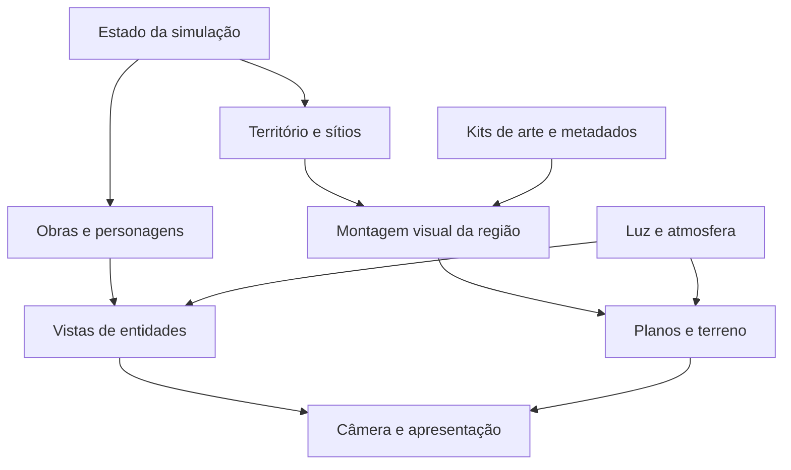

# Empire — plano mestre de cenários, camadas e produção no Godot

**Data:** 7 de outubro de 2026 · **Autor do projeto:** Henrique Passos · **Revisão 2:** pesquisa aprofundada com Milki Delivery  
**Objetivo:** transformar as seis referências próprias em um mundo jogável com a mesma identidade, profundidade, riqueza arquitetônica e integração ao terreno, aprofundando o método com as três capturas de Milki Delivery e fontes dos seus criadores.  
**Base de código mais recente consultada:** `henriquecoding/empire`, `main`, commit [`5b4b24a7eab6fc9c033711dac973a6c527732aca`](https://github.com/henriquecoding/empire/tree/5b4b24a7eab6fc9c033711dac973a6c527732aca), de 07/10/2026, 06:20 UTC. A atualização inclui a ADR 0077; as referências do primeiro levantamento foram preservadas com seus commits próprios (§34 e §49).  
**Motor declarado nessa base:** Godot `4.7.2-stable`. A versão vem de `.godot-version`; este plano não exige atualizar o motor.  
**Entrega:** relatório mestre ampliado, análise de dez imagens, 41 fontes externas primárias, 42 tarefas de planejamento e 12 experimentos propostos. Não houve alteração no jogo, publicação, execução da suíte ou playtest nesta sessão. A versão publicada não pôde ser confirmada pela conexão Vercel disponível (§34.4).

**Guia de leitura:** §§1–6 apresentam diagnóstico e arquitetura; §§7–13 tratam do aproveitamento de cada conceito; §§14–33 organizam a produção inicial. A revisão aprofundada está em §§34–37, com Milki Delivery e outros jogos; §§38–46 detalham composição, movimento, território e integração no Godot; §§47–48 trazem experimentos e backlog ampliado. As fontes estão em §49.

**Correção central desta revisão:** um caminho simples pode ser uma ótima decisão. A riqueza deve aparecer nas bordas, nos apoios, nos planos e nos estados do mundo, preservando a leitura de quem caminha, constrói e combate.

## 1. O resultado que precisamos produzir

O Empire precisa parecer um lugar onde o jogador vive e constrói. Nas referências, a rua está apoiada em uma margem, o porto está sustentado por pilares, o celeiro tem uma cave, a árvore dá origem à arquitetura, a ponte liga duas massas de terreno e a água conecta o fundo ao primeiro plano. No jogo mostrado na captura, a faixa de ação está pouco integrada às bases dos objetos e aos planos ao redor, com estilos e densidades diferentes. As capturas de Milki Delivery mostram que a simplicidade da estrada pode funcionar muito bem quando margens, sobreposições e contraste constroem o espaço. A quebra a resolver está nessa integração, exatamente onde o jogador atua.

**A recomendação central é produzir um cenário modular com composição autorada, apoiado pela simulação existente.** Paisagens distantes, terreno, edifícios, vegetação, água e interiores precisam de responsabilidades próprias. A riqueza da imagem deve chegar ao caminho, às soleiras, à base das árvores e às obras; não pode permanecer concentrada no fundo.

A imagem `image(10).png` é a principal referência de composição do reino fluvial e da árvore monumental. `image(9).png` esclarece como personagens cômicos, contornos, fachadas e equipamentos podem conviver. As imagens 5–8 fornecem kits regionais e de interiores. Essa combinação é uma proposta de interpretação das referências aprovadas, não uma nova aprovação de cada peça ou personagem nelas.

O primeiro resultado a construir será um trecho contínuo dos Enramados, atravessável nos dois sentidos, com margem de rio, sede em evolução, duas construções funcionais, transição para mata, entrada de cave e ciclo de luz. Ele precisa funcionar vazio antes da fundação e continuar coerente depois da expansão. A validação seguinte deve cobrir as duas laterais da região, não apenas uma captura bonita do centro.

### Como distinguir fatos e propostas

- **D — direção do usuário:** as referências anexadas são a intenção visual; o cenário atual está muito distante; o planejamento deve explicar o aproveitamento no Godot por camadas.
- **E — existente:** configuração ou comportamento identificado nos arquivos da main indicada. Leitura de código não equivale a reprodução em execução.
- **P — proposta:** solução de produção, valores para experimentar, organização de assets ou extensão ainda a validar.
- **C — contexto preservado:** decisões anteriores do projeto que precisam ser respeitadas. Quando a implementação atual não foi rastreada, isso é explicitado.

Os identificadores `CV-01` etc. deste documento são itens de planejamento. Não são tickets já criados, perguntas respondidas no painel ou alterações aprovadas automaticamente.

## 2. Material analisado e limites das imagens

Foram abertas e inspecionadas **dez imagens: seis conceitos próprios, uma captura do Empire e três capturas de Milki Delivery**. Os conceitos definem a direção desejada; a captura do Empire sustenta o diagnóstico; as capturas de Milki ajudam a estudar composição e profundidade (§36).

| Arquivo | Dimensões reais | Conteúdo observado | Papel neste plano |
|---|---:|---|---|
| `image(5).png` | 2048 × 682 | Assentamento agrícola, silo circular, canal, pequena ponte, cisterna e armazenamento subterrâneo | Kit da Horta/planície fértil e interiores de produção |
| `image(6).png` | 2048 × 682 | Desfiladeiro, portal de pedra, ponte sobre abismo, guindastes e galerias de mineração | Kit da Fenda e construção em rocha |
| `image(7).png` | 2048 × 682 | Porto de madeira, farol, redes, barcos, guindastes, água e armazém sob a margem | Kit dos Portuários e linguagem de cais |
| `image(8).png` | 2048 × 682 | Árvore ancestral, arquitetura entre raízes, paliçada, oficinas, santuário e cave | Kit dos Enramados, raízes e atmosfera noturna |
| `image(9).png` | 1536 × 864 | Porto com telhados azuis, povo expressivo, comércio, burro carregado e cave | Escala relacional, contorno e integração de personagens cômicos |
| `image(10).png` | 2048 × 738 | Reino fluvial, árvore monumental, muralhas, ponte, moinho, cascata e subsolo | Composição principal e integração entre os sistemas visuais |
| `image(20261007-060159).png` | 1919 × 1088 | Captura do navegador com o Empire em `/jogar/` | Diagnóstico visual; não é um asset de cenário |
| `image(20261007-071524).png` | 1280 × 720 | Milki: floresta, caminho claro, troncos em profundidades distintas e primeiro plano escuro | Composição de mata e oclusão seletiva |
| `image(20261007-071534).png` | 1920 × 1080 | Milki: paisagem aberta, montanhas, pedras, flores e vegetação próxima | Respiro, contraste e profundidade com poucas massas |
| `image(20261007-071554).png` | 1920 × 1080 | Milki: fazenda noturna, celeiro, cerca, vaca, caixa de correio e luz local | Composição funcional e leitura noturna |

Os sete arquivos do primeiro levantamento têm canal RGBA, mas o alfa observado é **255 em todos os pixels**. Portanto, nenhum dos seis conceitos fornece objetos isolados sobre transparência. Isso foi verificado nos arquivos; não é uma dedução pela aparência. Entre as três capturas adicionais, a floresta está em RGB e as outras duas em RGBA. Essas capturas são referências de estudo, não materiais para extrair e incorporar ao Empire.

Também existe grande variação de cores — de dezenas a centenas de milhares de valores distintos nos conceitos. A aparência pixelada não demonstra uma grelha de autoria uniforme. Esse número, sozinho, não determina o estilo: serve para impedir que tratemos automaticamente os PNG como tilesets ou sprites finalizados.

### O que as imagens já resolvem

Elas resolvem atmosfera, materiais, relações espaciais, identidade de povos, distribuição de grandes massas, ideia de corte de solo e vários modelos arquitetônicos. São referências suficientemente concretas para dirigir produção.

### O que ainda precisa ser produzido

Não existem nestes arquivos: partes escondidas atrás dos objetos, alfas utilizáveis, pivôs, ciclos de animação, estados completos de construção, colisões, entradas funcionais, versões de todas as estações ou bordas prontas para repetição. Um recorte retangular de uma árvore continua contendo o céu e as casas atrás dela. Remover o fundo revela uma ausência que precisa ser preenchida na camada posterior.

Nenhuma ferramenta recupera automaticamente as camadas originais que não foram geradas. Segmentar identifica regiões visíveis; reconstruir o que está oculto é outro trabalho.

## 3. Diagnóstico do jogo atual, confrontado com a main

### 3.1 O que a captura mostra

1. O fundo tem volume, relevo e materiais detalhados; a faixa de ação usa grandes campos oliva com pouca estrutura.
2. Árvores detalhadas convivem com copas geométricas e vegetação de outro acabamento.
3. Personagens, carroça e tenda estão próximos, mas as bases não formam uma rua, uma praça ou um acampamento com circulação clara.
4. O chão onde os pés tocam é uma linha forte; falta uma borda de terreno com espessura, grama, pedras, soleiras e sombra coerentes.
5. A região inferior ocupa muita área com um preenchimento pouco informativo. Ela poderia mostrar água, margem, vegetação próxima e relevo enquanto o subsolo está oculto.
6. Vários painéis cobrem a área alta da composição e competem entre si. Mesmo um cenário melhor perde presença se a maior parte da informação permanece em caixas grandes.

Essas observações dizem respeito à captura enviada. Não foi confirmado que seu enquadramento, save ou tamanho de janela coincidam exatamente com a main consultada. A limitação de acesso à versão publicada permanece explícita em §34.4.

### 3.2 O que já existe e deve ser aproveitado

| Estrutura existente | Evidência no código | Consequência para o trabalho |
|---|---|---|
| Godot e GDScript | `.godot-version`, `project.godot`, `AGENTS.md` | O problema pode ser resolvido dentro do motor e da arquitetura atuais |
| Planos de parallax | Cena dos Enramados tem `Parallax2D` para nuvens, colinas, distância, árvores e bosque | Refazer o conteúdo dos planos, preservando a separação já disponível |
| Luz por profundidade | `SceneryLight` oferece SKY, FAR, MID, GROUND e BELOW | Integrar a nova arte a esse contrato antes de trocar o sistema de luz |
| Arte renovada | `RenewalArt`, `RenewalTrees`, `RenewalFlora` e `art/export/renewal/` | Usar o elenco e os perfis recentes como ponto de partida |
| Exportação verificável | `tools/export_renewal.py` conserva fontes, gera atlas, máscaras e pivôs | Estender a preparação de assets em vez de criar exportações manuais sem rastreabilidade |
| Flora funcional | `ForestView` consulta espécies, estações, corte e clareiras | A floresta visual precisa continuar refletindo a simulação |
| Subsolo delimitado | `UnderArt` usa salas e limites dos sítios | As cavernas já têm um contrato espacial a que a arte deve obedecer |
| Subsolo ocultável | `SoilCover` e `SoilReveal` revelam o interior por contexto | Conservar a paisagem da superfície enquanto o interior não está acessado |
| Câmera com arredondamento | `CameraRig._aplicar()` aplica `floorf` ao X apresentado | Reavaliar o movimento do conjunto sem eliminar uma proteção já existente |
| Fontes territoriais com posição | A revisão 2 confirma `TerritoryWatch`, `PlacementRules` e ADR 0077 | Margem, floresta e interior devem corresponder aos recursos e ao acesso que a simulação reconhece |

As fontes do repositório estão em R01–R25, ao final. R01–R16 registram o primeiro levantamento; R17–R25 documentam a atualização da main e a nova conferência dos arquivos de apresentação relevantes.

### 3.3 As causas concretas da distância visual

**E — A paisagem principal ainda é um painel inteiro.** Em `EnramadosLayer._panorama()`, a textura `valley.png` é repetida com espelhamento alternado. O nó pai `FarHills` usa velocidade de parallax de 0,12. Dentro desse painel, montanhas, lago e vegetação pintada se movem juntos. A beleza da paisagem existe, mas suas profundidades internas não estão separadas.

**E — Um plano de distância está vazio.** `EnramadosLayer._distance()` contém `pass`. O nome `DistantRealm` na cena não comprova uma civilização visível ou funcional. Não devemos recolocar uma cidade falsa nesse plano apenas para preencher a imagem.

**E — O terreno da região permanece muito simples.** `_ground()` desenha áreas de campo, caminho e solo usando retângulos e pequenos detalhes repetidos. `WildGround` acrescenta continuidade entre regiões e cores de biomas, mas isso não substitui um kit de margens, rochas, plataformas, raízes e pavimento com a linguagem das referências.

**E — Parte da vegetação continua por um caminho diferente.** `RenewalFlora.PROFILES` cobre alguns tipos de planta, não o catálogo inteiro. Os outros caminhos de desenho podem conservar formas procedurais. Isso é uma hipótese forte para parte da mistura vista na captura; a correspondência de cada objeto deve ser confirmada numa execução com sobreposição de diagnóstico.

**E — Há escalas fracionárias no desenho da flora.** `RenewalTrees` e `RenewalFlora` calculam escala a partir da altura desejada e dos limites do corpo. Isso não é automaticamente errado, mas pode produzir pixels de espessuras diferentes. `nearest` impede interpolação suave; não transforma uma escala fracionária numa escala inteira.

**E — O export impõe dimensões antes da revisão da composição.** O panorama é reduzido para 768 × 256 e ampliado para 1536 × 512. Edifícios e flora usam uma etapa de redução e ampliação para a grelha de dois pixels. Esse processo é reproduzível, mas precisa de revisão visual por família; não prova que uma copa, uma janela ou um arco mantenham a qualidade desejada.

**P — O próximo avanço deve integrar o espaço próximo ao jogador.** A ordem recomendada é corredor legível e margens → apoios dos objetos → arquitetura funcional → vegetação integrada → ampliação dos planos → efeitos. O chão pode permanecer visualmente calmo. Em paralelo ao kit próximo, uma prova pequena de três planos deve comparar a leitura estática e em movimento antes de separar todo o panorama (EX-01 e EX-02, §47).

### 3.4 O que esta análise não afirma

Não foi medida taxa de quadros, consumo real de memória ou latência nesta sessão. Não foi executado o jogo. Os contratos de desempenho do repositório são metas, não resultados. O fato de um arquivo conter um sistema ou uma textura não demonstra que todo o sistema esteja completo ou que sua arte esteja aprovada.

## 4. Direção visual comum para aproveitar as seis referências

### 4.1 Hierarquia

| Elemento | Tratamento recomendado |
|---|---|
| Monarca, companheiro e perigo próximo | Silhueta e rosto legíveis; gesto, arma e resposta ao comando têm prioridade |
| Caminho e interação | Contorno, soleira e contraste suficientes para localizar onde andar e agir |
| Sede e marco regional | Grande massa singular, reconhecível de longe, com função e presença espacial |
| Serviços e produção | Arquitetura reconhecível, ferramentas e atividade local; menor dominância que a sede |
| Vegetação próxima | Espécies com formas próprias, bases convincentes e abertura em torno das interações |
| Fundo | Massas grandes, contraste reduzido, detalhes subordinados à faixa de ação |
| Primeiro plano | Enquadramento e profundidade, com áreas livres para combate e circulação |

### 4.2 Materiais

Preservar o reboco marfim, madeira quente, pedra clara/fria e telhados azul-esverdeados já registrados na direção de 05/10. Aplicar variações regionais: terracota e canais na agricultura; pedra estratificada na Fenda; madeira úmida e redes no litoral; raízes, musgo e alvenaria incorporada à árvore nos Enramados.

A cor de propriedade de um reino pode aparecer em bandeiras, escudos e detalhes de tecido. Evitar recolorir toda a vegetação ou toda a parede para mostrar dono. Em PvP, usar também emblema e forma, para que a identificação não dependa só de cor.

### 4.3 Personagens e cenário

`image(9)` tem personagens com exagero cômico e arquitetura mais simplificada. `image(10)` tem massas naturais e estruturas mais detalhadas. A união deve vir por materiais, contorno, iluminação e escala, não por adicionar ruído aos rostos.

As referências 5–8 são mais escuras e dramáticas. Usá-las para biomas e fases de luz, conservando a capacidade de ler o terreno. Não fazer todo o mundo parecer permanentemente um pôr do sol castanho. Luz e clima precisam ser variáveis.

### 4.4 Continuidade com as decisões de gameplay

**C —** A intenção recente do começo é explorar antes de fundar, com caravana e cidadãos acompanhando o monarca, e o dia 1 ligado à fundação. Outras civilizações devem começar sua presença posteriormente. **C —** no coop, o criador do mundo define onde fundar o reino compartilhado; no competitivo, os jogadores começam em extremos opostos e fundam reinos próprios. Este relatório não auditou toda a implementação dessas regras.

Consequências visuais: a árvore monumental natural pode existir no dia 1; seu castelo, bandeiras e anexos dependem da evolução. Um silo ocupado, um porto movimentado ou o castelo distante da imagem 10 não devem estar pintados permanentemente numa textura de natureza. Ruínas e vestígios previstos pelo design são uma categoria própria.

As bancas e os serviços do reino devem aparecer por fundação, nível e expansão, respeitando o espaço protegido pelas muralhas. Mostrar uma oficina completa no fundo e chamar sua versão da rua de “ainda não construída” tornaria a progressão confusa.

## 5. As quatro coisas diferentes que chamamos de camada

| Tipo de camada | Exemplo | Responsável por |
|---|---|---|
| Camada da fonte de arte | Copa, tronco, telhado, janela, máscara | Edição, exportação e preservação das partes |
| Plano de desenho | Colinas distantes, bosque, fachada, guarda-corpo | Ordem de imagem e profundidade |
| Faixa da simulação | AERIAL, SURFACE, UNDERGROUND | Onde a entidade vive, move-se e interage |
| Camada de física | Terreno, edifício, moeda e máscaras do projeto | Filtragem de contatos quando utilizada |

Essas divisões não são equivalentes. Uma árvore pode ter seis camadas de fonte, ocupar três planos de desenho e ser uma única entidade de superfície. Um canal visível em primeiro plano pode não ser uma área navegável. Uma cave deve existir na simulação mesmo quando está visualmente coberta.

O projeto tem lógica própria e movimento por faixas. **Não se recomenda introduzir `CharacterBody2D`, gravidade, saltos e navegação física apenas para conseguir desenhar o cenário.** Isso seria uma transformação de gameplay maior que o pedido visual. A arte deve primeiro respeitar o modelo vigente; travessia por desníveis reais precisa de trabalho específico.

## 6. Arquitetura de desenho proposta para o Godot

### 6.1 Separação entre estado, montagem e imagem



**P —** A montagem visual lê os fatos do mundo: rio, floresta, sede, salas e limites do reino. Seleciona peças de arte correspondentes. Não cria recursos, não abre edifícios, não muda população e não escolhe eventos de combate.

**E — atualização da revisão 2:** `TerritoryWatch` e `PlacementRules` já dão posição e condição territorial a parte dessas relações. A montagem proposta deve consumir esse contrato, sem manter uma segunda lista independente de rios, árvores válidas ou rocha funcional (§42; R17–R19).

### 6.2 Planos de superfície

Os valores abaixo são **pontos de partida P** para revisão em movimento, não números de balanceamento aprovados. A main já contém valores próximos para alguns fundos. O parallax é controlado por `Parallax2D.scroll_scale`; velocidade menor sugere distância. A documentação recomenda `Parallax2D` para esse fluxo e explica as condições de repetição [F01].

| Plano | Conteúdo | Nó ou forma de desenho | `scroll_scale.x` proposto | Ordem Z ilustrativa |
|---|---|---|---:|---:|
| Céu | Cor do céu e massas atmosféricas | `Sprite2D` ou desenho simples existente | 0–0,03 | -90 |
| Nuvens altas | Grupos separados, sem sol incorporado | `Parallax2D` + sprites | 0,03–0,08 | -85 |
| Relevo distante | Montanhas e bordas do vale | `Parallax2D` + painéis | 0,10–0,16 | -80 |
| Água distante e ilhas | Lago, horizonte de água, ilha | `Parallax2D` + peças | 0,18–0,28 | -70 |
| Marco distante | Ruína ou cidade quando houver estado correspondente | Vista regional sob parallax | 0,25–0,35 | -60 |
| Bosque distante | Massas de árvores sem interação | `Parallax2D` + lotes | 0,45–0,60 | -50 |
| Vegetação intermediária | Árvores atrás da rua, margem oposta | Peças e lotes de região | 0,65–0,85 | -40 |
| Interiores e terreno posterior | Paredes de cave, fundo de arco, face da margem | `TileMapLayer` e peças grandes | 1,00 | grupos de subsolo |
| Edifícios e troncos posteriores | Fachadas, estrutura principal, árvore funcional | Vistas existentes + sprites | 1,00 | -20 |
| Piso e soleiras | Caminho, cais, plataforma e transições | `TileMapLayer` ou desenho em lotes | 1,00 | -10 |
| Entidades | Monarcas, tropas, criaturas, moedas | Sistema de vistas existente | 1,00 | 0 |
| Partes frontais de objetos | Guarda-corpo baixo, boca de arco, moldura da porta | Subparte da mesma vista | 1,00 | 10 |
| Efeitos locais | Fogo, água em queda, poeira, impacto | Animações e efeitos limitados | 1,00 | 20 |
| Primeiro plano | Vegetação e rochas que enquadram a cena | Peças próximas | 1,00–1,05, se seguro | 30 |
| HUD | Recursos, ajuda e controles | `CanvasLayer` existente | Não se aplica | layer da interface |

A ordem do subsolo merece um grupo próprio: interior e seus atores → cobertura de terra/paisagem → superfície. Não colocar a cobertura acima da superfície nem o guarda-corpo sobre todos os efeitos. Os Z da tabela são um mapa de intenção; precisam ser reconciliados com a ordem atual dos filhos da cena.

### 6.3 Cuidados com ordem e interação

- Reservar `CanvasLayer` para interface e efeitos que precisam de canvas independente. Os planos do mundo continuam relacionados à câmera.
- Usar `z_index` com um contrato único, considerando a herança de `z_as_relative`. Y-sort não resolve sozinho uma cena lateral com muitas entidades no mesmo Y; o projeto precisa de ordem por papel e faixa [F04].
- Dividir uma construção em parte posterior e detalhes frontais quando o personagem atravessa sua soleira. Evitar que um prédio inteiro fique na frente e esconda a pessoa.
- Objetos de gameplay não recebem parallax. Porta, preço, alvo de moeda e colisão precisam estar no mesmo lugar.
- Partes visualmente conectadas precisam conservar seu alinhamento. Raiz, tronco e copa de uma mesma árvore podem usar sprites e valores de Z diferentes, mantendo o mesmo movimento se a conexão for visível (§40).
- Não fazer árvores funcionais reaparecerem como plantas decorativas quando cortadas. Usar a remoção de flora já exposta por `ForestView`.
- Não repetir sede, farol ou árvore monumental pelo `repeat_size`. Marcos são instâncias singulares; só faixas realmente contínuas devem repetir.

### 6.4 O papel de `TileMapLayer`

Usar `TileMapLayer` para peças regulares de chão, margem, alvenaria e fundo de cave. Usar vistas de entidade para oficina, sede, portão, roda de moinho e outras coisas com identidade e estado. O Godot separa o mapa em layers e o `TileSet` pode manter formas e dados de tiles [F02, F03].

No Empire, uma layer visual não deve criar automaticamente uma segunda autoridade de colisão. Configurar física e navegação somente quando o modelo de movimento realmente precisar delas. Desenhar uma pedra não precisa bloquear uma tropa.

Preservar desenhos em lotes onde forem eficientes. A documentação de desenho customizado explica que seus comandos são conservados até novo pedido de redesenho; utilizar `_draw()` não é, por si só, o motivo da baixa qualidade [F05]. O problema principal é o conteúdo e o contrato de composição.

## 7. Aproveitamento completo de `image(10).png`: reino fluvial

### 7.1 O que conservar

A árvore monumental central, a relação do reino com a margem, o porto numa zona mais baixa, ponte e cascata, moinho ligado à água, plano agrícola lateral e arquitetura subterrânea assentada em rocha. O lago abre a composição; as montanhas e o castelo distante dão escala; as bandeiras unem a ocupação humana.

O território não precisa reproduzir literalmente todas as posições do conceito. A rua do jogo, as áreas de combate e as reservas de expansão precisam guiar a montagem. Preservar a relação entre massas é mais importante que fixar cada casa no mesmo X da ilustração.

### 7.2 Separação de peças

| Grupo da imagem | Exportação recomendada | Parte oculta a reconstruir | Comportamento previsto |
|---|---|---|---|
| Céu | Céu neutro + nuvens independentes | Céu atrás da copa e das torres | Ciclo de luz e deslocamento discreto |
| Montanhas | 2–3 massas de relevo | Silhueta atrás de castelo, copas e aqueduto | Parallax lento |
| Lago distante | Faixa de água e ilhas | Água atrás do reino | Ondas leves; horizonte estável |
| Castelo/aqueduto distante | Peça regional independente | Relevo e céu onde o monumento sai | Surge apenas quando sua condição existir |
| Árvore monumental | Copa posterior, ramos, tronco, base e raízes | Tronco atrás da fachada; céu atrás de folhas | Marco natural permanente; expansão acrescenta ocupação |
| Sede na árvore | Corpo, porta, torres, bandeiras, janelas e detalhes frontais | Base da árvore sem construção | Estados reais da sede |
| Porto | Deck, pilares, acessos, cordas, barco e acessórios | Água e margem atrás do cais | Construção progressiva; produção e logística |
| Ponte | Encontros, pilares, arco posterior, piso e borda frontal | Água e face de rocha sob o arco | Travessia legível; dano conforme regra da obra |
| Cascata | Queda, espuma superior e espuma de chegada | Rocha ou água atrás da queda | Efeito local e áudio por proximidade |
| Moinho | Casa, roda, eixo, canal e correia quando existir | Parede atrás da roda | Roda opera conforme o estado produtivo |
| Agricultura | Terra preparada, borda, cultivo por estágio e cercas | Chão natural antes do cultivo | Plantio, crescimento e colheita visíveis |
| Cavidades | Parede posterior, pilares, teto, piso, props e cobertura | Solo onde ainda não há sala | Revelação contextual e salas delimitadas |
| Elementos próximos | Rochas, grama, margem, água próxima | Extensão por trás das peças | Enquadramento, sem ocultar alvos |

### 7.3 Árvore e castelo não devem ser a mesma imagem rígida

Uma única textura com copa, castelo e raízes obriga a sede a aparecer pronta e dificulta evolução. A árvore natural precisa de integridade sem ocupação. A sede cresce em um ponto de fixação marcado na base. Casa inicial, anexos, proteção de madeira, torres e alvenaria têm versões ajustadas à árvore.

**P —** Criar uma árvore de marco e uma família de ocupação. Ela deve existir como landmark com identidade própria; se a fundação puder ocorrer longe dela, o reino não ganha automaticamente uma cópia idêntica desse marco. Bases comuns usam um kit adaptável ao terreno. Uma regra que exija fundar junto da árvore seria outra decisão de gameplay, não uma consequência obrigatória da imagem.

### 7.4 Verticalidade e caminhos

A imagem mostra cais, rua, instalações numa cota inferior e galerias. A main usa faixas e linha de superfície fixa. Na primeira integração, conservar a rua funcional contínua e representar o cais baixo como zona acessada por ligação explícita, caso essa ligação já seja suportada. Não desenhar degraus que aparentem levar o jogador a um lugar inexistente.

Na expansão posterior, alturas funcionais precisam de um perfil de percurso e conexões registradas. Até lá, relevo acima e abaixo da rua pode ser rico sem prometer navegação livre. O corte subterrâneo já pode usar o modelo de sítios existente.

**P — contrato para verticalidade funcional futura:** representar cada rota por identidade, faixa, intervalo de X, perfil de altura e conexões. Dois caminhos em alturas diferentes podem pertencer à superfície sem se tornarem a mesma rota. A posição apresentada do pé consulta a rota; alcance de ataque, alvo, moeda, luz e chegada da caravana precisam usar o mesmo resultado. Uma escada liga pontos declarados, com regra para montarias e veículos; uma ponte inexistente remove a ligação prevista. Não basta deslocar o Y de desenho e deixar tiros, interação e sombras na linha antiga.

Para escolher percursos por pontos e conexões, `AStar2D` é uma opção documentada de grafo [F23]. Isso não decide a ação de subir, transportar carga ou cruzar uma ponte: as ligações precisam de regras próprias. A primeira revisão preserva o modelo atual; uma etapa posterior pode introduzir esse contrato com testes de acesso, ida/volta, bloqueio, movimento e saves.

### 7.5 Ordem de produção desta referência

1. Chão/margem e soleira com personagens atuais.
2. Árvore natural e sede piloto por etapas.
3. Ponte pequena e água local.
4. Cave com uma entrada reconhecível.
5. Oficina e cultivo em seu espaço reservado.
6. Separação do relevo, lago e vegetação intermediária.
7. Moinho, porto e extensões regionais.

## 8. Aproveitamento de `image(9).png`: porto cômico

### 8.1 Sua função no plano

Esta referência demonstra legibilidade. É fácil reconhecer o guarda, o vendedor, a banca, os peixes, o animal carregado e a porta. Ela ajuda a corrigir um risco das outras imagens: ter arquitetura abundante e personagens que desaparecem contra o fundo.

### 8.2 Peças a obter

| Peça | Separação | Uso no Godot |
|---|---|---|
| Casa do peixe | Fachada, telhado, placa, peixes pendurados, barril e janelas | Cena de serviço, com atividade e inventário visual limitado |
| Edifício central | Corpo, torres, telhado, varanda, porta e bandeiras | Kit de sede portuária; não precisa ser a sede de todos os povos |
| Banca de frutas | Toldo, balcão, mercadorias por estado e vendedor separado | Construção comercial com presença humana real |
| Deck | Trechos de piso, bordas, pilares e vãos | Kit modular de cais |
| Barco | Casco, vela, cordas e carga | Objeto independente; balanço discreto se ancorado |
| Torre do cais | Estrutura, plataforma, bandeira e escada | Posto funcional se existir regra correspondente |
| Burro e carga | Corpo, cabeça, carga e sombra | Referência de expressão e proporção; precisa de sprites próprios |
| Aves | Aves separadas e poleiros | Fauna de cenário, não caça automática |
| Cave da direita | Entrada, parede, piso, ferramenta e luz | Interior localizado revelado por acesso |

### 8.3 Ajustes necessários

Remover as pessoas pintadas da fachada e do balcão antes de usar essas construções. Se o vendedor está ausente, morto ou não contratado, não pode continuar embutido na textura. A mesma regra vale para o guarda da varanda.

O peixe no topo e os símbolos têm humor próprio. Usar como linguagem de ofício sem multiplicar letreiros exagerados pelo mundo. O azul das coberturas conversa com a direção recente do Empire; o acabamento das margens deve ser harmonizado com o reino fluvial.

Essa imagem é 16:9; as panorâmicas 5–8 e 10 têm proporções bem mais largas. Não usar seu enquadramento como justificativa para esticar todas as outras até a mesma tela.

## 9. Aproveitamento de `image(8).png`: Enramados e raízes

### 9.1 Identidade

A arquitetura parece ocupar a árvore e seu solo, em vez de repousar sobre uma plataforma genérica. Há oficinas, pequenas casas, uma entrada dominante, paliçada, torres e interior ligado às raízes. Essa relação deve orientar o kit inicial do Empire.

### 9.2 Camadas e módulos

- Copa distante e ramos posteriores, com contorno suave ou ausente conforme a profundidade.
- Tronco e raízes acima do solo, preservando a massa natural.
- Fachada da sede, porta e degraus; anexos de casa separados.
- Oficina de madeira, abrigo, lenha, bancada e ferramenta como partes independentes.
- Paliçada em trechos de início, meio, fim e portão; torres em cenas funcionais.
- Superfície de caminho com borda de relva, raízes e soleiras.
- Solo sólido e face de corte, cobrindo salas não acessadas.
- Interiores: sala de produção, galeria, santuário e armazenamento, cada um com parede e piso próprios.
- Fachada frontal de pilares e arcos, para enquadrar atores subterrâneos.
- Luz emissiva de janela e lanterna separada do albedo.

### 9.3 Árvore com rosto e Podridão

O rosto da árvore lateral pode orientar casca expressiva ou criatura do mundo, mas não deve ser incorporado em toda árvore comum. A árvore funcional tem espécie e estado; o Amargueiro e outras presenças especiais têm identidade própria. Conservar a distinção já existente entre flora e Podridão.

Os pendões roxos na direita são um recurso de ameaça da composição. Não introduzir uma facção extra apenas porque eles aparecem na imagem. Reaproveitar motivo, recorte e contraste somente onde o design já justificar a presença.

### 9.4 Subsolo

O santuário e a cave são excelentes referências de teto, raízes e pedra. No jogo normal, a cobertura oculta deve mostrar margem, vegetação e paisagem. Ao descer, abre-se a janela do sítio correto. Não transformar o panorama inteiro numa radiografia permanente.

## 10. Aproveitamento de `image(5).png`: agricultura, silo e água

### 10.1 Composição produtiva

O cultivo tem relação com a água; o armazenamento da colheita fica sob estruturas; a ponte organiza a circulação; cercas e bancas formam espaços de serviço. Isso oferece uma lógica econômica visual que o cenário atual ainda precisa comunicar melhor.

| Grupo | Assets propostos | Estados necessários |
|---|---|---|
| Silo | Corpo circular, telhado, porta, guincho, janela e anexos | Não construído, obra, ativo, danificado e ruína |
| Campo | Terra, borda de relva, sulco, cultivo em fases e cerca | Preparação, cultivo, colheita e pausa sazonal |
| Canal | Água, margens, abertura de comporta e passagens | Fluxo visual de acordo com a função existente |
| Ponte | Arco, piso, encontro e borda frontal | Versão construída e danificada quando a obra exigir |
| Depósito | Parede de cave, pilares, piso, potes e sacos | Quantidade visual por faixas, sem um sprite por unidade de estoque |
| Cisterna | Câmara, nível de água, conduto e luz | Versão funcional ligada ao sítio correspondente |
| Bancas | Cobertura, balcão, ferramentas, mercadoria e pessoa separada | Disponibilidade, trabalho, produção e falta de funcionário |

### 10.2 Evitar cultivo decorativo enganoso

Uma plantação no plano distante pode ambientar uma civilização já existente. Dentro do território do jogador, a plantação próxima deve corresponder a um canteiro ou atividade real. Não pintar cenouras permanentemente sobre uma área que o usuário ainda vai desmatar ou construir.

As raízes visíveis no corte são referência de acabamento. Elas podem virar estampas e peças de solo; não precisam existir como dezenas de nós ou objetos simulados.

### 10.3 Compatibilidade regional

O kit usa materiais mais claros e terracota. Fazer uma transição gradual entre mata e cultivo: clareira, borda de canal, primeira cerca, galpão, depois conjunto produtivo. A água pode atravessar a composição sem que cada canal exija uma nova mecânica de irrigação. Uma mecânica nova só entra se estiver prevista no design.

## 11. Aproveitamento de `image(6).png`: Fenda, ponte e mineração

### 11.1 Prioridades

Conservar escala do desfiladeiro, pedra em estratos, arquitetura encaixada na rocha e a ponte como limiar. A imagem é mais austera e menos saturada; uma identidade regional diferente é desejável.

### 11.2 Decomposição

1. Céu e sol separados.
2. Massas de cânion em pelo menos dois planos, reconstruídas atrás do portal.
3. Rochas intermediárias e vegetação localizada.
4. Portal: laterais, verga, emblema, interior escuro e braseiros.
5. Ponte: encontros, torres, arco, piso e borda frontal.
6. Oficina/casa: corpo e telhado separados de bandeiras e atividade.
7. Guindaste: base, haste, cabo, gancho e carga.
8. Galeria: parede, escoras, piso, fechamento e props de mineração.
9. Abismo e face de rocha próximos, com volume sem textura ruidosa.

### 11.3 Travessia e fundação

A ponte deve indicar uma ligação real. Se o trecho é intransponível antes de construir, é necessário consultar a regra de passagem e bloqueio, não apenas esconder o sprite da ponte. Se a versão inicial preserva rua horizontal contínua, o abismo pode existir como cenário abaixo dela, mas não deve sugerir uma queda que o jogo não reconhece.

Espaços estreitos da Fenda podem oferecer locais próprios de fundação. A arte precisa obedecer aos limites realmente válidos. Um portal monumental não serve de lugar de fundação livre só por ter uma bela composição.

### 11.4 Animação de trabalho

O guindaste pode ser animado com transformações de partes e uma sequência de carga. O minério recebido é decidido pela produção; a animação ilustra esse evento. Não gerar recursos pelo momento visual em que uma pedra chega ao chão.

## 12. Aproveitamento de `image(7).png`: porto atmosférico

### 12.1 O que complementa o porto da imagem 9

A imagem 9 define leitura e humor; a 7 oferece continuidade horizontal, variação de materiais, farol, redes e relação entre armazém e água. Produzir uma única família portuária usando essas qualidades evita dois portos que parecem de jogos diferentes.

| Elemento | Aproveitamento | Cuidado |
|---|---|---|
| Farol | Corpo, lanterna, cobertura, janela, anexos e emissão | Função e luz precisam corresponder ao estado do mundo |
| Deck contínuo | Kit modular com vãos, bordas e pilares | Juntas sem mudança involuntária de altura |
| Redes e cordas | Props isolados com variantes | Não cobrir moedas ou o rosto dos personagens |
| Barcos pequenos | Casco, carga e amarração | Nenhuma navegação nova implícita por arte |
| Guindastes | Família de peças articuladas | Separar cabo/carga para animar sem mover toda a oficina |
| Mercado e secagem | Cobertura, balcão e produto | Pessoas e mercadorias disponíveis separadas |
| Armazém sob a margem | Interior, cobertura, entrada e acesso | Só aparecer como interior quando acessado |
| Água e maré | Superfície, espuma, reflexos e margens | Não usar maré visual que deixe os pés sem apoio |

### 12.2 Passagem entre cais e terra

Criar encontros de madeira–pedra, pedra–solo e píer–margem. Uma costura convincente vale mais que adicionar várias construções. Pilares precisam terminar na água ou num apoio; evitar trechos que parecem suspensos por falta de base.

### 12.3 Repetição

Trechos de cais, postes e ripas podem repetir. Farol, embarcações características e composição de mercado precisam de variação e identidade. Espelhar o porto inteiro troca direção de bandeiras, luz e atividade, além de denunciar a repetição.

## 13. Fluxo de produção: imagem achatada → assets → cenário

### 13.1 Escolher o método por elemento

| Método | Quando funciona | Limite real | Recomendação para Empire |
|---|---|---|---|
| Imagem inteira em um plano | Referência, menu, comparação ou fundo muito distante | Objetos internos se movem juntos e não têm estados | Usar transitoriamente; não é a solução da faixa jogável |
| Recorte retangular | Parede, tecido, painel de textura, interior sem sobreposição | Conserva os pixels de fundo dentro do recorte | Bom para obter amostras e algumas superfícies |
| Máscara manual | Telhado, árvore, pedra, barco ou peça singular | Contorno trabalhoso, vazios exigem revisão | Método principal para o lote piloto |
| Segmentação assistida | Primeira máscara de objetos grandes | Não conhece regras de pixels nem inventa fundo oculto | Opcional, seguida de edição humana |
| Reconstrução localizada | Céu atrás de copa, parede atrás de roda, terreno sob casa | Pode alterar luz, material e perspectiva | Comparar com a fonte e corrigir a grelha |
| Redesenho modular | Piso, margem, arco, parede, cultivo e estados de obra | Exige autoria, não sai pronto do recorte | Método final para objetos de gameplay repetíveis |

### 13.2 Fonte editável

Criar um documento de produção por conceito e uma fonte por kit. Conservar o PNG recebido intacto e registrar o vínculo da peça com a referência. A fonte pode ser `.kra`, `.xcf` ou `.aseprite`, conforme a ferramenta já disponível. O Godot receberá os exports; arquivos pesados de edição permanecem fora do pacote de runtime.

**Ferramentas sem compra obrigatória:** Krita para pintura, máscaras e reconstrução; GIMP para recorte e revisão de seleção. Aseprite continua apropriado se já estiver disponível, principalmente para ciclos, slices e exportação. O plano não depende de adquirir licença ou assets comerciais.

A documentação do Krita descreve máscaras de transparência para ocultar sem apagar a pintura [F06]. O GIMP fornece seleção de primeiro plano para extrair objetos [F07]. São instrumentos de preparação, não recuperação automática das camadas perdidas.

### 13.3 Procedimento do lote piloto

1. Duplicar a referência num arquivo de produção e bloquear a camada original.
2. Marcar chão, horizonte, topo da arquitetura, entradas, bases e vãos. Não deformar a imagem para fazê-la coincidir com os números atuais.
3. Separar primeiro uma peça de caminho, uma árvore, uma fachada e uma parede de cave.
4. Criar máscaras das partes visíveis; revisar entre folhas, arcos, cordas e pilares.
5. Remover pessoas e elementos móveis da arquitetura; reconstruir os pixels por trás deles.
6. Reconstruir o plano posterior nas regiões descobertas quando a peça se desloca, some ou muda de estágio.
7. Preparar cor de material sem emissão incorporada. Se o pôr do sol domina a peça, ajustar a fonte; uma modulação noturna não corrige luz diurna pintada em direção errada.
8. Definir tamanho nativo e grelha da família; limpar contornos, pixels soltos e mudanças de espessura.
9. Fixar base/pivô, área ocupada, pontos de interação e partes frontais.
10. Exportar PNG com transparência e manifesto. Verificar sobre fundos claro, escuro e colorido.
11. Instanciar no trecho jogável e conferir pés, sombra, luz, passagem e oclusão.
12. Comparar em câmera parada e andando para os dois lados; ajustar a composição antes de repetir o kit.

### 13.4 Segmentação e IA

SAM 2 é uma implementação de segmentação por prompts em imagens e vídeos, com suporte a máscaras automáticas [F08]. Pode ajudar a selecionar grandes massas; não fornece árvore completa atrás do castelo, paredes escondidas ou todas as fases de construção.

Para apenas quatro peças piloto, seleção manual pode ser mais rápida que instalar uma cadeia de modelos. Usar assistência quando o volume justificar. Ela pertence à preparação de arte, fora do runtime; nenhuma inferência de imagem deve acontecer no jogo.

Para futuras gerações, pedir **uma peça isolada por tarefa**, com referência explícita, fundo transparente quando necessário, vista lateral, base e tamanho definidos. Para reconstruções, preservar a imagem de referência como alvo. Geração é um rascunho visual: o aceite depende da peça no motor, dos contornos e da consistência entre estados.

### 13.5 O que não resolver por operações automáticas

- Cortar toda a imagem em quadrados 64 × 64 não cria um tileset com bordas compatíveis.
- `Split Layer` do Krita divide cores; não entende “árvore”, “fachada” e “montanha” [F09].
- `Image Split` divide retângulos e spritesheets; não separa objetos sobrepostos [F10].
- Converter os PNG para alfa binário sem seleção não remove fundo: todos os pixels destes conceitos já estão opacos.
- Reduzir e ampliar com `nearest` não corrige um rosto ou uma porta mal desenhados.
- Diminuir a paleta inteira de uma vez pode fundir planos, perder contraste e apagar materiais.
- Renomear um PNG para `.aseprite` não cria uma fonte com camadas.

## 14. Escala, pixels, proporção e câmera

### 14.1 Preservar a base atual

**E —** O projeto usa 1280 × 720, `canvas_items` e filtro de textura `nearest`. A Asset Bible declara autoria nativa nessa base, personagens com detalhe de um pixel, cenário próximo com agrupamento de dois pixels e fundo com grupos maiores. A grelha lógica do tile é 32 px, com autoria em módulos 64 × 64.

**P —** Manter 1280 × 720 nesta revisão. Não voltar à sugestão histórica de 320 × 180 nem reduzir o projeto inteiro para 640 × 360. As referências novas precisam de tratamento de composição e de assets, não de uma mudança silenciosa de escala do jogo.

### 14.2 Tamanho da tela de um sprite é diferente do tamanho do corpo

O inventário atual registra frames de atores em 192 × 192, mas o export define alturas úteis de 50 para cidadão, 54 para arqueiro de tropa, 60 para cozinheiro, 68 para Nia e 78 para rei. Armas, margens e transparência ocupam parte da tela. Isso explica por que um arquivo grande não garante um personagem grande no jogo.

**C —** O pedido recente de tropas em base 64 × 64 tem precedência sobre leituras históricas que exigiam reduzi-las a 32 × 32. Preparar uma prancha com rei, Nia, arqueiro imperial, arqueiro de tropa, cidadão, cozinheiro e companheiro. Acessórios podem ultrapassar o corpo. Registrar separadamente tela, corpo útil, escala de desenho e tamanho apresentado.

Não impor o mesmo quadrado visível a todas as silhuetas. O rei é corpulento e maior; Nia pode ser mais baixa e manter autoridade visual. Fazer o arqueiro legível por postura e arco, sem ampliá-lo por um fator arbitrário a cada câmera.

### 14.3 Compatibilização de grelhas

| Família | Contrato inicial recomendado | Verificação |
|---|---|---|
| Personagens | Desenho nativo; relação de corpo coerente com a base 64 do pedido recente | Rostos, olhos, mãos e armas legíveis em 1× |
| Construções próximas | Detalhe agrupado em 2 px, com exceções justificadas | Porta, telhado e alvenaria mantêm espessura |
| Terreno | Autoria modular 64 × 64 sobre grelha lógica de 32 | Bordas e conectores sem quebra |
| Fundo | Massas maiores, contraste reduzido e poucos detalhes isolados | Não compete com os atores |
| Efeitos | Passo de pixel compatível com a família em que aparecem | Água, fogo e vento não parecem filtrados |

### 14.4 Panorama não é tela do jogo

`image(10)` tem proporção aproximadamente 2,78:1 e `image(5)` cerca de 3:1. O viewport 1280 × 720 é 1,78:1. A solução é distribuir a composição no mundo e permitir que a câmera veja uma parte por vez, ou produzir uma composição derivada com o enquadramento correto. Esticar as imagens até 16:9 altera proporção de torres, árvores e animais.

A largura de um conceito não define automaticamente a largura do mapa. Uma ilustração panorâmica pode guiar um conjunto de segmentos, desde que a escala das portas e pessoas permaneça consistente.

### 14.5 Linha do chão e espaço inferior

**E —** `Band.GROUND_LINE` está em 517, cerca de 72% dos 720 px. A própria produção do projeto registra essa linha como ponto de composição a revisar. Nas novas referências, por inspeção visual, o piso principal aparece mais alto em várias imagens, abrindo área para margem, água e interior.

**P —** Fazer uma comparação A/B: enquadramento atual em 517 e uma composição piloto com piso principal aproximadamente em 460. O segundo valor é só um experimento visual, não alteração aprovada de constante. Se for escolhido, revisar todas as funções de chão, passagens, sombras, luz, moeda, câmera e subsolo; não mover somente os sprites.

Antes desse experimento, melhorar a paisagem inferior já dá retorno: substituir grandes preenchimentos lisos por margens, água, solo estratificado, vegetação próxima e rochas. A cave continua encoberta enquanto não acessada.

### 14.6 Saídas e escala inteira

A documentação do Godot explica que escala inteira mantém pixels com espessura uniforme; modos de stretch têm efeitos diferentes sobre mundo e interface [F11]. Na base 1280 × 720:

| Tela | Fator para caber mantendo a base | Consequência |
|---|---:|---|
| 1280 × 720 | 1× | Referência nativa de revisão |
| 1920 × 1080 | 1,5× para preencher | Escala fracionária; pode variar espessura aparente dos pixels |
| 1920 × 1080 com escala inteira | 1× | Área restante fica em barras; precisa de avaliação visual |
| 2560 × 1440 | 2× | Ampliação inteira |
| 3840 × 2160 | 3× | Ampliação inteira |

Não declarar que 1280 × 720 amplia perfeitamente para Full HD. Fazer a comparação prevista na matriz atual. Em telas menores que a base, `integer` não é solução mágica: precisam de enquadramento e UI apropriados. Uma proposta de renderização do mundo em viewport separado exigiria revisão da escala do texto e dos controles de toque, já ajustados recentemente.

### 14.7 Movimento

Manter a posição da simulação precisa e quantizar apenas a apresentação quando necessário. A câmera arredondada não evita sozinha que o parallax e os objetos escalados oscilem entre pixels. Testar um percurso lento, corrida e inversão de direção olhando telhados, galhos e bordas, não somente o rei.

## 15. Terreno que sustenta o cenário

### 15.1 Kit inicial do chão

**P —** Produzir um kit pequeno e completo, com aproximadamente 32–48 peças de autoria, em vez de centenas de objetos antes do primeiro teste. A contagem é escopo de produção, não requisito do motor. Na revisão aprofundada, a maior parte da riqueza do kit está nas bordas, apoios e transições; a rua continua calma quando isso favorece a leitura. EX-01 compara essas escolhas antes de produzir o lote completo.

| Família | Peças que o kit deve cobrir |
|---|---|
| Rua | Chão regular, variante, começo/fim, transição e borda de relva |
| Margem | Topo, face, canto, encontro com pedra e encontro com água |
| Rocha | Superfície, face, base, canto e vazio de arco |
| Madeira | Deck, borda, pilar, apoio e encontro com solo |
| Solo | Estratos, raízes pequenas, massa fechada e acabamento de corte |
| Cave | Parede, piso, teto, pilar, arco, fechamento e entrada |

Autorizar rotação e espelho apenas onde material e luz permitirem. Não espelhar soleira com emblema ou pedra com iluminação direcional forte. Para juntas, preferir variantes compatíveis e sobreposição de pequenos props após a montagem.

### 15.2 Base dos objetos

Toda construção deve ter uma região de assentamento: soleira, fundação, chão gasto, sombra e ligação ao caminho. Uma oficina precisa parecer ocupada mesmo quando não há trabalhador na frente. Uma árvore precisa de raiz ou transição de tronco para solo. O objeto não termina numa borda de alfa que parece recorte colado.

### 15.3 Colisão e circulação

O volume pintado, a área ocupada pela obra, o alcance de interação e o limite de bloqueio são medidas diferentes. Salvar todos no manifesto ou nos dados correspondentes. Não usar a caixa da imagem transparente inteira como footprint da obra.

Manter corredores de combate, chegada da caravana, coleta de moeda e passagem para cave. Se a arte cresce para fora do slot atual, escolher entre uma peça menor bem desenhada ou a revisão do slot. Encolher a estrutura de forma fracionária para esconder conflito deve ser evitado.

## 16. Composição do mundo, segmentos e espaço para respirar

### 16.1 Uma região não é uma fila de vitrines

O World Production Bible prevê segmentos de 640 px, paisagem por região e um assunto por segmento. Esses são contratos existentes. A região atualmente desenhada pelos Enramados tem largura de 3840 px; não presumir que toda entrada do catálogo já seja uma cena autorada pronta.

Organizar três tipos de ritmo: concentração junto da sede; trabalho e circulação em setores do reino; exploração com pausas, recursos e marcos fora dele. Um trecho sem edifício pode conter trilha, sinais de animais, vegetação e água. Vazio de ocupação não precisa significar faixa vazia de arte.

### 16.2 Montagem em duas escalas

**P —** A geografia e os planos distantes são contínuos por região. Os segmentos recebem piso, pontos funcionais e estruturas. A costura visual acontece após saber o que realmente existe. Essa ordem segue a produção prevista no projeto e evita um horizonte diferente em cada segmento.

Separar unidades visuais de unidades de streaming. Um segmento de gameplay de 640 pode integrar um lote visual de 1024 ou um conjunto de sprites menores; não mudar o tamanho do segmento só para caber numa textura.

### 16.3 Composição baseada no lugar de fundação

**P — sequência proposta de montagem**, integrada ao contrato territorial existente e às regras de persistência do projeto. A posição de recursos reconhecidos pela simulação não deve mudar apenas para favorecer uma composição (§42).

1. A natureza é criada e persistida por seed e região.
2. Recursos, entradas, marcos e áreas válidas existem antes da escolha.
3. A sede ocupa a escolha efetiva do jogador, respeitando a reserva local.
4. Caminho, limpeza de flora e soleiras se adaptam ao espaço real.
5. Obras desbloqueadas recebem slots dentro do território protegido.
6. Expansão abre outro trecho coerente; as novas construções não são simplesmente espalhadas por X fixo.

O lugar escolhido pode mudar os conectores disponíveis — margem, madeira, rocha ou clareira — sem exigir um novo desenho integral de cada cidade. Usar bases adaptadoras e kits regionais. Regras de vantagens climáticas e econômicas permanecem no design/simulação, não na textura.

### 16.4 Espaçamento verificável

O projeto já tem regras e números de produção para distância entre grupos e área diante de muros. Não criar outra lista concorrente de balanceamento. Reavaliar essas medidas com o footprint real dos novos prédios: uma fachada larga pode consumir toda a folga que parecia existir nos dados.

Fazer uma planta com reserva de sede, bancas, circulação, muralhas, postos e futuros serviços. Essa planta precisa funcionar sem todos os edifícios e também no estado máximo. Se só funciona quando o mapa inteiro está pronto, falha como jogo de evolução.

## 17. Construções com evolução visual real

### 17.1 Contrato por obra

| Estado | O que aparece | O que deve ficar livre |
|---|---|---|
| Não disponível | Natureza ou espaço coerente com o mundo | Nenhuma fachada pronta indicando disponibilidade falsa |
| Disponível | Marco discreto, fundação inicial ou contexto de interação | Passagem, coleta e combate |
| Pagamento | Resposta localizada de moedas e custo | Pessoas próximas e alvos |
| Construção | Materiais, andaime e volume parcial | Corredor até o trabalhador e leitura do progresso |
| Ativa | Arquitetura completa e atividade do ofício | Interação e posto de trabalho |
| Sem funcionário ou insumo | Pausa de atividade, ferramenta parada ou estoque reduzido | Estado não depende apenas de um texto remoto |
| Danificada | Ruptura ou fissura coerente com a fase da obra | Entrada e limite de bloqueio claros |
| Reparação | Trabalho localizado no ponto danificado | O edifício continua identificável |
| Ruína | Restos, base e consequência na circulação | Sem prédio completo pintado por baixo |

`SiteStage`, `BuildingSkins` e vistas existentes devem continuar dirigindo o estado. A arte não cobra moedas nem inicia produção.

### 17.2 Progressão da sede

Criar as versões correspondentes aos estágios já usados pelo projeto: fundação/lareira, tendas, povoado, vila, ocupação fortificada e sede avançada. Registrar os nomes exatos dos dados ao implementar. Usar peças comuns para base, portas e anexos onde fizer sentido; desenhar transformações marcantes para os estágios mais importantes.

O estado inicial não herda muralhas, torre e castelo da imagem de referência. A imagem 10 é também um destino de evolução. A qualidade do primeiro acampamento precisa ser alta mesmo com poucos elementos: carroça assentada, fogo, lona, chão pisado e vegetação ao redor já podem formar uma composição convincente.

### 17.3 Muralhas e expansão

Manter a banca do arco, a do construtor e os serviços dentro do espaço previsto pelas muralhas. O portão e suas bordas precisam casar com o caminho. Ao ampliar o reino, não duplicar uma muralha decorativa pintada permanentemente no fundo; atualizar a instância correspondente ao novo limite.

## 18. Subsolo, salas e descoberta

### 18.1 Preservar a regra atual

O corte de solo dos conceitos é uma ferramenta de referência. O jogo já tem a regra de mostrar paisagem embaixo enquanto o jogador está na superfície e revelar o interior ao acessar. `SoilCover` confirma essa intenção. A nova arte deve melhorar os dois estados: exterior bonito quando fechado e interior convincente quando aberto.

### 18.2 Kit de interior por função

| Tipo | Linguagem visual | Peças indispensáveis |
|---|---|---|
| Cave da sede | Alvenaria, madeira, armazenamento e raízes locais | Parede, piso, escada/acesso, pilares, teto e baia |
| Depósito agrícola | Potes, sacos, prateleiras e solo fértil | Parede, piso, reservas visuais e cisterna se prevista |
| Galeria da Fenda | Rocha cortada, escoras e mineração | Estratos, vigas, fecho, piso e equipamento |
| Santuário dos Enramados | Raízes e pedra simbólica | Nicho, altar, pilares, entrada e emissão controlada |
| Dungeon/ruína | Material e conservação próprios do sítio | Entrada, limites, corredor, sala e objeto de recompensa real |
| Gruta natural | Rocha irregular e poucos elementos construídos | Teto, piso, parede lateral e diferença de profundidade |

### 18.3 Entrada verdadeira

Escada, poço ou porta precisam coincidir com a boca do sítio. A main trabalha com coordenadas e passagens específicas; não desenhar uma escada diagonal que aparenta chegar em outro X enquanto a troca funcional ocorre instantaneamente em uma coordenada diferente.

Paredes e tetos devem respeitar a área útil reservada por `UnderFit`, `UnderLayout` e sistemas associados. A arte pode enriquecer o envelope, mas não reduzir a altura abaixo da necessária para o rei ou cobrir a baia onde o baú aparece.

### 18.4 Revelação

Aplicar a máscara somente à cobertura; os elementos internos permanecem no grupo correto. Dither é efeito, não método para esconder vazios ou contorno ruim. Salas próximas não acessadas não devem aparecer por uma máscara global indevida. Verificar ida, retorno à superfície e carregamento de save.

Em coop, a descoberta persistente e a visibilidade local de cada jogador são conceitos diferentes. O estado compartilhado pode saber que uma sala foi descoberta sem obrigar a câmera de um jogador na superfície a mostrar uma radiografia. Esse comportamento deve ser planejado com autoria de jogador, sem alegar que a main já possui o fluxo completo.

## 19. Água, cascatas, reflexos e margem

### 19.1 Estrutura de água

Separar corpo de água, linha de superfície, espuma, refração leve, objetos refletidos e borda da margem. A água distante usa pouca informação. A água próxima recebe interação visual com pilares e rochas. A cascata precisa de começo e chegada; uma faixa vertical animada sem espuma parece sobreposta.

### 19.2 Três níveis de implementação

| Nível | Técnica proposta | Aplicação | Custo/risco |
|---|---|---|---|
| Inicial | Textura de água + espuma e pequenas faixas animadas | Lago, canal e primeira margem | Menor custo; já fornece material e movimento |
| Intermediário | Reflexos estilizados de objetos selecionados, recortados pela água | Porto e ponte próximos | Exige transformar pelo plano da água e atualizar quando o objeto muda |
| Avançado | Captura dedicada ou shader com cópia controlada de tela | Cenas em que o reflexo móvel melhora bastante | Custo extra de render e ordem de captura; só após medição |

A primeira fatia deve usar o nível inicial e, se necessário, reflexos selecionados. Não começar com uma segunda renderização do mundo inteiro.

### 19.3 Reflexo não é virar a tela de cabeça para baixo

O Godot fornece leitura de tela via shader, com cópia de buffer e regras de ordem; isso não entrega automaticamente um reflexo correto de rio [F12]. Evitar refletir HUD, primeiro plano impróprio ou parte de uma cave descoberta. A projeção precisa de um plano de água, recorte e objeto relevante.

Reflexos de janela e fogo devem corresponder às fontes acesas. Desligar a oficina não pode deixar sua luz âmbar permanentemente pintada na superfície do rio.

### 19.4 Movimento e pixel

Usar passos de pixel coerentes com o cenário. Uma onda suave aplicada em resolução diferente pode borrar o contorno do cais. Distorsão deve ficar dentro da água; pilares e piso continuam firmes. Reduzir movimento em acessibilidade sem retirar a leitura da margem.

## 20. Luz, clima e estações

### 20.1 O sistema existente é a primeira opção

`SceneryLight` já compartilha materiais por profundidade, consulta luzes visíveis e limita a lista do shader. Conservar esse sistema no piloto evita outra camada de escurecimento contraditória. Não multiplicar indiscriminadamente textura por tint, depois `modulate`, depois `CanvasModulate` e depois shader de mundo.

### 20.2 Emissões separadas

Janelas, lanternas, fogo, olhos da Podridão e forja precisam de máscaras ou sprites próprios. A arquitetura conserva cor de material; a emissão aparece quando existe atividade ou luz. Não tentar obter manhã, noite e chuva apenas multiplicando uma imagem de pôr do sol pronta.

### 20.3 Luzes nativas como opção localizada

`PointLight2D`, `DirectionalLight2D`, `CanvasModulate` e `LightOccluder2D` são as ferramentas nativas descritas pelo Godot [F13]. Se sombras locais forem úteis, experimentar em uma porta ou oficina, mantendo uma única autoridade de iluminação sobre cada material. Não migrar todo o cenário para dezenas de luzes com sombra sem comparar resultado e custo.

### 20.4 Variações

| Situação | Mudança desejada | Elemento a preservar |
|---|---|---|
| Manhã | Materiais legíveis, fundo com profundidade | Cor da facção e faces |
| Crepúsculo | Horizonte quente, janelas ganham presença | Piso e saídas |
| Noite | Interior protegido e exterior ameaçador | Silhueta do monarca e perigos próximos |
| Chuva | Paleta ambiental e pequenos efeitos | Contorno dos controles e moedas |
| Outono | Copas de espécies adequadas | Espécies perenes continuam perenes |
| Inverno | Variantes de copa/solo previstas | Tronco, circulação e entradas |

Criar variantes só onde a mudança realmente precisa de desenho. A main já distingue copa despida e cor de outono. Não produzir seis biomas × todas as estações × seis luzes como imagens completas; materiais, partes e estados reduzem essa multiplicação.

## 21. Animação e vida do cenário

### 21.1 Movimento com função

| Elemento | Movimento adequado | Fonte do estado |
|---|---|---|
| Copa | Variação pequena, base fixa | Espécie, estação e ambiente |
| Bandeira | Ciclo curto, mastro firme | Dono e condição da obra |
| Janela/oficina | Luz e pequenas ações de trabalho | Funcionário e produção |
| Moinho | Roda e, se previsto, equipamento interno | Operação produtiva |
| Guindaste | Haste/cabo/carga em sequência | Trabalho ilustrado |
| Carroça | Rodas quando se move, corpo com peso | Movimento real da caravana |
| Fogo | Ciclo e emissão com variação controlada | Fogo aceso e tempo de vida |
| Pássaros | Voos e pousos limitados | Fauna de cenário |
| Personagem | Pose e ação correspondente | Simulação e comandos |

### 21.2 Técnica

`AnimatedSprite2D` atende sequências de frames; `AnimationPlayer` pode coordenar propriedades e peças de uma cena [F14]. No Empire, usar esses recursos onde encaixem, conservando a seleção de poses e batching atuais para atores. Não reescrever todos os personagens como cenas independentes para animar uma bandeira.

O desenho atual de árvores separa a copa por um corte horizontal e aplica vento pequeno. A fonte nova deve fornecer copa e tronco com limites naturais, evitando uma linha reta perceptível no meio da árvore. A base fica presa ao solo.

Quatro imagens de caminhada não comprovam ataque completo. O inventário atual declara poses de combate existentes; a produção deve manter essa honestidade. Desenhar antecipação, contato e recuperação específicos conforme os monarcas, sem reaproveitar a caminhada como ataque.

### 21.3 Som

Adicionar áudio por região/objeto apenas quando houver função: água sob a ponte, cascata perto da chegada, martelo no trabalho, cabo do guindaste e madeira do cais. Usar as pistas e o diretor existentes. Distância e estado limitam vozes; um porto parado não precisa tocar todos os sons permanentemente.

## 22. Metadados e exportação

### 22.1 Contrato da peça

**P —** Estender o manifesto atual sem duplicar dados que já pertencem ao Registry ou à simulação.

| Campo conceitual | Necessidade |
|---|---|
| Identificador e família | Resolver a peça sem depender do nome visual |
| Referência e hash da fonte | Rastrear de qual conceito deriva |
| Textura/atlas e região | Carregar só os exports necessários |
| Tamanho da tela e limites opacos | Distinguir margem transparente do corpo |
| Pivô/base | Apoiar no chão e trocar de estado sem deslocamento |
| Footprint visual | Reservar composição e evitar sobreposição |
| Conectores | Encontro esquerdo/direito, nível de piso e material |
| Partes posterior/frontal | Ordenar pessoas, porta e guarda-corpo |
| Máscaras de emissão/revelação | Luz e interior sem alterar o albedo |
| Estados e animações disponíveis | Impedir pedido de frame inexistente |
| Permissão de espelho/repetição | Evitar inverter luz, texto e símbolo |
| Estado de produção | Referência, extraído, limpo, integrado, revisado |

Nomes concretos de campos são uma proposta técnica; mapear para o schema já existente antes de acrescentar um campo. Mudanças de dependências e contratos têm ADR conforme `AGENTS.md`. A revisão 2 aprofunda pivôs, limites, vínculos territoriais, estados e vistas locais em §45, incluindo um manifesto conceitual de exemplo.

### 22.2 Importação no Godot

Importar como textura 2D e conservar `nearest` para famílias de pixel. Filtro e repetição são definidos em `CanvasItem` ou no sampler do shader, não tratados como antigas flags de importação do Godot 3. Compressão lossless é a recomendação documental para pixel art; mipmaps devem ter uma razão visual concreta [F15].

Não ativar repetição em personagens, sede ou edifícios. Ter uma borda transparente não torna o tile automaticamente seguro para filtragem. Revisar padding/extrusão do atlas e impedir que uma região amostre o vizinho.

### 22.3 Fontes e automação

Quando uma fonte Aseprite já tiver camadas, a CLI pode exportá-las e produzir JSON de frames, tags e slices [F16]. Isso só se aplica a uma fonte realmente separada. Nas imagens deste pedido, o primeiro passo continua sendo preparação de máscaras e peças.

Conservar a verificação determinística existente. O export deve falhar quando frame está vazio, corpo sai da área, máscara não coincide ou pivô deriva entre estados. A aprovação estética precisa de capturas; hashes e testes estruturais verificam outra coisa.

### 22.4 Organização recomendada

Conservar os diretórios de fonte e export atuais. Acrescentar kits regionais dentro do padrão da Asset Bible, com arquivos de edição fora do pacote final. Não armazenar cópias enormes dos conceitos dentro do jogo quando apenas alguns recortes são utilizados. Referências integrais são material de produção e comparação.

## 23. Desempenho, carregamento e export Web

### 23.1 Respeitar a matriz existente

O repositório registra metas de 60 fps com 300 unidades, até 120 draw calls, até 900 nós ativos e até 512 MB de memória de texturas, além de limite de luzes com sombra. **São orçamentos existentes, não medições desta sessão.** A arte precisa ser integrada com medição por plataforma; aumentar limites para esconder uma regressão não é solução.

### 23.2 Memória: o tamanho do PNG não basta

Como estimativa de uma textura RGBA8 sem mipmaps: largura × altura × 4 bytes. Um conceito 2048 × 682 corresponde a aproximadamente 5,33 MiB nesse formato; uma textura 2048 × 738, a 5,77 MiB. Os seis conceitos juntos ficariam em torno de 32 MiB para uma cópia de cada textura nesse formato, sem atlas extra, buffers ou demais assets.

Duplicar oito planos em canvases completos aumenta muito o consumo, mesmo que a maioria seja transparente. Recortar regiões úteis e compartilhar texturas. Os números acima são contas de formato, não leitura da VRAM do jogo; o formato real de importação pode alterar o uso.

### 23.3 Agrupamento e custo de transparência

Texturas, materiais e ordem de desenho influenciam batching. Camadas transparentes grandes também consomem fill rate. A documentação distingue custo de comandos e custo de pixels [F17]. Uma árvore com 80% de margem transparente pode custar mais que outra recortada ao conteúdo; avaliar recorte e, quando útil, mesh que acompanhe sua forma.

Usar atlas por família/região sem um atlas gigantesco obrigatório para tudo. Em lotes estáticos, agrupar peças semelhantes e evitar shader material individual por folha. Cena de tile com lógica tem custo maior que peça de atlas, portanto reservar para objetos que precisam dela [F02].

### 23.4 MultiMesh com critério

`MultiMeshInstance2D` pode reduzir custo para muitas instâncias; `MultiMesh` não faz culling individual de todas elas [F18, F19]. Se utilizado para vegetação repetida, dividir por grupos espaciais. Não colocar a floresta do mundo inteiro num único lote que permanece ativo quando só um trecho está visível.

A primeira integração não deve adotar MultiMesh indiscriminadamente. Comparar lote customizado atual, sprites e novo agrupamento quando houver gargalo. A sede singular não ganha nada relevante por entrar em um sistema feito para repetição massiva.

### 23.5 Streaming e persistência

Carregar a apresentação perto da câmera; manter no estado os prédios, árvores cortadas, salas e recursos dos trechos descarregados. A simulação fora da câmera continua conforme suas regras. Remover a vista não remove a economia nem reinicia uma construção.

O Godot oferece `ResourceLoader.load_threaded_request`, consulta de status e recuperação do recurso. Recuperar antes da conclusão pode bloquear [F20]. O preset Web atual tem `thread_support=false`; por isso não se deve pressupor benefício de threads nesse export. Testar carregamento nessa versão e fornecer uma alternativa de recursos já preparados e montagem distribuída por frames.

Streaming do conteúdo não implica download incremental: um `.pck` monolítico pode ser baixado inteiro antes do jogo mesmo que os assets sejam instanciados aos poucos. Separar pacotes e entrega por rede só se o tamanho justificar e com trabalho explícito no export/site.

### 23.6 Web e renderer

`project.godot` declara renderer Mobile para a base consultada; o preset Web existe e usa single thread. As instruções oficiais de Web consultadas requerem o caminho Compatibility/WebGL 2 para o fluxo documentado [F21]. **Não concluir que o site está quebrado a partir dessa diferença:** o export pode aplicar configuração específica; confirmar a versão exportada e seu renderer antes de selecionar shaders.

Todo efeito novo precisa de revisão no caminho de Web realmente utilizado. Não depender de recurso de Forward+/Mobile visto apenas no editor. Preservar a validação desktop e testar navegador em tela reduzida, fullscreen e troca de tamanho.

### 23.7 Ordem de otimização

1. Capturar perfil de referência em uma cena repetível.
2. Separar tempo de simulação, scripts, renderização e carregamento.
3. Reduzir recomposição e regiões invisíveis.
4. Corrigir materiais, atlas e transparência excessiva.
5. Ajustar efeitos e luzes que realmente dominem custo.
6. Somente então trocar a técnica de desenho de uma família.

Usar Profiler, Monitors e ferramentas apropriadas ao renderer. O Visual Profiler não inclui todo o custo de scripts e física; suas informações não devem ser lidas como perfil completo do jogo [F22].

## 24. Interface que deixa o cenário aparecer

A captura reúne objetivo, contexto da carroça, perfil de combate, recursos, data e instruções. Conservar a informação necessária, mas reduzir simultaneidade e área ocupada. Essa revisão não deve desfazer a correção recente que tornou texto legível em telas menores.

**P —** Recurso e dia em um conjunto compacto; objetivo introdutório com texto curto; contexto perto do alvo ou numa área única; controles consultáveis; barra de combate em estado apropriado. Quando a pessoa aprende um comando, a dica permanente pode sair, permanecendo acessível na ajuda.

Em cima da copa monumental ou do farol, evitar um painel enorme sem necessidade. Embaixo, preservar o espaço da cave e dos controles de toque. No mobile, o tamanho mínimo legível do texto e o alcance dos botões têm prioridade sobre mostrar o panorama inteiro.

Todos os textos novos usam chaves de localização, conforme `AGENTS.md`. Não misturar rótulos de diagnóstico com HUD de produção.

## 25. Coop e competitivo: implicações visuais

| Tema | Coop | Competitivo |
|---|---|---|
| Fundação | A decisão pertence ao criador do mundo; os dois participam do reino compartilhado | Cada jogador escolhe para seu próprio reino após começar em extremos opostos |
| Mundo natural | Mesma seed e estado compartilhado | Mesma geografia e recursos autoritativos |
| Obra | Uma obra, um dono de reino, estado comum | Identidade de dono em bandeira, emblema e respostas locais |
| Câmera | Apresentação local por jogador | Apresentação local por jogador |
| Descoberta | Estado compartilhado conforme a regra, revelação visual contextual | Informação conforme conhecimento permitido ao jogador |
| Culling | Vista local descarrega sem apagar o estado | Mesma separação, sem revelar reino rival escondido |

Não fazer o host definir também o lugar do adversário nem duplicar cidades no fundo para todos os jogadores. Uma textura de horizonte contendo a cidade rival pode vazar informação se mostrada antes da descoberta. Monumentos e silhuetas habitadas devem respeitar o estado de conhecimento previsto.

Detalhes cosméticos podem ser locais, mas posição de árvore funcional, passagem, recurso e obra precisa ser determinística e autoritativa. Se um detalhe visual interferir em mira, oclusão ou leitura de um obstáculo, deve ser consistente entre clientes.

Este capítulo prepara o contrato de apresentação dos modos já descritos pelo usuário. Não afirma que o multiplayer esteja implementado.

## 26. Mapa de mudanças nos arquivos existentes

| Arquivo/grupo | Trabalho proposto | Cuidado |
|---|---|---|
| `scenes/segments/enramados/enramados_start_base_01.tscn` | Trocar conteúdo visual dos planos e definir grupos de terreno/objetos | O nome de segmento não deve esconder um controlador de região inteira |
| `src/world/enramados_layer.gd` | Substituir terreno liso e panorama único por kits e planos compatíveis | Preservar extensão de mundo, seed, atualização e luz |
| `src/world/wild_ground.gd` | Aplicar peças de caminho/margem e conectores regionais | Manter continuidade e dados de trilho |
| `src/world/wilds_layer.gd` e flora | Concluir cobertura das espécies e materiais de planos | Distinguir flora funcional e decorativa |
| `src/world/renewal_trees.gd` | Usar fontes com copa/tronco reais e escala revisada | Não deslocar base, espécie ou estado de corte |
| `src/world/forest_view.gd` | Continuar aplicando clareiras, corte e estações | Não replantar visualmente o que a simulação removeu |
| `src/world/soil_cover.gd` e `lowland*` | Melhorar paisagem que encobre as salas | Preservar janelas de revelação e culling por talhão |
| `src/world/under_art.gd` e `under_props.gd` | Trocar formas de interior por kit modular | Respeitar espaço útil, limites, baia e entrada |
| `BuildingSkins`, `RenewalArt`, `SiteStage` | Mapear partes e estados produzidos | Simulação continua responsável por disponibilidade e progresso |
| `SceneryLight` e shaders associados | Integrar máscaras/peças ao contrato atual | Não somar escurecimentos e luzes duplicadas |
| `CameraRig`, `Band`, `WorldPalette` | Somente após A/B de composição e escala | Um ajuste de piso pode afetar muitas vistas |
| `tools/export_renewal.py` | Estender export com peças, metadados e validação | Preservar fontes e verificabilidade |
| Fontes de dados e catálogos | Mapear kits e novos campos necessários | CSV gera `.tres`; nunca editar balanceamento à mão |
| `docs/art/`, `docs/world/`, ADRs | Registrar contratos finais e lacunas | Relatório não substitui o dossiê nem respostas do painel |

As regras de `AGENTS.md` continuam aplicáveis ao trabalho de implementação: scripts com limite de linhas, simulação sem nodes, RNG por serviço, dependências justificadas, nomes e localização canônicos. A autorização passada da ADR 0075 é contextual à renovação anterior; este pedido é de planejamento e não executa novas mudanças de arte ou produção.

## 27. Plano de execução em entregas verificáveis

### Etapa A — diagnóstico reproduzível e contrato visual

**Entregar:** capturas reais com SHA, seed, renderer, resolução e estado; planta do trecho inicial; prancha de escala; lista de espécies ainda provisórias; decisão sobre enquadramento.

**Aceite:** todos conseguem reproduzir a comparação; nenhuma captura antiga é apresentada como nova; o corpo das tropas e a tela do sprite são distinguíveis no registro. Resolver diferenças entre 64-base pedido recente e export vigente antes de redesenhar dezenas de atores.

### Etapa B — kit mínimo que chega ao jogador

**Entregar:** chão, margem, base de árvore, soleiras, uma fachada, parede de cave e água simples. Começar pelos conceitos 10 e 8, usando a 9 para testar personagem e contorno.

**Aceite:** rei, tropas, tenda e carroça parecem apoiados no mesmo lugar; a faixa inferior já é paisagem; nenhuma peça precisa deformar para caber; recortes não têm bordas de céu ou halos.

### Etapa C — trecho jogável dos Enramados

**Entregar:** pelo menos três segmentos de 640 px contínuos como piloto, com centro, transição de mata e acesso a sítio. A extensão exata precisa caber nos slots reais; não fabricar uma região nova para fugir de sobreposição.

**Aceite:** atravessar nos dois sentidos, fundar, recrutar, pagar obra, construir, coletar, lutar e descer; câmera não abre buracos nas emendas. Mostrar o mesmo trecho vazio, inicial e expandido.

### Etapa D — evolução e noite

**Entregar:** estados de sede e serviços pilotos, construção/reparação/ruína, máscaras de emissão, cor de dia e noite, revelação de subsolo e efeitos locais.

**Aceite:** obra ausente não aparece pronta no panorama; atividade depende do estado; ataque e coleta permanecem legíveis; cave abre somente onde deve; retorno à superfície funciona.

### Etapa E — região completa

**Entregar:** centro e duas laterais, limites do reino, posições futuras de muros, habitats e trechos exploráveis com o mesmo acabamento.

**Aceite:** não existe zona bonita central cercada por terreno provisório; salvar/carregar conserva ocupação e ambiente; a exploração tem ritmo e espaço. Revisar os habitats conforme os dados atuais, sem recolocar respawn colado ao núcleo.

### Etapa F — kits dos outros povos

**Ordem proposta:** Portuários (7 + 9) → Horta (5) → Fenda (6). SobRaiz reaproveita a linguagem de interiores de 8 e 10 com identidade própria. Fornalha exige referências adicionais para sua identidade completa; estas seis imagens não oferecem um kit vulcânico suficiente.

**Aceite:** cada kit tem conectores, terreno, construção piloto, marco e interior aplicáveis; não são só novas cores do mesmo povo. Trechos de transição também precisam do acabamento.

### Etapa G — polimento e regressão

**Entregar:** água intermediária quando justificável, animações de trabalho, clima, fauna, áudio e revisão da interface.

**Aceite:** melhora em movimento e não só parado; orçamento de performance registrado por plataforma; release Web recebe a mesma verificação; a main só recebe implementação futura quando as verificações exigidas estiverem concluídas.

## 28. Backlog detalhado

| ID | Prioridade | Trabalho | Depende de | Evidência de conclusão |
|---|---|---|---|---|
| CV-01 | P0 | Capturar build, escala e cena atual de referência | — | Manifesto de captura e vistas oeste/centro/leste |
| CV-02 | P0 | Prancha de escala com atores recentes e base 64 | CV-01 | Corpos úteis e acessórios revisados em 1× |
| CV-03 | P0 | Planta de rua, expansão e espaços de serviço | CV-01 | Cenário vazio e completo cabem na mesma planta |
| CV-04 | P0 | Extrair e limpar quatro peças piloto | CV-02, CV-03 | Alfas, pivôs e fontes editáveis verificáveis |
| CV-05 | P0 | Kit de chão, margem e soleira | CV-04 | Pés, bases e materiais coerentes |
| CV-06 | P0 | Fechar cobertura visual da flora próxima | CV-02, CV-05 | Nenhuma mistura involuntária com formas antigas |
| CV-07 | P0 | Paisagem inferior de água/solo/vegetação | CV-05 | Exterior fechado já tem acabamento |
| CV-08 | P0 | Trecho piloto contínuo | CV-03–07 | Travessia nos dois sentidos sem emendas visíveis |
| CV-09 | P1 | Separar árvore natural de sede | CV-08 | Dia 1 sem castelo e evolução sem troca de lugar |
| CV-10 | P1 | Estados visuais de duas obras funcionais | CV-08 | Ausente, obra, ativa, dano, reparo e ruína |
| CV-11 | P1 | Cave piloto e entrada verdadeira | CV-07, CV-08 | Entrada coincide; espaço útil e revelação corretos |
| CV-12 | P1 | Revisar iluminação e emissões | CV-09–11 | Seis fases comparáveis; piso/perigo legíveis |
| CV-13 | P1 | Separar relevo, lago e vegetação do panorama | CV-08 | Movimento mostra profundidade sem buracos |
| CV-14 | P1 | Costuras e variantes regionais | CV-05, CV-13 | Não repetir marcos; juntas coerentes |
| CV-15 | P1 | Validar região inteira e saves | CV-09–14 | Mesma qualidade em ambas as laterais e retomada |
| CV-16 | P1 | Integrar export e registro de kits | CV-04 em diante | Fontes rastreáveis; export consistente |
| CV-17 | P1 | Perfil de desktop e Web com cena pesada | CV-15, CV-16 | Medidas reais registradas; gargalos identificados |
| CV-18 | P1 | Reduzir competição visual do HUD | CV-08 | Contexto claro e cenário visível em tela menor |
| CV-19 | P2 | Kit Portuários, cais e farol | CV-15–17 | Cais sustenta objetos; natureza antes da ocupação |
| CV-20 | P2 | Kit Horta, silo e depósito | CV-15–17 | Cultivo e estoque correspondem ao estado |
| CV-21 | P2 | Kit Fenda, ponte e galeria | CV-15–17 | Travessia e fechamento da galeria legíveis |
| CV-22 | P2 | Moinho e guindaste com atividade | Kit regional pertinente | Movimento depende de operação real |
| CV-23 | P2 | Reflexos selecionados e cascata | CV-12, CV-17 | Sem HUD refletido; custo medido |
| CV-24 | P2 | Estações, clima e áudio local | CV-12, kits | Não multiplicar panorama completo por variante |
| CV-25 | P2 | Contrato de apresentação coop/PvP | CV-15, arquitetura de rede | Fundação, dono e descoberta por jogador |
| CV-26 | P3 | Travessia por cotas funcionais adicionais | Decisão específica de gameplay | Arte, movimento, mira e passagens concordam |

P0/P1/P2/P3 nesta tabela são prioridades de execução, diferentes da marcação **P — proposta** usada no texto. Não há prazo estimado em dias: a extração real e o primeiro playtest precisam fornecer a medida de esforço.

## 29. Critérios de aceite visual e funcional

### 29.1 Cenário

- [ ] Terreno, personagens e edifícios parecem pertencer ao mesmo lugar.
- [ ] Margens e fundações têm volume, material e apoio coerentes; o piso pode ser calmo, integrado às bordas e legível durante o movimento.
- [ ] Cada marco aparece uma vez no lugar previsto.
- [ ] Fundo, intermediário e rua se distinguem em câmera parada e andando.
- [ ] Caminho, moeda, inimigo e interação permanecem reconhecíveis no crepúsculo/noite.
- [ ] Grandes copas não escondem a sede nem o rosto sem intenção.
- [ ] Não existem casas, guardas, bandeiras ou produção pintados antecipadamente na natureza.
- [ ] Costuras entre segmentos, biomas e materiais funcionam nos dois sentidos.
- [ ] Ponte, roda, cais e pilares têm apoios compreensíveis.

### 29.2 Gameplay

- [ ] Fundação funciona no lugar escolhido dentro das regras, sem floresta decorativa sobre a sede.
- [ ] Bancas e serviços aparecem pelos estágios corretos e no território previsto.
- [ ] Trabalhador alcança a obra; moedas podem ser coletadas diante dela.
- [ ] Expansão abre espaço sem sobrepor muros, porto e entrada de cave.
- [ ] Construção, produção, dano e reparação mudam a imagem correspondente.
- [ ] Árvore cortada desaparece da vista e não retorna depois de sair da câmera.
- [ ] Passagem desenhada coincide com interação e destino.
- [ ] Subsolo tem envelope útil, limites e estado de revelação correto.
- [ ] Salvar e carregar não reinicia arte de obra nem duplica marco.

### 29.3 Assets

- [ ] Fontes recebidas foram preservadas.
- [ ] Máscaras não têm fundo incorporado ou halos.
- [ ] Pivô e base não saltam entre estados.
- [ ] Tela, limites do corpo e footprint são registrados separadamente.
- [ ] Grelha, escala e materiais foram revisados em 1×.
- [ ] Recursos declarados correspondem a arquivos e frames existentes.
- [ ] Ausência de ataque completo ou variante sazonal está registrada, não ocultada.

### 29.4 Desempenho e apresentação

- [ ] Medições reais identificam build, máquina, renderer, seed e cenário.
- [ ] Draw calls, nós e memória respeitam a matriz ou têm desvio discutido e justificado.
- [ ] Carregamento de nova área não produz pausa incompatível com a meta do projeto.
- [ ] Web foi verificado no renderer/export correto.
- [ ] Tela menor e fullscreen preservam controles, contexto e escala do texto.
- [ ] Opções de redução de movimento/efeitos preservam a informação essencial.

## 30. Plano de validação adequado a esta mudança

### 30.1 Comparação visual reproduzível

Preparar cenas repetíveis e usar a mesma câmera para comparar: antes de fundar; primeiro acampamento; reino desenvolvido; obra danificada; interior acessado. Capturar centro e duas laterais nas seis fases atuais do dia. Acrescentar uma vista para cada entrada de subsolo e uma captura móvel com controles.

Registrar SHA, seed, versão Godot, renderer, resolução, modo de stretch, posição/faixa do personagem e se o estado foi alcançado jogando ou preparado para QA. Uma captura montada manualmente pode avaliar arte, mas não comprova disponibilidade natural de uma obra.

### 30.2 Testes que têm valor

Verificar integração de estado para não duplicar prédios, restaurar árvore cortada, revelar sala errada ou perder pivô. Validar conectores, bounds, máscaras e existência de frames na preparação de assets. Reutilizar a suíte atual para fundação, obras, subsolo e saves.

Não escrever testes para exigir uma cor ou contar pixels de um desenho aprovado por aparência. Qualidade artística precisa de comparação e observação. Não tratar “headless export passou” como prova de que a ponte parece correta.

### 30.3 Percurso mínimo de playtest

Entrar no mundo → caminhar e inverter direção → escolher fundação → acompanhar a chegada da caravana → recrutar → transformar função → pagar obra → observar construção → coletar moedas → lutar → explorar entrada → descer → voltar → expandir → salvar → carregar → revisitar o trecho.

Em cada ponto, conferir o estado visual, o apoio dos pés, a clareza de interação e a ausência de elementos antecipados. A cadeia cobre cenário e mecânica em conjunto.

### 30.4 Comparação com referências

Comparar por relações: sede domina sem cobrir tudo; água conecta planos; caminho é contínuo; base dos edifícios tem material; corte subterrâneo tem sentido; personagem conserva humor e leitura. Não exigir igualdade de cada pixel entre screenshot do jogo e conceito — a câmera e os estados são diferentes.

## 31. Riscos concretos e como evitar repetição dos problemas

| Risco | Sinal de alerta | Resposta |
|---|---|---|
| Outra troca só de wallpaper | Fundo melhora, pés continuam na mesma faixa lisa | Fechar CV-05 a CV-08 primeiro |
| Recorte com fundo pintado | Objeto tem retângulo, halo ou paisagem interna | Máscara manual e reconstrução do plano posterior |
| Arte perde qualidade ao reduzir | Olhos, arcos ou telhas mudam de espessura | Revisar tamanho nativo e desenho da família |
| Mundo pronto antes de fundar | Castelo e pessoas já existem na textura | Separar natureza de ocupação e estados |
| Copas e prédios se sobrepõem | Fachada/ator desaparece numa área congestionada | Planta com footprints úteis e reservas |
| Entrada falsa | Escada bonita leva a uma parede sem interação | Vincular ao registro real de passagem |
| Repetição evidente | Árvores monumentais, sol ou farol aparecem de novo | Instâncias singulares e fundos repetíveis próprios |
| Desempenho piora | Camadas enormes, muitos materiais e cópias de tela | Medir, recortar, agrupar e simplificar o efeito dominante |
| Arte interfere na simulação | Vista cria recursos, muda dono ou reinicia obra | Montagem visual somente lê o estado |
| Incompatibilidade Web | Efeito funciona no editor e falha no browser | Verificar export/renderer e alternativa simples |
| Revisão infinita sem resultado jogável | Muitos assets, nenhuma região contínua melhor | Trecho piloto cedo; comparação lado a lado; aceite por etapa |
| Documento vira aprovação indevida | Números P entram nos dados como resposta do usuário | Manter proposta identificada e registrar decisão pelo fluxo do projeto |

## 32. Decisões recomendadas para a próxima implementação

| Tema | Recomendação | Estado |
|---|---|---|
| Referência principal do reino | Imagem 10 para geografia/composição; 9 para leitura de atores | P, derivada das referências anexadas |
| Base de render | Preservar 1280 × 720 | E preservado |
| Terreno | Módulos de autoria 64 × 64 compatíveis com grelha lógica atual de 32 | P, conciliando pedido recente e contrato existente |
| Escala de tropas | Revisar prancha com base 64 e corpo útil separado da tela | C + P de produção |
| Linha de piso | Melhorar terreno atual e comparar 517 com composição piloto em ~460 | P; não mudar constante automaticamente |
| Técnica de cenário | Fundos por profundidade, terreno modular e objetos por estado | P |
| Iluminação | Integrar à infraestrutura de `SceneryLight` antes de migrar | E preservado + P |
| Subsolo | Exterior fechado bonito; revelação somente pelo acesso/contexto | C e E preservados |
| Água inicial | Superfície e espuma simples; reflexos avançados depois de medição | P |
| Primeira região | Enramados com mata, margem, sede piloto, serviços e cave | P |
| Outras regiões | Portuários, Horta, Fenda; SobRaiz por kit próprio de interior | P |
| Ocupação no início | Natureza e vestígios previstos; obras e povos dependem do estado | C preservado |
| Implementação de multiplayer | Separar estado compartilhado de apresentação local | P compatível com os modos definidos |

Não é necessário redesenhar todas as seis imagens por completo antes do primeiro avanço. A prioridade é converter suas relações visuais em peças que sustentam uma área jogável de qualidade. Depois disso, o mesmo contrato permite aproveitar o restante de cada imagem com consistência.

## 33. Brief para quem continuar o trabalho

> Trabalhe sobre a main atual do Empire e leia `AGENTS.md`, a Asset Bible, a direção de 05/10, as regras de mundo e este plano. Confirme o SHA antes de editar. Comece pela composição próxima ao jogador: terreno, margem, soleiras, vegetação funcional e paisagem inferior. Preserve a simulação, a progressão e a revelação contextual do subsolo. As referências são seis conceitos opacos; prepare máscaras, reconstrua partes ocultas e produza módulos reais, sem tratá-los como spritesheets prontos. Use a imagem 10 para o reino fluvial e a 9 para avaliar a convivência com os atores cômicos. Entregue primeiro um trecho contínuo com fundação, construção, combate e acesso à cave. Registre o que foi só extraído, o que foi redesenhado e o que foi verificado no jogo. Não declare o cenário concluído com base em testes headless ou numa única captura central. Amplie às laterais e aos outros kits somente depois que o piloto estiver legível, coerente e dentro do orçamento de desempenho.

## 34. O que a pesquisa aprofundada muda neste plano

**Revisão 2 — pedido adicional de Henrique: estudar Milki Delivery e aprofundar o relatório a partir das três novas capturas.** Os capítulos anteriores foram preservados e ajustados nos pontos em que esta investigação melhora a recomendação. Este aprofundamento define relações espaciais, contratos de produção e experiências concretas; não transforma observações de uma imagem em supostos detalhes internos de um jogo.

### 34.1 A correção mais importante: simplicidade do caminho é compatível com riqueza

Nas três imagens de Milki, a estrada é uma faixa relativamente simples. A diferença para a captura do Empire está na maneira como essa faixa participa do lugar: arbustos e pedras a delimitam por trás, vegetação a enquadra pela frente, objetos têm bases e o horizonte mantém outra intensidade de cor e detalhe. A estrada oferece descanso visual e permite ler a protagonista.

Portanto, **não devemos corrigir o Empire enchendo o caminho de textura e objetos**. Devemos corrigir a relação entre caminho, terreno lateral, fundo e primeiro plano. Uma superfície tranquila com bordas bem compostas é uma solução desejável para moedas, tropas e combate. A antiga expressão “faixa lisa” descrevia o sintoma na captura, mas não deve virar uma proibição de superfícies simples.

### 34.2 Sete decisões que ficam mais precisas

| Tema | Decisão refinada | Efeito na produção |
|---|---|---|
| Profundidade | Combinar sobreposição, escala, contraste, cor e movimento relativo | Uma quantidade maior de layers, sozinha, não é critério de qualidade |
| Chão | Preservar um corredor legível e trabalhar especialmente suas bordas e apoios | Revisar o kit do §15 antes de acrescentar ruído ao piso |
| Parallax | Separar elementos que podem deslizar dos que precisam manter contato | Tronco e raiz, porta e soleira, ponte e apoio funcional devem concordar em movimento |
| Primeiro plano | Usar como enquadramento com regras de oclusão | Troncos grandes de Milki não são automaticamente adequados ao combate do Empire |
| Referências | Manter a identidade medieval e pixelada das seis imagens; aprender composição com Milki | Não há mudança automática para personagens, edifícios ou acabamento de Milki |
| Mundo vivo | Vincular arte a recursos e estados reais | Água decorativa ao longe não deve comunicar uma fonte acessível falsa |
| Primeiro piloto | Provar três situações: espaço fechado, vista aberta e lugar funcional | O centro da cidade deixa de ser a única amostra de qualidade |

### 34.3 Atualização da main: território agora tem fontes com posição

O corte desta revisão é o commit **`5b4b24a7eab6fc9c033711dac973a6c527732aca`**, de **07/10/2026, 06:20:05 UTC**, que incorporou o PR #93 e o ADR 0077. A primeira versão do relatório usou `ba743da3a616d27a7df581646e9e7356134c89c8`.

Foram relidos a configuração, a cena dos Enramados, `EnramadosLayer`, `CameraRig`, `SoilCover` e os novos contratos `TerritoryWatch`, `PlacementRules`, além de `Greybox` e do ADR. O projeto continua declarando Godot 4.7.2-stable, canvas 1280 × 720, stretch `canvas_items` e filtro padrão nearest. A paisagem inteira repetida e o terreno por grandes áreas continuam no desenho consultado.

O avanço novo é relevante para a arte: `TerritoryWatch` reúne intervalos de água, árvores em pé e áreas de rocha subterrânea. `PlacementRules` avalia necessidade, faixa, distância e quantidade de fontes; o resultado alimenta a elegibilidade de obras. A fundação livre conserva a posição das fontes, e a compatibilidade de construções antigas é tratada explicitamente. O render precisa ler essa geografia, não criar outra versão visual dela. [R17–R20]

**Limite atual:** o ADR não conclui tipos de água, navegação fluvial, cais/porto, jazidas individualizadas ou toda a mudança de acesso por escoras. Nenhuma construção da região exige floresta nessa entrega. A arte pode preparar kits para esses usos futuros, mas não deve apresentá-los como mecânicas implementadas.

### 34.4 O que foi possível verificar na Vercel

A inspeção autenticada não encontrou o projeto Empire no escopo disponível. A consulta pelo endereço conhecido também não resolveu o deployment, e a leitura pública de `/jogar/` não ficou acessível pela ferramenta de consulta. Isso limita esta sessão: **o commit da main está confirmado; o commit servido em produção não está**. Não é evidência de que o site esteja fora do ar.

Na implementação futura, a primeira captura deve registrar o SHA do export Godot, além do deployment da aplicação que o serve. Se o site empacota um artefato Web gerado antes, o SHA do frontend e o SHA do jogo podem diferir. A comparação visual só se torna conclusiva quando o export, o save e a câmera estão identificados.

## 35. Milki Delivery: o que as fontes dos criadores realmente mostram

### 35.1 Identificação e escopo da referência

O título oficial é **Milki Delivery**, de **Blibloop e Doot**. A página publicada pelo desenvolvedor identifica Unity e descreve uma aventura lateral ilustrada, com entregas, exploração e gestão leve. A apresentação oficial também distingue sua experiência da condução arcade direta e do multiplayer. Isso importa para a transferência: Empire tem combate, tropas e modos de jogo cujas exigências de leitura são diferentes. [F25, F32]

As três imagens fornecidas por Henrique são a evidência visual usada na análise do §36. As publicações dos criadores dão contexto de produção. Não foram executadas a demo de Milki nem uma nova sessão do Empire; não foram medidos tempos de percurso, desempenho ou velocidades de parallax a partir de vídeo.

### 35.2 Registro de evidência primária

| Fonte | Informação confirmada | Consequência proposta para Empire |
|---|---|---|
| Publicação de bastidores, janeiro de 2026 | O autor descreve elementos no mesmo plano 2D, movidos e escalados em função da câmera; fala de alinhamento em pontos específicos e de zoom próprio por plano | Investigar a montagem e as âncoras, em vez de deduzir que a aparência exige um mundo 3D |
| Devlog inicial, novembro de 2025 | O primeiro estudo visual concentrou-se no deslocamento da bicicleta, nos planos e nas transições contínuas | A câmera andando precisa ser uma unidade de revisão desde o primeiro kit |
| Publicação sobre transições, outubro de 2025 | Doot identifica a passagem entre ambientes com muitos planos como um problema de autoria | Reservar peças e tempo para transições, não só para cenas centrais |
| Devlog #5, abril de 2026 | A leitura do ciclo diário foi melhorada alterando céu e cores do mundo, além da interface | Fazer o horário aparecer na paisagem e preservar as informações funcionais |
| Devlog #4, fevereiro de 2026 | Blibloop explica a mistura deliberada de referências arquitetônicas e geográficas | Construir uma gramática comum para os povos do Empire, mantendo diferenças locais |
| Devlog #10, setembro de 2026 | A equipe produziu o litoral junto de suas atividades e conexões de viagem; depois priorizou o polimento | O kit regional deve chegar com um percurso e uma função, não só com novas texturas |

Fontes: [F26–F31]. A tabela resume relatos públicos; as consequências para Empire são propostas deste relatório.

### 35.3 A técnica decisiva: a imagem é composta para a câmera

No relato de bastidores, o autor explica que cada grupo tem parâmetros de deslocamento e escala relativos à câmera. Também menciona a necessidade de organizar o mundo para que objetos cheguem alinhados a determinadas posições. A interface é tratada separadamente, vinculada ao viewport. [F26]

Essa descrição ajuda a distinguir dois problemas. Um deles é movimentar camadas em velocidades diferentes. O outro é garantir que a composição continue fazendo sentido quando o jogador sai da posição para a qual ela foi desenhada. Empire precisa resolver os dois, mas tem uma restrição adicional: o jogador pode parar, inverter direção, lutar e fundar em posições válidas variadas.

**P —** Usar a liberdade da composição ilustrada nos planos decorativos. Conservar invariantes geométricos nos elementos funcionais: o pé fica no chão, a escada termina na entrada, o guarda-corpo acompanha a ponte e o alvo de interação continua sobre o objeto. O §40 formaliza essa separação.

Não foi encontrado um projeto-fonte público completo de Milki nas fontes consultadas. Não se conhecem seus números exatos de layers, limites de atlas, quantidade de sprites por tela ou código de transição. Os parâmetros deste plano são experimentos de Empire, não números extraídos daquele jogo.

### 35.4 A lição de produção também importa

Os devlogs mostram iteração entre identidade visual, protótipo, conteúdo e playtests. O #5 relata problemas de repetição, progressão e leitura do tempo, apesar do avanço da apresentação; o conteúdo de uma segunda região foi usado para descobrir outros ajustes. [F29]

**P —** O piloto visual de Empire deve incluir uma ação que altera o lugar. Fundar, construir ou cortar uma árvore revela mais sobre a qualidade do sistema do que atravessar uma composição inteiramente estática. O teste seguinte precisa levar o mesmo kit a uma situação diferente, para mostrar onde o método deixa de funcionar.

## 36. Leitura das três capturas de Milki e transferência para Empire

Esta é uma análise visual das imagens enviadas, não uma reconstrução da árvore de cenas de Milki. As posições percentuais são estimativas de leitura da imagem, arredondadas; não são dados do motor.

### 36.1 Floresta: `image(20261007-071524).png`

**Arquivo:** 1280 × 720, RGB. A personagem atravessa uma estrada clara em um ambiente fechado por troncos, copas e vegetação baixa.

| Massa observável | Papel na composição | Como testar em Empire |
|---|---|---|
| Folhagem azul-esverdeada ao fundo | Sugere continuidade da floresta além da área de ação | Preparar massas de baixa frequência e contraste, sem desenhar cada folha |
| Troncos verticais em escalas distintas | Repetem um ritmo com profundidades diferentes | Variar diâmetro, distância e inclinação por grupos; evitar intervalos uniformes |
| Arbustos claros junto do caminho | Recortam o corredor e contrastam com a protagonista | Criar uma borda posterior que permita ler rosto, arma e corpo |
| Estrada clara e simples | Mantém uma faixa de circulação inequívoca | Conservar um piso de baixo ruído na região de moedas e combate |
| Flores e pedras nas bordas | Ligam a estrada ao ambiente | Distribuir em agrupamentos com vazios; não cobrir todo o corredor |
| Tronco muito próximo e folhagem frontal | Fazem a câmera parecer dentro do bosque | Usar com exclusão de áreas críticas e redução de oclusão quando necessária |
| Manchas de luz | Conectam céu, copa e chão | Produzir variação ampla de iluminação com máscaras, evitando pontos luminosos aleatórios |

O tronco grande à direita ocupa uma parcela expressiva da largura da tela. Isso produz escala, mas também é o maior risco ao transportar a solução para um jogo com combate. O rosto e o corpo da personagem permanecem numa abertura; não há uma distribuição homogênea de detalhes cobrindo tudo.

**P — Enramados fechado:** construir uma passagem florestal com duas ou três aberturas de leitura ao longo do percurso. Os troncos funcionais, que podem ser cortados, ficam presos ao mundo. Massas decorativas distantes podem deslizar. Raízes visíveis junto ao caminho pertencem ao mesmo grupo do tronco que sustentam. Uma árvore de primeiro plano puramente cenográfica deve ter outro papel e outra regra de oclusão.

O desfoque aparente da vegetação muito próxima faz parte do acabamento dessa referência. A recomendação para a pixel art de Empire é produzir primeiro a profundidade com silhueta, cor e sobreposição, preservando contornos nítidos. Desfoque global não é requisito para obter esse resultado.

### 36.2 Montanha: `image(20261007-071534).png`

**Arquivo:** 1920 × 1080, RGBA. O enquadramento abre uma grande área de céu e montanhas acima do caminho. A personagem mantém presença mesmo ocupando uma pequena parte da composição.

| Decisão visível | Por que funciona | Transferência proposta |
|---|---|---|
| Céu com poucos acontecimentos | Oferece espaço e torna a paisagem ampla | Reservar áreas tranquilas; não preencher todo vazio com HUD ou partículas |
| Cordilheiras sobrepostas | Cria profundidade sem necessidade de muitos objetos singulares | Separar silhuetas de relevo, com transição de cor por distância |
| Rochas imediatamente atrás da estrada | Definem a borda próxima com material legível | Construir uma faixa posterior de terreno que pertença à rua |
| Rochas e flores na frente | Produzem espessura de margem | Separar borda frontal do corredor caminhável |
| Figura escura sobre estrada clara | Ajuda a localizar a protagonista rapidamente | Avaliar silhuetas reais de rei, Nia, arqueiro e inimigos contra cada material |
| Poucas cores de grande área | Organizam uma imagem com muitos pequenos elementos | Definir massas antes de detalhes; pequenas flores não devem dominar a cena |

O caminho fica aproximadamente no quinto inferior da imagem. Isso deixa muito espaço para o mundo. **Não significa que Empire deva mover imediatamente `GROUND_LINE` para a mesma proporção.** Empire precisa acomodar combate, montarias, interface e revelação de subsolo; a composição deve ser testada sob essas condições.

**P — vista aberta de Empire:** usar margem de rio ou entrada da Fenda como contraponto à floresta fechada. Manter a mesma escala de atores e abrir o horizonte alterando as massas ao redor, sem depender de um zoom que torne as tropas pequenas. Um marco distante pode orientar a viagem, mas não deve ser repetido a cada painel nem prometer uma cidade já existente no primeiro dia.

### 36.3 Fazenda noturna: `image(20261007-071554).png`

**Arquivo:** 1920 × 1080, RGBA. A captura reúne um edifício grande, a vaca, equipamentos, sinalização, protagonista, luz local e interface.

| Relação observável | Leitura produzida | Aplicação proposta em Empire |
|---|---|---|
| Celeiro e bancada compartilham linguagem e base | O conjunto parece um lugar de trabalho | Oficina deve incluir base, armazenamento e posto funcional coerentes |
| Cerca e vegetação conectam a vaca ao terreno | O animal não parece um sprite colocado sobre um fundo qualquer | Criar pequenas áreas de uso para galinheiro, estábulo e produção |
| Marcadores estão perto dos objetos | A ação possível pertence a um lugar | Manter custo, seleção e ponto de interação vinculados ao objeto efetivo |
| Estrada frontal contínua | Liga as várias interações sem ambiguidade | Reservar passagem diante das bancas e das obras |
| Luz junto da personagem altera uma área local | Localiza a protagonista e sugere noite | Aproveitar a tocha e `SceneryLight`, testando também os inimigos |
| Céu e campos continuam distinguíveis | A noite mantém profundidade | Variar relações entre céu, distância e plano próximo, além de reduzir luminosidade |

A captura não demonstra sozinha qual luz é dinâmica, qual parte foi pintada ou como os marcadores são implementados. O aprendizado é a coerência do resultado e sua tradução em um sistema testável.

O grande relógio da referência não é uma prescrição de interface para Empire. O que se transfere é a separação entre informações globais e sinais locais. A presença de vários marcadores também precisa ser adaptada ao volume de tropas e construções do reino, para evitar poluição visual.

### 36.4 O conjunto revela três tipos de experiência visual

| Situação | O que permanece | O que muda |
|---|---|---|
| Floresta fechada | Escala da protagonista, corredor e identidade gráfica | Cobertura do céu, densidade vertical e sobreposição |
| Vista de montanha | Escala e leitura da ação | Amplitude, horizonte e distância aparente |
| Lugar funcional | Continuidade da circulação | Ponto de parada, informação local, arquitetura e luz |

**P —** Empire deve produzir essas três situações dentro de uma linguagem comum. Não é necessário inventar um bioma novo para cada uma. Enramados pode ter mata fechada, clareira com água e acampamento funcional. Essa variação já dá ritmo à exploração e testa se o kit serve para mais que uma vitrine.

## 37. Comparações úteis com outros jogos

### 37.1 Kingdom: o cenário participa de um jogo lateral de estratégia

A apresentação oficial de Kingdom Two Crowns confirma a combinação de pixel art, exploração, recrutamento, construção, defesa e coop. É uma referência próxima das exigências de Empire, enquanto Milki oferece um estudo especialmente útil de composição ilustrada. [F37]

**P — transferência:** avaliar o cenário com unidades circulando, obras mudando e ameaça chegando pelos lados. O caminho precisa continuar compreensível quando há vários atores e moedas. A prioridade artística é permitir que o jogador leia o estado do reino olhando para o mundo.

Não foram usados números supostamente extraídos do renderer de Kingdom. A pesquisa pública consultada não fornece um contrato técnico completo de seus atlas ou de suas camadas para copiar. O alvo é compatibilidade entre paisagem e estratégia lateral, preservando os imperadores, povos, progressão territorial e subsolo de Empire.

### 37.2 Hollow Knight: planos, atmosfera e luz podem ser ferramentas simples

O estudo publicado pela Unity descreve PNGs provenientes de desenho e animação, poucos tipos de shader e iluminação com formas transparentes suaves; a cena combina assets 2D em um ambiente 3D. O próprio Team Cherry publicou comparações de ambientes em que aumentou a presença de fundo, primeiro plano, cor e profundidade. [F33, F34]

**P — transferência:** criar uma hierarquia de massas e uma pequena família de efeitos consistentes antes de exigir um sistema de iluminação mais complexo. Nos interiores de Empire, teto, raízes próximas, paredes distantes e pequenos focos de luz podem produzir profundidade com organização clara.

A organização 3D relatada para Hollow Knight e a organização 2D relatada para Milki são caminhos diferentes. A comparação reforça que a aparência, sozinha, não identifica a implementação. Para Empire, a base 2D existente continua adequada ao primeiro experimento.

### 37.3 Ori: o volume de autoria precisa ser levado a sério

Na entrevista publicada pela Xbox, os artistas de Ori and the Blind Forest descrevem uma passagem de blocos simples para ambientes pintados, combinando árvores, folhas, galhos e variações de luz, cor e movimento. Relatam mais de 90 imagens de árvores e mais de 7.000 gráficos pintados no projeto. Esses números contextualizam o esforço daquele jogo; não são metas para Empire. [F35]

**P — transferência:** produzir famílias de peças combináveis, com formas realmente diferentes, e testar composição antes de multiplicar detalhes. Uma árvore precisa variar por silhueta e estrutura, não apenas por escala e espelhamento. O inventário de Empire deve crescer quando o kit piloto provar que sua combinação gera lugares distintos.

### 37.4 Spiritfarer: animação, gestão e atmosfera precisam concordar

Na entrevista com animadores da Thunder Lotus, a equipe explica a exportação de spritesheets e as transições de animação de Spiritfarer. Também descreve ferramentas próprias para projetos seguintes, com pontos de ligação e ordem de profundidade; esse trecho não comprova que o mesmo exportador tenha sido usado no jogo lançado. Luz e condições atmosféricas participam da sensação de viagem. [F36]

**P — transferência:** associar movimento a atividades legíveis: levantar uma parede, cozinhar, transportar madeira, operar uma roda. Ferramenta, mão e posto de trabalho precisam compartilhar pontos de ligação. A duração da apresentação deve respeitar o controle do jogador; uma resposta visual elaborada não pode atrasar ataque ou saída de uma interação.

### 37.5 Matriz de transferência, sem misturar direções de arte

| Referência | Aproveitar principalmente | Adaptar para as exigências de Empire |
|---|---|---|
| Milki | Composição lateral, planos, transições e lugares de parada | Combate, nitidez de pixel, liberdade para parar e voltar |
| Kingdom | Clareza da estratégia lateral e leitura do reino | Identidade própria, território, imperadores e interior explorável |
| Hollow Knight | Atmosfera, enquadramento e economia de efeitos | Menor oclusão onde há muitas tropas; preservar o modelo atual de faixas |
| Ori | Famílias de assets, massas naturais e variação de composição | Escopo de produção menor e orçamento Web medido |
| Spiritfarer | Expressividade de trabalho e coerência entre atividade e ambiente | Animações curtas, estados da simulação e escala cômica já definida |

As capturas de Milki são material de estudo. Os assets de Empire continuam vindo das referências próprias e da produção correspondente.

## 38. Gramática visual: organizar a cena antes de detalhá-la

### 38.1 Cinco funções visuais, independentemente do número de nós

**P —** Toda vista piloto deve conseguir responder a cinco perguntas:

1. **Onde estou?** Uma grande massa estabelece floresta, margem, cultivo ou rocha.
2. **Por onde ajo?** O piso e os apoios deixam claro o corredor funcional.
3. **O que importa agora?** Imperador, ameaça, obra e interação têm contraste suficiente.
4. **O que há além?** Relevo, vegetação e arquitetura distante oferecem continuidade.
5. **O que torna este lugar próprio?** Um marco, material ou atividade evita a repetição genérica.

Essas funções podem usar várias peças no mesmo plano. Também podem compartilhar um lote de desenho. Contar layers sem avaliar essas respostas transforma uma decisão de arte numa métrica técnica fraca.

### 38.2 Distribuição de detalhe

| Área | Direção recomendada | Falha a procurar |
|---|---|---|
| Contato dos pés e moedas | Pouco ruído; borda e sombra suficientes | Moeda desaparece entre pedras da mesma cor |
| Faixa atrás dos rostos | Massas maiores; evitar repetição de pontos de alto contraste | Expressão se perde no padrão de folhas ou janelas |
| Bases de edifícios | Material e desgaste localizados | Edifício parece flutuar ou terminar numa linha de recorte |
| Fundo distante | Menos contraste e menores mudanças locais | Montanha compete com ataque e texto |
| Marco regional | Silhueta singular e reserva de espaço | Sede disputa atenção com cinco objetos igualmente grandes |
| Primeiro plano | Grupos espaçados e aberturas deliberadas | Sensação de grade ou cortina passando diante do jogo |

Não se recomenda uma porcentagem universal de tela “ocupada” ou um índice automático de beleza. O teste decisivo é olhar as mesmas situações com os atores e efeitos reais. Uma composição que funciona com o rei parado pode falhar com arqueiros disparando ou moedas caindo.

### 38.3 Perspectiva consistente com uma vista lateral

As referências próprias mostram teto, fachada e um pouco da superfície de ruas e plataformas. Isso não obriga a simulação a permitir movimento livre em profundidade. A produção deve estabelecer uma convenção: quanto do topo aparece, como pilares encontram o piso e onde os pés tocam.

**P —** Construir uma prancha de convenção com uma caixa, uma porta, uma escada, um arco, uma árvore e um ator. O mesmo conjunto deve aparecer numa rua de pedra, num deck e numa margem. A prancha resolve a perspectiva por família antes de produzir dezenas de edifícios.

Não deformar uma fachada para fazê-la “apontar” para um ponto de fuga que só vale no centro da tela. Em uma cena lateral longa, o jogador verá a mesma obra pela esquerda e pela direita. Usar uma perspectiva ilustrativa estável, com exageros que sobrevivam à travessia.

### 38.4 Ritmo de exploração

**P —** Alternar trechos por função, sem definir distâncias novas por intuição: passagem fechada → abertura de horizonte → descoberta de recurso → lugar funcional → pausa de composição. A extensão de cada trecho deve ser conferida com a velocidade vigente do imperador e as regras de habitats do projeto.

Registrar duração real de travessia durante o piloto. A mesma distância em pixels pode parecer longa a pé, curta numa montaria e cansativa quando há retorno frequente. Arte, deslocamento e frequência de ações precisam ser observados juntos.

Uma pausa não exige uma região sem conteúdo. Pode ser a oportunidade de ver o lago, perceber a silhueta de uma ruína ou antecipar um marco. Evitar que cada espaço livre receba automaticamente outro prédio, criatura ou indicador.

### 38.5 Nitidez e linguagem das referências

A estética desenhada de Milki permite bordas e desfoques que não precisam entrar na pixel art de Empire. A regra inicial continua sendo revisar peças na escala de apresentação, preservar a grelha da família e evitar filtros que apaguem a expressão dos atores.

O contraste pode mudar por plano sem borrar a imagem: reduzir o número de detalhes no próprio desenho, aproximar as cores do fundo e agrupar folhas em massas. Essas decisões podem ser produzidas nos exports e testadas em 1×. A escala do quadro de um sprite não deve ser confundida com a altura útil do corpo.

## 39. Converter as imagens próprias em material de produção

### 39.1 Três produtos diferentes devem sair de cada referência

| Produto | Conteúdo | Uso |
|---|---|---|
| Estudo de composição | Relações de massa, cor, piso, entrada e horizonte | Orientar o lugar que será montado |
| Biblioteca de peças | Bases, paredes, copas, raízes, bordas, mecanismos e conectores | Montar estados e variantes no jogo |
| Exemplo integrado | Um trecho atravessável com essas peças e atores reais | Demonstrar que a transformação preservou a intenção |

Ter somente o primeiro produto conserva a imagem como referência. Ter somente o segundo produz uma coleção de recortes. O terceiro demonstra que os recortes e redesenhos realmente funcionam juntos.

### 39.2 Matriz de decisão por elemento

**P —** Classificar cada candidato antes de recortar:

| Pergunta | Se a resposta for sim | Consequência |
|---|---|---|
| O objeto muda com o jogo? | Obra, árvore cortável, cultivo ou mecanismo | Precisa de identidade, estados e fundo reconstruído |
| Encosta num elemento funcional? | Raiz no piso, arco sobre passagem, pilar de ponte | Compartilha a referência espacial do conjunto |
| Deve aparecer uma única vez? | Árvore monumental, sede, ruína singular | Não pertence a uma faixa repetida |
| Está muito encoberto na fonte? | Grande parte da silhueta não aparece | Comparar custo de reconstrução com redesenho |
| Traz luz de horário pintada? | Fachada com pôr do sol ou janela muito luminosa | Preparar cor neutra e emissão separada |
| A repetição é evidente? | Mesmo galho, emblema ou rachadura reconhecível | Criar variantes de forma e composição |

Essa triagem evita gastar tempo limpando uma peça que depois não cabe, não combina em escala ou depende de partes inexistentes.

### 39.3 Exemplo completo: árvore monumental da imagem 10

**P — produto de produção, não recorte já realizado.** A referência mistura copa, galhos, tronco, castelo, bandeiras, pessoas, vegetação e luz. A divisão recomendada segue o comportamento:

| Grupo | Conteúdo | Vínculo necessário |
|---|---|---|
| Natureza estrutural | Tronco, bifurcações principais e raízes | Um mesmo lugar no mundo, existente antes da fundação |
| Copa posterior | Massas atrás das torres e do tronco | Mesma ancoragem estrutural; movimento de vento independente do deslocamento da câmera |
| Copa frontal | Folhas que passam à frente de galhos/arquitetura | Máscara e ordem de desenho; sem deslizar para longe do tronco |
| Implantação | Área de chão, apoios e base de fundação | Piso e limites reais do sítio |
| Arquitetura | Muralha, portal, torres e anexos | Estágio da sede, estado de dano e dono |
| Ornamentos | Bandeiras, brasões e luzes | Estado político, vento e fase do dia |
| Atividade | Atores, postos e efeitos | Entidades e trabalho da simulação |

O fato de a copa estar “atrás” não significa que deva ter um parallax diferente do tronco. Ela faz parte da mesma árvore. A profundidade interna vem primeiro de sobreposição, desenho e luz. Um bosque distante separado, sim, pode mover-se em outra proporção.

Ao remover o castelo para mostrar o dia 1, faltará pintura de tronco, raízes e solo. Essa versão natural precisa ser produzida deliberadamente. Não basta tornar a fachada invisível se houver janelas, sombras do prédio ou habitantes incorporados na natureza.

### 39.4 Exemplo completo: margem, ponte e moinho da imagem 10

Separar uma relação estrutural de uma relação visual distante:

- **Estrutural:** piso da ponte, arco, pilares e apoios na margem; porta do moinho, base e eixo da roda; todos com posição funcional coerente.
- **Distante:** lago, relevo, vegetação da margem oposta e embarcações decorativas identificadas como tal.
- **Mutável:** roda, fluxo localizado, espuma, iluminação, ocupação da construção e eventuais objetos do cais.

O interior de um arco deve permitir ver a camada certa. Se o recorte deixa o rio da imagem original pintado dentro do vão, o arco terá uma “janela” que não acompanha a água real. O mesmo vale para espaços entre pilares, galhos, cordas e guarda-corpos.

Produzir a margem sem moinho e a margem com moinho. A água deve existir antes da construção quando é uma fonte natural. O edifício pode consumir espaço e mudar a borda local, mas não pode criar um lago econômico só porque a pintura ficou mais bonita.

### 39.5 Exemplo completo: raízes e interior da imagem 8

A superfície, a cobertura de terra e o interior precisam ter versões próprias. A imagem original apresenta um corte aberto de todo o subsolo; o jogo deve continuar controlando a descoberta.

**P —** Preparar: paisagem externa fechada; teto e massa de solo; parede posterior da sala; piso; pilares; raízes frontais; entrada; iluminação local; objetos de estado. O mesmo contorno de sala deve orientar o acabamento do corte e os limites úteis já definidos por `UnderArt`.

Raízes grandes podem conectar visualmente superfície e interior, mas não devem exigir que a sala inteira fique visível. A máscara da cobertura deve respeitar a descoberta, e uma raiz decorativa não deve bloquear a leitura de uma escada ou de um inimigo.

### 39.6 Recorte, limpeza e preenchimento das partes escondidas

O procedimento do §13 continua válido, mas ganha quatro verificações:

1. **Contorno completo:** conferir buracos internos e não só a silhueta externa.
2. **Cor de borda:** remover resíduos de céu, pôr do sol ou fundo entre pixels parcialmente transparentes.
3. **Reconstrução suficiente:** produzir a área que a câmera, o vento e a troca de estado podem revelar.
4. **Teste sem o objeto:** ocultar a peça frontal e inspecionar o fundo sozinho; isso expõe remendos que uma captura estática esconde.

No material pixelado, um contorno regularizado pode ser melhor que a máscara automática mais fiel ao ruído do PNG. Revisar em 1× e ampliado com nearest. O objetivo é uma borda intencional, preservando galhos e detalhes úteis, não uma linha irregular gerada por seleção automática.

### 39.7 Geração assistida com entregas controláveis

**P — briefing para uma peça nova:** identificar a referência própria, o material, a função, a vista, a base, as dimensões de apresentação e o estado. Pedir um objeto isolado quando for um objeto; pedir uma faixa contínua quando for terreno; pedir ausência de edifícios quando for a geografia inicial.

Para preencher uma região escondida, a saída deve conservar o entorno e completar somente a área de trabalho. Para um conjunto de estados, a fonte deve manter câmera, pivô, soleira e volume principal. Se a ferramenta muda a porta ou o telhado entre imagens, esses estados ainda precisam ser redesenhados e alinhados.

O relatório não propõe gerar mais panoramas completos como condição para começar. A próxima geração útil pode ser uma margem limpa, uma árvore natural inteira ou os estados de uma pequena oficina — peças que resolvem uma dependência concreta do piloto.

## 40. Parallax, alinhamento e espaço escondido: regras verificáveis

### 40.1 Um modelo simples para raciocinar

**Derivação deste relatório, para câmera horizontal e zoom fixo; não é código ou fórmula divulgada por Milki.** Considere:

- `C`: posição horizontal apresentada pela câmera.
- `A`: posição da câmera na composição de referência.
- `p`: fator de deslocamento do plano.
- `S(A)`: posição na tela de um ponto da arte quando a câmera está em `A`.

Então, num modelo idealizado, `S(C) = S(A) − p × (C − A)`. Um objeto funcional usa `p = 1`. Um relevo distante pode usar um fator menor. A API do Godot oferece esse tipo de deslocamento relativo por `Parallax2D`; a composição ainda precisa ser autorada. [F38]

O modelo ignora arredondamento de pixel, limites, shake, zoom e repetição. Serve para identificar incompatibilidades antes de escrever código.

### 40.2 Por que uma ponte pode desmontar ao andar

Se dois pontos se alinham em `A`, mas seus planos têm fatores `p1` e `p2`, a diferença posterior é proporcional a `(p2 − p1) × (C − A)`.

**Exemplo calculado:** uma raiz em `p = 0,65` e um tronco funcional em `p = 1` podem parecer unidos numa captura. Depois de a câmera andar 640 px, a diferença chega a **224 px**. Não é um pequeno defeito de export; é uma relação impossível de manter com esses fatores.

**P — regra de autoria:** todos os pontos que precisam permanecer conectados durante a travessia compartilham o deslocamento principal. Separá-los em sprites continua útil para desenho, vento ou ordem Z, mas não para fazê-los deslizar como se fossem paisagens independentes.

Aplicar a regra a tronco/raiz, degrau/piso, portal/passagem, eixo/roda, poste/placa e pilar/deck. Elementos distantes sem contato podem ter fatores diferentes.

### 40.3 Uma composição não pode funcionar só no centro

Os lugares de parada de Milki ajudam a entender por que âncoras de composição são úteis. Para Empire, **P —** registrar a vista principal de cada marco e testar uma faixa de câmera em torno dela, incluindo aproximação e saída pelos dois lados.

Não recentrar o mundo decorativo toda vez que o jogador para para forçar uma imagem bonita. Isso provocaria saltos e deslocamentos percebidos. A montagem deve permanecer contínua; qualquer transição planejada precisa ter uma região de interpolação e um motivo visual.

Se houver parâmetros específicos de lente no futuro, limitar inicialmente a apresentação de descoberta ou inspeção. O combate e a coleta não devem herdar zooms que mudam a escala dos atores ou escondem o que chega pela lateral.

### 40.4 Quanto fundo é necessário produzir

**Estimativa geométrica própria:** para um plano sem repetição, câmera horizontal em zoom fixo, largura visível `W` e percurso de câmera `D`, a faixa de arte precisa cobrir ao menos `W + |p| × D`, além das margens de segurança e da animação.

Exemplo para um piloto de 1920 px visto por uma câmera de 1280 px: o percurso entre os extremos do enquadramento é 640 px. Um plano com `p = 0,12` precisa cobrir aproximadamente **1357 px**, antes de margens. O plano funcional precisa cobrir **1920 px**. São cálculos de cobertura, não tamanhos obrigatórios de textura; as faixas podem ser montadas por peças.

Ao afastar a câmera, usar a maior largura de mundo visível. Ao permitir variação vertical, calcular também a altura. O tamanho da imagem original não garante cobertura depois do recorte e da remoção de objetos.

### 40.5 A parte escondida deve considerar deslocamento relativo

Uma máscara abre áreas que antes estavam atrás do objeto. Se os dois planos se deslocam de modo diferente, a área exposta muda durante a viagem. Uma estimativa adicional é `|p_frente − p_fundo| × D`, no eixo de deslocamento, somada ao espaço revelado por animação e pelo estado do objeto.

Essa conta não substitui a inspeção da forma real: a silhueta da copa, por exemplo, cria vários pequenos vazios. Serve para evitar reconstruir apenas uma borda estreita ao redor da máscara e descobrir buracos depois.

**P — teste:** ocultar temporariamente a camada da frente, mostrar uma cor de diagnóstico no que não foi reconstruído e percorrer o intervalo inteiro. O teste é da preparação visual; não muda a lógica do jogo.

### 40.6 Configuração do Godot que precisa de atenção

Conservar `Parallax2D` onde já existe e evitar dois sistemas alterando o deslocamento do mesmo plano. A posição do nó pode ser atualizada pelo mecanismo de câmera; ajustes de autoria precisam usar o contrato apropriado, incluindo `scroll_offset` quando aplicável. Repetição deve ser configurada só para conteúdo que pode repetir. [F38]

O tutorial oficial aborda tamanho, origem, zoom e cobertura de texturas repetidas. A repetição não é um mecanismo para duplicar sedes ou esconder uma emenda ruim. Conferir a versão pinada do projeto na implementação. [F01]

`CameraRig` já contém seguimento, antecipação, deslocamento livre e arredondamento da posição apresentada. Uma camada manual não deve seguir somente o X do imperador, pois deixaria de acompanhar a câmera livre. Para sistemas próprios, a documentação distingue a posição do nó de câmera da posição efetiva da tela quando há limites ou suavização. [R21, F39]

### 40.7 Duas câmeras exigem duas apresentações do parallax

No multiplayer online, cada cliente pode montar sua apresentação a partir do estado compartilhado. Se um modo local usar dois viewports com câmeras diferentes, um mesmo conjunto de objetos deslocados não consegue representar simultaneamente as duas perspectivas.

**P —** Compartilhar geografia e estado; manter a apresentação dependente de câmera por viewport. O tutorial do Godot descreve duplicação das camadas de parallax com máscaras de visibilidade para split screen. Isso não significa duplicar economia, construção ou IA. [F01]

Cada vista também precisa de seu estado local de oclusão e descoberta. Uma abertura visual produzida para um jogador não deve aparecer automaticamente na vista do outro.

## 41. Montagem de regiões e transições que sobrevivem ao movimento

### 41.1 Quatro escalas de autoria

**P —** Organizar o trabalho em quatro escalas, que não precisam coincidir com quatro formatos novos de arquivo:

| Escala | Responsabilidade | Exemplo |
|---|---|---|
| Região | Horizonte, massas grandes, atmosfera e marcos | Vale fluvial contínuo dos Enramados |
| Sequência de percurso | Alternância de fechado, aberto e funcional | Mata → margem → clareira de fundação |
| Módulo de montagem | Piso, conectores, reservas e objetos locais | Trecho de margem com entrada de cave |
| Peça | Silhueta, pivô, máscara e estados | Pedra, copa, soleira, pilar ou roda |

O módulo de 640 px continua sendo uma referência existente do projeto. Uma copa pode ultrapassar a borda do módulo; a propriedade e o descarregamento da peça precisam considerar sua extensão real. Uma árvore não deve desaparecer quando seu pivô sai da tela e metade da copa ainda está visível.

### 41.2 Origem comum para os planos de uma região

Um erro frequente é montar cada segmento com seu próprio começo de parallax. Quando a câmera atravessa a fronteira, o plano distante reinicia ou muda de fase. Na composição contínua proposta, as peças de um mesmo plano usam a mesma referência regional de coordenadas.

**P —** O módulo informa onde suas peças ficam no mundo; o plano decide como se apresentam para a câmera. Não adicionar um segundo deslocamento automático ao instanciar um segmento. Nos limites da região, a origem da próxima paisagem deve ser reconciliada durante a montagem.

Para decoração repetida, usar variantes estáveis por identidade do módulo e da peça. Cortar uma árvore ou carregar um save não deve consumir aleatoriedade de um modo que troque todas as pedras e flores vizinhas. Usar o serviço determinístico do projeto e separar escolhas de apresentação de decisões da simulação conforme o contrato vigente.

### 41.3 Conectores precisam representar superfícies

“Borda esquerda” e “borda direita” são insuficientes quando existem rua, água, margem e teto de cave. **P —** Os conectores devem descrever pelo menos material, cota visual, espessura, abertura e papel funcional.

| Encontro | Continuidade necessária | Acabamento de transição |
|---|---|---|
| Terra → pedra | Piso e corredor mantêm apoio | Desgaste, cascalho e borda irregular localizada |
| Solo → deck | Plataforma tem base e apoio | Viga, pilar ou encontro com margem |
| Margem → água | Borda e nível da água concordam | Vegetação ribeirinha, espuma ou pedras |
| Rocha → galeria | Entrada coincide com acesso | Arco, escora e face da rocha |
| Bosque → clareira | Densidade abre gradualmente | Arbustos menores, tocos e grupos espaçados |
| Superfície → corte de cave | Cobertura e contorno útil coincidem | Solo, raízes e parede de entrada |

Uma decoração sobre a emenda pode esconder uma pequena repetição. Não deve encobrir um degrau impossível, uma porta deslocada ou a ausência de água sob uma ponte.

### 41.4 Transição entre ambientes por plano

Não fazer todos os elementos de um bioma desaparecerem no mesmo X. **P —** Desenhar a transição em camadas de significado:

1. O relevo distante começa a sugerir o próximo ambiente.
2. A vegetação muda por grupos, mantendo espécies ou materiais intermediários.
3. O chão troca de material por um conector reconhecível.
4. Um marco ou recurso confirma a chegada.
5. Atmosfera e áudio acompanham a mudança de lugar com uma passagem gradual.

Os intervalos são parâmetros de autoria a medir no piloto. A existência de um limite de bioma na simulação não obriga uma linha vertical visível na paisagem. Ao mesmo tempo, a transição não pode esconder qual recurso está disponível e onde começa uma área bloqueada.

**Evitar dissolver duas paisagens completas sobrepostas.** O crossfade pode duplicar troncos e casas, gerar transparência estranha e aumentar muito os pixels processados. Usá-lo somente onde a camada e a forma toleram isso, como uma mudança atmosférica ou uma massa distante simples.

### 41.5 Variedade que preserva composição

Variação aleatória irrestrita tende a destruir os vazios úteis. A montagem deve escolher combinações dentro de regras: margem livre para interação, coroas afastadas do marco principal, trilha preservada e limite de repetição de uma silhueta reconhecível.

**P —** Um módulo recebe uma composição base e algumas variantes completas. Dentro delas, detalhes pequenos podem variar. Isso mantém controle artístico e reduz a necessidade de corrigir manualmente cada seed.

Um exemplo é uma margem com três arranjos: aberta, com salgueiro lateral ou com conjunto baixo de rochas. O mesmo salgueiro não deve ser colocado aleatoriamente sobre a passagem de cave. Tampouco deve surgir uma segunda árvore monumental para preencher um espaço vazio.

### 41.6 Reserva para estados futuros

O espaço de uma construção é maior que sua base final. É preciso reservar andaime, materiais, trabalhador, moedas, acesso e eventual expansão. Uma árvore pode conviver com a obra no estado inicial e precisar ser removida quando o espaço é ocupado; isso deve seguir o estado real de corte/limpeza, não uma troca independente de decoração.

**P —** Montar cada sítio com três envelopes: circulação, obra em andamento e volume final. Validar todos antes de aprovar a posição. O desenho da vegetação deve se adaptar a esses envelopes sem antecipar uma construção ainda inexistente.

## 42. O cenário deve mostrar o território que a simulação conhece

### 42.1 Geografia decorativa e recurso acessível são categorias distintas

Na main atual, uma fonte tem identidade, necessidade, faixa e intervalo horizontal. A consulta de uma obra usa distância ao intervalo, não a quantidade de água ou árvores que parece existir na imagem. [R17, R18]

**P —** A representação precisa permitir essa distinção sem transformar o cenário num painel técnico:

| Elemento | Apresentação recomendada | O que deve comunicar |
|---|---|---|
| Lago muito distante | Contraste baixo, escala pequena, sem posto de interação local | Paisagem e orientação |
| Margem com água acessível | Borda próxima, acesso e sinais funcionais | Recurso que pode sustentar uma obra quando as regras permitem |
| Bosque distante | Massa decorativa | Profundidade, sem prometer árvores cortáveis individuais |
| Árvore funcional | Base legível e resposta ao corte | Entidade que muda no mundo |
| Rocha superficial | Material e relevo | Geografia; não garante mina subterrânea |
| Galeria acessível | Entrada verdadeira e interior contextual | Possibilidade de exploração segundo o estado |

Não é preciso desenhar retângulos de elegibilidade durante o jogo. A sobreposição técnica pertence ao modo de diagnóstico.

### 42.2 Caso concreto: água do segmento inicial

`Greybox` declara uma posição inicial de água a 1292 px a leste do núcleo original. `TerritoryWatch` transforma cada entrada de `field.waters` num intervalo com meia largura configurada. Essa posição acompanha a geografia prevista, e não deve ser arrastada com uma fundação livre. [R17, R20]

**P —** Fazer o render da margem local derivar da mesma fonte. A paisagem distante pode ter um lago maior, mas o trecho em que o jogador chega à água deve estar coerente com o intervalo operacional. Se o artista ampliar a água visível, distinguir a extensão paisagística do acesso próximo, ou revisar a geografia por decisão de design; não mudar a regra implicitamente na textura.

O pesqueiro pode ter uma base sobre o solo e sua estrutura alcançar a margem. Sua posição de obra, ponto de trabalho e desenho do cais precisam concordar. A distância usada pelo avaliador não deve ser recalculada por um script visual com outra margem.

### 42.3 Cinco estados que precisam de imagem correspondente

| Estado real | Resultado visual esperado |
|---|---|
| Fonte natural antes da fundação | Água, margem ou floresta já existem com acabamento |
| Reino fundado longe da fonte | A fonte continua no mesmo lugar; não surge um recurso sob a sede |
| Obra nova sem condição territorial | Não aparece como construção pronta ou operacional |
| Obra válida construída | Base e atividade se conectam à fonte usada |
| Obra antiga tolerada pelo save | Preserva a construção conforme o contrato; não inventa uma fonte nova para justificá-la |

O último caso é especialmente importante para a revisão visual: a solução estética não deve adulterar o mundo para ocultar uma incompatibilidade histórica. A apresentação de diagnóstico já pode informar a tolerância, e o tratamento final deve seguir a regra de compatibilidade do projeto.

### 42.4 Floresta depois do corte

Uma árvore funcional não pode ter uma cópia idêntica e próxima pintada no panorama, porque o corte deixaria sua silhueta no mesmo lugar. A massa distante pode continuar, mas precisa pertencer a outra profundidade e não parecer a mesma entidade.

**P —** Para cada família cortável, produzir base em pé, estado de corte, toco e solo residual quando o design pedir. A vegetação pequena pode revelar o chão anterior, mas não deve reaparecer aleatoriamente ao voltar à área. Quando a futura economia consultar quantidade de árvores, a paisagem próxima deve acompanhar as árvores contadas.

### 42.5 Interior e minas

O contrato atual de rocha subterrânea usa porões associados a passagens e cavernas utilizáveis. O ADR explicita lacunas para jazidas próprias e acesso alterado por escoras. [R19]

**P —** Produzir pedra, veio, escora e sala como peças separadas. Isso permite evoluir a mecânica depois sem redesenhar toda a cave. Até existir uma jazida individual, o veio decorativo não deve ser apresentado como prova de um estoque mineral específico.

Uma escora fechada deve ter leitura de fechamento quando o estado correspondente existir. O cenário não pode prometer uma rota funcional que o movimento não oferece, nem esconder uma entrada válida atrás de uma pedra apenas cenográfica.

## 43. Luz e atmosfera com hierarquia, preservando a arte pixelada

### 43.1 Separar quatro contribuições

**P —** Trabalhar a aparência final a partir de quatro contribuições conceituais: cor do material, sombra de contato estável, luz ambiente por profundidade e emissão/luz local. Elas não exigem obrigatoriamente quatro texturas por peça.

| Contribuição | Exemplo | Decisão de produção |
|---|---|---|
| Material | Madeira, pedra, tecido e folha | Fonte utilizável em mais de um horário |
| Contato | Escurecimento sob viga, pé ou beiral | Pode ser pintado quando não contradiz mudanças do objeto |
| Ambiente | Céu noturno, colina distante, plano próximo | Seguir `SceneryLight` e os estados de dia existentes |
| Emissão/local | Janela, forno, tocha e fungo | Máscara ou efeito com ativação própria |

Uma fachada recortada do pôr do sol pode trazer uma sombra direcional incompatível com a noite. Multiplicá-la por azul não remove essa contradição. A preparação da fonte precisa tratar o horário incorporado quando ele compromete a peça.

### 43.2 Noite não deve achatar as profundidades

Na captura noturna de Milki, céu, campos e plano próximo continuam distintos. A adaptação proposta para Empire é revisar as relações entre planos em cada fase do dia. As cores exatas continuam pertencendo à direção do projeto.

**P —** Em cada fase, conferir: silhueta do imperador; ameaça próxima; borda do chão; entrada; marco de orientação; limite de água. A imagem pode ficar escura em áreas sem ação, mas não deve exigir que o jogador adivinhe onde está uma moeda ou uma porta.

A tocha ajuda a localizar o imperador, porém não deve ser o único mecanismo que permite ler toda a cena. Uma flecha ou inimigo que chega fora do pequeno círculo de luz ainda precisa ter a leitura prevista pelo combate.

### 43.3 Luz de floresta

Fachos e manchas de luz devem sugerir aberturas na copa. Usar um pequeno número de grandes formas com bordas adequadas à linguagem da arte. Se cada folha tiver uma luz, o cenário ficará ruidoso e caro.

**P —** Autorizar uma máscara ampla de manchas por grupo de vegetação e pequenas variações temporais quando necessárias. A máscara não precisa acompanhar cada folha. Revisar a coerência entre a abertura da copa, a parte iluminada do tronco e o chão.

Não aplicar dois escurecimentos globais completos sobre o mesmo material por acidente. A implementação deve estabelecer como a máscara artística se combina com o sistema de profundidade existente e com as luzes locais.

### 43.4 Névoa e distância

Distância pode ser produzida com cores e formas desenhadas na fonte. Quando houver névoa animada, usar faixas localizadas e de baixo contraste. Uma grande imagem transparente sobre toda a tela aumenta a sobreposição de pixels e pode apagar rostos e efeitos.

**P —** Deixar névoa mais densa em profundidades decorativas e conservar o corredor funcional. No subsolo, usar massas que acompanhem a sala e a descoberta. Não deixar um efeito atmosférico tornar visível a existência de um interior ainda coberto.

### 43.5 Materiais e opções de apresentação

Conservar os materiais compartilhados por profundidade quando forem apropriados. Se uma peça precisar de variação individual, avaliar os mecanismos disponíveis no Godot da versão pinada, inclusive parâmetros por instância quando suportados pelo caminho utilizado. A API de `CanvasItem` distingue esses parâmetros da alteração de um material compartilhado. [F04]

A versão com efeitos reduzidos deve manter as mesmas informações: desligar partículas ou movimento decorativo pode reduzir custo e desconforto; não deve apagar a indicação de forno ativo, dano ou passagem. A informação essencial precisa ter uma representação estática suficiente.

## 44. Movimento que faz o lugar parecer habitado

### 44.1 Camadas de tempo, não animação em todos os objetos

**P —** Definir quatro grupos de movimento:

| Grupo | Exemplos | Regra |
|---|---|---|
| Resposta imediata | Golpe, moeda, interação e dano | Legibilidade e correspondência com o evento |
| Trabalho | Martelo, transporte, forno, roda | Depende da atividade real e de seu estado |
| Ambiente | Copa, bandeira, água e fumaça | Pode ser reduzido e ter fase própria |
| Acontecimento eventual | Ave distante, folha caindo, pequena fauna | Frequência contida; não competir com ameaça |

Não usar a mesma oscilação para todas as árvores e bandeiras. Também não escolher uma fase nova toda vez que a peça entra na câmera. A sensação de continuidade melhora quando os movimentos não reiniciam sincronizados ao voltar para uma área.

### 44.2 Árvores e vegetação

Uma árvore grande pode usar massas de copa separadas, com base e tronco estáveis. O vento precisa preservar a conexão e a silhueta. Uma deformação contínua muito forte pode parecer borracha e alterar a espessura dos pixels.

**P —** Comparar três tratamentos num único exemplar: deslocamento discreto de grupos de folhas; poucos frames desenhados; deformação pequena com máscara de rigidez. Escolher pelo resultado em escala real, incluindo a volta da câmera e o movimento do personagem.

Não introduzir esqueleto em toda a vegetação antes desse teste. A forma de animação é uma decisão de produção por família, não uma obrigação para qualquer sprite.

### 44.3 Construção, trabalho e humor

O humor visual de Empire está nos atores e nas reações. A atividade do cenário deve dar contexto a isso: um trabalhador carrega uma peça até a obra, erra o equilíbrio de forma breve, recupera-se e continua; o forno reage ao uso; a bancada tem ferramentas na posição apropriada.

Esses são exemplos de direção, sujeitos ao escopo do conteúdo. O primeiro lote pode ter somente estados essenciais. O importante é não usar um ciclo alegre de trabalho quando o prédio está vazio, danificado ou sem insumo.

Ferramentas que permanecem na mão precisam de pontos de ligação nos frames. Objetos que são apoiados numa bancada precisam de um ponto no cenário. O movimento deve terminar no mesmo lugar em que a interação é representada, evitando martelos batendo no ar e moedas surgindo longe do posto.

### 44.4 Água e mecanismos

Separar corrente, espuma e reflexo da peça estrutural. A roda gira ao redor de um pivô fixo; o canal e a margem mantêm sua posição. Uma animação bonita não autoriza energia hidráulica ou produção quando a simulação não oferece isso.

**P —** Começar com uma superfície, uma borda animada e uma pequena queda localizada. Acrescentar reflexo seletivo depois de medir o resultado e a composição. Duplicar todos os atores e edifícios em uma segunda cena de reflexão pode custar mais e criar estados divergentes; decidir a técnica após o piloto de água.

### 44.5 O som também localiza, mas vem depois da estrutura

Som de água próximo da margem, atividade junto da oficina e aves no bosque reforçam a leitura do lugar. A fonte sonora deve acompanhar o objeto ou a área, com transição na viagem. Evitar tocar a mesma mistura em toda a região.

Esta camada pertence ao polimento do piloto integrado. Não é necessário criar um sistema novo de áudio para provar que a rua, a água e as construções finalmente compartilham o mesmo espaço.

## 45. Contrato de montagem e ferramentas para trabalhar no Godot

### 45.1 Responsabilidades claras

| Responsabilidade | Entrada | Saída esperada |
|---|---|---|
| Preparação de arte | Referência própria e convenção visual | Peças limpas, máscaras e fontes editáveis |
| Exportação | Peças e metadados | Texturas/atlas e manifestos verificáveis |
| Montagem visual | Geografia e estado dos sítios | Instâncias ou lotes coerentes com o mundo |
| Apresentação por câmera | Montagem, câmera e opções visuais | Parallax, enquadramento e oclusão decorativa |
| Vistas funcionais | Estado de unidades e obras | Atores, estágios e respostas visuais |
| Diagnóstico | As mesmas entradas do jogo | Sobreposições e capturas reproduzíveis |

**P —** Implementar essas responsabilidades aproveitando as classes existentes. A tabela não exige uma classe nova para cada linha. A regra arquitetural permanece: render lê estado; render não decide economia ou progressão.

### 45.2 Campos adicionais para a produção

Além do §22, o contrato visual precisa conseguir representar:

| Campo conceitual | Exemplo de uso | Falha que evita |
|---|---|---|
| Origem do recorte na fonte | Reposicionar uma peça depois de limpar margens | Peça muda de lugar a cada export |
| Âncora do conjunto | Unir copa, tronco e raiz | Partes flutuam ou usam pivôs incompatíveis |
| Grupo de parallax | Relevo, bosque distante ou mundo funcional | Separação de partes que deveriam ficar conectadas |
| Envelope de animação | Copa ou bandeira no máximo deslocamento | Corte nas bordas e culling prematuro |
| Reserva de oclusão | Área que pode enquadrar sem esconder a ação | Primeiro plano ocupa uma zona crítica |
| Papel territorial | Decorativo ou vinculado a uma fonte/sítio | Paisagem promete recurso inexistente |
| Vínculo de estado | ID da árvore, obra ou entrada representada | Duplicação e aparência fora de sincronia |
| Limites de cobertura | Faixa de câmera para a qual há arte suficiente | Buraco ao andar ou afastar a câmera |
| Família de conexão | Terra, margem, deck, rocha e cave | Encontros arbitrários entre peças |
| Variante estável | Escolha derivada da identidade de montagem | Cenário muda ao carregar ou voltar |

Posições e propriedades de composição pertencem à autoria visual. Números que mudam alcance, custo ou elegibilidade continuam nas fontes de dados oficiais do projeto. Evitar dois arquivos tentando definir a mesma regra.

### 45.3 Exemplo de registro de uma peça

O exemplo abaixo é **um schema conceitual de planejamento**; os nomes precisam ser adaptados ao export existente. Os números servem para ilustrar a relação entre campos, não para definir um asset já produzido.

```json
{
  "id": "exemplo_margem_com_pilar",
  "role": "world_structure",
  "source_reference": "image(10).png",
  "native_size": [256, 160],
  "pivot": [128, 48],
  "parallax_group": "functional_world",
  "visual_bounds_from_pivot": [-128, -48, 256, 160],
  "animation_padding": [0, 0, 0, 0],
  "territory_binding": "provided_by_assembly",
  "connectors": {
    "left": {"material": "stone", "surface_y": 0},
    "right": {"material": "stone", "surface_y": 0}
  },
  "repeatable": false,
  "mirror_allowed": false,
  "occlusion_policy": "preserve_structure"
}
```

O retângulo parte do pivô, não do canto da tela de edição. Uma peça recortada menor pode conservar o mesmo pivô lógico mediante compensação da origem. A área de interação não é deduzida desse retângulo: pertence ao sítio e ao contrato funcional.

### 45.4 Montagem sugerida para um trecho piloto

**P —** Uma região reúne: os planos distantes já existentes; um grupo de terreno e apoios no mundo; as vistas de árvores e obras; os interiores com cobertura contextual; o primeiro plano decorativo; a câmera; e a interface. Cada objeto que se divide em parte posterior e frontal conserva um único vínculo de estado.

O solo regular pode usar `TileMapLayer` ou continuar em desenho por lotes, conforme a montagem escolhida. Formas muito grandes e irregulares podem usar sprites recortados ou uma malha simples quando o custo medido justificar. `Polygon2D` permite geometria e textura 2D; não é necessário converter todo recorte num polígono detalhado. [F41]

Um lago distante e uma margem funcional podem pertencer ao mesmo tema visual, mas devem ter grupos de movimento diferentes. A ligação visual entre eles é feita por composição, não por obrigar ambos a usar a mesma textura.

### 45.5 Ferramentas pequenas que economizam retrabalho

| Ferramenta proposta | O que mostra ou faz | Escopo inicial |
|---|---|---|
| Visualização de planos | Oculta/mostra grupos e identifica fatores | Diagnosticar conteúdo achatado e ordem |
| Guias de apoio | Pivôs, piso, soleiras e eixos | Conferir alinhamento de peças |
| Sobreposição territorial | Fontes, intervalos e obras elegíveis | Comparar arte com `PlacementRules` |
| Varredura de câmera | Percurso reprodutível em ambas as direções | Inspecionar emendas e áreas não reconstruídas |
| Troca de estado do sítio | Ausente, obra, ativo, dano e ruína | Revisar apresentação com estado preparado |
| Prancha de export | Peças em fundo claro/escuro e na escala real | Detectar halos, cortes e escala inconsistente |

Essas ferramentas pertencem à produção e ao diagnóstico. Seus IDs, limites e termos internos não precisam aparecer na experiência do jogador. Reutilizar o inspetor existente e os mecanismos de teste antes de criar um editor paralelo.

### 45.6 Revisão de oclusão por classe de objeto

| Classe | Comportamento proposto |
|---|---|
| Decoração frontal | Pode reduzir opacidade ou ceder espaço quando cobre informação crítica |
| Construção funcional | Mantém volume; divide partes frontais quando necessário para a interação |
| Parede com regra de bloqueio | Não fica transparente por uma regra genérica de decoração |
| Cobertura de subsolo | Obedece exclusivamente à descoberta e ao acesso previstos |
| Efeito de combate | Conserva prioridade suficiente para comunicar o evento |

Uma máscara em torno do imperador pode ajudar no primeiro grupo, mas precisa ser avaliada contra todas as unidades importantes. A solução não pode tornar legíveis inimigos ou salas que deveriam estar ocultos por uma regra de gameplay. Começar com composição e reservas de espaço; usar transparência como complemento localizado.

## 46. Desempenho: medir a cena que será realmente exibida

### 46.1 Três custos diferentes

**P —** Registrar separadamente:

1. **Preparação/CPU:** seleção de variantes, atualização de estados, montagem de módulos e comandos de desenho.
2. **Desenho/GPU:** texturas, mudanças de material, geometria e sobreposição de pixels.
3. **Entrega e memória:** download do export, recursos descomprimidos, atlas carregados e descarregamento.

Uma imagem com arquivo pequeno pode ocupar bastante memória após carregar. Um nó único pode desenhar muitos pixels transparentes. Mil sprites pequenos podem ter custo diferente conforme materiais e ordem. A revisão deve identificar o gargalo real, não escolher uma dessas métricas como sinônimo de performance.

### 46.2 Exemplo de custo de camadas

**Cálculo próprio de dimensão bruta:** uma textura RGBA8 de 2048 × 1024 ocupa 8 MiB antes de mipmaps, compressão de GPU e outras cópias. Doze texturas com essas dimensões somariam 96 MiB nessa representação. Isso não estima sozinho o consumo total de um jogo.

Por isso, separar uma referência não deve significar exportar uma imagem do tamanho integral para cada pequeno objeto. Recortar ao conteúdo, conservar o pivô lógico e compartilhar atlas quando adequado reduz desperdício. Em contrapartida, um grande conjunto de microtexturas pode aumentar mudanças de estado e dificultar produção; o agrupamento precisa ser medido.

Para uma tela lógica de 1280 × 720, dez coberturas completas equivalem a 9.216.000 posições de pixel antes de considerar shaders e reutilização. É uma ilustração do trabalho repetido possível, não uma medida de GPU. Uma floresta com transparência ampla, névoa e reflexo pode pesar mesmo tendo poucos nós.

### 46.3 Culling precisa considerar o plano apresentado

A visibilidade de uma peça de parallax não é determinada apenas pela distância do seu pivô ao imperador. Seu fator, origem, tamanho, animação e viewport alteram o que aparece na tela.

**P —** Usar limites de apresentação adequados ao plano e aproveitar o culling disponível. Para trabalhos extras, como animação de ambientação ou montagem antecipada, uma checagem de visibilidade pode ajudar. `VisibleOnScreenNotifier2D` informa entrada/saída da área visível; isso não equivale a remover a entidade da simulação nem a liberar sua textura. [F40]

Uma copa grande pode continuar visível quando o tronco saiu. Um lago lento pode ocupar a tela por muitos segmentos. Um grupo `MultiMesh` precisa de divisão espacial coerente. A câmera livre e um segundo viewport também devem entrar no cálculo de apresentação.

### 46.4 Offscreen visual não significa offscreen de gameplay

Parar fumaça decorativa fora da vista é diferente de interromper produção, construção, invasão ou viagem. A lógica continua de acordo com a arquitetura do projeto. A otimização deve atingir a representação que não contribui para a imagem, preservando os eventos que alteram o mundo.

Ao voltar a uma área, a vista deve refletir o estado atual. Uma obra concluída fora da câmera aparece concluída; uma árvore cortada continua cortada; a fumaça pode retomar sem reiniciar o sistema econômico.

### 46.5 Matriz de medição incremental

| Amostra | Acrescenta ao teste anterior | Pergunta respondida |
|---|---|---|
| Base | Terreno, atores e câmera | Quanto custa o cenário funcional sem ambientação adicional? |
| Planos | Fundo, bosque e primeiro plano | O custo aumenta por pixels, nós ou materiais? |
| Luz | Ambiente, emissões e luz local | A combinação atual de efeitos permanece adequada? |
| Movimento | Vegetação, água e atividades | A atualização tem custo excessivo? |
| Interior | Cobertura, sala e descoberta | A transição dobra custo ou abre arte desnecessária? |
| Cena pesada | Unidades e obras no perfil vigente | O resultado atende aos orçamentos do §23? |

Medir numa build exportada apropriada e registrar hardware, browser/renderer, resolução e estado. Não usar os números publicados no commit como evidência de taxa de quadros: ali há um relato de testes de lógica, não esta medição visual.

### 46.6 Perfis de qualidade sem alterar a leitura

**P —** O perfil reduzido pode diminuir partículas ambientais, animações distantes, reflexos e sobreposição de névoa. Deve conservar chão, apoios, entradas, silhuetas, estados de obra e sinais essenciais de produção e combate.

Primeiro medir o piloto no export Web efetivo. Só depois decidir se há necessidade de um perfil adicional. O planejamento não pressupõe que a Vercel, por hospedar os arquivos, determine o renderer ou o custo do Godot no dispositivo do jogador.

## 47. Experiências que resolvem as incertezas antes da produção em escala

Cada experiência deve gerar uma comparação curta, reproduzível e vinculada à mesma build. São verificações propostas para a implementação futura; não resultados obtidos nesta pesquisa.

| Experiência | Montagem | Evidência exigida | Decisão que resolve |
|---|---|---|---|
| EX-01 — corredor e bordas | Mesmo trecho com piso simples, bordas trabalhadas e versão de detalhe excessivo | Capturas com moedas, tropas e ataque; observação em escala real | Quanto detalhe realmente ajuda a região próxima |
| EX-02 — três profundidades | Fundo, vegetação intermediária e mundo funcional | Travessia nos dois sentidos e pausa fora do centro | Se a profundidade funciona com a câmera atual |
| EX-03 — partes conectadas | Árvore ou ponte dividida em peças | Guias de contato durante todo o percurso | Quais partes devem compartilhar ancoragem |
| EX-04 — reconstrução | Objeto frontal removível e fundo preparado | Objeto oculto, câmera nos extremos e troca de estado | Quanto desenho escondido ainda falta |
| EX-05 — primeiro plano | Uma passagem com tronco/folhagem próximos | Combate e coleta embaixo da maior oclusão | Composição suficiente ou necessidade de redução localizada |
| EX-06 — natureza antes da fundação | Mesma área vazia, com caravana, fundada e expandida | Nenhum prédio antecipado; fontes no mesmo lugar | Se a cena sustenta a progressão real |
| EX-07 — território e imagem | Fonte de água e duas posições de obra | Sobreposição territorial e comportamento ao pagar | Se a paisagem comunica a elegibilidade correta |
| EX-08 — três tipos de vista | Mata fechada, horizonte aberto e sítio funcional | Mesma escala de ator e mesma família de materiais | Se o kit tem variedade sem perder identidade |
| EX-09 — transição regional | Dois ambientes e seus conectores | Ir, voltar, parar na emenda e carregar nesse ponto | Se a montagem conserva origem, fase e estado |
| EX-10 — noite e opções | Mesma seed em fases do dia e efeitos reduzidos | Imperador, inimigo, chão e entrada reconhecíveis | Quais efeitos são essenciais ou dispensáveis |
| EX-11 — interior | Passagem e sala com cobertura | Aproximação, entrada, saída e volta após save | Se descoberta e acabamento obedecem ao mesmo contorno |
| EX-12 — custo incremental | Amostras do §46.5 | Tempos e memória medidos por plataforma | Qual efeito ou agrupamento precisa ser revisto |

### 47.1 Evidências visuais mínimas por experiência

Uma captura parada mostra acabamento; um percurso gravado mostra continuidade; uma sobreposição mostra relação com dados. Usar a combinação apropriada. Não é necessário gravar um vídeo longo para cada peça, mas uma emenda de parallax não pode ser aprovada apenas por uma imagem.

Registrar também a pior situação, não somente o melhor enquadramento: o tronco diante do rosto, o ataque contra a fachada detalhada, a moeda na borda da água, a entrada perto de uma muralha e o jogador no extremo da região.

### 47.2 Critérios de reprovação

- Uma estrutura conectada se separa ao mover a câmera.
- A troca de estado revela o fundo original, um buraco ou uma sombra sem objeto.
- O primeiro plano impede localizar imperador, ameaça ou interação importante.
- O jogo oferece água/floresta/rocha onde o cenário sugere outra coisa, sem distinção compreensível.
- A fundação transporta visualmente um recurso que deveria permanecer no lugar.
- O retorno ao trecho troca variantes ou reinicia a aparência de um estado persistido.
- A versão de efeitos reduzidos perde informação necessária.
- A câmera só produz uma composição aceitável em um ponto específico.

Esses critérios são observáveis. Evitam aprovar uma entrega pela quantidade de arquivos, pelo número de camadas ou pela existência de um teste que apenas verifica se uma textura carregou.

### 47.3 Comparação com as referências próprias

O cenário precisa preservar as relações desejadas: árvore monumental integrada à sede; água que organiza margem e pontes; arquitetura assentada; atividade junto das construções; interiores que pertencem ao terreno. Milki ajuda a organizar essas relações, mas o resultado deve continuar reconhecível como Empire.

Revisar o primeiro acampamento com o mesmo cuidado dedicado ao reino final. O jogador passa pela natureza e pela fundação antes de ver o castelo; a qualidade precisa estar presente desde esse momento.

## 48. Backlog ampliado e ordem concreta de produção

### 48.1 Como este aprofundamento se encaixa nas etapas A–G

As etapas do §27 continuam sendo o caminho geral. O estudo de três planos e das bordas entra nas etapas A/B. A separação completa do panorama, CV-13, continua posterior à prova do trecho; não é necessário produzir todas as montanhas e copas para testar a hipótese.

**P — primeiro pacote de trabalho:** convenção visual e escala → borda de terreno e apoios → uma composição com três planos → vínculo de uma fonte territorial → oclusão e troca de estado → trecho com três tipos de vista. A ordem permite descobrir erros de desenho, câmera e estado antes de multiplicá-los.

### 48.2 Novas tarefas, complementares às CV-01–26

| ID | Prioridade | Trabalho | Integração com o backlog anterior | Evidência de conclusão |
|---|---|---|---|---|
| CV-27 | P0 | Revisar o corredor como área de baixo ruído e produzir bordas coerentes | CV-03, CV-05 | EX-01 com atores e moedas reais |
| CV-28 | P0 | Provar três planos na câmera atual | CV-02, CV-04; prepara CV-13 | EX-02 sem exigir panorama completo |
| CV-29 | P0 | Definir âncoras e grupos de peças conectadas | CV-04, CV-08 | EX-03; contatos permanecem alinhados |
| CV-30 | P0 | Medir cobertura e reconstrução de fundo | CV-04, CV-28 | EX-04 nos extremos do percurso |
| CV-31 | P0 | Definir política de primeiro plano e oclusão | CV-06, CV-08 | EX-05 em combate e coleta |
| CV-32 | P0 | Ligar margem/água às fontes territoriais atuais | CV-05, CV-07, ADR 0077 | EX-07; render e elegibilidade concordam |
| CV-33 | P1 | Produzir mata, vista aberta e sítio funcional no piloto | CV-08, CV-27–32 | EX-08 com escala e linguagem consistentes |
| CV-34 | P1 | Estender metadados com origem, âncora e envelope | CV-16, CV-29 | Reexport não desloca a peça |
| CV-35 | P1 | Usar origem regional e variantes estáveis | CV-14, CV-34 | EX-09 sem reinício ou troca após save |
| CV-36 | P1 | Criar conectores de superfície e materiais | CV-05, CV-14 | Emendas preservam piso, margem e entradas |
| CV-37 | P1 | Produzir estado natural da árvore monumental | CV-09, CV-30 | EX-06 sem arquitetura residual |
| CV-38 | P1 | Revisar ambiente e luz local por profundidade | CV-12 | EX-10 com leitura de ameaça e entrada |
| CV-39 | P1 | Integrar diagnóstico de planos e território | CV-01, CV-32 | Capturas mostram os mesmos dados usados pelo jogo |
| CV-40 | P1 | Medir custo incremental e limites de apresentação | CV-17, CV-33 | EX-12 com gargalo identificado |
| CV-41 | P2 | Fechar pontos de ligação e ciclos de trabalho | CV-10, CV-22 | Ferramenta, mão e posto concordam; estado governa atividade |
| CV-42 | P2 | Preparar apresentação por viewport quando o modo exigir | CV-25 | Câmeras distintas não deslocam os planos uma da outra |

São **42 tarefas de planejamento ao todo**, somando as duas tabelas. Os IDs não foram criados no GitHub nem acrescentados ao painel de decisões nesta sessão.

### 48.3 Entregáveis de um kit aprovado

**P —** Um kit só deve ser considerado pronto quando incluir:

1. Fonte editável e referência de origem.
2. Peças exportadas com escala, pivôs e partes escondidas suficientes.
3. Conectores e reservas para circulação, obra e volume final.
4. Vínculos de estado e de território quando existirem.
5. Exemplo integrado em mais de uma composição.
6. Comparação em movimento, com estados relevantes e fase noturna.
7. Medição do custo da amostra e registro do que permanece provisório.

O lote piloto deve fornecer uma medida de esforço: tempo gasto em seleção, reconstrução, limpeza, montagem e correção no jogo. Só depois projetar o volume dos kits regionais. Um recorte simples e uma árvore monumental parcialmente escondida não podem receber a mesma estimativa.

### 48.4 Divisão prática do primeiro lote

| Pacote | Conteúdo a produzir | Pergunta que fecha |
|---|---|---|
| Convenção | Ator, piso, caixa, porta, arco e árvore na mesma escala | O que significa “pertencer ao mesmo mundo”? |
| Contato | Bordas, soleiras, raízes, sombra e base de margem | O objeto está apoiado de forma convincente? |
| Profundidade | Uma massa distante, uma intermediária e o mundo funcional | A composição funciona andando? |
| Estado | Uma obra e uma peça natural mutável | A arte continua correta quando o mundo muda? |
| Território | Uma fonte de água e sua apresentação local | O lugar que parece útil realmente sustenta a ação? |
| Percurso | Fechado, aberto e funcional conectados | O kit produz uma região, além de uma imagem? |

Não atrelar o aceite desse lote a dezenas de animações ou a reflexos avançados. Seus resultados precisam justificar a expansão do inventário, preservando a meta visual alta e uma ordem de trabalho que resolva dependências reais.

### 48.5 Brief consolidado para a próxima sessão de implementação

> Use esta revisão 2 e confirme o novo SHA da main antes de editar. Preserve a direção das seis referências próprias; use Milki como estudo de composição, ancoragem e transições. Comece por corredor legível, bordas, apoios e uma prova de três planos na câmera atual. Prepare peças conectadas com a mesma referência espacial, calcule cobertura e reconstrua o que os estados revelam. Faça margem, árvores e interior representarem as fontes e os sítios reais do ADR 0077 e dos sistemas existentes. Entregue mata fechada, vista aberta e lugar funcional com a mesma escala, incluindo natureza anterior à fundação. Valide ida, volta, câmera livre, combate, coleta, construção, noite, subsolo e retorno por save. Registre o SHA do export Godot e o deployment que o serve antes de comparar com produção. Amplie os kits somente quando esse percurso demonstrar qualidade visual, coerência de estado e desempenho medido.

## 49. Pesquisa e fontes primárias

Pesquisa ampliada em 07/10/2026. A bibliografia reúne 41 fontes externas primárias: documentação oficial, páginas e relatos dos criadores de Milki Delivery, entrevistas com as equipes de outros jogos e ferramentas de produção. As capturas foram inspecionadas diretamente; relatos de implementação pertencem aos autores citados. Não foram executadas demos nem analisados projetos-fonte desses jogos. As recomendações do Godot foram confrontadas com páginas `stable` abertas e com a estrutura do Empire. O pin declarado pelo projeto permanece `4.7.2-stable`; antes da implementação, validar os recursos na versão exata, especialmente no export Web.

As fontes explicam capacidades e limites das ferramentas. Os kits, ordem de produção, valores experimentais e decisões de composição deste relatório são propostas para o Empire, não conclusões atribuídas aos autores dessas fontes.

| ID | Fonte | Uso nesta pesquisa |
|---|---|---|
| F01 | [Godot — 2D Parallax](https://docs.godotengine.org/en/stable/tutorials/2d/2d_parallax.html) | Velocidade relativa, separação de planos, repetição e enquadramento |
| F02 | [Godot — Using TileSets](https://docs.godotengine.org/en/stable/tutorials/2d/using_tilesets.html) | Atlas, padding, peças, dados e custo de cenas de tile |
| F03 | [Godot — Using TileMaps](https://docs.godotengine.org/en/stable/tutorials/2d/using_tilemaps.html) | Layers de mapa e autoria modular |
| F04 | [Godot — CanvasItem](https://docs.godotengine.org/en/stable/classes/class_canvasitem.html) | Ordem de desenho, Z relativo, Y-sort e filtros |
| F05 | [Godot — Custom drawing in 2D](https://docs.godotengine.org/en/stable/tutorials/2d/custom_drawing_in_2d.html) | Conservação de comandos e redesenho por mudança |
| F06 | [Krita — Transparency Masks](https://docs.krita.org/en/reference_manual/layers_and_masks/transparency_masks.html) | Máscaras editáveis para separar partes visíveis |
| F07 | [GIMP — Foreground Select](https://docs.gimp.org/en_US/gimp-tool-foreground-select.html) | Seleção assistida de primeiro plano |
| F08 | [Meta — SAM 2, implementação oficial](https://github.com/facebookresearch/sam2/blob/main/README.md) | Segmentação por prompts e máscaras automáticas |
| F09 | [Krita — Split Layer](https://docs.krita.org/en/reference_manual/split_layer.html) | Divisão por cor e seu limite para separação semântica |
| F10 | [Krita — Image Split](https://docs.krita.org/en/reference_manual/image_split.html) | Divisão por retângulos/guias, adequada a folhas preparadas |
| F11 | [Godot — Multiple resolutions](https://docs.godotengine.org/en/stable/tutorials/rendering/multiple_resolutions.html) | Stretch, escala inteira e apresentação em telas diferentes |
| F12 | [Godot — Screen-reading shaders](https://docs.godotengine.org/en/stable/tutorials/shaders/screen-reading_shaders.html) | Captura de tela, buffer e ordem de efeitos |
| F13 | [Godot — 2D lights and shadows](https://docs.godotengine.org/en/stable/tutorials/2d/2d_lights_and_shadows.html) | Luzes nativas, ambiente e occluders |
| F14 | [Godot — 2D sprite animation](https://docs.godotengine.org/en/stable/tutorials/2d/2d_sprite_animation.html) | Frames e coordenação de animações |
| F15 | [Godot — Importing images](https://docs.godotengine.org/en/stable/tutorials/assets_pipeline/importing_images.html) | Texturas 2D, compressão, filtros e mipmaps |
| F16 | [Aseprite — Command Line Interface](https://www.aseprite.org/docs/cli/) | Exportação de camadas existentes, frames e metadados |
| F17 | [Godot — GPU optimization](https://docs.godotengine.org/en/stable/tutorials/performance/gpu_optimization.html) | Batching, comandos e custo de renderização |
| F18 | [Godot — Optimization using MultiMeshes](https://docs.godotengine.org/en/stable/tutorials/performance/using_multimesh.html) | Instâncias e limite de culling por objeto |
| F19 | [Godot — MultiMeshInstance2D](https://docs.godotengine.org/en/stable/classes/class_multimeshinstance2d.html) | Instanciação 2D e relação com preenchimento transparente |
| F20 | [Godot — Background loading](https://docs.godotengine.org/en/stable/tutorials/io/background_loading.html) | Requisição, consulta e recuperação de recursos |
| F21 | [Godot — Exporting for the Web](https://docs.godotengine.org/en/stable/tutorials/export/exporting_for_web.html) | Renderer, single thread e limitações do browser |
| F22 | [Godot — Debugger panel](https://docs.godotengine.org/en/stable/tutorials/scripting/debug/debugger_panel.html) | Profiler, Monitors e escopo do Visual Profiler |
| F23 | [Godot — 2D navigation overview](https://docs.godotengine.org/en/stable/tutorials/navigation/navigation_introduction_2d.html) | Referência para extensões futuras de percurso; não exige migrar a simulação |
| F24 | [Krita — Split Alpha](https://docs.krita.org/pt_PT/reference_manual/layers_and_masks/split_alpha.html) | Trabalho separado do alfa e preservação de informação de textura |
| F25 | [Doot — Milki Delivery Demo](https://dodoot.itch.io/milki-delivery-demo) | Descrição oficial da demo, plataforma e motor declarado |
| F26 | [Doot / GoDorian — bastidores de Milki Delivery](https://www.reddit.com/r/IndieDev/comments/1qqexhj/this_is_what_our_game_looks_like_behind_the_scenes/) | Explicação do criador sobre planos 2D, movimento pela câmera e alinhamento nos pontos de chegada |
| F27 | [Doot — Making a new game, devlog 1](https://www.patreon.com/Dodoot/posts/making-new-game-144110298) | Origem do projeto, protótipo visual, parallax e transições |
| F28 | [Doot — estudo de transições entre planos](https://bsky.app/profile/dodoot.bsky.social/post/3m2p3ryomuc2v) | Relato do desenvolvedor sobre o problema de transições com muitos planos |
| F29 | [Doot — Are we there yet?, devlog 5](https://www.patreon.com/Dodoot/posts/are-we-there-yet-155883056) | Iteração de mecânicas, leitura do ciclo diário e teste de um segundo bioma |
| F30 | [Doot e Blibloop — Is Milki really…, devlog 4](https://www.patreon.com/Dodoot/posts/is-milki-really-150557265) | Referências geográficas e arquitetônicas usadas para formar uma identidade coerente |
| F31 | [Doot — Milki Delivery, devlog 10](https://www.patreon.com/Dodoot/posts/milki-delivery-170568475) | Bioma costeiro, conexões, produção de conteúdo e prioridades de revisão |
| F32 | [Milki Delivery — página oficial na Steam](https://store.steampowered.com/app/4259360/Milki_Delivery/) | Identidade, criadores e proposta pública do jogo |
| F33 | [Unity — Hollow Knight, estudo com a equipe](https://unity.com/made-with-unity/hollow-knight) | Arte 2D em camadas, iluminação e produção do Hollow Knight original |
| F34 | [Team Cherry — Hollow Knight: Then and Now](https://www.teamcherry.com.au/blog/hollow-knight-then-and-now) | Relato da própria equipe sobre evolução da profundidade e do acabamento |
| F35 | [Xbox — The Artwork of Ori and the Blind Forest](https://news.xbox.com/en-us/2015/03/17/games-the-artwork-of-ori-and-the-blind-forest/) | Entrevista com artistas sobre silhueta, pintura, composição e escala da produção |
| F36 | [Toon Boom — Thunder Lotus on Spiritfarer](https://www.toonboom.com/thunder-lotus-games-on-animating-the-afterlife-in-spiritfarer) | Entrevista primária sobre animação, integração, responsividade e ferramentas |
| F37 | [Kingdom Two Crowns — site oficial](https://kingdomthegame.com/kingdom-two-crowns/) | Relação entre deslocamento lateral, construção, defesa e cooperação |
| F38 | [Godot — Parallax2D](https://docs.godotengine.org/en/stable/classes/class_parallax2d.html) | Escala de deslocamento, offsets, repetição e limites |
| F39 | [Godot — Camera2D](https://docs.godotengine.org/en/stable/classes/class_camera2d.html) | Posição efetiva de tela, smoothing, limites e zoom |
| F40 | [Godot — VisibleOnScreenNotifier2D](https://docs.godotengine.org/en/stable/classes/class_visibleonscreennotifier2d.html) | Notificação de visibilidade, dependência de visible e limites para culling |
| F41 | [Godot — Polygon2D](https://docs.godotengine.org/en/stable/classes/class_polygon2d.html) | Geometria texturizada, UV e contorno como alternativa localizada |

### Fontes verificadas do projeto

Todos os links abaixo fixam o commit consultado. R01–R16 preservam a base do primeiro levantamento (`ba743da…`). R17–R25 registram a revisão da main (`5b4b24a…`), incluindo território, câmera, renderer, parallax e cobertura do solo. A mudança entre as bases é explicada em §34.3. As decisões históricas conservam seu contexto; nenhum desses links comprova qual commit está publicado na Vercel.

| ID | Fonte | Evidência principal |
|---|---|---|
| R01 | [AGENTS.md](https://github.com/henriquecoding/empire/blob/ba743da3a616d27a7df581646e9e7356134c89c8/AGENTS.md) | Arquitetura, contratos e fontes de verdade |
| R02 | [Configuração do projeto](https://github.com/henriquecoding/empire/blob/ba743da3a616d27a7df581646e9e7356134c89c8/project.godot) | Resolução, filtro, renderer e entrada |
| R03 | [Pin do motor](https://github.com/henriquecoding/empire/blob/ba743da3a616d27a7df581646e9e7356134c89c8/.godot-version) | Godot 4.7.2-stable |
| R04 | [Direção de arte de 05/10](https://github.com/henriquecoding/empire/blob/ba743da3a616d27a7df581646e9e7356134c89c8/docs/art/ART_DIRECTION_2026-10-05.md) | Materiais, elenco e limites da renovação |
| R05 | [Asset Bible](https://github.com/henriquecoding/empire/blob/ba743da3a616d27a7df581646e9e7356134c89c8/docs/art/ASSET_BIBLE.md) | Grelha, fonte, export, escala e pivôs |
| R06 | [World Production Bible](https://github.com/henriquecoding/empire/blob/ba743da3a616d27a7df581646e9e7356134c89c8/docs/world/WORLD_PRODUCTION_BIBLE.md) | Segmentos, espaço, montagem e revisão |
| R07 | [Cena dos Enramados](https://github.com/henriquecoding/empire/blob/ba743da3a616d27a7df581646e9e7356134c89c8/scenes/segments/enramados/enramados_start_base_01.tscn) | Planos de parallax vigentes |
| R08 | [EnramadosLayer](https://github.com/henriquecoding/empire/blob/ba743da3a616d27a7df581646e9e7356134c89c8/src/world/enramados_layer.gd) | Panorama único, espelho, terreno e desenho regional |
| R09 | [WildGround](https://github.com/henriquecoding/empire/blob/ba743da3a616d27a7df581646e9e7356134c89c8/src/world/wild_ground.gd) | Caminhos, paleta e continuidade das terras |
| R10 | [SoilCover](https://github.com/henriquecoding/empire/blob/ba743da3a616d27a7df581646e9e7356134c89c8/src/world/soil_cover.gd) | Cobertura do interior e janelas de revelação |
| R11 | [UnderArt](https://github.com/henriquecoding/empire/blob/ba743da3a616d27a7df581646e9e7356134c89c8/src/world/under_art.gd) | Salas, limites e entradas do subsolo |
| R12 | [SceneryLight](https://github.com/henriquecoding/empire/blob/ba743da3a616d27a7df581646e9e7356134c89c8/src/world/scenery_light.gd) | Luz compartilhada por profundidade |
| R13 | [Export da renovação](https://github.com/henriquecoding/empire/blob/ba743da3a616d27a7df581646e9e7356134c89c8/tools/export_renewal.py) | Tamanhos úteis, redução, atlas e máscaras |
| R14 | [Inventário de runtime](https://github.com/henriquecoding/empire/blob/ba743da3a616d27a7df581646e9e7356134c89c8/docs/art/RUNTIME_ART.md) | Frames, estados e limites declarados |
| R15 | [Matriz de desempenho](https://github.com/henriquecoding/empire/blob/ba743da3a616d27a7df581646e9e7356134c89c8/docs/qa/PERFORMANCE_MATRIX.md) | Orçamentos e perfis ainda a medir |
| R16 | [Presets de export](https://github.com/henriquecoding/empire/blob/ba743da3a616d27a7df581646e9e7356134c89c8/export_presets.cfg) | Web, single thread e exclusão de fontes |
| R17 | [TerritoryWatch](https://github.com/henriquecoding/empire/blob/5b4b24a7eab6fc9c033711dac973a6c527732aca/src/core/territory_watch.gd) | Fontes territoriais, posições, água, floresta e rocha |
| R18 | [PlacementRules](https://github.com/henriquecoding/empire/blob/5b4b24a7eab6fc9c033711dac973a6c527732aca/src/sim/systems/placement_rules.gd) | Avaliação de alcance, faixa, quantidade mínima e motivos |
| R19 | [ADR 0077 — O território decide o que se levanta](https://github.com/henriquecoding/empire/blob/5b4b24a7eab6fc9c033711dac973a6c527732aca/docs/adr/0077-o-territorio-decide-o-que-se-levanta.md) | Escopo da mudança, regras de persistência e extensões ainda adiadas |
| R20 | [Greybox na revisão atual](https://github.com/henriquecoding/empire/blob/5b4b24a7eab6fc9c033711dac973a6c527732aca/src/world/greybox.gd) | Geografia inicial e posição das águas reconhecidas pelo cenário |
| R21 | [CameraRig na revisão atual](https://github.com/henriquecoding/empire/blob/5b4b24a7eab6fc9c033711dac973a6c527732aca/src/world/camera_rig.gd) | Posição apresentada, movimento e tamanho de vista |
| R22 | [Configuração na revisão atual](https://github.com/henriquecoding/empire/blob/5b4b24a7eab6fc9c033711dac973a6c527732aca/project.godot) | Nova conferência de resolução, filtro e renderer |
| R23 | [EnramadosLayer na revisão atual](https://github.com/henriquecoding/empire/blob/5b4b24a7eab6fc9c033711dac973a6c527732aca/src/world/enramados_layer.gd) | Nova conferência do painel, desenho do chão e plano vazio |
| R24 | [Cena dos Enramados na revisão atual](https://github.com/henriquecoding/empire/blob/5b4b24a7eab6fc9c033711dac973a6c527732aca/scenes/segments/enramados/enramados_start_base_01.tscn) | Nova conferência dos fatores de parallax |
| R25 | [SoilCover na revisão atual](https://github.com/henriquecoding/empire/blob/5b4b24a7eab6fc9c033711dac973a6c527732aca/src/world/soil_cover.gd) | Nova conferência da cobertura do solo e particionamento |

**Regra de conclusão:** o cenário estará próximo da intenção quando a região jogável, seus estados e seus percursos exibirem as relações visuais das referências. A existência de um panorama importado, de um atlas exportado ou de testes verdes é necessária em partes do fluxo, mas não substitui essa evidência.
