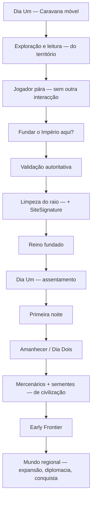
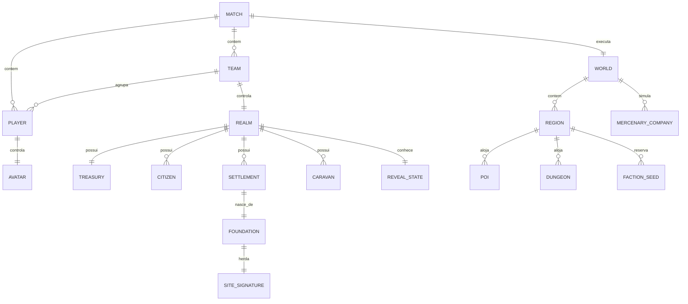
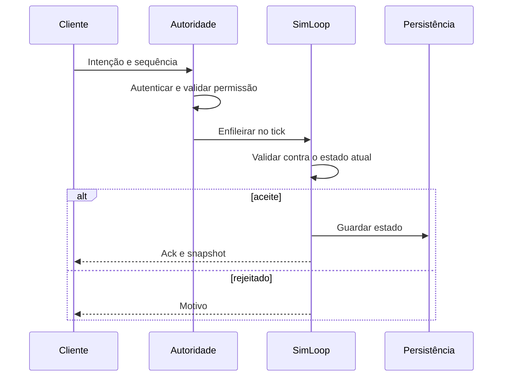

# Empire — Documento Mestre de Design: Dia Um, Fundação Territorial, Despertar do Mundo e Solo/Coop/PvP

> **Adaptação de 05/10/2026.** Este documento conserva a especificação completa fornecida, incorpora as respostas guardadas e aplica a preferência pelo relatório pedida pelo dono. A visão é canónica; a execução é faseada. A baseline verificada é o PR #84 na `main`. A migração Solo está neste diff; Coop, PvP, servidor dedicado, clima completo e despertar social continuam pendentes. A matriz de respostas está em [PANEL-RECONCILIATION.md](PANEL-RECONCILIATION.md).

## Estado de execução e regra de leitura

| Camada | Fonte e regra |
|---|---|
| Visão e conflitos de design | Este relatório e ADR 0066–0069; o pedido atual dá preferência ao relatório |
| Decisões anteriores compatíveis | `docs/QUESTIONS.md`, respostas do painel e ADRs históricas |
| Valores aprovados no contexto de 05/10 | Q-230–Q-233; aprovação só dos parâmetros e âmbito apresentados |
| Números novos sem resposta | CSV com `_proposed`; hipóteses reversíveis de protótipo |
| Funcionalidade existente | Código e testes, nunca apenas uma aprovação ou texto de design |
| Funcionalidade publicada | Merge, CI e smoke test do SHA publicado |

A prioridade pelo relatório altera fundação, grupo fundador, modos e despertar. Não apaga decisões de combate, sucessão, plataformas, exploração, inverno ou conteúdo que continuam compatíveis.

| Requisito | Estado desta adaptação | Limite concreto |
|---|---|---|
| Caravana móvel e três cidadãos sem ofício | Implementado no fluxo Solo | Grupo por IDs; não nasce profissão pronta |
| Local livre | Implementado como coordenada contínua validada | Conteúdo protegido e bordas podem excluir posições; a blueprint de expansão ainda é autorada |
| Prompt parado e sem interação prioritária | Implementado | Limiar e raio novos permanecem propostas em CSV |
| Fundação única, revalidada | Implementado na autoridade local Solo | Não equivale a sessão de rede ou anti-cheat de servidor |
| Remoção de objetos comuns | Implementado para flora procedural do footprint | Manifesto de intervalos porque a flora de cenário não tem IDs; entidades futuras exigem IDs |
| SiteSignature | Versão mínima persistente | Bioma/ecossistema/recursos/seed/posição; clima completo e adaptação arquitetónica por fazer |
| Saves | v11 e migração de v10 | Sedes antigas não se movem nem voltam a limpar; origem `LEGACY_INFERRED` |
| Q-230–Q-233 | Parâmetros compatíveis incorporados e aprovados | Fundação paga/fixa e promessa de rede territorial não são recuperadas |
| Coop/PvP | Especificados nas ADRs 0067/0068 | UN-29–31/RG-25 por fazer; P0 online não concluído |
| Despertar social e geração ambiental completa | Especificados na ADR 0069 | RG-24 por fazer; a baseline ainda materializa sociedades prontas ao explorar |

## Reconciliação de decisões que afetam a visão

| Tema/pergunta | Decisão incorporada | Preferência e consequência |
|---|---|---|
| Q-221, reserva | Conservar as oito moedas existentes | A pergunta continua sem resposta; não inventar moeda adicional ou pioneiro com ofício |
| Q-223, população/companhia | Três cidadãos fundadores sem ofício; companhia paga por sete | O grupo acompanha o monarca e pertence ao reino ao fundar; contratação por moeda aplica-se aos recém-chegados |
| Q-230, recrutamento | Corrida para a moeda e formação paga do construtor | Compatível para recrutamento externo; fundadores não são profissão gratuita |
| Q-231, fundação | Livre, gratuita; bancas e recintos relativos à sede escolhida | O relatório substitui lareira paga, duas bandeiras e coordenada obrigatória. As linhas de muralha aprovadas mantêm-se |
| Q-232, ritmo | Parâmetros do protótipo aceites no seu contexto | Não força fundação em dois minutos nem troca as metas de exploração do relatório por cronómetros obrigatórios |
| Q-233, maturidade/subsolo | Feitos, saúde/defesa, escavação e baús físicos | Compatível. Repetição em postos e Capital continua dependente da rede territorial |
| Q-172, inverno | Alternativas funcionais para recursos com planeamento | Geração não pode criar campanha insolúvel por estação ou seed |
| Q-174, povos autónomos | Obras, casas, tropas, tesouro e ecologia locais | Resultado do crescimento a partir do Dia Dois; não sociedade pronta no Dia Um |
| Q-175, pântano | Preservar Bruma como nome de trabalho já adotado | Não reintroduzir Paul ao regenerar documentação/saves |
| Q-176, dungeons | Variação e prémios 2×/3× persistentes | Contextuais, opcionais e sem reposição ao reentrar |
| Q-177, mercenários | Contratos pagos, soldo e lealdade | Acampamento estático é baseline; companhia móvel no novo mundo é RG-24 |
| Q-178, rei/viagem | Política de campanha anterior preservada após fundar | A mobilidade fundadora do relatório prevalece no Dia Um; viagem segura/conquista posterior não elimina a exploração inicial |
| Q-179, Podridão | Fissuras, um/dois lados, pressão inicial gradual | Compatível com ecologia territorial; ataque Oeste fixo da primeira noite é baseline a generalizar |
| Q-180/182, exploração | Conhecimento como legado e revelação local do subsolo | Não confundir conhecimento persistente com sociedade ativa ou recompensas reabastecidas |
| Q-195/197/206, monarcas | Três iniciais; encontrados desbloqueiam; perda canónica na campanha | Compatível; não cria coroas soberanas adicionais em Solo |
| Q-196/202, herdeiro | Preparação, custo, escolha entre desbloqueados e ciclo vulnerável | Mantém-se decisão própria; os detalhes ainda dependem dos tickets de sucessão, não da caravana |
| Q-200/201 | Reposição de seis flechas; só o Arqueiro imperial sangra | Preservar autoria específica e economia; não usar a proposta antiga de doze por moeda |
| Q-204, Coop | Um reino, economia partilhada; só P1 funda | Permissão fundadora não se delega automaticamente. Protótipo de dois comandos locais não conclui rede |
| Q-204, PvP | Dois reinos em extremos opostos, conquista/soberania total | Não limitar vitória à morte do outro avatar ou chamar ao modo implementado sem servidor/snapshots |
| Q-205, quarto imperador | Conceito definido pelo dono | Conteúdo futuro; não entra como quarto inicial incompleto nem é inventado para preencher a vaga |
| Q-081/112/147/191/194 | Adiamentos conservados | Não se implementam por existir relatório novo |


## Resumo executivo

Este documento consolida **numa única especificação mestre** o planeamento original de *Empire* sobre o primeiro dia, exploração, escolha territorial, geração do mundo, dungeons, ecologia, Podridão, segundo dia, mercenários e civilizações emergentes, acrescentando as decisões posteriores sobre **caravana móvel, fundação livre, coop, PvP, servidor autoritativo, reconexão, propriedade, economia partilhada e sincronização de rede**. Nesta adaptação, **o relatório fornecido tem preferência sobre respostas anteriores incompatíveis**, conforme o pedido de 05/10/2026. As respostas compatíveis completam-no; instruções explícitas futuras do dono podem voltar a alterar o design. Estado de implementação e intenção de design são registados separadamente.

A fantasia central passa a ser:

> **Empire começa antes do império. No Dia Um, o jogador atravessa um mundo natural ainda não organizado politicamente, seguido pela última carroça e pelos cidadãos que dependem dele. O reino só nasce quando o jogador escolhe onde criar raízes. A partir daí, o próprio local — bioma, clima, ecossistema, relevo, água, recursos, perigos e Podridão — passa a fazer parte da identidade do reino. No Dia Dois, o mundo social começa a nascer também.**

A alteração mais importante relativamente à ADR 0065 e ao PR #84 é que os **dois locais/estandartes pré-definidos deixam de determinar a fundação**. Na baseline do PR #84, a carroça e a população fundadora eram colocadas relativamente a um `core_x`, e a ADR 0065 implementada trabalha com uma escolha espacial limitada. A nova especificação exige uma caravana genuinamente móvel e uma fundação em qualquer posição que passe o validador territorial.  O PR #84 é, contudo, uma excelente baseline: já consolidou a fundação gratuita antes das compras, logística física da reserva, consequências da primeira noite, persistência, testes e compatibilidade de saves, e declara explicitamente que a rede futura ainda não foi implementada.

A abertura canónica fica assim:

**caravana chega → carroça e cidadãos sem ofício seguem o jogador → exploração → leitura do território → jogador pára → se não houver outra interacção naquele ponto aparece “Fundar o Império aqui?” → interagir → servidor valida → árvores/objectos comuns no raio inicial desaparecem → assinatura ambiental é calculada → carroça deixa de seguir e torna-se núcleo logístico → reino nasce → primeira noite → amanhecer → Dia Dois/despertar social → mercenários e civilizações começam do zero → fronteira → expansão regional.**

Em **coop**, há **um único reino**. Os dois jogadores pertencem à mesma sociedade, partilham população, território, progresso e economia, mas **apenas o Jogador Um, que criou a sala/mundo, pode escolher e confirmar onde o reino é fundado**. O segundo jogador pode explorar, avaliar e sugerir locais, mas não efectuar a fundação. Depois de fundado, a propriedade das estruturas e recursos é do reino, não de quem clicou.

Em **PvP competitivo**, há **dois reinos independentes**. Para uma partida de dois jogadores — única topologia definida neste documento — o Jogador Um nasce no extremo esquerdo e o Jogador Dois no extremo direito. Cada um possui a sua própria carroça, cidadãos, economia e autoridade de fundação. Cada um decide onde criar o seu reino e ambos procuram tornar-se a única potência soberana, conquistando os demais reinos relevantes do mapa.

O relatório fornecido situa a sua pesquisa de *Civilization VII* em **4 de Outubro de 2026**, evitando basear recomendações em sistemas que já foram substituídos. A versão pública mais recente encontrada é a **Update 1.5.0 de 15 de Setembro de 2026, seguida do hotfix de 30 de Setembro**; o grande redesenho *Test of Time*, de Maio de 2026, já tinha substituído os Legacy Paths por Triumphs, permitido manter a mesma civilização através das Ages e reformulado vitórias e progressão.  Portanto, **Legacy Paths não devem ser tratados como a referência actual de Civ VII**.

A recomendação não é copiar *Civilization VII*. É aproveitar cinco princípios particularmente fortes: **mundo gerado por camadas e depois validado; fases de jogo que activam sistemas diferentes; assentamentos com papéis distintos em vez de microgestão uniforme; entidades políticas pequenas que podem crescer; e progressão que mantém identidade enquanto permite adaptação**. A própria Firaxis documentou a tensão entre mapas procedurais mais orgânicos e mapas de menor variância mais adequados a multiplayer equilibrado, uma distinção extremamente útil para *Empire*.

Do ponto de vista técnico, a arquitectura actual de *Empire* já possui uma característica ideal para isto: `src/sim/` é deliberadamente lógica pura, o projecto concentra a simulação no `SimLoop`, usa RNG centralizado e trata `GameState` como fronteira persistente e determinística.   A rede deve ser construída **à volta dessa simulação**, não infiltrada dentro dela. Godot recomenda precisamente que estados críticos de multiplayer sejam decididos no servidor, tratando inputs do cliente como não confiáveis.

A consequência arquitectónica é clara: **cliente envia intenções; servidor valida e simula; servidor é a única verdade; cliente prevê apenas o movimento local e apresenta snapshots**. Fundação, dinheiro, propriedade, cidadãos, combate, IA, Podridão, NPCs e condições de vitória nunca são decididos unilateralmente pelo cliente.

## Documento mestre consolidado

A regra editorial deste documento é **preservar o primeiro planeamento em vez de o substituir**. A seguinte matriz demonstra onde cada uma das trinta secções originais permanece na especificação mestre.

| Secção original | Estado no documento mestre |
|---|---|
| Resumo executivo | Preservado e ampliado com modos de jogo e rede |
| Decisão principal de design | Preservada: o reino nasce depois da leitura do território |
| Relação com decisões aprovadas | Preservada; ADR 0065/PR #84 passam a baseline a migrar |
| Objectivos e limites | Preservados; inclui agora limites de coop/PvP |
| Nova fantasia de abertura | Preservada; “Dia da Escolha” passa a usar caravana móvel |
| Estados do mundo e calendário | Preservados e separados de estados da partida multiplayer |
| Estado inicial do mundo | Preservado, com cidadãos iniciais sem ofício |
| Geração do mapa | Preservada e expandida com perfil competitivo |
| Escolha do local | Preservada, mas “locais candidatos” tornam-se sugestões, não restrições |
| Adaptação da cidade | Preservada e formalizada em `SiteSignature` |
| Exploração do Dia Um | Preservada |
| Espaçamento/respiro | Preservado integralmente como hipótese de protótipo |
| POIs | Preservados |
| Dungeons | Preservadas |
| Despertar do Dia Dois | Preservado |
| Evolução de civilizações rivais | Preservada |
| Relação território ↔ civs futuras | Preservada |
| Podridão como ecologia | Preservada |
| Interface/apresentação | Preservada e expandida para coop/PvP |
| Fluxo temporal inicial | Preservado como alvo de playtest, não cronómetro obrigatório |
| Contraste com Civilization VII | Refeito com a versão 2026 e matriz adoptar/adaptar |
| Contraste com Kingdom/Manor Lords | Preservado como princípio de identidade |
| Modelo técnico futuro | Expandido para modelo de dados e rede |
| Critérios de aceitação | Preservados e ampliados |
| Métricas de playtest | Preservadas |
| Fases de implementação | Substituídas por backlog P0/P1/P2 compatível |
| Variáveis em aberto | Preservadas e actualizadas |
| Riscos e soluções | Preservados e ampliados |
| ADR sugerida | Dividida em ADRs menores e migráveis |
| Síntese final | Incorporada na visão canónica deste documento |

**Regra de precedência entre versões.** Alguns elementos do documento original entraram entretanto em conflito com decisões mais recentes. Não devem coexistir silenciosamente:

| Tema | Estado anterior | Regra canónica agora |
|---|---|---|
| Local da fundação | dois estandartes/alguns candidatos | qualquer ponto territorialmente válido |
| Carroça | colocada relativamente ao núcleo | segue o fundador até ao compromisso da fundação |
| População fundadora | trabalhador/pioneiro ou papéis parcialmente definidos | cidadãos iniciais começam **sem função/ofício** |
| Companhia inicial | versões anteriores tinham companhia | não há companhia mercenária gratuita inicial; mercenários são sistema posterior |
| Vegetação na fundação | parte do mundo podia permanecer | objectos comuns no raio inicial são removidos deterministicamente |
| Identidade do reino | consequência espacial limitada | assinatura integral de bioma + clima + ecossistema + relevo |
| Fundação coop | inexistente | exclusiva do criador da sala/mundo |
| Fundação PvP | inexistente | independente para cada reino, a partir de extremos opostos |
| Autoridade | essencialmente local/singleplayer | servidor é autoridade do estado canónico |

Isto também é compatível com parte do trabalho mais recente: RG-22 já registava a intenção de colocar “pessoas antes de moeda”, evitar profissão gratuita escondida, preservar reservas físicas e adiar a rede.

**Estados de mundo canónicos:**

| Estado | Significado |
|---|---|
| `PRE_FOUNDATION` | exploração; sem sociedades organizadas activas |
| `FOUNDATION_COMMITTED` | transacção de fundação aceite e irreversível |
| `SETTLEMENT_DAY_ONE` | novo reino trabalha ainda no Dia Um |
| `FIRST_SETTLEMENT_NIGHT` | primeira consequência nocturna territorial |
| `WORLD_AWAKENING` | amanhecer que activa a camada social |
| `EARLY_FRONTIER` | mercenários, grupos fundadores e rotas em crescimento |
| `REGIONAL_WORLD` | diplomacia, conquista, comércio, povoamentos maduros e dungeons profundas |

O **tempo visual** e o **calendário civilizacional** permanecem conceitos diferentes. Céu, clima, cansaço e comportamento animal podem mudar antes da fundação; o avanço social não é activado simplesmente porque passaram minutos. Em Solo e Coop, o Dia Dois civilizacional exige `foundation_committed`, resolução da primeira noite e chegada do amanhecer seguinte.

No PvP, deve existir adicionalmente um `match_phase`. Cada reino conserva a sua própria progressão de fundação, mas o mundo social não pode tornar-se uma vantagem arbitrária para quem fundou alguns minutos primeiro. A recomendação é activar `WORLD_AWAKENING` no **primeiro amanhecer comum depois de ambos os reinos estarem fundados**. Para impedir que um jogador bloqueie eternamente o sistema, existe conceptualmente um `competitive_awakening_deadline`, mas o valor exacto fica **não especificado**. Atingido esse limite, atrasar a fundação deixa de congelar o mundo e passa a ser risco estratégico.



**Caravana do Dia Um.** A carroça e a população inicial são entidades físicas. Enquanto `foundation.state == MOBILE`, seguem o monarca fundador. Em Solo, seguem o jogador. Em Coop, seguem o **Jogador Um/criador**, já que ele é a autoridade territorial. Em PvP, cada caravana segue o respectivo monarca.

Os cidadãos começam com:

```text
craft = UNASSIGNED
job = NONE
realm_id = provisional_realm
caravan_id = initial_caravan
```

Isto não significa que sejam figurantes. Caminham, cansam-se, podem ficar para trás, reagem a perigo e pertencem ao grupo; simplesmente **a sociedade ainda não lhes atribuiu uma função produtiva**. A função é consequência da fundação e da economia posterior.

A formação deve evitar que todos ocupem exactamente a mesma posição. O movimento pode usar slots relativos à carroça/monarca, `catch_up_speed` e path recovery, mas parâmetros concretos de distância e aceleração devem permanecer em dados, seguindo a regra existente de *Empire* de não codificar balanceamento em scripts.

**Quando surge a fundação.** A condição funcional é:

```text
world.phase == PRE_FOUNDATION
AND player_is_stopped == true
AND no_higher_priority_interactable == true
AND player_has_foundation_authority == true
AND site_validator(position) == VALID
```

“Parado” deve usar um limiar técnico, não igualdade exacta de `velocity == 0`. O atraso antes de mostrar a pergunta deve ser configurável e ainda está **não especificado**.

O prompt é simples:

> **Fundar o Império aqui?**
> `[Interagir] Fundar`

Não aparece se houver uma pessoa, baú, porta de dungeon, item, altar ou outro interactivo prioritário sob o mesmo contexto. Quando o jogador volta a mover-se, o prompt desaparece.

Em coop, P2 não recebe um botão que parece poder funcionar. Pode receber uma leitura territorial e a acção **“Sugerir local”**, mas só P1 vê **“Fundar o nosso Império aqui?”**.

A confirmação não é decidida localmente. O cliente envia um `FoundationIntent`; o servidor volta a verificar o local porque o mundo pode ter mudado entre o aparecimento do prompt e o clique.

**Fundação como transacção atómica:**

```text
1. receber FoundationIntent
2. autenticar PlayerId
3. verificar permissão FOUND_REALM
4. verificar que o reino ainda não foi fundado
5. revalidar posição/terreno/conflitos
6. calcular SiteSignature
7. calcular footprint e clear_manifest
8. bloquear a transacção territorial
9. remover entidades CLEARABLE
10. criar a sede e território inicial
11. ancorar a carroça ao reino
12. atribuir cidadãos ao RealmId
13. aplicar adaptação ambiental
14. gravar foundation_tick e posição
15. emitir RealmFounded
16. persistir estado
17. replicar resultado aos clientes
```

O clique tem, portanto, **semântica exactamente uma vez**. Repetir o pacote, ter lag ou clicar duas vezes nunca cria dois reinos.

**Limpeza do raio inicial.** O requisito do designer — árvores ou objectos semelhantes desaparecem quando a base é estabelecida — deve ser formalizado, para não destruir conteúdo estrutural acidentalmente.

| Classe | Na fundação |
|---|---|
| árvore, arbusto, vegetação densa decorativa | desaparece |
| pedras pequenas/entulho removível | desaparece |
| decoração ambiental comum | desaparece |
| objecto authored marcado `foundation_clearable` | desaparece |
| animal em movimento | afasta-se/relocaliza-se, não é convertido em recurso gratuito |
| recurso crítico/raríssimo | normalmente torna o local inválido |
| entrada de dungeon | protegida; torna o footprint inválido |
| marco natural importante | protegido |
| água, penhasco, passagem estrutural | nunca removidos |
| âncora essencial da Podridão | protegida ou tratada por regra específica |

O resultado exacto é registado em `clear_manifest`, preferencialmente pelos IDs das entidades removidas. Assim, save/load e reconexão não podem “ressuscitar” árvores já limpas.

Por defeito, essa limpeza **não deve conceder automaticamente madeira ou dinheiro**. Caso contrário, encontrar a floresta mais densa possível torna-se uma estratégia de exploração de recursos gratuita e deturpa a escolha territorial. Recuperar material durante a limpeza pode ser uma mecânica futura explícita.

**A assinatura ambiental do reino**, `SiteSignature`, deve ser calculada no instante da fundação e permanecer parte do save:

```text
dominant_biome
secondary_biomes
climate_band
temperature_profile
humidity_profile
water_access
fertility
terrain_form
slope_profile
forest_density
stone_access
food_profile
wildlife_profile
ecosystem_risk
rot_pressure
visibility
route_access
dungeon_affinity
future_trade_potential
architectural_profile
```

Não é uma colecção de bónus arbitrários. É uma explicação comum para várias consequências:

**ambiente → materiais → aparência → alimentação → trabalho → ameaças → expansão → quem se interessa pela região.**

Os seis perfis originais permanecem exemplos válidos:

| Perfil | Força | Limitação | Consequências prováveis |
|---|---|---|---|
| vale fluvial | comida, água, crescimento | cheias/exposição | moinhos, pontes, agricultura |
| borda da floresta | madeira, caça | predadores/fogo/visibilidade | serraria, armadilhas, paliçadas |
| passagem montanhosa | pedra, minério, defesa | frio/logística/alimento | pedreira, portão, vigia |
| lago/costa | pesca e rotas futuras | tempestades/exposição | cais, pesca, comércio |
| pântano | ervas, recursos especiais | mobilidade/doença | passadiços, drenagem, medicina |
| altura/ruínas/campo | visão, história, posição | exposição/escassez | torre, arquivo, arqueologia |

A Clareira continua a existir como **linguagem visual e estágio mais primitivo da sede**, mas deixa de ser uma coordenada obrigatória pré-escrita. O reino cria a sua clareira **onde o jogador o fundar**.

**Geração do mundo.** O mapa continua a ser gerado por camadas:

```text
seed
→ macroforma
→ relevo/água/passagens
→ clima
→ biomas/ecossistemas
→ recursos potenciais
→ landmarks
→ ruínas/dungeons
→ regiões de fundação
→ POIs
→ locais sociais adormecidos
→ validação
→ manifesto persistente
```

A pesquisa em PCG reforça esta escolha: a literatura de *search-based procedural content generation* enquadra a geração como um problema em que conteúdo pode ser avaliado por funções de qualidade/fitness, em vez de simplesmente aceitar qualquer resultado aleatório.  A experiência documentada pela Firaxis em Civ VII aponta na mesma direcção: a geração Voronoi cria estrutura para aplicar regras de gameplay por cima de formas orgânicas, e a Firaxis manteve alternativas de menor variância para situações em que equilíbrio multiplayer é mais importante.

Isto conduz a dois perfis:

| Perfil | Prioridade |
|---|---|
| Solo/Coop | descoberta, identidade, contraste, maior variância controlada |
| PvP | oportunidade comparável nos extremos, menor variância competitiva |

PvP **não precisa de ser visualmente espelhado**. Precisa de ser justo em potencial. O validador compara as janelas de início Oeste/Este em métricas como `food`, `water`, `wood`, `stone`, `mobility`, `defense`, `hazard`, `resource_diversity`, `dungeon_opportunity` e `rot_risk`. As tolerâncias ficam em dados e ainda não estão definidas.

A Update 1.5.0 de Civ VII também reforçou a importância de garantias na geração: o hotfix de 30 de Setembro passou a garantir categorias de recursos necessárias a determinados objectivos, precisamente para evitar partidas frustrantes por ausência aleatória.  Para *Empire*, isso confirma o princípio já presente no documento original: **RNG pode mudar como o jogador satisfaz uma necessidade; não deve tornar a campanha impossível porque um recurso fundamental não nasceu.**

Os requisitos originais de sobrevivência permanecem:

- pelo menos três alternativas de fundação estrategicamente defensáveis na região explorável;
- alimento ou água acessível;
- possibilidade real de madeira;
- possibilidade real de pedra/defesa;
- pelo menos uma oportunidade de rota/economia futura;
- nenhuma posição com todos os benefícios;
- recursos raros revelados por sinais;
- nenhum recurso único cuja ausência torne a campanha irresolúvel.

“Alternativas de fundação” não significa agora três círculos autorizados. São **zonas que o gerador garante que sejam interessantes**, mas o jogador continua livre de parar e fundar noutro local válido.

O documento original também definia a unidade espacial `U`, equivalente aproximadamente ao tempo para atravessar um ecrã a velocidade normal. Os valores continuam válidos **exclusivamente como hipóteses de protótipo**:

| Conteúdo | Espaçamento inicial proposto |
|---|---:|
| detalhe ambiental | `0,25–0,75 U` |
| recurso/pista pequena | `1–2 U` |
| encontro leve/toca | `2–4 U` |
| ruína menor | `3–5 U` |
| micro-dungeons | `4–6 U` entre si |
| dungeon regional | `6–10 U` |
| landmark maior | `8–16 U` |
| primeiro acampamento mercenário | `8–14 U` do reino |
| primeiro núcleo rival | `10–18 U` |
| rival regional importante | `16–30 U` ou outra região |

Não são valores finais. Tamanho do ecrã, velocidade real, escala do mundo e mapa final permanecem não especificados.

A hierarquia original de densidade também deve ser preservada:

**ambientação → interesse local → destino**.

O mundo não deve transformar cada ecrã num “destino”. Após uma dungeon importante deve existir espaço de recuperação; dois combates fortes não devem ser colados; dois landmarks dominantes não devem competir pelo mesmo enquadramento; o primeiro rival não deve ser visível a partir da sede; um acampamento mercenário não deve bloquear a única rota de regresso.

A investigação sobre exploração espacial também dá suporte a esta abordagem: estudos de level design identificam como gatilhos de curiosidade a tentativa de alcançar extremos, resolver obstruções visuais, investigar objectos fora do lugar e compreender ligações espaciais; conteúdo procedural pode ser optimizado deliberadamente para provocar diferentes padrões de exploração.  Um estudo posterior encontrou ainda que uma tarefa secundária simples de recolha podia **reduzir** a exploração espacial, uma advertência especialmente relevante para *Empire*: cobrir o Dia Um com moedas e tarefas auxiliares pode afastar o jogador da leitura do território que se pretende ensinar.

**POIs e dungeons** permanecem dependentes do contexto, não espalhados uniformemente. As categorias originais continuam: marcos naturais, ruínas/vestígios, dungeons, pontos ecológicos, pontos sociais após o despertar e pontos estratégicos posteriores.

A hierarquia de dungeon permanece:

| Tipo | Escala proposta | Função |
|---|---:|---|
| micro-dungeon | 30–120 s | curiosidade do Dia Um |
| regional | 3–8 min | expedição inicial |
| profunda | 8–20 min | progressão do reino |
| campanha | posterior | arco de maior escala |

A primeira micro-dungeon deve ser opcional, curta e informativa. A entrada de uma dungeon maior pode ser encontrada no Dia Um sem o jogador ainda possuir ferramentas ou condições para a resolver.

**Orçamento recomendado da primeira região:** alternativas claras de fundação, um ponto de observação, um landmark distante, uma pequena ruína, uma micro-dungeon, vida selvagem, pelo menos um predador/ameaça, rota alternativa, clima perceptível, sinal da Podridão, os sobreviventes vulneráveis previstos no design original e uma ligação para conteúdo futuro.

Os **dois sobreviventes vulneráveis** do documento inicial podem continuar presentes, porque são indivíduos sem sociedade organizada. Não formam vila, mercado ou facção. São excepção narrativa compatível com o princípio “mundo sem sociedades organizadas”.

**Dia Dois — o despertar do mundo.** A transição deve aparecer primeiro no espaço e só depois na interface: fumo distante, sons de trabalho, pegadas novas, luz em movimento, grupos no horizonte e rumores no mapa.

A ordem permanece:

**fundação → primeira noite → amanhecer → sinais → primeiro mercenário → primeira semente civilizacional → encontros → crescimento.**

Uma civilização NPC não nasce como cidade pronta. Nasce aproximadamente com:

```text
faction_id
origin_type
leader_id
origin_region
preferred_biomes
required_resources
starting_population
current_stage
current_location
food_reserve
construction_progress
military_capacity
relations
known_dungeons
rot_exposure
growth_plan
```

E evolui:

**Semente → Acampamento → Povoado nascente → Vila → Centro regional.**

Uma semente pode representar refugiados, pescadores, um clã mineiro, artesãos ligados a ruínas, uma ordem religiosa, guerreiros nómadas, comunidade florestal, sobreviventes conhecedores da Podridão ou comerciantes que tentam reabrir uma rota.

A simulação deve ser de **nível variável**: entidades próximas materializadas e simuladas frequentemente; regiões conhecidas mas distantes actualizadas por intervalos; regiões remotas actualizadas abstractamente. O resultado, no entanto, deve permanecer causal e persistente: ao aproximar-se, o jogador deve encontrar uma materialização compatível com o histórico abstracto anterior.

O `WorldPlan` herdado já trabalha com mundo contínuo, trilhos, limiares, terras e extremos, mas organiza-os em relação a uma região de casa central e alterna os outros povos pelos lados. Para PvP com dois inícios soberanos opostos, essa pressuposição de “uma casa central” terá de ser generalizada.

Os mercenários também não nascem como bancas. A primeira companhia deve poder **viajar, acampar, aceitar contratos de NPCs e mudar de localização**. Especialidades originais — arqueiros itinerantes, guardas de estrada, batedores, caçadores de monstros, mineiros armados, curandeiros, guardas de caravanas — permanecem adequadas.

A **Podridão** continua a ser ecologia antes de ser “wave”: altera animais, água, iluminação, rotas, recursos, dungeons, comportamento nocturno e decisões das civilizações. A primeira noite deve mostrar que a escolha territorial teve consequências sem simplesmente replicar uma onda de *Kingdom*.

O ritmo-alvo original dos primeiros minutos permanece como **instrumento de playtest, nunca como guião obrigatório**:

| Tempo-alvo | Experiência |
|---:|---|
| 0:00–0:20 | controlo imediato |
| 0:20–1:30 | primeira leitura ambiental |
| 1:30–3:00 | primeiro desvio voluntário |
| 3:00–5:00 | descoberta significativa |
| 5:00–8:00 | comparação de rotas/locais |
| 8:00–12:00 | ruína, micro-dungeon ou Podridão |
| 12:00–16:00 | decisão/regresso/comparação |
| 16:00–20:00 | fundação típica |
| 20:00–24:00 | carroça/núcleo/trabalho |
| 24:00–30:00 | preparação para a noite |

Um jogador pode fundar aos dois minutos ou muito depois. Esses valores medem se a experiência desejada está a acontecer, não bloqueiam a interacção.

## Civilization VII: mecânicas a adoptar, adaptar, rejeitar ou adiar

**Âmbito bibliográfico:** a comparação seguinte preserva a pesquisa do relatório fornecido; as datas e notas de versão de Civ VII não foram integralmente revalidadas nesta alteração. São referências de inspiração, não dependências do jogo nem prova do estado de Empire.

A análise deve partir da versão documentada pela fonte, não apenas da versão de lançamento. O *Test of Time Update*, de 19 de Maio de 2026, tornou possível jogar com uma civilização ao longo de todas as Ages, manteve a opção de mudar de civilização, introduziu Syncretism/Affirmation, redesenhou o sistema de vitória e **substituiu completamente Legacy Paths por Triumphs opcionais**.  Depois, a Update 1.5.0 de Setembro acrescentou novos mapas e novas alterações de geração, recursos, diplomacia e qualidade de vida.

A matriz recomendada é:

| Mecânica/princípio de Civ VII | Decisão | Razão para Empire | Implementação sugerida |
|---|---|---|---|
| **Ages activam sistemas e escopo diferentes**  | **Adaptar** | excelente paralelo com Dia Um → Dia Dois → Fronteira → Regional | usar `WorldPhase`, não eras históricas |
| **Transições reduzem snowball e permitem mudança de ritmo**  | **Adaptar** | Empire precisa de fases claramente diferentes sem reiniciar o reino | cada fase abre camadas do mundo e novos tipos de interacção |
| **Time-Tested Civs: identidade contínua através das Ages**  | **Adaptar fortemente** | encaixa na ideia de o reino manter identidade apesar de evoluir | `SiteSignature` + história do reino persistem por todos os estágios |
| **Syncretism/Affirmation**  | **Adaptar mais tarde** | pode representar absorver práticas de povos conquistados ou reforçar identidade local | escolhas culturais pós-contacto, não troca arbitrária de “civilização” |
| **Triumphs, objectivos opcionais em vez de Legacy Paths**  | **Adaptar** | bons para incentivar histórias sem impor checklist | “feitos” contextuais do reino; alguns já existem conceptualmente em Empire |
| **Legacy Paths** | **Não adoptar** | além de demasiado prescritivos para Empire, já não são o modelo actual de Civ VII | nenhum sistema equivalente obrigatório |
| **Cidades e Povos com responsabilidades diferentes**  | **Adaptar fortemente** | reduz microgestão à medida que Empire cresce | Capital/sede com decisões profundas; postos, vassalos e núcleos secundários mais autónomos |
| **Especializações de Povos**  | **Adaptar** | combina com bioma e economia territorial | aldeia mineira, agrícola, defensiva, comercial etc., condicionada pelo ambiente |
| **Settlement Limit como soft cap**  | **Adiar** | pode conter expansão, mas Empire já tem outros sistemas territoriais | futura “capacidade administrativa/logística”, não copiar o número de cidades |
| **Happiness global/local**  | **Não adoptar literalmente** | duplicaria moral/ânimo e tornaria pessoas físicas em yield abstracto | aproveitar apenas o princípio de sobre-expansão ter custo social |
| **Crescimento que substitui tarefas repetitivas de Builders**  | **Não adoptar literalmente** | trabalho físico de pessoas é parte da identidade de Empire | automatizar só quando escala exigir; preservar agentes no mundo |
| **Estruturas persistentes + overbuilding/evolução**  | **Adaptar** | corresponde à escada Clareira → Fortaleza → Capital | cada estágio reaproveita história/posição, sem apagar o passado |
| **Independent Powers**  | **Adaptar fortemente** | referência directa para facções menores sem serem impérios equivalentes | sementes civilizacionais, grupos independentes e companhias mercenárias |
| **Influence como camada de diplomacia**  | **Adiar** | diplomacia é posterior ao Dia Dois | aproveitar futuramente Favor/reputação existente, evitando nova moeda global desnecessária |
| **Commanders que concentram progressão e coordenam exércitos**  | **Adaptar** | reduz micro de grandes forças e cria personagens persistentes | comandantes/companhias/retinue com aura e ordens; não empilhar fisicamente tropas num único token |
| **Geração Voronoi estruturada por regras**  | **Adoptar o princípio** | exactamente o que o worldgen por regiões precisa | gerar macroestrutura primeiro e validar gameplay depois |
| **Mapas orgânicos SP vs menor variância MP**  | **Adoptar** | separa descoberta de justiça competitiva | `WorldGenProfile.EXPLORATION` e `COMPETITIVE` |
| **Recursos essenciais garantidos pelo gerador** — reforçado no hotfix 1.5.0  | **Adoptar** | evita seeds perdidas por RNG | validator rejeita mapas sem rotas suficientes para necessidades básicas |
| **Vitórias Cultural/Económica/Científica/Militar** reformuladas no Test of Time  | **Não adoptar no PvP base** | o designer definiu conquista como objectivo competitivo | vitória PvP inicial = soberania total/conquista |
| **Commerce Screen centralizado** introduzido no Test of Time  | **Adaptar na UX, depois** | grandes reinos precisam de visão agregada | ecrã de logística/rotas, sem substituir interacções físicas locais |
| **Crossplay/hotseat/plataformas** | **Adiar** | não define a fantasia nem a arquitectura de domínio | decidir depois de fechar transportes e plataformas alvo |

A conclusão mais importante da comparação é que *Empire* deve aproveitar **a arquitectura das decisões**, não os sistemas superficiais.

Civ VII distingue **centros principais e assentamentos de suporte** para evitar que cada nova cidade replique toda a carga de microgestão.  Em *Empire*, a equivalência não deve ser “copiar Towns”; deve ser garantir que uma futura expansão territorial não transforme o jogador em gestor de cinquenta filas de produção. O núcleo real mantém profundidade; povoações secundárias recebem especialização, prioridades e autonomia.

Do mesmo modo, Commanders resolvem em Civ VII um problema de coordenação de unidades e concentram progressão militar em líderes persistentes.  Em *Empire*, o princípio é útil para exércitos e mercenários, mas o jogo deve conservar a percepção física de pessoas que marcham, lutam, chegam e regressam.

Finalmente, o maior alerta oferecido pelo próprio desenvolvimento de Civ VII é de **excesso de estrutura obrigatória**. O Test of Time substituiu Legacy Paths por objectivos opcionais e restaurou a possibilidade de preservar uma única civilização ao longo da campanha.  Para *Empire*, isso reforça uma direcção: bioma, clima e história devem produzir oportunidades e consequências, não colocar o jogador num trilho rígido que diga que “floresta = civilização florestal para sempre”.

## Solo, Coop e PvP: regras, fundação, propriedade e UX

Os modos devem partilhar a mesma simulação e diferir sobretudo em **topologia de propriedade, permissões, geração inicial e condição de vitória**.

| Aspecto | Solo | Coop | PvP competitivo |
|---|---|---|---|
| jogadores humanos | 1 | pelo menos 2 no conceito; limite exacto não definido | regra actual especificada para 2 |
| reinos humanos | 1 | 1 | 2 |
| carroça inicial | 1 | 1 partilhada | 1 por jogador |
| cidadãos iniciais | do reino | partilhados | separados por reino |
| quem escolhe fundação | jogador | **criador da sala/mundo** | cada jogador para o seu reino |
| spawn | região inicial | equipa junta | extremos opostos Oeste/Este |
| economia | reino | partilhada | separada |
| fog/reveal | reino | partilhado | separado |
| propriedade de edifícios | reino | reino | respectivo reino |
| progresso territorial | individual | partilhado | independente |
| PvP interno | n/a | não | sim, após fase de fundação |
| objectivo | campanha | proteger/expandir juntos | conquistar para se tornar único soberano |
| vitória/derrota | campanha | partilhada | por reino |

**Spawn e fundação:**

| Modo | Spawn | Seguimento da caravana | Regra de fundação |
|---|---|---|---|
| Solo | entrada/região inicial | segue o jogador | livre em qualquer local válido |
| Coop | P1 e P2 na mesma expedição | segue P1 | só P1 pode confirmar |
| PvP P1 | extremo esquerdo | segue P1 | P1 escolhe livremente |
| PvP P2 | extremo direito | segue P2 | P2 escolhe livremente |

**Ownership e economia:**

| Entidade | Solo | Coop | PvP |
|---|---|---|---|
| `PlayerAvatar` | Player | cada jogador controla o seu | cada jogador controla o seu |
| `Realm` | Team/Player | Team partilhada | Team A / Team B |
| `Treasury` | Realm | **uma tesouraria comum** | uma por reino |
| cidadãos | Realm | partilhados | respectivos reinos |
| edifícios | Realm | partilhados | respectivos reinos |
| sede | Realm | partilhada | uma por reino |
| recursos físicos transportados | entidade + Realm | qualquer aliado pode transportar | não partilhados |
| conhecimento de mapa | Realm | partilhado | privado |
| tecnologia/progresso | Realm | partilhado | independente |
| conquistas | Realm | partilhadas | independentes |

A distinção entre **Player ownership** e **Realm ownership** é crucial. P1 pode construir uma muralha em coop, mas a muralha não “é de P1”. Pertence ao reino partilhado. Da mesma forma, P2 pode gastar uma moeda física que recolheu, mas o efeito económico é uma transacção no estado do reino.

Em coop, duas tentativas simultâneas de gastar a última moeda não podem ambas ser aceites:

```text
saldo = 1

P1 -> SpendIntent(1)
P2 -> SpendIntent(1)

servidor:
    ordena
    valida P1 -> aceita -> saldo 0
    revalida P2 -> rejeita
```

Não existe saldo local autoritativo.

**UX Solo:**

```text
andar
→ carroça/cidadãos seguem
→ parar
→ procurar interacção prioritária
→ se nenhuma: avaliar terreno
→ prompt de fundação
→ Interagir
→ preview final/feedback imediato
→ servidor/local authority valida
→ fundar
```

**UX Coop:** P1 e P2 podem afastar-se para explorar. A caravana permanece ligada à expedição de P1. P2 pode inspeccionar locais e colocar um `FoundationSuggestion` visível a P1. A sugestão não é uma votação obrigatória; o design solicitado é inequivocamente **P1 decide**.

Quando P1 está parado num local válido:

> **Fundar o nosso Império aqui?**

P2 vê, quando adequado:

> **Local adequado — sugerir ao fundador**

Depois da fundação, a permissão especial `FOUND_REALM` deixa de ter relevância. Gestão, protecção e expansão são actividade cooperativa.

A desconexão do criador precisa de respeitar essa regra. **Antes da fundação, não recomendo transferência automática da autoridade para P2**, porque isso contradiz a decisão de que o criador define onde o reino será instalado. O servidor conserva a sessão e reserva o slot de P1; P2 pode continuar a explorar, mas não fundar. Uma futura permissão explícita de delegação poderá existir, mas não faz parte desta especificação.

Depois da fundação, a queda de P1 não deve congelar o reino. Como toda a propriedade é `Realm` e a autoridade é do servidor, P2 continua a jogar e P1 pode regressar ao mesmo `PlayerSlot`.

**UX PvP:** a geração começa por seleccionar duas janelas territoriais opostas.

```text
OESTE                                                   ESTE

[P1 + carroça] -> -> -> mundo a conquistar <- <- <- [carroça + P2]
      |                                                    |
      +-- Reino A, onde P1 quiser      Reino B, onde P2 --+
```

A exigência “completamente opostos” deve ser estrutural, não apenas uma distância aleatória elevada:

```text
spawn_anchor[P1].side = WEST
spawn_anchor[P2].side = EAST
```

Se o mundo horizontal existente continuar a ser a base, os spawns ficam junto das duas extremidades válidas, com buffers suficientes para que os footprints não intersectem limites do mapa.

O gerador competitivo não deve sortear um mapa Solo e simplesmente teleportar alguém para cada lado. Deve validar ambos os *home windows*. A simetria é de **oportunidade**, não de decoração.

Durante a abertura PvP, recomendo:

```text
MATCH_PHASE = FOUNDING
direct_pvp_damage = false
enemy_caravan_theft = false
enemy_realm_capture = false
```

Assim, a decisão fundadora não é anulada por uma corrida em que um jogador deixa de explorar e atravessa o mapa apenas para matar a carroça rival.

A fase muda quando ambos fundaram:

```text
both_realms.founded
→ MATCH_PHASE = CONQUEST
→ direct_pvp = true
```

Existe, contudo, um problema de *griefing*: alguém pode recusar-se a fundar. Por isso, a especificação deve conter uma `founding_grace`, com duração ainda **não especificada**. Depois desse limite, a protecção pré-fundação termina; o jogo não escolhe automaticamente onde o jogador funda. Atrasar indefinidamente torna-se uma estratégia perigosa, não um bloqueio da sessão.

O objectivo competitivo deve ser modelado como **soberania total**, não simplesmente “maior pontuação”. Com dois humanos:

```text
ConquestVictory =
    todos os Realm soberanos marcados victory_relevant,
    excepto o vencedor,
    foram derrotados ou absorvidos
```

Isso inclui o rival humano e, caso o design marque futuros centros NPC como soberanias necessárias à vitória, também esses centros. Mercenários e grupos sem soberania não contam.

A mecânica concreta para capturar uma sede ainda precisa de design. Para P0, a regra simples pode ser:

```text
enemy_seat conquered
→ enemy_realm sovereignty = LOST
```

Mais tarde, muralhas, distritos, sucessão, fuga da coroa ou vassalização podem tornar a conquista mais rica. Não se deve bloquear toda a arquitectura de PvP até esses sistemas existirem.

**Dia Dois em PvP.** O desenho mais consistente é:

```text
cada Realm:
  regista a própria fundação e primeira noite

World:
  WORLD_AWAKENING quando ambos estão prontos
  OU quando o prazo competitivo de despertar termina
```

Isto preserva o valor da fundação sem permitir que um jogador detenha os NPCs do mundo indefinidamente.

## Arquitectura técnica, modelo de dados e sincronização de rede

O repositório actual oferece uma base extraordinariamente adequada a servidor autoritativo. O contrato do projecto define Godot 4.7.2/GDScript, mantém `src/sim/` independente de `Node`/`Node2D`, exige testes para a API pública da simulação e centraliza a aleatoriedade no `RngService`.  O `project.godot` já declara `EventBus`, `ClockService`, `RngService`, `Registry`, `SaveService` e `SimLoop` como serviços centrais, e o projecto opera com uma cadência física de 30 Hz.

Mais importante, `GameState` já se declara explicitamente como **estado autoritativo, guardado no save e determinístico**, mantendo os objectos de cena fora dessa fronteira.  A rede deve preservar exactamente esta separação.

A arquitectura proposta é:

```text
Cliente
  apresentação
  input
  prediction local limitada
       |
       | Intent + sequence
       v
NetworkSession
       |
Auth / permissions / rate limit
       |
CommandBuffer
       |
ServerAuthority
       |
SimLoop
       |
src/sim/ puro
       |
GameState / systems
       |
events + snapshots
       v
SnapshotBuilder
       |
       +----> Cliente: reconcile/interpolate
       |
Persistent Match State / Save
```

Godot 4.7 documenta explicitamente que aplicações competitivas ou persistentes devem considerar os inputs do cliente não confiáveis, manter decisões críticas no servidor, validar argumentos e não confiar em posições, timers ou recursos reportados pelo cliente.

Isto significa que o cliente **nunca** envia:

```text
"fundei o reino em X"
"tenho 18 moedas"
"matei este inimigo"
"a minha posição é X"
"ganhei a partida"
```

Envia:

```text
"pretendo fundar em X"
"pretendo gastar 3"
"ataquei nesta direcção"
"estou a pressionar esquerda"
```

O servidor decide o resultado.

**Modelo de dados canónico:**

| Estrutura | Campos principais |
|---|---|
| `MatchState` | `match_id`, `mode`, `seed`, `worldgen_version`, `ruleset_hash`, `server_tick`, `match_phase` |
| `PlayerSlot` | `player_id`, `team_id`, `realm_id`, `avatar_id`, `connection_state`, `last_acked_seq` |
| `TeamState` | `team_id`, membros, permissões |
| `RealmState` | `realm_id`, `foundation`, `treasury`, `seat_id`, cidadãos, conquistas, reveal |
| `CaravanState` | `caravan_id`, `realm_id`, estado móvel/ancorado, carga |
| `FoundationState` | estado, fundador autorizado, posição, `site_signature`, `clear_manifest`, tick |
| `WorldState` | seed, tempo visual, fase social, regiões, POIs, facções dormentes/activas |
| `RegionState` | bioma, clima, relevo, ecossistema, recursos, perigo, ligações |
| `FactionSeed` | origem, preferências, recursos, população, plano e localização |
| `MercenaryCompany` | companhia, especialidade, contrato, posição, relação |
| `Ownership` | `entity_id → realm_id/team_id` |
| `RevealState` | regiões/POIs conhecidos por Realm |
| `NetworkSnapshot` | tick, baseline, entidades/deltas, eventos críticos |



No Coop:

```text
P1 ─┐
    ├── Team A → Realm A → Treasury A
P2 ─┘
```

No PvP:

```text
P1 → Team A → Realm A → Treasury A

P2 → Team B → Realm B → Treasury B
```

**Permissões** devem ser explícitas, não derivadas de coisas frágeis como `peer_id == 1`:

```text
CONTROL_AVATAR
FOUND_REALM
SPEND_REALM_TREASURY
ASSIGN_CITIZEN
PLACE_BUILDING
COMMAND_REALM_UNIT
```

No coop pré-fundação:

```text
P1.FOUND_REALM = true
P2.FOUND_REALM = false
```

Depois da fundação, essa permissão deixa de ter utilidade de gameplay.

**Sincronização.** Não recomendo *deterministic lockstep* entre clientes. O determinismo de *Empire* continua extremamente valioso para worldgen, testes, persistência e replays, mas não é necessário confiar que física, timing e clientes em plataformas diferentes executem tudo bit a bit da mesma maneira.

As mensagens dividem-se em:

| Categoria | Exemplos | Política |
|---|---|---|
| input frequente | andar, correr, ataque | intenção; previsão local possível |
| transacção | fundar, gastar, atribuir cidadão | reliable, validada, idempotente |
| eventos críticos | morte, fundação, conquista | reliable |
| estado frequente | posição, velocidade, animação | snapshot/delta |
| estado lento | economia, faction stage, clima | delta a menor frequência |
| join/reconnect | mundo completo necessário | full snapshot |

Para o próprio jogador:

```text
input
→ prediction local
→ command_seq
→ servidor simula
→ ack + estado autoritativo
→ reconciliação
```

Para outros jogadores/NPCs:

```text
snapshot N
snapshot N+1
→ buffer
→ interpolação visual
```

Carroça, cidadãos, animais, inimigos e NPCs são simulados no servidor.

Cada comando deve transportar pelo menos:

```text
player_id
command_seq
client_tick_estimate
command_type
payload
```

E o servidor executa:

```text
autenticar
→ validar sessão
→ validar sequência
→ aplicar rate limit
→ verificar permissão
→ enfileirar
→ processar num tick conhecido
→ validar contra GameState actual
→ aceitar/rejeitar
→ gerar evento
```

Isto fornece também uma base de **anti-cheat**:

- cliente não decide inventário;
- cliente não decide dinheiro;
- cliente não decide cooldown;
- cliente não decide dano;
- cliente não decide propriedade;
- cliente não decide fundação;
- cliente não decide captura;
- cliente não pode enviar inputs acima da frequência aceite;
- sequências repetidas são ignoradas;
- payloads impossíveis são rejeitados e registados.

Estas práticas alinham-se directamente com a orientação de segurança da própria documentação Godot.

**Reconexão.** A sessão mantém um `PlayerSlot` desligado durante uma janela configurável. Ao regressar:

```text
auth/reconnect token
→ encontrar PlayerSlot
→ validar MatchId
→ full snapshot
→ restabelecer avatar_id / realm_id
→ devolver last_acked_seq
→ cliente reconstrói apresentação
→ retoma
```

O servidor não precisa de reconstruir a partida a partir do cliente.

Em coop, P1 reconectado recupera a capacidade fundadora se o reino ainda não existir. Em PvP, a política exacta de “avatar imóvel, IA temporária ou outra protecção” durante uma desconexão ainda não está definida e deve ficar numa ADR de regras competitivas.

**Estado inicial determinístico.** Cada partida precisa de gravar:

```text
seed
worldgen_version
ruleset_hash
content_hash
mode
spawn_manifest
region_manifest
dormant_faction_manifest
```

“Determinístico” significa que seed + versão + regras devem produzir o mesmo **manifesto canónico**, não que todos os clientes tenham de executar a simulação inteira independentemente e chegar sempre ao mesmo resultado.

**Fluxo completo de rede:**



Godot disponibiliza API high-level de multiplayer e `SceneMultiplayer`, incluindo RPCs e replicação através de `MultiplayerSpawner`/`MultiplayerSynchronizer`; a própria documentação avisa, contudo, que o protocolo high-level é detalhe de implementação e não foi concebido para servidores não-Godot.  Isto favorece um **servidor dedicado Godot** se o projecto quiser maximizar reutilização da simulação actual.

Há uma consideração importante para Web. A documentação Godot 4.7 indica que HTML5 suporta WebSocket e WebRTC, mas não dá acesso bruto ao mesmo conjunto TCP/UDP disponível nativamente.  Portanto, não se deve fixar ENet/UDP como única solução enquanto o Web export continuar relevante.

A arquitectura deve esconder o transporte:

```text
NetworkTransport
    NativeTransport
    WebTransport
```

A escolha final entre WebSocket, WebRTC e ENet precisa de benchmark real e da definição das plataformas alvo.

**Vercel.** Em Junho de 2026, a Vercel passou a suportar WebSockets em Functions em Public Beta. As ligações ficam associadas à Function que as aceitou, reconexões podem chegar a outra instância e estado durável/fan-out entre instâncias exige armazenamento ou pub/sub externo.  Isto significa que Vercel já não deve ser descrita como “incapaz de WebSocket”; essa informação seria desactualizada.

Ainda assim, a recomendação para *Empire* é **não usar uma Vercel Function como processo autoritativo principal do SimLoop**. Esta é uma inferência arquitectónica: *Empire* quer uma simulação Godot persistente, com estado canónico, cadence regular e sessões potencialmente longas, enquanto Functions/WebSockets continuam sujeitos ao ciclo de vida da função e a estado externo entre instâncias.

A divisão recomendada:

```text
GitHub
   |
   +-- CI / testes / previews
   |
Vercel
   |
   +-- site
   +-- Web export
   +-- lobby / API HTTP opcional
   +-- autenticação/matchmaking opcional
   |
   v
Session Directory / Matchmaker
   |
   v
Godot Dedicated Match Server
   |
   +-- SimLoop
   +-- GameState
   +-- World
   +-- Persistence
```

Na verificação de 05/10/2026 o projeto `empire` foi encontrado na Vercel, ligado aos domínios públicos existentes, com deployment READY. A baseline GitHub é a `main` em `0d04d3a2f710134b86ad2848e4cc8d66cdea6ba8` (PR #84). A nova alteração só é produção depois de merge, deployment e smoke test do seu SHA.

## Migração da ADR, backlog, testes, QA e riscos

A ADR 0065 **não deve ser reescrita retroactivamente**. Ela documenta uma decisão que foi implementada e validada pelo PR #84; alterar o texto para fingir que a caravana móvel sempre foi o design destruiria a rastreabilidade histórica. O PR #84 registou 1.652 testes aprovados, dois ignorados, CI verde e validação Web/Linux/Windows, além de declarar explicitamente que não implementava a rede futura.

As seguintes ADRs foram acrescentadas nesta adaptação. A aceitação do design não significa que os modos online estejam implementados:

| ADR proposta | Decisão |
|---|---|
| **ADR 0066 — A caravana escolhe onde o Império nasce** | fundação livre, caravana móvel, cidadãos sem ofício, limpeza de footprint, `SiteSignature` |
| **ADR 0067 — Solo, Coop e Conquista** | semântica dos modos, host-only foundation, spawns Oeste/Este, propriedade/economia |
| **ADR 0068 — O servidor é a autoridade do mundo** | intents, snapshots, ownership, reconexão, anti-cheat |
| **ADR 0069 — O mundo social desperta depois da fundação** | fases, faction seeds, simulação remota e regra competitiva de despertar |

A ADR 0066 deve declarar explicitamente que **supersede apenas as partes incompatíveis da 0065**, preservando o que continua válido.

| ADR 0065 / PR #84 | Tratamento |
|---|---|
| fundação gratuita antes de compras | **preservar** |
| dois estandartes como escolha fundadora | **substituir** |
| carroça baseada no núcleo | **substituir por móvel** |
| reserva física/persistente | **preservar** |
| cidadãos e logística física | **preservar e generalizar** |
| companhia paga, não gratuita | **preservar** |
| primeira noite com consequência | **preservar** |
| cicatrizes/estado persistente | **preservar** |
| escada da sede | **preservar** |
| save v10 | **migrar sem regressão** |
| rede não implementada | **passa a ADR 0068/backlog** |

Na baseline do PR #84, `FoundationWatch.arrive()` derivava a posição da carroça e do fundador de `SimLoop.core_x` através de offsets fixos, uma dependência que deve desaparecer no novo prólogo móvel.

**Migração de saves.** A migração Solo desta entrega introduz o formato v11; a ADR 0065 menciona a migração existente, o número foi atribuído juntamente com `SaveMigrationsV11`, sem alterar retroativamente o v10. A regra semântica é:

**save antigo já fundado:** não mexer na sede; não repetir a caravana; não apagar uma nova faixa de floresta; calcular a assinatura ambiental a partir do estado disponível e marcá-la como `LEGACY_INFERRED`.

**save antigo ainda no prólogo antigo:** converter para `PRE_FOUNDATION_MOBILE`, conservar pessoas, riqueza e IDs; remover apenas estado específico dos dois estandartes; nunca duplicar provisões/cidadãos.

O `GameState` actual já foi desenhado para carregar campos conhecidos, ignorar desconhecidos e degradar de forma controlada em versões diferentes, o que favorece uma migração incremental em vez de reset total.

**Backlog priorizado:**

| Prioridade | Tarefa | Esforço |
|---|---|---:|
| P0 | aprovar ADR 0066/0067/0068 | Médio |
| P0 | introduzir `GameMode`, `TeamId`, `RealmId`, `PlayerId` | Médio |
| P0 | estado `PRE_FOUNDATION_MOBILE` | Médio |
| P0 | caravana física a seguir o fundador | Médio |
| P0 | cidadãos iniciais `UNASSIGNED` a seguir a caravana | Médio |
| P0 | resolver de interacção: prompt só parado e sem interactivo prioritário | Médio |
| P0 | `SiteValidator` livre, sem dependência dos dois estandartes | Médio |
| P0 | transacção autoritativa de fundação | Grande |
| P0 | `foundation_clear_radius` + categorias clearable/protected | Médio |
| P0 | `SiteSignature` mínima: bioma/clima/ecossistema/relevo | Médio |
| P0 | Coop: P1 único com `FOUND_REALM` | Médio |
| P0 | Coop: Realm/economia/cidadãos partilhados | Médio |
| P0 | PvP: spawn Oeste/Este + duas caravanas | Médio |
| P0 | PvP: dois Realms/tesourarias/reveal independentes | Médio |
| P0 | servidor autoritativo + `CommandBuffer` básico | Grande |
| P0 | full snapshot + join/reconnect | Grande |
| P0 | migração de saves + invariantes contra duplicação | Médio |
| P0 | testes de seed/reprodução do estado inicial | Médio |
| P1 | gerador climático/ecológico completo | Grande |
| P1 | perfil de worldgen competitivo e fairness validator | Grande |
| P1 | regras originais de espaçamento/POIs | Grande |
| P1 | micro-dungeon contextual do Dia Um | Médio |
| P1 | Podridão ecológica dependente do local | Grande |
| P1 | `WORLD_AWAKENING` e agenda do Dia Dois | Médio |
| P1 | `FactionSeed` → Acampamento → Povoado → Vila | Grande |
| P1 | primeira companhia mercenária móvel | Médio |
| P1 | simulação NPC por distância/LOD | Grande |
| P1 | prediction/reconciliation de movimento | Grande |
| P1 | delta snapshots + interest management | Grande |
| P1 | rate limiting, logs e validação anti-cheat | Médio |
| P1 | UX de sugestões de fundação em coop | Pequeno |
| P1 | fase PvP `FOUNDING → CONQUEST` | Médio |
| P1 | captura da sede e soberania | Grande |
| P1 | métricas e telemetria de playtest | Médio |
| P2 | diplomacia NPC completa | Grande |
| P2 | adaptação cultural/Syncretism-like | Grande |
| P2 | especialização avançada de povoações secundárias | Grande |
| P2 | feitos opcionais semelhantes a Triumphs | Médio |
| P2 | replay/spectator baseado em eventos | Grande |
| P2 | matchmaking/ranking competitivo | Grande |
| P2 | PvP com mais de dois jogadores | Grande |
| P2 | crossplay completo | Grande |
| P2 | optimizações avançadas de rede/interest graph | Grande |

**Casos de teste fundamentais:**

| Área | Caso | Resultado esperado |
|---|---|---|
| caravana | jogador anda | carroça e cidadãos seguem |
| caravana | jogador muda repetidamente de direcção | formação recupera sem duplicar entidades |
| cidadãos | início da campanha | todos os cidadãos fundadores estão `UNASSIGNED` |
| prompt | jogador em movimento | não aparece |
| prompt | parado com baú interactivo | baú tem prioridade; fundação não aparece |
| prompt | parado em terreno inválido | não aparece/mostra razão apropriada |
| prompt | parado em terreno válido | aparece |
| fundação | cliente envia local adulterado | servidor rejeita |
| fundação | mesmo request chega duas vezes | uma única fundação |
| fundação | duas tentativas no mesmo reino | segunda rejeitada |
| limpeza | árvore dentro do raio | removida |
| limpeza | árvore imediatamente fora | preservada |
| limpeza | dungeon dentro do footprint | local rejeitado |
| limpeza | save/load pós-fundação | árvores não regressam |
| assinatura | mesma seed + posição + versão | mesma `SiteSignature` |
| coop | P2 tenta fundar | rejeitado por autoridade |
| coop | P1 funda | ambos recebem o mesmo Realm |
| coop | ambos gastam última moeda | só uma transacção aceita |
| coop | P1 cai após fundar | P2 continua |
| coop | P1 cai antes de fundar | reino não pode ser fundado por P2 |
| PvP | spawn | P1 Oeste, P2 Este |
| PvP | propriedades | P1 não controla cidadãos de P2 |
| PvP | economia | tesourarias não se misturam |
| PvP | founding phase | dano directo adversário bloqueado |
| PvP | ambos fundam | fase pode entrar em Conquest |
| PvP | seed competitiva | ambas as home windows passam critérios mínimos |
| Dia Dois | sem fundação | sociedade organizada não desperta em Solo/Coop |
| Dia Dois | fundação + primeira noite + dawn | despertar ocorre exactamente uma vez |
| NPC | save remoto | estágio não retrocede/teleporta arbitrariamente |
| rede | pacote duplicado | `command_seq` impede duplo efeito |
| rede | pacote fora de ordem | política de ordenação mantém estado válido |
| reconnect | jogador regressa | recebe snapshot e Realm correcto |
| anti-cheat | cliente envia dinheiro impossível | rejeitado |
| anti-cheat | cliente reporta vitória | ignorado; servidor calcula vitória |
| determinismo | mesma seed e ruleset | mesmo manifesto inicial |
| migração | save ADR0065 fundado | sede não se move e prólogo não repete |

Além dos testes exemplares, o gerador deve usar **property-based/fuzz testing** sobre muitas seeds:

```text
para seed em corpus:
    gerar mundo
    assert caminhos válidos
    assert recursos básicos acessíveis
    assert POIs protegidos não intersectam foundations garantidas
    assert home west != home east
    assert competitive_fairness dentro de tolerâncias
    assert nenhum jogador nasce fora dos limites
    assert faction seeds não materializam no Dia Um
```

A filosofia de PCG baseada em avaliação de qualidade torna este tipo de validador especialmente apropriado.

**QA humana do Dia Um** deve manter os objectivos originais: controlo quase imediato; landmark percebido no primeiro minuto; regresso voluntário à carroça; comparação de pelo menos duas possibilidades em parte das sessões; compreensão das vantagens/desvantagens da fundação; percepção da Podridão antes de esta ser apenas inimigo; percepção clara da transformação do Dia Dois.

Os alvos originais continuam úteis como hipóteses:

| Métrica de playtest | Alvo inicial |
|---|---:|
| jogador controla personagem | <10 s |
| percebe primeiro landmark | <60 s |
| regressa voluntariamente à carroça | <6 min em parte relevante das sessões |
| encontra uma boa área de fundação | <8 min |
| consegue explicar vantagem do local | ≥80% |
| consegue explicar uma limitação | ≥70% |
| percebe sinal da Podridão | ≥80% |
| percebe que o mundo mudou no Dia Dois | ≥75% |

Estes números são **objectivos internos de validação**, não resultados medidos. O PR #84 também foi cuidadoso em distinguir testes automatizados de prova de equilíbrio/percepção humana, e essa disciplina deve continuar.

**Checklist de QA multiplayer:**

- testar 0, 50, 100, 200+ ms de latência simulada;
- perda, duplicação e reordenação de pacotes;
- P1/P2 a interagir no mesmo tick;
- duas compras sobre o último recurso;
- desligação durante a fundação;
- desligação durante combate;
- reconexão depois de mudança de região;
- cliente desactualizado/ruleset incompatível;
- save do servidor durante actividade;
- crash/restart do processo e restauração;
- duas horas ou mais de *soak test*;
- dezenas de NPCs em LOD remoto;
- spam de RPC/input;
- tentativa de controlar `EntityId` de outro Realm;
- adulteração de posição, dinheiro e cooldown;
- reload/browser reconnect;
- teste nativo e Web separadamente.

**Principais riscos:**

| Risco | Impacto | Mitigação |
|---|---|---|
| fundação livre quebra mundo actualmente autorado em torno de `core_x` | Alto | tornar sede/obras relativas a `RealmOrigin`, migrar incrementalmente |
| jogador funda num local impossível | Alto | `SiteValidator` + categorias protegidas |
| limpeza remove conteúdo único | Alto | `PROTECTED_WORLD` nunca clearable |
| floresta densa vira exploit de madeira | Médio | limpeza não dá loot por defeito |
| ambiente afecta pouco o reino | Alto | exigir consequência visual + económica + risco + expansão |
| ambiente afecta demasiado | Alto | evitar hard-lock de recursos e builds |
| mapa Solo injusto em PvP | Alto | gerador competitivo distinto |
| P1 em coop abusa da autoridade fundadora | Médio | é uma regra social intencional; deixar clara no lobby |
| P1 cai antes da fundação | Médio | servidor mantém slot e espera reconexão |
| P2 e P1 disputam tesouro | Alto | transacções atómicas |
| jogador PvP atrasa fundação para congelar partida | Alto | founding grace/awakening deadline configuráveis |
| NPC aparece “por teletransporte” | Alto | seeds, rotas, sinais e estágios persistidos |
| dezenas de civs sobrecarregam simulação | Alto | LOD por distância |
| desync | Alto | servidor autoritativo |
| cheat por cliente | Alto | inputs não confiáveis e validação |
| rede contamina `src/sim/` | Alto | camada `src/net/`; domínio permanece puro |
| browser e nativo exigem transportes distintos | Médio | abstracção `NetworkTransport` |
| Vercel torna-se falsa dependência do servidor de jogo | Médio | separar Web/lobby de match server |
| escopo explode antes de validar a fundação | Alto | P0 vertical slice antes do social completo |
| arte final começa cedo | Médio | continuar greybox/arte provisória até métricas de ritmo serem validadas |

O critério para considerar o **P0 concluído** não é “tem multiplayer”. É conseguir executar de ponta a ponta:

> criar mundo → entrar Solo/Coop/PvP → caravana seguir → jogador escolher local real → fundar → limpar footprint → gerar assinatura ambiental → persistir → sincronizar → desconectar/reconectar → preservar exactamente o mesmo reino.

Só depois disso a complexidade social do Dia Dois deve entrar na rede.

## Fontes, estado verificado e pressupostos

A investigação usou como **fonte primária de design** o documento original do Dia Um fornecido nesta conversa, em vez de o substituir pelos relatórios posteriores. O relatório anterior sobre coop/PvP foi usado apenas para recuperar decisões técnicas e reintroduzi-las onde não contradizem o pedido mais recente.

**GitHub — prioridade máxima para o estado real de Empire.** O contrato do repositório define *Empire* como kingdom-builder 2D em Godot/GDScript, estabelece `src/sim/` como domínio puro, dados de balanceamento fora do código, RNG centralizado e testes obrigatórios para a simulação.  O projecto actual regista os serviços centrais e configuração Godot relevantes.  `GameState` fornece a fronteira determinística/persistente que deve tornar-se a fonte do estado de rede.  `WorldPlan` revela que a topologia actual ainda parte de uma “casa” central e precisa de generalização para os extremos PvP.  `FoundationWatch` confirma a dependência actual de `core_x`/offsets da carroça.  RG-22 e o PR #84 constituem a baseline implementada da abertura antes desta especificação.

**Vercel.** O projeto Empire foi inspecionado em 05/10/2026. O deployment anterior está READY; a publicação desta migração tem de ser verificada pelo seu próprio SHA. A informação de indisponibilidade do conector no relatório anterior foi corrigida.  Para arquitectura futura, a documentação actual da Vercel confirma WebSockets em Public Beta, ligação presa a uma Function durante o seu ciclo de vida e necessidade de estado/pub-sub externo em cenários multi-instância.

**Civilization VII.** A baseline temporal usada é Update 1.5.0, publicada em 15 de Setembro de 2026, e o hotfix de 30 de Setembro de 2026.  O *Test of Time Update* de Maio é essencial para interpretar correctamente a mecânica actual: Time-Tested Civs, novo sistema de vitórias e Triumphs substituindo Legacy Paths.  Para assentamentos, especializações, settlement limit, Happiness, crescimento e evolução estrutural, foi usado o Dev Diary oficial sobre gestão do império.  Para geração procedural e diferença entre mapas mais orgânicos e mapas de menor variância para multiplayer, foi usada a explicação técnica oficial de geração Voronoi.  Para Ages/Independent Powers foi consultada a documentação oficial de Ages.  Para Commanders foi usada a documentação oficial de combate.  Para diplomacia/Influence, a documentação e guia oficiais.  Existe também documentação oficial em português do Brasil sobre Civ VII; foi priorizada quando útil, embora este documento permaneça redigido em pt-PT.

**Godot.** A arquitectura de rede baseia-se na documentação Godot 4.7 sobre multiplayer high-level, segurança e limitações de HTML5.  A documentação em português sobre `SceneMultiplayer` confirma RPCs, `MultiplayerSpawner`, `MultiplayerSynchronizer` e o facto de o protocolo high-level ser um detalhe de implementação inadequado como protocolo estável para um servidor não-Godot.  WebSocket e WebRTC foram verificados na documentação 4.7.

**Investigação académica.** A recomendação de gerar e depois validar o mapa é consistente com a literatura de *Search-Based Procedural Content Generation*, que organiza PCG em torno de representação e avaliação de qualidade/fitness.  A estratégia de landmarks, obstruções, destinos e respiro também encontra suporte em investigação sobre level design procedural orientado à curiosidade e exploração espacial.

Permanecem **deliberadamente não especificados**: dimensões finais do mapa; número máximo de jogadores; suporte PvP acima de duas pessoas; frequência de snapshots; largura de banda-alvo; duração das janelas de reconexão/fundação; raio exacto de limpeza; limiares exactos de “jogador parado”; tolerâncias de fairness do mapa competitivo; provedor do servidor dedicado; base de dados/persistência remota; matchmaking; plataformas finais; transporte definitivo Web/nativo; política de abandono competitivo; mecânica definitiva de captura/vassalização; número final de civilizações NPC; e todos os valores de balanceamento que ainda dependem de playtest.

O núcleo que **não** deve permanecer aberto é a visão de design:

> **Dia Um pertence ao território. A carroça e os cidadãos acompanham o monarca até ele decidir onde o Império nasce. A fundação transforma fisicamente aquele lugar e herda a identidade do bioma, do clima e do ecossistema. No Coop, ambos constroem um único reino, mas o criador do mundo escolhe onde ele nasce. No PvP, cada jogador começa no extremo oposto, funda o seu próprio reino e procura conquistar o mundo para si. No Dia Dois, o resto da humanidade começa igualmente pequeno: mercenários viajam, civilizações procuram raízes, povoações crescem e o mapa deixa gradualmente de ser apenas natureza para se tornar história.**

## Fontes operacionais desta adaptação

- [Repositório Empire](https://github.com/henriquecoding/empire), baseline `main` do PR #84; `AGENTS.md`, `GameState`, `SimLoop`, `FoundationWatch`, `LastCartWatch`, `WorldPlan`, `QUESTIONS.md` e ADRs 0053/0065.
- Respostas guardadas em `public.empire_respostas`, lidas em 05/10/2026. A matriz regista a escolha e o tratamento, sem editar o texto histórico do dono.
- Projeto Vercel `empire`, domínios e deployment READY inspecionados em 05/10/2026. Separar este estado do futuro SHA desta alteração.
- [Godot: multiplayer high-level](https://docs.godotengine.org/en/stable/tutorials/networking/high_level_multiplayer.html), consultado para a separação autoridade/transporte.
- [Vercel: limites de Functions](https://vercel.com/docs/functions/limitations), consultado para justificar a avaliação de servidor persistente separado; [WebSockets](https://vercel.com/docs/functions/websockets) é capacidade da plataforma, não SimLoop implementado.
- [Supabase: changelog](https://supabase.com/changelog) consultado antes de qualquer alteração de estado. Não há migração de schema ou relaxamento de RLS nesta entrega.

Os identificadores de citações da conversa de investigação não são endereços portáveis: foram removidos da cópia adaptada. As comparações bibliográficas foram conservadas como conteúdo do relatório fornecido, com o âmbito explicitado. Não se atribui a esta sessão uma revalidação integral de Civ VII ou dos estudos citados.
