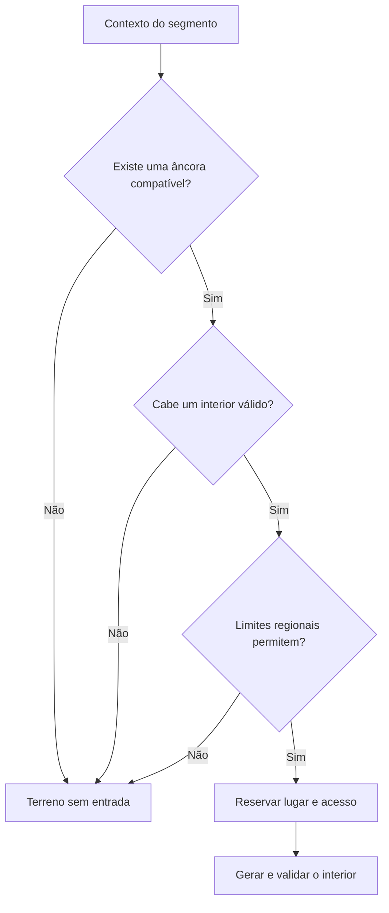
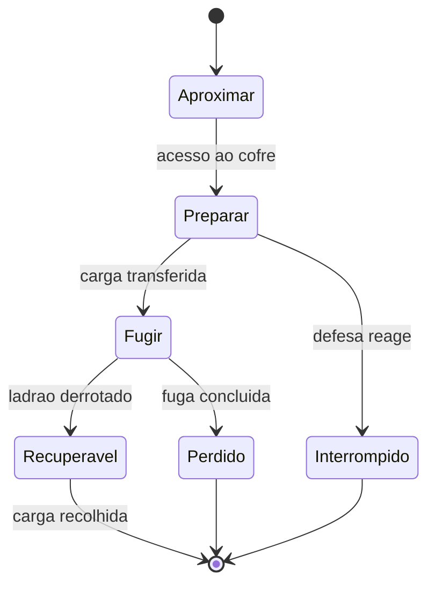

# Empire — Armazéns, subsolos, masmorras e cavernas

> **Aplicação de 05/10/2026.** Relatório fornecido pelo dono e aplicado na [ADR 0072](../adr/0072-o-subsolo-tem-chao-para-alem-da-escada.md) e no [RG-27](../backlog/RG-27.md): o P0 inteiro (SUB-01 a SUB-07) e o P1 de geração, recompensas, celeiros e roubo; a logística (SUB-16, SUB-19) e os ensaios com pessoas e no Web (SUB-21, SUB-22) ficam por fazer. Os números do jogo estão em `data/source/underground.csv`, em `_proposed` (Q-244). As frases «não foram alterados ficheiros do jogo» e «não executei a bateria de testes» abaixo descrevem o estado do relatório quando foi escrito, não o desta aplicação.

Pesquisa comparativa, diagnóstico do gerador e plano de execução · 5 de outubro de 2026

**Recomendação principal:** garantir primeiro que cada lugar cabe no mundo, tem uma razão para existir e oferece chão utilizável para além da entrada. Só depois aumentar a variedade de salas, encontros e recompensas. Um espaço vazio pode ser um bom espaço; uma escada sem espaço habitável é um problema de geração.

Este relatório cruza fontes primárias de **11 jogos**, referências de arquitetura subterrânea e documentação técnica com uma auditoria estática do projeto **Empire**. A versão de referência é a `main`, commit `417369ec37ba50c9b6a52c12eb475e65867f228d`. O plano respeita o jogo em 1,5D, as três faixas existentes, a câmara única, a economia e a geração determinística.

Não foram alterados ficheiros do jogo nem efetuado um novo deployment. Não executei uma sessão de jogo, a bateria de testes ou medições de desempenho. Os problemas de código indicados abaixo foram identificados por leitura; a reprodução exata do subsolo observado pelo utilizador ainda requer a respetiva seed e estado do save.

## 1. O resultado que devemos procurar

O pedido tem duas condições que devem passar a ser contratos do gerador:

1. **Nenhum subsolo acessível pode consistir apenas na escada.** Deve existir uma zona contígua, acessível e desimpedida onde se perceba uma utilização anterior ou uma utilização possível. Não é obrigatório haver tesouro, inimigos, mobiliário ou várias salas.
2. **Nenhuma cave, masmorra ou dungeon deve aparecer apenas porque saiu num sorteio.** A localização precisa de uma explicação espacial: um edifício, uma ruína, uma antiga atividade, uma formação rochosa, uma fissura ou outra característica reconhecível do lugar.

Para o jogador, isto deve traduzir-se em cinco perguntas com respostas legíveis:

| Pergunta | Resposta que o cenário e o sistema devem dar |
| --- | --- |
| Porque existe aqui uma entrada? | Porque este edifício tinha uma cave; esta fortaleza tinha celas; esta rocha abriu uma cavidade. |
| O que era este lugar? | Depósito, adega, cripta, mina, reservatório, abrigo ou formação natural. |
| O que aconteceu? | Foi abandonado, saqueado, ampliado, inundado parcialmente, ocupado ou simplesmente esvaziado. |
| O que posso fazer aqui? | Explorar, guardar, recuperar, atravessar, recolher, observar ou decidir regressar mais tarde. |
| Como saio daqui? | A ligação à superfície continua clara e utilizável, incluindo durante uma retirada. |

**Direção recomendada:** menos entradas redundantes; mais identidade por entrada. Melhorar o significado e a utilidade dos lugares existentes antes de aumentar a sua quantidade.

### Como ler as conclusões

- **Confirmado no código:** comportamento ou estrutura visível na versão auditada.
- **Inferência:** consequência provável desse comportamento, ainda sem reprodução em jogo.
- **Proposta:** alteração de desenho ou implementação recomendada por este relatório.
- **Valor de protótipo:** número para testar; não constitui balanceamento aprovado.

As propostas seguintes são autorais, inspiradas nas fontes indicadas. Não são descrições dos algoritmos internos de jogos cujos programadores não os publicaram.

## 2. O que o Empire já tem — e o que realmente falta

O projeto já dispõe de uma base útil. Não é necessário substituir todo o subsolo.

| Sistema | Estado confirmado | Consequência para o plano |
| --- | --- | --- |
| Lugares subterrâneos delimitados | `UndergroundSites` guarda salas e limites por sítio; máximo atual de 12 salas. | Preservar os limites e acrescentar validação funcional. |
| Geração na primeira descida | `UnderWatch.enter()` gera a geometria com sorteios derivados da chave do lugar. | Manter descoberta tardia, mas reservar antes o espaço que a entrada promete. |
| Salas persistentes | Os layouts são serializados; um sítio já gerado não é sorteado de novo. | Preservar a identidade dos lugares e as alterações do jogador. |
| Cave real | `Treasury` e `CellarWatch` já permitem depósito, retirada e roubo de moedas. | Refinar o sistema existente; não implementar um segundo cofre. |
| Escavação da cave real | A largura cresce por estágios; o passo configurado é 96 px. | Separar largura habitável inicial de incremento de expansão. |
| Reservas do celeiro | `Seasons.reserves` já guarda reservas por edifício. | Ligar representação espacial ao saldo existente, sem duplicar grão. |
| Armazém e adega genéricos | Existem tipos e objetos visuais, sem uma logística genérica equivalente ao cofre. | Distinguir decoração de capacidade efetiva. |
| Recompensas de dungeons | Existem moedas, relíquia e guardião, com persistência. | Distribuir o conteúdo pelo interior e preservar a recolha única. |
| Guardião | A implementação atual escolhe `burrower`; guardiões não desaparecem simplesmente ao amanhecer. | Preservar essa continuidade e variar funções antes de multiplicar espécies. |
| Distribuição dos segmentos | Já há pesos, intervalos, restrições de vizinhança e exclusão junto da base. | Acrescentar contexto e limites regionais; não começar a distribuição do zero. |
| Exploração visual | Há registo de lugares visitados e revelação do subsolo. | Se houver descoberta por sala, terá de ser uma extensão explícita. |
| Plataforma Web | A configuração Vercel constrói e serve o export Web do Godot. | Estas melhorias podem começar no jogo local, sem um backend novo. |

Fontes do projeto: [E02], [E03], [E04], [E05], [E06], [E07], [E08], [E09], [E10], [E11], [E12].

### 2.1 Porque podem aparecer subsolos que parecem ter só uma escada

Há quatro caminhos concretos que explicam a possibilidade, mesmo sem reproduzir a seed denunciada:

**A largura mínima não é uma garantia final.** Em `UndergroundSites.lay_out()`, a largura calculada é limitada por `cap.y - cap.x`. Se o espaço disponível for menor do que a largura mínima da sala, a sala encolhe. A configuração nominal de 120–240 px não impede, por si só, um resultado menor. [E02], [E13]

**As salas adicionais podem ser zero.** O gerador cria a sala de entrada e sorteia de zero até `und_extra_rooms` salas extra. Se os elementos obrigatórios já couberem na entrada, nada exige uma zona adicional de utilização. A existência de uma sala nos dados não prova que exista chão útil depois da escada. [E02], [E03]

**A cave inicial pode ter um envelope de apenas 96 px.** Quando o sistema de chegada está ativo, `CellarWatch.sync()` redefine o limite da cave real. No estágio zero, a fórmula resulta numa largura total igual a `cellar_step_px`, atualmente 96 px, e força `EXTRA = 0`. Isto permite uma cave mais estreita do que o mínimo nominal de 120 px. [E04], [E14]

**As expansões também não têm contrato de espaço útil.** `_juntar()` admite uma sala parcial com metade do mínimo configurado; `excavate()` acrescenta o intervalo disponível à direita sem exigir uma área funcional mínima. O limite de salas controla quantidade, não habitabilidade. [E02]

**Diagnóstico:** aumentar `und_extra_rooms` ou trocar 120 por um número maior não resolve a origem. O problema é a ausência de uma condição final do tipo «a entrada conduz a pelo menos uma zona utilizável» e a possibilidade de publicar entradas antes de confirmar essa condição.

### 2.2 Outros pontos que empobrecem os lugares

| Observação no código | Risco de experiência — inferência | Refinamento recomendado |
| --- | --- | --- |
| Relíquias, moedas e guardião são posicionados em `subject_x`, a coordenada da entrada. | A recompensa principal pode ser encontrada logo ao descer; o resto torna-se dispensável. | Guardar a intenção da recompensa e resolver a sua posição numa zona interior válida. |
| O mesmo conjunto de tipos serve muitas ruínas. | Criptas, cisternas e ossários podem parecer combinações arbitrárias. | Escolher uma função original para o sítio e restringir os tipos compatíveis. |
| Uma feature pode substituir o `kind` da sala que a contém. | A última feature pode apagar a identidade anterior. | Separar função da sala, features e estado de conservação. |
| `site_at(x)` encontra o primeiro intervalo que contém a coordenada. | Uma sobreposição entre sítios pode associar uma entidade ao lugar errado. | Validar ausência de sobreposição e associar entidades a `site_id`. |
| Baú e passagem partilham a zona da boca; a retirada é tentada antes da subida. | O mesmo comando pode retirar moedas quando a intenção era sair. | Separar posições de interação e mostrar um alvo contextual inequívoco. |
| Uma criatura elegível que chega ao baú pode retirar todo o saldo no mesmo tick. | Perda abrupta, pouco legível e sem uma janela clara de reação. | Roubo com preparação, limite transportável e fuga recuperável. |
| O montante roubado não passa, nessa função, para uma carga recuperável da criatura. | Derrotar o ladrão pode não reparar a perda esperada pelo jogador. | Registar o valor numa entidade ou transação de carga persistente. |
| `Seasons.store()` usa o primeiro celeiro próprio elegível e regressa logo. | Um celeiro cheio pode impedir aproveitar outros; proximidade não participa na escolha. | Primeiro suportar vários destinos; só depois introduzir custo de transporte. |
| `escape`, `cistern` e `collapsed` são sobretudo representações visuais. | O cenário promete saídas, água ou obstáculos que podem não existir mecanicamente. | Dar-lhes uma regra simples ou retirar a promessa visual de interação. |

Fontes: [E02], [E04], [E06], [E07], [E10], [E15].

Há também documentação histórica que descreve o armazém/cofre como pendente, enquanto a `main` já implementa o baú. O comentário de `UnderWatch.enter()` ainda fala em tesouro que cai, mas `_tesouro()` abre agora uma reserva vazia. A documentação deve distinguir claramente **cofre de moedas implementado**, **reservas de celeiro implementadas** e **logística genérica ainda proposta**. [E03], [E05], [E16]

## 3. Pesquisa comparativa: o que aproveitar de 11 jogos

As referências foram escolhidas por resolverem problemas diferentes. Nenhum destes jogos deve ser copiado integralmente para o Empire.

| Jogo | Contributo principal | Aplicação ao Empire | Limite da adaptação |
| --- | --- | --- | --- |
| Kingdom Two Crowns | Explorar compete com proteger e desenvolver o reino. | A ida ao subsolo deve ter custo de oportunidade e um regresso legível. | Não transformar a exploração num segundo jogo desligado da superfície. |
| Dead Cells | Combinação de estrutura controlada e salas preparadas. | Famílias pequenas de salas com encaixes e funções válidas. | O ritmo de combate de um jogo de ação não se transfere automaticamente. |
| Unexplored / Unexplored 2 | Organização lógica e lugares coerentes no mundo. | Função e contexto antes da geometria e da recompensa. | Ramificações complexas não cabem diretamente numa faixa horizontal. |
| Factorio | Funções de armazenamento e distribuição diferentes. | Separar reserva, transferência, capacidade e procura. | Não introduzir uma fábrica inteira de automatismos. |
| Against the Storm | Transporte consome trabalho; reservas precisam de regras claras. | Reaproveitar trabalhadores e estabelecer prioridades simples. | Evitar uma profissão e uma interface para cada novo recurso. |
| Dwarf Fortress | Depósitos definidos por conteúdo e ligações. | Destinos compatíveis, propriedade, filtros e acessibilidade. | Não reproduzir simulação individual de milhares de objetos. |
| Going Medieval | Espaço escavado tem forma e pode receber funções distintas. | Mostrar volume utilizável e possibilidade de ocupação. | O Empire não precisa de terreno voxel nem de múltiplos pisos novos. |
| Darkest Dungeon | Preparação, desgaste e decisão de regressar. | Aproveitar noite, luz e recursos existentes para dar peso à expedição. | Não acrescentar uma barra de stress apenas por inspiração. |
| Caves of Qud | Conteúdo autoral combinado com mundo e história gerados. | Fazer o passado local informar o conteúdo da ruína. | Não construir uma enciclopédia procedural antes do primeiro bom lugar. |
| Minecraft | Estruturas ligadas ao ambiente e encontros com regras legíveis. | Geologia/contexto para entradas; perigos reconhecíveis por comportamento. | Não copiar densidade, dimensões ou respawn de outro jogo. |
| Valheim | Bioma, ocupante e construção contam a mesma história. | Ruínas e cavernas como restos de culturas ou habitat. | Não depender de uma atualização que regenere áreas já exploradas. |

### Kingdom Two Crowns — a ligação à superfície

O guia publicado pela equipa organiza a experiência em construir, explorar, defender e conquistar. A exploração expõe o monarca ao tempo e à distância de regresso; a expansão também interfere com habitantes da floresta. [R13]

**Aplicação proposta:** uma cave pode ajudar o reino a preparar o inverno; uma ruína pode exigir uma saída curta com uma recompensa finita; uma expedição longa deve ser uma decisão consciente. O subsolo deve participar no mesmo ciclo económico e territorial. Evitar aventuras obrigatórias demoradas enquanto a superfície sofre perdas que o jogador não consegue antecipar.

### Dead Cells — variação dentro de uma estrutura

Na descrição publicada por Sébastien Bénard, da Motion Twin, a geração combina organização do percurso, funções de salas, seleção de módulos preparados e distribuição de inimigos segundo limites. A identidade do ambiente influencia o tipo de espaço e o movimento. [R01]

**Aplicação proposta:** preparar primeiro seis a oito módulos funcionais em blocos simples: entrada com área livre, depósito, câmara ritual, frente de extração, passagem estreita, sala danificada e objetivo protegido. Variar orientação, comprimento permitido, conservação e conteúdo compatível. O gerador ganha diversidade sem ter de inventar salas boas do nada.

### Unexplored — desenhar um lugar antes de desenhar um labirinto

A Ludomotion distingue relações lógicas da geometria na sua geração. No texto sobre a «teoria do lugar», defende locais menores e coerentes com um mundo aberto: uma cripta sob uma fortificação ou um templo dentro de uma caverna têm uma razão reconhecível para existir. [R02], [R03]

**Aplicação proposta:** escrever para cada sítio uma frase causal: «este depósito abastecia o posto de vigia que está em ruínas». Dessa frase derivam a localização, o acesso, as salas permitidas, os vestígios e os ocupantes possíveis. Uma cave pequena e convincente tem mais valor do que dez câmaras sem relação entre si.

### Factorio — guardar e entregar são problemas diferentes

O artigo oficial sobre buffer chests descreve um papel intermédio entre pedir e disponibilizar materiais. A discussão inclui deslocações desnecessárias e conflitos entre categorias de conteúdo. [R04]

**Aplicação proposta:** distinguir quanto cabe num depósito de quanto consegue entrar ou sair por unidade de tempo. Uma reserva pode ser suficiente para o inverno e, ainda assim, estar mal localizada. Começar com um destino principal e prioridades simples; só criar depósitos avançados quando a distância já produzir uma decisão interessante.

### Against the Storm — logística com custo de trabalho

A atualização de logística substituiu uma estação de transporte separada por trabalhadores atribuídos a armazéns. Também tornou explícitas reservas que limitam certos consumos, com exceções para algumas necessidades. [R05]

**Aplicação proposta:** usar a população e os trabalhos existentes no Empire. Reservar um trabalhador para transportar deve competir com construir, produzir ou defender. Uma política «guardar para o inverno» deve dizer quem a pode ultrapassar; reservas invisíveis e exceções ocultas parecem erros.

### Dwarf Fortress — um depósito tem conteúdo e ligações

O diário dos autores documenta filtros de depósitos, ligações entre depósitos e edifícios e relações de dar, receber ou trocar em paragens de transporte. [R06]

**Aplicação proposta:** representar um depósito por categoria aceite, capacidade, proprietário, acesso e destinos. Não é necessário representar fisicamente cada grão. Um lote agregado, com saldo e representação visual proporcional, pode dar a mesma decisão relevante com menor custo de simulação.

### Going Medieval — escavar deve produzir espaço

A descrição oficial apresenta construção, mobiliário e escavação num mapa com vários níveis, incluindo câmaras subterrâneas e manipulação do terreno. [R07]

**Aplicação proposta:** mesmo mantendo apenas a faixa subterrânea do Empire, a abertura deve revelar um compartimento que possa receber alguma coisa. Marcas de prateleiras, bancos de pedra, nichos, vigas ou uma baía vazia comunicam essa possibilidade. Não é preciso adotar construção voxel ou uma simulação térmica detalhada.

### Darkest Dungeon — a retirada também é uma decisão

A apresentação oficial dá peso ao desgaste da expedição, à escuridão, às necessidades dos heróis e à recuperação fora da dungeon. [R08]

**Aplicação proposta:** começar com os custos que o Empire já possui. A distância até à saída, a noite e os consumíveis podem sustentar uma decisão «avanço ou volto». Acrescentar novos medidores antes de estes custos serem legíveis aumenta a interface e pode não aumentar a estratégia.

### Caves of Qud — o passado ajuda a gerar o presente

O material oficial descreve a combinação de conteúdo escrito com regiões e história procedurais. [R09]

**Aplicação proposta:** usar um historial compacto: quem construiu, para quê, o que interrompeu o uso e quem ocupa agora. Uma ruína precisa de poucas variáveis coerentes, não de páginas de texto. A mesma antiga adega pode estar vazia, saqueada ou ocupada; esses estados alteram vestígios e encontros sem alterar arbitrariamente a arquitetura.

### Minecraft — contexto ambiental e perigos identificáveis

O artigo oficial sobre Ancient Cities relaciona estas estruturas com o deep dark e ambientes subterrâneos associados a montanhas. Explica também como o ruído e certos materiais alteram o risco. O artigo sobre trial spawners descreve encontros com limites de criaturas, conclusão e recompensa. [R10], [R11]

**Aplicação proposta:** o local deve sugerir o perigo antes do combate. Uma fissura com marcas de escavação animal pode indicar um escavador; uma sala ritual pode ter um guardião. Usar um orçamento de encontro claro. A persistência finita do Empire deve continuar a valer: não importar o reaparecimento periódico das trial chambers.

### Valheim — habitat, bioma e ruína contam a mesma história

Os anúncios oficiais das Frost Caves ligam o novo interior aos habitantes das montanhas. Outros textos de desenvolvimento apresentam construções antigas como restos de civilizações sujeitos ao tempo e ao ambiente. A atualização das cavernas também distinguiu áreas ainda não exploradas. [R12]

**Aplicação proposta:** escolher conjuntamente ambiente, arquitetura e ocupação. A atualização de um gerador deve respeitar lugares já visitados, em vez de trocar o seu interior ou fazer reaparecer a recompensa.

### Síntese da pesquisa para este projeto

O padrão mais útil é **estrutura autoral pequena + regras procedurais explícitas + persistência**. As referências de logística sugerem começar por reservas e destinos compreensíveis. As de exploração sugerem contexto, percurso e decisões de regresso. A implementação em 1,5D deve absorver esses princípios sem importar a escala e os controlos de cada jogo.

## 4. O que a arquitetura real acrescenta

O Royal Collection Trust descreve o Undercroft de Windsor como um espaço sob o salão usado historicamente para armazenamento, incluindo barris. A função explica o compartimento, as abóbadas e a relação com o edifício superior. Trata-se de um undercroft; não deve ser apresentado genericamente como uma cave totalmente enterrada. [R14]

O inventário oficial de Kaymaklı enumera salas ligadas por corredores, armazenamento de provisões e vinho, cozinhas, água, ventilação e dispositivos de fecho. Para este projeto interessa a relação entre necessidades e espaços, não reproduzir a escala da cidade subterrânea. [R15]

**Princípio de desenho proposto:** a entrada é infraestrutura de acesso. O destino desse acesso deve existir, mesmo quando foi esvaziado. Arquitetura legível não exige realismo integral: exige que dimensões, circulação, materiais e vestígios não se contradigam.

## 5. Uma linguagem comum para os lugares

Hoje, «tipo de sala», «aspeto visual» e «conteúdo» estão demasiado próximos. Recomendo separar seis dimensões:

| Dimensão | Exemplos | O que controla |
| --- | --- | --- |
| Origem | Construído, escavado, natural, natural depois adaptado | Forma e relação com o terreno |
| Função original | Depósito, adega, cripta, cisterna, mina, prisão | Salas e objetos compatíveis |
| Contexto | Castelo, quinta, cais, ruína, escarpa, fissura | Elegibilidade no mapa |
| Estado | Em uso, vazio, abandonado, saqueado, danificado | Vestígios e acesso |
| Ocupação atual | Ninguém, trabalhadores, fauna, guardião, saqueadores | Interações e perigos |
| Oportunidade | Guardar, recuperar, recolher, explorar, atravessar | Decisão oferecida ao jogador |

Uma **dungeon** é aqui uma categoria de experiência de exploração. Não é uma justificação arquitetónica. Pode acontecer numa mina, numa prisão ou numa cripta. Uma **masmorra/prisão** é uma função concreta, com celas e uma relação plausível com poder e vigilância. Uma **caverna** pode ser natural e nunca ter sido ocupada por pessoas.

Não transformar todas as cavernas em masmorras com moedas. Sedimentos, raízes, marcas de água ou um nicho natural podem justificar um lugar sem vestígios humanos. Também não colocar caixotes em todas as câmaras apenas para provar que têm utilidade.

### Famílias iniciais recomendadas

| Família | Âncora necessária | Conteúdo compatível | Conteúdo a evitar sem explicação |
| --- | --- | --- | --- |
| Cave de habitação ou produção | Edifício ou fundações reconhecíveis | Depósito, adega, área livre, pequena oficina | Ossário aleatório, altar e guardião por defeito |
| Reserva real | Núcleo/castelo e acesso controlável | Cofre, antecâmara, expansão | Tesouro gratuito que reaparece |
| Depósito abandonado | Ruína de produção, comércio ou abastecimento | Prateleiras vazias, recipientes, marcas de carga | Salas ritualísticas sem transição histórica |
| Cripta | Capela, mausoléu ou fortificação com função funerária estabelecida | Nichos, câmara funerária, depósito votivo | Equipamento mineiro aleatório |
| Prisão subterrânea | Fortaleza, posto de autoridade ou recinto antigo | Guarda, celas, armazém de serviço | Labirinto gigantesco sob uma cabana |
| Mina | Recurso/veio e acesso de trabalho | Frente de extração, suportes, depósito de ferramentas | Tesouro central obrigatório |
| Cisterna | Construção que necessite de água e configuração compatível | Reservatório, manutenção, drenagem | Armazenamento alimentar seguro no mesmo espaço húmido |
| Caverna natural | Formação rochosa, fissura ou cavidade prevista | Nichos, fauna, raízes, sedimentos | Escada de alvenaria sem intervenção humana |

Estas famílias são uma proposta de catálogo. O primeiro incremento deve implementar só três: cave útil, ruína com interior e caverna natural.

## 6. Contrato de espaço mínimo: acabar com a escada sem destino

### 6.1 O que deve ser medido

Medir a largura total da sala não basta. Devem existir intervalos distintos ou compatibilizados para:

- **Entrada:** escada/alçapão, posição de chegada e animação de transição.
- **Circulação:** espaço para sair da chegada, inverter o movimento e alcançar o interior.
- **Área útil:** um intervalo contínuo que aceite pelo menos um módulo de uso futuro.
- **Margens:** paredes, suportes e folgas de colisão.

A área útil não pode contar a própria escada, uma parede, um objeto bloqueante ou chão inacessível. Se um baú ocupar parte dessa área, deve continuar a haver aproximação válida e um percurso livre até à saída.

Contrato lógico proposto:

```text
site_is_valid =
    entrance_is_inside_reserved_envelope
    and entrance_reaches_usable_bay
    and usable_bay_length >= required_bay_length
    and all_required_features_fit
    and exit_remains_reachable
    and no_unintended_overlap
```

O cálculo de área livre deve usar a união dos intervalos ocupados, para não subtrair duas vezes objetos sobrepostos. O teste precisa de verificar um intervalo livre **contíguo e alcançável**, não apenas somar pequenos espaços entre objetos.

### 6.2 Valores iniciais para prototipar

**Estes números são propostas de ensaio, não novos valores aprovados de balanceamento.** Devem ser aferidos com o collider, os sprites, a câmara e os controlos reais.

| Componente do exemplo | Comprimento de ensaio |
| --- | ---: |
| Reserva da chegada/escada | 64 px |
| Folga de circulação | 48 px |
| Baía útil vazia | 128 px |
| Margens acumuladas | 32 px |
| Soma | 272 px |
| Envelope arredondado de referência | 288 px |

O objetivo destes valores é demonstrar um orçamento espacial. Uma sala de 288 px pode continuar a ser inválida se um objeto ocupar a baía inteira. Uma sala mais pequena poderá ser aceitável se os elementos reais forem menores e os testes demonstrarem que mantém acesso e uso.

Para as famílias iniciais, começar por testar:

| Família | Composição mínima | Dimensão a validar |
| --- | --- | --- |
| Cave vazia | Uma sala com chegada e baía útil diferenciadas | Envelope de referência de 288 px |
| Reserva real | Chegada, acesso ao cofre e zona de expansão | Base habitável independente do incremento de 96 px |
| Pequena ruína | Chegada legível e pelo menos uma zona interior de interesse | Aproximadamente 320–480 px, conforme o objetivo |
| Caverna natural | Boca e nicho interior que se perceba como cavidade | Derivada da forma, com a mesma garantia de área útil |

Uma única sala pode cumprir tudo isto. **Não recomendo exigir sempre duas salas**, porque isso aumentaria artificialmente lugares que só precisam de um bom compartimento.

### 6.3 O que fazer quando não cabe

1. Reservar o envelope subterrâneo quando se decide a existência do lugar.
2. Verificar o tamanho e as features obrigatórias antes de tornar a entrada utilizável.
3. Tentar um pequeno conjunto determinístico de disposições compatíveis.
4. Usar um modelo mínimo previamente validado se ele couber.
5. Se o lugar for opcional e nenhum modelo couber, não criar a entrada; conservar terreno ou uma ruína sem acesso subterrâneo.
6. Se o lugar for obrigatório, como a cave da sede, corrigir o planeamento da sede para lhe reservar espaço legal desde o início. Não reduzir silenciosamente a sala.

Uma ruína sem cave é um resultado válido. Uma entrada utilizável sem destino válido não é.

Não usar uma escada bloqueada como substituto sistemático da falha: isso continua a espalhar promessas vazias pelo mapa. Um acesso desabado pode existir como conteúdo intencional e legível, com função própria.

### 6.4 Como conciliar isto com a expansão atual

O passo de escavação de 96 px já consta como aprovado nos dados. O problema não exige mudá-lo. Recomendo propor uma **largura inicial habitável** separada, mantendo o passo como incremento, sujeito ao envelope reservado:

```text
available_width = initial_habitable_width + excavation_stage * expansion_step
```

Cada incremento deve ampliar uma baía existente ou acumular espaço até permitir uma nova sala válida. Não criar uma «sala» estreita de 20 px só porque foi essa a diferença entre dois limites.

O espaço reservado tem de respeitar outros sítios, edifícios subterrâneos, minas e a câmara da Semente Real. Aumentar indiscriminadamente `cap` pode resolver a escada e criar sobreposições. O ajuste deve acontecer no planeamento, não atravessando as paredes do vizinho.

### 6.5 Vazio com significado

| Estado vazio | Como se percebe | Utilidade possível |
| --- | --- | --- |
| Depósito esvaziado | Marcas de prateleiras e área central livre | Recuperação como reserva |
| Adega saqueada | Suportes vazios, um recipiente quebrado fora da passagem | Pequena recuperação ou leitura da história local |
| Cave preparada | Piso limpo, apoios e volume disponível | Expansão futura autorizada pelo proprietário |
| Mina abandonada | Frente de trabalho e sulcos, sem recurso obrigatório | Exploração curta ou acesso futuro definido |
| Cavidade natural | Sedimentos, desgaste ou raízes compatíveis | Abrigo visual, habitat ou pequena descoberta |

Um ou dois sinais bem colocados chegam. A ausência de objetos deve continuar a ser possível. A validação não deve exigir loot nem decoração; deve exigir espaço, coerência e acesso.

## 7. Como decidir onde podem existir caves e dungeons

### 7.1 Primeiro a causa, depois a probabilidade

O gerador atual já tem restrições úteis. Em `TrailPick`, um intervalo mínimo impede repetições demasiado próximas; outras regras afastam tipos da base ou de certos vizinhos. O peso de ruína é relativo aos tipos elegíveis: **um peso 12 não significa uma probabilidade fixa de 12%**. [E08], [E09]

A camada que falta é decidir se aquele segmento pode conter aquele lugar. Recomendo quatro fases:

1. **Contexto:** o planeamento identifica edifícios, fundações antigas, afloramentos, fissuras, zonas húmidas e corredores de circulação que realmente existem no mapa.
2. **Elegibilidade:** cada família verifica as suas condições obrigatórias e proibições.
3. **Seleção:** só os candidatos válidos participam no sorteio, considerando limites regionais e repetição.
4. **Reserva:** o candidato selecionado reserva a sua entrada, volume subterrâneo e ligações antes da decoração da superfície.

Não basta adicionar a etiqueta `rock` a um segmento invisivelmente. Se uma caverna depende de um afloramento, esse afloramento deve fazer parte do cenário e ter uma forma compatível com a boca.



O diagrama descreve uma regra de seleção, não exige tornar todo o interior visível ou instanciado de imediato.

### 7.2 Regras obrigatórias de localização

| Família | Exigir | Impedir |
| --- | --- | --- |
| Cave de edifício | Edifício/fundações, volume reservado, acesso de serviço | Boca afastada sem ligação; sobreposição com outro sítio |
| Reserva real | Associação à sede e área própria suficiente | Que o alçapão caia sobre outro alvo contextual |
| Cripta | Referência funerária ou história local previamente definida | Ser escolhida apenas por ser um segmento de floresta |
| Prisão | Autoridade/fortificação reconhecível, celas compatíveis com a dimensão | Prisão extensa sob ruína minúscula sem outra estrutura |
| Mina | Justificação de recurso ou antiga extração, frente de trabalho | Mistura aleatória de minério e qualquer arquitetura |
| Cisterna | Necessidade de abastecimento e configuração de água plausível | Prometer armazenamento seco numa zona marcada como alagada |
| Caverna | Rocha/fissura/cavidade e boca correspondente | Escada construída sem sinais de adaptação humana |
| Túnel de serviço | Dois destinos previstos e ligação verificada | Chamar «fuga» a uma sala que termina numa parede |

Não é necessária uma simulação geológica completa. Um pequeno conjunto de atributos de terreno, decidido pelo plano regional e refletido na arte, é suficiente para a primeira versão. Esses atributos devem representar características existentes, não servir de justificação inventada depois do sorteio.

### 7.3 Distribuição com espaço para não acontecer nada

Separar três classes:

- **Estrutura garantida:** cave inicial da sede ou outro elemento exigido pela progressão. O plano reserva-lhe espaço desde o princípio.
- **Lugar opcional:** ruína, cavidade ou depósito abandonado. Pode não existir numa região se não houver contexto válido.
- **Elemento de paisagem:** ruína sem interior, rocha maciça, abertura inacessível intencional ou fundações. Não precisa de ser uma dungeon.

Proposta de controlo regional:

```text
optional_budget = min(
    regional_maximum,
    floor(eligible_trail_length / target_spacing)
)
```

O resultado é um teto, não uma quota que obrigue a preencher o mapa. A lista de candidatos e a sua geometria continuam a poder reduzir o número final a zero. `target_spacing` deve ser calibrado pelo tempo real de deslocação e pela duração das visitas, não só por pixels.

O primeiro protótipo deve comparar três densidades numa mesma amostra de regiões: baixa, média e a atual. Medir repetição e tempo desviado da atividade principal. Não fixaria já um número universal de masmorras por mapa sem conhecer a duração desejada da partida.

Adicionar limites separados para:

- Número de entradas opcionais por região.
- Intervalo entre entradas, aproveitando as regras já existentes.
- Repetição da mesma família e da mesma história de abandono.
- Densidade de outros acontecimentos no mesmo percurso.
- Espaço subterrâneo reservado e conflitos entre sítios.

Uma sequência de ruína, acampamento, caverna, tesouro e nova ruína pode ser cansativa mesmo quando cada tipo respeita o seu próprio intervalo. Por isso, é útil um orçamento global de pontos de interesse, além do limite por família.

### 7.4 Variação pelos povos e territórios

O projeto dispõe de oito kits de povos. A tabela seguinte é uma **proposta temática a reconciliar com o dossiê**, não uma afirmação de história já aprovada. As características visíveis e os usos locais devem prevalecer sobre o nome do kit.

| Kit | Possíveis âncoras, se presentes no território | Família a experimentar | Regra de coerência |
| --- | --- | --- | --- |
| Enramados | Estrutura antiga entre raízes, depósito agrícola | Cave adaptada ou abrigo de raízes | Raízes seguem a vegetação e o solo; não atravessam tudo indistintamente |
| Portuários | Cais antigo, comércio, fundações de armazém | Depósito de abastecimento | Marcas de carga e humidade compatíveis com a posição |
| Fenda | Fratura rochosa, exploração mineral | Cavidade natural ou mina | A fissura deve ser visível e orientar a forma |
| Horta | Produção e conservação de alimentos | Cave de reserva ou adega | A função corresponde ao edifício superior |
| Fornalha | Extração e trabalho de materiais | Galeria de serviço ou depósito | Ferramentas, suportes e acesso correspondem à atividade |
| SobRaiz | Estruturas antigas envolvidas por raízes | Cripta reutilizada ou cavidade adaptada | O uso funerário precisa de evidência própria |
| Geada | Abrigo ou estrutura antiga em terreno frio | Depósito protegido ou caverna | O frio modifica a leitura e o uso sem exigir nova física térmica |
| Bruma | Ruína ou construção com água/humidade local | Cisterna ou cave abandonada | Não fazer toda a região equivaler automaticamente a inundação |

Não é obrigatório que todos os povos tenham todas as famílias. Uma identidade regional fica mais forte quando algumas combinações são impossíveis.

## 8. Geração: uma gramática pequena com validação forte

### 8.1 A ordem recomendada

**Intenção → contexto → reserva → funções → geometria → conteúdo → validação → publicação.**

O erro a evitar é gerar primeiro salas aleatórias, depois objetos aleatórios e finalmente tentar inventar uma história que desculpe o resultado.

| Passo | Entrada | Saída | Falha tratada |
| --- | --- | --- | --- |
| Intenção | Família e oportunidade desejada | Perfil do sítio | Lugar sem propósito |
| Contexto | Região, terreno, edifício/história | Candidatura elegível | Dungeon sem razão para existir |
| Reserva | Boca, features existentes, limites | Envelope legal | Sala esmagada por falta de espaço |
| Funções | Perfil e estado de conservação | Lista de papéis de sala | Mistura sem relação |
| Geometria | Papéis e envelopes | Intervalos e acessos | Caminhos inválidos ou sobreposições |
| Conteúdo | Área disponível, ocupação e orçamento | Objetos, encontro e objetivo | Loot na chegada; decoração a bloquear |
| Validação | Modelo completo | Resultado ou código de rejeição | Publicação de um lugar defeituoso |
| Publicação | Resultado válido | Estado persistente e representação | Regeração e duplicação de recompensas |

### 8.2 Modelos de composição

| Modelo | Disposição conceptual | Quando usar |
| --- | --- | --- |
| Compartimento único | Chegada lateral ou central com baía livre | Cave pequena, abrigo, depósito vazio |
| Antecâmara e destino | Entrada seguida de câmara funcional | Cripta, cofre, oficina abandonada |
| Duas direções | Boca ao centro; opção curta de um lado e objetivo do outro | Ruína com decisão simples de exploração |
| Frente de trabalho | Acesso, depósito e frente terminal | Mina ou escavação em curso |
| Reserva ampliável | Compartimento inicial e volume futuro legal | Cave real e armazém recuperável |
| Natural adaptado | Cavidade reconhecível e pequeno trecho construído | Abrigo ou santuário inserido numa caverna |

São composições compatíveis com uma fila horizontal de salas. Um grafo lógico pode expressar objetivos e dependências sem prometer um labirinto bidimensional.

**Limite importante:** ciclos, passagens por cima de outras salas e múltiplos pisos não surgem por mudar o algoritmo. Exigem navegação, representação e regras adicionais. Para o primeiro ciclo de desenvolvimento, manter a faixa existente, escolher esquerda/direita quando fizer sentido e usar obstáculos locais legíveis. Uma segunda entrada só entra mais tarde, se a ligação ao mundo for efetivamente implementada e validada.

### 8.3 Dados propostos

Exemplo ilustrativo de registo; os nomes são propostas e não APIs existentes:

```yaml
site_id: ruin_west_07
schema_version: 1
generator_version: 2
family: abandoned_store
anchor_id: old_waystation_07
origin: constructed
former_use: provisioning
condition: emptied
owner_id: null
entrance_kind: masonry_stair
footprint: reserved_interval
required_roles: [arrival, usable_bay]
optional_roles: [store_room]
occupancy: none
reward_policy: none
recovery_policy: claim_then_repair
```

Este exemplo pode produzir um lugar sem inimigos e sem moedas. Continua a ter uma causa, uma forma e uma utilização possível. O formato real deve seguir os recursos e tabelas do projeto, sem acrescentar um parser YAML só por causa deste exemplo.

Para uma sala, separar pelo menos `room_id`, `role`, intervalo, acessos, features, zonas de interação e estado. A identidade «depósito» não deve desaparecer por conter uma raiz ou um veio mineral.

### 8.4 Aleatoriedade e tentativas limitadas

Usar `RngService` e chaves estáveis. Separar logicamente os domínios de layout, encontro, recompensa e decoração através do mecanismo determinístico existente; a decoração não deve alterar o combate nem a recompensa ao consumir mais um sorteio.

Uma primeira política de ensaio pode permitir até quatro tentativas de encaixe por candidato, seguidas de um modelo mínimo validado. O limite exato é uma escolha de implementação a medir. O comportamento de falha deve ser determinístico e não iniciar tentativas infinitas.

Gravar a versão do gerador e o resultado publicado. A documentação do Godot avisa que a implementação do gerador aleatório não constitui garantia de sequências idênticas entre versões do motor; guardar apenas a seed não substitui preservar layouts e decisões relevantes. [T02]

### 8.5 Porque não começaria por Wave Function Collapse

O repositório original do WFC documenta a propagação de restrições e a possibilidade de contradições. As restrições locais não garantem, por si, uma saída alcançável, um objetivo bem colocado ou um lugar interessante. [T03]

Para este jogo, intervalos, modelos pequenos e validação explícita resolvem diretamente o problema. WFC pode ser experimentado mais tarde na decoração ou no preenchimento de padrões não bloqueantes. Não deve ser o primeiro investimento para corrigir caves de 96 px.

## 9. Armazéns: tornar o espaço útil sem criar uma economia paralela

### 9.1 Três sistemas diferentes que devem permanecer claros

| Sistema | Autoridade atual | Papel |
| --- | --- | --- |
| Moedas transportadas | Unidades e respetivas capacidades | Dinheiro em circulação com os atores |
| Cofres | `Treasury` | Moedas depositadas num lugar |
| Reservas agrícolas | `Seasons.reserves` | Parte da produção retida e libertada segundo as estações |

`Storage` já designa armazenamento associado às personagens/equipamento. Não o transformar silenciosamente numa base genérica de armazéns. Se a logística precisar de um novo conceito, usar um nome distinto e uma responsabilidade pequena. [E05], [E07], [E17]

A reserva agrícola atual é uma abstração numérica da produção. Antes de a converter em lotes físicos, documentar a unidade e o ponto de conversão económica. Não criar simultaneamente um «saco de grão» novo e manter o rendimento original como se ambos fossem recursos independentes.

### 9.2 Respeitar o desenho económico do Empire

O §06 do dossiê estabelece que matérias-primas não aparecem num inventário numérico do jogador. Permanecem associadas aos edifícios; o transporte e a atividade comunicam a economia. [E18]

Assim, o plano propõe **saldos e reservas internos**, para correção da simulação, e **representação no mundo**, para o jogador:

- Recipientes vazios, poucos, médios ou muitos, derivados do saldo real.
- Trabalhadores a transportar entre pontos acessíveis.
- Sinais visuais de falta de espaço, destino indisponível ou edifício parado.
- Decisões nos alvos contextuais e ofícios existentes, preservando os dois verbos.
- Quantidades e causas detalhadas no modo de diagnóstico de desenvolvimento, não numa nova folha de cálculo obrigatória.

O cofre de moedas pode conservar a linguagem monetária que o jogo já utiliza. O princípio não obriga a esconder informação necessária; evita multiplicar inventários que contradizem a identidade do projeto.

### 9.3 O que um depósito funcional precisa de saber

No estado interno: identificador, proprietário, categoria aceite, capacidade, quantidade, quantidade reservada, acesso, prioridade e edifício associado. Mais tarde poderá ter condições de conservação simples.

Os conceitos fundamentais são:

| Conceito | Exemplo de falha se não existir |
| --- | --- |
| Capacidade | O visual mostra uma pequena cave que aceita reservas infinitas |
| Reserva de carga | Dois trabalhadores transportam o mesmo lote |
| Reserva de destino | Dois carregamentos disputam a última vaga |
| Acessibilidade | Um trabalhador aceita um destino atrás de um bloqueio sem percurso |
| Propriedade | Uma unidade abastece silenciosamente o depósito de outro reino |
| Estado da tarefa | Uma interrupção destrói ou duplica a carga |
| Prioridade | Materiais circulam indefinidamente entre depósitos equivalentes |

Não ativar todos estes sistemas ao mesmo tempo. Primeiro, garantir saldos e destinos; depois, representar transporte.

### 9.4 Evolução em três incrementos

**Incremento A — espaço e representação.** Ligar o baú a uma zona própria; mostrar a ocupação da cave; mapear reservas agrícolas existentes para recipientes no edifício ou na cave correspondente. Acrescentar um espaço vazio recuperável sem obrigar já a simular o transporte.

**Incremento B — vários destinos corretos.** Corrigir a seleção de celeiros: procurar destinos elegíveis, respeitar capacidade e aproveitar os restantes quando o primeiro está cheio. Usar critérios determinísticos. A escolha por distância só deve acontecer com uma noção de caminho válida, não pela diferença absoluta de coordenadas entre espaços desligados.

**Incremento C — transporte legível.** Atribuir trabalhos a uma população existente. Reservar origem e destino; mover a carga; confirmar entrega. Um trabalhador morto, bloqueado ou reatribuído deve libertar reservas e preservar a carga num estado definido. Introduzir uma única categoria transportada no primeiro protótipo.

### 9.5 Conservação de valor

Para transferências de moedas, esta identidade deve manter-se, exceto quando há uma fonte ou um consumo explicitamente definido:

```text
total = carried_by_units + stored_in_chests + ground_coins + carried_by_thieves
```

Depositar e retirar são transferências; não criam nem destroem valor. O evento atual `coin_spent` no depósito pode servir a telemetria existente, mas o plano deve verificar os consumidores desse evento antes de o tratar como consumo económico. Não mudar um nome ou acrescentar um evento sem rever o catálogo fechado do projeto. [E04], [E01]

Para reservas agrícolas, definir uma identidade equivalente na unidade interna atual. A conversão para moeda, consumo ou benefício tem de acontecer uma vez e num ponto identificável.

O cofre de um reino estrangeiro já é inicialmente financiado a partir da economia desse reino. Preservar essa transferência única. Um reino sem saldo pode ter um cofre vazio: não gerar dinheiro para satisfazer a expectativa de loot. [E04]

### 9.6 Melhorar o roubo sem eliminar o risco

Proposta de comportamento:



Aplicar capacidade e tempo de preparação ao ladrão. Se for derrotado durante a fuga, a carga deve ser recuperável. Se conseguir abandonar a área segundo uma regra visível, a perda torna-se definitiva. Valores de duração, capacidade e distância precisam de ensaio; não estão aprovados neste relatório.

Nem toda a criatura subterrânea deve procurar moedas. Uma fauna territorial pode atacar intrusos; um escavador pode destruir ou atravessar terreno segundo as regras existentes; um saqueador pode roubar. Acrescentar uma capacidade ou política de comportamento explícita, em vez de deduzir «ladrão» apenas por estar na faixa subterrânea.

O roubo deve continuar a poder ser perigoso, mas oferecer sinais, tempo de reação e uma relação compreensível entre ação e perda.

## 10. Dungeons: dar propósito ao interior

### 10.1 Mudar onde a decisão acontece

Na implementação atual, a função de autoria já materializa recompensas ou guardião na coordenada da boca, antes de conhecer as salas geradas na primeira descida. [E06]

Recomendo separar:

1. **Intenção persistente:** o lugar terá esta categoria de recompensa e este orçamento.
2. **Posicionamento:** quando a geometria estiver definida, selecionar uma área interior compatível.
3. **Materialização única:** criar a entidade/recompensa e guardar o seu identificador e estado.

O objetivo principal deve ficar fora da zona de chegada, com aproximação válida. Não precisa de estar sempre na extremidade mais distante; uma sala lateral curta ou uma câmara protegida pode criar uma escolha melhor. A entrada pode conter uma pista ou um pequeno vestígio, sem antecipar automaticamente a recompensa principal.

Uma exceção intencional, como uma bolsa abandonada junto à boca, continua possível. Deve ser uma composição específica, não o comportamento universal do gerador.

### 10.2 Um vocabulário de papéis

| Papel | O que acrescenta | Versão económica de produção |
| --- | --- | --- |
| Chegada | Orientação, saída e primeira leitura | Escada, luz e baía livre |
| Indício | Sugere o uso e o perigo | Pegadas, suporte partido, marcas na parede |
| Trabalho | Explica quem utilizou o lugar | Bancada, nicho ou frente de extração |
| Reserva | Mostra uma função económica | Recipientes e espaço de aproximação |
| Obstáculo | Exige uma decisão coerente com os verbos | Porta, escora ou passagem local já suportada |
| Encontro | Altera a circulação e o risco | Um papel de inimigo com zona e sinais definidos |
| Objetivo | Justifica avançar | Recompensa finita, recurso ou recuperação |
| Pausa | Permite compreender o interior | Câmara vazia ou zona sem combate |

Não é necessário usar todos os papéis em cada lugar. Uma cave pode ter apenas chegada, reserva vazia e história visual. Uma pequena dungeon pode ter chegada, indício, encontro e objetivo.

### 10.3 Recompensas que não são apenas moedas

| Recompensa proposta | Valor para a partida | Condição |
| --- | --- | --- |
| Reserva recuperável | Espaço para guardar ou proteger produção | Propriedade, reparação e ligação económica |
| Recurso existente | Alimenta um sistema que o jogador já conhece | Quantidade finita e extração definida |
| Relíquia/Semente já suportada | Progressão integrada | Respeitar a raridade e a persistência atuais |
| Acesso de serviço | Reduz um percurso real | Só depois de existir uma ligação funcional validada |
| Informação visual | Revela perigo ou origem do local | Deve ajudar uma decisão; evitar texto sem consequência |
| Espaço conquistado | Novo ponto de apoio | Não atribuir automaticamente qualquer cave ao jogador |

A diversidade de recompensa exige limites de economia. Recuperar uma cave não deve conceder simultaneamente ouro, capacidade, produção e defesa sem custo ou escolha.

### 10.4 Encontros adequados ao jogo

Antes de criar muitas espécies, definir três funções experimentais: ocupante territorial, guardião de um ponto e ladrão. Reutilizar criaturas existentes quando a sua identidade e capacidade o permitirem. Os controlos e capacidades atuais do jogador devem determinar a solução do encontro; não presumir esquiva, salto ou combate de precisão que o Empire não tenha.

Um encontro precisa de espaço de aproximação, zona de ameaça, possibilidade de leitura e uma regra de retirada. O orçamento depende de posição e comportamento, não só de quantidade ou vida. Dois inimigos junto de uma chegada estreita podem ser menos justos do que três numa sala utilizável.

Preservar a regra já implementada segundo a qual os guardiões não se evaporam ao amanhecer. Não reencher dungeons resolvidas ao recarregar o save ou atravessar a entrada.

### 10.5 Portas, chaves e bloqueios

Portas e chaves são uma expansão posterior, não uma condição para corrigir o gerador. Se forem implementadas:

- A chave ou alternativa deve ser alcançável sem atravessar a porta que desbloqueia.
- A saída obrigatória não pode depender de uma recompensa aleatória consumível.
- Uma porta bloqueada deve diferenciar-se de uma parede decorativa.
- Guardar o estado da porta e da chave, com propriedade definida.
- Validar alcançabilidade no estado inicial e após as transições previstas.

O projeto já contempla uma saída de emergência do rei em certas situações de escoramento. Preservar esse comportamento e os seus testes; não assumir que o jogo atual prende sempre o jogador quando a superfície está escorada. [E15], [E23]

## 11. Superfície, clima e subsolo devem comunicar

O projeto já tem influência ambiental e uma investigação anterior sobre vegetação e biomas. O subsolo deve integrar-se nesse trabalho, sem começar uma segunda simulação independente.

Proponho relações simples, limitadas e observáveis:

| Relação | Efeito inicial proposto | Sinal visual |
| --- | --- | --- |
| Produção acima e reserva abaixo | Capacidade ou destino associado ao mesmo edifício | Transporte e recipientes correspondentes |
| Raízes próximas de uma cavidade | Variação de parede ou ocupação definida | Raízes com origem espacial reconhecível |
| Zona húmida e cisterna ligada | Estado de humidade ou manutenção | Marcas de água, gotejamento, nível simples |
| Ruína superficial e interior abandonado | Mesmos materiais e história de destruição | Continuidade das fraturas e suportes |
| Depósito acessível e atividade humana | Vestígios e presença compatíveis | Trilho, desgaste, iluminação de uso |

Não aplicar efeitos só porque dois elementos têm coordenadas X próximas. Água, trânsito, roubo e transporte precisam de uma ligação ou exposição válida. Uma parede separadora ou um sítio diferente deve poder impedir a relação. [E19]

Começar com estados discretos, como seco/húmido, em uso/abandonado ou intacto/danificado. Alagamento dinâmico, propagação de fogo e colapso estrutural completo ficam fora do primeiro ciclo. Se forem adicionados, necessitam de aviso e resposta do jogador; destruir reservas instantaneamente por um evento invisível seria frustrante.

## 12. Arte, som e interação: distinguir vazio de inacabado

### 12.1 Leitura visual

**Construído:** paredes e suportes com lógica de carga, aberturas alinhadas, pavimento e sinais de circulação. **Natural:** contorno menos regular, sedimentação, fendas, raízes e transições de material. **Adaptado:** o encontro entre os dois deve ficar visível.

Uma área vazia torna-se convincente com proporção e contexto. Um nicho, uma marca de prateleira ou desgaste no chão pode sugerir uma antiga função sem ocupar a baía livre. Variar manchas e tonalidades ajuda, mas não substitui uma boa planta.

É importante distinguir objetos funcionais de decoração. Um cofre que aceita moedas não deve parecer idêntico a três cofres de fundo que não respondem. Uma passagem pintada não deve parecer uma saída utilizável. A prioridade de interação deve corresponder ao alvo destacado no mundo.

O mapa de produção artística deve pedir módulos reutilizáveis: boca natural, entrada construída, limite de sala, piso, suportes, nichos e pequenos conjuntos de vestígios. Validar primeiro tudo com formas provisórias. Não investir em dezenas de salas ilustradas antes de testar o espaço útil.

### 12.2 Câmara, interface e acessibilidade

- Manter a câmara e as faixas previstas; o jogador deve compreender a relação vertical com a superfície.
- Separar fisicamente o alcance do baú do alcance da subida, ou resolver a intenção num único sistema de alvos com feedback inequívoco.
- Garantir que painéis de combate e indicação de ação não cobrem a área de circulação.
- Distinguir estados por forma, posição ou animação, além de cor.
- Manter informação visual equivalente a avisos sonoros importantes.
- Oferecer contraste suficiente para saída, limites e ameaças mesmo num espaço escuro.
- Verificar controlo por toque: o espaço legível num monitor pode tornar-se ambíguo num ecrã pequeno.

### 12.3 Som proporcional ao espaço

Usar ambientes sonoros por família e material: recipientes, madeira, pedra, gotas ou movimento animal. Uma cave pequena não deve soar automaticamente como uma catedral. O objetivo é confirmar o lugar e o perigo, sem depender de áudio para resolver a navegação.

No export Web do Godot, o modo de reprodução influencia a disponibilidade de efeitos e a latência. Validar a solução no navegador real antes de depender de reverberação ou áudio procedural como parte essencial da experiência. [T01]

## 13. Cinco lugares concretos para testar a proposta

São exemplos originais de desenho, não conteúdos já presentes no jogo. Os três primeiros formam a demonstração mínima; os dois restantes mostram como expandir sem mudar de arquitetura.

### A. A cave vazia da sede

**Causa:** reserva prevista na construção do núcleo. **Estado:** esvaziada ou ainda não equipada. **Experiência:** o jogador desce, sai da área da escada e encontra uma baía clara; vê onde o cofre pode ser usado e onde a expansão acrescentará espaço.

Modelo: um compartimento inicial habitável, com chegada e área de uso separadas. Ensaiar o envelope de 288 px, orientado de forma assimétrica se a boca estiver perto de um extremo da sede. Não centrar a sala automaticamente sob o alçapão quando isso a faz ultrapassar o limite.

A reserva começa vazia. A geometria não recebe moedas para justificar a sua existência. O primeiro depósito modifica o estado do baú; depósitos sucessivos não enchem o chão de moedas decorativas sem correspondência ao saldo.

**Aceitação:** o jogador consegue descer, caminhar para fora da chegada, aproximar-se do baú, voltar e subir. A baía continua reconhecível com saldo zero. Uma expansão só cobra o custo se aumentar efetivamente o espaço/capacidade previstos, sem invadir outro sítio.

### B. O depósito sob o posto arruinado

**Causa:** uma pequena construção antiga abastecia viajantes ou guardas. **Superfície:** fundações e acesso de serviço identificáveis. **Interior:** zona de chegada, reserva esvaziada e fundo parcialmente ocupado.

Exemplo de orçamento espacial dentro de um segmento de 640 px, sujeito às folgas e reservas reais:

| Parte | Largura de ensaio | Papel |
| --- | ---: | --- |
| Chegada e indício | 176 px | Saída, marcas de transporte, orientação |
| Antigo depósito | 192 px | Baía livre e vestígios de prateleiras |
| Câmara terminal | 224 px | Recurso finito ou ocupante contextual |
| Total | 592 px | Cabe num envelope de 620 px se não houver outros conflitos |

O prémio, quando existir, fica numa posição alcançável no interior. Algumas variantes estão completamente vazias de loot, mas mantêm a história e o espaço. A possibilidade de recuperar o depósito é um sistema posterior, condicionado por propriedade e reparação.

**Aceitação:** reconhecer o uso sem ler um texto; não recolher automaticamente o objetivo ao terminar a descida; regressar pelo mesmo percurso sem bloqueio acidental.

### C. A cavidade da Fenda

**Causa:** abertura numa formação rochosa visível. **Estado:** natural, sem ocupação humana necessária. **Experiência:** uma pequena cavidade com um nicho interior e marcas de água ou escavação animal.

Não colocar uma escadaria de pedra, caixotes e moedas por defeito. O acesso visual deve corresponder a uma boca natural, mesmo que use a transição de faixa já existente. Uma variante pode abrigar fauna; outra pode estar vazia. A ocupação é escolhida depois de validar se o animal e o seu comportamento cabem no espaço.

**Aceitação:** o jogador consegue apontar a formação rochosa que explica a caverna. O lugar vazio continua a parecer uma cavidade completa. Se houver perigo, a chegada permite percebê-lo e reagir.

### D. A cisterna de uma fortificação antiga

**Causa:** abastecimento de uma construção reconhecível. **Composição:** acesso de manutenção, reservatório e trecho seco. **Estado possível:** abandonada, com infiltração localizada.

Na primeira versão, o nível de água é um estado discreto e a interação pode ser apenas uma manutenção ou um objetivo já suportado. Não simular fluidos contínuos. Um futuro escoamento pode alterar acesso ou utilidade, mas só quando existir lógica correspondente.

**Aceitação:** o reservatório não se confunde com armazém seco; nenhuma decoração sugere um percurso submerso utilizável se essa travessia não existir.

### E. A cripta reutilizada

**Causa:** edifício funerário ou história local explicitamente estabelecida. **Passado:** câmara funerária. **Presente:** abrigo de ocupantes que deixaram materiais diferentes dos originais.

A arquitetura mantém nichos e limites funerários; o conteúdo recente aparece como adaptação localizada. Esta diferença conta uma história sem misturar aleatoriamente cripta, mina e adega. Um guardião, se escolhido, protege um ponto com espaço de aproximação; não ocupa a posição de chegada.

**Aceitação:** distinguir construção original de ocupação recente e identificar a saída durante o encontro.

## 14. Como implementar na arquitetura atual

### 14.1 Preservar as fronteiras do projeto

As regras do repositório pedem simulação pura em `src/sim`, separação de camadas, tipagem explícita, testes para funções públicas e scripts até 250 linhas. Os dados de balanceamento vêm de `data/source` e são gerados para recursos; não editar os `.tres` manualmente. A especificação canónica é `docs/dossie.html`, e os documentos em `docs/design` são gerados. [E01]

O plano deve ser implementado por extensões pequenas, não por um novo ficheiro que centralize toda a geração, logística e interação.

| Área | Reutilizar | Mudança proposta |
| --- | --- | --- |
| Planeamento regional | `WorldPlan`, `TrailPick`, segmentos | Candidatos ancorados, limites de pontos de interesse e reserva espacial |
| Registo de lugares | `UndergroundSites` | Identidade, versão, validação e separação entre função/features |
| Autoria e entrada | `UnderWatch` | Exigir envelope válido; ligar entrada à instância de sítio |
| Cave real | `CellarWatch` | Base habitável, expansão válida, interação e roubo legíveis |
| Dungeon | `DungeonWatch`, `DungeonLoot` | Intenção de conteúdo separada de posição e materialização |
| Economia | `Treasury`, `Seasons` | Saldo único, vários destinos e transferências conservativas |
| Apresentação | `UnderArt`, `UnderProps`, `ArrivalView` | Variação por função, área livre e objetos funcionais distinguíveis |
| Descoberta | `UndergroundSight`, `SoilCover` | Preservar o atual; descoberta por sala só se trouxer benefício claro |
| Persistência | `SaveService`, migrações | Preservar layouts, riqueza, proprietários e estado de exploração |
| Aleatoriedade | `RngService` | Domínios determinísticos e versões explícitas |

Fontes: [E02] a [E12], [E20], [E21].

### 14.2 Componentes novos, apenas quando necessários

Nomes indicativos, a ajustar às convenções do repositório:

| Componente proposto | Responsabilidade única | Não deve fazer |
| --- | --- | --- |
| Validador de sítio | Área livre, alcance, limites e features | Instanciar Nodes ou consultar a câmara |
| Perfil de sítio | Restrições de contexto e papéis possíveis | Sortear inimigos diretamente |
| Reserva espacial | Resolver conflitos entre envelopes | Decorar o cenário |
| Posicionador de conteúdo | Escolher pontos válidos no layout | Criar moedas novamente ao carregar |
| Trabalho de transporte | Reservar, carregar, entregar ou cancelar | Duplicar a autoridade de `Seasons` ou `Treasury` |
| Estado de carga roubada | Registar valor, portador e recuperação | Inventar dinheiro ao derrotar o ladrão |

Não criar estes seis módulos antes de serem usados. O primeiro incremento necessita sobretudo do validador e da reserva espacial; a logística pode vir depois.

Há três cuidados de integração específicos. Primeiro, `DungeonWatch.author()` usa atualmente a existência de uma passagem para iniciar a autoria de conteúdo: uma nova caverna natural não deve herdar automaticamente uma recompensa de dungeon. O perfil precisa de permitir explicitamente `reward_policy: none`. Segundo, a entrada deve confirmar que existe um interior válido antes de concluir a transferência do ator para a faixa subterrânea. Terceiro, o resultado da geração deve distinguir «já existe», «criado com sucesso» e «rejeitado»; o retorno booleano atual não foi concebido para representar todas essas situações. [E02], [E06]

Manter o teto atual de 12 salas enquanto não houver uma necessidade medida de o alterar. Nenhum dos exemplos deste relatório depende de aumentar esse teto. O limite deve acompanhar a validação, não substituir a verificação de cada compartimento.

### 14.3 Identidade e ordenação

Associar atores e conteúdo subterrâneo a `site_id`, e, quando necessário, a `room_id`. Continuar a usar coordenadas para movimento e apresentação, mas não para inferir toda a identidade do lugar. A transferência de faixa deve atualizar a associação. Exceções, como criaturas que atravessam rocha, precisam de uma política explícita; não devem perder essa capacidade por uma correção genérica de confinamento.

Processar conflitos numa ordem determinística: por exemplo, prioridade da tarefa e identificador estável. Se dois atores tentarem retirar a última moeda no mesmo tick, a ordem e o resultado devem ser definidos. Reservar antes de mover, confirmar uma vez e publicar eventos depois de o estado ser consistente.

### 14.4 Especificação e dados

Antes de alterar regras de jogo, atualizar o ponto correspondente no dossiê/ADR e reconciliar perguntas ou backlogs desatualizados. O pedido atual dá uma direção clara para espaço e coerência; não constitui aprovação automática de novos preços, tempos de roubo, portas, políticas de conservação ou inventários.

Valores de ensaio devem manter a marca de proposta até serem validados. Eventos novos exigem atualização do catálogo; dependências novas exigem a decisão arquitetónica prevista no projeto. Para este plano, não há necessidade inicial de uma biblioteca externa de geração procedural.

## 15. Saves, versões e mundos existentes

O projeto auditado está na versão de save 12 e já inclui uma versão de geração do mundo, atualmente 1. Também guarda layouts e cofres. Isto é uma base para evoluir com segurança, não uma razão para voltar a gerar tudo. [E20], [E21]

### 15.1 Política recomendada

| Situação | Ação |
| --- | --- |
| Mundo novo | Usar as novas reservas, elegibilidade e validação desde o início |
| Região ainda não gerada | Aplicar a versão compatível definida para esse mundo |
| Sítio já planeado, ainda não visitado | Respeitar a entrada e o envelope persistidos; validar antes de materializar |
| Sítio visitado válido | Preservar geometria, objetos, saldos e descoberta |
| Sítio antigo demasiado pequeno | Reparação geométrica mínima e determinística, sem repetir loot |
| Sítio antigo em conflito espacial | Resolver com regra específica de migração; não deslocar silenciosamente atores e edifícios |

**Versão global e versão por sítio resolvem problemas diferentes.** A global identifica a política do mundo; a do sítio permite saber com que receita foi construído um interior persistido. A versão do esquema indica como ler os dados. Estes campos não devem ser usados como sinónimos.

### 15.2 Reparar uma cave antiga sem apagar a partida

1. Carregar o estado existente e verificar a área útil.
2. Procurar espaço legal contíguo já reservado ou livre de conflitos.
3. Ampliar apenas a geometria necessária; preservar boca, conteúdo e identificadores.
4. Se a escada ou o baú precisarem de ajuste, aplicar uma deslocação local explícita e revalidar a saída.
5. Manter saldo, recompensas recolhidas, inimigos derrotados e progresso de escavação.
6. Guardar a marca de reparação para não repetir o processo no carregamento seguinte.

Se nenhum reparo local couber, é necessária uma decisão de desenho para esse caso legado: redistribuir limites de forma segura ou oferecer uma substituição controlada do sítio. Não fingir que aumentar a largura é sempre possível. A condição essencial é não apagar a reserva, não prender o jogador e não criar recompensas novas.

### 15.3 Web e futuro online

O projeto Vercel consultado tem uma implantação em estado `READY`, e o repositório configura a construção do export Web. Isto confirma o modo de publicação; não prova que a versão pública corresponda ao commit auditado nem substitui um teste no navegador. [E24]

No Web, validar persistência no ambiente real e o comportamento quando o armazenamento do navegador não está disponível. A documentação do Godot descreve limitações de persistência e de execução em segundo plano. Não prometer continuidade autónoma da simulação só porque a página continua aberta noutra aba. [T01]

As ADR 0067 e 0068 já definem a direção de solo, cooperação/conquista e autoridade do servidor. O desenho proposto deve incluir propriedade e transações idempotentes para não dificultar essa evolução, mas não precisa de implementar multiplayer agora. [E22]

A documentação Vercel consultada já descreve WebSockets em beta. Portanto, seria incorreto basear a arquitetura na afirmação genérica de que «a Vercel não suporta WebSockets». Suportar a ligação, porém, não decide por si onde deve viver uma simulação Godot autoritativa e persistente. Manter o alojamento atual do cliente e escolher o servidor quando o marco online o exigir, segundo a ADR. [T04]

## 16. Plano de execução por marcos

As estimativas seguintes são de esforço técnico para uma pessoa familiarizada com o projeto. Não são orçamento nem calendário contratual. Excluem produção artística final extensa, novas espécies, múltiplos pisos e infraestrutura online. Integrações imprevistas e testes com jogadores podem aumentar o prazo.

| Marco | Trabalho | Estimativa de ensaio | Dependência | Critério para avançar |
| --- | --- | --- | --- | --- |
| M0 — Confirmar e medir | Reproduzir saves pequenos, registar envelopes, área livre e versão | 1–2 dias úteis | Nenhuma | Pelo menos um caso de falha reproduzível e diagnóstico visível |
| M1 — Espaço sempre útil | Validador, largura inicial, expansão e fallback | 3–5 dias | M0 | Zero entradas publicadas sem área útil nos casos automatizados |
| M2 — Lugar com contexto | Âncoras, reserva espacial, limites regionais e três famílias | 4–6 dias | M1 | Cada entrada tem causa e envelope válidos; candidato inválido não vira escada |
| M3 — Exploração com propósito | Posicionamento do objetivo, indícios, encontro e regresso | 3–5 dias | M2 | Recompensa principal não depende universalmente da boca; saída validada |
| M4 — Reserva funcional | Interação do baú, representação e vários celeiros | 3–5 dias | M1; integração com M2 | Saldos conservados e destinos corretos |
| M5 — Transporte e roubo | Uma categoria transportada, reservas de tarefa e carga roubada | 4–7 dias | M4 | Interrupções não duplicam nem apagam valor; reação ao roubo legível |
| M6 — Migração e polimento | Saves antigos, Web, legibilidade e ensaios com jogadores | 3–5 dias | Marcos anteriores | Fluxos completos consistentes no ambiente alvo |

Total indicativo para o conjunto: **21–35 dias úteis de implementação**, antes de folga de calendário e arte final. Com iteração e disponibilidade parcial, planear aproximadamente **6–10 semanas** é mais prudente. O objetivo inicial pode ser entregue antes: **M0–M2**, cerca de **8–13 dias úteis**, ataca diretamente as duas reclamações do utilizador.

Testes de persistência e migração começam em M1 e acompanham cada alteração de dados; M6 não é a primeira vez que são executados. M4 pode evoluir em paralelo de calendário com M3 se houver equipa, mas a correção não depende de contratar mais pessoas.

### O primeiro resultado jogável

Uma demonstração pequena deve permitir percorrer, na mesma build:

1. Uma cave da sede vazia, com chão útil e baú num alvo distinto da saída.
2. Uma ruína ancorada na superfície, com interior reconhecível e objetivo no sítio certo.
3. Uma cavidade natural coerente com a formação rochosa, incluindo uma variante sem loot.
4. Uma tentativa inválida rejeitada pelo planeador, deixando o terreno sem uma entrada defeituosa.
5. Um save antigo reparado sem alterar o dinheiro nem fazer reaparecer conteúdo.

Esta demonstração é suficiente para avaliar a direção. Não é preciso construir vinte tipos de dungeon para saber se a base funciona.

### Backlog pronto para transformar em tarefas

| ID | Prioridade | Tarefa | Dependência | Aceitação objetiva |
| --- | --- | --- | --- | --- |
| SUB-01 | P0 | Reproduzir a cave estreita com seed/save e configuração | — | Caso guardado, geometria e estado de chegada identificados |
| SUB-02 | P0 | Medir entrada, ocupação e baía livre | SUB-01 | O caso «só escada» falha num teste significativo |
| SUB-03 | P0 | Introduzir o contrato de área útil | SUB-02 | Sala com largura total suficiente mas sem baía continua a ser rejeitada |
| SUB-04 | P0 | Separar base habitável de passo de escavação | SUB-03 | Estágio zero válido; expansão não cria fragmentos inúteis |
| SUB-05 | P0 | Reservar o envelope antes de publicar a entrada | SUB-03 | Candidato que não cabe não produz acesso utilizável |
| SUB-06 | P0 | Validar conflitos e associação ao sítio | SUB-05 | Dois sítios não disputam o mesmo intervalo sem ligação explícita |
| SUB-07 | P0 | Preservar/migrar sítios existentes | SUB-04, SUB-06 | Recarregar não altera saldos nem repete a reparação |
| SUB-08 | P1 | Perfis de cave, ruína e caverna | SUB-05 | Cada perfil declara causa, requisitos e falhas |
| SUB-09 | P1 | Limites regionais de pontos de interesse | SUB-08 | Candidatos inválidos não são substituídos por outra dungeon arbitrária |
| SUB-10 | P1 | Separar papéis, features e conservação | SUB-08 | Adicionar feature não apaga a função da sala |
| SUB-11 | P1 | Separar intenção e posição da recompensa | SUB-10 | Recompensa posicionada uma vez em zona válida |
| SUB-12 | P1 | Resolver baú versus subida | SUB-04 | Alvo mostrado coincide com ação; saída não exige esvaziar o baú |
| SUB-13 | P1 | Distinguir decoração e objetos funcionais | SUB-10, SUB-12 | Jogadores identificam o cofre utilizável sem tentativa e erro sistemática |
| SUB-14 | P1 | Corrigir distribuição entre celeiros | — | Um destino cheio não bloqueia outro elegível |
| SUB-15 | P1 | Representar reservas existentes no cenário | SUB-14 | Estado visual deriva do saldo, sem duplicação de recurso |
| SUB-16 | P2 | Transporte de uma categoria | SUB-14, SUB-15 | Reserva, carga, cancelamento e entrega conservam quantidade |
| SUB-17 | P2 | Roubo com preparação e carga | SUB-12 | Saldo sai uma vez; derrotar o portador permite recuperação definida |
| SUB-18 | P2 | Variação contextual de encontros | SUB-11 | Fauna não se torna ladra só por estar no subsolo |
| SUB-19 | P2 | Recuperação de um depósito vazio | SUB-08, SUB-15 | Exige propriedade/acesso e produz utilidade mensurável |
| SUB-20 | Contínua | Atualizar dossiê, ADR e estados do backlog | Todos | Documentação distingue implementado, proposto e validado |
| SUB-21 | Fecho | Testes Web e de interface | Incrementos jogáveis | Descida, ação, regresso e carregamento completos no alvo |
| SUB-22 | Fecho | Ensaios de compreensão dos lugares | M2–M6 | Recolher causas de confusão e corrigir as mais recorrentes |

P0 reúne correções estruturais. P1 torna os lugares e reservas compreensíveis. P2 acrescenta profundidade depois de a base estar comprovada.

## 17. Como verificar que ficou bom

### 17.1 Testes automáticos de geração

Começar pelos casos de fronteira, porque uma média boa pode esconder exatamente a cave problemática:

| Caso | Resultado esperado |
| --- | --- |
| `cap` menor do que o mínimo habitável | Rejeição antes da publicação, sem encolhimento silencioso |
| Salas extra sorteadas a zero | O espaço mínimo continua garantido |
| Cave real no estágio zero | Baía útil além da entrada |
| Boca perto de cada extremo | Disposição assimétrica válida ou rejeição |
| Features obrigatórias ocupam a baía | Reencaixe ou rejeição, nunca validação por largura total |
| Várias features na mesma sala | Função e features preservadas |
| Expansão inferior ao tamanho de uma sala | Ampliação/ acumulação definida, sem fragmento inválido |
| Expansão no limite de outro sítio | Sem sobreposição e sem cobrança por aumento inexistente |
| Região sem âncora | Nenhuma entrada opcional forçada |
| Região saturada de acontecimentos | Limite global respeitado |
| Chave e porta, se existirem | Objetivo e saída alcançáveis nos estados previstos |
| Sítio com entidade que atravessa rocha | Exceção explícita preservada sem afetar unidades comuns |

Depois, propor uma bateria determinística de pelo menos **1.000 seeds por família inicial**, com amostras específicas de bordas e mundos muito ocupados. É um teste de robustez proposto, não uma validação já realizada. Guardar toda a seed que falhar como regressão pequena e reproduzível.

Invariantes em cada resultado publicado: área útil mínima; features obrigatórias contidas; acesso e saída; número de salas dentro do limite; ausência de conflitos; conteúdo compatível; recompensa materializada no máximo uma vez.

### 17.2 Economia e interrupções

Verificar sequências, não só chamadas isoladas:

- Depositar, retirar parcialmente, sair, guardar, carregar e voltar a retirar.
- Dois atores a disputar a última unidade disponível.
- Dois carregamentos a disputar a última vaga.
- Trabalhador interrompido antes, durante e depois da carga.
- Destruição ou indisponibilidade do destino durante o transporte.
- Roubo interrompido, ladrão derrotado e fuga concluída.
- Cofre estrangeiro inicializado repetidamente, incluindo saldo de origem zero.
- Transferência entre reservas sem conversão económica duplicada.

Comparar totais antes e depois, descontando apenas fontes e consumos previstos. O teste deve falhar se um depósito tiver sido contado como dinheiro destruído ou se uma recompensa reaparecer.

### 17.3 Save e determinismo

Testar antes da primeira descida, durante a exploração, depois de recolher a recompensa e após uma expansão. Comparar o mundo que segue sem interrupção com o mesmo mundo guardado e carregado no ponto equivalente.

Incluir fixtures de saves antigos, migração executada duas vezes e versão desconhecida tratada de forma explícita. As alterações decorativas não devem modificar o sorteio de recompensa. Preservar os fluxos aleatórios existentes de combate e economia.

Os testes atuais de subsolo delimitado, sítios, expedição e tesouro são pontos de partida. Não os substituir por um teste que apenas repita a fórmula nova. Acrescentar invariantes sobre comportamento que o jogador observa. Seguir as portas de qualidade do repositório, incluindo a vistoria quando a alteração toca no mundo/tick. [E01], [E23]

### 17.4 Avaliação humana

Fazer uma primeira ronda qualitativa com cinco a oito pessoas, sem tratar essa amostra como prova estatística. Mostrar a entrada e deixar explorar sem explicar previamente a história.

Perguntar depois:

1. Porque achas que este lugar existe aqui?
2. Para que servia ou para que poderia servir?
3. Onde poderias guardar alguma coisa?
4. Qual era o objetivo ou a razão para continuar?
5. Como sabias regressar?
6. Que objeto esperavas poder usar e não conseguiste?

Se várias pessoas chamarem «erro» ao espaço vazio, rever proporção, acesso e leitura. Acrescentar um baú como remendo pode esconder a causa sem a resolver. Se ninguém reconhecer uma ligação à superfície, rever a âncora e os materiais, não apenas o texto de descrição.

### 17.5 Diagnóstico e métricas de desenvolvimento

Um modo de diagnóstico simples deve mostrar `site_id`, família, âncora, envelope, área livre, versão, motivo de rejeição e objetivo materializado. Guardar contagens locais por seed permite comparar versões sem depender de serviços externos.

Medir:

| Métrica | Para que serve |
| --- | --- |
| Entradas inválidas publicadas | Deve ser zero nas condições suportadas |
| Candidatos rejeitados por espaço/contexto | Revela se o planeamento oferece oportunidades inadequadas |
| Distribuição da área útil | Identifica regressão para salas mínimas em excesso |
| Repetição de família e história | Distingue variedade aparente de variedade efetiva |
| Tempo entre entrada e objetivo | Mostra recompensas concentradas na chegada |
| Duração e abandono de visitas | Ajuda a calibrar escala e custo de oportunidade |
| Conflitos de interação | Identifica confusão entre subir, recolher e depositar |
| Divergências de saldo | Deteta duplicação ou destruição acidental |
| Tempo de geração e picos de frame | Limita custo da primeira descida |

Definir metas de tempo depois de medir a versão atual no dispositivo alvo. Não impor um orçamento arbitrário de desempenho sem saber a meta de FPS e o hardware de referência.

## 18. Riscos e decisões de âmbito

| Risco | Consequência | Resposta recomendada |
| --- | --- | --- |
| Corrigir só o tamanho numérico | O gerador continua a espremer salas ou a ocupá-las totalmente | Validar a área livre final e reservar antes |
| Tornar toda a ruína visitável | Excesso de entradas e repetição | Permitir ruínas sem interior e regiões sem lugar opcional |
| Colocar recompensas em todo o vazio | Inflação e perda de sentido do abandono | Separar arquitetura, ocupação e recompensa |
| Muitas famílias logo de início | Arte e regras difíceis de manter | Três famílias, poucos módulos e estados combináveis |
| Simulação logística ampla | Mais microgestão e custo técnico | Uma categoria e uma tarefa de transporte primeiro |
| Sobreposição corrigida por teletransporte | Quebra da continuidade espacial | Reserva de envelopes e associação explícita de sítio |
| Migração regenerar conteúdo | Dinheiro duplicado ou história apagada | Reparação mínima e materialização idempotente |
| Escuridão usada para esconder problemas | Confusão e dificuldade de interação | Testar também com iluminação de diagnóstico |
| Copiar labirintos 2D para uma faixa | Geometria e controlos incoerentes | Escolhas locais adequadas ao 1,5D |
| Misturar este trabalho com multiplayer | Prazo e incerteza crescem sem resolver as caves | Preparar propriedade/transações e adiar infraestrutura |

**Fora do primeiro ciclo:** escavação voxel livre, pisos subterrâneos ilimitados, física completa de fluidos, colapso estrutural geral, sistema térmico detalhado, dezenas de profissões, árvores extensas de crafting, chefes exclusivos por bioma e regeneração de mundos já visitados.

**Decisões que já podem orientar a implementação:** vazio é válido; escada sem área útil é inválida; contexto precede o sorteio; entradas opcionais podem não existir; guardar dados existentes tem prioridade sobre regerar; a arte comunica a função, mas não substitui as regras.

**Decisões a validar no protótipo:** dimensões exatas, densidade regional, duração da visita, capacidade de reservas, velocidade de transporte, custo de recuperação e parâmetros de roubo. A implementação deve tornar estes parâmetros ajustáveis sem os espalhar por vários scripts.

## 19. Fontes e rastreabilidade

Consulta efetuada em 5 de outubro de 2026. Os artigos históricos são usados como explicações de desenho e desenvolvimento, não como garantias sobre o balanceamento atual dos jogos. Foram privilegiadas publicações dos próprios estúdios, autores, fornecedores técnicos e instituições responsáveis pelos locais arquitetónicos.

### Jogos e arquitetura

| Ref. | Fonte primária | Utilização neste relatório |
| --- | --- | --- |
| R01 | Sébastien Bénard / Motion Twin, *The Level Design of a Procedurally Generated Metroidvania*, 2017 | Geração híbrida e módulos com função |
| R02 | Ludomotion, *Level Generation*, 2019 | Separação entre lógica e geometria |
| R03 | Ludomotion, *The Theory of the Place*, 2021 | Lugares pequenos e contextualizados |
| R04 | Factorio, *Friday Facts #203 — Logistic buffer chest*, 2017 | Funções de reserva e distribuição |
| R05 | Eremite Games, *Logistics and Balance Update*, 2023 | Transporte, trabalho e reservas |
| R06 | Bay 12 Games, diário de desenvolvimento de Dwarf Fortress | Depósitos, filtros e ligações; entradas de 2020 e 2022 |
| R07 | Foxy Voxel / descrição oficial de Going Medieval na Steam | Espaço escavado, construção e utilização |
| R08 | Red Hook Studios, apresentação oficial de Darkest Dungeon | Preparação e desgaste da expedição |
| R09 | Freehold Games, press kit de Caves of Qud | Conteúdo autoral e história procedural |
| R10 | Mojang, *Ancient City*, 2025 | Relação entre estrutura, ambiente e risco |
| R11 | Mojang, *Trial Spawner*, 2024 | Encontro delimitado e conclusão |
| R12 | Iron Gate, anúncios oficiais de Valheim, março–abril de 2022 | Cavernas, habitantes, ruínas e áreas exploradas |
| R13 | Equipa Kingdom, guia da diretora Angelica, 2024 | Exploração dentro do ciclo do reino |
| R14 | Royal Collection Trust, Undercroft de Windsor | Forma e função de armazenamento |
| R15 | Ministério da Cultura e Turismo da Turquia, Kaymaklı | Articulação de salas, provisões e acessos |

- [R01 — Dead Cells: geração e desenho de níveis][R01]
- [R02 — Unexplored: geração de níveis][R02]
- [R03 — Unexplored 2: teoria do lugar][R03]
- [R04 — Factorio: buffer chests][R04]
- [R05 — Against the Storm: atualização de logística][R05]
- [R06 — Dwarf Fortress: diário dos autores][R06]
- [R07 — Going Medieval: apresentação oficial][R07]
- [R08 — Darkest Dungeon: apresentação oficial][R08]
- [R09 — Caves of Qud: press kit][R09]
- [R10 — Minecraft: Ancient City][R10]
- [R11 — Minecraft: Trial Spawner][R11]
- [R12 — Valheim: anúncios oficiais][R12]
- [R13 — Kingdom Two Crowns: guia da diretora][R13]
- [R14 — Windsor: Undercroft][R14]
- [R15 — Kaymaklı: inventário oficial][R15]

### Documentação técnica

- [T01 — Godot: exportação para Web][T01]. Consultar a documentação compatível com a versão fixada no projeto antes de implementar detalhes específicos.
- [T02 — Godot: RandomNumberGenerator][T02]. Limitações da estabilidade entre versões e estado do gerador.
- [T03 — Wave Function Collapse: repositório do autor][T03]. Restrições locais e contradições.
- [T04 — Vercel: WebSockets][T04]. Capacidade documentada na data da consulta; não é uma decisão de alojamento do servidor do Empire.

### Evidência do Empire

Todos os links abaixo fixam o mesmo commit auditado. A consulta anterior ao relatório de vegetação e biomas serviu de continuidade temática; as afirmações de implementação deste documento baseiam-se no código atual, não no estado antigo descrito nesse relatório.

| Ref. | Ficheiro ou conjunto principal | Evidência |
| --- | --- | --- |
| E01 | AGENTS.md | Camadas, testes, dados e processo de alteração |
| E02 | underground_sites.gd | Limites, geração, largura, features, expansão e serialização |
| E03 | under_watch.gd | Autoria de caves/ruínas, receitas e primeira descida |
| E04 | cellar_watch.gd | Cave real, depósito, retirada, roubo e reserva estrangeira |
| E05 | treasury.gd | Saldos de cofre e persistência |
| E06 | dungeon_watch.gd | Posição de recompensas e guardião |
| E07 | seasons.gd | Reservas e escolha de celeiro |
| E08 | trail_pick.gd | Pesos, intervalos e vizinhança |
| E09 | segments.csv | Famílias de segmentos e configuração |
| E10 | under_props.gd | Representação dos tipos de sala |
| E11 | underground_sight.gd | Registo de visita e visibilidade |
| E12 | world_plan.gd | Organização territorial |
| E13 | rules.csv | Valores atuais e marcação de propostas |
| E14 | arrival.csv | Passo de escavação e parâmetros da reserva |
| E15 | verbs.gd | Prioridade da interação e passagem entre faixas |
| E16 | ADR 0046 | Decisão histórica de delimitar o subsolo |
| E17 | storage.gd | Armazenamento de personagens |
| E18 | docs/dossie.html e §06 gerado | Economia e representação de matérias-primas |
| E19 | influence.gd | Influência ambiental existente |
| E20 | save_service.gd | Estado persistido e versão de mundo |
| E21 | save_migrations.gd | Versão e migrações de save |
| E22 | ADR 0067 e ADR 0068 | Modos de jogo e autoridade do mundo |
| E23 | Testes de subsolo e tesouro | Regressões existentes a preservar |
| E24 | vercel.json | Publicação do export Web |

- [E01 — Regras do repositório][E01]
- [E02 — UndergroundSites][E02]
- [E03 — UnderWatch][E03]
- [E04 — CellarWatch][E04]
- [E05 — Treasury][E05]
- [E06 — DungeonWatch][E06] e [DungeonLoot][E06b]
- [E07 — Seasons][E07] e [EconomySystem][E07b]
- [E08 — TrailPick][E08]
- [E09 — Segmentos][E09]
- [E10 — Objetos de subsolo][E10], [UnderArt][E10b] e [ArrivalView][E10c]
- [E11 — UndergroundSight][E11] e [SoilCover][E11b]
- [E12 — WorldPlan][E12]
- [E13 — Regras e valores propostos][E13]
- [E14 — Configuração da chegada][E14]
- [E15 — Verbos][E15]
- [E16 — ADR 0046][E16]
- [E17 — Storage][E17]
- [E18 — Dossiê canónico][E18] e [§06: produção, conversão e comércio][E18b]
- [E19 — Influence][E19]
- [E20 — SaveService][E20]
- [E21 — SaveMigrations][E21]
- [E22 — ADR 0067][E22] e [ADR 0068][E22b]
- [E23 — Subsolo delimitado][E23], [sítios][E23b], [expedição][E23c] e [tesouro][E23d]
- [E24 — Configuração Vercel][E24]

[R01]: https://www.indiedb.com/games/dead-cells/news/the-level-design-of-a-procedurally-generated-metroidvania
[R02]: https://www.ludomotion.com/blogs/level-generation/
[R03]: https://www.ludomotion.com/blogs/the-place/
[R04]: https://factorio.com/blog/post/fff-203
[R05]: https://eremitegames.com/logistics-and-balance-update/
[R06]: https://bay12games.com/dwarves/
[R07]: https://store.steampowered.com/app/1029780/Going_Medieval/
[R08]: https://www.darkestdungeon.com/darkest-dungeon/about/
[R09]: https://cavesofqud.com/press-kit/
[R10]: https://www.minecraft.net/en-us/article/ancient-city
[R11]: https://www.minecraft.net/en-us/article/trial-spawner
[R12]: https://store.steampowered.com/news/posts/?appids=892970&enddate=1654260308&feed=steam_community_announcements
[R13]: https://steamcommunity.com/app/701160/discussions/0/4849904828217616805/
[R14]: https://www.rct.uk/visit/windsor-castle/undercroft-cafe-at-windsor-castle
[R15]: https://muze.gov.tr/muze-detay?SectionId=KYY01&DistId=KYY
[T01]: https://docs.godotengine.org/en/stable/tutorials/export/exporting_for_web.html
[T02]: https://docs.godotengine.org/en/stable/classes/class_randomnumbergenerator.html
[T03]: https://github.com/mxgmn/WaveFunctionCollapse
[T04]: https://vercel.com/docs/functions/websockets
[E01]: https://github.com/henriquecoding/empire/blob/417369ec37ba50c9b6a52c12eb475e65867f228d/AGENTS.md
[E02]: https://github.com/henriquecoding/empire/blob/417369ec37ba50c9b6a52c12eb475e65867f228d/src/sim/systems/underground_sites.gd
[E03]: https://github.com/henriquecoding/empire/blob/417369ec37ba50c9b6a52c12eb475e65867f228d/src/core/under_watch.gd
[E04]: https://github.com/henriquecoding/empire/blob/417369ec37ba50c9b6a52c12eb475e65867f228d/src/core/cellar_watch.gd
[E05]: https://github.com/henriquecoding/empire/blob/417369ec37ba50c9b6a52c12eb475e65867f228d/src/sim/systems/treasury.gd
[E06]: https://github.com/henriquecoding/empire/blob/417369ec37ba50c9b6a52c12eb475e65867f228d/src/core/dungeon_watch.gd
[E06b]: https://github.com/henriquecoding/empire/blob/417369ec37ba50c9b6a52c12eb475e65867f228d/src/sim/systems/dungeon_loot.gd
[E07]: https://github.com/henriquecoding/empire/blob/417369ec37ba50c9b6a52c12eb475e65867f228d/src/sim/systems/seasons.gd
[E07b]: https://github.com/henriquecoding/empire/blob/417369ec37ba50c9b6a52c12eb475e65867f228d/src/sim/systems/economy_system.gd
[E08]: https://github.com/henriquecoding/empire/blob/417369ec37ba50c9b6a52c12eb475e65867f228d/src/sim/systems/trail_pick.gd
[E09]: https://github.com/henriquecoding/empire/blob/417369ec37ba50c9b6a52c12eb475e65867f228d/data/source/segments.csv
[E10]: https://github.com/henriquecoding/empire/blob/417369ec37ba50c9b6a52c12eb475e65867f228d/src/world/under_props.gd
[E10b]: https://github.com/henriquecoding/empire/blob/417369ec37ba50c9b6a52c12eb475e65867f228d/src/world/under_art.gd
[E10c]: https://github.com/henriquecoding/empire/blob/417369ec37ba50c9b6a52c12eb475e65867f228d/src/world/arrival_view.gd
[E11]: https://github.com/henriquecoding/empire/blob/417369ec37ba50c9b6a52c12eb475e65867f228d/src/sim/systems/underground_sight.gd
[E11b]: https://github.com/henriquecoding/empire/blob/417369ec37ba50c9b6a52c12eb475e65867f228d/src/world/soil_cover.gd
[E12]: https://github.com/henriquecoding/empire/blob/417369ec37ba50c9b6a52c12eb475e65867f228d/src/sim/systems/world_plan.gd
[E13]: https://github.com/henriquecoding/empire/blob/417369ec37ba50c9b6a52c12eb475e65867f228d/data/source/rules.csv
[E14]: https://github.com/henriquecoding/empire/blob/417369ec37ba50c9b6a52c12eb475e65867f228d/data/source/arrival.csv
[E15]: https://github.com/henriquecoding/empire/blob/417369ec37ba50c9b6a52c12eb475e65867f228d/src/core/verbs.gd
[E16]: https://github.com/henriquecoding/empire/blob/417369ec37ba50c9b6a52c12eb475e65867f228d/docs/adr/0046-o-subsolo-e-um-sitio-e-acaba.md
[E17]: https://github.com/henriquecoding/empire/blob/417369ec37ba50c9b6a52c12eb475e65867f228d/src/sim/systems/storage.gd
[E18]: https://github.com/henriquecoding/empire/blob/417369ec37ba50c9b6a52c12eb475e65867f228d/docs/dossie.html
[E18b]: https://github.com/henriquecoding/empire/blob/417369ec37ba50c9b6a52c12eb475e65867f228d/docs/design/06-producao-conversao-e-comercio.md
[E19]: https://github.com/henriquecoding/empire/blob/417369ec37ba50c9b6a52c12eb475e65867f228d/src/sim/systems/influence.gd
[E20]: https://github.com/henriquecoding/empire/blob/417369ec37ba50c9b6a52c12eb475e65867f228d/src/core/save_service.gd
[E21]: https://github.com/henriquecoding/empire/blob/417369ec37ba50c9b6a52c12eb475e65867f228d/src/core/save_migrations.gd
[E22]: https://github.com/henriquecoding/empire/blob/417369ec37ba50c9b6a52c12eb475e65867f228d/docs/adr/0067-solo-coop-e-conquista.md
[E22b]: https://github.com/henriquecoding/empire/blob/417369ec37ba50c9b6a52c12eb475e65867f228d/docs/adr/0068-o-servidor-e-a-autoridade-do-mundo.md
[E23]: https://github.com/henriquecoding/empire/blob/417369ec37ba50c9b6a52c12eb475e65867f228d/tests/subsolo_delimitado_test.gd
[E23b]: https://github.com/henriquecoding/empire/blob/417369ec37ba50c9b6a52c12eb475e65867f228d/tests/subsolo_sitios_test.gd
[E23c]: https://github.com/henriquecoding/empire/blob/417369ec37ba50c9b6a52c12eb475e65867f228d/tests/subsolo_expedicao_test.gd
[E23d]: https://github.com/henriquecoding/empire/blob/417369ec37ba50c9b6a52c12eb475e65867f228d/tests/cellar_treasury_test.gd
[E24]: https://github.com/henriquecoding/empire/blob/417369ec37ba50c9b6a52c12eb475e65867f228d/vercel.json
