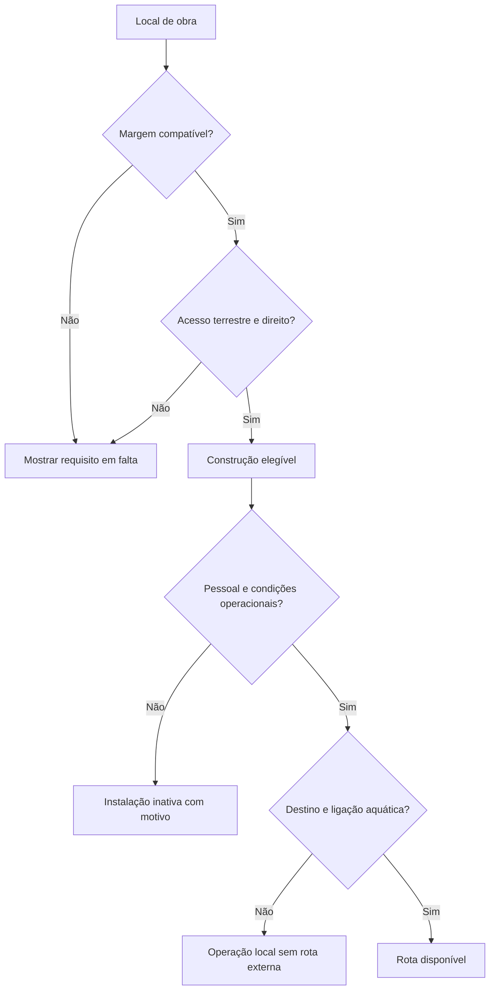
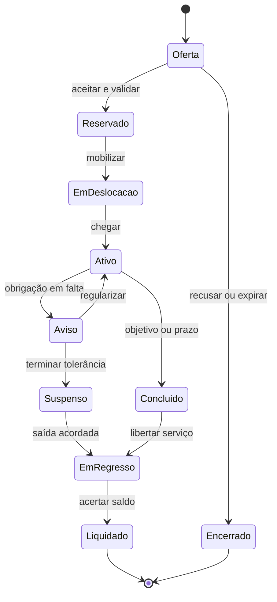

# Empire — Relatório mestre de auditoria e evolução territorial

**Referência: Civilization VII · Território, fundação, recursos, portos, mercenários e diplomacia**  
**Data de corte:** 6 de outubro de 2026  
**Projeto:** [henriquecoding/empire](https://github.com/henriquecoding/empire)  
**Código auditado:** `main`, commit `bafeb112aa6b9b7162d78fe3053da62c9d6c47ec`  
**Natureza:** auditoria documental e estática, investigação de fontes primárias e proposta de design/arquitetura. Não é uma implementação nem um relatório de testes jogados.

> **Recomendação central:** fazer o território determinar possibilidades reais de construção, produção, circulação e negociação. Uma boa localização deve oferecer vantagens compreensíveis e criar dependências interessantes. O sistema deve aprofundar o kingdom-builder de Empire, preservando a base original, o mundo em faixas, a moeda física e o controlo do imperador.

## Índice

1. [Conclusões e prioridades](#1-conclusões-e-prioridades)
2. [Escopo, evidência e limites](#2-escopo-evidência-e-limites)
3. [Decisões do projeto que orientam a proposta](#3-decisões-do-projeto-que-orientam-a-proposta)
4. [Estado real do projeto](#4-estado-real-do-projeto)
5. [Achados da auditoria](#5-achados-da-auditoria)
6. [Civilization VII: referência atual e transferibilidade](#6-civilization-vii-referência-atual-e-transferibilidade)
7. [Modelo territorial recomendado](#7-modelo-territorial-recomendado)
8. [Água, rios, costa e portos](#8-água-rios-costa-e-portos)
9. [Exploração e escolha da base](#9-exploração-e-escolha-da-base)
10. [Influências, produção e equilíbrio ambiental](#10-influências-produção-e-equilíbrio-ambiental)
11. [Negociação com mercenários](#11-negociação-com-mercenários)
12. [Contratos, pagamentos e incumprimento](#12-contratos-pagamentos-e-incumprimento)
13. [Comércio, rotas e autonomia dos povos](#13-comércio-rotas-e-autonomia-dos-povos)
14. [Outras adaptações úteis de Civilization VII](#14-outras-adaptações-úteis-de-civilization-vii)
15. [Experiência de utilização](#15-experiência-de-utilização)
16. [Arquitetura e integração no código](#16-arquitetura-e-integração-no-código)
17. [Dados, geração e persistência](#17-dados-geração-e-persistência)
18. [Infraestrutura, segurança e rastreabilidade](#18-infraestrutura-segurança-e-rastreabilidade)
19. [Plano de implementação e backlog](#19-plano-de-implementação-e-backlog)
20. [Validação e critérios de aceitação](#20-validação-e-critérios-de-aceitação)
21. [Cenário completo de referência](#21-cenário-completo-de-referência)
22. [Decisões recomendadas e limites de escopo](#22-decisões-recomendadas-e-limites-de-escopo)
23. [Fontes e mapa de evidências](#23-fontes-e-mapa-de-evidências)

## 1. Conclusões e prioridades

Empire já tem parte relevante das fundações necessárias: escolha livre do local da sede, assinatura do bioma, floresta persistente, produção por edifício, salários, acampamentos, assentamentos autónomos, vassalos e reservas de subsolo. O problema principal é a ligação entre esses sistemas. Atualmente, a existência de um recurso no bioma não representa necessariamente uma fonte concreta, acessível e explorável junto da base.

O exemplo mais importante está na construção: a assinatura da fundação consulta o local escolhido, mas `Greybox.cabe_no_bioma()` consulta o recurso de um segmento inicial fixo. A mudança de posição da sede desloca postos de construção; não transforma essa verificação inicial numa avaliação geográfica do novo local. Acrescentar um porto sobre esta estrutura prolongaria a inconsistência.

A negociação mercenária tem uma lacuna semelhante. Existem contratação, manutenção e esgotamento dos acampamentos, mas a inspeção não encontrou um motor completo de propostas, contrapropostas, obrigações e desfechos diplomáticos. As probabilidades e dívidas descritas no dossiê não devem ser confundidas com funcionalidade já integrada.

As seis prioridades recomendadas são:

| Ordem | Entrega | Benefício direto |
|---|---|---|
| 1 | Avaliador territorial comum à fundação, construção e produção | O que o jogador vê passa a corresponder ao que pode fazer. |
| 2 | Fontes naturais e água com identidade, acesso e conectividade | Rio, mar, lago, floresta e minério deixam de ser apenas etiquetas de bioma. |
| 3 | Pré-visualização da fundação e das perdas ambientais | Explorar antes de fundar torna-se uma decisão informada. |
| 4 | Contratos mercenários curtos, limitados e explicáveis | O jogador negocia serviço, prazo e responsabilidade, além do preço. |
| 5 | Direitos de passagem, especialização local e primeiras rotas | As limitações da localização criam relações úteis com os povos. |
| 6 | Evolução regional, logística mais profunda e eventos contextuais | Aprofundamento posterior, depois de validar o ciclo básico. |

**A primeira entrega jogável deve ser pequena e completa:** comparar uma margem fluvial, uma costa e um local interior; fundar; desbloquear ou recusar corretamente uma instalação; contratar um serviço; observar produção, custo e consequência; guardar e retomar a partida sem divergência.

Não recomendo começar por combate naval completo, diplomacia entre dezenas de facções, inventário genérico, grandes árvores tecnológicas ou uma conversão do mapa para hexágonos.

## 2. Escopo, evidência e limites

### 2.1 O que foi verificado

| Superfície | Trabalho realizado | Limite da conclusão |
|---|---|---|
| GitHub | Inspeção do repositório, regras, decisões, relatórios, CSV, sistemas e integração; consulta do CI | Revisão aprofundada dos sistemas relevantes, sem leitura exaustiva linha a linha de todo o projeto. |
| Código local | Checkout limpo do commit de produção; inventário com 397 scripts `.gd` em `src` e 246 ficheiros `*test.gd` | Quantidade de ficheiros de teste não equivale a testes executados ou aprovados. |
| Supabase | Projeto ativo, tabelas públicas, RLS, contagens/decisões pertinentes, migrações, funções e alertas | Inspeção autorizada; sem alterações de dados, permissões ou estados do painel. |
| Vercel | Projeto e deployment de produção, configuração e versão publicada | Estado de publicação confirmado; não foi feita uma sessão de jogo no navegador. |
| Civilization VII | Guias, notas de atualização e comunicações oficiais da Firaxis/2K | Referência limitada às publicações disponíveis na data de corte. |

A versão pública em [empire-phi-eight.vercel.app/versao.json](https://empire-phi-eight.vercel.app/versao.json) identificava o mesmo commit auditado, ambiente `production`, ramo `main` e Godot `4.7.2`. O deployment consultado estava `READY`.

O [CI deste commit](https://github.com/henriquecoding/empire/actions/runs/37450524563) estava concluído com sucesso. **A suíte não foi reexecutada durante esta auditoria.** Os achados de integração são sustentados pela leitura do código; os casos de reprodução propostos constam da secção 20.

### 2.2 Como interpretar as afirmações

- **Implementado:** comportamento identificável no código auditado. Não significa que todas as combinações tenham sido verificadas em execução.
- **Decidido:** intenção aprovada em decisões ou respostas do projeto; pode ainda não estar implementada.
- **Parcial:** parte do comportamento existe, mas falta uma ligação ou etapa necessária.
- **Proposta:** recomendação deste relatório. Valores, esquemas, nomes novos e regras novas não substituem automaticamente o cânone.
- **Hipótese de validação:** resultado esperado a medir num protótipo ou teste; não é uma medição já realizada.

O pedido atual autoriza a auditoria e define a direção pretendida — negociação e geografia com consequências. As especificações detalhadas abaixo tornam essa direção concreta e implementável. Não foram criados commits, migrações, deployments ou alterações ao jogo.

## 3. Decisões do projeto que orientam a proposta

O relatório anterior `EMPIRE-MASTER.md` já aborda Civilization e a fundação livre. Este documento aprofunda os contratos entre sistemas e atualiza a leitura à produção de 6 de outubro. Deve ser usado como complemento técnico e de design, não como reinício da visão.

| Decisão ou orientação existente | Consequência para esta proposta |
|---|---|
| A base original permanece; povos conquistados tornam-se vassalos autónomos | Portos e postos avançados não criam automaticamente novas coroas ou capitais jogáveis. |
| O jogador controla imperadores; o modelo antigo de classes separadas foi ultrapassado pela ADR 0052 | Negociação não exige regressar a um personagem diplomata jogável. O diplomata pode ser um agente autónomo. |
| Fundação livre num local fisicamente válido, depois de parar | Recursos escassos podem tornar um local difícil; não devem impor um conjunto de posições pré-marcadas. |
| Caravana inicial e três cidadãos por atribuir | A proposta deve funcionar com esta economia de arranque, sem acrescentar trabalhadores gratuitos para resolver o desenho. |
| Fundação limpa flora comum, protege elementos especiais e não oferece madeira gratuita | A pré-visualização precisa mostrar perdas, sem transformar a clareira inicial num mecanismo de criação de riqueza. |
| Todos os biomas devem admitir sobrevivência por alternativas | Não exigir rio ou minério próprio para ultrapassar etapas universais do reino. |
| Povos e mercenários devem ter ecossistemas e vida próprios | Uma companhia deve ter efetivos, necessidades e memória; não gerar contratos ilimitados. |
| Despertar social depois da fundação, primeira noite e alvorada | Crescimento social não deve depender apenas do momento em que a câmara revela um segmento. |
| Acampamento mercenário atual esgota após três contratações | Companhias persistentes exigem uma decisão de evolução explícita, com tratamento dos saves antigos. |
| Clima geralmente agradável, com variação regional; inverno com alternativas | Não aplicar inverno punitivo uniforme como solução para diferenciar todo o mapa. |
| Feedback recente pede progressão noturna mais gradual | A complexidade económica nova não deve aumentar automaticamente a pressão inimiga inicial. |
| Cooperação e PvP têm regras próprias de reino | Preparar identidade de proprietário e determinismo; não bloquear o primeiro ciclo solo à espera da rede. |

Há também divergências documentais a reconciliar: a Q-221 já tem uma resposta favorável a explorar os recursos antes de fundar, embora um relatório anterior ainda a apresente como pendente. O formato de save atual é **v12**, não v11. Estes exemplos reforçam a necessidade de ligar cada conclusão ao código e à decisão mais recente.

## 4. Estado real do projeto

| Sistema | Estado observado | O que já se pode aproveitar | O que falta para o objetivo |
|---|---|---|---|
| Fundação livre | Implementado | Validade física, proteção de pontos especiais, captura de assinatura | Avaliação funcional do entorno e das ligações. |
| Assinatura da fundação | Parcial | Bioma, recursos declarados, semente, posição e proveniência | Hidrologia, acesso, direitos, fontes concretas; clima ainda assinalado como pendente. |
| Edifícios por recurso | Parcial | `requires_biome_feature` em edifícios | Consulta ao local real e revalidação comum a todos os caminhos de construção. |
| Floresta | Implementação relevante | Árvores persistentes, corte, clareira, efeitos locais | Generalizar com cuidado; medir desempenho do estágio seguinte. |
| Influência espacial | Base existente | Consulta de fontes e previsão de perda | Mais tipos de efeito, métricas de acesso e limites de acumulação. |
| Recursos produtivos | Implementado em parte | Produção, trabalhadores, stock de edifícios e conversão | Proveniência geográfica e capacidade sustentável. |
| Água | Insuficiente para portos | Etiqueta `water` em biomas | Distinguir massa de água, margem, salinidade, navegação e continuidade. |
| Porto funcional | Não identificado no catálogo auditado | Edifícios e interfaces de obra reutilizáveis | Instalação, ancoragem, operação e rede aquática. |
| Mercenários | Recrutamento existente | Contratação com moeda, salários, acampamentos | Proposta contratual, contraproposta, serviço e liquidação. |
| Diplomacia completa | Especificação e backlog | Favor, sinais e parâmetros documentados | Motor integrado e ciclo de missões; UN-18 a UN-21 relevantes. |
| Assentamentos autónomos | Parcial | Tesouro, produção, manutenção, defesa e reparação | Despertar gradual, evolução coerente fora de cena e necessidades territoriais. |
| Vassalagem | Implementação básica | Relação, firmeza e tributo | Especialização e abastecimento com causa física, quando necessário. |
| Comércio | Fórmula económica identificada | Ponto de partida para rendimentos | Não demonstra rede física de transporte ou conservação de carga. |
| Subsolo | Estrutura relevante | Passagens, reservas, área útil, cave e masmorras | Ligar jazidas e acessos sem violar reservas existentes. |
| Estações | Implementadas globalmente | Modificadores, inverno e alternativas produtivas | Clima regional coerente com as decisões recentes. |
| Persistência | Infraestrutura existente, v12 | Migrações e estados serializáveis | Versão territorial, contratos, ligações e proveniência. |

### 4.1 Uma base técnica adequada ao aprofundamento

Empire é um jogo em Godot/GDScript com simulação determinística e mundo 1.5D dividido em `AERIAL`, `SURFACE` e `UNDERGROUND`. As coordenadas, intervalos, passagens e sistemas puros já existentes são uma base mais natural para a proposta do que uma grelha de Civilization.

O projeto também tem uma disciplina útil: dados de balanceamento em CSV, recursos gerados, RNG centralizado, limite de tamanho dos scripts, lógica de simulação sem dependência de cenas e testes para funções públicas. O desenho novo deve respeitar essa estrutura.

## 5. Achados da auditoria

As prioridades abaixo referem-se ao objetivo deste relatório. “Alta” significa que a falha compromete a coerência da mecânica pretendida; não significa incidente de produção confirmado.

### A01 — A elegibilidade de edifícios não acompanha de forma completa a fundação

**Prioridade: alta · Confiança: alta na leitura estática.**

`FoundationChoice.signature_at()` consulta a região/segmento da posição escolhida. Contudo, `Greybox.cabe_no_bioma()` chama `recurso()`, que consulta a constante `enramados_start_base_01`. Existem requisitos reais: pesca depende de água, serraria de floresta e extração de rocha. A lacuna está em onde e quando esses requisitos são avaliados.

`LastCartWatch.reanchor(..., false)` desloca os postos pertencentes ao território da sede, enquanto preserva elementos naturais nos seus lugares. A autorização inicial desses postos não se transforma, por isso, numa autorização baseada no novo recurso local. `BuildSystem.can_climb()` tem verificações importantes de progressão, pessoal e outras condições, mas não resolve sozinho este vínculo geográfico.

**Correção recomendada:** um único avaliador devolve elegibilidade, fonte usada, razão de recusa e modificadores. Fundação, fantasma de construção, pagamento e produção consultam esse contrato. **Aceitação:** mudar a fundação para um local sem acesso à água nunca cria uma pesca ou um porto funcional por herança do segmento inicial.

### A02 — A assinatura do local descreve o bioma, não a economia acessível

**Prioridade: alta.**

Copiar `BiomeData.resources` diz que o bioma pode conter água ou rocha. Não prova que há uma margem utilizável, uma jazida na distância de trabalho ou uma passagem para o subsolo. O campo de clima da assinatura contém um marcador de modelo pendente.

**Correção:** separar a fotografia histórica da fundação de um perfil territorial vivo, calculado a partir de entidades do mundo. **Aceitação:** cortar árvores, perder uma passagem ou negociar acesso altera a capacidade efetiva sem reescrever o bioma histórico da fundação.

### A03 — Água está demasiado agregada para sustentar portos

**Prioridade: alta.**

Os biomas usam a etiqueta `water` para situações distintas. Não há, nessa etiqueta, distinção suficiente entre ribeiro, rio navegável, lago e mar, nem garantia de acesso à margem ou conexão a um destino.

**Correção:** introduzir massas de água, pontos de acesso e ligações navegáveis. **Aceitação:** um lago fechado permite uma instalação lacustre, mas não uma rota marítima; uma costa em falésia exige acesso construído ou natural.

### A04 — A geologia local ainda não determina suficientemente a extração

**Prioridade: média/alta.**

`Cavities` disponibiliza posições de extração nas cavidades sem modelar uma qualidade de jazida concreta por local. A presença de espaço subterrâneo não deve ser equivalente à existência universal de minério explorável.

**Correção:** distinguir cavidade, passagem e depósito. Manter um mínimo de alternativas económicas, evitando que uma mudança de geração invalide progressão obrigatória. **Aceitação:** duas cavidades podem oferecer oportunidades distintas; só uma fonte identificada e alcançável sustenta extração.

### A05 — A influência florestal é uma fundação real, com uma semântica específica

**Prioridade: oportunidade de alto valor.**

`Influence` e `ForestWork` já relacionam árvores com recolha e abrigo de caça, e a interface de fundação antecipa perdas. É uma evidência concreta de que o território já pode produzir consequências.

A proximidade horizontal usada para efeitos ecológicos não deve ser aplicada automaticamente a transporte. Uma floresta pode influenciar habitat mesmo além de uma parede; madeira transportada requer um trajeto válido.

**Correção:** cada regra declara a sua métrica: proximidade ecológica, caminho de trabalho ou conexão logística. **Aceitação:** barreiras não anulam indevidamente habitat, mas impedem recolha sem acesso.

### A06 — Contratação mercenária ainda não é negociação

**Prioridade: alta.**

`Camps`, `RecruitSystem`, `CampLife` e `UpkeepSystem` cobrem aparecimento, preço de recrutamento, manutenção e limite do acampamento. A inspeção não identificou `diplomacy_system.gd` ou `debt_system.gd` como motores completos integrados; sinais e valores CSV não demonstram essa implementação.

**Correção:** contrato explícito com serviço, efetivos, prazo, preço total e obrigações; negociação limitada por interesses da companhia. **Aceitação:** o jogador consegue explicar o que comprou, quando termina e o que acontece se não pagar.

### A07 — A dívida diplomática antiga contém riscos de punição opaca

**Prioridade: média/alta de design.**

O dossiê e os CSV contêm probabilidades de dissolução/contratação/captura, dívida base, juros e consequências progressivas. Estas regras não devem ser transportadas automaticamente para a nova negociação. A dívida de Candeia também não é substituto para um contrato mercenário.

**Correção:** rever o conjunto num ADR de contratos; separar os livros de dívida; tornar obrigações previsíveis e limitar penalizações. **Aceitação:** não há captura aleatória, dívida ou mudança instantânea de dono criada por uma interação que parecia apenas contratar ajuda.

### A08 — Companhias persistentes conflitam com o esgotamento atual

**Prioridade: alta para compatibilidade.**

A regra aprovada de três contratações esgota o acampamento. O caminho de `SettlementWatch.exhaust()` remove unidades locais e arruína estruturas. Não basta adicionar uma interface de negociação e assumir que a companhia continua viva.

**Correção:** preservar acampamentos legados e introduzir uma versão explícita de companhia persistente, ou aprovar uma migração sem perda de estado. **Aceitação:** um save antigo não recupera automaticamente um acampamento esgotado nem perde trabalhadores pela atualização.

### A09 — O despertar social ainda depende da revelação do mundo

**Prioridade: alta para a visão já decidida.**

`Frontier` chama a autoria de assentamentos, que já cria estruturas, tesouro e população. O crescimento depois da primeira noite continua dependente de trabalho previsto em RG-24.

**Correção:** separar geração territorial de calendário social. **Aceitação:** visitar uma aldeia pela primeira vez no dia 10 não a faz nascer nesse instante nem permite duplicar produção passada.

### A10 — Rendimento abstrato não comprova logística física

**Prioridade: média.**

`EconomySystem.trade_income()` calcula rendimento por rotas, dia e rede. É uma fórmula; não é evidência de carga que saiu de um stock, viajou e foi entregue. O tributo dos vassalos também é atualmente mais abstrato do que uma cadeia de abastecimento.

**Correção:** declarar o nível de abstração em cada fase. Quando houver carga física, exigir origem, capacidade, destino e conservação. **Aceitação:** a mesma remessa não alimenta dois destinos nem gera rendimento duplicado durante carga de save.

### A11 — Clima global e intenção regional precisam convergir

**Prioridade: média.**

O sistema atual aplica estações e penalizações de inverno, incluindo produção agrícola e caça. A decisão mais recente favorece clima geralmente agradável e diferenças regionais. Não é suficiente adicionar “frio” à assinatura e manter as mesmas penalizações em todos os locais.

**Correção:** perfis climáticos por região, com transições anunciadas e alternativas reais. **Aceitação:** um bioma quente não perde produção pela mesma regra que um glaciar sem explicação de design.

### A12 — O estado documental não é uma fotografia única e atual

**Prioridade: média operacional.**

Há contagens históricas diferentes de testes, decisões novas já refletidas parcialmente no código e um ramo predefinido de GitHub diferente de `main` na consulta efetuada. O painel tinha 226 respostas: 189 `aplicada` e 37 `nova`. As 37 novas não equivalem a 37 funcionalidades ausentes.

**Correção:** publicar uma matriz decisão → código → teste → commit e um manifesto de validação por revisão. **Aceitação:** qualquer afirmação “implementado” aponta para um commit, sem inferência exclusiva do estado do painel.

## 6. Civilization VII: referência atual e transferibilidade

### 6.1 A versão de referência importa

A referência atual verificada é **1.5.0, de 15 de setembro de 2026, com hotfix de 30 de setembro**. Este último corrigiu, entre outros pontos, a ausência de categorias de recursos necessárias a certos objetivos. A atualização 1.5.0 também permite pagar Influência para permanecer fora de certas guerras de aliados. O ensinamento útil é garantir oportunidades essenciais no mundo e tornar obrigações diplomáticas explícitas. [C1]

**Test of Time**, de 19 de maio de 2026, alterou partes fundamentais do lançamento: continuidade de civilizações entre Eras, objetivos e vitórias, Triumphs e funcionamento dos especialistas. Por exemplo, os especialistas deixaram de oferecer os rendimentos base anteriores e passaram a reforçar em 100% a adjacência do terreno. Não se deve usar o antigo diário de gestão como especificação atual desses números. [C2]

**Arc of Tomorrow e Earthrise foram anunciados para 2027.** Não são funcionalidades disponíveis na versão que serve de base a esta auditoria. [C14]

### 6.2 O que Civilization oferece — e o que seria criação de Empire

Civilization VII distingue relações diplomáticas de Influência, usada em ações diplomáticas. Poderes independentes podem evoluir para relações de cidade-estado com benefícios próprios. Isto inspira interlocutores com interesses e relações persistentes. **Não equivale a um sistema completo de negociação de companhias mercenárias com salários, escolta e cláusulas de risco.** Esse sistema é uma adaptação original aqui proposta. [C3]

O desenho inicial afastou-se da negociação universal de trocas do formato anterior da série, mas não é correto dizer que a versão atual não tem negociação material: a atualização 1.4.2 acrescentou Ouro e Influência aos acordos de paz, em quantidades predefinidas por Era. A escolha por montantes significativos é especialmente útil para uma interface simples de contratos. [C11]

A distinção entre cidades e vilas e a especialização económica reduzem a necessidade de administrar tudo com a mesma intensidade. A transferência adequada para Empire é especializar assentamentos autónomos e vassalos, preservando a sede original. Os recursos atribuídos e rendimentos de Civilization, porém, não equivalem ao stock físico e à moeda de Empire. [C4]

### 6.3 Matriz de adaptação

Nesta tabela, a coluna da direita é uma proposta para Empire; não descreve funcionalidades existentes em Civilization.

| Elemento de referência | Decisão | Adaptação recomendada para Empire |
|---|---|---|
| Terreno condiciona desenvolvimento | Adotar | Fontes e capacidades concretas por local, com custos de acesso. |
| Rios navegáveis e implantação portuária [C13] | Adaptar | Distinguir margem fluvial, costa e lago; exigir acesso e conectividade. |
| Adjacência entre natureza e edifícios [C4] | Adaptar | Regras por intervalo, faixa e caminho, compatíveis com o mundo 1.5D. |
| Vilas especializadas [C4] | Adaptar | Povos e vassalos produtores, defensivos ou comerciais; sem coroas adicionais. |
| Poderes independentes [C3] | Adaptar | Assentamentos com autonomia, necessidades, reputação e contratos. |
| Influência diplomática [C3] | Adaptar com reserva | Usar Favor/relação e obrigações; evitar criar outra moeda obrigatória no primeiro ciclo. |
| Negociações de paz com montantes definidos [C11] | Adotar o princípio | Poucas ofertas compreensíveis, com variação significativa. |
| Custo de neutralidade numa aliança [C1] | Adaptar depois | Cláusulas de defesa e participação em conflitos, claramente delimitadas. |
| Interface de comparação económica [C2, C5] | Adotar | Mostrar capacidade, ganho, manutenção e perda antes de confirmar. |
| Recursos atribuídos a assentamentos | Não copiar literalmente | Manter produção e armazenamento nos edifícios de Empire. |
| Planeamento de redes comerciais | Adaptar por etapas | Começar por direitos e ligações; depois carga limitada e verificável. |
| Comandantes e reforços [C9] | Adaptar | Missões de grupos com capitão; preservar presença física e deslocação. |
| Especialistas urbanos [C2] | Aproveitar a ideia | Oficiais e trabalhadores reforçam uma instalação contextual; sem população abstrata em hexágonos. |
| Triumphs opcionais [C6] | Adaptar | Feitos de exploração, diplomacia e território integrados no livro de feitos existente. |
| Continuidade e sincretismo cultural [C7] | Adaptar | Aprender uma técnica de outro povo sem substituir a identidade do reino. |
| Narrativa emergente [C10] | Adotar seletivamente | Eventos decorrentes de acordos, perdas, recursos e relações reais. |
| Geração mais orgânica com restrições [C8] | Adotar o princípio | Variedade regional com garantias de viabilidade e alternativas. |
| Limites suaves à expansão [C4] | Adaptar depois | Custos de manter postos e rotas; não proibir exploração com um limite artificial de mapa. |
| Unidades navais com papéis diferentes [C12] | Adiar | Primeiro transporte e operação portuária; combate naval só se o ciclo o justificar. |
| Eras e transições globais | Não transplantar | A progressão de Empire pode manter continuidade territorial e dos povos. |
| Grandes sistemas de ciência, religião e condições de vitória | Adiar ou excluir | Só acrescentar quando resolverem uma necessidade própria do projeto. |
| Grelha hexagonal e administração de muitas cidades | Excluir deste plano | A geografia deve encaixar nas faixas e no controlo direto já existentes. |

### 6.4 Lições de experiência e geração

O guia atual de desenvolvimento de assentamentos discute problemas de escolhas pouco diferenciadas e recomendações reduzidas ao maior rendimento. A lição é mostrar o contexto da construção e as consequências de cada alternativa. Empire beneficiaria de três perfis de localização comparáveis, em vez de um número universal de “melhor base”. [C5]

A geração de mapas de Civilization passou a dar maior atenção a formas orgânicas e variedade, preservando restrições necessárias à jogabilidade. Empire pode aplicar esse princípio às transições de bioma, acessos e oportunidades económicas. Não precisa adotar o algoritmo ou a geometria de outro jogo. [C8]

## 7. Modelo territorial recomendado

### 7.1 Seis condições diferentes

Um recurso produz benefício quando passa por seis condições: **existe; é conhecido; pode ser alcançado; o reino tem direito de o usar; existe capacidade de exploração; o resultado chega a quem precisa dele**. A descoberta afeta a informação do jogador; a existência física não deve depender dessa descoberta.

| Camada | Pergunta | Exemplo de falha |
|---|---|---|
| Existência | A fonte está no mundo? | O bioma permite minério, mas este segmento não contém jazida. |
| Conhecimento | O jogador sabe o suficiente? | Há indícios de água, mas a margem ainda não foi visitada. |
| Acesso | Há percurso compatível? | Uma jazida está noutra faixa sem passagem utilizável. |
| Direito | Quem autoriza exploração ou trânsito? | A floresta pertence a um povo com quem não há acordo. |
| Exploração | Há instalação, trabalhador e capacidade? | Existe peixe, mas falta uma posição de pesca operável. |
| Abastecimento | O produto chega ao destino? | Um bloqueio interrompe a rota entre posto e base. |

Um recurso visível não deve conceder imediatamente um bónus ao reino inteiro. Da mesma forma, falta de posse não deve significar impossibilidade absoluta: acordo, compra, tributo ou transporte podem ser alternativas.

### 7.2 Quatro conceitos de dados

| Conceito proposto | Responsabilidade |
|---|---|
| `SiteSignature` | Registo histórico e reproduzível do momento da fundação. |
| `ResourceSource` | Fonte concreta: identidade, posição/faixa, tipo, capacidade, estado e proprietário quando aplicável. |
| `TerritoryProfile` | Capacidades efetivas e impedimentos atuais numa área; derivado do mundo e dos acordos. |
| `AccessGraph` | Ligações válidas entre pontos de trabalho, passagens, ancoragens e destinos. |

O perfil vivo é invalidado por alterações relevantes: corte, obra, passagem fechada, acordo, mudança climática ou perda de controlo. Não deve ser reconstruído integralmente a cada frame.

### 7.3 Recursos, capacidades e materiais não são a mesma coisa

**Materiais existentes** como madeira, minério, peixe, grão e produtos animais continuam a sustentar produção e conversão. **Capacidades** como água doce, solo fértil, abrigo, acesso costeiro ou navegabilidade condicionam atividades. Não precisam tornar-se itens novos no inventário.

| Característica territorial | Capacidade criada | Limite ou custo associado |
|---|---|---|
| Solo fértil | Agricultura eficiente | Exposição, sazonalidade e ocupação de espaço. |
| Floresta | Madeira, abrigo e recolha | Corte reduz efeitos locais; transporte exige acesso. |
| Jazida acessível | Extração de minério | Trabalhadores, passagem e custo de operação. |
| Água doce | Certas atividades agrícolas e assentamento | Não implica pesca abundante nem navegação. |
| Margem navegável | Cais e transporte fluvial | Rede, sazonalidade e capacidade da embarcação. |
| Costa acessível | Porto marítimo e ligação externa | Investimento, acesso terrestre e exposição. |
| Cavidade | Espaço e possibilidade de instalação subterrânea | Reserva útil, entrada e compatibilidade com o terreno. |
| Posição elevada/estreita | Defesa potencial | Menos área útil e maior custo de transporte. |

Nenhuma destas vantagens deve eliminar a necessidade de trabalhadores, manutenção ou armazenamento. A geografia modifica a economia; não a substitui.

### 7.4 Propriedade e alcance

Recomendo separar propriedade territorial de alcance funcional. Um posto pode explorar uma fonte próxima por acordo, sem anexar a aldeia. Uma fonte dentro de território reclamado pode continuar inacessível. O alcance de uma instalação deve ser pequeno e legível; redes mais extensas exigem postos ou transporte.

As distâncias devem usar unidades e regras do projeto. Os raios de Civilization não são valores de balanceamento adequados a Empire. Proximidade horizontal, distância percorrida e distância aquática são métricas diferentes e devem aparecer explicitamente na regra.

### 7.5 Aplicação aos oito biomas já catalogados

Esta tabela parte dos identificadores e recursos de `data/source/biomes.csv`. A coluna de evolução é uma proposta. Vários campos do catálogo, incluindo recursos de alguns biomas, continuam marcados como `_proposed`; a sua presença no CSV não representa aprovação de todos os efeitos sugeridos.

| Bioma / povo | Recursos declarados no catálogo | Evolução territorial recomendada | Dependência a preservar |
|---|---|---|---|
| `ancient_forest` / Enramados | `forest`, `water` | Madeira, recolha e habitat; classificar o lago mencionado no catálogo | Água local não implica saída marítima; minério pode exigir troca. |
| `coast` / Portuários | `water` | Ancoragens costeiras, pesca e serviço portuário | Nem toda a costa é acessível; construção e metal podem vir de fora. |
| `canyon` / Fenda | `rock` | Jazidas e passagens estratégicas | Alimento, madeira e transporte precisam de alternativas. |
| `floodplain` / Horta | `fertile`, `water` | Agricultura, margens e abastecimento regional | Escolher entre área produtiva, circulação e espaço de defesa. |
| `volcanic` / Fornalha | `rock` | Geologia e especialização produtiva | Não introduzir indústria avançada gratuita nem alimentação impossível. |
| `subterranean` / SobRaiz | `fungi` | Ecossistema subterrâneo e aproveitamento de espaço acessível | Luz/acesso e capacidade espacial; fungos funcionais exigem conteúdo próprio aprovado. |
| `glacier` / Geada | `water`, `rock` | Recursos minerais e perfil climático específico | Água congelada não equivale a rota operável; garantir economia alternativa. |
| `marsh` / Bruma | `water`, `fertile` | Fontes húmidas, solo utilizável e passagens particulares | Terreno encharcado não autoriza qualquer edifício ou embarcação. |

O nome do povo não deve funcionar como uma licença universal. Um assentamento Portuário pode ter conhecimento de navegação e ainda precisar de uma margem adequada. Um povo mineiro pode conhecer extração sem transformar toda a rocha em jazida.

### 7.6 Compatibilidade com o mundo contínuo atual

`WorldPlan` organiza povos, trilhos, limiares, terras, fortalezas e bordas, alternando regiões pelos dois lados da origem. O mapa tem limites de campanha. As oportunidades territoriais propostas devem ser distribuídas dentro desse plano, respeitando transições e passagem entre faixas.

Não é necessário mover povos inteiros para oferecer escolhas iniciais. Variação local — clareira com habitat, margem acessível, elevação defensiva, entrada subterrânea — já pode criar opções dentro de uma região. Comparar biomas distantes é uma possibilidade adicional, sujeita ao ritmo de exploração aprovado. A garantia de escolha inicial deve ser definida por percurso e capacidade de sobrevivência, não pela promessa de chegar a qualquer bioma antes da primeira noite.

## 8. Água, rios, costa e portos

### 8.1 Regra fundamental

**Ver água não basta para construir um porto.** É necessário existir uma margem compatível, um local de implantação livre, acesso terrestre e uma ligação aquática adequada à função. A possibilidade de construir, a capacidade de operar e a existência de uma rota são estados diferentes.

Civilization VII permite portos em rios navegáveis desde uma correção de fevereiro de 2025. Isto sustenta a distinção entre rio comum e navegável como referência de design. As regras de profundidade, ancoragem e logística abaixo são propostas para Empire, não uma descrição pormenorizada da simulação de Civilization. [C13]

### 8.2 Tipos mínimos de água

| Tipo | Usos possíveis | Não deve implicar automaticamente |
|---|---|---|
| Ribeira ou curso menor | Água doce; efeitos agrícolas; pesca onde houver habitat | Transporte de carga por barco ou porto. |
| Rio navegável | Cais, transporte fluvial, pesca e travessia | Saída para o mar em todos os trechos. |
| Lago | Pesca; cais lacustre; transporte entre margens existentes | Comércio oceânico. |
| Mar/costa | Porto marítimo, pesca costeira e rotas marítimas | Margem acessível ao nível do solo. |
| Estuário | Ligação fluvial e marítima, se compatível | Água doce em todo o estuário. |
| Pântano | Ecossistema e atividades específicas | Navegabilidade contínua ou solo estável para grandes obras. |

O primeiro modelo não precisa simular fluidos. Basta uma topologia autoritativa, com tipos e estados discretos. Uma classe de navegação — por exemplo, sem navegação, embarcação leve e transporte maior — é suficiente até os testes demonstrarem necessidade de mais detalhe.

### 8.3 Modelo da rede aquática

Uma massa de água tem um identificador estável. As ligações indicam quais os trechos conectados, tipos de embarcação admitidos e impedimentos. Pontos de margem ligam a rede terrestre à aquática. A decoração deve ser gerada a partir desses dados ou validada contra eles; não pode ser a única prova de que ali existe água funcional.



Uma rede parcialmente explorada só permite oferecer destinos conhecidos ou devidamente reportados. A simulação pode conhecer a continuidade do rio; a interface não deve revelar automaticamente uma cidade distante ou uma rota secreta.

### 8.4 Regras de instalação propostas

| Instalação | Requisito espacial | Requisito funcional | Comportamento sem rota externa |
|---|---|---|---|
| Posto de pesca | Fonte de peixe e margem alcançável | Trabalhador e capacidade de exploração | Produção local; não exige porto comercial. |
| Cais fluvial | Ancoragem em rio navegável | Acesso terrestre e classe de embarcação compatível | Embarque local; comércio aguarda destino. |
| Cais lacustre | Ancoragem em lago | Outra margem/destino para transporte | Pesca ou serviço local; sem saída oceânica fictícia. |
| Porto marítimo | Ancoragem costeira apropriada | Espaço, acesso, manutenção e embarcação | Serviço costeiro disponível; exportação aguarda acordo. |
| Travessia por barco | Duas ancoragens ligadas | Operador e percurso válido | Serviço de passagem entre margens. |
| Ponte | Intervalo atravessável e apoios válidos | Obra e compatibilidade com navegação | Liga terreno; não cria porto. |
| Moinho de água, fase posterior | Corrente adequada | Local e atividade compatível | Não usa simplesmente a presença de qualquer água. |

Para o primeiro protótipo, cais fluvial e porto marítimo podem partilhar grande parte do comportamento, diferenciados por dados e aparência. Cais lacustre, ponte e moinho são extensões; não devem atrasar a validação inicial.

### 8.5 Casos que precisam funcionar corretamente

- **Costa com falésia:** o mar existe, mas falta uma ancoragem terrestre acessível. O jogador vê a razão e pode procurar outra margem; uma futura obra de acesso é uma opção de progressão.
- **Rio interrompido:** uma queda de água ou trecho incompatível divide a rede. Não basta partilhar o mesmo nome de rio.
- **Lago isolado:** permite atividade local; uma rota marítima só aparece se houver uma ligação real.
- **Rio junto da base, porto do outro lado:** a propriedade e a passagem continuam relevantes. Proximidade visual não teletransporta trabalhadores.
- **Trecho temporariamente fechado:** suspende a rota, conserva edifício e carga e comunica uma previsão quando disponível.
- **Construção sobre passagem importante:** o validador preserva as regras de acessibilidade e os pontos protegidos já existentes.

O fecho sazonal não deve destruir instantaneamente um porto. Recomendo distinguir `elegível`, `em construção`, `operacional`, `suspenso` e `danificado`. Cada transição deve ter uma causa e uma solução legíveis.

## 9. Exploração e escolha da base

### 9.1 Tornar a exploração útil sem a tornar obrigatoriamente demorada

A decisão de fundar deve ser compreensível com informação local e melhorar com exploração adicional. Um jogador pode aceitar um local suficientemente bom cedo; outro pode arriscar mais tempo à procura de acesso costeiro ou de uma companhia útil.

O ganho de explorar deve ser **encontrar combinações e alternativas**, não descobrir um único local correto escondido. A geração deve oferecer pelo menos duas soluções viáveis com custos diferentes dentro de um percurso inicial razoável. Distância e duração desse percurso são hipóteses de balanceamento a medir.

O ciclo recomendado é: observar sinais naturais; inspecionar uma oportunidade; comparar locais; entender o custo de fundar; confirmar; desenvolver vantagens; negociar aquilo que falta. Depois da fundação, exploração continua a revelar recursos, parceiros e novas rotas.

### 9.2 Informação em três níveis

| Nível | Apresentação | Confiança |
|---|---|---|
| Observado | “Margem navegável acessível”, “floresta próxima” | Confirmado por dados acessíveis ao jogador. |
| Indício | “Vestígios de minério”, “caminho usado por caravanas” | Pista consistente, ainda sem exploração completa. |
| Relato | “Uma companhia refere um cais a leste” | Informação atribuída a uma fonte, com validade e localização aproximada. |

O conhecimento deve persistir entre visitas. Se uma cheia, corte ou bloqueio tornar o relato desatualizado, a interface pode assinalar a última observação, em vez de apresentar um falso facto atual.

### 9.3 Pré-visualização da fundação

A interface existente já mostra árvores removidas, perdas de recolha e abrigo, e pontos preservados. Recomendo ampliá-la com cinco perguntas:

1. **O que posso fazer aqui?** Construções disponíveis e capacidades relevantes.
2. **O que falta?** Recursos sem acesso, margem inadequada ou necessidade de acordo.
3. **O que perco ao fundar?** Vegetação e benefícios removidos pela clareira.
4. **Qual é a fragilidade do local?** Pouco espaço, transporte longo, exposição ou sazonalidade.
5. **Como compensar?** Um parceiro conhecido, acesso por construir ou alternativa produtiva.

Não recomendo mostrar um índice único como “qualidade 92/100”. Pode esconder preferências legítimas: produção inicial, defesa, diplomacia e expansão futura não têm sempre o mesmo peso.

### 9.4 Comparação de quatro locais ilustrativos

Os exemplos abaixo são cenários de design, não mapas nem resultados medidos do jogo atual.

| Local | Vantagem inicial | Dependência criada | Oportunidade posterior | Perfil favorecido |
|---|---|---|---|---|
| Margem fértil | Alimento e acesso fluvial | Madeira mais distante; proteger trabalhadores | Cais e aldeia agrícola parceira | Crescimento e comércio regional. |
| Enseada costeira | Porto e pesca | Construção inicial mais cara; pouco minério | Rotas externas e companhia marítima | Comércio e exploração. |
| Vale florestal | Madeira, recolha e habitat | Importar minério; sem transporte naval | Carpintaria e trocas com outro povo | Economia terrestre e manutenção. |
| Entrada de desfiladeiro | Defesa e depósito acessível | Alimentação e transporte mais exigentes | Metalurgia e contrato de escolta | Defesa e produção especializada. |

Cada local deve oferecer uma forma funcional de atravessar a fase inicial. “Sem mar” significa um ramo económico diferente, não uma campanha incompleta. “Sem minério local” deve permitir obter o necessário por troca, tributo ou uma expedição.

### 9.5 Fundação e permanência

A confirmação consulta novamente o mesmo avaliador usado pela pré-visualização. Se o mundo mudou, a interface atualiza a diferença antes de consumir recursos. A fotografia de fundação preserva o contexto original; as capacidades continuam a mudar com o mundo.

Não proponho deslocar livremente a base depois de fundada. Isso reduziria o peso da escolha e poderia duplicar clareiras, postos e vantagens. A expansão deve ocorrer por obras, postos e acordos a partir da sede original; uma futura mudança de capital seria outra decisão de design.

## 10. Influências, produção e equilíbrio ambiental

### 10.1 Aproveitar o que já existe

A floresta atual oferece uma boa linguagem para o sistema: fontes no mundo, condição de proximidade, efeito limitado e pré-visualização da perda. Os valores observados incluem raios e limiares próprios para recolha e abrigo. Não recomendo reequilibrá-los automaticamente ao acrescentar água ou solo.

O nome `Influence` já tem significado espacial no código. Recomendo reservar **Favor/relação** para diplomacia e **influência territorial** para efeitos ambientais. Isto evita confundir a moeda diplomática de Civilization com o sistema de proximidade existente.

### 10.2 Contrato de uma regra de influência

Cada regra deve declarar: fonte, destinatário, condições, métrica de distância, valor, limite, grupo de acumulação e razão apresentada ao jogador. Efeitos que parecem iguais visualmente podem ter regras diferentes.

| Efeito proposto | Fonte → destinatário | Métrica | Forma de evitar abuso |
|---|---|---|---|
| Recolha florestal | Árvores preservadas → instalação de recolha | Proximidade ecológica existente | Limite por instalação; não multiplicar por cada árvore indefinidamente. |
| Madeira | Árvores exploráveis → serraria | Caminho de trabalho | Capacidade, trabalhadores e fonte identificada. |
| Agricultura | Solo/água apropriados → campo | Área útil e acesso | Um benefício de irrigação por categoria; sem cadeia infinita de adjacências. |
| Pesca | Habitat → posto de pesca | Margem e alcance | Capacidade partilhada por postos que usam a mesma fonte. |
| Mineração | Jazida → extração | Passagem e trajeto | Taxa limitada pela fonte e pela operação. |
| Comércio | Rota ativa → posto comercial | Conexão logística | Rendimento por serviço/remessa real, não por simples proximidade. |
| Proteção | Patrulha contratada → área de serviço | Percurso e presença | Não defender dois locais distantes com a mesma unidade. |

### 10.3 Forma de cálculo recomendada

Uma expressão útil para discutir o modelo é:

`produção efetiva = taxa base × pessoal × condição da fonte × acesso × modificador local limitado`

Todos os fatores devem ter domínio explícito. Ausência de acesso reduz a produção dependente daquela fonte a zero; não é apenas uma pequena penalização. Um modificador local melhora uma capacidade existente, mas não cria peixe onde não há habitat.

Esta expressão é uma proposta conceptual. A implementação deve integrar os fatores já existentes em `EconomySystem`, incluindo estações, crescimento e outros modificadores, sem os aplicar duas vezes. Os multiplicadores novos devem ter teto e ordem documentados. Uma alternativa aditiva pode ser superior quando facilitar a explicação.

### 10.4 Fontes renováveis, finitas e estado ambiental

O primeiro ciclo pode representar **capacidade produtiva** sem introduzir esgotamento permanente em todos os recursos. Isto reduz o risco de campanhas inviáveis antes de existir comércio suficiente.

- Árvores mantêm a persistência já implementada; não adicionar regeneração automática apenas para compensar a nova mecânica.
- Pesca pode começar com uma capacidade sustentável partilhada por instalação e fonte. Sobre-exploração é uma extensão posterior.
- Jazidas podem começar com rendimento limitado e identidade própria. Reserva finita só deve entrar quando existirem alternativas e comunicação suficientes.
- Solo fértil é uma capacidade do terreno, não uma pilha de itens para recolher.

Se houver degradação, o jogador precisa ver a causa, a velocidade e uma resposta possível. Evitar ciclos em que baixa produção causa falta de manutenção, que reduz ainda mais a produção, sem uma saída acessível.

### 10.5 Clima e Podridão

Clima deve alterar oportunidades de regiões específicas com aviso: um rio pode reduzir capacidade, uma região fria exigir reservas, uma costa oferecer períodos melhores de navegação. Não é necessário simular meteorologia contínua para obter estas decisões.

A Podridão pode afetar segurança de acesso ou condição da fonte, desde que isso não duplique automaticamente a pressão noturna. Primeiro deve haver sinais locais e uma ação de recuperação. Cheias, tempestades e contaminação são conteúdo posterior ao funcionamento estável das fontes e rotas.

## 11. Negociação com mercenários

### 11.1 Objetivo da negociação

O jogador deve escolher **que problema quer resolver e que compromisso aceita**. Descontos podem existir, mas o interesse principal está na troca entre preço, prazo, risco, disponibilidade e âmbito do serviço.

Uma companhia de batedores pode conhecer caminhos e preferir contratos curtos; uma companhia defensiva pode aceitar guarnição prolongada em troca de alojamento e previsibilidade. Estas preferências têm de afetar ofertas, sem exigir uma conversa livre gerada por IA.

### 11.2 Identidade mínima de uma companhia

| Campo conceptual | Função |
|---|---|
| Identidade e origem | Continuidade entre encontros e saves. |
| Especialidade | Define vantagens e contratos adequados. |
| Efetivos disponíveis | Impede vender as mesmas unidades várias vezes. |
| Base/acampamento e posição | Localiza recrutamento, regresso e necessidades. |
| Necessidade principal | Dinheiro, descanso, abastecimento, acesso ou proteção. |
| Relação com o reino | Confiança e condições futuras, separadas de uma dívida concreta. |
| Compromissos ativos | Disponibilidade real e incompatibilidade entre trabalhos. |
| Memória contratual | Pagamentos, perdas, conclusão e quebras relevantes. |

No primeiro ciclo, duas especialidades e um conjunto pequeno de necessidades são suficientes. Personalidade não deve significar dezenas de variáveis ocultas.

### 11.3 Serviços recomendados

| Serviço | Resultado contratado | Condição de conclusão | Prioridade |
|---|---|---|---|
| Guarnição temporária | Proteger uma zona definida | Fim do prazo ou condição contratada | Primeiro ciclo. |
| Escolta | Acompanhar pessoa ou remessa por rota acordada | Chegada e entrega confirmada | Primeiro ciclo, inicialmente numa rota simples. |
| Reconhecimento | Revelar acessos e oportunidades de uma área | Relatório entregue | Segundo incremento; depende do modelo de conhecimento. |
| Patrulha de rota | Manter circulação num trajeto | Serviço por períodos definidos | Depois das rotas. |
| Expedição de acesso | Explorar ou proteger passagem/jazida | Marco verificável | Depois do subsolo e das missões. |
| Apoio a cerco | Objetivo militar delimitado | Retirada, vitória ou limite do contrato | Posterior; risco elevado de escopo. |

O reconhecimento não deve revelar tesouros ou inimigos que o grupo nunca alcançou. Uma escolta não deve transformar-se automaticamente em participação em todas as guerras do reino.

### 11.4 Três ofertas úteis em vez de regateio infinito

Na abertura, apresentar até três alternativas comparáveis:

1. **Serviço curto:** menor compromisso total; menor duração e âmbito.
2. **Serviço regular:** melhor custo por período; reserva de efetivos mais longa.
3. **Serviço com contrapartida:** dinheiro mais uma obrigação concreta, como abastecimento ou acesso autorizado.

A contraproposta altera um eixo de cada vez: duração, efetivos, área ou pagamento. Não permite reduzir o preço infinitamente por repetição. O interlocutor explica o fator decisivo: “A rota atravessa território hostil”, “Precisamos de pagamento adiantado” ou “A companhia já tem homens comprometidos”.

A oferta tem identidade, versão e validade. Reabrir a janela ou carregar o save não produz novas condições aleatórias. Quando o contexto mudar, a atualização deve ser explicada.

### 11.5 Avaliação determinística da proposta

O motor deve avaliar remuneração, duração, risco conhecido, distância, necessidade da companhia e histórico. Pode usar faixas de aceitação e contrapropostas por dados. Não precisa simular um negociador humano nem usar um modelo de linguagem.

**Regra essencial:** a IA negocia com informação coerente com o seu conhecimento. Não cobra um prémio por um inimigo secreto que nem o jogador nem a companhia detetaram. Se houver risco adicional desconhecido, ele pertence à incerteza do contrato, não a uma leitura omnisciente do mapa.

O resultado pode ser aceitar, recusar com razão ou devolver uma contraproposta. Sorteios narrativos, quando existirem, usam o RNG autorizado e ficam persistidos no evento; não determinam secretamente a fidelidade de um contrato já aceite.

### 11.6 Relação, reputação e confiança

Recomendo começar com uma relação por companhia e um histórico curto de contratos. Uma reputação global mais detalhada pode esperar.

Cumprir um acordo aumenta a disponibilidade ou reduz certas exigências futuras. Perdas previstas em combate não equivalem automaticamente a traição do empregador; enviar uma escolta para um objetivo não acordado pode ser uma quebra. A regra deve distinguir resultado infeliz de incumprimento.

Boa relação deve abrir opções, não eliminar todos os custos. Uma companhia amiga ainda paga os seus membros e não dispõe de efetivos ilimitados.

## 12. Contratos, pagamentos e incumprimento

### 12.1 Conteúdo mínimo de um contrato

| Grupo | Informação obrigatória |
|---|---|
| Partes | Reino pagador e companhia prestadora. |
| Serviço | Tipo, objetivo, zona e limites da ordem. |
| Efetivos | Unidades reservadas, papel e capacidade mínima. |
| Tempo | Início, períodos pagos, termo e eventual prazo de chegada. |
| Preço | Mobilização, pagamentos periódicos, prémio de risco e teto total. |
| Pagamento | O que foi pago, o que está reservado e o que vence depois. |
| Abastecimento | Quem fornece provisões/equipamento e onde. |
| Desfecho | Sucesso, interrupção, cancelamento, atraso e regra de reembolso. |
| Perdas | Se existe compensação e em que condições; zero também deve ser explícito. |
| Evidência | Versão da oferta, aceite e eventos já liquidados. |

Não introduzir renovação automática silenciosa. Não criar dívida por deixar cair uma moeda perto de um acampamento. A confirmação do contrato deve ser um ato inequívoco dentro do sistema de interação existente.

### 12.2 Exemplo financeiro completo

**Valores exclusivamente ilustrativos, para demonstrar a apresentação e a contabilidade.** Não são preços aprovados nem uma medição do equilíbrio atual.

| Componente | Guarnição de dois guardas, por três períodos diários |
|---|---:|
| Mobilização, paga ao aceitar | 4 moedas |
| Salário por período, para o par | 2 moedas |
| Três períodos de salário | 6 moedas |
| Total contratado | **10 moedas** |
| Pago na aceitação | 4 moedas |
| Restante, explicitamente anunciado | 6 moedas |

Se uma escolta equivalente acrescentar um prémio de risco de 2 moedas pago na aceitação, o total será **12**, o pagamento inicial **6** e o restante **6**. Uma caução que conta para o preço não pode ser somada outra vez ao total.

O CSV atual contém um salário mercenário diário de 1 marcado como proposta; a coincidência com o exemplo não o transforma em decisão aprovada. A implementação deve esclarecer também se o primeiro período começa na aceitação, na chegada ou numa fase do relógio. Recomendo iniciar a cobrança do serviço quando ele estiver disponível, cobrando deslocação separadamente apenas se tiver sido acordada.

### 12.3 Fonte do dinheiro e compatibilidade com a moeda física

O contrato precisa declarar uma fonte de pagamento. No primeiro ciclo, deve usar o mecanismo económico já existente e autorizado pelo reino, sem criar um novo saldo invisível.

Uma reserva de pagamento, quando utilizada, deve transferir ou marcar moedas de forma contabilisticamente real. Não pode manter o dinheiro simultaneamente disponível na bolsa e garantido ao prestador. A criação do contrato, a reserva de efetivos e o débito inicial devem formar uma operação indivisível: ou todos acontecem, ou nenhum acontece.

Fases futuras podem permitir pagamento através de tesouros locais e missões diplomáticas. Isso depende do trabalho de autonomia e orçamento previsto no backlog; não deve ser apresentado como já funcional.

### 12.4 Ciclo de vida



Captura, morte, perda da companhia e cancelamento devem ser eventos explícitos com regras próprias. A representação acima descreve o caminho normal e o incumprimento financeiro; não é uma lista completa de todas as transições militares.

### 12.5 Consequências proporcionais

Recomendo esta sequência para falta de pagamento: aviso com montante e prazo; limitação de novas ordens; suspensão; retirada para local seguro quando possível; consequência na relação; cobrança contratual se estiver prevista.

Não recomendo mudança instantânea de dono, traição aleatória ou juros exponenciais sem teto. Também não recomendo que um pagamento residual de uma moeda reinicie indefinidamente o prazo. Uma renegociação deve alterar o saldo e o calendário uma vez, com condições explícitas.

O contrato deve definir o comportamento se a falta de pagamento ocorrer durante um combate. A saída não pode teletransportar unidades nem surpreender o jogador com uma exceção invisível. O encerramento seguro e a responsabilidade por perdas devem fazer parte dos termos.

### 12.6 Livros separados

Separar pelo menos três conceitos: obrigação mercenária, acordo diplomático e dívida sobrenatural de Candeia. Podem aparecer num resumo comum de compromissos, mas não partilham automaticamente juros, penalizações ou consequências de propriedade.

Prisioneiros, resgate e diplomata capturado são compatíveis com a visão existente, mas pertencem a uma etapa posterior. O primeiro contrato de guarnição não deve depender da implementação de toda essa cadeia.

## 13. Comércio, rotas e autonomia dos povos

### 13.1 A negociação deve resolver limites territoriais

Um reino interior sem costa pode negociar acesso a um porto vassalo ou estrangeiro. Uma base florestal pode trocar produção por minério. Uma companhia pode aceitar escolta de uma rota que também a abastece. Assim, a localização continua importante sem condenar quem não encontrou todos os recursos.

| Acordo | O que concede | O que não concede |
|---|---|---|
| Passagem | Trânsito num percurso definido | Propriedade, extração ou acesso militar ilimitado. |
| Exploração | Uso limitado de uma fonte | Anexação automática do povo proprietário. |
| Serviço portuário | Uso de ancoragem e capacidade contratada | Posse do porto nem ligação a qualquer oceano. |
| Fornecimento | Entrega de quantidade/tipo num período | Duplicação dos recursos que o fornecedor mantém. |
| Tributo | Prestação acordada de um vassalo | Microgestão completa da sua economia. |

### 13.2 Duas etapas de logística

**Etapa inicial:** capacidades locais, direitos e ligações explicáveis; um serviço de transporte simples quando necessário. Se o comércio ainda for abstrato, a interface deve dizer que paga por uma ligação/serviço, sem fingir uma carga que não existe.

**Etapa seguinte:** remessas com origem, destino, quantidade, transportador, estado e eventos de entrega. Madeira, minério, peixe, grão e produtos existentes devem ser suficientes para começar. Não acrescentar uma dúzia de materiais antes de validar o transporte de um deles.

Uma rota precisa respeitar a capacidade do seu trecho mais limitado. Pode ser útil expressar o limite assim:

`capacidade da rota = mínimo entre carga, transporte, porto, passagem e receção`

Os custos devem incluir o que o jogo realmente simula: operação, salários, serviço portuário ou perdas. Não inventar rendimentos para compensar uma cadeia que não fecha economicamente.

### 13.3 Contabilidade e interrupção

Uma remessa sai do stock ou fica formalmente reservada; ao entregar, entra no destino uma única vez. Se for capturada, muda de detentor; se for destruída, a perda fica registada. Cancelar a rota não pode fazer o produto reaparecer na origem depois de já ter chegado.

A atualização fora de cena deve usar o mesmo calendário e as mesmas regras de eventos. Ao reentrar numa área, materializam-se os estados resultantes, não uma segunda simulação do período ausente.

Uma interrupção de água pode conduzir a espera, transbordo ou alternativa terrestre, se existir. O primeiro ciclo pode apenas suspender a operação com motivo legível; desvio automático complexo não é obrigatório.

### 13.4 Povos e vassalos especializados

O código de assentamentos já paga salários, produz, repara e repõe parte da defesa. Isso oferece um ponto de partida para especializações simples: agrícola, florestal, mineira, portuária ou defensiva.

A especialização deve emergir de capacidades locais mais uma escolha ou tendência cultural. Não atribuir um porto funcional a um povo apenas porque se chama Portuários. Identidade cultural e condições físicas podem entrar em tensão e gerar uma missão ou necessidade de acesso.

Vassalagem preserva a autonomia decidida para o projeto. O jogador escolhe acordos e prioridades limitadas; não passa a administrar manualmente cada casa. Custos de distância e defesa podem limitar a expansão de forma orgânica, depois de haver meios claros de os reduzir.

### 13.5 Companhias também vivem no mundo

Uma companhia precisa reservar os próprios efetivos, receber pagamento, recuperar e deslocar-se. A reposição pode ser simplificada, mas não deve ignorar o calendário. Se aceitar dois contratos incompatíveis, o segundo é recusado ou remarcado.

Para companhias móveis, o calendário social deve existir antes da primeira visita, com estado determinístico. O mundo não precisa simular cada passo distante; precisa conservar disponibilidade, posição aproximada, compromissos e eventos relevantes.

## 14. Outras adaptações úteis de Civilization VII

### 14.1 Missões com grupos e comando

Os comandantes de Civilization concentram gestão e progressão militar, incluindo agrupamento e reforços. A transferência útil é reduzir ordens repetitivas através de missões e líderes, sem copiar o empilhamento ou fazer tropas desaparecerem do terreno. [C9]

Empire pode beneficiar de uma ordem de escolta ou patrulha que define objetivo, rota, orçamento e condição de regresso. Um grupo contratado usa esse mesmo mecanismo. O diplomata autónomo pode utilizar a infraestrutura de missão quando UN-18 a UN-21 forem desenvolvidos.

### 14.2 Feitos opcionais de exploração e diplomacia

Triumphs oferecem objetivos opcionais e recompensas, incluindo consequências de progressão entre Eras. A parte transferível é dar reconhecimento a estratégias distintas; a estrutura por Eras não é necessária. [C6]

Usar o livro de feitos existente para objetivos como estabelecer uma rota entre biomas, cumprir vários contratos sem incumprimento ou preservar uma área natural relevante. As recompensas devem ampliar opções ou dar reconhecimento; não tornar obrigatório completar uma lista antes de jogar a economia normal.

### 14.3 Aprendizagem cultural limitada

O sistema atual de continuidade de civilizações e sincretismo de Civilization permite combinar continuidade com elementos de outras tradições. Isso sugere uma evolução por contacto, sem obrigar Empire a trocar a identidade do reino. [C7]

Um acordo prolongado pode ensinar uma técnica de conservação, uma construção ou uma doutrina específica. Recomendo limite de escolhas e custo de adoção, evitando acumular todas as vantagens de todos os povos. A aprendizagem deve depender de uma relação concreta, não apenas de visitar uma fronteira.

### 14.4 Eventos que nascem de causas

Civilization usa eventos narrativos contextuais para reagir a escolhas e condições de campanha. A aplicação mais útil em Empire é ligar texto e consequência a estados já simulados. [C10]

Exemplos: uma companhia propõe melhores condições depois de um contrato cumprido; uma aldeia pede passagem porque perdeu o acesso ao rio; trabalhadores contestam uma exploração que destruiu o seu abastecimento. O evento apresenta uma escolha e modifica um sistema real. Evitar pop-ups que apenas oferecem um bónus aleatório sem relação com o território.

### 14.5 Navegação e conflito posterior

Civilization diferencia papéis de unidades navais e ações marítimas. Isso pode inspirar uma fase avançada, mas a existência de um porto não exige imediatamente batalhas navais, corsários e cercos costeiros. [C12]

A primeira embarcação pode ser um transportador com capacidade, tempo de viagem e estado. Combate naval só deve avançar quando existirem rotas suficientes para justificar decisões próprias e quando a leitura visual do mundo 1.5D estiver resolvida.

## 15. Experiência de utilização

### 15.1 A informação deve aparecer no momento da decisão

Recomendo uma inspeção contextual do local com informação progressiva: uma frase de identidade, duas ou três oportunidades e o impedimento principal. Um detalhe opcional mostra fontes e cálculo. O ecrã não precisa expor classes de código, grafos ou IDs.

Exemplo de apresentação proposta:

> **Margem do rio**  
> Cais fluvial disponível. Pesca possível nesta margem.  
> Falta uma ligação conhecida para iniciar comércio.  
> Fundar aqui remove parte do abrigo da caça.

Exemplo de impedimento:

> **Costa sem acesso**  
> O mar está próximo, mas a falésia impede o acesso à margem.  
> Procure uma ancoragem acessível ou construa um acesso quando disponível.

### 15.2 Camadas de inspeção

| Camada | Mostra | Deve esconder por omissão |
|---|---|---|
| Capacidades | Fontes e construções viáveis | Cálculos extensos. |
| Acessos | Passagens, ancoragens e impedimentos | Destinos ainda desconhecidos. |
| Compromissos | Direitos, contratos e custos próximos | Histórico completo de eventos. |
| Riscos | Mudanças previstas e fragilidades | Probabilidades falsas ou precisão inexistente. |

No telemóvel, estas camadas devem ser alternativas selecionáveis, sem sobrepor várias legendas pequenas. No comando, o foco deve percorrer oportunidades e impedimentos relevantes sem exigir um cursor preciso sobre cada detalhe.

### 15.3 Contrato antes e depois de aceitar

Antes de aceitar, mostrar serviço, unidades, duração, total, pagamento imediato e obrigações futuras. Depois, mostrar estado, localização, próximo vencimento e ação disponível. As consequências de cancelar ficam ao lado da ação, não escondidas numa ajuda geral.

A interface deve manter a linguagem de moeda e os verbos existentes. Uma janela de escolha é aceitável para decisões complexas; não exige acrescentar uma barra permanente de novas moedas ou transformar cada contratação num editor de contratos.

### 15.4 Explicação económica consistente

Pré-visualização e simulação devem partilhar os mesmos resultados. Para produção, apresentar uma decomposição curta, por exemplo: taxa base; efeito do pessoal; efeito do local; impedimento atual. Os termos visíveis usam chaves PT/EN e símbolos acompanhados de texto, sem depender apenas de cor.

Uma promessa da interface é um contrato com o jogador: se disser “cais disponível”, a confirmação tem de validar a mesma regra. Se o contexto mudar, precisa explicar a alteração.

## 16. Arquitetura e integração no código

### 16.1 Princípios de implementação

1. **A simulação decide; a interface apresenta.** Pré-visualização, pagamento e produção consomem resultados do mesmo avaliador.
2. **O mundo físico é a fonte de verdade.** A etiqueta do bioma orienta a geração, mas não substitui fontes e acessos concretos.
3. **Contratos são estado persistente.** Não são apenas descontos temporários aplicados a recrutamento.
4. **Cada evento económico é aplicado uma vez.** Aceitação, cobrança, entrega, reembolso e libertação de efetivos têm identidade.
5. **A primeira versão funciona em solo.** Identidades e intenções preparam coop/PvP sem exigir rede para provar a mecânica.
6. **Dados de balanceamento continuam nos CSV.** Exemplos deste relatório não viram constantes escondidas no código.

### 16.2 Pontos de integração existentes

Os caminhos desta secção são relativos à raiz do repositório; a secção 23 fornece ligações verificáveis ao commit auditado. Os nomes de módulos novos abaixo são sugestões, não ficheiros encontrados.

| Ponto existente | Responsabilidade a preservar | Alteração recomendada |
|---|---|---|
| `src/core/foundation_choice.gd` | Gatilho, validade e confirmação da fundação | Consultar perfil territorial e persistir a fotografia escolhida. |
| `src/ui/foundation_guide.gd` | Pré-visualização de perdas e preservação | Mostrar capacidades e impedimentos usando o mesmo resultado da simulação. |
| `src/sim/systems/site_validator.gd` | Validade espacial e proteção | Compor validade física com requisitos do tipo de instalação. |
| `src/world/greybox.gd` | Autoria inicial de cenário e postos | Retirar do segmento fixo a autoridade final sobre elegibilidade geográfica. |
| `src/core/last_cart_watch.gd` | Reancoragem e fundação | Revalidar posições dependentes de recursos; não deslocar fontes naturais. |
| `src/core/world_works.gd` | Ligação entre obra e mundo | Validar antes de publicar obra e ao confirmar custo. |
| `src/sim/systems/build_system.gd` | Progressão e requisitos de construção | Integrar consulta comum; impedir caminhos que contornam requisitos. |
| `src/sim/systems/influence.gd` | Consulta de efeitos locais | Estender por regras tipadas e métricas distintas. |
| `src/core/forest_work.gd` | Trabalho e efeitos da floresta | Produzir alterações que invalidam perfis, sem duplicar bónus. |
| `src/sim/systems/economy_system.gd` | Produção e stock | Aplicar capacidade efetiva e impedimentos, preservando o resto da fórmula. |
| `src/sim/systems/conversion_system.gd` | Conversão de materiais | Continuar a consumir stock real, incluindo o que chega por entrega. |
| `src/core/camps.gd` | Presença/recrutamento em acampamentos | Diferenciar recrutamento legado de oferta contratual. |
| `src/sim/systems/camp_life.gd` | Contagem e esgotamento | Preservar política antiga e identificar companhias da versão nova. |
| `src/sim/systems/upkeep_system.gd` | Manutenção | Evitar cobrar o mesmo mercenário como salário normal e contratual. |
| `src/core/settlement_watch.gd` | Autonomia de assentamentos | Separar autoria, despertar, evolução e disponibilidade para acordos. |
| `src/core/frontier.gd` | Descoberta e publicação do mundo | Revelar estados persistentes; não recriar produção ou sociedades. |
| `src/sim/systems/vassal_system.gd` | Vassalagem e tributo | Acrescentar especialização/direitos sem perder a base original. |
| `src/sim/systems/under_reserve.gd` | Reserva e compatibilidade subterrânea | Impedir que jazidas/portos violem entradas ou espaço já reservado. |
| `src/core/save_migrations.gd` | Migrações sequenciais | Introduzir a próxima versão livre na implementação e preservar legado. |

### 16.3 Módulos novos sugeridos

| Módulo proposto em `src/sim/systems/` | Entrada | Saída/estado |
|---|---|---|
| `territory_profile.gd` | Área, fontes, acessos, direitos e condições | Capacidades, fontes utilizadas e impedimentos. |
| `placement_rules.gd` | Tipo de edifício, local e perfil | Resultado de elegibilidade e razões localizáveis. |
| `water_network.gd` | Massas, ligações e ancoragens | Conectividade e classes de operação possíveis. |
| `resource_access.gd` | Fonte, instalação, proprietário e caminho | Direito e capacidade de exploração. |
| `mercenary_offers.gd` | Companhia, pedido e contexto conhecido | Ofertas válidas, preço e contraproposta. |
| `contract_ledger.gd` | Aceite e eventos de serviço/pagamento | Obrigações, reservas, saldo e estado contratual. |
| `route_ledger.gd` | Ligações, capacidade e remessas | Operação e entregas, numa fase posterior. |

Não é obrigatório criar todos estes ficheiros de início. A separação ajuda a manter responsabilidades pequenas; a organização final deve respeitar o limite de 250 linhas e evitar classes vazias criadas apenas para reproduzir este diagrama.

### 16.4 Resultado de elegibilidade

Um contrato conceptual suficiente para a interface e a confirmação seria:

```text
PlacementResult
  allowed: bool
  reason_keys: lista de chaves de localização
  source_ids: fontes realmente utilizadas
  access_ids: ligações necessárias
  modifiers: efeitos aprovados por dados
  losses: consequências da implantação
  world_revision: revisão usada na avaliação
```

A revisão ajuda a detetar uma pré-visualização desatualizada, mas não substitui a revalidação na confirmação. A interface nunca envia um `allowed=true` como autoridade; envia uma intenção de construir numa posição.

### 16.5 Desempenho e atualização fora de cena

A simulação atual opera a 30 Hz. Não há razão para procurar rotas completas ou recalcular todas as influências a essa frequência.

- Indexar fontes e pontos de acesso por região/intervalo e faixa.
- Recalcular perfis apenas por mudanças relevantes, com caches identificadas por revisão.
- Agendar cobrança, produção distante e expiração por fases/instantes do relógio.
- Materializar unidades próximas; representar grupos distantes por estado e eventos equivalentes.
- Processar eventos simultâneos numa ordem determinística definida, usando IDs estáveis para desempate.

Para equivalência fora de cena, a aproximação deve conservar as variáveis relevantes: saldo, efetivos, carga, posição lógica, compromisso e perdas. Não é necessário conservar cada animação ou passo. RG-24 já exige atenção à equivalência de níveis de simulação; este trabalho deve integrar essa linha.

### 16.6 Determinismo, ordem e multijogador futuro

Geração e negociação usam apenas os mecanismos de RNG autorizados pelo projeto. A mesma semente, calendário e sequência de intenções devem produzir o mesmo resultado. IDs não podem depender da ordem de visita aos segmentos.

Reservas de contrato precisam resolver concorrência: se dois jogadores tentarem contratar os mesmos guardas, só uma aceitação válida reserva os efetivos. Uma oferta apresentada não é uma reserva infinita. Preparar este contrato em solo simplifica a implementação futura de coop/PvP.

Não recomendo enviar cada tick para Supabase nem usar o browser como nova autoridade paralela da simulação. A arquitetura de rede pertence ao trabalho específico de RG-25.

## 17. Dados, geração e persistência

### 17.1 Catálogo proposto

Os nomes abaixo são sugestões de tabelas fonte; devem ser ajustados ao esquema atual e documentados antes da geração de `.tres`.

| Tabela conceptual | Exemplos de campos | Validação necessária |
|---|---|---|
| Fontes territoriais | Tipo, capacidades, faixa, regime de renovação | Tipo conhecido; capacidade não negativa. |
| Requisitos de instalação | Edifício, capacidade, acesso, distância, exclusões | Edifício existe; métricas compatíveis. |
| Tipos de água | Navegação, salinidade, usos admitidos | Nenhuma equivalência implícita entre água e navegação. |
| Regras de influência | Fonte, destinatário, efeito, limite, acumulação | Ausência de ciclos produtivos e acumulação sem teto. |
| Arquétipos de companhia | Especialidade, efetivos, preferências | Contratos admitidos e limites consistentes. |
| Modelos de contrato | Serviço, termos, pagamentos, cancelamento | Total calculável; condição de término obrigatória. |
| Perfis regionais | Geração, clima, acessos mínimos, alternativas | Viabilidade inicial e diversidade. |

Campos experimentais seguem a prática `_proposed`. As alterações devem atualizar o esquema e a documentação de conteúdo. Textos de interface ficam em `data/i18n/strings.csv`, com PT/EN.

### 17.2 Geração com diversidade e garantias

O gerador deve criar diferenças de verdade, mas impedir bloqueios básicos. Garantir uma oportunidade funcional não significa colocar todos os recursos ao lado da caravana.

Invariantes recomendadas para novas partidas:

- Existe uma fundação fisicamente válida e alcançável no percurso inicial.
- Existe pelo menos uma cadeia económica compatível com a sobrevivência inicial aprovada.
- Uma necessidade universal pode ser satisfeita localmente ou por uma alternativa alcançável em tempo útil.
- Há escolhas com vantagens e custos distintos; nenhum local precisa reunir todas as capacidades.
- Ancoragens, passagens, fontes e elementos visuais concordam entre si.
- A ordem de exploração não altera identidades nem oportunidades previamente determinadas.
- O despertar dos povos respeita fundação, noite e alvorada, preservando exceções legadas.

Uma estratégia útil é gerar oportunidades e depois validar restrições; se falhar, reparar a menor parte necessária de forma determinística. Não reconstruir silenciosamente toda a região ao carregar uma partida.

### 17.3 Estado que deve ser guardado

| Área | Estado persistente essencial |
|---|---|
| Geração | Semente, versão do gerador e identidades estáveis. |
| Fundação | Posição, assinatura, proveniência e consequências já aplicadas. |
| Fontes | Estado alterado, capacidade/reserva quando aplicável e titularidade. |
| Água | Topologia autoritativa ou referência versionada, obras e interrupções. |
| Conhecimento | Fontes descobertas, relatos e última observação relevante. |
| Direitos | Partes, âmbito, validade e suspensão. |
| Companhias | Efetivos, posição lógica, estado e compromissos. |
| Contratos | Termos aceites, pagamentos, reservas, calendário e eventos concluídos. |
| Transporte | Carga, detentor, origem, destino e entregas realizadas. |
| Simulação distante | Último instante processado e eventos pendentes. |

Caches deriváveis não devem ser tratadas como uma segunda fonte de verdade. Podem ser reconstruídas, desde que usem os mesmos dados persistentes.

### 17.4 Migração dos saves v12

A próxima versão concreta deve ser atribuída durante a implementação, depois de confirmar o estado do ramo. Este relatório não reserva automaticamente o número 13.

Regras recomendadas:

1. Preservar posição da sede, unidades, stocks, floresta e reservas subterrâneas.
2. Não interpretar `PENDING_CLIMATE_MODEL` como um clima conhecido.
3. Não criar mar, jazidas ou árvores apenas para justificar uma instalação antiga.
4. Marcar instalações legadas cuja elegibilidade não possa ser reconstruída com confiança; preservar operação por uma regra de compatibilidade explícita, quando necessário.
5. Aplicar requisitos novos às construções novas; documentar exceções de legado na inspeção técnica, sem confundir o jogador com IDs.
6. Não repetir a clareira inicial nem oferecer madeira retroativa.
7. Preservar acampamentos esgotados e sociedades já existentes nos saves antigos.
8. Não converter automaticamente recrutados antigos em contratos com dívida.
9. Migrar de forma idempotente: repetir a migração não cria novas fontes, pagamentos ou companhias.

Uma instalação antiga tolerada por compatibilidade não deve propagar essa exceção para novas cópias. A proveniência diferencia conteúdo legado de nova construção válida.

## 18. Infraestrutura, segurança e rastreabilidade

### 18.1 Supabase: função atual e fronteira recomendada

O projeto Supabase consultado estava ativo. O esquema público observado contém `empire_admins`, `empire_feedback` e `empire_respostas`, com RLS ativa. Não foram identificadas Edge Functions na listagem consultada. Isto sustenta uma função atual de administração, respostas e feedback, não a conclusão de que a simulação do jogo já depende de um servidor Supabase.

As 226 respostas observadas estavam repartidas em 189 aplicadas e 37 novas. A consulta foi usada para decisões pertinentes; não é necessário incluir contactos pessoais de feedback neste relatório.

Recomendo manter a economia territorial e os contratos na simulação persistente do jogo. Supabase pode apoiar feedback, gestão de conteúdo aprovado ou telemetria consentida, quando isso for uma necessidade definida. Não é necessário criar tabelas remotas para cada árvore ou salário para entregar esta proposta.

### 18.2 Alertas de segurança: leitura proporcional à evidência

O advisor devolveu avisos de funções `SECURITY DEFINER` executáveis por papéis públicos e proteção contra palavras-passe comprometidas desativada. Foram inspecionadas as definições relevantes; não foi demonstrada exploração.

| Observação | Evidência contextual | Ação recomendada |
|---|---|---|
| `empire_e_admin` com `SECURITY DEFINER` | Função SQL estável, `search_path` vazio, consulta a associação administrativa por `auth.uid()`; usada nas políticas | Rever permissões necessárias e manter teste de acesso por papel. Não remover cegamente uma função necessária à RLS. |
| `rls_auto_enable` com `SECURITY DEFINER` | Função do tipo `event_trigger`, com `search_path=pg_catalog`, destinada a ativar RLS em tabelas | Confirmar grants e associação ao trigger. Não concluir, apenas pelo aviso, que é uma RPC arbitrariamente explorável. |
| Proteção de passwords comprometidas desativada | Aviso do advisor de Auth | Rever e ativar quando aplicável ao fluxo de autenticação adotado. |
| Inserção pública de feedback | Política limita estado inicial e impede campos administrativos na inserção | Verificar controlo de abuso no fluxo efetivo, sem bloquear o canal legítimo por suposição. |

As políticas observadas limitam leitura/gestão de respostas aos administradores e a consulta de `empire_admins` ao próprio utilizador autenticado. Esta é uma fotografia da consulta, não uma certificação global de segurança. Não foram alteradas funções, permissões ou políticas. Documentação de referência: [S1], [S2], [S3].

### 18.3 Vercel e publicação

`vercel.json` descreve a construção com `bash tools/web/construir.sh` e saída `build/site`; o projeto publica o site e o export web do Godot. Não deve ser tratado como uma aplicação Next.js por defeito.

O estado `READY`, o manifesto público e o CI concordavam no commit auditado. Isso confirma rastreabilidade de publicação, mas não prova que todos os fluxos de jogo funcionem visualmente. A próxima implementação precisa de uma verificação do export web, incluindo controlos móveis e persistência, além dos testes de simulação.

### 18.4 Documentação e governação técnica

Recomendo reconciliar o painel e os relatórios por decisão, sem marcar em massa tudo como aplicado. Cada linha deve guardar referência da decisão, implementação, teste e revisão. O mesmo se aplica a números de testes: usar o artefacto do CI dessa revisão e explicitar testes descobertos, executados, aprovados e ignorados.

O ramo predefinido consultado no GitHub não era `main`, embora produção e esta auditoria estejam em `main`. Rever se isso é intencional para evitar que futuras auditorias e contribuições usem uma base diferente. A alteração não foi feita nesta sessão.

Os ficheiros de `docs/design/` são gerados a partir do dossiê. Uma implementação aprovada deve atualizar a fonte correta e regenerar esses documentos; editar apenas os ficheiros gerados criaria uma nova divergência.

## 19. Plano de implementação e backlog

### 19.1 Sequência recomendada

| Fase | Entrega | Saída verificável | Dependência |
|---|---|---|---|
| 0 — Reconciliação | Decisões, estados, versão e vocabulário | Matriz de verdade e ADRs do escopo novo | Nenhuma mudança de gameplay necessária. |
| 1 — Território funcional | Fontes, acesso e avaliador de implantação | Pesca, madeira e minério consultam a localização efetiva | Fase 0. |
| 2 — Água e escolha da base | Rede simples, ancoragens, cais/porto e pré-visualização | Comparação de local interior, fluvial e costeiro funciona | Fase 1. |
| 3 — Contrato mercenário | Companhia, guarnição/escolta, pagamento e término | Um contrato completo sobrevive a guardar/carregar | Fase 1; usa Fase 2 quando aquático. |
| 4 — Relações territoriais | Direitos, especialização, despertar e transporte simples | Dependência local resolvida por acordo verificável | Fases 2 e 3; integração RG-24 e UN pertinentes. |
| 5 — Profundidade | Reconhecimento, clima regional, eventos e aprendizagem | Estratégias distintas com custos claros | Evidência de playtest das fases anteriores. |
| 6 — Expansões | Logística maior, combate naval, coop/PvP | Apenas se justificadas pelo uso e pelo desempenho | Arquitetura própria e decisão específica. |

Não atribuo prazos em dias sem medir capacidade da equipa, cobertura reutilizável e produção de arte. O risco maior não é a quantidade de campos; é a integração com geração, reancoragem, economia e save. As fases devem ser entregues por ciclos completos, não por sistemas isolados sem utilização.

### 19.2 Tickets propostos

Os identificadores `AUD-CIV-*` são rascunhos deste relatório. Não foram criados no repositório nem substituem os tickets existentes.

| Ticket | Objetivo | Critério de conclusão | Dependências |
|---|---|---|---|
| AUD-CIV-01 | Reconciliar decisões e estados | Q-221, save v12, regras de acampamento e fontes de verdade alinhadas | Nenhuma. |
| AUD-CIV-02 | Inventariar capacidades e fontes | Água, floresta e rocha deixam de depender apenas da etiqueta do bioma | 01. |
| AUD-CIV-03 | Avaliador comum de implantação | Prévia e confirmação devolvem o mesmo resultado e razão | 02. |
| AUD-CIV-04 | Corrigir ligação da reancoragem à geografia | Nova sede não herda autorização indevida do segmento inicial | 03. |
| AUD-CIV-05 | Rede de água mínima | Rio navegável, costa e lago têm conectividade distinta | 02. |
| AUD-CIV-06 | Cais e porto por dados | Construir, operar e abrir rota são estados separados | 03, 05. |
| AUD-CIV-07 | Comparação territorial na fundação | Mostra capacidades, perdas e dependências; confirmação revalida | 03–06. |
| AUD-CIV-08 | Regras ambientais generalizadas | Efeitos limitados, métricas corretas e sem duplicação da floresta | 02, 03. |
| AUD-CIV-09 | Companhia e ofertas | Efetivos finitos, ofertas persistentes e motivos legíveis | 01; regra de legado decidida. |
| AUD-CIV-10 | Contrato e livro de obrigações | Aceitação, cobrança, prazo e término idempotentes | 09. |
| AUD-CIV-11 | Guarnição e escolta | Cumprimento ligado a unidades e percurso reais | 10; missão mínima. |
| AUD-CIV-12 | Migração e compatibilidade | Saves v12 preservam sede, economia, acampamentos e subsolo | 04–11; desenvolvido em conjunto, não só no fim. |
| AUD-CIV-13 | Direitos de uso e passagem | Acordo desbloqueia uma capacidade concreta e revogação é explicada | 03, 10. |
| AUD-CIV-14 | Despertar e evolução distante | Calendário social independente da primeira visita | RG-24; 02, 09. |
| AUD-CIV-15 | Remessa e transporte | Conservação de stock e entrega única | 06, 11, 13. |
| AUD-CIV-16 | Especialização de vassalos | Uma dependência económica resolvida sem microgestão de outro reino | 13–15. |
| AUD-CIV-17 | Export web e interação móvel | Fluxo completo legível, controlável e persistente | Primeiro ciclo integrado. |
| AUD-CIV-18 | Playtest e equilíbrio | Comparação de estratégias, compreensão e custos registados | 07, 11, 12, 17. |

### 19.3 O que constitui o primeiro ciclo completo

O primeiro ciclo fica pronto quando uma nova partida oferece escolhas territoriais distintas; a prévia informa; a fundação preserva o lugar; uma instalação usa a fonte correta; uma companhia vende um serviço delimitado; as moedas e os efetivos são contabilizados; guardar/carregar mantém o resultado; e o mesmo fluxo funciona no export web.

Pode usar arte provisória autorizada e poucas variantes de conteúdo. Não pode depender de bónus falsos, portos sem água funcional ou contratos que existem apenas num painel.

## 20. Validação e critérios de aceitação

### 20.1 Matriz de testes proposta

Estes são testes a implementar/executar durante o desenvolvimento. **Não foram executados nesta auditoria.** A exigência de testes para funções públicas de simulação vem das regras do repositório.

| ID | Cenário | Resultado exigido |
|---|---|---|
| T01 | Fundação em dois biomas na mesma partida de referência | Cada perfil reflete a posição efetiva. |
| T02 | Fundação distante do segmento inicial | Nenhum requisito usa implicitamente o recurso inicial. |
| T03 | Local pobre mas fisicamente válido | Pode fundar, com dependências explicadas. |
| T04 | Sede sobre ponto protegido | Recusa preservando regra existente e sem cobrar. |
| T05 | Clareira inicial | Perda prevista igual à aplicada; nenhuma madeira gratuita. |
| T06 | Fonte próxima sem passagem entre faixas | Produção dependente bloqueada por acesso. |
| T07 | Reabertura de passagem | Capacidade recupera sem recriar a fonte. |
| T08 | Árvores além de uma parede | Habitat segue regra ecológica; transporte segue caminho. |
| T09 | Duas instalações sobre a mesma fonte | Respeitam capacidade partilhada e limites de acumulação. |
| T10 | Corte entre prévia e confirmação | Resultado atualizado antes da ação irreversível no jogo. |
| T11 | Ribeira não navegável | Água doce não autoriza cais de carga. |
| T12 | Rio navegável com margem livre | Cais elegível; rota depende ainda de destino. |
| T13 | Lago fechado | Serviço local possível; rota marítima impossível. |
| T14 | Costa com falésia | Exige ancoragem/acesso adequado. |
| T15 | Estuário | Usa continuidade e salinidade corretas, sem duplicar capacidades. |
| T16 | Obstáculo aquático | Divide percursos conforme a classe de embarcação. |
| T17 | Fecho temporário de trecho | Suspende operação, preserva edifício e carga. |
| T18 | Destino não descoberto | Interface não revela informação indevida. |
| T19 | Construção por caminho alternativo de código | Não contorna requisitos do avaliador. |
| T20 | Alteração de estação regional | Só aplica fatores apropriados; mantém alternativas. |
| T21 | Reabrir oferta/carregar save | Termos iguais enquanto o contexto não muda. |
| T22 | Duas aceitações para os mesmos mercenários | Uma reserva válida; sem duplicar unidades ou pagamento. |
| T23 | Falta de moedas na aceitação | Nenhum débito parcial nem efetivos presos. |
| T24 | Pagamento inicial | Total e saldo remanescente calculados uma vez. |
| T25 | Alvorada repetida por reload | Cobrança não é duplicada. |
| T26 | Mercenário contratual com manutenção normal | Salário não é cobrado duas vezes. |
| T27 | Fim do prazo | Serviço termina sem renovação oculta. |
| T28 | Incumprimento | Aviso, prazo e consequência correspondem aos termos. |
| T29 | Pagamento residual repetido | Não prolonga tolerância infinitamente. |
| T30 | Falta de pagamento em combate | Comportamento previsto, sem teletransporte ou traição arbitrária. |
| T31 | Perda de unidade durante serviço | Aplica cláusula de perdas sem recriar unidade. |
| T32 | Cancelamento antes e depois de mobilizar | Reembolso e custos correspondem ao estágio real. |
| T33 | Missão muda para fora do âmbito | Exige novo acordo ou recusa explicada. |
| T34 | Companhia sem efetivos suficientes | Recusa ou oferece composição válida. |
| T35 | Acampamento legado com três contratações | Mantém estado de esgotamento após migração. |
| T36 | Fonte estrangeira com direito negociado | Produção habilita apenas no âmbito concedido. |
| T37 | Expiração/revogação de passagem | Rota atualiza sem destruir bens silenciosamente. |
| T38 | Remessa entregue e save recarregado | Stock e rendimento aplicados uma única vez. |
| T39 | Remessa capturada | Conservação de quantidade e detentor. |
| T40 | Aldeia visitada tarde | Estado social segue calendário global, não a hora de visita. |
| T41 | Mundo antes do despertar | Respeita regra de novas partidas e exceções legadas. |
| T42 | Simulação próxima versus distante | Mesmo saldo, efetivos, carga e eventos finais relevantes. |
| T43 | Duas ordens de exploração da mesma semente | Mesmas fontes e identidades físicas. |
| T44 | Save v12 migrado duas vezes | Sem duplicação de fontes, moeda, clareira ou sociedade. |
| T45 | Instalação legada tolerada | Exceção não permite construir cópias inválidas. |
| T46 | Fonte junto de cave/masmorra reservada | Não viola entrada nem área útil subterrânea. |
| T47 | Teclado, comando e toque | Todas as decisões essenciais são alcançáveis e legíveis. |
| T48 | Export web guardar/carregar | Contrato e perfil territorial persistem corretamente. |
| T49 | PT/EN e razões de recusa | Não aparecem chaves internas nem texto cortado em ações críticas. |
| T50 | Eventos simultâneos de entrega, cobrança e fim | Ordem determinística e saldos conservados. |

### 20.2 Testes de propriedades e geração

Além de cenários específicos, testar conservação de moeda/carga, unicidade de fontes/contratos e equivalência de ordem de geração. Uma campanha de **1.000 sementes** é uma proposta de cobertura para a validação do gerador, não um teste já realizado nem garantia estatística suficiente por si só.

Registar sementes que falham e reduzir o caso até uma reprodução pequena. Verificar especialmente extremos: pouco espaço, várias passagens próximas, costa sem ancoragem, misturas de bioma e fronteiras entre faixas. Não corrigir uma semente problemática apenas deslocando o jogador para um local privilegiado sem regra geral.

### 20.3 Playtests orientados a decisões

| Hipótese | Como medir | Sinal de revisão |
|---|---|---|
| O jogador compreende a vantagem do local | Pedir que explique duas vantagens e uma dependência antes de fundar | Escolha baseada apenas em estética ou tentativa/erro. |
| Existem estratégias distintas | Observar escolhas em várias sementes e perfis de jogador | Um tipo de local domina quase todas as escolhas. |
| O contrato é compreensível | Perguntar total, prazo e consequência de atraso | Confusão entre depósito, preço total e salário. |
| Explorar compensa sem se arrastar | Medir tempo até fundação e descobertas que alteram a decisão | Procura exaustiva obrigatória ou fundação sem interesse. |
| Uma deficiência territorial tem saída | Acompanhar uma campanha sem recurso local importante | Bloqueio de progressão ou solução universal demasiado barata. |
| A camada nova preserva o ritmo | Observar noites iniciais, interrupções e tempo em menus | Sobrecarga de decisões antes de dominar o ciclo básico. |

Como ponto de partida, pode-se procurar compreensão correta em pelo menos 8 de 10 sessões de teste iniciais. É um limiar proposto para revisão qualitativa, não uma estimativa de toda a população de jogadores. Desempenho deve ser comparado com uma linha de base medida no mesmo dispositivo; nenhum ganho de desempenho é afirmado neste relatório.

### 20.4 Gate de conclusão

A entrega só deve ser considerada concluída quando código, dados, documentação, migração e interface concordarem. CI aprovado é necessário, mas não substitui o cenário jogado no export web. A documentação de validação deve apontar para o commit exato e distinguir casos automatizados de verificações manuais.

## 21. Cenário completo de referência

Este cenário descreve o comportamento desejado e pode orientar uma demonstração integrada.

**Exploração.** A caravana encontra um vale com floresta e uma margem fluvial fértil. O primeiro oferece madeira e habitat; o segundo oferece agricultura e um cais possível. Um relato indica minério a leste, mas a passagem ainda não foi inspecionada.

**Comparação.** Na margem, a prévia mostra que a clareira remove parte da cobertura de caça. O cais será construível, mas ainda não há rota externa conhecida. O vale não terá navegação; a sua produção inicial será menos dependente de transporte de madeira.

**Fundação.** O jogador escolhe a margem. A assinatura guarda esse momento; a floresta efetivamente removida coincide com a prévia. Nada desloca a jazida, o rio ou as passagens para acompanhar a sede.

**Despertar.** Depois do gatilho social aprovado, uma companhia e um povo vizinho evoluem segundo o calendário global. A primeira visita revela o estado que já lhes corresponde, sem produção retroativa duplicada.

**Negociação.** A companhia oferece guarnição curta e uma escolta. O jogador precisa de madeira e aceita escolta até uma floresta acessível por acordo. Os termos mostram pagamento inicial, salários, área e término. A companhia reserva efetivos reais.

**Operação.** O cais tem pessoal e acesso, mas só abre comércio quando um destino é conhecido e aceita a ligação. A entrega retira madeira da origem e acrescenta-a à base uma vez. A escolta termina no marco acordado e as unidades regressam.

**Mudança.** Uma condição temporária suspende um trecho do rio. O porto continua construído; a interface mostra o motivo e a carga aguarda. Uma ligação terrestre conhecida pode ser contratada, com custo superior, sem criar recursos adicionais.

**Persistência.** O jogador guarda e retoma. Mantêm-se a dívida já paga, o calendário do serviço, a carga, as árvores cortadas e a origem dos recursos. Nenhum evento cobra ou produz uma segunda vez.

O resultado pretendido é uma história produzida por decisões compreensíveis: a margem foi escolhida pelo futuro fluvial, a falta de madeira criou um acordo, o acordo tornou a escolta valiosa e a interrupção do rio gerou uma alternativa. Não foi necessário acrescentar um sistema 4X completo.

## 22. Decisões recomendadas e limites de escopo

### 22.1 Proposta de decisão para o próximo ciclo

| Tema | Recomendação | Estatuto |
|---|---|---|
| Geografia | Fonte concreta + acesso + direito + exploração | Proposta técnica que operacionaliza o pedido atual. |
| Fundação | Livre em local fisicamente válido, com consequências visíveis | Preservação de decisão existente. |
| Base original | Continua a ser a sede; postos e vassalos complementam | Preservação de decisão existente. |
| Água | Separar curso menor, navegável, lago e mar | Proposta. |
| Porto | Construção, operação e rota avaliadas separadamente | Proposta. |
| Recursos | Usar materiais existentes; capacidades ambientais não viram novas moedas | Proposta de contenção de escopo. |
| Mercenários | Ofertas limitadas, contrato explícito e efetivos finitos | Proposta central. |
| Relações | Favor/histórico simples antes de reputação global complexa | Proposta. |
| Incumprimento | Aviso, prazo, suspensão e consequência previsível | Proposta que exige revisão das regras históricas incompatíveis. |
| Acampamentos | Legado preservado; companhia persistente versionada | Proposta de compatibilidade, sem revogação silenciosa da regra antiga. |
| Clima | Perfis regionais e alternativas antes de catástrofes | Alinhamento com decisões recentes; detalhes por aprovar. |
| Rede | Preparar identidades e autoridade; entregar solo primeiro | Proposta de sequência. |

### 22.2 O que não deve entrar por acidente

- Um requisito universal de mar, rio ou minério próprio para concluir a progressão básica.
- Outra moeda obrigatória apenas para imitar Influência de Civilization.
- Um inventário genérico do imperador que substitua os stocks e a moeda física.
- Uma segunda base soberana criada automaticamente por comércio ou vassalagem.
- Companhias infinitas, salários invisíveis, renovação automática ou traição não anunciada.
- Bonificações multiplicativas sem teto e fontes duplicadas por reancoragem ou save.
- Combate naval, fluidos, mundo hexagonal ou grandes árvores tecnológicas como pré-requisito para construir o primeiro cais.

### 22.3 Ordem de decisão quando houver conflito

O pedido atual determina a direção nova. As decisões explícitas anteriores continuam a orientar identidade, fundação, vassalos e controlo do personagem. O código auditado determina o que já funciona; não transforma automaticamente uma implementação parcial na regra desejada. Este relatório identifica propostas e incompatibilidades para que os próximos ADRs possam ser concretos.

Para iniciar implementação, o conjunto mais importante a consolidar é: contrato territorial, política de portos, modelo de serviço mercenário e tratamento dos acampamentos legados. Não é necessário decidir agora todos os valores finais, eventos ou tipos de embarcação.

## 23. Fontes e mapa de evidências

### 23.1 Fontes primárias de Civilization VII

Consultadas em 6 de outubro de 2026. Páginas de atualização e guias podem mudar depois desta data. Os diários em `/archive/` são utilizados para intenção e estrutura; regras substituídas por atualizações posteriores não foram tratadas como atuais. As referências `[C…]` ao longo do texto remetem para esta lista.

| Ref. | Fonte oficial | Uso neste relatório |
|---|---|---|
| C1 | [Notas atuais: 1.5.0 e hotfix de 30 de setembro](https://civilization.2k.com/civ-vii/game-update-notes/) | Recorte temporal, neutralidade em alianças e disponibilidade de categorias de recursos. |
| C2 | [Patch de 19 de maio de 2026 — Test of Time](https://support.civilization.com/hc/en-us/articles/51685242291219-Civilization-VII-Patch-Notes-May-19-2026) | Mudanças em continuidade, objetivos, especialistas e interface económica. |
| C3 | [Diário arquivado: Diplomacy, Influence and Trade](https://civilization.2k.com/civ-vii/archive/dev-diary/diplomacy-influence-trade/) | Relações, Influência e poderes independentes; não usado como prova de negociação mercenária completa. |
| C4 | [Diário arquivado: Managing Your Empire](https://civilization.2k.com/civ-vii/archive/dev-diary/managing-your-empire/) | Cidades/vilas, especialização e adjacência; números antigos sujeitos a C2. |
| C5 | [Guia: Developing Settlements](https://civilization.2k.com/civ-vii/game-guide/gameplay/developing-settlements/) | Legibilidade das escolhas e consequências económicas da implantação. |
| C6 | [Guia: Triumphs](https://civilization.2k.com/civ-vii/game-guide/gameplay/triumphs/) | Objetivos opcionais e progressão por feitos. |
| C7 | [Guia: Time-Tested Civs](https://civilization.2k.com/civ-vii/game-guide/gameplay/time-tested-civs/) | Continuidade cultural e sincretismo. |
| C8 | [Guia: Map Generation](https://civilization.2k.com/civ-vii/game-guide/gameplay/map-generation/) | Variedade geográfica e restrições de geração. |
| C9 | [Diário arquivado: Combat](https://civilization.2k.com/civ-vii/archive/dev-diary/combat/) | Comandantes e redução de microgestão militar. |
| C10 | [Diário arquivado: Emergent Narrative](https://civilization.2k.com/civ-vii/archive/dev-diary/emergent-narrative/) | Eventos contextuais e consequências narrativas. |
| C11 | [Patch 1.4.2 — 28 de julho de 2026](https://civilization.2k.com/civ-vii/game-update-notes/2026-jul-28-patch-1-4-2/) | Ouro e Influência nas negociações de paz. |
| C12 | [Guia: Improved Naval Combat](https://civilization.2k.com/civ-vii/game-guide/gameplay/improved-naval-combat/) | Papéis navais; base para adiar o combate naval completo de Empire. |
| C13 | [Patch de 5 de fevereiro de 2025](https://support.civilization.com/hc/en-us/articles/38337649895187-Civilization-VII-Patch-Notes-February-5-2025) | Possibilidade de portos em rios navegáveis. |
| C14 | [2K: anúncio de Arc of Tomorrow e Earthrise](https://newsroom.2k.com/news/sid-meiers-civilizationr-vii-charts-a-new-course-with-arc-of-tomorrow-update-and-first-expansion-earthrise) | Conteúdo anunciado para 2027, excluído do estado atual. |
| C15 | [Glossário oficial](https://civilization.2k.com/civ-vii/glossary/) | Verificação de terminologia e distinções gerais. |

### 23.2 Código e decisões de Empire

As ligações abaixo estão fixadas ao commit auditado, para que a evidência não mude quando `main` avançar. Não há necessidade de confiar na versão futura de um ficheiro para verificar esta auditoria.

| Ref. | Evidência no repositório | Sustenta |
|---|---|---|
| E1 | [AGENTS.md](https://github.com/henriquecoding/empire/blob/bafeb112aa6b9b7162d78fe3053da62c9d6c47ec/AGENTS.md) | Arquitetura, regras de dados, testes, RNG e fontes canónicas. |
| E2 | [Relatório mestre anterior](https://github.com/henriquecoding/empire/blob/bafeb112aa6b9b7162d78fe3053da62c9d6c47ec/docs/reports/EMPIRE-MASTER.md) | Visão acumulada e decisões de fundação/identidade. |
| E3 | [Reconciliação do painel](https://github.com/henriquecoding/empire/blob/bafeb112aa6b9b7162d78fe3053da62c9d6c47ec/docs/reports/PANEL-RECONCILIATION.md) | Estado documental histórico a reconciliar com respostas recentes. |
| E4 | [FoundationChoice](https://github.com/henriquecoding/empire/blob/bafeb112aa6b9b7162d78fe3053da62c9d6c47ec/src/core/foundation_choice.gd) | Validade, assinatura e confirmação da fundação. |
| E5 | [Greybox](https://github.com/henriquecoding/empire/blob/bafeb112aa6b9b7162d78fe3053da62c9d6c47ec/src/world/greybox.gd) e [LastCartWatch](https://github.com/henriquecoding/empire/blob/bafeb112aa6b9b7162d78fe3053da62c9d6c47ec/src/core/last_cart_watch.gd) | Recurso do segmento inicial e reancoragem. |
| E6 | [SiteValidator](https://github.com/henriquecoding/empire/blob/bafeb112aa6b9b7162d78fe3053da62c9d6c47ec/src/sim/systems/site_validator.gd), [BuildSystem](https://github.com/henriquecoding/empire/blob/bafeb112aa6b9b7162d78fe3053da62c9d6c47ec/src/sim/systems/build_system.gd) e [WorldWorks](https://github.com/henriquecoding/empire/blob/bafeb112aa6b9b7162d78fe3053da62c9d6c47ec/src/core/world_works.gd) | Cadeia de validação e construção. |
| E7 | [Influence](https://github.com/henriquecoding/empire/blob/bafeb112aa6b9b7162d78fe3053da62c9d6c47ec/src/sim/systems/influence.gd), [ForestWork](https://github.com/henriquecoding/empire/blob/bafeb112aa6b9b7162d78fe3053da62c9d6c47ec/src/core/forest_work.gd) e [FoundationGuide](https://github.com/henriquecoding/empire/blob/bafeb112aa6b9b7162d78fe3053da62c9d6c47ec/src/ui/foundation_guide.gd) | Influência ecológica e pré-visualização de perdas. |
| E8 | [Camps](https://github.com/henriquecoding/empire/blob/bafeb112aa6b9b7162d78fe3053da62c9d6c47ec/src/core/camps.gd), [CampLife](https://github.com/henriquecoding/empire/blob/bafeb112aa6b9b7162d78fe3053da62c9d6c47ec/src/sim/systems/camp_life.gd) e [RecruitSystem](https://github.com/henriquecoding/empire/blob/bafeb112aa6b9b7162d78fe3053da62c9d6c47ec/src/sim/systems/recruit_system.gd) | Recrutamento e esgotamento dos acampamentos. |
| E9 | [UpkeepSystem](https://github.com/henriquecoding/empire/blob/bafeb112aa6b9b7162d78fe3053da62c9d6c47ec/src/sim/systems/upkeep_system.gd) | Manutenção e salários. |
| E10 | [SettlementWatch](https://github.com/henriquecoding/empire/blob/bafeb112aa6b9b7162d78fe3053da62c9d6c47ec/src/core/settlement_watch.gd) e [Frontier](https://github.com/henriquecoding/empire/blob/bafeb112aa6b9b7162d78fe3053da62c9d6c47ec/src/core/frontier.gd) | Autoria, autonomia e revelação dos assentamentos. |
| E11 | [EconomySystem](https://github.com/henriquecoding/empire/blob/bafeb112aa6b9b7162d78fe3053da62c9d6c47ec/src/sim/systems/economy_system.gd), [ConversionSystem](https://github.com/henriquecoding/empire/blob/bafeb112aa6b9b7162d78fe3053da62c9d6c47ec/src/sim/systems/conversion_system.gd) e [Seasons](https://github.com/henriquecoding/empire/blob/bafeb112aa6b9b7162d78fe3053da62c9d6c47ec/src/sim/systems/seasons.gd) | Produção, stock, comércio abstrato e sazonalidade. |
| E12 | [VassalSystem](https://github.com/henriquecoding/empire/blob/bafeb112aa6b9b7162d78fe3053da62c9d6c47ec/src/sim/systems/vassal_system.gd) | Tributo e relação de vassalagem. |
| E13 | [Cavities](https://github.com/henriquecoding/empire/blob/bafeb112aa6b9b7162d78fe3053da62c9d6c47ec/src/world/cavities.gd) e [UnderReserve](https://github.com/henriquecoding/empire/blob/bafeb112aa6b9b7162d78fe3053da62c9d6c47ec/src/sim/systems/under_reserve.gd) | Extração subterrânea e reservas espaciais. |
| E14 | [SaveMigrations](https://github.com/henriquecoding/empire/blob/bafeb112aa6b9b7162d78fe3053da62c9d6c47ec/src/core/save_migrations.gd) | Versão atual v12. |
| E15 | [ADR 0035](https://github.com/henriquecoding/empire/blob/bafeb112aa6b9b7162d78fe3053da62c9d6c47ec/docs/adr/0035-o-reino-fica-a-marcha-e-os-vassalos.md) e [ADR 0052](https://github.com/henriquecoding/empire/blob/bafeb112aa6b9b7162d78fe3053da62c9d6c47ec/docs/adr/0052-monarcas-jogaveis-companhias-e-encontros-imperiais.md) | Base original, vassalos e personagens controláveis. |
| E16 | [ADR 0070](https://github.com/henriquecoding/empire/blob/bafeb112aa6b9b7162d78fe3053da62c9d6c47ec/docs/adr/0070-a-floresta-e-territorio.md) e [ADR 0072](https://github.com/henriquecoding/empire/blob/bafeb112aa6b9b7162d78fe3053da62c9d6c47ec/docs/adr/0072-o-subsolo-tem-chao-para-alem-da-escada.md) | Floresta territorial e espaço subterrâneo. |
| E17 | [RG-24](https://github.com/henriquecoding/empire/blob/bafeb112aa6b9b7162d78fe3053da62c9d6c47ec/docs/backlog/RG-24.md), [RG-25](https://github.com/henriquecoding/empire/blob/bafeb112aa6b9b7162d78fe3053da62c9d6c47ec/docs/backlog/RG-25.md) e [RG-26](https://github.com/henriquecoding/empire/blob/bafeb112aa6b9b7162d78fe3053da62c9d6c47ec/docs/backlog/RG-26.md) | Trabalho pendente e fases dos sistemas relacionados. |
| E18 | [UN-18](https://github.com/henriquecoding/empire/blob/bafeb112aa6b9b7162d78fe3053da62c9d6c47ec/docs/backlog/UN-18.md), [UN-19](https://github.com/henriquecoding/empire/blob/bafeb112aa6b9b7162d78fe3053da62c9d6c47ec/docs/backlog/UN-19.md), [UN-20](https://github.com/henriquecoding/empire/blob/bafeb112aa6b9b7162d78fe3053da62c9d6c47ec/docs/backlog/UN-20.md) e [UN-21](https://github.com/henriquecoding/empire/blob/bafeb112aa6b9b7162d78fe3053da62c9d6c47ec/docs/backlog/UN-21.md) | Diplomata, orçamento, incursões e captura/resgate. |
| E19 | [Dados fonte](https://github.com/henriquecoding/empire/tree/bafeb112aa6b9b7162d78fe3053da62c9d6c47ec/data/source) e [documentação de design](https://github.com/henriquecoding/empire/tree/bafeb112aa6b9b7162d78fe3053da62c9d6c47ec/docs/design) | Requisitos, biomas, valores, propostas e regras históricas. |
| E20 | [Validação histórica](https://github.com/henriquecoding/empire/blob/bafeb112aa6b9b7162d78fe3053da62c9d6c47ec/docs/recovery/validation.json), [configuração Vercel](https://github.com/henriquecoding/empire/blob/bafeb112aa6b9b7162d78fe3053da62c9d6c47ec/vercel.json) e [CI do commit](https://github.com/henriquecoding/empire/actions/runs/37450524563) | Limites de contagens históricas e rastreabilidade da publicação. |

### 23.3 Evidência administrativa e documentação técnica

As consultas autenticadas a GitHub, Supabase e Vercel constituem fotografias de estado da data de corte. Não há ligação pública equivalente para cada resultado administrativo. Este relatório regista apenas o necessário: estado do projeto/deployment, contagens agregadas, decisões de design pertinentes, natureza das funções e políticas. Identificadores de conta, credenciais e dados pessoais não são necessários para implementar as recomendações.

| Ref. | Documentação oficial | Contexto |
|---|---|---|
| S1 | [Supabase — função SECURITY DEFINER executável por anon](https://supabase.com/docs/guides/database/database-linter?lint=0028_anon_security_definer_function_executable) | Interpretação do alerta, sujeita à definição e aos grants concretos. |
| S2 | [Supabase — função SECURITY DEFINER executável por authenticated](https://supabase.com/docs/guides/database/database-linter?lint=0029_authenticated_security_definer_function_executable) | Revisão de exposição e necessidade funcional. |
| S3 | [Supabase — segurança de palavras-passe](https://supabase.com/docs/guides/auth/password-security#password-strength-and-leaked-password-protection) | Proteção contra credenciais comprometidas. |

**Entrega desta auditoria:** diagnóstico fundamentado, desenho territorial, proposta de contratos, arquitetura compatível com o projeto, plano de migração, backlog e critérios de validação. A implementação e os resultados dos testes propostos permanecem trabalho futuro claramente identificado.
