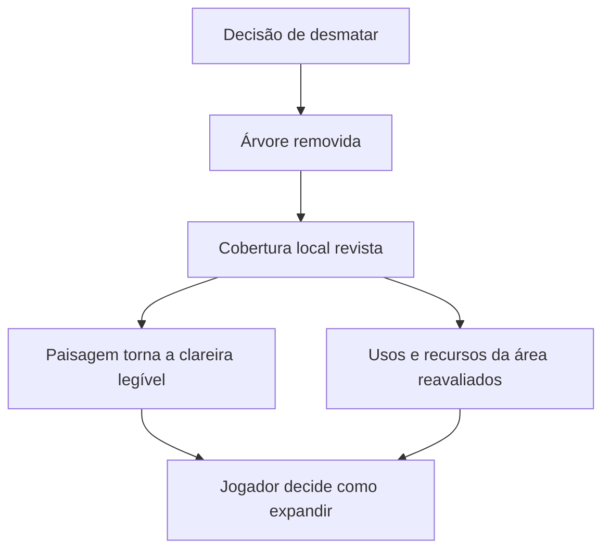

# Vegetação, mudanças ambientais e biomas em Kingdom e noutros jogos

> **Aplicação de 05/10/2026.** Relatório fornecido pelo dono e aplicado como protótipo na [ADR 0070](../adr/0070-a-floresta-e-territorio.md) e no [RG-26](../backlog/RG-26.md): etapas P0 a P4 feitas, P5 por medir. As secções 8 a 10 são propostas do relatório; os números do jogo estão em `data/source/flora.csv` e `forest.csv`, em `_proposed` (Q-238).

**Relatório de investigação e análise de design**  
**Data:** 5 de outubro de 2026  
**Referência principal:** a série Kingdom, com foco em **Kingdom Two Crowns**.  
**Comparações:** Minecraft, Terraria, Stardew Valley, Don't Starve Together, Valheim, Dead Cells, Factorio, No Man's Sky, Cloud Gardens e **Civilization VII**, com atenção especial à influência sobre elementos próximos.

**Acesso direto:** [Civilization VII: biomas, adjacências e influência sobre a vizinhança](#510-civilization-vii--como-o-ambiente-influencia-as-coisas-próximas).

## Índice

1. [Síntese dos resultados](#1-síntese-dos-resultados)
2. [Âmbito, método e limites](#2-âmbito-método-e-limites)
3. [O que significa mudar de ambiente](#3-o-que-significa-mudar-de-ambiente)
4. [Kingdom: análise aprofundada](#4-kingdom-análise-aprofundada)
5. [Dez jogos de comparação](#5-dez-jogos-de-comparação)
6. [Comparação transversal](#6-comparação-transversal)
7. [Princípios de direção artística e comportamento](#7-princípios-de-direção-artística-e-comportamento)
8. [Proposta de implementação para um jogo 2D](#8-proposta-de-implementação-para-um-jogo-2d)
9. [Três exemplos de ambientes originais](#9-três-exemplos-de-ambientes-originais)
10. [Plano de protótipo e validação](#10-plano-de-protótipo-e-validação)
11. [Conclusões e perguntas ainda em aberto](#11-conclusões-e-perguntas-ainda-em-aberto)
12. [Fontes e referências](#12-fontes-e-referências)

## 1. Síntese dos resultados

O principal ensinamento de Kingdom é que a vegetação pode funcionar simultaneamente como **paisagem, informação e recurso estratégico**. Cortar uma árvore transforma a composição visual, abre espaço e pode afetar habitantes da floresta. A mudança de estação altera a leitura desse mesmo território e as oportunidades económicas. O ambiente ajuda o jogador a perceber o estado do mundo através daquilo que vê e atravessa. [K02] [K06]

A investigação aponta para sete conclusões de design:

1. **Um ambiente convincente depende de relações coerentes.** Árvores, erva, água, luz e som devem sugerir as mesmas condições, mesmo quando cada efeito é tecnicamente simples.
2. **Bioma, estação e cobertura do terreno são dimensões diferentes.** Uma floresta desmatada não precisa de mudar de clima; uma floresta no inverno não precisa de passar a ser outro bioma.
3. **A vegetação ganha importância quando participa nas decisões.** Pode indicar abrigo, alimentação, obstáculos, passagem, risco, produção ou transformação do território.
4. **A transição precisa de explicar uma mudança.** Viajar para outra região, atravessar uma fronteira climática e ver a primavera regressar exigem soluções distintas.
5. **Variação procedural beneficia de estrutura autoral.** É útil definir primeiro caminhos, recursos essenciais e identidade visual; a distribuição de plantas preenche depois esse espaço.
6. **A memória do mundo faz parte do ambiente.** Uma árvore abatida, uma clareira aberta ou uma plantação criada devem manter um estado coerente quando o jogador regressa.
7. **Influência ambiental precisa de um alcance explícito.** Um efeito pode aplicar-se à própria posição, aos vizinhos, a uma distância definida ou a todo um povoado. Essas relações não são equivalentes.

Estas conclusões são uma síntese analítica. Não significam que todos os jogos estudados usem a mesma arquitetura ou simulem um ecossistema completo.

Para um projeto 2D inspirado nestas referências, a recomendação é começar com **poucos ambientes claramente diferentes**, um ciclo sazonal compreensível e uma transformação do terreno com consequências visíveis. A quantidade de espécies e efeitos deve aumentar quando contribuir para decisões ou para a identidade do lugar.

## 2. Âmbito, método e limites

### 2.1. Que Kingdom foi estudado

O nome Kingdom foi interpretado como a série de estratégia lateral associada a Thomas van den Berg/noio e Raw Fury, sobretudo Kingdom Two Crowns. O estudo não se refere a Kingdom Come: Deliverance.

Two Crowns é apresentado oficialmente como um jogo de microestratégia lateral, de estética pixel art e interação minimalista. As suas diferentes campanhas e ambientações constituem o centro da análise. [K01]

Kingdom: Classic, Kingdom: New Lands e o protótipo em Flash são usados apenas quando ajudam a compreender uma evolução documentada. Não se considera que uma regra de uma dessas versões se aplique automaticamente às restantes. Também não se pretende fazer um inventário exaustivo de todos os títulos ou conteúdos da franquia.

### 2.2. Como foram escolhidas as fontes

A pesquisa privilegiou:

- Publicações oficiais de estúdios e editoras.
- Diários de desenvolvimento assinados por designers, artistas ou programadores.
- Entrevistas com os próprios criadores.
- Notas oficiais de atualização, úteis para identificar comportamentos e diferenças entre versões.
- Código público e documentação de APIs, quando disponíveis.

Guias comunitários ajudaram a localizar temas e fontes, mas não foram usados como prova da implementação interna dos jogos. Uma mensagem de um jogador num fórum e uma resposta identificada do criador no mesmo fórum têm pesos diferentes.

### 2.3. Três níveis de afirmação

| Nível | Significado | Como deve ser lido |
|---|---|---|
| **Documentado** | A fonte primária descreve o comportamento, a intenção ou o código | Evidência sobre a versão e o contexto indicados |
| **Interpretação** | Conclusão extraída da relação entre elementos documentados | Análise de design, sujeita a outras leituras |
| **Proposta** | Solução sugerida para um projeto futuro | Não é uma descrição do código de Kingdom |

As secções de implementação, exemplos originais e validação são **propostas**. Não foi desenvolvido nem testado um jogo no âmbito deste relatório.

Não houve uma sessão instrumentada de gameplay, medição de desempenho, extração de assets ou acesso ao código privado de Two Crowns. O código analisado diretamente pertence ao repositório público do Kingdom original. As publicações históricas são usadas como evidência histórica, sem assumir que todos os seus números ou equilíbrios continuam válidos em 2026.

## 3. O que significa mudar de ambiente

### 3.1. Vocabulário de trabalho

| Conceito | Definição neste relatório | Exemplo |
|---|---|---|
| **Ambientação ou cenário cultural** | Identidade artística e narrativa de uma campanha | Um reino de inspiração japonesa |
| **Bioma** | Conjunto relativamente estável de condições, espécies e regras ambientais | Floresta temperada, zona árida, pântano |
| **Habitat ou cobertura local** | Estado de uma pequena área dentro de um ambiente | Bosque denso, clareira, campo cultivado |
| **Estação** | Fase de um ciclo temporal prolongado | Inverno, primavera |
| **Meteorologia** | Condições atmosféricas de duração mais curta | Chuva, vento, nevoeiro |
| **Hora do dia** | Fase do ciclo diário | Amanhecer, noite |
| **Evento ambiental** | Alteração pontual com regras próprias | Uma tempestade especial ou uma infestação |
| **Estado de intervenção** | Mudança causada por personagens ou jogador | Corte, plantação, construção, restauração |

Esta taxonomia é analítica. Os jogos nem sempre usam estes termos com o mesmo significado. Em particular, uma opção comercialmente chamada “bioma” pode substituir toda a direção artística de uma campanha.

### 3.2. Quatro transições que exigem soluções diferentes

**Transição espacial contínua.** O jogador atravessa uma região para outra. É preciso decidir onde mudam espécies, chão, silhuetas, som e regras. Uma faixa de mistura pode ajudar, mas nem todas as fronteiras devem ser suaves: uma costa, uma falésia ou uma muralha podem justificar uma separação forte.

**Transição temporal.** O jogador permanece no mesmo lugar enquanto o mundo muda. Convém preservar pontos de referência e transformar estados: quantidade de folhas, neve, luminosidade, atividade de animais e produção.

**Transição por intervenção.** O jogador altera a área. A mudança deve tornar visível uma relação causal: uma árvore cai, a passagem abre, o local passa a ter outra utilidade. A persistência é parte dessa promessa.

**Transição entre mapas ou campanhas.** O jogo carrega uma nova região ou um novo conjunto de regras. Pode usar uma viagem, uma entrada, uma vinheta ou outro enquadramento. Não necessita de simular uma fronteira física entre dois mapas que nunca coexistem.

### 3.3. Um modelo útil para organizar a análise

Em vez de atribuir tudo a uma variável chamada `biome`, é mais claro pensar:

```text
Ambiente visível = identidade regional
                 + cobertura local
                 + estação e hora
                 + meteorologia
                 + alterações persistentes
                 + apresentação artística
```

É uma decomposição conceptual, não uma equação física. Ajuda a evitar erros como fazer uma árvore abatida reaparecer porque a estação mudou, ou aplicar neve a uma zona com condições climáticas próprias.

## 4. Kingdom: análise aprofundada

### 4.1. A floresta participa na economia e na expansão

**Documentado.** O guia da diretora Angelica explica que o corte de árvores abre espaço para muralhas e edifícios e pode produzir moedas. Também alerta para os efeitos sobre veados e acampamentos existentes na floresta. Os arqueiros caçam animais, pelo que a gestão do espaço natural se relaciona com a economia. [K02]

**Interpretação.** A decisão de desmatar reúne benefícios imediatos e consequências indiretas. O valor de uma árvore não se resume ao que rende quando desaparece: depende do que existe à sua volta, de onde o reino pretende crescer e de quais as atividades que a transformação favorece ou prejudica.

Podemos decompor a vegetação em três funções:

| Função | Papel na experiência | Pergunta de design |
|---|---|---|
| **Objeto manipulável** | Elemento sobre o qual se pode agir | O que custa removê-lo e o que muda depois? |
| **Condição territorial** | Parte de um habitat ou de um espaço utilizável | Que atividades são possíveis aqui? |
| **Sinal visual** | Comunica densidade, estação, distância e ocupação | O jogador entende o estado sem abrir um menu? |

Esta decomposição é mais produtiva do que tratar cada árvore como um sprite independente. A árvore pode ser individual; a floresta é uma relação entre muitos elementos e as regras de uma área.

### 4.2. A fronteira da floresta é particularmente importante

Uma resposta de noio sobre Kingdom: Classic esclarece que as árvores cortáveis se encontravam perto da margem da floresta e que o fundo florestal devia recuar após o corte. O caso discutido era um erro relacionado com guardar/carregar. A fonte demonstra, nessa versão, uma ligação entre árvores interativas, estado territorial e cenário de fundo. [K10]

**Interpretação.** Esta ligação é decisiva para a legibilidade: se o objeto desaparecesse mas a massa escura de fundo permanecesse intacta, o jogador poderia continuar a interpretar o local como floresta. Uma transição territorial convincente atualiza a área, não apenas o objeto que recebeu a ação.

Para explicar o princípio, sem afirmar que este é o algoritmo de Two Crowns:



A informação pública consultada não permite reconstruir com rigor a fórmula atual de expansão da erva, todas as distâncias de exclusão ou os limiares de aparecimento de animais. Não se atribui aqui um algoritmo específico a esse comportamento.

### 4.3. Evitar uma regra desatualizada sobre recrutamento

O diário Conquest de 2021 apresenta a **Citizen House**: a remoção de um acampamento deixa ruínas que podem ser reconstruídas para recrutar, com uma alternativa menos favorável do que preservar o acampamento. O mesmo conjunto de diários explica o objetivo de obter complexidade através da interação de sistemas simples. [K07]

Por isso, a afirmação absoluta “cortar o acampamento elimina para sempre qualquer recrutamento nesse local” não é uma boa descrição transversal de Two Crowns.

**Interpretação.** Este é um exemplo de revisão de uma consequência ambiental. O jogador continua a ter motivos para preservar um lugar, mas existe uma possibilidade de recuperação. Num sistema deste tipo, a possibilidade de reparar um erro permite experimentar sem remover todo o custo da decisão.

### 4.4. A paisagem funciona como parte da interface

Em entrevista, os criadores associam o desenho de Kingdom a elementos concretos no mundo e a uma relação direta com os recursos, em vez de grandes abstrações de gestão. Também descrevem o maior vínculo ao reino persistente em Two Crowns. [K12]

**Interpretação.** A vegetação integra essa interface distribuída pela paisagem. A densidade do bosque, a abertura do céu e a aparência das plantas podem ajudar a localizar fronteiras e a perceber mudanças temporais. O jogador passa a ler o território como lê uma barra de estado.

Daqui resulta uma exigência artística: um elemento decorativo não deve parecer interativo se não o for; um elemento importante não deve desaparecer no ruído visual. A mesma planta pode precisar de uma silhueta reconhecível durante o dia, à noite e no inverno.

### 4.5. Profundidade visual e composição por planos

O portefólio do artista Adam Riches identifica trabalho em árvores, mockups e assets de ambiente para fundos com parallax em Two Crowns. Mostra também a produção de elementos para diferentes ambientações. Isso sustenta a importância dos planos de profundidade, mas não permite deduzir o número exato de camadas do jogo ou os seus parâmetros. [K05]

**Interpretação artística.** Numa vista lateral, a profundidade pode resultar de diferenças de escala, contraste, detalhe, sobreposição e velocidade aparente. A zona onde personagens e construções atuam precisa de continuar reconhecível dentro dessa composição.

Uma análise funcional distingue:

- **Fundo distante:** dá escala e identidade ao lugar.
- **Massa intermédia de vegetação:** comunica continuidade, densidade e habitat.
- **Plano de ação:** contém objetos e personagens que exigem leitura rápida.
- **Elementos próximos e efeitos:** acrescentam movimento e enquadramento, com o cuidado de não esconder decisões.

Esta é uma ferramenta de análise e produção, não um inventário confirmado do renderer de Two Crowns.

### 4.6. O que o código público do Kingdom original revela

Foi consultado o repositório público `noio/kingdom`, em ActionScript/Flixel. A referência de revisão observada foi `56d4e622461b72df8fa8f69d09fbd63dab7a1346`. O histórico do criador distingue o protótipo Flash da posterior produção de desktop em Unity. Logo, este código é uma fonte histórica concreta e não o código de Two Crowns. [K13]

| Ficheiro | Comportamento verificado | Alcance da evidência |
|---|---|---|
| `Reed.as` | Escolhe frames de animação por funções sinusoidais; o vento faz avançar a fase e a posição horizontal introduz variação | Movimento de uma planta no protótipo [C01] |
| `Weather.as` | Mantém propriedades ambientais e interpola valores numéricos e cores entre estados; trata ciclicamente a hora | Controlo coordenado do ambiente nessa implementação [C02] |
| `Water.as` | Produz um reflexo a partir da imagem da câmara, com inversão, composição e deslocamento; o vento influencia o efeito | Água visual em 2D, sem evidência de simulação de fluidos [C03] |
| `PlayState.as` | Compõe elementos de cenário e atribui parallax a um grupo de fundo | Estrutura concreta de uma cena do protótipo [C04] |

#### Plantas que se movem sem uma simulação física completa

Em `Reed.as`, o vento está ligado à progressão da animação. O uso da posição na fase evita que todas as plantas executem exatamente o mesmo frame no mesmo instante. É uma solução económica: a coerência vem de um estímulo partilhado, e a diversidade vem de diferenças locais. [C01]

O código histórico não deve ser copiado automaticamente para um motor atual: a forma como acumula a fase pertence ao seu ciclo de atualização. Uma implementação nova deve especificar o passo temporal e a independência face à frequência de renderização.

#### Um estado ambiental pode governar muitos efeitos

`Weather.as` inclui, entre outras propriedades, cores do céu e horizonte, neblina, chuva, vento, escuridão, saturação e hora do dia. As transições entre estados mostram como um conjunto relativamente pequeno de valores pode coordenar a apresentação. [C02]

**Interpretação.** Não é necessário simular o crescimento de cada folha para produzir a sensação de um mundo que respira. É mais importante que as folhas, a água e a iluminação não se contradigam.

#### A água reforça o ambiente

`Water.as` usa uma imagem refletida e distorcida; existe ruído Perlin no processo de deslocamento, e o efeito é relacionado com o vento. Esta presença de Perlin refere-se à água. Não prova que o gerador de biomas ou de ilhas de Two Crowns utilize o mesmo método. [C03]

**Interpretação.** Um reflexo reutiliza visualmente as cores e as silhuetas do cenário. Pode aumentar a sensação de unidade e profundidade com uma técnica distinta da construção das plantas.

### 4.7. Estações: aparência e pressão económica

O anúncio oficial da atualização de inverno de 2019 explica uma diferença de intenção: em New Lands, o inverno servia de pressão para abandonar a ilha; em Two Crowns, o objetivo era resistir e chegar à primavera. As quintas deixam de colher nessa estação, mas os agricultores podem dedicar-se à recolha de alimentos silvestres; há também uma alternativa de caça mais perigosa na floresta. [K06]

| Aspeto | New Lands, segundo a explicação histórica | Two Crowns, segundo a atualização de 2019 |
|---|---|---|
| Intenção do inverno | Incentivar a saída | Sustentar uma fase de resistência |
| Relação com a ilha | A viagem resolve a pressão | O mesmo território volta a ser útil |
| Leitura de design | Ambiente como limite da permanência | Ambiente como ciclo de planeamento |

As notas de 2019 também registam uma correção do crescimento da erva depois do inverno. Isso confirma que a recuperação sazonal envolve estado funcional, não apenas uma troca de paleta. [K11]

**Interpretação.** O regresso da vegetação tem valor porque o jogador reconhece um lugar anterior. A mudança é mais expressiva quando conserva árvores, edifícios e marcos familiares, alterando as condições que os rodeiam.

### 4.8. Não congelar a análise numa versão antiga

As notas da atualização 2.0, em 2024, indicam que pequenos animais podem surgir ocasionalmente de arbustos no inverno e que a quantidade de arbustos de bagas varia com a dificuldade. Também descrevem sincronização, em multijogador, de tipos de árvores e arbustos, cores e estados de perda ou recuperação de folhas. A geração foi ajustada para dar prioridade a estruturas funcionais e reduzir sobreposições. [K08]

Estas alterações impedem generalizações como “nunca há pequenos animais no inverno” ou “a folhagem é apenas decoração local que cada cliente pode escolher livremente”.

**Interpretação.** Uma planta pode ser decorativa na interação imediata e, ainda assim, ter de ser consistente entre jogadores para comunicar a estação e a identidade do lugar. Além disso, a composição procedural precisa de proteger o funcionamento do mapa antes de preencher o cenário.

### 4.9. Ambientações de Two Crowns: identidade e regras

Os exemplos seguintes não são descritos como uma sequência contínua de zonas climáticas dentro de uma única ilha.

| Ambientação | O que está documentado | Questão de design que ajuda a estudar |
|---|---|---|
| Medieval de base | Reino de inspiração medieval no enquadramento principal do jogo [K01] | Como estabelecer uma linguagem inicial reconhecível |
| Shogun | Inspiração no Japão feudal; a densidade do bambu influencia a expansão [K03] | Como a forma e a densidade da vegetação mudam a relação com o espaço |
| Dead Lands | Ambientação sombria e ligação ao universo Bloodstained [K01] | Como substituir a identidade de uma campanha mantendo uma linguagem de interação |
| Norse Lands | Campanha de inspiração nórdica, com condições meteorológicas e inverno mais exigentes na apresentação oficial [K09] | Como reforçar pressão ambiental sem depender apenas de cor |
| Call of Olympus | Referências gregas e mediterrânicas explícitas na seleção da flora [K04] | Como conciliar localização reconhecível e leitura sazonal |

No artigo sobre Shogun, Gordon Van Dyke relaciona a pesquisa de referências no Japão com a criação da ambientação e afirma que os bosques densos de bambu afetam a estratégia de expansão. O interesse está na ligação entre uma escolha de paisagem e o comportamento do jogador. [K03]

### 4.10. Call of Olympus: um caso particularmente esclarecedor

O diário artístico de Call of Olympus explica a procura de uma paisagem grega costeira: vegetação mais espaçada, condições secas, referências como oliveiras, pinheiros e arbustos mediterrânicos, além de som de cigarras. A equipa rejeitou uma referência florestal demasiado diferente da identidade costeira pretendida. Para que o inverno continuasse legível, procurou também árvores caducifólias, incluindo a pereira-brava *Pyrus spinosa*. [K04]

**Interpretação.** O objetivo não era simplesmente reproduzir uma lista de espécies. A seleção precisava de cumprir três funções: situar o jogador, distinguir a campanha e sustentar as transformações sazonais.

Num projeto próprio, uma pergunta equivalente seria: **“Esta seleção de plantas continua a contar a história do lugar quando a estação muda?”** Se todas as espécies se transformarem da mesma maneira, pode perder-se identidade. Se nenhuma mudar, pode perder-se legibilidade temporal. A solução pode ser distribuir papéis: algumas plantas definem o lugar; outras tornam a estação visível.

### 4.11. Geração, persistência e regresso

Numa entrevista sobre o Kingdom de desktop inicial, Thomas van den Berg descreve a geração mais como uma reorganização de elementos do mapa do que como um sistema procedural extraordinariamente complexo. É uma referência histórica útil, mas insuficiente para reconstruir o gerador atual. [K13]

Os diários Conquest discutem ainda a degradação de elementos do reino quando o jogador está ausente e o valor de investir na sua resistência. Trata-se de persistência e passagem do tempo, não de uma descrição do crescimento botânico. [K07]

**Interpretação.** Convém separar três perguntas:

1. Como foi criado o mapa inicial?
2. O que o jogador alterou nesse mapa?
3. O que acontece enquanto o jogador não está presente?

Um jogo pode gerar o território uma vez, guardar alterações individuais e aplicar regras simplificadas durante a ausência. Não precisa de manter todas as plantas em simulação contínua para produzir um regresso coerente.

### 4.12. O que não é possível concluir sobre Two Crowns

As fontes consultadas não demonstram:

- O algoritmo completo de distribuição de vegetação ou o formato interno dos biomas.
- Os shaders atuais de vento, água, neve ou folhagem.
- Os rácios exatos de parallax, as resoluções internas ou o orçamento de desenho.
- Todas as condições de crescimento da erva, aparecimento de animais ou afastamento entre objetos.
- A estrutura das mensagens de rede, dos ficheiros de gravação ou da simulação fora do ecrã.

Estas lacunas não impedem uma análise de design, mas impedem apresentar uma reconstrução técnica como se fosse documentação oficial.

## 5. Dez jogos de comparação

Os jogos foram escolhidos por oferecerem respostas diferentes à mesma questão: **o que faz um lugar parecer, comportar-se e transformar-se como um ambiente próprio?** O interesse não está em classificá-los por realismo, mas em identificar decisões transferíveis.

### 5.1. Minecraft — separar identidade ambiental e forma do terreno

**Documentado.** Os registos experimentais oficiais de geração da versão Java 1.18 mostram ajustes para reduzir pequenas manchas de biomas incoerentes, encontros bruscos entre zonas quentes e frias e combinações indesejadas entre neve e altitude. Revelam um trabalho de composição de vizinhanças, não apenas de seleção isolada de um bioma por ponto. Como são notas experimentais históricas, não constituem uma especificação integral da geração atual. [MC01]

A documentação de criação de biomas para Bedrock apresenta componentes distintos para clima, geração, materiais de superfície e outros atributos. Os componentes de coloração do mapa têm esse âmbito específico; não são prova de como todas as folhas são coloridas durante o jogo. Também não se deve confundir esta API com a implementação Java. [MC02]

**Interpretação.** O bioma funciona bem como uma combinação de propriedades, em vez de um pacote visual indivisível. Uma mesma categoria pode admitir variação local sem perder coerência.

**Aplicação a um jogo lateral.** Definir primeiro a ordem e a extensão das regiões; depois, variar densidade, espécies secundárias e clareiras dentro de cada região. Evitar que ruído de pequena escala crie alternâncias constantes entre ambientes incompatíveis. Uma faixa curta de transição pode ser útil; dezenas de minibiomas involuntários podem prejudicar a orientação.

**Diferença face a Kingdom.** Minecraft ajuda sobretudo a pensar a distribuição espacial de ambientes; Kingdom é mais útil para estudar a leitura da transformação de um território lateral que o jogador gere.

### 5.2. Terraria — o ambiente como estado transformável

**Documentado.** A apresentação oficial de Journey Mode inclui controlo sobre a propagação de infeção. Isso evidencia um processo ambiental que pode transformar o mundo ao longo do tempo e que, nesse modo, pode ser interrompido pelo jogador. [TR01]

A API pública do tModLoader separa a determinação de um bioma ativo, através de `IsBiomeActive`, de eventos de entrada e saída e de efeitos de cena, como música e fundos. É documentação de uma camada de modificação; não descreve por si só todos os critérios dos biomas do jogo base. [TR02]

**Interpretação.** Aqui é útil distinguir duas coisas: o estado material do terreno e a experiência ambiental que esse estado ativa. A paisagem pode mudar porque as suas células mudaram, não porque o jogador atravessou uma fronteira previamente fixa.

**Aplicação a um jogo lateral.** Para corrupção, restauração ou invasão vegetal, manter um estado de área e regras explícitas de conversão. Usar esse estado para decidir flora, fundo e som, evitando que cada subsistema invente a sua própria fronteira. Se vários ambientes puderem influenciar a mesma zona, definir prioridades.

**Limite.** Este relatório não fixa velocidades de propagação, contagens de blocos ou exceções por versão.

### 5.3. Stardew Valley — preservar o lugar e mudar o calendário

**Documentado.** As notas oficiais da versão 1.6 indicam que a erva pode sobreviver ao inverno, embora deixe de se espalhar e seja menos produtiva ao corte. Incluem ainda correções a plantas em Ginger Island que recebiam efeitos sazonais ou meteorológicos indevidos do vale, e a discrepâncias entre aparência de árvores e sombras. [ST01]

**Interpretação.** A estação é um modificador contextual. Nem todos os locais devem receber o mesmo efeito, e sobrevivência, crescimento e produção são estados diferentes. Uma planta pode sobreviver sem crescer.

**Aplicação a um jogo lateral.** Separar calendário global de condições locais. Uma estufa, uma ilha quente ou uma caverna devem poder contrariar parte das regras gerais. Manter a consistência entre árvore, sombra e folhagem evita que a arte revele estados contraditórios.

**Diferença face a Kingdom.** É uma referência particularmente útil para gestão prolongada do mesmo espaço e para regras sazonais de plantas individuais.

### 5.4. Don't Starve Together — necessidades próprias de cada planta

**Documentado.** A atualização Reap What You Sow descreve vegetais com preferências sazonais e necessidades de nutrientes diferentes. A qualidade do cuidado afeta as recompensas; a proposta apresentada não se reduz a fazer todas as plantas morrerem por negligência. A atualização inclui também ervas indesejadas e instrumentos de aprendizagem sobre plantas. [DS01]

**Interpretação.** O ambiente deixa de ser apenas uma condição regional e passa a ser algo com que cada espécie se relaciona. A diversidade pode vir das exigências, não só da aparência.

**Aplicação a um jogo lateral.** Se a agricultura for central, dar a poucas espécies necessidades distinguíveis. Se for uma atividade secundária, bastam duas ou três condições fáceis de perceber. Exigências invisíveis multiplicam o trabalho do jogador sem necessariamente enriquecer a decisão.

**Limite.** A fonte descreve este sistema agrícola; não demonstra que toda a vegetação silvestre utilize o mesmo modelo.

### 5.5. Valheim — atmosfera como condição de exploração

**Documentado.** A atualização de lançamento de Mistlands associa o novo ambiente a nevoeiro e a ferramentas de dissipação, incluindo uma opção transportável e outra estacionária. Também explica que o conteúdo novo surge em áreas ainda não exploradas, expondo uma relação entre geração e histórico da gravação. [VA01]

O diário de desenvolvimento de Ashlands de agosto de 2023 apresenta uma organização costeira e interior: árvores e cinza junto à costa, condições mais dominadas por lava no interior e uma separação geográfica pensada através do oceano. Deve ler-se como intenção de desenvolvimento nessa data, não como garantia sobre todas as sementes e versões posteriores. [VA02]

**Interpretação.** Um ambiente pode alterar o próprio ato de explorar. A visibilidade passa a ser um recurso, e a fronteira pode ser comunicada pela geografia antes de o jogador encontrar os elementos mais perigosos.

**Aplicação a um jogo lateral.** Introduzir um ambiente em etapas: primeiro som e horizonte, depois vegetação de margem, finalmente condições locais mais fortes. Se existir nevoeiro, decidir se afeta apenas a estética ou se modifica realmente informação disponível, navegação e preparação.

**Questão de persistência.** Adicionar um bioma a um jogo já publicado exige uma política sobre zonas visitadas, construções existentes e geração futura. O problema não se resolve apenas com novos assets.

### 5.6. Dead Cells — geração híbrida e transições com sentido espacial

**Documentado.** Sébastien Bénard descreve uma geração que combina partes desenhadas manualmente com uma estrutura de ligações e restrições. As salas não são produzidas como ruído indiferenciado: a construção do nível preserva necessidades de circulação e progressão. [DC01]

O artigo de Gwenaël Massé sobre direção artística explica a diferenciação de ambientes através de cor, profundidade e elementos de cenário. Descreve ainda percursos de transição, como um elevador antes das muralhas e um túnel antes dos esgotos, e regras de colocação de decoração. A equipa reconsiderou cores quando dois ambientes sucessivos se aproximavam demasiado visualmente. [DC02]

**Interpretação.** O jogador aceita melhor uma mudança quando consegue explicar mentalmente como chegou àquele lugar. Não é necessário que todo o mundo seja fisicamente contínuo, mas a sequência precisa de sugerir uma geografia compreensível.

**Aplicação a um jogo lateral.** Construir segmentos autorais para pontos críticos: entrada da floresta, desfiladeiro, ponte, ruína e margem de rio. Variar a combinação desses segmentos e a vegetação secundária. Assim, a geração cria surpresa sem comprometer a clareza das situações importantes.

**Relação com Kingdom.** Esta referência é especialmente útil para combinar a leitura simples de um percurso lateral com identidade ambiental e variação entre partidas.

### 5.7. Factorio — distribuição procedural guiada por condições e utilidade

#### Campos de distribuição, em vez de sorteios independentes

**Documentado.** O diário FFF-390 explica expressões de geração avaliadas a partir de coordenadas, incluindo ruído coerente e padrões em diferentes escalas. Apresenta ferramentas de visualização que ajudam a observar intervalos e transições. O ponto importante é que posições próximas podem manter relações, em vez de receber resultados completamente independentes. [FA01]

**Interpretação.** A vegetação parece mais organizada quando existe continuidade na distribuição. Um campo de densidade pode produzir bosques, margens e clareiras; um sorteio igual para cada posição tende a produzir espalhamento homogéneo.

#### A vegetação não pode inviabilizar o mapa

O FFF-401 descreve condições climáticas para colocação de árvores e problemas resultantes de parâmetros incompatíveis. Também apresenta caminhos naturais e máscaras que retiram árvores ou obstáculos de zonas necessárias à circulação. [FA02]

**Aplicação a um jogo lateral.** Reservar áreas funcionais antes de distribuir plantas. A prioridade não deve ser “colocar árvores e depois ver se sobra espaço”, mas “garantir que o mapa funciona e preencher o espaço permitido”.

#### Um ambiente novo precisa de uma linguagem própria

O FFF-413, sobre Gleba, relata referências biológicas como líquenes, fungos e formas aquáticas para procurar uma identidade distinta. O artigo distingue ainda elementos de apresentação e conteúdo em desenvolvimento. Isso recomenda cuidado ao interpretar imagens de produção como demonstrações do algoritmo final. [FA03]

**Interpretação.** A identidade pode ser definida por formas e padrões de crescimento: placas, filamentos, copas, massas arredondadas, raízes expostas ou superfícies colonizadas. Alterar apenas a cor conserva demasiado da leitura anterior.

#### Vegetação produtiva e vegetação silvestre

O FFF-414 descreve agricultura com colheita, sementes, replantação e compatibilidade com tipos de solo. A distribuição organizada de uma plantação tem uma intenção diferente da distribuição de vegetação natural. [FA04]

**Aplicação a um jogo lateral.** Uma plantação pode usar espaçamento regular e estágios legíveis; um bosque pode usar grupos e intervalos irregulares. A diferença visual ajuda a comunicar autoria, produtividade e possibilidade de intervenção.

**Relação com Kingdom.** Factorio oferece sobretudo ferramentas conceptuais para gerar e validar vegetação. A profundidade da sua produção não deve ser transplantada inteira para uma experiência de microestratégia.

### 5.8. No Man's Sky — coerência entre subsistemas ambientais

**Documentado.** Worlds Part I descreve um sistema de vento que influencia vegetação e diversos efeitos atmosféricos. A atualização também apresenta mudanças na água e uma transferência de trabalho de renderização de objetos ambientais para a GPU, permitindo maior densidade e detalhe. O anúncio declara a preservação do terreno e das bases durante essa atualização. [NM01]

**Interpretação.** A sensação ambiental depende da resposta conjunta de elementos diferentes ao mesmo estado. Uma tempestade perde força se a chuva sugerir vento intenso enquanto as plantas permanecem imóveis.

**Aplicação a um jogo lateral.** Partilhar parâmetros de vento, humidade visual e luz entre folhas, partículas, água e áudio. Não é necessário reproduzir a escala planetária para beneficiar desta coerência.

**Limite.** A fonte não fornece um orçamento de desempenho transferível para outro motor ou equipamento.

### 5.9. Cloud Gardens — vegetação como atividade principal

**Documentado.** Thomas van den Berg, criador original de Kingdom, desenvolveu Cloud Gardens em torno da colonização vegetal de cenários abandonados. Numa entrevista com a equipa, a colocação de sementes e objetos aparece como forma de orientar o crescimento sem controlar inteiramente a forma final. A passagem de uma ideia de mundo maior para dioramas delimitados também é discutida. [CG01]

O repositório público Planter apresenta uma ferramenta extraída desse trabalho para Unity. A documentação descreve ramos, modelos de ramos e pontos de ligação que permitem escolher continuações e respetivas probabilidades. Isto documenta uma abordagem estrutural ao crescimento, em vez de provar a simulação completa de processos botânicos. [CG02]

Noutra entrevista, noio distingue o esforço de criar um protótipo de crescimento do trabalho muito mais vasto necessário para construir o jogo. [CG03]

**Interpretação.** Quando o crescimento é o centro da experiência, pode justificar-se representar a forma da planta como uma estrutura que se expande. Quando a vegetação serve sobretudo para comunicar território, esse nível de detalhe pode consumir recursos sem melhorar a decisão do jogador.

**Aplicação a um jogo lateral.** Reservar crescimento estrutural para situações que o jogador acompanha de perto: trepadeiras que cobrem ruínas, raízes que abrem uma passagem ou uma planta central de uma missão. Para centenas de elementos secundários, estados discretos e variação artística podem bastar.

**Relação com Kingdom.** É uma comparação especialmente útil porque mostra outra abordagem do mesmo criador: a natureza pode ser condição para a estratégia ou o próprio objeto da interação.

### 5.10. Civilization VII — como o ambiente influencia as coisas próximas

Civilization VII acrescenta uma perspetiva central para este relatório: **o valor de uma posição depende das relações com outras posições**. Contudo, não existe uma única regra segundo a qual um bioma emita um bónus universal para tudo o que está à volta. É necessário identificar o elemento de origem, o destinatário, a condição e o alcance.

#### A. Bioma, terreno e vizinhança são perguntas diferentes

O diário oficial do mapa True Start Location Earth distingue o bioma Tropical da presença de vegetação e de montanhas. Explica ainda que a representação de regiões tropicais não se resume à colocação de uma característica de floresta tropical. [CV07]

Uma forma útil de ler as regras é esta:

| Pergunta | O que se está a verificar | Exemplo de condição |
|---|---|---|
| Em que ambiente está a posição? | Bioma | Grassland, Plains, Tropical, Desert ou Tundra; a documentação também identifica Marine [CV02] [CV04] |
| Que configuração tem o local? | Terreno e características | Plano, acidentado, vegetado ou húmido, conforme a regra relevante [CV02] [CV03] [CV07] |
| Há água de um tipo específico? | Hidrografia | Rio navegável, costa ou outro elemento definido pela regra [CV04] |
| O que existe ao lado? | Adjacência | Uma melhoria, uma maravilha ou uma posição com certa propriedade |
| O que existe na área abrangida? | Raio ou pertença territorial | Posições até determinada distância ou dentro do povoado |

A tabela organiza a leitura; não pretende reproduzir as classes internas do motor. Uma condição sobre vegetação não deve ser automaticamente traduzida como uma condição sobre o bioma Tropical.

#### B. Cinco alcances de influência

| Alcance | Como funciona | Consequência para o planeamento |
|---|---|---|
| **Na própria posição** | O efeito consulta o terreno onde se encontra o destinatário | É preciso ocupar o local adequado |
| **Adjacente** | O efeito consulta os vizinhos imediatos na grelha | Importa a disposição relativa dos elementos |
| **Dentro de um raio** | O efeito conta posições até uma distância especificada | Importa a composição de uma área mais ampla |
| **No mesmo povoado** | O efeito aplica-se a uma categoria de elementos desse povoado | A pertença territorial pode importar mais do que a proximidade |
| **Regional, na geração** | Relevo e condições ambientais influenciam a formação do mapa | Importa a relação geográfica antes de qualquer construção |

Esta classificação permite responder com precisão a “o que é influenciado por este bioma?”. A resposta depende de qual destas regras está ativa.

#### C. Exemplos documentados de influência local

Os números abaixo são apresentados **com a atualização que os documentou**. São exemplos verificáveis da estrutura das regras, não uma tabela exaustiva de equilíbrio para todas as versões, civilizações, políticas ou DLC.

| Exemplo | Regra documentada | O que demonstra |
|---|---|---|
| Altar maia, Rain of Chaac | Em novembro de 2025, passou de Ciência por vegetação adjacente para **+2 Ciência se colocado numa posição vegetada** [CV02] | Estar sobre e estar ao lado são condições diferentes |
| Lo'i Kalo do Havai | Recebe **+1 Cultura por barco de pesca adjacente**; colocação limitada a Grassland e Tropical, na mesma atualização [CV02] | Restrição de bioma e bónus de vizinhança coexistem |
| Terraço agrícola inca | Em maio de 2025, passou a dar **+1 Ouro de adjacência a edifícios vizinhos**, com colocação em terreno acidentado sem característica ou rio [CV03] | Uma melhoria pode beneficiar os edifícios à sua volta |
| Great Blue Hole | Em novembro de 2025, atribui **+2 Cultura a posições rurais marítimas adjacentes** [CV02] | Uma maravilha natural tem destinatários locais específicos |
| Quận Vương de Dai Viet | Em fevereiro de 2026, a fundação concede Cultura por posição Tropical até **três posições do centro**, escalada com a velocidade [CV05] | Um raio não se reduz aos vizinhos imediatos |

**Interpretação.** As duas condições do Lo'i Kalo formam um bom exemplo: um local pode permitir a construção, mas ser pouco vantajoso se a vizinhança não corresponder. A escolha deixa de ser apenas “posso construir aqui?” e passa a incluir “que rede de relações consigo formar aqui?”.

#### D. Adjacência urbana e efeitos no povoado

O diário Managing Your Empire explica que os bónus de adjacência são associados a edifícios e ao que os rodeia. Distingue-os dos efeitos de armazéns sobre melhorias do povoado e descreve como especialistas podem aumentar o valor das adjacências. [CV01]

Por isso, um benefício para “todas as quintas deste povoado” não deve ser desenhado mentalmente como um círculo pequeno à volta do edifício. O alcance administrativo pode ultrapassar a vizinhança imediata.

**Interpretação.** A influência é também direcional. Uma estrutura pode beneficiar uma categoria de vizinhos sem receber nada deles. Para compreender o sistema, é útil perguntar sempre: **quem concede, quem recebe e o que é contado?**

#### E. Appeal: o valor ambiental também pode ser intermédio

A atualização 1.3.2, publicada em fevereiro de 2026, dividiu Appeal em níveis: Unappealing, Charming e Breathtaking. Nas regras então documentadas, posições melhoradas Charming dão +1 Felicidade e Breathtaking dão +2. A atualização introduziu uma lente de consulta. O título da página de suporte tem o ano errado; o corpo e os metadados identificam 2026. [CV05]

Em setembro de 2026, as notas 1.5.0 registam a apresentação do valor numérico de Appeal e a correção do bónus de +1 Appeal do Hoo-Do sobre posições adjacentes. Também apresentam o Nemeton dos Gauleses com adjacência cultural a posições Breathtaking. [CV08]

**Interpretação.** Isto mostra uma cadeia possível de influência: um elemento altera uma propriedade de uma posição; outro sistema consulta essa propriedade. Não é necessário que todos os benefícios sejam uma transferência direta de produção entre dois objetos.

As fontes usadas aqui não bastam para garantir uma tabela completa de todas as contribuições e limiares de Appeal. Não se importam para Civ VII as regras de Appeal de Civ VI.

#### F. Montanhas podem influenciar a formação do ambiente à sua volta

As notas 1.3.1, de dezembro de 2025, afirmam que a precipitação passou a pesar mais na geração de biomas e que montanhas criam sombras de chuva, com zonas secas relacionadas com ventos e latitude. [CV04]

Este é um efeito geográfico durante a geração. Não demonstra que construir um edifício próximo de uma montanha desencadeie uma simulação meteorológica contínua em cada turno.

O diário de geração explica a utilização de Voronoi para estruturar massas terrestres com regras, seguida de uma passagem para a grelha e a camada que determina propriedades de jogo. É uma evidência de separação entre estrutura geográfica e resolução dos elementos jogáveis. [CV06]

#### G. O que transferir para um jogo inspirado em Kingdom

**Proposta.** A combinação mais interessante seria conservar a leitura imediata de Kingdom e acrescentar poucas relações de vizinhança bem comunicadas. Por exemplo: uma área de árvores preservada beneficia um coletor próximo; um curso de água favorece certos cultivos; uma instalação poluente prejudica uma área de recolha. São exemplos originais, não regras atribuídas a estes jogos.

Antes da ação, mostrar os destinatários e a mudança prevista. Depois da ação, atualizar o efeito local e a apresentação. Não é preciso colocar números sobre cada planta permanentemente; um modo de inspeção pode explicar relações que a paisagem sozinha não transmite.

**Resultado da comparação:** Kingdom ajuda a desenhar a transformação legível do território; Civilization VII ajuda a desenhar **o valor relacional da posição**. Uma árvore pode valer pelo que contém, pelo habitat que sustenta e pelo que permite aos elementos próximos.

## 6. Comparação transversal

### 6.1. Que problema cada referência ajuda a resolver

A tabela é uma síntese de design, não uma classificação técnica dos motores utilizados.

| Jogo | Papel ambiental mais útil para este estudo | Tipo de mudança em destaque | Princípio transferível |
|---|---|---|---|
| Kingdom | Território, economia e leitura visual | Corte, expansão e estação | Tornar a alteração do espaço visível e significativa |
| Minecraft | Organização espacial de regiões | Passagem entre condições regionais | Separar atributos e controlar vizinhanças |
| Terraria | Estado ambiental transformável | Propagação e conversão | Ligar alterações materiais a efeitos de ambiente |
| Stardew Valley | Continuidade sazonal do lugar | Calendário com exceções locais | Separar sobrevivência, crescimento e produção |
| Don't Starve Together | Relação entre espécies e condições | Cuidado agrícola | Usar necessidades distintas quando são legíveis |
| Valheim | Preparação e exploração | Visibilidade e entrada em regiões | Dar consequências à atmosfera |
| Dead Cells | Percurso e identidade do nível | Sequência de ambientes | Combinar estrutura autoral e variação |
| Factorio | Distribuição e transformação produtiva | Geração e cultivo | Reservar circulação e utilidade antes da decoração |
| No Man's Sky | Coerência sensorial | Vento e meteorologia | Coordenar respostas entre subsistemas |
| Cloud Gardens | Crescimento como interação | Colonização do espaço | Simular forma quando a forma é o objetivo |
| Civilization VII | Relações entre posições | Adjacência, alcance territorial e geração regional | Tornar origem, destinatário e alcance explícitos |

### 6.2. Que abordagem escolher conforme o objetivo

| Objetivo de um projeto | Referências prioritárias | Risco a controlar |
|---|---|---|
| Microestratégia lateral com expansão | Kingdom + Dead Cells | Decoração bloquear a leitura ou a progressão |
| Mundo extenso com regiões diferentes | Minecraft + Factorio | Fragmentação excessiva ou distribuição monótona |
| Agricultura e permanência | Stardew Valley + Don't Starve Together | Regras locais invisíveis ou tarefas repetitivas |
| Exploração ambiental hostil | Valheim + No Man's Sky | Efeitos esconderem informação indispensável |
| Corrupção ou restauração do território | Terraria + Cloud Gardens | Mudanças sem causa clara ou difíceis de guardar |
| Natureza como atividade contemplativa | Cloud Gardens | Detalhe de simulação sem valor perceptível |
| Construção com benefícios ambientais próximos | Civilization VII + Kingdom | Confundir adjacência, raio e efeito sobre todo o povoado |

Não é recomendável combinar todas as abordagens num primeiro protótipo. Cada uma acrescenta exigências diferentes de arte, regras, persistência e comunicação.

## 7. Princípios de direção artística e comportamento

Esta secção transforma a comparação anterior em critérios de produção. São recomendações, não afirmações sobre a implementação interna dos jogos.

### 7.1. Dar a cada ambiente uma assinatura reconhecível

Uma assinatura pode combinar:

- **Silhueta dominante:** copas largas, caules verticais, massas baixas ou raízes expostas.
- **Organização:** grupos densos, árvores isoladas, corredores ou vegetação junto à água.
- **Relação com o chão:** tapete herbáceo, solo exposto, pedras, lama ou raízes.
- **Movimento:** rigidez, oscilação lenta, tremor de folhas ou queda de partículas.
- **Som:** textura de vento, água e atividade animal.
- **Regra reconhecível:** uma oportunidade ou limitação que o jogador aprende a associar ao lugar.

O teste mais simples é retirar a cor. Se os ambientes se tornarem indistinguíveis, dependem demasiado da paleta. A cor continua importante, mas não deve carregar toda a identidade.

### 7.2. Trabalhar em várias escalas

| Escala | Decisão artística | Erro comum |
|---|---|---|
| Região | Ritmo geral de massas, vazios e marcos | Todas as áreas terem a mesma densidade |
| Grupo | Composição de árvores, arbustos e clareiras | Distribuição uniforme sem agrupamentos |
| Objeto | Silhueta e proporção | Muitas variantes sem diferenças percetíveis |
| Detalhe | Folhas, pequenas flores, partículas | Pormenor competir com personagens e ações |

Os vazios são tão importantes como as plantas. Permitem ver o céu, identificar uma entrada e perceber que o território foi transformado.

### 7.3. Separar movimento visual e mudança de estado

Oscilar com o vento não precisa de alterar a posição lógica da árvore. Perder folhas não precisa de eliminar o tronco. Ficar coberta de neve não precisa de mudar a espécie. A separação permite que a apresentação varie sem invalidar regras de colisão, recursos ou persistência.

Um bom critério é perguntar: **se este efeito deixar de ser desenhado, as regras do mundo continuam corretas?** Para efeitos cosméticos, a resposta deverá ser sim.

### 7.4. Fazer a transição acontecer em canais coordenados

Uma passagem de bosque húmido para terreno seco pode mudar gradualmente a cobertura do chão e a distribuição de arbustos, enquanto uma parede rochosa constitui uma fronteira abrupta. Nem tudo precisa de usar a mesma duração de mistura.

O que importa é evitar contradições: o som não deve anunciar uma tempestade muito antes de qualquer sinal visível sem intenção narrativa; a neve no chão não deve coexistir inadvertidamente com estados de verão nas plantas que lhe pertencem.

### 7.5. Comunicar influência sem sobrecarregar o ecrã

Para relações inspiradas em Civilization VII, a silhueta de uma planta raramente explica sozinha quem recebe um benefício. Um modo de inspeção pode mostrar o alcance, realçar destinatários e apresentar a diferença prevista antes de cortar ou construir.

Na vista normal, bastam sinais discretos. Durante uma decisão, a interface deve tornar explícita a relação. O jogador não deve ter de adivinhar se “próximo” significa a mesma posição, o vizinho imediato ou toda a povoação.

## 8. Proposta de implementação para um jogo 2D

**Toda esta secção é uma proposta original.** Não descreve o código de Two Crowns nem o de Civilization VII. O objetivo é indicar uma estrutura pequena que consiga reproduzir os princípios estudados.

### 8.1. Modelo de dados separado por responsabilidade

| Conjunto de dados | Conteúdo sugerido | Deve persistir? |
|---|---|---|
| `BiomeDefinition` | Espécies, paleta, condições e regras do ambiente | Como configuração versionada |
| `RegionState` | Limites, bioma, cobertura e condições locais | Sim, quando alterado |
| `SeasonState` | Calendário, fase e transições | Sim |
| `WeatherState` | Vento, precipitação, nevoeiro e início do evento | Conforme a continuidade desejada |
| `PlantInstance` | Identificador estável, espécie, posição e estado | Alterações relevantes |
| `InfluenceRule` | Origem, destinatário, alcance, condição e efeito | Configuração; resultados podem ser recalculados |
| `WorldChanges` | Cortes, plantações, construções e recursos consumidos | Sim |

O modelo evita um campo único que tente representar clima, inverno, ocupação e vegetação ao mesmo tempo.

### 8.2. Geração em ordem de prioridade

Uma sequência inicial razoável seria:

1. Definir a sequência de regiões e os pontos obrigatórios da progressão.
2. Reservar caminhos, construções, acessos e espaços de interação.
3. Atribuir condições locais, como proximidade da água ou exposição.
4. Criar massas de vegetação e clareiras.
5. Colocar elementos interativos com identificadores estáveis.
6. Acrescentar vegetação decorativa e detalhes.
7. Verificar se o resultado continua jogável.

Ruído coerente pode ajudar na densidade local, mas não substitui as regras de progressão. Um gerador deve poder rejeitar ou corrigir uma composição bonita que bloqueie um acesso essencial.

### 8.3. Misturar ambientes sem fazer plantas aparecerem aleatoriamente

Numa faixa de transição, atribuir pesos aos ambientes vizinhos. Esses pesos podem controlar probabilidades de espécies e densidades, enquanto a escolha de cada objeto usa uma combinação estável de semente e coordenadas.

```text
peso_A(x) + peso_B(x) = 1
densidade(x) = peso_A(x) × densidade_A + peso_B(x) × densidade_B
```

Esta fórmula serve apenas como ponto de partida. Algumas espécies podem exigir condições adicionais, e certos pares de ambientes podem precisar de um segmento intermédio autoral.

O importante é não voltar a sortear plantas quando a câmara passa. A vegetação de uma posição deve resultar do mundo, não do enquadramento atual. Nas fronteiras entre blocos carregados separadamente, usar coordenadas globais e uma margem comum para evitar costuras.

### 8.4. Estados das plantas e estações

Separar existência, crescimento, produção e aparência:

| Dimensão | Exemplos de estado |
|---|---|
| Existência | Presente, cortada, removida |
| Desenvolvimento | Jovem, adulta, envelhecida |
| Atividade | A crescer, dormente, a produzir |
| Aparência sazonal | Folhada, parcialmente despida, sem folhas |
| Efeito meteorológico | Molhada, coberta de neve, sob vento forte |

Uma árvore cortada não regressa só porque a aparência mudou para primavera. Caso exista regeneração, esta precisa de uma regra própria. Da mesma forma, uma espécie perene não deve seguir automaticamente a perda de folhas de uma caducifólia.

Para a erva, começar com crescimento por pequenas áreas ou células. Só acrescentar competição, nutrientes ou propagação individual se o jogador conseguir perceber e usar essas diferenças.

### 8.5. Regras de influência sobre os elementos próximos

Uma regra precisa de responder a seis perguntas:

1. **Quem é a origem?** Uma árvore, um grupo florestal, um rio, uma construção ou a própria região.
2. **Quem pode receber?** Uma espécie, uma atividade, uma categoria de edifícios ou uma personagem.
3. **Qual é o alcance?** Contacto, vizinho, distância física, raio em células ou pertença ao povoado.
4. **Que condições adicionais existem?** Estação, acesso, estado da planta, tecnologia ou ocupação.
5. **Qual é o efeito?** Produção, crescimento, abrigo, risco ou disponibilidade de ação.
6. **Como se acumulam várias origens?** Soma, máximo, limite ou rendimento decrescente.

Exemplo conceptual de configuração, com valores inventados para um protótipo:

```json
{
  "id": "bosque_apoia_coleta",
  "source": "forest_patch",
  "target": "gathering_post",
  "scope": { "kind": "world_distance", "radius": 24 },
  "condition": { "minimumLivingTrees": 3 },
  "effect": { "stat": "collectionCapacity", "add": 1 },
  "stacking": { "kind": "maximum", "cap": 1 }
}
```

Neste exemplo, 24 é uma unidade abstrata do projeto, não uma distância de Kingdom ou Civ VII. O limite de acumulação impede que centenas de árvores pequenas gerem um benefício ilimitado.

Quando uma árvore é cortada, reavaliar o grupo florestal e os destinatários abrangidos. Não é necessário recalcular todas as relações do mapa em cada frame. Também é preciso decidir se uma muralha, um rio ou a falta de caminho interrompem a influência: distância geométrica e acessibilidade são coisas diferentes.

Para benefícios encadeados, evitar ciclos indefinidos. Um efeito que aumenta uma propriedade e é reforçado por essa mesma propriedade precisa de uma ordem de avaliação ou de um limite explícito.

### 8.6. Vento, parallax e apresentação

Uma animação simples pode combinar tempo, intensidade do vento e uma fase estável por objeto:

```text
fase = velocidade × tempo + variacao_estavel_da_planta
oscilacao = amplitude_do_vento × sin(fase)
```

É pseudomatemática de proposta. A implementação pode escolher frames, deformar uma malha ou mover apenas certos elementos, conforme o estilo. Em pixel art, a deformação contínua precisa de ser avaliada porque pode comprometer a nitidez ou a consistência dos píxeis.

Para parallax, definir uma velocidade relativa por plano e manter o plano de ação estável. Os fundos mais distantes devem reforçar identidade e escala; os elementos próximos devem respeitar zonas onde o jogador precisa de ver personagens, recursos e ações.

### 8.7. Persistência e cooperação

Guardar a semente e a **versão do gerador**, além das alterações do jogador. Uma semente sozinha pode produzir um mapa diferente depois de uma mudança de algoritmo. Plantas importantes precisam de identificadores que sobrevivam ao descarregamento de uma área.

Definir uma política para o tempo de ausência: pausar, avançar por etapas ou aplicar uma regra simplificada. O comportamento deve ser previsível e coerente com o ritmo do jogo.

Em cooperação, sincronizar acontecimentos e estados relevantes — corte, plantação, estação, início de tempestade — e reconstruir localmente os efeitos cosméticos. Não é necessário enviar a posição de cada folha em cada frame. O servidor ou a autoridade da partida deve resolver conflitos sobre recursos e alterações persistentes.

### 8.8. Desempenho e escala de produção

Começar por medir a cena mais exigente prevista: vegetação densa, precipitação, água, personagens e transição sazonal em simultâneo. Distinguir o custo de regras do custo de desenho.

Controlos úteis incluem agrupar desenhos compatíveis, limitar elementos fora do ecrã, reduzir atualização de plantas distantes e simplificar detalhes em fundos. A escolha concreta depende do motor e do equipamento-alvo; este relatório não apresenta benchmarks nem promete uma contagem de plantas por frame.

A prioridade deve ser a estabilidade do plano de ação. É preferível reduzir partículas decorativas do que tornar uma decisão ilegível ou introduzir falhas na atualização do mundo.

## 9. Três exemplos de ambientes originais

Os exemplos seguintes são exercícios de design. Não descrevem biomas existentes nos jogos analisados, nem pretendem simular rigorosamente ecossistemas reais.

| Aspeto | Bosque da Ribeira | Costa das Árvores Baixas | Charco das Raízes Luminosas |
|---|---|---|---|
| Silhueta | Copas largas e zonas abertas junto à água | Árvores baixas, inclinadas e espaçadas | Raízes altas e vegetação vertical fragmentada |
| Chão | Erva em manchas e margens húmidas | Solo exposto, pedras e tufos baixos | Água rasa, lama e ilhas de terreno firme |
| Identidade sonora | Água corrente e folhagem | Vento exposto e som costeiro | Gotas, insetos e sons espaçados |
| Regra principal | Preservar grupos de árvores mantém oportunidades de coleta | Reservar locais abrigados beneficia atividades sensíveis ao vento | Passagens seguras dependem de estruturas e terreno firme |
| Consequência do corte | Abre espaço, mas pode remover uma origem de benefício | Melhora a passagem, mas reduz abrigo local | Abre uma rota visual; pode alterar a distribuição de locais de apoio |
| Relação de proximidade | Coletor consulta um bosque num alcance curto | Instalação consulta abrigo na direção de exposição | Passarela consulta pontos firmes ligados por acesso |
| Transição para outro ambiente | Vegetação perde continuidade e o chão fica mais exposto | Pequenas depressões acolhem manchas diferentes | Água e raízes tornam-se menos frequentes perto da margem |

### 9.1. Como as estações poderiam diferenciá-los

| Fase | Bosque da Ribeira | Costa das Árvores Baixas | Charco das Raízes Luminosas |
|---|---|---|---|
| Primavera | Recuperação de cobertura e da coleta | Pequenas manchas floridas tornam-se mais visíveis | Atividade luminosa aumenta em áreas definidas |
| Verão | Crescimento estabiliza; sombra ganha valor visual | Menos cobertura baixa nas zonas expostas | Contraste entre zonas abertas e densas aumenta |
| Outono | Variação de folhas torna o tempo legível | Algumas espécies mudam, outras preservam a assinatura | Luzes concentram-se em estruturas persistentes |
| Inverno | Menos folhagem e menor produção | A intensidade das tempestades é o principal sinal | Atividade diminui sem transformar todas as plantas da mesma forma |

Estas mudanças devem apoiar regras já apresentadas ao jogador. Se a estação alterar a influência de um bosque, a pré-visualização e a inspeção têm de mostrar essa alteração. Uma mudança puramente decorativa não deve ser confundida com perda de recursos.

## 10. Plano de protótipo e validação

### 10.1. Construção por etapas

| Etapa | Entrega | Critério para avançar |
|---|---|---|
| **P0 — leitura** | Um percurso, uma floresta, uma clareira e corte de árvores | O jogador percebe o que mudou e onde pode agir |
| **P1 — tempo** | Ciclo sazonal, recuperação de cobertura e uma alternativa económica | A estação muda decisões sem produzir um bloqueio involuntário |
| **P2 — lugar** | Segundo ambiente e faixa de transição | Os dois locais são reconhecíveis e têm uma diferença funcional |
| **P3 — vizinhança** | Duas regras de influência com pré-visualização | O jogador identifica origem, alcance e destinatário |
| **P4 — memória** | Guardar/carregar e regresso a áreas | As intervenções persistem e o mundo não se reorganiza inesperadamente |
| **P5 — escala** | Cena exigente no equipamento-alvo | Desenho e regras permanecem dentro do orçamento definido |

Cooperação, propagação complexa e crescimento estrutural devem entrar quando forem necessários à experiência pretendida. Não são requisitos de um primeiro protótipo de vegetação convincente.

### 10.2. Casos concretos de validação

| Área | Situação a verificar | Resultado esperado |
|---|---|---|
| Determinismo | Carregar a mesma região com a mesma versão e semente | Mesma configuração inicial |
| Persistência | Cortar, sair e regressar | A árvore continua cortada |
| Estação | Passar para primavera numa área desmatada | A regra de recuperação não ressuscita objetos removidos |
| Fronteiras | Atravessar a divisão entre blocos do mapa | Sem duplicações, vazios ou mudanças de identidade |
| Funcionalidade | Gerar vegetação perto de um acesso obrigatório | A passagem continua utilizável |
| Influência | Retirar uma origem de bónus | Apenas os destinatários abrangidos são reavaliados |
| Alcance | Colocar um destinatário imediatamente dentro e fora do limite | A interface e a regra concordam |
| Acumulação | Sobrepor várias origens do mesmo efeito | O limite definido é respeitado |
| Exceções locais | Aplicar inverno a uma região com regras próprias | A região recebe apenas os modificadores adequados |
| Cooperação | Dois jogadores observarem a mesma intervenção | Mesmo estado relevante, ainda que efeitos cosméticos variem |
| Legibilidade | Observar o plano de ação à noite e sob mau tempo | Objetos importantes permanecem identificáveis |

Estes são testes propostos. Não foram executados no âmbito da pesquisa.

### 10.3. Perguntas a fazer durante uma sessão de observação

- O jogador consegue explicar por que motivo quer preservar ou cortar uma árvore?
- Reconhece o ambiente sem depender de uma legenda?
- Antecipa a mudança sazonal antes de ficar sem alternativa?
- Compreende por que razão uma construção recebe um benefício?
- Distingue uma condição na própria posição de um efeito de vizinhança?
- Entende o custo de perder vegetação sem precisar de decorar exceções?
- Quando regressa, reconhece o território como o mesmo lugar?

Se as respostas forem negativas, acrescentar espécies e partículas provavelmente não resolve o problema. É necessário rever as relações entre estado, consequência e sinal visual.

## 11. Conclusões e perguntas ainda em aberto

Kingdom é uma referência especialmente forte para **integrar natureza e leitura estratégica numa apresentação contida**. O contributo mais importante não é uma técnica isolada de animação, mas a ligação entre paisagem, passagem do tempo e transformação do espaço.

Civilization VII acrescenta a noção de que uma posição tem valor pelas relações que estabelece. Para aplicar essa ideia, é preciso definir claramente a origem de cada influência, o destinatário e o alcance. A mesma paisagem pode suportar efeitos locais, efeitos por povoado e condições regionais, sem os confundir.

As restantes referências ajudam a resolver problemas específicos: estrutura procedural, continuidade sazonal, necessidades das plantas, visibilidade, coerência atmosférica e crescimento como atividade. A melhor combinação depende do que se pretende que o jogador faça.

Para avançar para uma especificação de produção, faltariam sobretudo quatro decisões:

1. A vegetação serve principalmente expansão, sobrevivência, agricultura ou contemplação?
2. O mundo é um percurso lateral, uma grelha territorial ou uma combinação dos dois?
3. Que transformações são permanentes e quais fazem parte de um ciclo?
4. Quantas relações de influência o jogador precisa realmente de compreender?

A investigação permite recomendar uma base: **regiões reconhecíveis, estados ambientais separados, alterações persistentes e poucas relações de vizinhança claramente explicadas**. Não permite afirmar que uma arquitetura proposta seja a arquitetura privada dos jogos estudados.

## 12. Fontes e referências

**Consulta:** 5 de outubro de 2026. As referências remetem para fontes primárias: estúdios, editoras, criadores entrevistados, autores de ferramentas e código público. As datas de atualização são indicadas quando necessárias para interpretar uma regra. Algumas publicações Steam incluem vários anúncios na mesma página; identifica-se abaixo o anúncio relevante.

### 12.1. Kingdom: fontes de design, arte e comportamento

- **[K01]** — Raw Fury/Kingdom, *Kingdom Two Crowns*, página oficial. Apresentação do jogo e das ambientações; não é documentação do motor.
- **[K02]** — Angelica, diretora do jogo, *How to start playing Kingdom Two Crowns*, 8 de outubro de 2024. Fonte direta sobre corte, construção, habitantes e economia.
- **[K03]** — Gordon Van Dyke, Xbox Wire, *Kingdom Two Crowns and its Feudal Japan*, 11 de dezembro de 2018. Pesquisa artística e efeito da densidade do bambu.
- **[K04]** — Equipa de Kingdom, *Call of Olympus Dev Blog #2 — Endless Horizons*, 29 de maio de 2024. Escolha de flora mediterrânica e legibilidade do inverno. [Arquivo com o texto][K04A].
- **[K05]** — Adam Riches, portefólio *Kingdom Two Crowns*. Trabalho autoral em árvores, mockups e fundos com parallax.
- **[K06]** — Equipa de Kingdom, *Winter Update*, 4 de abril de 2019. Contraste explícito entre o propósito do inverno em New Lands e Two Crowns.
- **[K07]** — Equipa de Kingdom, diários *Conquest* de outubro de 2021. Citizen House, interação entre sistemas e persistência do reino.
- **[K08]** — Equipa de Kingdom, notas da atualização 2.0 e diário associado, outubro de 2024. Inverno, geração e sincronização da vegetação.
- **[K09]** — Nintendo/Raw Fury, página oficial de *Norse Lands*. Caracterização da campanha e condições ambientais.
- **[K10]** — noio, resposta identificada de criador sobre a margem da floresta em *Kingdom: Classic*, dezembro de 2015. Evidência histórica, não regra geral de todas as versões.
- **[K11]** — Gordon Van Dyke, notas de atualização na discussão oficial *A Challenge Awaits the Wisest Monarchs*, agosto de 2019. Correção da recuperação da erva após o inverno.
- **[K12]** — Game Developer, entrevista com os criadores, *Kingdom Two Crowns and the practical intersection of pixel art and roguelike design*. Filosofia de interação e permanência.
- **[K13]** — Game Developer, entrevista com Thomas van den Berg, *Road to the IGF: Noio and Licorice's Kingdom*, 2016. Protótipo Flash, produção posterior e natureza da geração inicial.

### 12.2. Código público do Kingdom original

Os quatro links seguintes estão fixados na revisão `56d4e622461b72df8fa8f69d09fbd63dab7a1346` do repositório `noio/kingdom`. A data dessa revisão não é apresentada como data de criação original dos sistemas.

- **[C01]** — `Reed.as`: animação de vegetação influenciada pelo vento.
- **[C02]** — `Weather.as`: propriedades ambientais e interpolação entre estados.
- **[C03]** — `Water.as`: reflexo, distorção e relação com vento.
- **[C04]** — `PlayState.as`: composição da cena e parallax de fundo.

### 12.3. Outros jogos

- **[MC01]** — Mojang, *New world generation in Java available for testing*. Notas experimentais da geração 1.18; fonte histórica sobre coerência entre ambientes.
- **[MC02]** — Microsoft/Mojang, documentação *Biome components*, Bedrock Creator. Componentes disponíveis a criadores; não especificação da edição Java.
- **[TR01]** — Re-Logic, *With Great Power Comes Great Accessibility — Introducing Journey Mode*, maio de 2020. Controlo da propagação de infeção.
- **[TR02]** — tModLoader, documentação da classe `ModBiome`. Deteção de bioma e efeitos de cena na API de extensão.
- **[ST01]** — ConcernedApe, notas completas de *Stardew Valley 1.6*. Erva no inverno e consistência sazonal entre regiões e elementos visuais.
- **[DS01]** — Klei, *Reap What You Sow*, dezembro de 2020. Preferências e cuidados das plantas agrícolas.
- **[VA01]** — Iron Gate, notas *Mistlands*, versão 0.212.7, dezembro de 2022. Nevoeiro, ferramentas e geração em zonas não exploradas.
- **[VA02]** — Iron Gate, *Development Blog: Lava Landscapes*, agosto de 2023. Intenção de composição de Ashlands. [Arquivo com o texto][VA02A].
- **[DC01]** — Sébastien Bénard/Motion Twin, *Building the level design of a procedurally generated Metroidvania: a hybrid approach*, 2017. Estrutura e salas autorais.
- **[DC02]** — Gwenaël Massé/Motion Twin, *Art Design Deep Dive: Giving back colors to cryptic worlds in Dead Cells*. Paleta, profundidade, decoração e transições.
- **[FA01]** — Wube, *Friday Facts #390 — Noise expressions 2.0*. Campos de distribuição e ferramentas de geração.
- **[FA02]** — Wube, *Friday Facts #401*. Condições de vegetação e preservação de caminhos no terreno.
- **[FA03]** — Wube, *Friday Facts #413 — Gleba*. Referências biológicas e identidade artística.
- **[FA04]** — Wube, *Friday Facts #414*. Agricultura, plantação e compatibilidade com o solo.
- **[NM01]** — Hello Games, *Worlds Part I*, 2024. Vento, água, renderização ambiental e continuidade do mundo.
- **[CG01]** — Game Developer, entrevista com a equipa, *Getting tangled up in the beautiful landscapes of Cloud Gardens*, 2021. Crescimento e desenho da experiência.
- **[CG02]** — noio, repositório *Planter*, README. Estrutura de ramos e pontos de ligação da ferramenta pública.
- **[CG03]** — Codecks, entrevista com noio, *Game Production Podcast, Episode 5*, 2021. Relação entre protótipo técnico e produção do jogo.

### 12.4. Civilization VII

- **[CV01]** — Firaxis/2K, *Dev Diary #3: Managing Your Empire*, edição oficial em espanhol. Distingue adjacências de edifícios, especialistas e efeitos de armazéns.
- **[CV02]** — Civilization Support, notas de 4 de novembro de 2025. Exemplos do Altar maia, Lo'i Kalo e Great Blue Hole; regras lidas no contexto dessa atualização.
- **[CV03]** — Civilization Support, notas de 27 de maio de 2025. Redesenho do terraço agrícola inca e respetiva colocação.
- **[CV04]** — Civilization Support, atualização 1.3.1, 9 de dezembro de 2025. Precipitação, sombras de chuva e identificação do bioma Marine.
- **[CV05]** — Civilization Support, atualização 1.3.2, 3 de fevereiro de **2026**. Appeal e efeito de fundação de Dai Viet. A página conserva “2025” incorretamente no título e URL; os metadados e o conteúdo indicam 2026.
- **[CV06]** — Ken Pruiksma/Firaxis, *From the Devs: Improved Map Generation*, 24 de setembro de 2025. Estrutura de geração com Voronoi. [Arquivo com o texto][CV06A].
- **[CV07]** — Taymoor/Firaxis, *From the Devs: True Start Location Earth Map*, 9 de setembro de 2026. Distinção de biomas, características e geografia no mapa autoral.
- **[CV08]** — Canal oficial Steam de Civilization VII, notas 1.5.0 e notícias de setembro de 2026. Appeal, Nemeton, apresentação de informação e confirmação do contexto recente de versões.

### 12.5. Como atualizar este relatório

Para uma revisão futura, dar prioridade a notas que alterem vegetação, economia sazonal, geração ou alcance dos efeitos. Em Civ VII, verificar a descrição atual da habilidade e a Civilopedia da versão instalada antes de usar números num guia de otimização. Em Kingdom, manter separadas campanha, dificuldade e versão. Uma correção de regra deve atualizar a análise causal, não apenas a bibliografia.

[K01]: https://kingdomthegame.com/kingdom-two-crowns/
[K02]: https://steamcommunity.com/app/701160/discussions/0/4849904828217616805/
[K03]: https://news.xbox.com/en-us/2018/12/11/kingdom-two-crowns-and-its-feudal-japan/amp/
[K04]: https://store.steampowered.com/news/app/701160/view/4152960970869735552
[K04A]: https://store.steampowered.com/news/posts/?appids=701160&enddate=1720796605&feed=steam_community_announcements
[K05]: https://www.adamriches.dev/kingdom-two-crowns
[K06]: https://store.steampowered.com/news/posts/?appids=701160&enddate=1554825430&feed=steam_community_announcements
[K07]: https://store.steampowered.com/news/posts/?appids=701160&enddate=1635861850&feed=steam_community_announcements
[K08]: https://store.steampowered.com/news/posts/?appids=701160&enddate=1739973814&feed=steam_community_announcements
[K09]: https://www.nintendo.com/pt-pt/Conteudos-adicionais/Kingdom-Two-Crowns-Norse-Lands-2079627.html
[K10]: https://steamcommunity.com/app/368230/discussions/1/487876568237267461/
[K11]: https://steamcommunity.com/app/701160/discussions/0/1642045637381094765/
[K12]: https://www.gamedeveloper.com/design/-i-kingdom-two-crowns-i-and-the-practical-intersection-of-pixel-art-and-roguelike-design
[K13]: https://www.gamedeveloper.com/design/road-to-the-igf-noio-and-licorice-s-i-kingdom-i-
[C01]: https://github.com/noio/kingdom/blob/56d4e622461b72df8fa8f69d09fbd63dab7a1346/Reed.as
[C02]: https://github.com/noio/kingdom/blob/56d4e622461b72df8fa8f69d09fbd63dab7a1346/Weather.as
[C03]: https://github.com/noio/kingdom/blob/56d4e622461b72df8fa8f69d09fbd63dab7a1346/Water.as
[C04]: https://github.com/noio/kingdom/blob/56d4e622461b72df8fa8f69d09fbd63dab7a1346/PlayState.as
[MC01]: https://www.minecraft.net/en-us/article/new-world-generation-java-available-testing
[MC02]: https://learn.microsoft.com/en-us/minecraft/creator/reference/content/biomesreference/examples/componentlist?view=minecraft-bedrock-stable
[TR01]: https://store.steampowered.com/news/posts/?appids=105600&enddate=1622742566&feed=steam_community_announcements
[TR02]: https://docs.tmodloader.net/docs/stable/class_mod_biome.html
[ST01]: https://www.stardewvalley.net/stardew-valley-1-6-update-full-changelog/
[DS01]: https://store.steampowered.com/news/posts/?appids=322330&enddate=1608334263&feed=steam_community_announcements
[VA01]: https://store.steampowered.com/news/posts/?enddate=1670328529&feed=steam_community_announcements
[VA02]: https://store.steampowered.com/news/app/892970/view/3644028846254078161
[VA02A]: https://store.steampowered.com/news/posts/?enddate=1693394379&feed=steam_community_announcements
[DC01]: https://www.gamedeveloper.com/design/building-the-level-design-of-a-procedurally-generated-metroidvania-a-hybrid-approach-
[DC02]: https://www.gamedeveloper.com/production/art-design-deep-dive-giving-back-colors-to-cryptic-worlds-in-i-dead-cells-i-
[FA01]: https://factorio.com/blog/post/fff-390
[FA02]: https://direct.factorio.com/blog/post/fff-401
[FA03]: https://www.factorio.com/blog/post/fff-413
[FA04]: https://www.factorio.com/blog/post/fff-414
[NM01]: https://www.nomanssky.com/worlds-part-i-update/
[CG01]: https://www.gamedeveloper.com/game-platforms/getting-tangled-up-in-the-beautiful-landscapes-of-cloud-gardens
[CG02]: https://github.com/noio/games.noio.planter/blob/main/README.md
[CG03]: https://www.codecks.io/blog/2021/game-production-podcast-ep5-noio/
[CV01]: https://civilization.2k.com/civ-vii/es-ES/game-guide/dev-diary/managing-your-empire/
[CV02]: https://support.civilization.com/hc/en-us/articles/46192509687443-Civilization-VII-Patch-Notes-November-4-2025
[CV03]: https://support.civilization.com/hc/en-us/articles/41630356903443-Civilization-VII-Patch-Notes-May-27-2025
[CV04]: https://support.civilization.com/hc/en-us/articles/47215611115027-Civilization-VII-Patch-Notes-December-9-2025
[CV05]: https://support.civilization.com/hc/en-us/articles/48749208086419-Civilization-VII-Patch-Notes-February-3-2025
[CV06]: https://steamcommunity.com/games/1295660/announcements/detail/520850995978177282
[CV06A]: https://store.steampowered.com/news/posts/?enddate=1758734995&feed=steam_community_announcements
[CV07]: https://store.steampowered.com/news/posts/?enddate=1788966538&feed=steam_community_announcements
[CV08]: https://steamcommunity.com/app/1295660/allnews/
