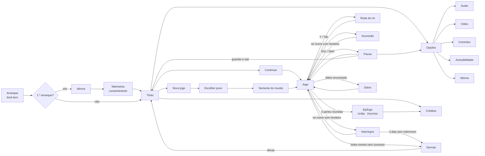

# UI/UX — ecrãs, fluxos e o contrato do HUD

> O dossiê decide a filosofia: **dois verbos** (§05), **um único elemento de HUD permanente** — o relógio da
> dívida, e só quando há dívida (§24) —, a roda do rei como o único menu dentro do jogo, ícones entalhados em vez
> de palavras, texto ≥ 12 px (§26) e comando primeiro (§24, §26). Este documento lista **todos os ecrãs** e o que
> cada um faz com cada dispositivo, para a UI diegética ter um contrato tão fechado como a simulação.
>
> Registo: [`SCREEN_REGISTER.csv`](SCREEN_REGISTER.csv) · Textos: `data/i18n/strings.csv` · Glossário:
> `docs/localization/GLOSSARY.csv`

## 1 · O mapa

## 2 · Regras que valem para todos os ecrãs

| Regra | Especificação | Dossiê |
|---|---|---|
| Comando primeiro | Todo o ecrã se navega com D-pad/stick, **A confirma, B volta**. Nenhum ecrã exige rato | §24, §26 |
| Foco sempre visível | O elemento com foco tem o realce de madeira entalhada + contorno de 2 px; o rato, ao passar, **move o foco** — não há um "hover" diferente do foco | §26 |
| Teclado | Setas / WASD navegam, Enter/Espaço confirmam, Esc volta | §24 |
| Glifos | Os glifos no ecrã correspondem ao dispositivo ativo (teclado, Xbox, PlayStation, Deck) — troca de atlas por `Input.get_joy_name` | §26 |
| Texto | ≥ 12 px de altura de carácter a 1280 × 720; nada abaixo de 9 px a 1280 × 800 | §26 |
| Texto de entrada | Só o nome do save, e pela API de teclado do Steamworks no Deck | §26 |
| Palavras | Dentro do jogo, ícones; nos menus, texto por chave (`data/i18n/strings.csv`). Nunca concatenar frases | §24, §27 |
| Pausa | Esc/Start pausam sempre, em qualquer ecrã de jogo; emite `game_paused` | §24, §46 |
| Voltar | B/Esc volta sempre ao ecrã anterior; no título, pede confirmação para sair | — |
| Som | Mover o foco: `sfx_ui_move`; confirmar: `sfx_ui_confirm`; voltar: `sfx_ui_back` (AUDIO_CUE_SHEET) | §23 |
| Animação | Entradas de ecrã ≤ 150 ms; com redução de movimento, instantâneas | §26 |

### 16:9, Steam Deck e ultralargo

A resolução interna é 1280 × 720 com `canvas_items` e escala `fractional` (§19). A **largura visível do mundo é
limitada a 1,25× o rácio 16:9** — 1600 px de mundo — para ecrãs ultralargos não verem A Podridão chegar mais cedo
(§19). Para lá disso, barras laterais. A UI ancora-se sempre à área 16:9 central: nada de informação nas bordas que
um ecrã 16:9 não mostra. No Steam Deck (1280 × 800) a imagem é 1:1 com barras de 40 px (§19, §26).

## 3 · Os ecrãs

Para cada ecrã: como se entra e sai, o foco inicial, e o que cada dispositivo faz. Os textos são chaves de
`strings.csv`.

### Arranque (`boot.tscn`)
Carrega o `Registry`, o idioma e o save, decide que `game.tscn` instanciar e entrega (§70, ADR 0005). Sem input.
Alvo: jogável em ≤ 4 s (§63). Hoje é o *placeholder* do dia zero.

### Primeiro arranque — idioma e telemetria
Só na primeira vez. **Idioma**: lista vertical, foco no idioma do sistema. **Telemetria**: `UI_TELEMETRY_PROMPT`
com `UI_YES`/`UI_NO`, **foco em Não** — desligada por omissão na versão pública, sem dados pessoais, conforme o RGPD
(§32). A escolha muda-se em Opções (`OPT_TELEMETRY`).

### Título
`UI_CONTINUE` (só se houver save; é o foco inicial quando existe) · `UI_NEW_GAME` · `UI_OPTIONS` · `UI_CREDITS` ·
`UI_QUIT`. Fundo: a cena-cartaz do povo com a última gravação, com luz de crepúsculo (§22). Sem logótipo até haver
nome (NAMING_BIBLE).

### Novo jogo → Escolher povo → Semente
**Povo** (`UI_CHOOSE_PEOPLE`): na fatia vertical só existe Enramados — o ecrã aparece quando houver dois. Cada povo
mostra a silhueta dos telhados (é o teste de identidade, §22), o arquétipo e a tropa única; nunca números.
**Semente** (`UI_WORLD_SEED`): campo numérico com `UI_SEED_RANDOM`; a semente é visível e copiável depois, na
pausa (§42). No comando: stick para cima/baixo muda dígitos.

### Jogo
O mundo é a interface (secção 4). Entradas: os dois verbos, a roda do rei, câmara livre e pausa (§24).

### Roda do rei
Manter **Y / Tab** com o monarca assumido. Vitral de seis segmentos: *construir · recrutar · ofícios · impulso ·
expedição · sucessão* (§24). Selecionar é apontar o stick e **largar**; no teclado, Tab + 1–6 (a §24 diz 1–5 para
impulsos — Q-034). No rato: clicar no segmento. Ícones entalhados, nunca palavras. Fecha ao largar; B cancela.
O jogo **não pausa** com a roda aberta — é o corpo do rei, não um menu (§05). Proposta: abrandar o tempo para 50%
enquanto está aberta, desligável.

### Pausa
`UI_PAUSED`: `UI_RESUME` (foco) · `UI_OPTIONS` · `UI_SEED_COPY` (a semente, visível e copiável, §42) ·
`UI_SAVE_AND_QUIT`. O jogo pára de verdade (`game_paused`).

### Opções
Quatro separadores — `UI_AUDIO`, `UI_VIDEO`, `UI_CONTROLS`, `UI_ACCESSIBILITY` — e `UI_LANGUAGE`. LB/RB mudam de
separador. Cada alteração aplica-se logo; B volta e guarda em `user://settings.cfg` (a câmara e as preferências não
são estado de jogo, §45).

| Separador | Opções |
|---|---|
| Áudio | `OPT_MASTER_VOLUME` · `OPT_MUSIC_VOLUME` · `OPT_SFX_VOLUME` · `OPT_CAPTIONS` |
| Vídeo | `OPT_FULLSCREEN`/`OPT_WINDOWED` · `OPT_CRISP_PIXELS` (escala inteira com barras, §19) |
| Controlos | `OPT_REMAP` — remapeamento completo por `InputMap` (§26) |
| Acessibilidade | `OPT_DAY_LENGTH` (240–540 s) · `OPT_SCREEN_SHAKE` · `OPT_FLASHES` · `OPT_COLORBLIND` · `OPT_CONTRAST` · `OPT_TEXT_SIZE` · `OPT_CAPTIONS` |

### Gravação
Três espaços com rotação (§62): `UI_SLOT_N` com `UI_SLOT_DAY_N` (dia e povo) ou `UI_SLOT_EMPTY`. Autosave no
amanhecer de cada dia; não há "gravar" manual durante a noite.

### Sucessão · Interregno · Derrota
**Sucessão** (`UI_SUCCESSION`): ao amanhecer, o herdeiro assume — um ecrã de 3 s com o novo monarca e a ganância
sorteada, **lida pelo número de nobres na varanda**, não por um número (§15, §24). **Interregno**
(`UI_INTERREGNUM`): 3 dias sem construir, ganância a 80 (§16) — é estado do jogo, com o castelo sem coroa; não
bloqueia. **Derrota** (`UI_CROWN_FALLEN`): o que se mantém pelo *decay* — Sementes Reais, classes, mapas, segredos,
40% das estruturas (§16) — mostrado como objetos, e volta ao título.

### Diário
Ao encontrar um diário (`secret_found`), abre o texto (`JOURNAL_NN_TITLE`, `JOURNAL_NN_BODY`) sobre pergaminho. É o
único ecrã com parágrafos: tamanho de texto configurável, ≤ 600 caracteres por fragmento. A fecha; os diários lidos
ficam na roda do rei, segmento sucessão.

### Epílogo · Créditos
**União** ou **Domínio** conforme poupaste ou mataste os reis (§17): uma sequência curta de ecrãs com a colagem
arquitetónica final. Depois, créditos com as licenças de terceiros (NOTICE.md).

## 4 · O contrato do HUD diegético

O §24 define-o; aqui acrescenta-se o evento que o alimenta e a alternativa de acessibilidade, que é **opcional e
desligada por omissão** — o jogo continua a ser o mundo a dizer as coisas.

| Informação | Como se mostra | Evento (§46) | Alternativa (Acessibilidade) |
|---|---|---|---|
| Moedas | O saco do personagem enche; moedas caem quando está cheio | `coin_collected`, `treasury_changed`\* | contador junto ao saco, opt-in |
| Coroa / ganância | Nobres visíveis na varanda do castelo | `greed_changed` | — (é informação tática, não de acessibilidade) |
| Hora do dia | Cor da luz + posição do sol/lua | `phase_changed` | ícone de fase no canto, opt-in |
| Podridão a chegar | A mancha no horizonte + *stem* de tensão | `rot_spawned`, `rot_moved` | legenda `CAPTION_ROT_NEAR` + alto contraste da mancha |
| Aviso de crepúsculo | Som distinto | `dusk_fell` | legenda `CAPTION_DUSK_WARNING` |
| Amanhecer | Sino + varrimento de luz | `dawn_broke` | legenda `CAPTION_DAWN_BELL` |
| Vida de tropa | Camada `face` muda para ferido abaixo de 50% | `unit_damaged` | — |
| Nível de muralha | Material e silhueta | `wall_upgraded` | — |
| Muralha a cair | Tremor ≤ 4 px + som | `wall_breached` | legenda `CAPTION_WALL_BREACHED`; tremor desligável |
| Construção | Silhueta fantasma a piscar no *slot*; moedas a acumular | `build_started`, `build_progressed` | — |
| Seleção / assumir | Contorno do personagem controlado (`outline_dilate`) | — | contorno mais grosso, opt-in |
| Dano | *Flash* 80 ms, *knockback* 3 px, partícula | `unit_damaged` | *flashes* desligáveis |
| Recursos (matéria) | Carroças entre edifícios — **nunca números** | `material_produced`, `material_consumed` | — |
| Dívida e prazo | **O único HUD permanente**: contador de 6 dias no canto superior direito | `debt_incurred`, `debt_defaulted` | legenda `CAPTION_DEBT_DUE` |
| Sementes Reais | Roda do rei, segmento sucessão | `seed_royal_gained` | — |

\* `treasury_changed` existe no `event_bus.gd` do §30 mas **não** no catálogo da §46, que é a lista fechada — Q-035.

## 5 · O que a UX ainda não decidiu

- A roda do rei pausa, abranda ou deixa correr o tempo? (proposta: abranda a 50%, desligável) — Q-034.
- O ecrã de escolha de povo aparece na demo (um povo só)? Proposta: não; entra com o segundo povo.
- Onde vive o *placeholder* do título até haver nome — decidido: sem logótipo (NAMING_BIBLE).

## 6 · Parte XIII — três fluxos novos, zero ecrãs novos

> Fonte: §74, §75, §78. **Nenhum destes fluxos abre um menu, uma caixa ou um ecrã.** Todos passam pelo Verbo 1 —
> largar uma moeda, uma tropa ou uma Semente — sobre um alvo que está no mundo. É o que mantém o jogo jogável em
> comando sem UI de rato (§26) e o HUD diegético (§24).

### O Amargueiro — três destinos, um gesto

| Destino | O gesto | O alvo | Quando |
|---|---|---|---|
| Cortar | Largar 6 moedas na base | a base do tronco | a partir da segunda alvorada |
| Consagrar | Largar 1 Semente Real na base | a base do tronco | logo na primeira alvorada |
| Deixar | Nada | — | sempre |

A moeda que se larga é que decide. **Não há confirmação** — mas há um aviso que não é UI: a cara mostra-se antes de
a serra entrar, e o corte demora 12 s. O tempo é a confirmação.

### A Oferta — um alvo, não um menu

1. A mancha chega a 300 px da muralha mais exterior. A música baixa; a candeia sobe de brilho meio segundo.
2. Uma frase aparece **no mundo**, junto à mancha, na tipografia entalhada da §24. Nunca numa caixa. Fica 20 s.
3. Com a frase aparece um **prato de barro** no chão, à borda da mancha, do tamanho de um slot de construção.
4. Aceitar é pôr o preço **dentro do prato**: as moedas atiradas para lá, a tropa mandada andar até ele, a Semente
   largada nele.
5. Recusar é não fazer nada. Passados 20 s o prato afunda-se e a noite continua.

| Situação | O que acontece | Porquê |
|---|---|---|
| Uma moeda solta cai perto da mancha durante o combate | Nada. Só conta o que cai no prato. | Perder uma tropa nomeada por um clique mal dado seria a coisa mais injusta do jogo |
| Aceitaste e não pagaste tudo em 20 s | Caduca e conta como recusa. O que estava no prato volta ao chão. | Sem meias-aceitações não há estados intermédios para depurar |
| Duas manchas (dia 12+) | Uma oferta por noite, na que chegar primeiro. A outra fica calada. | A voz é uma pessoa, não um sistema de menus |
| O preço deixou de existir a meio | Caduca como recusa, sem penalização extra | O jogo não pune por causa das suas próprias condições de corrida |

### A Colheita — uma decisão, no núcleo deles

No fim da Colheita, o Verbo 1 sobre o núcleo do povo: largar lá uma moeda **solta** (soltar) ou uma tropa
**tua** (ficar). Não há ecrã, não há botões, e não há forma de adiar — enquanto não decidires, a aldeia continua
fora das tuas muralhas.

O mostrador do que já decidiste são os **estandartes** sobre o teu núcleo: um mastro por povo, sempre na mesma
ordem, hasteado pelos soltos e vazio pelos ficados (§82). É a redundância visual do coro, e é o único elemento de
HUD que a Parte XIII acrescenta — diegético, sem números.
