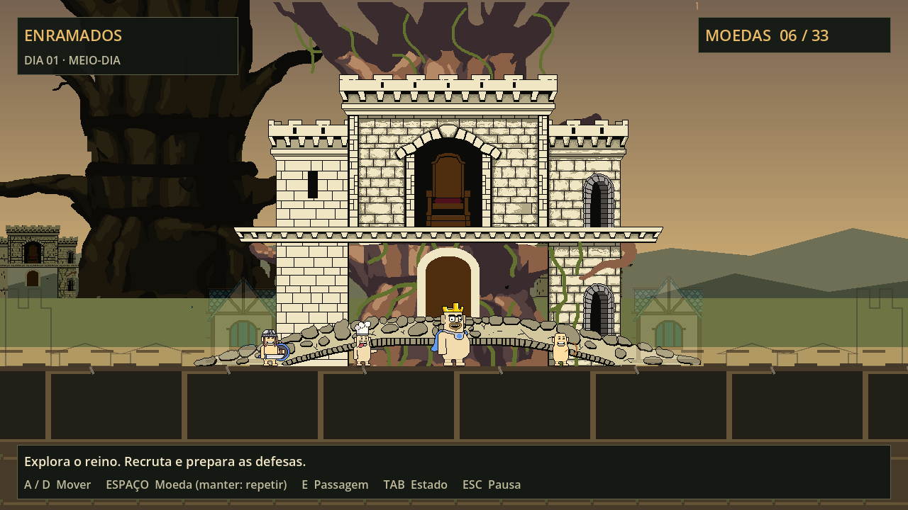
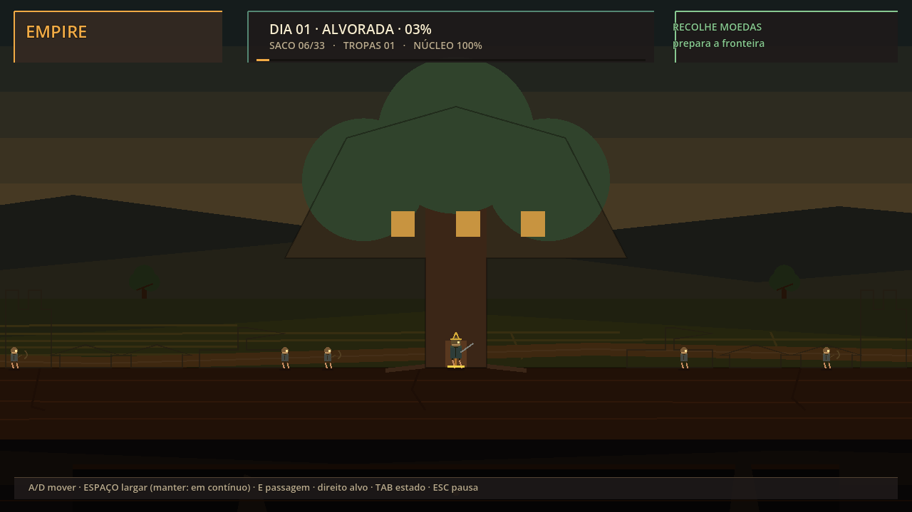
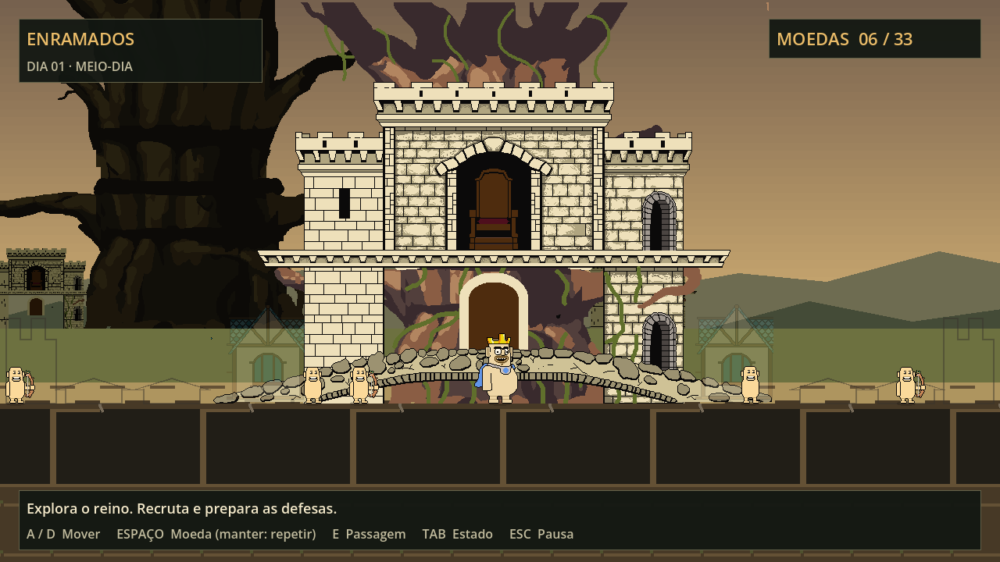
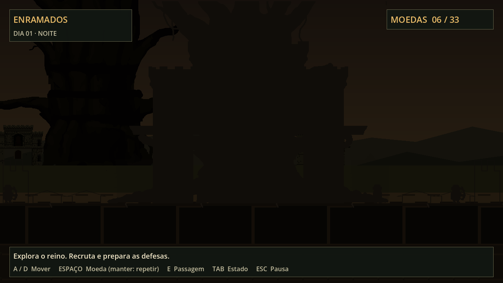
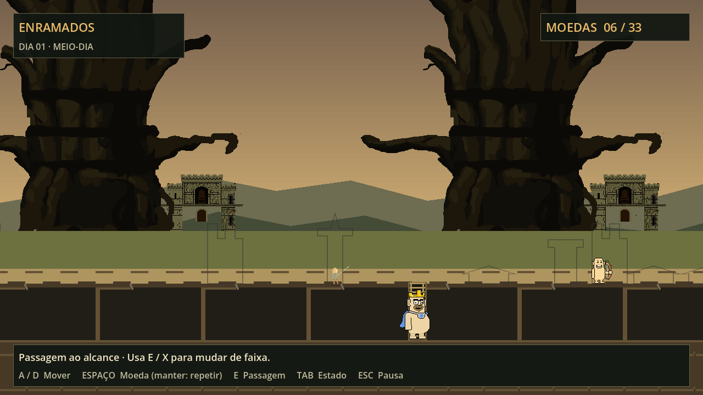
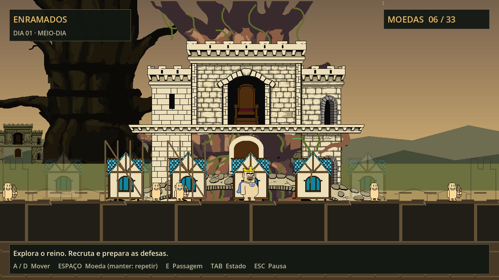
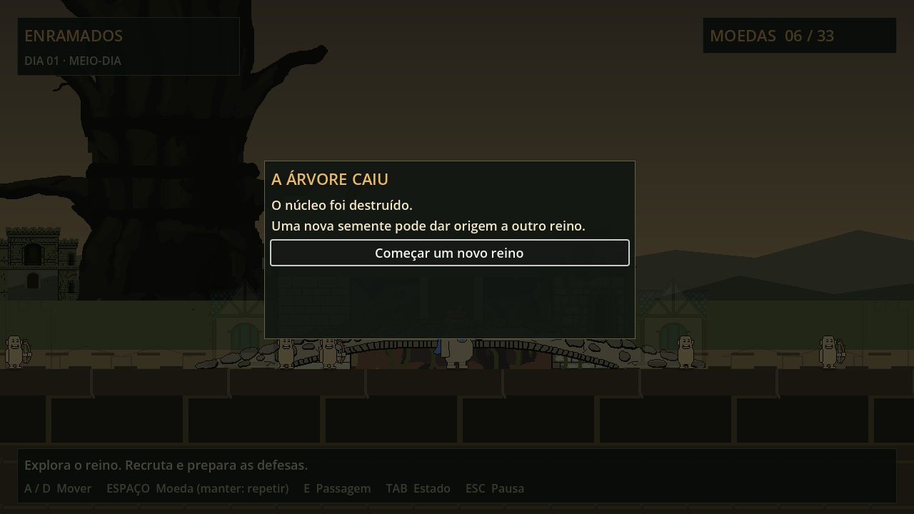

# Aplicação do relatório visual — 19/09/2026

Estado: **integração técnica implementada; acabamento artístico parcial**.

## Correção de direção após a primeira entrega

O autor esclareceu quais personagens estavam quase concluídos e rejeitou o arqueiro de conceito. A [direção atual](../art/REFERENCE_AUTHORITY.md) fixa soldado, cozinheiro e elenco enviado como referências; rei exige redesign. O arqueiro antigo saiu do atlas e dos exports. O runtime usa provisoriamente o corpo/rosto da tropa com marca de arco, sem apresentar essa combinação como personagem final. O manifesto registra os estados de revisão e a checagem recusa exports obsoletos.

Foi gerado um estudo do rei a partir dos anexos, identificado como proposta e sem uso no jogo. A limitação de geração descrita abaixo corresponde à primeira entrega. As capturas e medições originais também são históricas, anteriores à correção; a nova representação de arqueiros acrescenta marcas de arco e precisa de medição própria.

Revisão de 20/09: o estudo do rei passou à v2 após o autor apontar a falta de leitura das vestimentas. A nova proposta tem túnica azul-petróleo e peças de roupa claramente delimitadas. Esta revisão altera a documentação e o estudo visual; o sprite do jogo continua provisório.

O cenário continua com acabamento pendente. A revisão especifica melhorias sobre a arquitetura do autor — volumes, vegetação, conexões entre níveis e materiais — sem declarar que já foram desenhadas.



Captura preparada `cast`: soldado, cozinheiro, rei antigo provisório e arqueiro temporário com corpo/rosto da tropa e marca de arco. A simulação fica suspensa nessa fixture para manter a comparação alinhada; seus tempos não medem desempenho jogável. O rei do estudo não aparece nesta captura.

Validação desta revisão: **404 testes passaram, 9 skips existentes, 0 falhas/erros/órfãos** (413 casos); portões estáticos e reprodução dos exports passaram; PCK gerado e iniciado até o jogo. Vistoria configurada para 8 dias terminou com derrota no dia 2, sem inconsistências. Registros: [suite](evidence/direction-tests.txt), [portões](evidence/direction-gates.txt), [boot do PCK](evidence/direction-pack.txt) e [vistoria](evidence/direction-vistoria.txt).

Base: `b018fb1d3b9e5cf077327d50724458fe24ba1bb2`, branch padrão `claude/gracious-ptolemy-efyrb5`. Pedido do autor: aplicar o [planejamento](PLAN-2026-09-19.md). Decisões de implementação: [ADR 0022](../adr/0022-original-art-presentation.md), acompanhamento: [VIS-01](../backlog/VIS-01.md).

## Resultado no jogo

| Antes: desenho procedural | Depois: fontes originais integradas |
| --- | --- |
|  |  |

O antes é uma captura da base; o depois usa a cena real em uma configuração preparada de meio-dia. Horário e posição dos atores não são sincronizados entre as duas imagens. Nenhuma captura é um mockup.

| Área | Entrega verificável | Limite atual |
| --- | --- | --- |
| Identidade | Rei, arqueiro, cavaleiro, vagabundo e cozinheiro exportados dos originais; atlas partilhado, pivôs e tempos nativos | Roupa medieval e expressões adicionais precisam de arte; cozinheiro depende de ser criado na partida |
| Ambiente | Castelo-árvore e casa de treino originais, seis planos, três paralaxes, troncos e fortaleza distante | Copas, raízes e materiais finais ainda faltam; parte das construções mantém o desenho procedural |
| Construção | Fantasma, andaime, obra, concluída, dano e ruína para os dois perfis integrados | Andaime/dano/ruína são representações transitórias, não sprites finais por estado |
| Movimento | Interpolação por ID, câmera na mesma amostra, transições de faixa e teleporte sem arrasto | Caminhada estática com oscilação de 1 px; ciclos completos não existem nas fontes |
| Combate | Cor de impacto no sprite, partícula na posição interpolada, contato curto na fundação das construções originais | Animações específicas de ataque, medo, ferida e morte permanecem abertas |
| Legibilidade | HUD compacto, contexto, comandos de teclado/controle, pausa e derrota com reinício, PT-PT/EN | Sem avaliação com jogadores nesta entrega |
| Nitidez | Viewport 1280×720, nearest, escala inteira e posições de desenho inteiras | 1080p tem barras; 1440p usa 2×; Steam Deck ainda não validado |
| Noite | Silhuetas castanhas e revelação pelas luzes existentes; shader separado dos sprites | A direção artística noturna ainda depende de acabamento e avaliação visual |

## Fontes e reprodução

Os três arquivos do autor estão em `art/source/originals/`. `manifest.json` registra SHA-256, camadas selecionadas, dimensões, pés, quadros e tempos. Os pixels foram extraídos sem reamostragem; o rei de 90 px é uma exceção declarada à escala proposta de 64 px. O idle da tropa dura **650 ms**, incluindo o quinto quadro de 150 ms.

`tools/aseprite_source.py` lê os recursos usados por essas fontes e recusa recursos não suportados. `tools/export_originals.py` exporta PNGs, atlas e manifesto; `make arte` compara a reprodução byte a byte. Pillow já era uma dependência das ferramentas. As exceções de LFS permitem checkout e CI com as imagens disponíveis. O manifesto foi incluído nos presets de exportação.

```sh
make arte
make portoes
make dados
make testes
make vistoria DIAS=8
godot --headless --path . --export-pack Linux build/empire.pck
godot --headless --main-pack build/empire.pck --max-fps 60 --quit-after 180
```

## Verificações executadas

Ambiente: Godot **4.6 stable**, Linux, renderer Compatibility com **llvmpipe** (software).

| Verificação | Resultado |
| --- | --- |
| Suite completa gdUnit4 | 412 casos: **403 passaram, 9 skips existentes, 0 falhas, 0 erros, 0 órfãos** |
| Ajuste final dos impactos | **7/7 passaram** na suite `impact_view_test.gd`, repetida após ajustar o desenho |
| Formatação, lint/250 linhas, RNG, workflows, conteúdo, especificação, contagens | `make portoes` passou |
| Fontes e dados | `make arte` reproduziu os exports; CSV/TRES com 0 problemas |
| Shader LUT neutro | Comparação gráfica RGBA: erro máximo **0**, corrigindo multiplicação dupla da textura |
| Vistoria com piloto | Configurada para 8 dias; terminou com derrota normal no dia 2, sem inconsistência de estado. Não é evidência de sobrevivência por 8 dias |
| Export | PCK Linux gerado e iniciado até a cena de jogo; não equivale a um executável independente. Windows/Web não executados |
| Resolução | Janelas 1280×720, 1920×1080 e 2560×1440 verificadas; viewport permaneceu 1280×720 |
| Passagem | Intenção real de troca de faixa: rei chegou à faixa 2; teto subterrâneo ajustado à altura original |

Os registros estão em [evidence](evidence/). `tests-full.txt` inclui mensagens esperadas dos testes de validação/segurança; a conclusão da suite é a fonte dos totais. `docs/recovery/validation.json` conserva os campos históricos da execução antiga, além das contagens atualizadas, e não substitui este registro.

## Capturas adicionais

| Noite preparada | Passagem e faixa subterrânea |
| --- | --- |
|  |  |

| Construções em estados preparados | Derrota |
| --- | --- |
|  |  |

`visual_review.gd` prepara horário, população e estados para inspeção; a captura de noite dessa ferramenta não aciona a progressão completa dos encontros. `night-active.png/json` vem de simulação avançada por 307 segundos. As imagens de resolução são do viewport, portanto não mostram as barras externas da janela. Pausa, derrota e construção são fixtures, não registros de uma campanha completa.

## Desempenho medido e limites

Medição: 60 quadros de aquecimento, 120 quadros registrados, seed 20260919; valores dos JSON versionados. População de 300 distribuída pelo mapa de 3840 px, com culling: **não são 300 sprites simultaneamente visíveis**.

| Cena | Unidades totais | Nós | Draw calls máximos | Texturas | Frame p50 | Frame p95 | Física p95 |
| --- | ---: | ---: | ---: | ---: | ---: | ---: | ---: |
| Dia | 10 | 55 | 93 | 13,69 MiB | 18,18 ms | 24,39 ms | 2,29 ms |
| População ampliada | 300 | 55 | 93 | 13,69 MiB | 41,67 ms | 101,60 ms | 34,12 ms |

O desenho usa um canvas por faixa e atlas partilhado, sem nós por personagem. Estas medições demonstram os recursos utilizados nesta fixture. **Não demonstram 60 FPS nem aprovam o orçamento de 300 entidades visíveis**: o renderer de software tem tempos elevados e variáveis. A simulação não foi otimizada nesta alteração. Validação em hardware, concentração de entidades visíveis e captura de um minuto continuam pendentes.

## Trabalho artístico que permanece aberto

A geração de imagens foi tentada e bloqueada pelo limite de utilização; nenhuma arte nova foi gerada. A integração usa exclusivamente os originais disponíveis. ART-01 a ART-04 continuam em curso.

1. Roupa medieval completa e expressões normal/hurt/hit/fear com a identidade original.
2. Ciclos walk/work/attack/die, montarias, funções sem sprites próprios e sincronização de eventos de animação.
3. Copas e raízes autoradas, chão e bordas finais, estados desenhados das demais construções.
4. Acabamento noturno, demais biomas, áudio e revisão artística do trecho completo.
5. Medição em hardware e inspeção de uma sequência jogável de um minuto.

Esses itens são necessários para aceitar o acabamento visual completo proposto no relatório. Esta entrega deixa o jogo usando as fontes originais, com fluxo de exportação e apresentação pronto para receber os desenhos seguintes.
