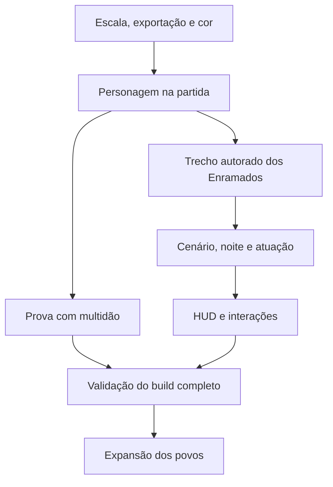

# Empire — planejamento de evolução visual e design

**Data:** 19 de setembro de 2026

> **Adendo após a primeira implementação:** o autor corrigiu a hierarquia de referências. O soldado, o cozinheiro e os demais personagens quase completos enviados orientam o trabalho; rei exige redesign; arqueiro antigo é conceito rejeitado. [Direção atual e referências](../art/REFERENCE_AUTHORITY.md). Este planejamento permanece como registro da auditoria; não confere aprovação artística aos arquivos que encontrou.

**Objetivo:** levar a apresentação do jogo à linguagem das pixel arts e dos cenários de referência, com personagens expressivos, circulação compreensível e movimento consistente.

**Base auditada:** `henriquecoding/empire`, commit `b018fb1d3b9e5cf077327d50724458fe24ba1bb2`.

**Tipo de entrega:** diagnóstico do código e dos materiais existentes, direção visual proposta e plano de implementação com critérios de saída.

## 1. Decisão principal

**O próximo marco deve ser um trecho jogável dos Enramados com arte final integrada.** Esse trecho precisa reunir o Rei, uma tropa original, a árvore-castelo, uma construção, uma passagem subterrânea e a primeira situação noturna. Ele será a referência concreta para produzir o restante do jogo.

O repositório já tem documentação de arte, dados de conteúdo e sistemas de simulação. A lacuna mais importante está entre esses materiais e aquilo que a cena jogável desenha: a maior parte da apresentação atual é construída com formas procedurais, enquanto o caminho previsto para os sprites ainda está incompleto.

### Ordem recomendada

1. Fixar a versão de trabalho e resolver os contratos de escala, exportação e cor.
2. Colocar uma personagem original animada na cena jogável.
3. Finalizar a composição horizontal de um trecho dos Enramados.
4. Integrar árvore-castelo, terreno e estados visuais das construções.
5. Trabalhar expressões, movimento, noite e feedback das ações em conjunto.
6. Refinar HUD, pausa e derrota.
7. Medir o custo da apresentação com multidões; expandir o padrão para outros povos depois da validação.

O critério de sucesso é reconhecer a identidade do Empire durante uma partida, no tamanho real de exibição.

## 2. O que foi efetivamente analisado

### 2.1 Código e versão

| Referência | Estado observado |
|---|---|
| Branch padrão do GitHub | `claude/gracious-ptolemy-efyrb5`, commit `b018fb1` |
| `main` | Commit `efccb18a7ed8f3810915f28627b27089e4f1c524` |
| Comparação entre as duas pontas | A branch padrão está dois commits à frente; a diferença de arquivos é somente `project.godot` |
| Configuração do motor | `.godot-version` fixa `4.6-stable`; a branch padrão declara `4.7` em `config/features` |
| Cena de execução | `boot.tscn` entrega a execução a `game.tscn` |
| Apresentação de personagens em `game.tscn` | `BandView` chama `ActorArt.draw_unit()` |
| Base para sprites | `UnitView` existe, mas não compõe as tropas desenhadas por esse caminho da cena jogável |

A diferença entre branches não explica, por si só, a distância artística. É relevante para reproduzir a mesma imagem e evitar analisar ou testar configurações diferentes. [Comparação dos commits no GitHub](https://github.com/henriquecoding/empire/compare/efccb18a7ed8f3810915f28627b27089e4f1c524...b018fb1d3b9e5cf077327d50724458fe24ba1bb2).

### 2.2 Materiais consultados

- Documentos de produção: `ASSET_BIBLE`, `ANIMATION_BIBLE`, `EXPRESSION_GUIDE`, registros de assets e segmentos, regras de greybox e matriz de desempenho.
- Dossiê atual do repositório, especialmente §§01, 11, 22, 24, 73, 80 e 83; essas seções têm o mesmo texto normalizado no `dossie-empire-v6_1.html` fornecido.
- Arquivo `Empire-v6-parte-xiii.zip`, usado como referência de continuidade. O diagnóstico de código se refere ao commit do GitHub acima.
- Documento `EMPIRE-DIRECAO-DE-ARTE-PERSONAGENS-CENARIOS.md`, lido na versão disponível. As propostas de 12 de setembro precisam ser conciliadas com a direção v6 posterior.
- Três imagens: o assentamento agrícola com silo e armazenamento subterrâneo; a árvore-castelo com povoado e corte do solo; e `A ponte dos que voltaram.png`.
- Fonte original `Empire troop.aseprite`, incluindo leitura estrutural e visualização de seu primeiro frame composto.

### 2.3 Inventário verificável

Contagem feita nos arquivos deste commit, em 19/09/2026:

| Item | Contagem ou estado |
|---|---:|
| Arquivos `.aseprite` versionados em `art/` | 0 |
| PNGs versionados em `art/` | 2, ambos em `_placeholder/` |
| Linhas em `ASSET_REGISTER.csv` | 261 |
| Estados declarados nesse registro | 251 `TODO`, 7 `DRAWING`, 1 `ANIMATION`, 2 `IN_GAME` |
| Linhas em `VFX_REGISTER.csv` | 42, todas declaradas `TODO` |
| Linhas em `SEGMENT_REGISTER.csv` | 53, todas com pintura e greybox declaradas `todo` |

Esses números descrevem o repositório e seus registros. Existem fontes originais fora dele, como a tropa consultada. Além disso, o jogo já contém alguns efeitos procedurais; portanto, um registro com `TODO` não prova ausência absoluta de uma implementação equivalente. É necessário ligar cada entrada à cena ou recurso que realmente a utiliza.

**Limite desta análise:** não foi executado um build gráfico do Godot nesta sessão. As imagens inspecionadas são referências artísticas, e não capturas do commit auditado. Diagnósticos de código e medidas de arquivos estão identificados abaixo; efeitos sobre FPS, legibilidade durante uma partida e qualidade de animação precisam ser medidos no executável.

## 3. Diagnóstico: por que a apresentação ainda fica distante da arte

### 3.1 A personagem original não chega à cena jogável

`ActorArt` produz pernas, tronco, cabeça, chapéu e ferramenta por chamadas de desenho. A função `_cara()` desenha uma cabeça circular, um bloco de olho e uma linha de boca. Esse conjunto não contém a atuação facial que existe na arte original: separação de olhos, boca com forma própria, dentes agrupados e diferenças entre personagens.

`UnitView` oferece cinco slots, sombra, material e um `AnimationPlayer`, mas falta a ligação completa entre fontes exportadas, seleção de animação, identidade visual e entidades da partida. **A primeira prioridade é concluir essa ligação.** [ActorArt](https://github.com/henriquecoding/empire/blob/b018fb1d3b9e5cf077327d50724458fe24ba1bb2/src/world/actor_art.gd#L137-L164), [BandView](https://github.com/henriquecoding/empire/blob/b018fb1d3b9e5cf077327d50724458fe24ba1bb2/src/world/band_view.gd#L172-L191), [UnitView](https://github.com/henriquecoding/empire/blob/b018fb1d3b9e5cf077327d50724458fe24ba1bb2/src/actors/unit_view.gd).

### 3.2 O cenário é um arranjo de formas e posições genéricas

`TerrainArt` distribui montanhas, casas, árvores e câmaras em frações da largura total da região. `PropArt` repete uma casa básica e uma árvore de copas circulares. `StructureArt` detalha construções dentro da caixa fornecida por `BuildView`.

Isso dá suporte ao protótipo, mas oferece pouco controle autoral sobre silhuetas únicas, proporção de fachadas, espaços vazios, acessos e enquadramentos. Ampliar a região também afasta os elementos definidos por porcentagens; não cria automaticamente trechos bem compostos entre eles.

Os recursos de segmento já apontam para caminhos como `scenes/segments/enramados/enramados_start_base_01.tscn`, mas essas cenas autoradas ainda não estão presentes. `Greybox` monta a região e seus pontos diretamente. [TerrainArt](https://github.com/henriquecoding/empire/blob/b018fb1d3b9e5cf077327d50724458fe24ba1bb2/src/world/terrain_art.gd), [Greybox](https://github.com/henriquecoding/empire/blob/b018fb1d3b9e5cf077327d50724458fe24ba1bb2/src/world/greybox.gd), [Segmento inicial](https://github.com/henriquecoding/empire/blob/b018fb1d3b9e5cf077327d50724458fe24ba1bb2/data/segments/enramados_start_base_01.tres).

### 3.3 Há contratos de escala incompatíveis

| Origem | Regra ou medida |
|---|---|
| Preferência artística do autor | Rei/jogáveis com referência em 64×64; tropas e ofícios menores, com referência em 32×32; acessórios podem ultrapassar o corpo |
| `ASSET_BIBLE` | Alturas úteis de 32–36, 46–52 e 56–62 px, conforme a escala; telas de exportação maiores |
| Desenho procedural | `16 × scale_tier`: caixas de 16, 32 e 48 px de altura |
| `Empire troop.aseprite` inspecionado | Tela de 192×192; cel `Body` do primeiro frame de 24×47; cel `Face` de 12×14 |

**Tela, corpo visível, acessórios e escala no mundo são medidas diferentes.** A tela de 192×192 não torna a personagem uma figura desenhada com 192 pixels de altura. A tropa original também não deve ser reduzida automaticamente para caber em uma caixa quadrada.

A referência 32/64 precisa ser traduzida em uma prancha de escala com os originais. Onde uma fonte existente ultrapassar essa referência, registrar a exceção e avaliar o desenho junto do Rei. Alterar `scale_tier` ou reduzir a textura inteira para resolver isso produziria uma mudança indireta e difícil de controlar.

### 3.4 Os documentos já contêm conflitos que afetam o resultado

| Conflito | Encaminhamento proposto |
|---|---|
| `EXPRESSION_GUIDE` proíbe bocas assimétricas em repouso | Permitir assimetria deliberada quando ela pertence à identidade da personagem; avaliar clareza no tamanho nativo |
| O guia posterga a mudança de expressão até a fronteira da animação | Dar prioridade imediata a dano e medo; sincronizar a posição da face com a cabeça sem atrasar informação de jogo |
| `ANIMATION_BIBLE` calcula o passo usando 26 px/s | Recalcular com os dados atuais: o monarca e diversas tropas já usam 80 px/s, conforme ADR 0021 |
| O documento trata o idle original como 6 frames uniformes de 100 ms | A fonte lida tem durações `100, 100, 100, 100, 150, 100` ms, totalizando 650 ms; conservar esses tempos como referência |
| `ASSET_BIBLE` lista `shield`, mas `UnitView.SLOTS` não o contém | Resolver o escudo no contrato de exportação e composição, incluindo sua ordem atrás/à frente do corpo |
| Exigir sempre 30% de céu acima do telhado versus árvore monumental saindo da imagem | Dar à árvore central uma exceção documentada; manter espaço negativo nas laterais e nos trechos adjacentes |
| ADR 0001 propõe filtro suave, enquanto a intenção do autor exige nitidez | Testar a política de exibição com sprites reais e fechar a ADR de acordo com a nitidez desejada |

### 3.5 A interface ainda usa a linguagem do protótipo

`GameHud` desenha três painéis grandes no topo, uma barra de progresso e uma faixa de controles. Textos visíveis estão escritos diretamente em português no script, apesar da estrutura de localização existente. A atualização percorre tropas e construções a cada frame.

A derrota também precisa de um estado de apresentação próprio: a destruição do núcleo pausa a simulação; o HUD usa `not SimLoop.running()` para mostrar uma mensagem de pausa. Esse caminho pode apresentar uma derrota como se bastasse continuar. A revisão deve ligar o estado do núcleo à tela correta. [GameHud](https://github.com/henriquecoding/empire/blob/b018fb1d3b9e5cf077327d50724458fe24ba1bb2/src/ui/game_hud.gd), [Game](https://github.com/henriquecoding/empire/blob/b018fb1d3b9e5cf077327d50724458fe24ba1bb2/src/world/game.gd).

### 3.6 Fluidez: há trabalho visual que pode ser evitado

Constatações de código:

- `BandView` agenda redesenho a cada frame e percorre coleções de unidades, criaturas e construções; não há filtro horizontal de visibilidade nesses percursos.
- A posição das tropas é lida diretamente das colunas atualizadas pelo tick de 30 Hz. Não foi encontrado, nesse caminho, um par de posições anterior/atual para interpolação de apresentação.
- `GameHud` recalcula contagens e textos a cada frame.
- `TerrainBackdrop` já evita redesenhar geometria em todos os frames: atualiza por fase e por oito intervalos de progresso da iluminação. Essa separação é útil, embora as transições de cor precisem de inspeção visual.

A inferência é que existem oportunidades para reduzir trabalho e melhorar a continuidade do movimento. Não é possível atribuir um custo em milissegundos a esses pontos sem uma captura do profiler. O cache de comandos de `_draw()` é documentado pelo Godot; a chamada a `queue_redraw()` volta a solicitar sua execução. [Godot — desenho 2D e atualização](https://docs.godotengine.org/en/4.6/tutorials/2d/custom_drawing_in_2d.html#updating).

## 4. Direção artística proposta para a versão v6

**Um reino de conto popular ibérico, habitado por figuras cômicas e expressivas, onde a noite transforma lugares familiares em espaços inquietantes.**

### Os cinco pilares

1. **Atuação facial.** Boca, olhar e postura comunicam personalidade e estado. O humor tem de sobreviver à escala de jogo.
2. **Arquitetura ligada ao território.** Raízes, cais, rocha escavada, irrigação, chaminés e câmaras subterrâneas explicam como cada povo vive.
3. **Composição horizontal.** O jogador entende o caminho antes de examinar a decoração. Marcos altos são pontuais e memoráveis.
4. **Contraste entre familiaridade e ameaça.** Durante o dia, materiais e ofícios são legíveis; à noite, massas castanhas, luz âmbar e a presença violeta da Podridão reorganizam o olhar.
5. **Coerência de pixels e movimento.** Personagens, chão, armas e câmera devem parecer pertencer à mesma imagem em movimento.

### Como aproveitar as imagens que já funcionam

| Referência inspecionada | Qualidade a transportar para o jogo | Trabalho necessário para produção |
|---|---|---|
| Árvore-castelo e povoado | Tronco dominante, edifícios encaixados nas raízes, faixa lateral contínua, subsolo com funções reconhecíveis | Separar massas e objetos; construir sprites e peças de terreno na escala nativa; validar portas e circulação |
| Assentamento agrícola com silo | Marco funcional, campos com organização, armazenamento e água relacionados | Traduzir profundidade ilustrada em plano lateral jogável; reduzir microtextura perto dos rostos |
| A ponte dos que voltaram | Vazio central, silhueta reconhecível, percurso como assunto do lugar | Vincular acessos e interrupções à regra real do capítulo; distinguir trajeto utilizável e cenário distante |

As pranchas estabelecem direção e composição. A passagem para produção exige camadas, transparência, estados, pivots e animações. Uma imagem de cenário completa não demonstra que seus acessos ou objetos já funcionam dentro do jogo.

### Aplicação da direção dos personagens

- Rei maior e corpulento, postura identificável e a expressão característica preservada.
- Tropas e ofícios menores; diferenças de silhueta através de corpo, ferramenta, chapéu e postura.
- Narizes, lábios e dentes desenhados em agrupamentos claros; evitar um sorriso idêntico em todos.
- Vestuário medieval coerente em poucas massas: túnica, cinto, capuz/touca, avental, meias e sapatos, conforme o ofício.
- Ferramentas exageradas continuam sendo parte da linguagem do Empire.
- Cavalos e outras montarias devem encaixar o cavaleiro por postura e ponto da sela. O rosto e a cabeça do Rei mantêm a mesma escala quando ele monta.
- Animais pequenos ocupam poucos pixels com desenho próprio. Pato, cavalo e javali não recebem a mesma largura por conveniência de exportação.
- As figuras começam identificadas por função; os nomes e títulos conquistados devem seguir a direção v6 já documentada.

### Gramática de pixel art

- Usar os pixels nativos dos personagens como unidade de referência. Rostos e contornos podem precisar de detalhes de 1 px.
- Começar o cenário com os agrupamentos previstos na Asset Bible: detalhes de 2×2 px e massas mais amplas à distância, testando a convivência com as figuras originais.
- Tratar luz e sombra como áreas desenhadas; reservar texturas miúdas para pontos que realmente precisam delas.
- Usar a paleta de trabalho existente como ponto de partida e fechar as rampas no trecho finalizado. Não extrair automaticamente uma nova paleta de cada imagem gerada.
- Recriar em resolução nativa as partes das pranchas que virarem assets. Reduzir uma pintura grande não garante olhos, dentes, contornos e volumes bem resolvidos.
- Verificar contornos e transparência sobre fundos claros e escuros. A iluminação pode mudar sua presença, seguindo a direção v6, sem destruir a silhueta funcional.

## 5. Escala, câmera e enquadramento

### 5.1 Produzir uma prancha de escala antes de finalizar novos assets

A prancha deve colocar na mesma linha do chão:

- Rei original/revisado dentro da identidade escolhida;
- a tropa do arquivo original;
- cozinheiro, arqueiro e construtor;
- cavalo com o Rei montado;
- javali e um animal pequeno;
- porta, balcão, cerca e degrau de uma construção.

Registrar por peça: tamanho da tela, limites visíveis, ponto dos pés, largura do corpo, altura da cabeça, alcance visual da arma e escala de exibição. A referência de 32/64 orienta a família visual; os limites medidos dos originais orientam as exceções.

**Critério de saída:** nenhuma personagem muda de densidade de pixels ao equipar uma arma, entrar em uma montaria ou mudar de faixa; o vendedor fica corretamente atrás do balcão; ferramentas e chapéus podem ultrapassar o corpo sem ampliar a personagem inteira.

### 5.2 Separar a panorâmica da janela de jogo

| Medida | Papel no planejamento |
|---|---|
| Cerca de 3000×1080 | Prancha horizontal de composição, conforme a intenção do autor |
| 1280×720 | Base atual do projeto e referência inicial para testar a leitura dos sprites |
| 1920×1080 | Exibição importante para avaliar a escala fracionária de 1,5× |
| 2560×1440 | Exibição inteira de 2× sobre a base atual |
| 3840 px | Largura da região montada pelo greybox atual; decorre de seis segmentos de 640 px |

A panorâmica deve ser percorrida e enquadrada por trechos. Comprimir todo o reino para aparecer simultaneamente na janela tornaria as personagens pequenas outra vez.

A região atual tem travessia teórica de **48 segundos a 80 px/s**, conforme ADR 0021. A composição deve respeitar essa relação enquanto o desenho do território evolui. A largura da imagem de referência não deve substituir diretamente a largura do mundo. [ADR 0021 — travessia](https://github.com/henriquecoding/empire/blob/b018fb1d3b9e5cf077327d50724458fe24ba1bb2/docs/adr/0021-a-lei-da-travessia.md).

### 5.3 Teste de composição vertical

A linha atual do chão fica em `y=517` de 720: aproximadamente 71,8% da altura, deixando 28,2% para o corte inferior. As imagens de referência dão bastante presença ao subsolo e à árvore.

Preparar duas montagens da mesma cena:

- **A:** linha atual, com edifícios redistribuídos horizontalmente e a árvore ganhando dimensão.
- **B:** linha de superfície próxima de 66% da altura, como proposta de composição, aumentando a presença do subsolo.

Comparar leitura do Rei, pé das construções, circulação inferior e espaço para ameaças aéreas. A opção B depende de reconciliar `Band`, projeção das faixas, passagens e testes; não deve virar uma troca isolada de constante.

### 5.4 Nitidez na exibição

Há uma escolha real em 1080p: 720p ampliado 1,5× não pode manter todos os pixels com o mesmo tamanho físico. `Nearest` evita interpolação de cor, mas não torna essa escala inteira. A escala inteira preserva a regularidade e deixa espaço sem imagem quando necessário. [Godot — múltiplas resoluções](https://docs.godotengine.org/en/4.6/tutorials/rendering/multiple_resolutions.html#stretch-scale-mode).

Proposta para o primeiro teste:

1. Manter as texturas originais e a base atual.
2. Comparar `canvas_items` atual com composição do mundo em viewport de resolução fixa, usando a mesma cena e movimento de câmera.
3. Oferecer um modo de pixels inteiros e avaliar a apresentação fracionária separadamente.
4. Verificar olhos, dentes, contornos diagonais, cercas e textos durante movimento, em 720p, 1080p e 1440p.
5. Fechar a ADR 0001 com capturas identificadas por build.

## 6. Concluir o caminho de produção dos sprites

### 6.1 Uma personagem piloto

Usar `Empire troop.aseprite` para provar importação e compatibilidade. Ele já contém `Body`, `Face`, `Shield`, `Sword` e `Equipments`, agrupados em `Knight`, além de `References` e da tag `Idle`.

O primeiro teste deve reproduzir fielmente essa fonte: seis frames e seus tempos reais. Caminhada e ações adicionais serão produzidas depois que cor, enquadramento e alinhamento passarem na comparação com o original.

### 6.2 Contrato de exportação

| Campo | Regra proposta |
|---|---|
| Identificador | Reutilizar o `asset_id` existente no registro quando representar a mesma peça |
| Fonte | `.aseprite` editável com camadas identificadas |
| Frames | Conservar duração individual e metadados das tags |
| Pivot | Ponto de contato com o chão comum a todas as camadas do mesmo corpo |
| Recorte | Recorte comum ou offsets explícitos; evitar recortes independentes que desalinhem os slots |
| Slots | Corpo, cabeça/equipamento, face, arma, overlay; escudo com regra explícita de composição |
| Referências | Camadas de estudo excluídas do export final |
| Pontos auxiliares | Sela, mão, cabeça e efeitos exportados como metadados; não como pixels visíveis |
| Estado de aprovação | Só marcar `IN_GAME` após associar a peça a uma cena e guardar evidência de execução |

`tools/export_aseprite.sh` é o ponto inicial. Ele já prevê PNG e JSON por camada, mas contém um aviso de que ainda precisa ser validado com Aseprite. Será necessário verificar hierarquia de grupos, seleção de camadas, normalização de `Idle`/`idle`, tags e exclusão de marcadores auxiliares. A CLI oficial oferece exportação de folhas, camadas, tags e slices; os metadados produzidos precisam ser conferidos com o importador. [Aseprite — CLI](https://www.aseprite.org/docs/cli/).

A ADR 0010 propõe Aseprite Wizard, que ainda não aparece instalado neste checkout. A decisão deve ser tomada depois de importar a personagem piloto com o caminho disponível e comparar o esforço de manutenção.

### 6.3 Integração com a simulação

Criar um adaptador de apresentação que:

- associe o ID da unidade ao perfil visual e aos sprites exportados;
- leia posição, direção, faixa e estado sem alterar as colunas de simulação;
- mantenha a identidade da cabeça durante a vida da unidade e na transformação correspondente em Amargueiro;
- use a mesma fase de animação para corpo, cabeça, face e equipamento;
- aplique a expressão como estado com prioridade, sem sortear outra identidade ao recriar a vista;
- recicle a apresentação ao sair da área visível, mantendo a simulação ativa;
- deixe o desenho procedural disponível como recurso de diagnóstico durante a transição.

Os nomes de novos arquivos, como `src/actors/unit_presenter.gd` e `src/actors/unit_visual_profile.gd`, são **propostas**. O ponto de ligação existente é `BandView._tropa()`; a cena de referência deve usar o mesmo adaptador da partida.

### 6.4 Corrigir uma falha latente de cor antes da integração

Em `palette_lut.gdshader`, a saída é `vec4(saida, src.a) * COLOR`. No estágio `fragment()` de um CanvasItem, o valor de entrada de `COLOR` já inclui a textura. Portanto, multiplicar novamente pelo texel pode aplicar sua cor e seu alfa duas vezes. No caso simples de `mix=0` e modulação branca, um canal linear de 0,5 passa a 0,25.

Essa é uma inferência direta do shader e da semântica documentada, ainda sem teste gráfico nesta sessão. Como esse material pertence ao caminho `UnitView`, deve ser resolvida antes de usá-lo como referência para julgar a arte integrada. [Shader atual](https://github.com/henriquecoding/empire/blob/b018fb1d3b9e5cf077327d50724458fe24ba1bb2/shaders/palette_lut.gdshader#L20-L32), [Godot — COLOR e TEXTURE](https://docs.godotengine.org/en/4.6/tutorials/shaders/shader_reference/canvas_item_shader.html#color-and-texture).

**Aceitação:** material com `mix=0` reproduz o sprite sem LUT, inclusive transparência e cores intermediárias. Uma rampa neutra também deve conservar o resultado esperado. Trocas por povo devem preservar materiais reconhecíveis; uma LUT baseada apenas em luminância não distingue duas cores diferentes de luminância igual.

## 7. Produzir o primeiro trecho dos Enramados

### 7.1 O que o trecho precisa demonstrar

| Elemento | Função visual e jogável |
|---|---|
| Árvore-castelo | Marco central; escala monumental; porta, raízes e base de contato legíveis |
| Rei e tropa piloto | Prova de escala e de expressão diante da arquitetura |
| Vagabundo e moeda | Identificação de alvo, gesto de pagamento e transformação visual do recrutamento |
| Estacaria ou construção inicial | Convite, pagamento, progresso e conclusão visualmente diferentes |
| Casa de treino ou edifício de trabalho | Especialidade reconhecível pela fachada e atividade |
| Entrada do subsolo | Acesso e destino entendidos na mesma composição |
| Amargueiro antigo | Elemento narrativo presente desde o início, conforme §83 |
| Candeia e Rastejante | Contraste e leitura de ameaça na primeira situação noturna |

O trecho deve ter uma vista central acabada e continuidade para ambos os lados. Os pontos de partida, recrutamento e ameaça devem seguir os dados e a sequência já implementados/documentados.

### 7.2 Árvore-castelo

Organizar a árvore em massas desenhadas separadamente:

- base e raízes que encontram o terreno;
- tronco principal com bifurcações reconhecíveis;
- edifício encaixado no tronco, com porta de escala humana;
- grandes grupos de copa, com intervalos de céu entre eles;
- poucos ramos ou folhas de primeiro plano;
- janelas e pequenas fontes de luz em posições com função.

A grandeza deve vir da relação entre tronco, porta, casas vizinhas e personagens. A copa pode ultrapassar o limite superior. Evitar transformar a árvore em uma esfera de folhas muito detalhadas: sua silhueta precisa funcionar em três ou quatro massas principais.

As partes da mesma árvore física precisam acompanhar o mesmo deslocamento do mundo. Dar velocidades diferentes de parallax ao tronco e à sua copa produziria separação durante o movimento da câmera.

O volume artístico da copa pode exceder a caixa funcional do núcleo. A colisão, o alvo de combate e a entrada precisam continuar associados à base correta. Não dimensionar toda a árvore apenas pelo retângulo de `BuildSlot`.

### 7.3 Terreno e acessos

Produzir um conjunto pequeno, com qualidade consistente:

- chão contínuo, borda de relva, encontro com pedra e raiz;
- soleiras, cercas, pilares e apoios de pontes;
- paredes, teto e piso do subsolo;
- entrada funcional, trecho de ligação e chegada;
- máscaras de oclusão para copa, balcões e paredes próximas;
- variações suficientes para que a repetição de uma peça não domine o enquadramento.

Os acessos devem ser desenhados sobre as entradas e saídas reais de `Passages`. A simulação atual identifica a passagem por posição X e faixa; uma escada ilustrada com chegada distante exige um contrato adicional. Para o primeiro trecho, escolher uma ligação compatível com esse modelo e mostrar claramente o ponto de chegada.

**Teste obrigatório:** acompanhar o Rei a pé e, depois, a montaria. Nenhum degrau decorativo deve prometer um caminho inexistente; nenhuma raiz deve encobrir continuamente a cabeça ou o ponto de interação.

### 7.4 Camadas de profundidade

| Plano visual | Tratamento |
|---|---|
| Céu | Massas amplas e intervalos calmos |
| Distância | Silhueta regional simples, baixo detalhe |
| Plano médio | Vegetação e ocupação territorial em massas de poucos valores |
| Arquitetura atrás dos atores | Materiais claros, portas e função do edifício |
| Atores e objetos de interação | Prioridade para rosto, ferramenta, moeda e estado |
| Primeiro plano | Moldura localizada; abertura da área de leitura quando necessário |

Esses planos de desenho são diferentes das três faixas de simulação. AERIAL, SURFACE e UNDERGROUND continuam a definir onde uma entidade participa do jogo; cada faixa pode exigir mais de um plano visual.

### 7.5 Estados das construções

`empty`, `scaffold`, `building`, `done`, `damaged` e `ruin` precisam compartilhar base, posição e identidade.

| Estado | Leitura proposta |
|---|---|
| Disponível | Fundação ou marca discreta; silhueta contextual quando o jogador se aproxima |
| Pagamento parcial | Moedas ou marcas de pagamento claramente associadas à obra |
| Em construção | Andaimes e etapas estruturais visíveis |
| Concluído | Forma completa, atividade curta de conclusão e retorno ao repouso |
| Danificado | Falhas grandes em peças estruturais, fumaça localizada quando fizer sentido |
| Ruína | Restos reconhecíveis da mesma construção e estado funcional inequívoco |

O preço deve aparecer próximo do alvo relevante. O jogador precisa distinguir uma obra impossível, uma obra acessível e uma obra parcialmente paga sem depender exclusivamente da cor.

## 8. Animação, expressão e sensação de controle

### 8.1 Três relógios diferentes

| Relógio | Papel |
|---|---|
| Simulação, atualmente 30 Hz | Movimento autoritativo, economia, combate e decisões |
| Atualização visual | Posição apresentada entre estados, câmera e efeitos |
| Frames de arte | Ritmo autoral de cada animação e duração individual de suas poses |

Desenhar sprites a cerca de dez poses por segundo pode conviver com apresentação fluida a 60 fps. O personagem deve deslocar-se continuamente enquanto conserva o ritmo desenhado de suas poses.

Propor interpolação da posição anterior/atual na apresentação. Tratar troca de faixa, carregamento de save e teleporte como descontinuidades que reinicializam essa interpolação. Alinhar a câmera ao mesmo estado visual para evitar que ela siga uma posição diferente da personagem exibida.

A quantização deve ocorrer de forma consistente no fim da transformação usada para desenhar. Testar câmera lenta e deslocamento diagonal de efeitos; arredondamentos independentes em vários níveis podem produzir tremulação.

### 8.2 Pequeno repertório com atuação clara

| Situação | O que deve ser visto |
|---|---|
| Repouso | Uma respiração ou microgesto que preserve personalidade; fases diferentes entre unidades |
| Caminhada | Contato de pés coerente com velocidade, direção e solo |
| Moeda largada | Arco, sombra, contato, reação do alvo e confirmação de destino |
| Recrutamento | Mudança de atitude, equipamento identificável e reação breve |
| Trabalho | Ferramenta encontra o material no frame de ação |
| Ataque | Preparação legível, contato coerente com o evento e recuperação |
| Dano | Reação prioritária, efeito curto e expressão correspondente |
| Medo | Olhar e postura mudam antes de virar uma fuga difícil de entender |
| Amanhecer | Alívio ou retomada do trabalho em ritmos variados |

O evento de combate continua sendo autoritativo. Ler um cooldown próximo de zero não garante sozinho que haverá golpe: alvo, alcance ou estado podem mudar. A apresentação precisa cancelar uma preparação inválida e alinhar o contato ao evento efetivo, sem aplicar dano por animação.

### 8.3 Faces e prioridades

Começar com repouso, atenção, esforço, ferido, dano e medo. Cada personagem deve ter uma expressão de base reconhecível, sobre a qual esses estados se apoiam.

Prioridade sugerida para validação: dano imediato → medo/fuga → condição persistente de ferido → ação atual → repouso. O estado de morte e a transformação em Amargueiro têm tratamento próprio. As condições e limiares de gameplay vêm dos dados existentes.

Para o Rei, a aprovação da boca, da direção de olhar e da silhueta acontece antes de finalizar o figurino. Para os ofícios menores, o chapéu ou ferramenta não pode consumir o espaço que deveria tornar o rosto legível.

## 9. Cor e noite: aplicar a identidade v6

### Direção de luz

- Dia com materiais quentes, reboco claro, madeira, terra e vegetação organizados em grupos amplos.
- Crepúsculo com mudança perceptível de prioridade: a luz ganha atenção enquanto os detalhes recuam.
- Noite castanha, conforme ADR 0011 e §80; luz âmbar e Podridão violeta com funções claras.
- Uma fonte principal domina cada enquadramento narrativo; fontes secundárias ajudam a ler a ocupação do lugar.
- Rostos dentro da zona de luz precisam conservar olhos e boca; fora dela, a silhueta e o modo de mover comunicam a ameaça.

Os valores existentes do dossiê são o ponto inicial da calibração. O alvo não é escurecer tudo até obter uma captura dramática: o jogador deve localizar chão, personagem controlada, perigo e rota de saída durante a noite. A paleta final será aprovada sobre o trecho jogável.

### Implementação proposta

1. Testar o material neutro antes de aplicar iluminação.
2. Separar cor do material, iluminação ambiental e elementos emissivos.
3. Conservar a geometria estática em cache; mudar parâmetros de cor onde isso evite reconstruí-la.
4. Verificar a passagem entre os intervalos atuais do `TerrainBackdrop`; ajustar a apresentação se houver saltos perceptíveis.
5. Reutilizar o rosto correto no Amargueiro com máscara de casca e enquadramento próprio.
6. Capturar a mesma cena em manhã, tarde, crepúsculo, noite e alvorada.

Evitar excesso de pontos brilhantes perto da personagem. Folhas, telhas e pedras devem formar massas; a densidade maior fica nos objetos que o jogador precisa observar ou usar.

## 10. HUD e design das interações

### 10.1 Nova composição

| Elemento | Tratamento recomendado |
|---|---|
| Personagem controlada | Indicação discreta, com forma própria e opção de reforço de visibilidade |
| Moedas | Bolsa e capacidade fáceis de consultar; ganho/gasto com resposta localizada |
| Dia e fase | Indicador compacto; aviso claro quando a noite se aproxima |
| Construção | Preço, progresso e impedimento junto da obra selecionada por proximidade/contexto |
| Objetivo inicial | Uma indicação curta que desaparece quando aprendida; ajuda consultável |
| Controles | Glifos do dispositivo ativo e dicas contextuais |
| Inspeção técnica | Manter a consulta de diagnóstico já disponível |
| Pausa | Retomar, opções e saída com navegação consistente |
| Derrota | Explicar a queda do núcleo e apresentar a próxima ação adequada |

### 10.2 Linguagem gráfica

Usar molduras pequenas de madeira, ferro escurecido, tecido ou papel, conforme sua função. Produzir bordas e ícones nativos, com espessura consistente, em vez de ornamentar todos os espaços disponíveis.

Textos de instrução devem continuar legíveis. Fonte pixel pode servir títulos e indicadores curtos; texto mais longo precisa de tamanho confortável e caracteres PT/EN completos. O HUD deve ter uma opção de escala e contraste reforçado.

Mover todas as mensagens para `data/i18n/strings.csv`. Atualizar rótulos quando os valores mudarem; usar a cadência necessária para relógio e animações, sem reconstruir toda a informação da interface a cada frame.

**Critério de saída:** em um teste sem explicação do desenvolvedor, a pessoa identifica quem controla, entende o custo de uma obra, percebe que o pagamento foi aceito e distingue pausa de derrota.

## 11. Desempenho compatível com o acabamento

### 11.1 O custo do modelo de slots precisa ser resolvido cedo

O `UnitView` atual cria cinco sprites de slots, uma sombra e um `AnimationPlayer`, além do próprio nó: **oito nós por unidade**. Trezentas vistas completas representariam aproximadamente **2.400 nós**, antes de cenário e interface. Isso já excede o orçamento documental de 900 nós ativos.

Consequência: preservar os slots na autoria, mas validar uma representação mais compacta para multidões. Avaliar:

- composição de corpo e equipamento em frames compartilhados, com face variável;
- desenho em lotes por faixa/camada, usando atlas e um controlador de animação compartilhado;
- reaproveitamento de vistas e materiais;
- atualização visual somente para entidades visíveis e uma margem pequena de entrada;
- reutilização da mesma textura em variantes compatíveis.

Comparar custo de CPU, memória, ordem de sobreposição e facilidade de edição. `MultiMesh` pode ser útil para objetos repetidos; sua adoção para personagens modulares depende de demonstrar que suporta a composição necessária. Não presumir que a mesma solução atende toda a cena.

### 11.2 Sequência de otimização

1. Guardar uma medição do build atual, com máquina, resolução, renderer e seed.
2. Medir o piloto com arte real e material neutro.
3. Medir 50, 150 e 300 unidades com a representação proposta.
4. Evitar percorrer e desenhar entidades horizontais fora do campo visível; a simulação continua ativa.
5. Separar construções estáticas de elementos móveis; invalidar sua apresentação por mudança de estado.
6. Atualizar contagens e textos por mudança/evento.
7. Carregar os atlas necessários antes do trecho; evitar criação de imagens/texturas durante o movimento normal.
8. Medir novamente com noite, construção e efeitos ativos.

### 11.3 Metas e evidência

| Indicador | Referência de aceitação |
|---|---|
| Fluidez | Meta existente de 60 fps; acompanhar distribuição de tempos, não apenas média |
| Tempo de frame | Referência de aproximadamente 16,7 ms para 60 fps |
| Simulação | Orçamento atual de até 4 ms por tick |
| Multidão | Cenário documentado com 300 unidades visíveis |
| Draw calls | Orçamento documental de até 120, a confrontar com o renderer real |
| Texturas | Orçamento documental de até 512 MB |
| Arranque | Meta documental de até 4 s até jogável |
| Registro | Commit, seed, hardware, resolução, renderer, média, 1% low, p95, nós, memória e draw calls |

Esses números são metas do projeto. A tabela de hardware de `PERFORMANCE_MATRIX.md` ainda apresenta campos sem medição; esta análise não os preenche com estimativas. A abordagem de medir gargalos e comparar mudanças está alinhada à documentação de otimização do Godot. [Matriz do projeto](https://github.com/henriquecoding/empire/blob/b018fb1d3b9e5cf077327d50724458fe24ba1bb2/docs/qa/PERFORMANCE_MATRIX.md), [Godot — otimização](https://docs.godotengine.org/en/4.6/tutorials/performance/general_optimization.html).

## 12. Plano de execução ligado ao repositório

As estimativas abaixo são faixas de planejamento para um primeiro trecho acabado. Incluem integração e revisão; dependem da qualidade das fontes recuperadas e da quantidade de animação que ainda precisa ser desenhada. Não representam horas já executadas nem um prazo garantido.

| Etapa | Entrega concreta | Arquivos/pontos principais | Critério de saída | Esforço inicial |
|---|---|---|---|---|
| 0 — Base reproduzível | Build de referência, configuração única e inventário das fontes reais | `.godot-version`, `project.godot`, ADR 0001, registros de arte | Mesmo commit e configurações identificáveis em toda captura | 3–6 h |
| 1 — Contrato visual | Prancha de escala, decisões de face, exportação e teste de cor neutra | `ASSET_BIBLE`, `EXPRESSION_GUIDE`, `ANIMATION_BIBLE`, shader LUT | Originais reproduzidos sem perda de cor, pixels ou duração | 6–12 h |
| 2 — Personagem integrada | Tropa original na partida; adaptador e prova de custo com multidão | `UnitView`, `BandView`, exportador, perfis visuais propostos | Fonte e jogo coincidem; caminhada acompanha a posição simulada | 12–24 h |
| 3 — Trecho autorado | Composição central e continuidade lateral com acessos reais | Cenas de segmentos propostas, `Greybox`, `SegmentData`, `CameraRig` | Percurso, proporções e linha do chão claros com personagens presentes | 8–16 h |
| 4 — Arte do trecho | Árvore-castelo, terreno, construção inicial e subsolo finalizados | `art/source/`, `art/export/`, cenas, `BuildView` | Comparação aprovada em tamanho real, de dia e à noite | 24–48 h |
| 5 — Atuação e feedback | Rei, tropa, recrutamento, moeda, dano e primeira ameaça | Adaptador de atores, `ImpactView`, `PriceTag`, iluminação | Ações reconhecíveis sem explicação e sem alterar resolução do combate | 16–32 h |
| 6 — Interface | HUD compacto, glifos, pausa e derrota corretas | `GameHud`, cenas de UI propostas, `strings.csv` | Texto legível, estados distintos e navegação por teclado/comando | 8–16 h |
| 7 — Validação | Vídeo de gameplay, capturas e medição de desempenho | `tools/captura.gd`, testes existentes, matriz de desempenho | Evidência artística, funcional e de desempenho do mesmo build | 8–16 h |

**Faixa inicial total: 85–170 horas de trabalho concentrado.** Pode ser recalibrada após as etapas 1 e 2, quando o custo real de finalizar e integrar uma personagem estiver conhecido. Produzir todo o elenco, todos os estados de edifícios e seis povos completos é um escopo posterior.

### Dependências essenciais

### Primeiro ciclo de trabalho recomendado

O primeiro ciclo deve encerrar as etapas 0 e 1 e colocar a tropa piloto no trecho atual. A entrega para revisão é uma comparação entre o original e o jogo, acompanhada de um pequeno vídeo com a personagem parada e em deslocamento.

O ciclo seguinte finaliza a vista central da árvore-castelo com a personagem já presente. Assim, a escala deixa de depender de imaginar como o sprite ficará sobre uma pintura pronta.

## 13. Tickets de implementação propostos

Estes IDs organizam o planejamento; não são issues criadas no GitHub. Os tickets `ART-01` a `ART-04` existentes devem ser atualizados e conectados a esse trabalho, evitando duas listas que descrevam a mesma entrega.

| ID proposto | Prioridade | Trabalho | Dependência | Prova de conclusão |
|---|---|---|---|---|
| VIS-01 | P0 | Fixar build/configuração e reconciliar escalas, slots, tempos e regras de expressão | — | Contrato curto, fontes identificadas, comparações de escala |
| VIS-02 | P0 | Validar exportador com a tropa original e preservar metadados | VIS-01; ART-01 | PNG/JSON corretos e alinhados ao original |
| VIS-03 | P0 | Corrigir/validar material neutro e política de paleta | VIS-01; ART-02 | Imagem com `mix=0` equivalente ao material sem LUT |
| VIS-04 | P0 | Ligar sprites e estados à cena jogável; testar representação compacta | VIS-02, VIS-03 | Tropa na partida e medição com 300 vistas |
| VIS-05 | P0 | Criar primeiro segmento autorado com acessos coerentes | VIS-04 | Percurso a pé, entrada e saída do subsolo verificadas |
| VIS-06 | P1 | Finalizar árvore-castelo, terreno e estados da construção piloto | VIS-05 | Capturas com mesmos enquadramentos antes/depois |
| VIS-07 | P1 | Integrar expressões, movimentos e ponto de contato das ações | VIS-04; ART-04 | Vídeo de caminhada, moeda, trabalho e dano |
| VIS-08 | P1 | Aplicar luz, silhuetas e apresentação da Podridão/Amargueiro | VIS-03, VIS-06; ART-03 | Mesma cena em cinco fases do dia e uma situação de ameaça |
| VIS-09 | P1 | Reestruturar HUD, glifos, pausa, derrota e textos localizados | VIS-05 | Fluxo completo por teclado e comando |
| VIS-10 | P1 | Fechar prova visual e desempenho no build integrado | VIS-06 a VIS-09 | Vídeo, matriz preenchida e testes relevantes passando |
| VIS-11 | P2 | Expandir kit de edifícios e elenco dos Enramados | VIS-10 | Novas peças passam no mesmo contrato e cena de revisão |
| VIS-12 | P2 | Desenvolver segundo povo com arquitetura própria | VIS-10 | Trecho distinguível por silhueta e organização espacial |

### Regras para trabalhar no código existente

- Manter a simulação pura, as fontes CSV de balanceamento e a ordem de eventos existente.
- Reaproveitar os testes de câmera, unidades, preço, sombra, iluminação e travessia; acrescentar verificação para os riscos concretos introduzidos pela nova apresentação.
- Respeitar o limite de tamanho dos scripts e dividir a apresentação por responsabilidade.
- Registrar decisões técnicas em ADRs. Atualizar o dossiê fonte quando sua especificação mudar e regenerar `docs/design/`, conforme o contrato do repositório.
- A regra local que reserva `art/` ao artista deve ser conciliada com o escopo de cada implementação solicitada. A revisão visual precisa indicar claramente quais fontes serão produzidas ou integradas.
- Uma tarefa de arte é concluída quando a peça aparece no build e foi revisada em seu contexto.

## 14. Expandir os seis povos com identidade própria

Esta etapa começa depois de o trecho dos Enramados provar a produção completa.

| Povo | Estrutura dominante | Marco e função | Movimento/atividade ambiental | Regra de diferenciação |
|---|---|---|---|---|
| Enramados | Construção ligada a raízes e madeira | Árvore-castelo; base habitada e passagem inferior | Copa localizada, trabalho em madeira, pequenas rotinas | Edifícios se relacionam fisicamente com a árvore e o terreno |
| Portuários | Estacas, plataformas, passadiços e armazenagem | Cais, grua, sal ou pesca | Água, cordas em poucos pontos, carga | Largura e apoios sobre a água definem a silhueta |
| Fenda | Pedra escavada, pontes e contrapesos | Portão ou travessia com mecanismo pesado | Poeira pontual e operação de contrapeso | Vazios e recortes na rocha organizam o assentamento |
| Horta | Campos, irrigação, celeiros e silos | Silo ou celeiro associado à produção | Cultivo e transporte de alimento | Horizontais amplas e estruturas agrícolas reconhecíveis |
| Fornalha | Pedra escura, coberturas baixas e chaminés | Forno ou grande chaminé | Fole, martelo, brasa e fumaça limitada | Poucos focos de calor entre massas densas |
| Sob-Raiz | Câmaras, raízes, poços e nichos | Grande espaço escavado habitado | Luz orgânica localizada e circulação entre câmaras | A ocupação é percebida pelo interior e suas conexões |

As mecânicas continuam a determinar as construções necessárias. Um povo não deve receber a fachada do anterior apenas com outra paleta. O teste de identificação usa silhueta, acesso, materiais e forma de trabalho.

Os capítulos especiais, incluindo a ponte, precisam de uma ficha com: regra do lugar, percurso válido, elemento que comunica a regra, consequência visual e condições de entrada/saída. Isso permite usar os cenários mais incomuns com coerência jogável.

## 15. Critérios finais de aprovação

### Arte

- [ ] O Rei e a tropa parecem pertencer à mesma família visual.
- [ ] O rosto é reconhecível no tamanho normal da partida.
- [ ] A prancha de escala inclui pelo menos uma montaria e um animal pequeno.
- [ ] Boca, olhos e ferramenta não se confundem com pixels do cenário.
- [ ] A árvore-castelo funciona em silhueta e dá escala às construções vizinhas.
- [ ] Dia, crepúsculo e noite conservam uma hierarquia legível.
- [ ] Personagens permanecem alinhados ao chão, balcões, pontes e montarias.
- [ ] As imagens de referência foram traduzidas em peças editáveis e estados de jogo.

### Interação

- [ ] O jogador entende a quem uma moeda será entregue e vê o resultado.
- [ ] Custos, pagamento parcial e impedimentos são distinguíveis.
- [ ] Entrada e saída de uma passagem correspondem ao desenho.
- [ ] Ataque, dano e reação visual representam os eventos efetivos.
- [ ] Pausa e derrota têm mensagens e ações diferentes.
- [ ] A direção de movimento, a câmera e a seleção visual se mantêm coerentes.
- [ ] O personagem conhecido conserva sua identidade na transformação narrativa correspondente.

### Técnica

- [ ] Durações e alinhamento de camadas do original foram preservados no piloto.
- [ ] O shader neutro mantém cor e alfa.
- [ ] A configuração do motor, do renderer e da escala está registrada.
- [ ] Há capturas a 720p, 1080p e 1440p e teste de movimento na escala escolhida.
- [ ] A representação de multidões foi medida com arte real.
- [ ] As métricas se referem ao mesmo build mostrado no vídeo.
- [ ] Os testes relevantes de simulação, travessia e save continuam passando.
- [ ] O registro de assets aponta para fontes, exportações e cenas efetivas.

## 16. Entrega que encerra este marco

Um pacote de revisão composto por:

1. **Build jogável identificado por commit**, com o trecho dos Enramados acabado.
2. **Vídeo de aproximadamente um minuto** mostrando caminhada, moeda/recrutamento, uma construção, passagem e situação noturna; pode usar estados preparados de revisão identificados como tais.
3. **Capturas comparáveis** do mesmo enquadramento de dia e à noite, com os personagens presentes.
4. **Fontes editáveis e exportações reproduzíveis**, incluindo o contrato de escala e animação.
5. **Medição de desempenho e lista curta de pendências concretas.**

Esse marco permite julgar o visual, o controle e a viabilidade de produção juntos. A expansão do Empire passa então a reutilizar um padrão demonstrado dentro do jogo.

---

### Referências de implementação

- [Código auditado, commit b018fb1](https://github.com/henriquecoding/empire/tree/b018fb1d3b9e5cf077327d50724458fe24ba1bb2).
- [Asset Bible e contratos de escala/exportação](https://github.com/henriquecoding/empire/blob/b018fb1d3b9e5cf077327d50724458fe24ba1bb2/docs/art/ASSET_BIBLE.md).
- [Guia de expressões](https://github.com/henriquecoding/empire/blob/b018fb1d3b9e5cf077327d50724458fe24ba1bb2/docs/art/EXPRESSION_GUIDE.md).
- [Animation Bible](https://github.com/henriquecoding/empire/blob/b018fb1d3b9e5cf077327d50724458fe24ba1bb2/docs/art/ANIMATION_BIBLE.md).
- [Direção v6 da noite](https://github.com/henriquecoding/empire/blob/b018fb1d3b9e5cf077327d50724458fe24ba1bb2/docs/design/80-o-preto-entra-na-paleta-e-a-noite-deixa-de-ser-a.md).
- [Primeiros vinte minutos e identidade das personagens](https://github.com/henriquecoding/empire/blob/b018fb1d3b9e5cf077327d50724458fe24ba1bb2/docs/design/83-os-primeiros-vinte-minutos-com-a-candeia-la-dent.md).

**Nota de continuidade:** este planejamento usa a direção v6 e o código atual. Propostas anteriores de nomes, proporções ou figurinos entram como referências de trabalho; a validação final deve usar os originais escolhidos pelo autor e o trecho jogável descrito aqui.
